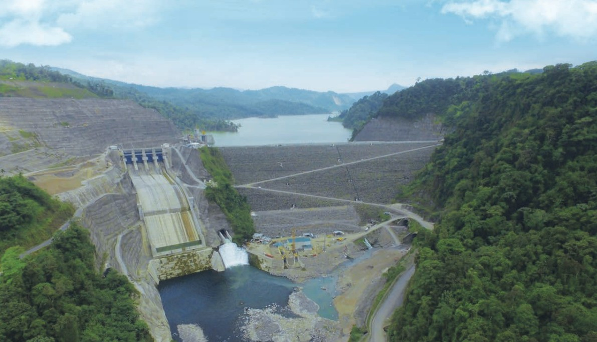
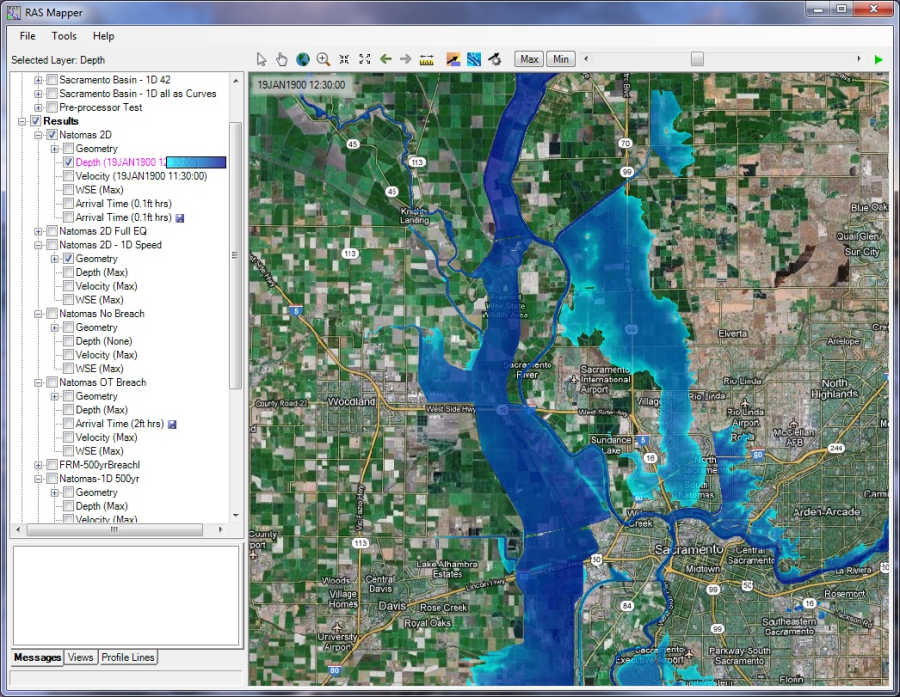

::: {.quote-block}
“El agua es la fuerza motriz de toda la naturaleza.”  
— *Leonardo da Vinci*
:::

## ¿Qué es la hidrología?


La hidrología es la ciencia que estudia el agua en la Tierra: su presencia, circulación, distribución y las interacciones que tiene con el ambiente y las actividades humanas. Como disciplina aplicada, ofrece herramientas fundamentales para el diseño de infraestructura, la gestión del recurso hídrico, la previsión de fenómenos extremos y la planificación territorial.

A lo largo del tiempo, la hidrología ha evolucionado desde enfoques empíricos hacia métodos más rigurosos que integran física, estadística, modelación computacional y análisis de datos. Esta transición ha permitido comprender con mayor detalle los procesos hidrológicos y mejorar la capacidad predictiva de modelos de lluvia–escorrentía, caudales ambientales, recarga de acuíferos y eventos extremos.

## Enfoque multidisciplinario

Es multidisciplinaria, e incluye profesionales en geografía, ambiente, ingeniería, y ciencias sociales.

## Concepto de hidrología

La hidrología se define tradicionalmente como el estudio de las aguas continentales y sus procesos asociados. En términos más amplios, convierte los fenómenos relacionados con el agua en sistemas cuantificables, susceptibles de ser analizados mediante técnicas físicas, empíricas o estadísticas.

Algunos elementos clave en su estudio incluyen:

- La variabilidad temporal y espacial de la precipitación.
- El comportamiento de las cuencas hidrográficas.
- La generación de escorrentía superficial.
- La infiltración y recarga de acuíferos.
- El transporte de sedimentos.
- La interacción con sistemas climáticos y atmosféricos.

## Importancia en la ingeniería civil

La hidrología aplicada constituye un pilar para el diseño de obras de infraestructura como:

- Sistemas pluviales y drenajes urbanos.
- Puentes y alcantarillas.
- Presas, embalses y canales.
- Obras fluviales para control de inundaciones.
- Evaluación y mitigación de amenazas hidrometeorológicas.
- Análsis de variación por cambio climático.

```{r}
#| label: fig-DRAT
#| fig-cap: "P.H. Reventazón. .<br><span style='font-size:0.8em;'>Fuente: [@ICE_CostaRica].</span>"
#| fig-align: center
#| out-width: 100%
#| echo: false
#| class: fig-border


```

Un adecuado entendimiento del comportamiento hidrológico permite estimar caudales de diseño, tiempos de concentración, hidrogramas sintéticos, niveles de inundación y otros parámetros esenciales.

## Relación con el ciclo hidrológico

El ciclo hidrológico representa el movimiento continuo del agua en la Tierra y es la base conceptual sobre la cual se desarrollan los análisis hidrológicos. Incluye procesos como:

- Evaporación y transpiración
- Condensación y formación de nubes
- Precipitación
- Infiltración y percolación
- Escorrentía superficial
- Flujo subterráneo
- Retorno al océano

La comprensión de esta cadena de procesos permite modelar las respuestas hidrológicas ante eventos de lluvia, cambios en el uso del suelo o alteraciones climáticas.

## Desarrollo histórico de la hidrología

::: {.timeline}

::: {.timeline-item}
<div class="timeline-era">≤ Siglo XV</div>
<div class="timeline-title">Especulación y primeras descripciones del ciclo hidrológico</div>

- Filósofos persas, chinos, indios y griegos reflexionan sobre el movimiento del agua en los ríos y su origen.
- Se plantean las primeras ideas sobre la relación entre lluvia, escorrentía y cuerpos de agua.
- Durante el Renacimiento, científicos europeos elaboran **las primeras descripciones coherentes del ciclo hidrológico**, basadas en observaciones sistemáticas de la naturaleza.
:::

::: {.timeline-item}
<div class="timeline-era">Siglos XVII–XVIII</div>
<div class="timeline-title">Inicio de la medición y la experimentación</div>

- Se desarrollan las primeras mediciones sistemáticas de **caudales** (por ejemplo, en el río Sena, Francia).
- Comienza la medición continua de **precipitación** en Inglaterra y de evaporación en el Mediterráneo.
- Se formaliza la **hidráulica experimental**, con aportes clave de Bernoulli, Chézy y otros investigadores.
:::

::: {.timeline-item}
<div class="timeline-era">Siglo XIX</div>
<div class="timeline-title">Desarrollo de principios en hidrología e hidráulica</div>

- **Ley de Dalton (1802):** descripción de la evaporación.
- **Ecuación de Hagen–Poiseuille (1840):** flujo laminar en capilares.
- **Ecuación Darcy–Weisbach (1845):** flujo en tuberías.
- **Método racional (Mulvaney, 1850):** cálculo de caudales de escorrentía a partir de la precipitación.
- **Ecuación de Darcy (1856):** flujo en medios porosos saturados.
- Pronósticos del tiempo basados en barómetros de Fitzroy (década de 1850).
- Construcción del alcantarillado de Londres (Bazalgette, 1875) como hito de la ingeniería sanitaria.
- **Ecuación de Manning (1891):** descripción del flujo en canales abiertos.
:::

::: {.timeline-item}
<div class="timeline-era">Siglo XX</div>
<div class="timeline-title">Consolidación de la hidrología cuantitativa</div>

- **Ecuación de Green y Ampt (1911):** modelo de infiltración en suelos.
- **Curvas de frecuencia (Hazen, 1914):** análisis probabilístico de crecientes máximas.
- **Ecuación de Richards (1931):** flujo en medio poroso parcialmente saturado.
- **Hidrograma unitario (Sherman, 1932):** conversión de precipitación en escorrentía.
- **Ecuación de Theis (1935):** flujo en acuíferos confinados.
- **Leyes de Horton (1945):** descripción morfológica y funcional de cuencas.
- **Gumbel (1958):** fundamentos de la teoría de valores extremos aplicados a hidrología.
:::

::: {.timeline-item}
<div class="timeline-era">Siglos XX → XXI</div>
<div class="timeline-title">Evolución hacia modelos numéricos y sistemas integrados</div>

A partir de la década de 1950, los modelos conceptuales se complementan y, en muchos casos, se reemplazan por herramientas numéricas basadas en principios físicos:

- Modelos de la **familia SHE** (Systems Hydrological European).
- **MCG** y otros modelos de simulación continua.
- Integración de modelos hidrológicos y atmosféricos.

Surgen además:

- La **operación de sistemas en tiempo real** para la gestión de embalses, drenajes urbanos y alertas de inundación.
- La hidrología moderna como **ciencia interdisciplinaria y global**, apoyada por informática, teledetección, sensores automáticos y análisis estadístico avanzado.
:::

:::


## Hidrología y estadística

Los fenómenos hidrológicos presentan una fuerte variabilidad e incertidumbre, lo cual hace que el análisis estadístico sea indispensable. Entre las aplicaciones más relevantes destacan:

- Ajuste de distribuciones de probabilidad para eventos extremos.
- Análisis de series temporales de caudales y precipitaciones.
- Métodos de regionalización hidrológica.
- Modelos de regresión para predicción hidrológica.
- Técnicas de agrupamiento (clustering) para clasificar patrones hidrológicos.

El uso de herramientas estadísticas y computacionales modernas permite mejorar la precisión y robustez de los análisis hidrológicos.

## Caso aplicado

Las inundaciones son uno de los fenómenos hidrológicos más relevantes desde el punto de vista de riesgo y planificación. Comprender sus causas, magnitudes y recurrencia permite diseñar soluciones adecuadas para reducir pérdidas materiales y proteger vidas humanas.

```{r}
#| label: fig-inundacion
#| fig-cap: "Modelado de inundaciones. <br><span style='font-size:0.8em;'>Fuente: [@USACE_HECRAS].</span>"
#| fig-align: center
#| out-width: 100%
#| echo: false
#| class: fig-border

```

## Hidrología en Costa Rica

La hidrología aplicada en Costa Rica se apoya en una red diversa de instituciones públicas, académicas, privadas e internacionales que realizan mediciones, investigación y gestión del recurso hídrico.

<div class="cr-hidro-grid">

<div class="cr-card cr-public">
<h3>ICE</h3>
<p>
Ente rector de la producción eléctrica de Costa Rica. Ha desarrollado mediciones de <strong>precipitación y caudal</strong>, así como investigación y modelado hidrológico para el diseño, construcción y operación de obras hidroeléctricas en el país. Proyectos notables incluyen Reventazón, Arenal, Cachí y Pirrís.
</p>
<p class="cr-card-foot">
Otros actores relacionados: Ministerio de Salud, SETENA y municipalidades.
</p>
</div>

<div class="cr-card cr-public">
<h3>SENARA</h3>
<p>
Ente rector del uso de los recursos hídricos subterráneos. Aplica la hidrología y la hidrogeología para el diseño y operación de sistemas de <strong>riego, drenaje y aprovechamiento de aguas subterráneas</strong>.
</p>
</div>

<div class="cr-card cr-public">
<h3>AyA</h3>
<p>
Ente rector del abastecimiento y tratamiento de agua potable. Realiza mediciones hidrológicas e investigación aplicada para el <strong>abastecimiento de agua</strong> y el <strong>tratamiento de aguas residuales</strong>. Opera sistemas clave como el suministro de agua para el Gran Área Metropolitana y la Planta de Tratamiento Los Tajos.
</p>
</div>

<div class="cr-card cr-public">
<h3>MINAE</h3>
<p>
Ministerio encargado de la conservación y uso sostenible de los <strong>recursos hídricos, costeros y marinos</strong>. Define políticas, regula el aprovechamiento del agua y articula esfuerzos de conservación.
</p>
</div>

<div class="cr-card cr-public">
<h3>IMN</h3>
<p>
Dirección del MINAE y ente científico que coordina las <strong>actividades meteorológicas</strong> del país. Estudia el clima y el tiempo, genera pronósticos y emite alertas ante condiciones y fenómenos atmosféricos extremos.
</p>
</div>

<div class="cr-card cr-public">
<h3>CNE</h3>
<p>
Ente del gobierno responsable de la atención de <strong>emergencias hidrometeorológicas</strong> como inundaciones, deslizamientos y tormentas, en coordinación con las demás instituciones del Sistema Nacional de Gestión del Riesgo.
</p>
</div>

<div class="cr-card cr-academic">
<h3>Universidades públicas y centros de investigación</h3>
<p>
<strong>UCR:</strong> Ingeniería Civil, Ingeniería en Biosistemas, Geología, Geografía, Meteorología (Física), CIMAR, IMARES, CIGEFI, CIEDES, OACG.  
<strong>ITCR:</strong> Ingeniería Agrícola, Ingeniería Ambiental.  
<strong>UNA:</strong> Ingeniería Hidrológica, Escuela de Geografía, Laboratorio de Hidrología Ambiental.  
<strong>Otros centros:</strong> EARTH, IICA, CATIE, entre otros.
</p>
</div>

<div class="cr-card cr-private">
<h3>Sector privado y consultoría</h3>
<p>
<strong>Consultores nacionales e internacionales</strong> desarrollan estudios hidrológicos para proyectos de infraestructura, ordenamiento territorial y gestión del riesgo.  
<strong>Desarrolladores hidroeléctricos privados</strong> participan en el diseño y operación de proyectos de generación eléctrica.  
El <strong>sector productivo agrícola</strong> (por ejemplo, bananeras y piñeras) utiliza información hidrológica para riego, drenaje y manejo de inundaciones.
</p>
</div>

</div>

<p class="cr-international-note">
Varios programas y entes de las Naciones Unidas 
(por ejemplo, <strong>UNESCO</strong>, <strong>OMM</strong>, <strong>UN-Water</strong>) 
cumplen roles internacionales de coordinación, generación de lineamientos técnicos 
e impulso de la investigación en recursos hídricos.
</p>

