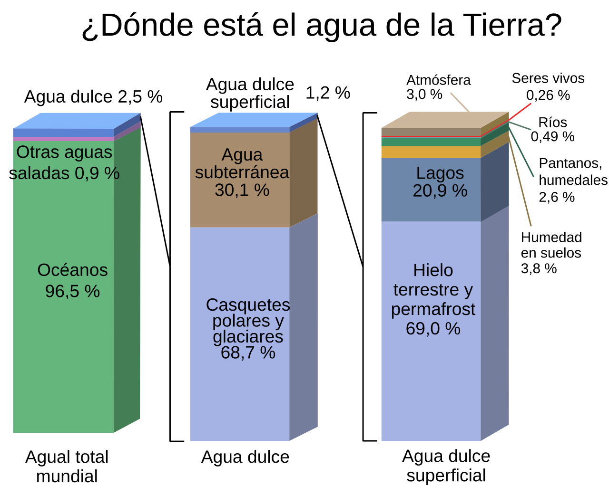
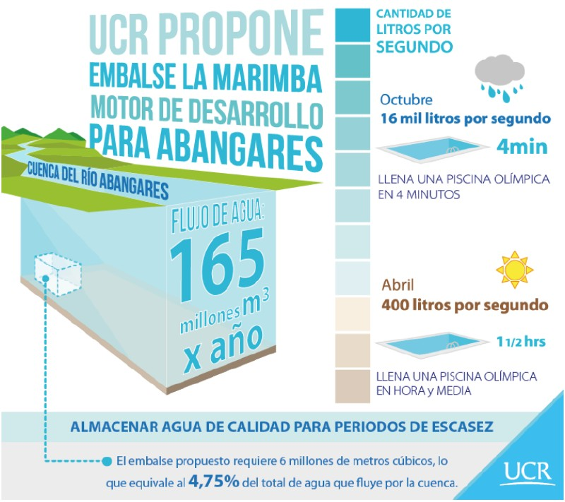
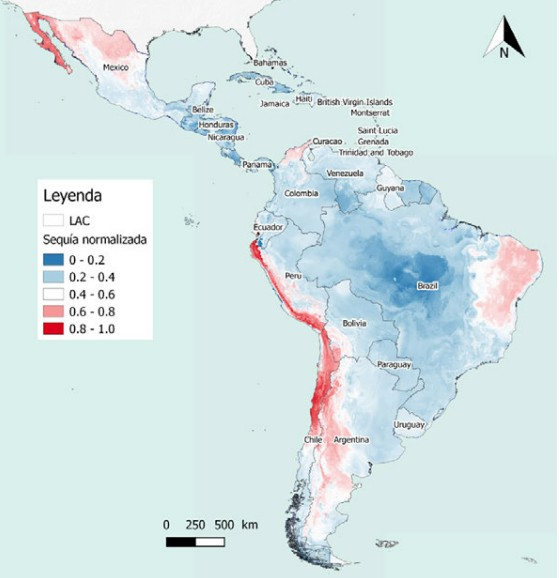
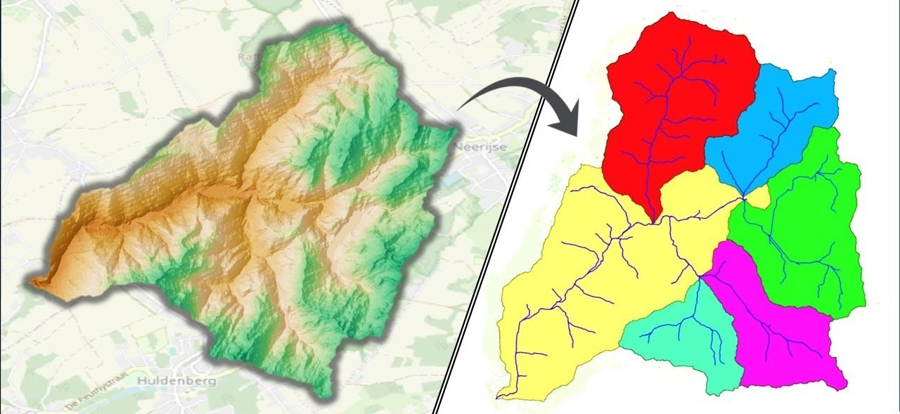
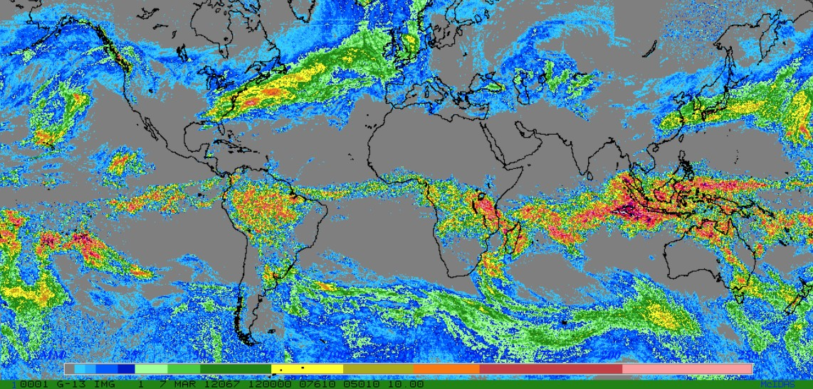
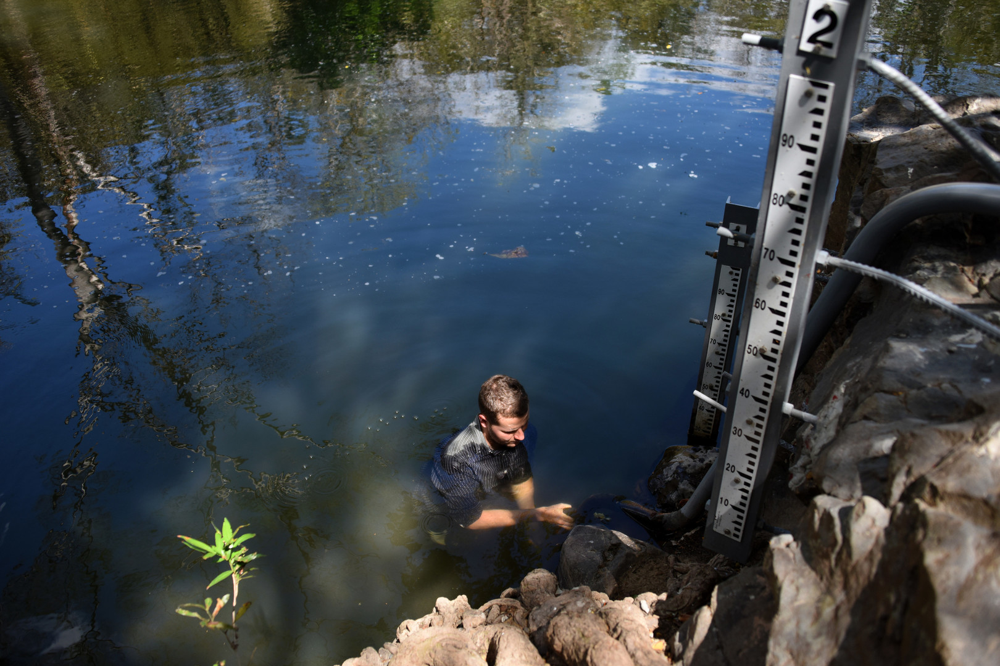
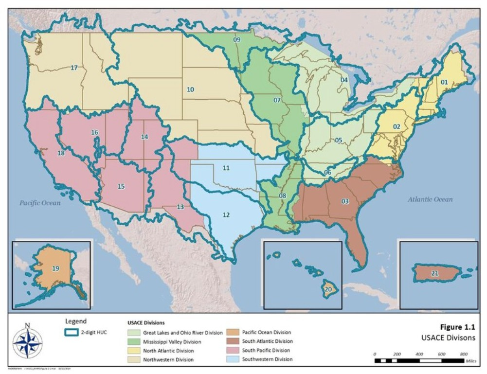
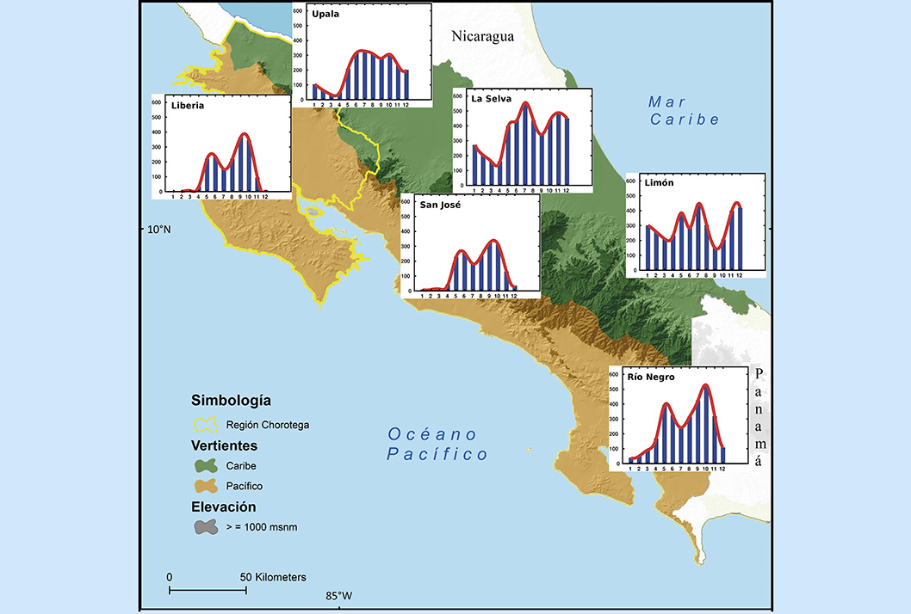
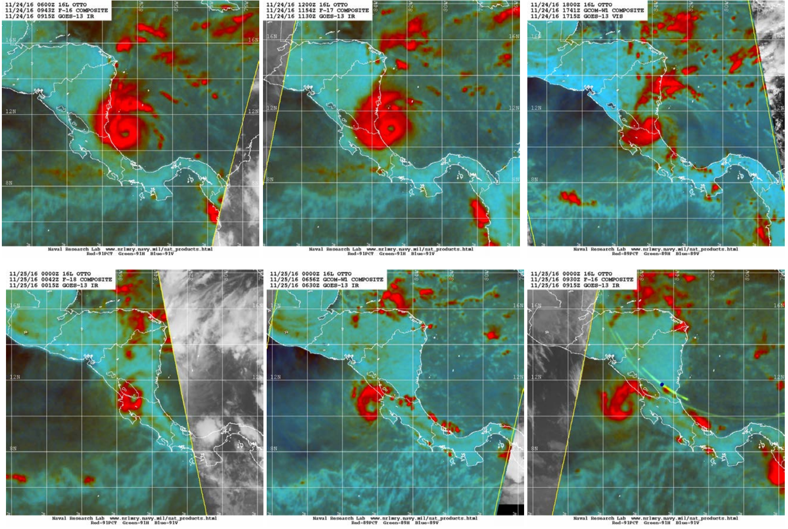
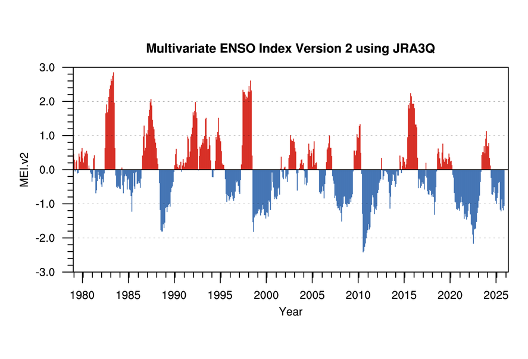

::: quote-block
“Nunca sabremos el valor del agua hasta que el pozo esté seco.”\
— *Thomas Fuller (1608-1661)*
:::

### Importancia del agua y su función en la Tierra

El agua es un componente esencial de la vida y desempeña un papel crucial en el funcionamiento de los sistemas naturales y antrópicos. Regula el clima, participa en los ciclos biogeoquímicos, permite el transporte de sedimentos, nutrientes y energía, y controla la estructura y distribución de los ecosistemas.

La totalidad del agua contenida en la atmósfera, el suelo, los océanos y la corteza terrestre constituye la hidrósfera. De este volumen, <span class="firebrick"><strong>únicamente alrededor del 2.5 % corresponde a agua dulce</strong></span>, y tan solo una fracción mínima se encuentra disponible para su aprovechamiento directo.


```{r}
#| label: fig-hidrosfera
#| fig-cap: "Esquema general de la hidrósfera y principales reservorios de agua.<br><span style='font-size:0.8em;'>Fuente: [@usgsHydrosphere]</span>"
#| fig-align: center
#| out-width: 100%
#| echo: false
#| class: fig-border



```

## Distribución global del agua

La mayor parte del agua del planeta se encuentra almacenada en los océanos (≈96.5 %). El agua dulce, aunque esencial para los ecosistemas terrestres y para las actividades humanas, representa una fracción muy reducida del total.

Dentro del agua dulce, los principales reservorios corresponden a glaciares, casquetes polares y aguas subterráneas profundas; mientras que los cuerpos de agua superficial —ríos, lagos y humedales— corresponden a menos del **0.5 % del agua dulce total**.

```{r}
#| label: tbl-distribucion-agua
#| tbl-cap: "Volumen, porcentaje y tiempo de residencia de los principales reservorios de agua en la Tierra."
#| echo: false
#| message: false
#| warning: false

library(dplyr)
library(kableExtra)
library(tibble)

tabla_agua <- tribble(
  ~`Fuente de agua`, ~`Volumen`, ~`Porcentaje del total`, ~`Porcentaje del agua dulce`, ~`Tiempo de residencia (años)`,
  "Aguas superficiales",        "47.971.710",        3.5,    NA,    "Todas las aguas superficiales: 4.0<br>0.05 (17 días)",
  "Lagos (dulces)",             "91.000",            0.007,  0.26,  "Todas las aguas superficiales: 4.0<br>0.05 (17 días)",
  "Lagos (salobres)",           "85.400",            0.006,  NA,    "Todas las aguas superficiales: 4.0<br>0.05 (17 días)",
  "Ríos",                       "2.120",             0.0002, 0.006, "Todas las aguas superficiales: 4.0<br>0.05 (17 días)",
  "Pantanos",                   "11.470",            0.0008, 0.03,  "Todas las aguas superficiales: 4.0<br>0.05 (17 días)",
  "Humedad del suelo",          "16.500",            0.0012, 0.05,  "Todas las aguas subterráneas: 20.000",
  "Agua subterránea dulce*",    "10.530.000*",       0.76,   30.1,  "Todas las aguas subterráneas: 20.000",
  "Agua subterránea salobre",   "12.870.000",        0.93,   NA,    "Todas las aguas subterráneas: 20.000",
  "Agua biológica",             "1.120",             0.0001, 0.003, "",
  "Hielo polar y glaciares",    "24.364.100",        1.76,   69.6,  "",
  "Atmósfera",                  "12.900",            0.001,  0.04,  "0.02 (8 días)",
  "Océanos",                    "1.338.000.000",     96.5,   NA,    "2.650",
  "Total",                      "1.385.984.610",     100.0,  100.0, ""
)

tabla_agua %>%
  kbl(
    booktabs = TRUE,
    format = "html",
    align = c("l", "c", "c", "c", "c"),
    escape = FALSE,
    na = "",
    col.names = c(
      "Fuente de agua",
      "Volumen (km<sup>3</sup>)",
      "Porcentaje del total",
      "Porcentaje del agua dulce",
      "Tiempo de residencia (años)"
    ),
    caption = "Distribución del agua en la Tierra: volúmenes, porcentajes y tiempos de residencia."
  ) %>%
  kable_classic(html_font = "Latin Modern Roman") %>%
  kable_styling(
    full_width = FALSE,
    bootstrap_options = c("hover", "condensed", "striped")
  ) %>%
  row_spec(0, bold = TRUE) %>%
  row_spec(c(1, 6, 11, 12, 13), bold = TRUE) %>%
  row_spec(c(2, 3, 7, 8), italic = TRUE) %>%
  row_spec(5, extra_css = "border-bottom: 2px solid black;") %>%
  row_spec(8, extra_css = "border-bottom: 2px solid black;") %>%
  collapse_rows(
    columns = 5,
    valign = "middle"
  )


```

[**Fuente:** @maidment1993handbook]{style="font-size: 0.8em;"}

## Disponibilidad efectiva del recurso hídrico

La disponibilidad del agua no depende únicamente del volumen total almacenado en la hidrósfera, sino también de su accesibilidad física, calidad, variabilidad temporal y de las capacidades técnicas, institucionales y económicas de cada región para captarla, almacenarla y distribuirla.

En términos hidrológicos, la disponibilidad se entiende como la porción del recurso que puede ser aprovechada de manera sostenible considerando:

-   la oferta natural (precipitación, escorrentía, almacenamiento superficial y subterráneo),
-   la demanda (doméstica, agrícola, industrial y ambiental),
-   las limitaciones hidrogeológicas (permeabilidad, gradientes, recarga),
-   y las restricciones ecológicas, como los caudales ambientales necesarios para mantener los ecosistemas acuáticos.

Esta perspectiva explica por qué, pese a la existencia de agua suficiente a escala planetaria, millones de personas experimentan estrés hídrico cada año.

## Variabilidad espacial del recurso hídrico

La distribución del agua dulce accesible varía de forma significativa entre regiones. Esta heterogeneidad está controlada por patrones climáticos de gran escala, la presencia de cadenas montañosas, las corrientes oceánicas y la dinámica estacional de la precipitación.

En términos generales se distinguen tres grandes patrones espaciales:

-   Regiones húmedas y tropicales, con alta precipitación anual y recarga abundante (por ejemplo, cuencas amazónica, congoleña y del sudeste asiático).
-   Regiones semiáridas, donde la precipitación es estacional o limitada (por ejemplo, cuencas del Mediterráneo, sur de África y parte de Centroamérica).
-   Regiones áridas, donde la evaporación supera ampliamente la precipitación (por ejemplo, norte de África, Medio Oriente y Australia central).

La heterogeneidad climática y fisiográfica determina la disponibilidad natural de agua en las cuencas y condiciona el desarrollo humano, la agricultura, la industria y los ecosistemas.

## Conceptos operativos: recurso, disponibilidad y accesibilidad

En el análisis hidrológico aplicado es indispensable diferenciar entre conceptos que suelen emplearse como sinónimos, pero que representan realidades distintas desde el punto de vista técnico y de gestión:

-   <u>Disponibilidad hídrica:</u> fracción del recurso que puede ser utilizada de forma efectiva dentro de un horizonte espacial y temporal definido, considerando su renovación natural y las restricciones físicas del sistema.
-   <u>Recurso hídrico:</u> volumen total de agua presente en un sistema natural o artificial, independientemente de su uso o accesibilidad (océanos, glaciares, acuíferos, lagos, ríos, embalses).
-   <u>Accesibilidad:</u> condición que limita o habilita la disponibilidad en función de infraestructura, tecnología, costos económicos, marco legal e institucional. 


Esta distinción permite explicar por qué regiones con abundantes recursos hídricos pueden enfrentar problemas de abastecimiento, mientras que otras con recursos limitados logran cubrir sus demandas mediante una gestión eficiente.

Tal es el caso de la región Pacífico Norte de Costa Rica, la cual se caracteriza por una marcada estacionalidad hidrológica. En esta región se presentan periodos prolongados de escasa precipitación durante la estación seca, contrastados con una elevada disponibilidad natural de agua durante la estación lluviosa. Sin embargo, pese a la abundancia relativa del recurso en ciertos meses del año, la accesibilidad al agua es limitada, debido a la concentración temporal de las lluvias, la insuficiente capacidad de almacenamiento y regulación, así como a restricciones de infraestructura y gestión. Esta combinación explica la ocurrencia recurrente de situaciones de escasez hídrica, aun en contextos donde el volumen total de agua no es necesariamente bajo.

```{r}
#| label: fig-marimba
#| fig-cap: "Estacionalidad del río Abangares, Guanacaste.<br><span style='font-size:0.8em;'>Fuente: [@CIEDES_UCR]</span>"
#| fig-align: center
#| out-width: 100%
#| echo: false
#| class: fig-border



```

## Escalas espaciales y temporales de la disponibilidad

La disponibilidad del agua depende de manera crítica de la escala de análisis adoptada:

-   <u>Escala global:</u> permite identificar la distribución general del agua y los grandes contrastes planetarios.
-   <u>Escala regional o nacional:</u> integra factores climáticos, fisiográficos y de gestión.
-   <u>Escala de cuenca hidrográfica:</u> constituye la escala fundamental para la ingeniería civil, ya que en ella se concentran los procesos hidrológicos relevantes para el diseño y la planificación.
-   <u>Escala temporal:</u> la disponibilidad puede evaluarse a nivel anual, estacional, mensual o incluso diario, dependiendo del objetivo del estudio.


```{r}
#| label: fig-sequia
#| fig-cap: "Sequía normalizada en América Latina y el Caribe.<br><span style='font-size:0.8em;'>Fuente: [@UNESCO_AtlasSequia2018]</span>"
#| fig-align: center
#| out-width: 100%
#| echo: false
#| class: fig-border



```

### Escalas temporales de la disponibilidad

Las series de tiempo hidrológicas, tales como la precipitación y el caudal, suelen observarse y registrarse en intervalos que van desde segundos, minutos u horas hasta días, semanas, meses, estaciones o años. La relevancia de cada componente del ciclo hidrológico está estrechamente ligada a la escala temporal considerada, la cual resulta crítica al momento de simular el ciclo completo o alguno de sus procesos individuales.

Los tiempos de residencia del agua varían de manera significativa según el componente del sistema hidrológico:

-   <u>Agua subterránea</u>: puede permanecer almacenada durante periodos muy prolongados, que van desde aproximadamente 1 400 hasta más de 10 000 años.
-   <u>Humedad del suelo:</u> presenta tiempos de residencia típicamente del orden de 1 año.
-   <u>Red de cauces:</u> el agua que circula en los ríos tiene un tiempo de residencia promedio cercano a 16 días.
-   <u>Atmósfera:</u> el tiempo de residencia es relativamente corto, del orden de 8 días o aproximadamente una semana.

En la modelación hidrológica, la selección del **intervalo de tiempo de cálculo ($\Delta t$)** debe ser lo suficientemente pequeño para capturar la variabilidad relevante de los procesos, pero sin generar una carga excesiva en la recopilación de datos ni en el esfuerzo computacional. Por ejemplo, las predicciones de caudal para grandes embalses de abastecimiento de agua pueden realizarse adecuadamente utilizando intervalos semanales o mensuales, mientras que otros estudios para diseño de puentes requieren resoluciones temporales mucho más finas.

### Escalas espaciales de la disponibilidad

Las escalas espaciales relevantes en la investigación hidrológica incluyen, entre otras:

-   la ladera,
-   la cuenca hidrográfica,
-   la región,
-   el continente,
-   y la escala global.

Los Sistemas de Información Geográfica (SIG) constituyen herramientas fundamentales para el almacenamiento, análisis y manipulación de información espacial asociada a estas escalas.

```{r}
#| label: fig-qgis_hidro
#| fig-cap: "Uso de SIG en hidrología.<br><span style='font-size:0.8em;'>Fuente: [@QGIS_Development_Team_2024]</span>"
#| fig-align: center
#| out-width: 100%
#| echo: false
#| class: fig-border



```

A escala global, los sistemas de observación satelital proporcionan cobertura continua y de amplia extensión, con resoluciones espaciales típicamente del orden de algunos kilómetros para sensores en el visible e infrarrojo, y de decenas de kilómetros para sensores de microondas pasivas. En la modelación hidrológica, la resolución espacial adoptada determina el grado de variabilidad que se incorpora explícitamente en el modelo.

```{r}
#| label: fig-ospo
#| fig-cap: "Observación satelital de la precipitación.<br><span style='font-size:0.8em;'>Fuente: [@NOAA_OSPO]</span>"
#| fig-align: center
#| out-width: 100%
#| echo: false
#| class: fig-border



```

Los requisitos de datos para lograr una predicción confiable aumentan conforme disminuyen las escalas espacial y temporal. A escalas pequeñas, la <span class="firebrick"><strong>heterogeneidad</strong></span> y la <span class="firebrick"><strong>complejidad</strong></span> de los procesos hidrológicos son mucho más marcadas, lo que demanda un volumen considerablemente mayor de información para su adecuada representación. En contraste, a escalas espaciales mayores (escala sinóptica^[La escala sinóptica se refiere a fenómenos atmosféricos de gran extensión espacial (del orden de cientos a miles de kilómetros) y con duraciones típicas de varios días, como frentes, ciclones y sistemas de alta y baja presión.]), dicha heterogeneidad tiende a integrarse y promediarse, lo cual simplifica la respuesta hidrológica del sistema.

### Desafíos en la medición y predicción de la disponibilidad

Uno de los principales desafíos en la determinación de la disponibilidad del recurso hídrico, radica en que los procesos hidrológicos ocurren a escalas espaciales y temporales que no siempre coinciden con las escalas de medición u observación. Esto dificulta, por ejemplo, la extrapolación de una medición puntual, como por ejemplo, la precipitación registrada en un pluviómetro a toda el área de una cuenca hidrográfica.

```{r}
#| label: fig-isoyeta
#| fig-cap: "Mapa de isoyetas.<br><span style='font-size:0.8em;'>Fuente: [@IMN_CostaRica]</span>"
#| fig-align: center
#| out-width: 100%
#| echo: false
#| class: fig-border

knitr::include_graphics("assets/img/isoyetas.jpg")

```

Para enfrentar la escasez de datos, se emplea con frecuencia una estrategia jerárquica de adquisición de información, en la cual los conjuntos de datos globales proporcionan información generalizada a bajo costo, mientras que los datos de alta resolución a escala local requieren campañas de medición específicas y presentan costos significativamente mayores.

```{r}
#| label: fig-aforo
#| fig-cap: "Aforo de caudales.<br><span style='font-size:0.8em;'>Fuente: [@CIEDES_UCR]</span>"
#| fig-align: center
#| out-width: 100%
#| echo: false
#| class: fig-border



```

En este contexto, la regionalización hidrológica surge como un enfoque multiescala que permite identificar unidades hidrológicas similares y estimar la respuesta hidrológica en cuencas sin mediciones directas, apoyándose en información disponible de cuencas análogas. 

```{r}
#| label: fig-region
#| fig-cap: "Regiones hidrológicas homogéneas.<br><span style='font-size:0.8em;'>Fuente: [@USACE_IWR]</span>"
#| fig-align: center
#| out-width: 100%
#| echo: false
#| class: fig-border



```

En esencia, la escala actúa como un lente en hidrología: una visión amplia, correspondiente a escalas globales o anuales, ofrece promedios simples y suavizados; mientras que una visión cercana, asociada a escalas locales o de alta resolución temporal, se asocia a la compleja y altamente variable disponibilidad del agua.

## Disponibilidad y calidad del agua

La disponibilidad efectiva del recurso hídrico no depende únicamente de la cantidad de agua, sino también de su **calidad**. En muchos sistemas, la presencia de contaminantes físicos, químicos o biológicos limita el uso del agua para determinados fines.

Entre los factores más relevantes se incluyen:

-   salinidad y mineralización,
-   presencia de contaminantes orgánicos o metales pesados,
-   carga de sedimentos,
-   temperatura del agua.

Estas restricciones reducen la fracción del recurso que puede considerarse disponible para consumo humano, riego, industria o preservación ambiental, incluso en regiones con abundancia hídrica.

## Variabilidad espacial del recurso hídrico

La disponibilidad del agua presenta una marcada heterogeneidad espacial, controlada por:


- <u>Patrones climáticos regionales</u>, por ejemplo, la influencia de la Zona de Convergencia Intertropical en Centroamérica, que genera contrastes significativos entre regiones húmedas del Caribe y regiones más secas del Pacífico Norte.
- <u>Relieve y orografía</u>, como la presencia de cordilleras que inducen lluvias orográficas en las laderas de barlovento y condiciones más secas en sotavento, tal como ocurre en la vertiente Caribe y Pacífica de Costa Rica.

- <u>Cercanía a cuerpos de agua mayores</u>, donde regiones próximas a océanos, grandes lagos o embalses presentan mayor disponibilidad potencial de humedad y, en algunos casos, una regulación natural del recurso, en comparación con zonas continentales alejadas.

- <u>Características geológicas e hidrogeológicas</u>, tales como la presencia de acuíferos de alta permeabilidad en formaciones volcánicas o aluviales, frente a zonas con rocas poco permeables que limitan la infiltración y el almacenamiento subterráneo.

Como resultado, cuencas vecinas pueden exhibir comportamientos hidrológicos muy distintos.

## Variabilidad temporal y confiabilidad del recurso

Desde el punto de vista de la gestión y el diseño, la disponibilidad debe analizarse considerando su variabilidad temporal:

-   **Estacionalidad:** concentración de la precipitación en pocos meses del año.

```{r}
#| label: fig-estacionalidad
#| fig-cap: "Estacionalidad de Costa Rica.<br><span style='font-size:0.8em;'>Fuente: [@UCR_Fisica]</span>"
#| fig-align: center
#| out-width: 100%
#| echo: false
#| class: fig-border



```

-   **Eventos extremos:** sequías meteorológicas e hidrológicas.

```{r}
#| label: fig-otto
#| fig-cap: "Impacto del huracán Otto en Costa Rica.<br><span style='font-size:0.8em;'>Fuente: [@NOAA_OSPO]</span>"
#| fig-align: center
#| out-width: 100%
#| echo: false
#| class: fig-border



```

-   **Persistencia temporal:** ocurrencia de varios años consecutivos con déficit o superávit hídrico.

```{r}
#| label: fig-enos
#| fig-cap: "El Niño-Oscilación del Sur.<br><span style='font-size:0.8em;'>Fuente: [@NOAA_PSL]</span>"
#| fig-align: center
#| out-width: 100%
#| echo: false
#| class: fig-border



```

Estas características determinan la confiabilidad del recurso, entendida como la capacidad de satisfacer una demanda específica a lo largo del tiempo, concepto fundamental para la planificación de infraestructuras hidráulicas.


## Implicaciones para la ingeniería civil

La correcta evaluación de la disponibilidad hídrica es esencial para:

-   el diseño de sistemas de abastecimiento de agua potable,
-   la planificación de sistemas de riego,
-   la gestión de embalses y obras de regulación,
-   la evaluación de proyectos hidroeléctricos,
-   la mitigación del riesgo asociado a sequías.

Una interpretación inadecuada de la disponibilidad puede conducir a diseños sobredimensionados o subdimensionados, fallas operativas y conflictos en el uso del recurso.

<div style="text-align:center; margin:1.5em 0;">
<iframe width="560" height="315"
src="https://www.youtube.com/embed/80ouyucpxHE"
title="YouTube video player"
frameborder="0"
allow="accelerometer; autoplay; clipboard-write; encrypted-media; gyroscope; picture-in-picture"
allowfullscreen>
</iframe>
</div>

