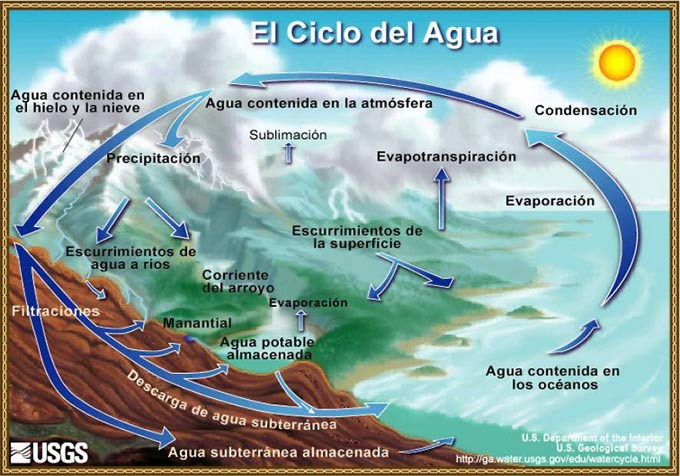
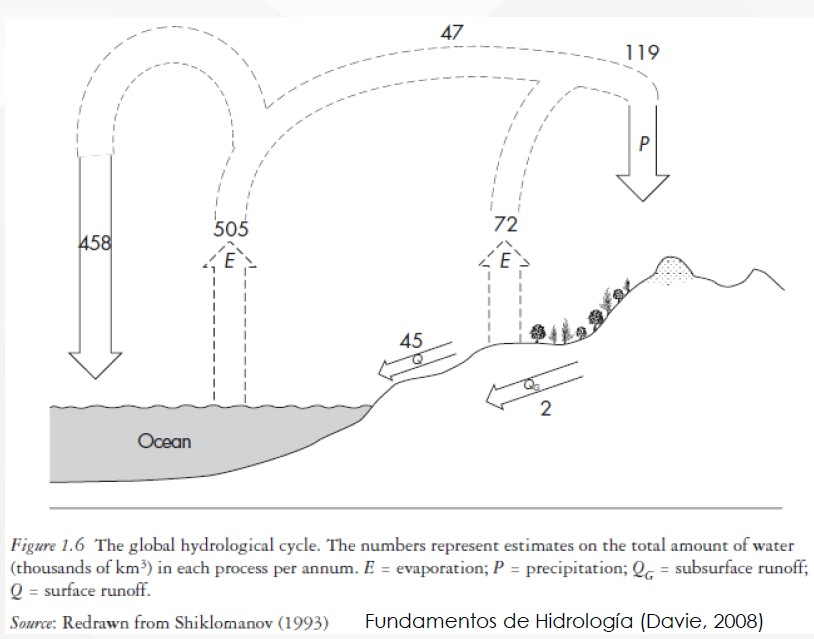
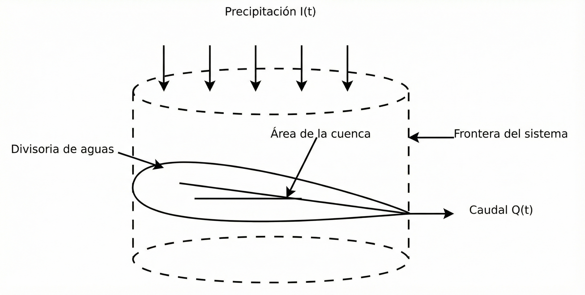
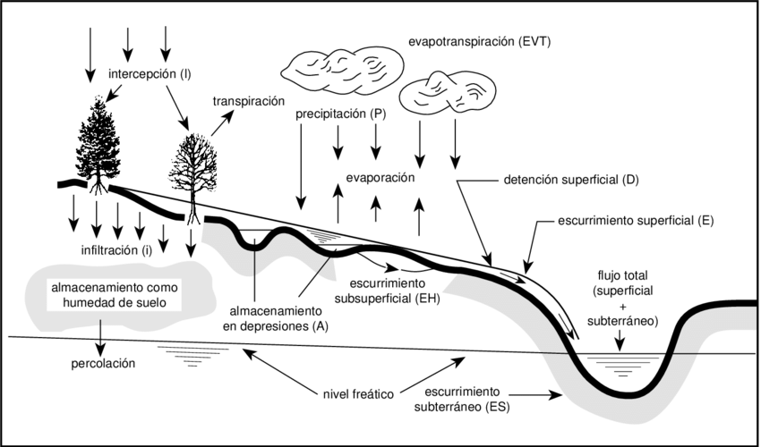
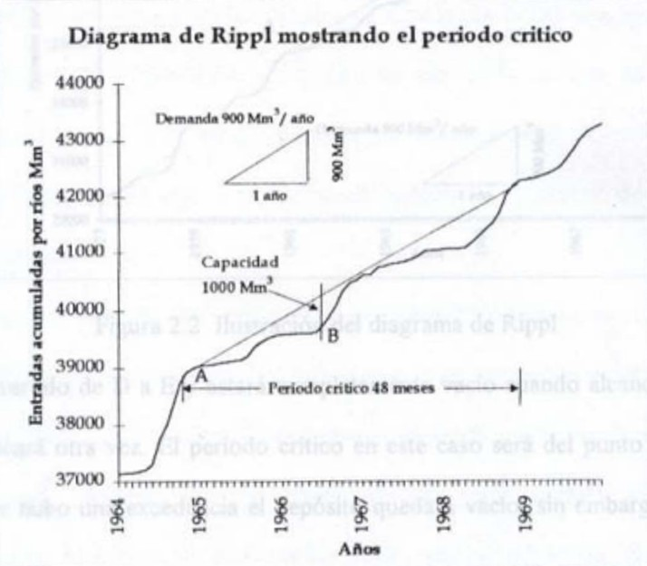

::: {.quote-block}
“Olvidamos que el ciclo del agua y el ciclo de la vida son uno solo.”\
— *Jacques Cousteau*
:::

## Fundamentos conceptuales del ciclo hidrológico

El ciclo hidrológico describe la circulación continua del agua en la Tierra, conectando la atmósfera, la superficie terrestre, el subsuelo y los océanos. Este ciclo es impulsado fundamentalmente por dos fuerzas: la <span class="firebrick"><strong>energía solar</strong></span>, que gobierna los procesos de evaporación y evapotranspiración, y la <span class="firebrick"><strong>gravedad</strong></span>, responsable del movimiento del agua en forma de precipitación, escorrentía superficial y flujo subterráneo.

La hidrosfera comprende el conjunto total de aguas presentes en la Tierra en sus distintos estados físicos, incluyendo océanos, ríos, lagos, glaciares, aguas subterráneas y vapor de agua atmosférico. Se extiende desde unos 15 kilómetros por encima de la atmósfera hasta aproximadamente un kilómetro por debajo de la litosfera o corteza terrestre.

La hidrosfera se comporta como un sistema dinámico e interconectado, en el cual el agua circula de manera continua entre diferentes compartimentos naturales a través de procesos que, en conjunto, constituyen el ciclo hidrológico.

El ciclo hidrológico es el eje central de la hidrología, ya que describe el movimiento continuo del agua dentro del sistema terrestre. Este ciclo no presenta un inicio ni un fin definidos, sino que se desarrolla de manera permanente a través de una serie de procesos físicos interconectados. El agua se evapora principalmente desde los océanos y desde la superficie continental, incorporándose a la atmósfera en forma de vapor. Posteriormente, el vapor de agua es transportado por la circulación atmosférica, se enfría, se condensa y retorna a la superficie terrestre y marina en forma de precipitación.

Una vez que el agua precipita sobre la superficie terrestre, puede seguir distintos caminos. Parte de ella es interceptada por la vegetación, otra fracción fluye sobre el terreno como escorrentía superficial, y otra se infiltra en el suelo, desplazándose como flujo subsuperficial. El agua infiltrada puede percolar a mayores profundidades, recargando los acuíferos, desde donde eventualmente emerge en manantiales o contribuye al caudal de ríos. Tanto el agua interceptada como la escorrentía superficial y el agua almacenada en cuerpos superficiales retornan a la atmósfera mediante evaporación, cerrando así el ciclo y asegurando su continuidad en el tiempo.


En la @fig-balance se detalla el ciclo del agua.

```{r}
#| label: fig-balance
#| fig-cap: "Ciclo hidrológico.<br><span style='font-size:0.8em;'>Fuente: [@usgsHydrosphere]</span>"
#| fig-align: center
#| out-width: 100%
#| echo: false
#| class: fig-border


```

La @fig-cantidad ilustra el ciclo hidrológico global, mostrando los principales flujos de agua entre el océano, la atmósfera y los continentes. Las flechas representan procesos como evaporación, precipitación, escorrentía superficial y flujo subsuperficial, mientras que los valores numéricos indican estimaciones del volumen anual asociado a cada proceso. En conjunto, el esquema evidencia la magnitud de los intercambios de agua a escala planetaria y resalta el papel dominante de los océanos como principal fuente de evaporación dentro del sistema hidrológico global.


```{r}
#| label: fig-cantidad
#| fig-cap: "Ciclo hidrológico global y cantidades de tránsito.<br><span style='font-size:0.8em;'>Tomado de: [@Bob2025]</span>"
#| fig-align: center
#| out-width: 100%
#| echo: false
#| class: fig-border



```


## El sistema hidrológico

Si bien el concepto de cuenca hidrográfica aún no ha sido definido formalmente, su desarrollo y caracterización se abordarán con mayor detalle en el capítulo siguiente. Por el momento, resulta suficiente considerar la cuenca como un sistema hidrológico cerrado, dentro del cual es posible identificar y analizar de manera integrada las entradas, salidas y el almacenamiento de agua.

Para aplicar el balance hídrico^[Es la expresión de la ley de conservación de masa aplicada a un sistema hidrológico durante un intervalo de tiempo específico, y se define como el equilibrio o la contabilidad de todos los recursos hídricos que ingresan a un sistema y de aquellos que salen del mismo. Este concepto fundamental se aplica a cualquier unidad hidrológica definida, como una cuenca hidrográfica, un acuífero, una zona de suelo, un lago o un embalse, etc.], el ciclo hidrológico se conceptualiza como un sistema con entradas, salidas y almacenamiento.

Un sistema hidrológico se define como una estructura o volumen espacial rodeado por una frontera. Las entradas más importantes son generalmente la precipitación, mientras que las salidas generalmente incluyen el caudal y la evaporación. Las fronteras del sistema suelen estar definidas por las divisorias de aguas de una cuenca hidrográfica. 

```{r}
#| label: fig-bhs
#| fig-cap: "Balance hídrico simplificado.<br><span style='font-size:0.8em;'>Fuente: [@SerranoPacheco_IC0808_Hidrologia]</span>"
#| fig-align: center
#| out-width: 100%
#| echo: false
#| class: fig-border



```

El agua almacenada dentro de este sistema incluye:

- **Almacenamiento superficial:** agua en la vegetación (intercepción), depresiones (charcos), lagos, embalses y canales.  
- **Humedad del suelo:** agua retenida en la zona no saturada, disponible para las plantas.  
- **Almacenamiento subterráneo:** agua contenida en acuíferos.

Estos volúmenes de agua almacenada, se pueden ver en la @fig-cantidad.


## Ecuaciones fundamentales

### Conservación de la masa en sistemas hidrológicos

La formulación básica de los procesos hidrológicos se sustenta en la **ecuación de conservación de la masa**, principio físico que establece que la masa no se crea ni se destruye, sino que únicamente se redistribuye dentro de un sistema. En el contexto hidrológico, este principio implica que el agua que ingresa a una cuenca durante un intervalo de tiempo determinado debe corresponder al agua que sale del sistema más la variación del agua almacenada en su interior.

```{r}
#| label: fig-storage
#| fig-cap: "Ciclo del agua a nivel de cuenca.<br><span style='font-size:0.8em;'>Tomado de: [@Bob2025]</span>"
#| fig-align: center
#| out-width: 100%
#| echo: false
#| class: fig-border



```


Desde un punto de vista físico más general, la ley de conservación de la masa establece que la masa solo puede transferirse de un volumen a otro o cambiar de forma. En hidrología, esto significa que el agua se conserva aun cuando experimente transformaciones de estado, por ejemplo, de líquido a vapor o se desplace entre diferentes rutas de circulación dentro del sistema terrestre.

Para aplicar este principio, la cuenca hidrográfica se conceptualiza como un sistema hidrológico definido, en el cual es posible identificar claramente las entradas, las salidas y el almacenamiento de agua. Bajo este concepto, la conservación de la masa se expresa mediante la ecuación de continuidad:

$$
I - O = \Delta S
$$

donde:

- $I$ representa el conjunto de entradas al sistema.
- $O$ el conjunto de salidas.
- $\Delta S$ el cambio en el volumen de agua almacenada dentro de la cuenca durante el intervalo de tiempo considerado.

### Balance hídrico en una cuenca hidrográfica

Según [@SerranoPacheco_IC0808_Hidrologia], el estado inicial (en el instante $t$) de la cuenca, o de una parte de esta, para efectos del balance hídrico puede definirse como la disponibilidad total de agua en las varias posiciones que esta puede asumir, como por ejemplo: volumen de agua circulando en los ríos, arroyos y quebradas; volumen de agua almacenado en lagos, naturales y artificiales; humedad del suelo; agua contenida en los tejidos de los seres vivos; todo lo cual puede definirse también como la disponibilidad hídrica de la cuenca.

Las entradas de agua a la cuenca hidrográfica pueden darse de las siguientes formas:

- **Precipitaciones:** lluvia, nieve, granizo; condensaciones.

- **Aporte de aguas subterráneas** desde cuencas hidrográficas colindantes, en efecto, los límites de los acuíferos subterráneos no siempre coinciden con los límites de los parteaguas que separan las cuencas hidrográficas.

- **Transvase de agua desde otras cuencas**, estas pueden estar asociadas a:
  
  - Descargas de centrales hidroeléctricas cuya captación se sitúa en otra cuenca, esta situación es frecuente en zonas con varios valles paralelos, donde se construyen presas en varios de ellos, y se interconectan por medio de canales o túneles, para utilizar el agua en una única central hidroeléctrica.
  
  - Descarga de aguas servidas de ciudades situadas en la cuenca y cuya captación de agua para uso humano e industrial se encuentra fuera de la cuenca, esta situación es cada vez más frecuente, al crecer las ciudades, el agua limpia debe ser transportada cada vez más lejos, con mucha frecuencia en otras cuencas. Un ejemplo muy significativo de esta situación es la comunidad de San Pablo, en Brasil.

Las salidas de agua pueden darse de las siguientes formas:

- **Evapotranspiración:** de bosques y áreas cultivadas con o sin riego.

- **Evaporación** desde superficies líquidas, como lagos, estanques y pantanos, etc.

- **Infiltraciones profundas** que van a alimentar acuíferos.


## Aplicaciones del balance hídrico en ingeniería

Todo estudio hidrológico desarrollado desde la ingeniería civil, ya sea el análisis de un sistema pluvial a escala local —como el drenaje de una calle—, el estudio hidrológico para el diseño de una represa hidroeléctrica, o la estimación del agua disponible para una captación destinada al consumo humano, tiene como objetivo fundamental **representar y cuantificar procesos del ciclo hidrológico**.

En la práctica, estos estudios no abordan el ciclo hidrológico en su totalidad, sino que se enfocan en reproducir aquellos procesos relevantes para el problema de ingeniería en cuestión. Por ejemplo, en el diseño de obras de control de avenidas se simula principalmente el proceso de **precipitación–escorrentía**, el cual ocurre en escalas temporales cortas, que pueden variar desde pocas horas hasta algunos días. En contraste, para el diseño de sistemas de abastecimiento o captaciones de agua resulta más relevante modelar un balance hídrico, asociado a escalas temporales más largas, que pueden extenderse desde meses hasta varios años.

Desde esta perspectiva, todo análisis hidrológico aplicado en ingeniería civil puede interpretarse como una aplicación del concepto de balance hídrico, entendido como la contabilidad de las entradas, salidas y almacenamiento de agua dentro de un sistema definido. Este enfoque constituye la base de numerosas aplicaciones prácticas, entre las que destacan:

- <u>Gestión y operación de embalses</u>, mediante la ecuación de almacenamiento discreta $$S_t = S_{t-1} + (X_t - Y_t)$$ que permite evaluar la evolución temporal del volumen almacenado.

- <u>Tránsito de crecientes</u>, utilizado para analizar la propagación de crecidas a lo largo de cauces o a través de embalses, empleando métodos hidrológicos, como Muskingum, o métodos hidráulicos basados en las ecuaciones de Saint-Venant.

- <u>Evaluación de aguas subterráneas</u>, donde el balance hídrico permite diferenciar entre una explotación sostenible del recurso y la sobreexplotación de reservas, apoyándose en la Ley de Darcy y en el análisis de pruebas de bombeo.


## Importancia del ciclo hidrológico en la planificación y gestión

El análisis del ciclo hidrológico mediante el balance hídrico permite cuantificar la <span class="firebrick"><strong>disponibilidad real del agua</strong></span>, evaluar su variabilidad espacial y temporal, y estimar la confiabilidad del recurso frente a distintas demandas. Esta información es esencial para la planificación de infraestructuras hidráulicas, la gestión integrada de los recursos hídricos y la adaptación frente a la variabilidad climática y el cambio climático.

```{r}
#| label: fig-rippl
#| fig-cap: "Diagrama de Rippl.<br><span style='font-size:0.8em;'>Tomado de: [@Bob2025]</span>"
#| fig-align: center
#| out-width: 100%
#| echo: false
#| class: fig-border



```

## Agua virtual 

El concepto de Agua Virtual (AV), introducido por el profesor Tony Allan a principios de la década de 1990, se define como el volumen total de agua dulce necesaria para producir un bien, producto o servicio. También se le conoce como “agua embebida” o “exógena”, ya que representa el flujo invisible de agua que se transfiere entre regiones cuando se comercializan mercancías, especialmente productos agrícolas e industriales.

Desde una perspectiva hidrológica, el agua virtual permite que los países o regiones con escasez de recursos hídricos satisfagan sus demandas de alimentos y bienes sin agotar sus propios suministros locales, “importando” efectivamente el agua de cuencas más abundantes.

Al igual que la huella hídrica, el agua virtual contenida en los productos se clasifica según su procedencia y calidad:

- **Agua virtual verde**: Representa el volumen de agua de lluvia o humedad del suelo consumida directamente por los cultivos.
- **Agua virtual azul**: Se refiere al agua extraída de fuentes superficiales (ríos, lagos) o subterráneas (acuíferos) para el riego o procesos industriales.
- **Agua virtual gris**: Es el volumen teórico de agua dulce necesario para asimilar la carga de contaminantes generada durante la producción de un bien, de acuerdo con los estándares de calidad ambiental.

En la hidrología tradicional, el balance hídrico de una cuenca se rige por la ley de conservación de la masa. Sin embargo, para un análisis de seguridad hídrica a nivel regional o nacional, el balance hídrico debe expandirse para incluir el comercio de agua virtual (VW):

$$
\text{Disponibilidad hídrica total} =
(P - ET - Q) + (VW_{\text{import}} - VW_{\text{export}})
$$

donde:

- $P$: Precipitación.  
- $Q$: Escorrentía superficial (caudal).  
- $ET$: Evapotranspiración.  
- $\Delta S$: Cambio en el almacenamiento de la cuenca.

Bajo este esquema, la importación de productos intensivos en agua (como granos o carne) actúa como una entrada adicional de flujo hídrico al sistema, reduciendo la presión sobre la evapotranspiración ($ET$) y el almacenamiento local ($\Delta S$).

```{r}
#| label: tbl-agua_virtual
#| tbl-cap: "Volumen de agua virtual por tipo de producto."
#| echo: false
#| message: false
#| warning: false

library(dplyr)
library(tibble)
library(kableExtra)

tabla_agua_virtual <- tribble(
  ~Producto, ~`Contenido de Agua Virtual`,
  "1 caloría de alimento", "~ 1 litro de agua",
  "1 kg de trigo", "1,000 – 1,500 litros",
  "1 kg de carne de res", "5,000 – 13,500 litros",
  "1 microchip (300 mm)", "8,622 litros"
)

tabla_agua_virtual %>%
  kbl(
    booktabs = TRUE,
    align = c("c", "c"),
    format = "html",
    escape = FALSE,
    col.names = c(
      "Producto",
      "Contenido de Agua Virtual (promedio)"
    )
  ) %>%
  kable_classic(html_font = "Latin Modern Roman") %>%
  kable_styling(
    full_width = FALSE,
    bootstrap_options = "hover"
  ) %>%
  row_spec(0, bold = TRUE)

```

