::: {.quote-block}
“La cuenca es la primera y última nación cuyos límites, aunque pueden variar un poco, son indiscutibles”\
— *Gary Snider, poeta*
:::


## Definición y papel en hidrología aplicada

La cuenca hidrográfica constituye la unidad espacial fundamental y el foco principal de estudio en hidrología. También se la conoce como área de drenaje, cuenca de drenaje, cuenca de captación o, a una escala mayor.

Una cuenca hidrográfica es un área geográfica natural, delimitada <span class="firebrick"><strong>topográficamente</strong></span> que capta las precipitaciones y drena el agua de escorrentía superficial hacia un colector común, denominado generalmente como punto de control. Este punto de control puede ser un sitio de puente, una captación, un población o cualquier sitio hasta donde se defina el estudio.

El límite de esta área se denomina divisoria de aguas (o parteaguas en algunos textos o manuales de diseño). Es una línea imaginaria que conecta los puntos de mayor nivel topográfico y separa las precipitaciones que caen en cuencas vecinas. Es un principio hidrológico que todo punto sobre la Tierra pertenece a una cuenca hidrográfica.

Desde una perspectiva integral, una cuenca es considerada un sistema complejo y abierto, donde sus elementos naturales, sociales, económicos y ambientales se encuentran en estrecha interrelación y son variables en el tiempo.

El ciclo hidrológico es el foco central de la hidrología, y la cuenca constituye el ámbito espacial donde este ciclo se estudia a escala local. Desde un punto de vista conceptual, el ciclo hidrológico puede representarse como un sistema hidrológico, definido como una estructura o volumen rodeado por una frontera que admite entradas, presenta transformaciones internas y genera salidas.

Este sistema se considera abierto, ya que intercambia masa y energía con su entorno. Las principales entradas corresponden a la precipitación y a la energía solar, mientras que las salidas incluyen el caudal o escorrentía, la evapotranspiración y la infiltración profunda hacia el subsuelo.


### Cuencas como unidades de planificación y gestión del recurso hídrico

La cuenca hidrográfica constituye la unidad espacial más adecuada para la planificación y gestión del recurso hídrico, ya que integra de forma natural los procesos hidrológicos que controlan la generación, el almacenamiento y la distribución del agua. Al estar delimitada por divisorias topográficas, la cuenca permite analizar de manera coherente las relaciones entre precipitación, escorrentía, infiltración y evapotranspiración dentro de límites físicos bien definidos.

Desde una perspectiva de gestión, el enfoque por cuencas facilita la evaluación de la disponibilidad hídrica, la identificación de conflictos entre usos del agua y la implementación de estrategias de manejo sostenible. Este enfoque es fundamental para la gestión integrada del recurso hídrico, ya que considera de manera conjunta los aspectos hidrológicos, ambientales y socioeconómicos que interactúan dentro de un mismo sistema natural.

Costa Rica cuenta con un sistema hidrológico organizado en 34 cuencas hidrográficas principales, las cuales drenan hacia dos grandes vertientes: la vertiente del Pacífico y la vertiente del Caribe. Estas cuencas constituyen la base territorial para la gestión del recurso hídrico del país, ya que concentran los principales procesos de generación de escorrentía, recarga de acuíferos y transporte de sedimentos. Su adecuada caracterización y manejo resulta fundamental para la planificación del abastecimiento de agua potable, el desarrollo hidroeléctrico, la agricultura de riego y la mitigación de riesgos asociados a inundaciones y sequías. Es debido a esto, que las cuencas desempeñan un papel clave en la conservación de los ecosistemas acuáticos y terrestres, así como en la evaluación de impactos ambientales y sociales derivados del crecimiento urbano, la infraestructura y el cambio en el uso del suelo.


```{r}
#| label: fig-cuencascr
#| fig-cap: "Cuendas principales de Costa Rica.<br><span style='font-size:0.8em;'>Fuente: [@CTIEAgua_BoletinAgua_2021]</span>"
#| fig-align: center
#| out-width: 100%
#| echo: false
#| class: fig-border

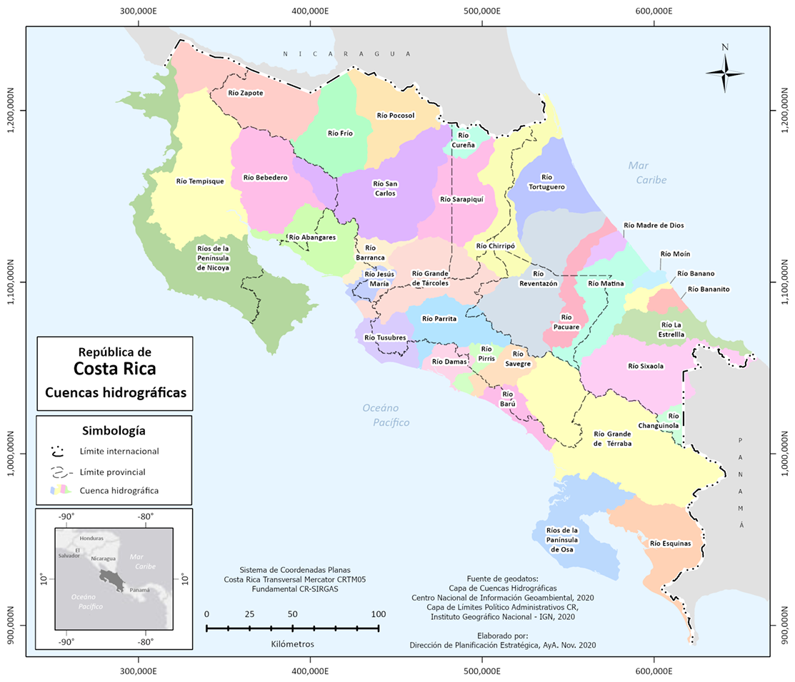

```

La gestión del recurso hídrico se ve frecuentemente dificultada porque las divisiones político-administrativas de distritos, cantones o provincias no coinciden con los límites naturales de las cuencas hidrográficas. Esta desconexión genera problemas de coordinación institucional, vacíos en la toma de decisiones y conflictos entre unidades políticas que comparten un mismo sistema hídrico, pero que lo gestionan de manera fragmentada. 

Un ejemplo representativo en Costa Rica es el caso de la quebrada Seca, en la provincia de Heredia, donde la falta de coordinación municipal, el crecimiento urbano desordenado, la canalización inadecuada y la falta de una gestión integrada a escala de cuenca han incrementado la recurrencia y severidad de inundaciones. Este caso evidencia cómo la ausencia de un enfoque de cuenca en la planificación territorial y en la gestión del agua puede derivar en impactos ambientales y sociales significativos, aun en sistemas de pequeña escala.


```{r}
#| label: fig-quebradaseca
#| fig-cap: "Cuenda de la Quebrada Seca - Río Burío .<br><span style='font-size:0.8em;'>Fuente: [@MasísCampos2020_BurioQuebradaSeca]</span>"
#| fig-align: center
#| out-width: 100%
#| echo: false
#| class: fig-border

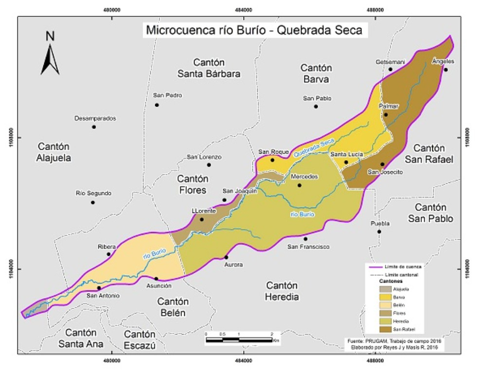

```


## Elementos morfométricos de cuencas

### Divisoria de aguas de una cuenca

La divisoria de aguas, corresponde a la línea topográfica que delimita una cuenca hidrográfica y separa las áreas de drenaje que escurren hacia distintos sistemas fluviales. Esta divisoria se define, en general, por los puntos de mayor elevación del terreno, como crestas montañosas, cerros o lomas, y establece el límite físico dentro del cual las precipitaciones contribuyen al escurrimiento hacia un punto de control común. 

Para trazar esta línea en un mapa topográfico, como se observa en la figura siguiente se debe seguir el contorno conectando los puntos de máxima cota,. La divisoria siempre corre perpendicularmente a las curvas de nivel sobre las crestas y cumbres más altas, ya que el agua fluye siguiendo la máxima pendiente,.

```{r}
#| label: fig-divisoria
#| fig-cap: "Divisoria de aguas.<br><span style='font-size:0.8em;'>Fuente: Mundo GIS, 2025.</span>"
#| fig-align: center
#| out-width: 100%
#| echo: false
#| class: fig-border

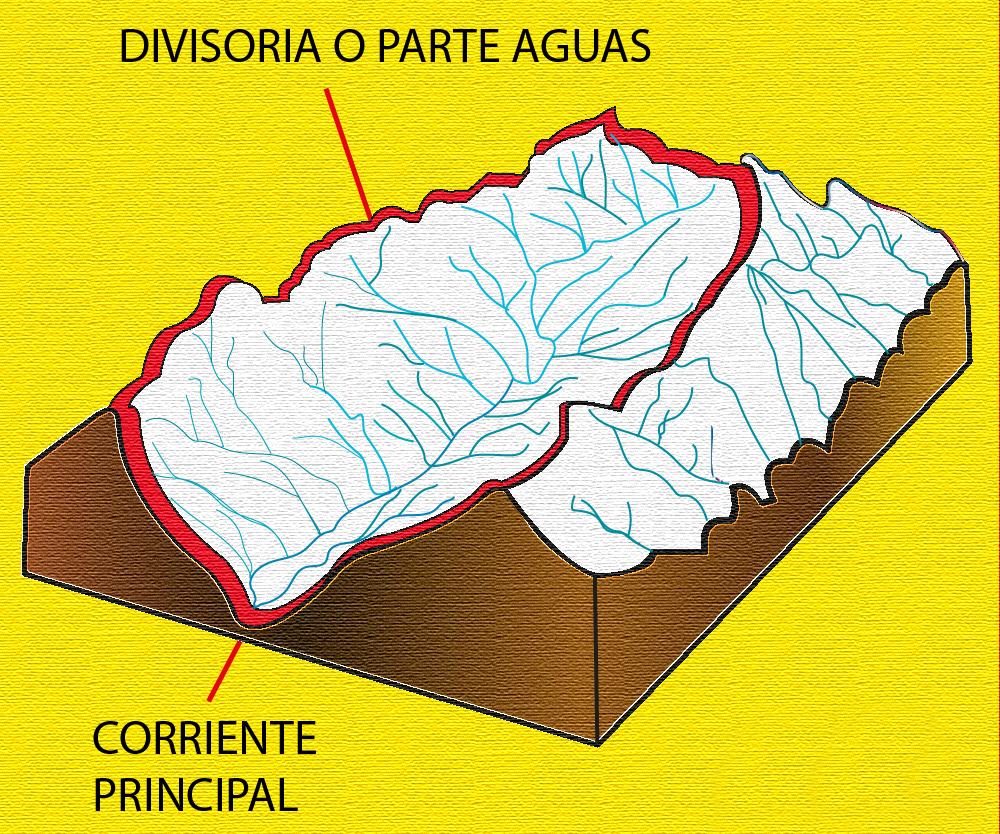

```

**Tipos de divisoria**

Es importante diferenciar dos tipos de límites en una cuenca:

1. <u>Divisoria Topográfica o Superficial</u>: Es la que se define por la topografía del terreno y delimita el área de la escorrentía superficial.

2. <u>Divisoria Freática o Subterránea</u>: Establece los límites de los depósitos de agua subterránea (acuíferos) y de ella se deriva el caudal base de la cuenca.

Las dos divisorias no siempre coinciden, ya que el flujo de agua subterránea está controlado por la geología del acuífero, mientras que el flujo superficial es determinado por la topografía. Sin embargo, en cuencas de gran tamaño (superiores a 1000 o 2000 km²) la diferencia suele ser despreciable.

```{r}
#| label: fig-divisoriaserrano
#| fig-cap: "Corte transversal de una cuenca hidrográfica.<br><span style='font-size:0.8em;'>Fuente: [@SerranoPacheco_IC0808_Hidrologia].</span>"
#| fig-align: center
#| out-width: 100%
#| echo: false
#| class: fig-border

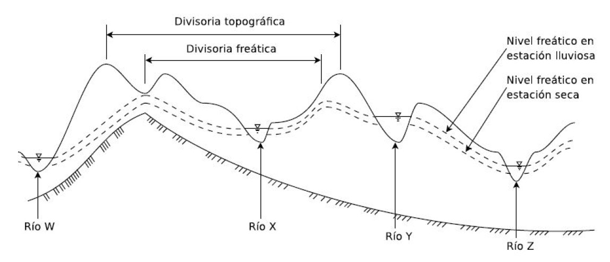

```

## Delimitación de cuencas hidrográficas

La delimitación de una cuenca hidrográfica consiste en identificar y trazar el límite espacial que define el área de terreno cuya escorrentía superficial converge hacia un mismo punto de control. Este proceso es fundamental en hidrología aplicada, ya que permite establecer con precisión la unidad de análisis sobre la cual se calculan balances hídricos, caudales de diseño, tiempos de respuesta y demás variables hidrológicas.

Desde un punto de vista conceptual, la delimitación se basa en la identificación de la divisoria de aguas, siguiendo las líneas de mayor elevación del terreno que separan los flujos superficiales entre cuencas vecinas. En la práctica, este procedimiento puede realizarse de manera manual, a partir de cartografía topográfica, o de forma automatizada mediante herramientas de Sistemas de Información Geográfica (SIG) y Modelos Digitales de Elevación (MDE).

Si bien en la actualidad las herramientas SIG y los distintos programas especializados permiten realizar delimitaciones de cuencas de forma automatizada y rápida, se recomienda aplicar estos procedimientos con criterio técnico y verificar cuidadosamente los productos finales. En algunos casos, los algoritmos automáticos pueden presentar errores en la delimitación, asociados a una baja resolución del Modelo Digital de Elevación, a una insuficiente densidad de curvas de nivel, a la presencia de artefactos en los datos o a vacíos de información provocados, por ejemplo, por la presencia de nubes en la cartografía base.

Por esta razón, se recomienda realizar una delimitación manual con una revisión hidrológica detallada, apoyada en cartografía topográfica, imágenes satelitales y conocimiento del terreno. En estudios de ingeniería y gestión del recurso hídrico, la delimitación manual o semimanual, realizada con cuidado y criterio hidrológico, permite asegurar la coherencia física de la cuenca, mejorar la calidad del producto final y reducir la propagación de errores en los análisis hidrológicos posteriores. En la siguiente figura se muestra la disponibilidad espacial de información topográfica disponible para Costa Rica.

```{r}
#| label: fig-curvassnit
#| fig-cap: "Información topográfica disponible para Costa Rica.<br><span style='font-size:0.8em;'>Fuente: Servicio Nacional de Información Topográfica, 2025.</span>"
#| fig-align: center
#| out-width: 100%
#| echo: false
#| class: fig-border

knitr::include_graphics("assets/img/curvas_snit.jpg")

```


### Delimitación manual a partir de cartografía topográfica

Históricamente y aún como práctica fundamental, la delimitación se realiza utilizando mapas topográficos o cartas de curvas de nivel (altimetría). Este método continúa siendo relevante en estudios conceptuales, ejercicios académicos y validaciones de resultados obtenidos por métodos automáticos.

El procedimiento general incluye los siguientes pasos:

1. Definir el punto de control o salida de la cuenca, el cual puede corresponder a un sitio de interés hidrológico como un puente, una estación fluviográfica, una captación o la confluencia de cauces.

2. Identificar los cauces principales y secundarios que drenan hacia el punto de control.

3. Localizar las crestas, divisorias y puntos de mayor elevación que separan las aguas que fluyen hacia el punto de control de aquellas que drenan hacia cuencas vecinas.

4. Trazar la divisoria de aguas conectando los puntos de máxima cota, asegurando que la línea sea perpendicular a las curvas de nivel y no cruce cuerpos de agua.


```{r}
#| label: fig-delim_manual
#| fig-cap: "Delmitación manual de cuenca hidrográfica.<br><span style='font-size:0.8em;'>Fuente: [@SerranoPacheco_IC0808_Hidrologia].</span>"
#| fig-align: center
#| out-width: 100%
#| echo: false
#| class: fig-border

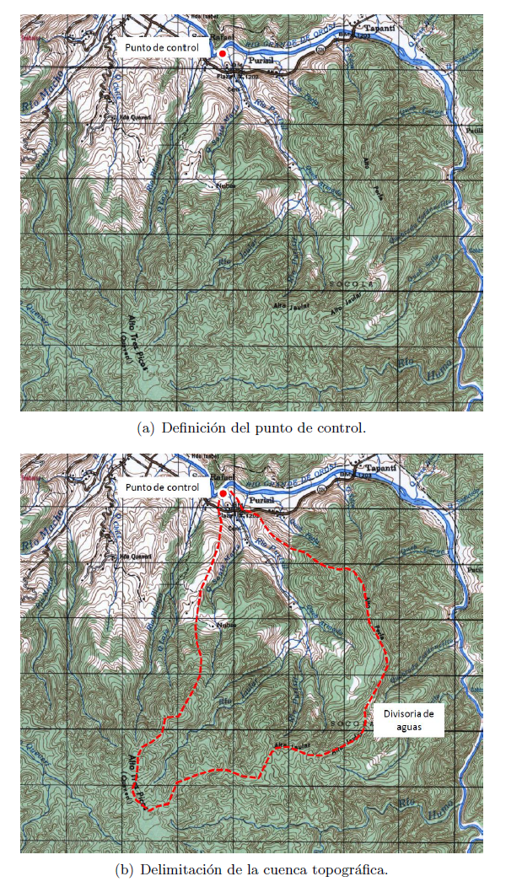
```

### Delimitación mediante modelos digitales de elevación y SIG

Actualmente, gracias al avance en software, la delimitación de cuencas se puede realizar de manera automatizada mediante el uso de Sistemas de Información Geográfica (SIG) y Modelos Digitales de Elevación. Estos modelos representan la superficie del terreno de forma continua y permiten automatizar el análisis del flujo superficial.

El procedimiento típico en un entorno SIG incluye las siguientes etapas:

1. Corrección del MDE para eliminar depresiones artificiales (*sinkholes*)o inconsistencias del modelo.

2. Cálculo de la dirección de flujo para cada celda del MDE.

3. Determinación de la acumulación de flujo, que permite identificar la red de drenaje.

4. Definición del punto de salida o celda de control (este es el primer paso en la delimitación manual).

5. Generación automática del polígono de la cuenca y de la red de drenaje asociada.

Este enfoque, realizado correctamente, ofrece mayor rapidez, especialmente en cuencas de gran tamaño o en estudios regionales. No obstante, los resultados dependen de la experiencia del profesional responsable, de la resolución espacial del MDE y de la correcta selección del punto de salida, por lo que es recomendable realizar validaciones visuales y comparaciones con cartografía existente.


```{r}
#| label: fig-delim_auto
#| fig-cap: "Delmitación automatizada de cuenca hidrográfica.<br><span style='font-size:0.8em;'>Fuente: [@Islam2020_MicroWatershed_Bangladesh].</span>"
#| fig-align: center
#| out-width: 100%
#| echo: false
#| class: fig-border

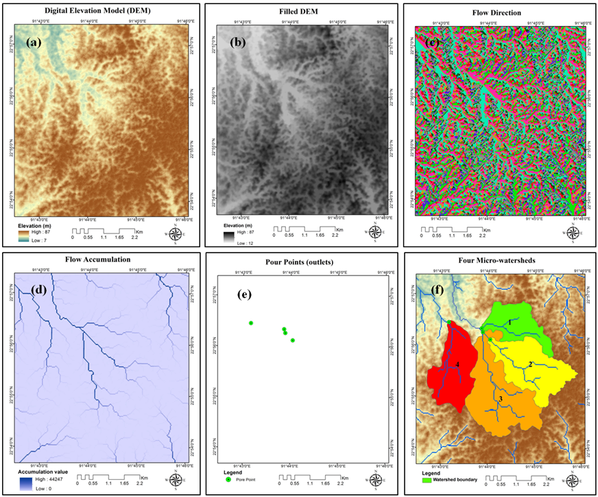
```

En la práctica profesional, la delimitación de cuencas suele combinar ambos enfoques: la automatización mediante SIG como herramienta principal y la interpretación hidrológica y topográfica como mecanismo de verificación. Esta combinación garantiza resultados consistentes y acordes con la realidad física del terreno, lo cual es esencial para la correcta aplicación de los métodos hidrológicos posteriores.


## Sistema de drenaje y orden de corrientes

La red de drenaje de una cuenca hidrográfica está constituida por el río principal y el conjunto de todas sus corrientes tributarias, interconectadas de manera tal que aseguran el viaje de la escorrentía hasta un único punto de control. La red de drenaje es un factor clave que influye directamente en la velocidad con la que la cuenca responde a la precipitación.

### Clasificación de cauces

Los cauces o cursos de agua se clasifican en función de la constancia del escurrimiento que transportan. Esta clasificación se relaciona estrechamente con la posición del nivel freático (superficie del agua subterránea) respecto al lecho del canal del cauce. Los cauces se pueden clasificar en:

- <u>Permanentes</u>: Son aquellos que transportan agua de manera continua a lo largo de todo el año. En estos, nivel freático se mantiene siempre por encima del lecho del río, lo que asegura un escurrtimiento constante y permanente.

- <u>Intermitentes</u>: Escurren durante las estaciones de lluvia, pero se secan durante la época de estiaje. En este caso, el nivel freático se conserva por encima del lecho del río solamente durante la época lluviosa.

- <u>Efímeros</u>: Existen únicamente durante o inmediatamente después de los períodos de precipitación, transportando solo escorrentía superficial. El nivel de agua subterránea siempre se encuentra por debajo del lecho del cauce, por lo que no hay aporte subterráneo, son consideradas influentes.

### Orden de drenaje (Horton–Strahler)

La clasificación por orden de cauce permite describir el grado de ramificación o bifurcación que presenta el sistema o red de drenaje de una cuenca hidrográfica. Este tipo de clasificación facilita la comprensión de la organización jerárquica de los cauces y su relación con la respuesta hidrológica del sistema.

El método más utilizado es el propuesto por Horton, posteriormente modificado y formalizado por Strahler, conocido como método de Horton–Strahler. Este esquema se basa en una jerarquía simple y objetiva, definida a partir de las confluencias entre cauces:

1. Los cauces más pequeños, que no presentan afluentes, se designan como cauces de primer orden.

2. Un cauce de segundo orden se origina únicamente a partir de la confluencia de dos cauces de primer orden.

3. De manera general, cuando dos cauces del mismo orden $n$ confluyen, se forma un cauce de orden $n+1$.

4. Si un cauce de orden menor confluye con un cauce de orden mayor, el cauce resultante conserva el orden más alto.

5. El orden de la cuenca hidrográfica se define como el orden del cauce principal en el punto de salida o punto de control.


```{r}
#| label: fig-num_orden
#| fig-cap: "Clasificación por número de orden."
#| fig-align: center
#| out-width: 100%
#| echo: false
#| class: fig-border

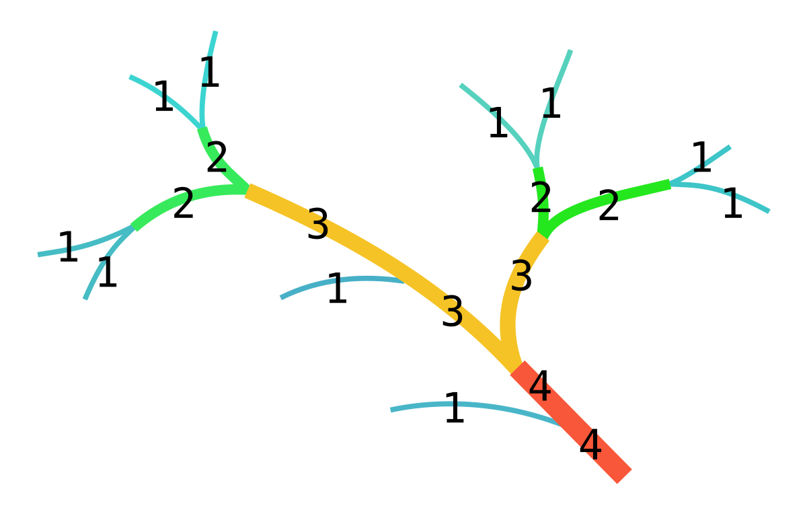
```


El orden de drenaje proporciona una medida indirecta del grado de desarrollo del sistema fluvial y del nivel de disección del terreno. Cuencas con órdenes de cauce elevados suelen presentar redes de drenaje más complejas y bien desarrolladas, mientras que cuencas de bajo orden corresponden a sistemas más simples y menos ramificados.

El grado de ramificación del sistema de drenaje está estrechamente relacionado con la velocidad de respuesta de la cuenca ante eventos de precipitación. Un número de orden alto, o bien una densidad de drenaje elevada, indica una cuenca altamente disectada, en la cual el agua precipitada alcanza rápidamente los cauces y es evacuada con mayor eficiencia. Este comportamiento se traduce generalmente en tiempos de concentración menores y en hidrogramas con picos más altos y en condiciones de tormentas intensas.

Por el contrario, cuencas con bajo orden de drenaje y redes poco desarrolladas tienden a presentar respuestas hidrológicas más lentas, con mayor influencia de procesos de almacenamiento, infiltración y escurrimiento sub-superficial. 

### La Razón (o coeficiente) de bifurcación $(R_{b})$ 

La razón de bifurcación $(R_b)$), también denominada coeficiente de bifurcación, es un parámetro morfométrico fundamental que cuantifica el grado de ramificación presente en el sistema de drenaje de una cuenca hidrográfica. Este índice describe cómo disminuye el número de cauces a medida que aumenta el orden de la red de drenaje y constituye un indicador clave de la organización geométrica y funcional del sistema fluvial.

La razón de bifurcación se expresa matemáticamente como:

$$
R_b = \frac{N_u}{N_{u+1}}
$$

donde:

- $N_u$ es el número de cauces de orden $u$.  

- $N_{u+1}$ es el número de cauces de orden $u+1$.

En la práctica, el valor de $R_b$ suele calcularse para cada par de órdenes consecutivos o como un valor promedio representativo de toda la cuenca.

A continuación, se muestra un ejemplo de cálculo de la razón de bifurcación.

```{r}
#| label: tbl-razon-bifurcacion
#| tbl-cap: "Distribución de órdenes de cauces y razón de bifurcación en una cuenca hidrográfcia."
#| echo: false
#| message: false
#| warning: false

library(dplyr)
library(kableExtra)
library(tibble)

tabla_rb <- tribble(
  ~`Cuenca`, ~`Orden de cauce (u)`, ~`Número de cauces (N<sub>u</sub>)`, ~`Razón de bifurcación (R<sub>b</sub>)`,
  "Cuenca", 1, 1554, NA_real_,
  "Cuenca", 2, 328,  4.7,
  "Cuenca", 3, 73,   4.5,
  "Cuenca", 4, 12,   6.1,
  "Cuenca", 5, 3,    4.0,
  "Cuenca", 6, 1,    3.0
)

fila_resumen <- tibble(
  `Cuenca`                                = "Cuenca",
  `Orden de cauce (u)`                    = "Promedio",
  `Número de cauces (N<sub>u</sub>)`      = "—",
  `Razón de bifurcación (R<sub>b</sub>)`  = "4.5"
)

tabla_rb_final <- bind_rows(
  tabla_rb %>%
    mutate(
      `Orden de cauce (u)`               = as.character(`Orden de cauce (u)`),
      `Número de cauces (N<sub>u</sub>)` = as.character(`Número de cauces (N<sub>u</sub>)`),
      `Razón de bifurcación (R<sub>b</sub>)` = ifelse(
        is.na(`Razón de bifurcación (R<sub>b</sub>)`),
        "—",
        format(round(`Razón de bifurcación (R<sub>b</sub>)`, 1), nsmall = 1)
      )
    ),
  fila_resumen
)

tabla_rb_final %>%
  kbl(
    booktabs = TRUE,
    align    = c("c", "c", "c", "c"),
    format   = "html",
    escape   = FALSE
  ) %>%
  kable_classic(html_font = "Latin Modern Roman") %>%
  kable_styling(
    full_width        = FALSE,
    bootstrap_options = "hover",
    htmltable_class   = "tabla-hover-custom"
  ) %>%
  row_spec(0, bold = TRUE) %>%
  row_spec(nrow(tabla_rb_final), bold = TRUE) %>%
  collapse_rows(columns = 1, valign = "middle") %>%
  row_spec(1:nrow(tabla_rb_final), extra_css = "text-align: center; vertical-align: middle;")


```


Valores bajos de $R_b$ indican una red con menor ramificación relativa, lo que favorece una concentración más rápida del escurrimiento y una respuesta más abrupta ante eventos de precipitación. En el siguiente cuadro se detalla la información de ambos parámetros.

```{r}
#| label: tbl-orden-vs-bifurcacion
#| tbl-cap: "Comparación conceptual entre número de orden y razón de bifurcación en redes de drenaje."
#| echo: false
#| message: false
#| warning: false

library(dplyr)
library(kableExtra)
library(tibble)

tabla_comp <- tribble(
~`Aspecto`, ~`Número de orden`, ~`Razón de bifurcación`,

"Qué representa",
"Describe la posición jerárquica de cada cauce dentro de la red de drenaje, indicando su nivel de importancia relativa y la complejidad estructural del sistema.",
"Cuantifica la relación numérica entre los cauces de órdenes consecutivos y expresa el grado de ramificación de la red en su conjunto.",

"Tipo de propiedad",
"Propiedad discreta asignada a cada segmento del drenaje.",
"Índice global que resume el patrón de organización de la red.",

"Nivel de análisis",
"Se aplica a segmentos o cauces individuales (clasificación jerárquica).",
"Se aplica a la red completa (síntesis del comportamiento de ramificación).",

"Interpretación hidrológica",
"Mayor orden suele asociarse a una red más desarrollada y a una mayor integración del drenaje hacia el cauce principal.",
"Permite evaluar la eficiencia del sistema de drenaje y la respuesta hidrológica de la cuenca.",

"Implicación en la respuesta ante tormentas",
"El orden ayuda a describir la estructura del drenaje, pero por sí solo no cuantifica la ramificación entre órdenes.",
"Valores bajos indican una concentración más rápida del escurrimiento y mayor potencial de picos de caudal elevados; valores altos reflejan redes más ramificadas con respuesta más atenuada y distribuida en el tiempo."
)

tabla_comp %>%
kbl(
  booktabs = TRUE,
  align    = c("c", "c", "c"),
  format   = "html",
  escape   = FALSE
) %>%
kable_classic(html_font = "Latin Modern Roman") %>%
kable_styling(
  full_width        = FALSE,
  bootstrap_options = c("hover"),
  htmltable_class   = "tabla-hover-custom"
) %>%
row_spec(0, bold = TRUE) %>%
column_spec(
  1:3,
  extra_css = "text-align: center; vertical-align: middle;"
)


```

[**Fuente:** @McCuen1997]{style="font-size: 0.8em;"}


## Características morfológicas de una cuenca

Las características morfológicas de una cuenca hidrográfica describen su forma, tamaño, relieve y  sistema de drenaje, y constituyen un conjunto de parámetros fundamentales para el análisis hidrológico. 
El estudio morfológico, es esencial para comprender la variación espacial del régimen hidrológico y para cuantificar los volúmenes de escorrentía y la velocidad de respuesta del flujo.


### Área

El área de drenaje $(A)$, referida también como superficie de drenaje o cuenca de captación, constituye una de las características geomorfológicas más relevantes en hidrología aplicada y, en particular, en el diseño de obras hidráulicas.

El área de drenaje corresponde a la proyección horizontal de esta superficie delimitada y representa la extensión espacial efectiva que contribuye a la generación de escorrentía en dicho punto.

```{r}
#| label: fig-pro_cuenca
#| fig-cap: "Proyección horizontal para estimación de área de drenaje."
#| fig-align: center
#| out-width: 100%
#| echo: false
#| class: fig-border

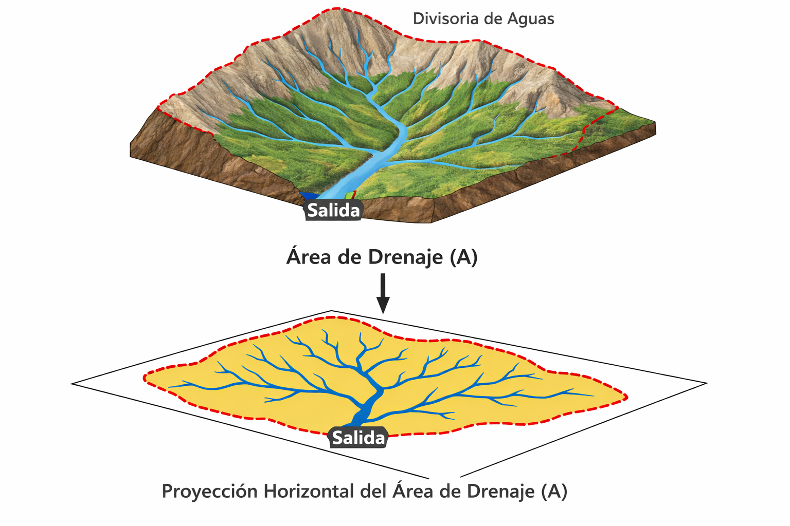
```


### Perímetro

El Perímetro $(P)$ de una cuenca hidrográfica se define como la longitud total de la divisoria topográfica o divisoria de aguas que delimita la cuenca.

### Longitud del cauce principal

El cauce principal de una cuenca hidrográfica se define como el curso de agua que drena la mayor área de la cuenca y que conduce el flujo hacia el punto de salida o punto de control. En términos hidrológicos, corresponde al cauce de mayor jerarquía dentro de la red de drenaje, es decir, aquel que posee el orden más alto según un sistema de clasificación como el de Horton–Strahler.

De manera práctica, el cauce principal se identifica siguiendo el trayecto continuo que conecta el punto de salida con el punto más alejado de la cuenca, considerando siempre el camino <span class="firebrick"><strong>hidráulicamente más largo</strong></span>. Este criterio garantiza que el cauce seleccionado represente el recorrido dominante del escurrimiento superficial y sea el más influyente en la respuesta hidrológica de la cuenca.

En caso de confluencias donde existen dudas, el cauce principal suele determinarse comparando la longitud aguas arriba, el área drenada o el orden de los cauces que confluyen, asignándose como principal aquel que presenta mayor contribución hidrológica al sistema.

Una vez definido este concepto, la longitud del cauce principal corresponde a la distancia medida a lo largo del eje del cauce desde el punto más alejado de la cuenca, hidrológicamente conectado, hasta el punto de salida o control. Esta longitud se mide siguiendo el trazado natural del río o quebrada, respetando su sinuosidad, y no como una distancia en línea recta.

```{r}
#| label: fig-LCP
#| fig-cap: "Diagrama de longitud de cauce principal."
#| fig-align: center
#| out-width: 100%
#| echo: false
#| class: fig-border

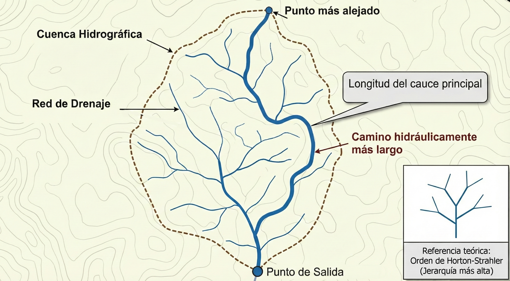
```

### Coeficiente de compacidad o Índice de Gravelius ($K_C$)

El coeficiente de compacidad relaciona el perímetro ($P$) de la cuenca con la longitud de la circunferencia de un círculo cuya área es equivalente al área ($A$) de la cuenca. Dado que el círculo es la figura geométrica que presenta el menor perímetro para un área dada, este coeficiente siempre toma valores iguales o mayores que uno.

La expresión matemática del coeficiente de compacidad es:

$$
K_c = 0.28 \, \frac{P}{\sqrt{A}}
$$

donde:

- $P$: perímetro de la cuenca (km).  
- $A$: área de la cuenca (km$^2$).  
- $K_c$: coeficiente de compacidad (adimensional).

El valor del coeficiente de compacidad es un indicador directo de cuán compacta o alargada es una cuenca, independientemente de su tamaño.

- Valores de $K_c$ cercanos a 1 indican cuencas con formas más redondeadas o circulares. Estas cuencas tienden a concentrar el escurrimiento de manera más rápida, lo que incrementa la probabilidad de generar crecientes súbitas y picos de caudal elevados.

- Valores de $K_c$ mayores a 1 corresponden a cuencas más alargadas o irregulares. En estos casos, la escorrentía superficial se distribuye en el tiempo, produciendo una respuesta hidrológica más lenta y picos de caudal generalmente menores. Además, las cuencas alargadas reducen la probabilidad de que un evento de precipitación intenso cubra simultáneamente toda su extensión.

En el siguiente cuadro se detallan las diferentes clasificaciones de cuencas según su $(K_c)$.

```{r}
#| label: tbl-compacidad
#| tbl-cap: "Clasificación de cuencas hidrográficas según el coeficiente de compacidad ($K_c$)."
#| echo: false
#| message: false
#| warning: false

library(dplyr)
library(kableExtra)
library(tibble)

tabla_kc <- tribble(
~`Rango de Kc`, ~`Clasificación`,
"1.00 – 1.25",  "Circular",
"1.25 – 1.50",  "Ovalada",
"1.50 – 1.75",  "Oblonga",
"1.75 – 2.00",  "Rectangular",
"> 2.00",       "Rectangular alargada"
)

tabla_kc %>%
kbl(
booktabs = TRUE,
align    = c("c", "c"),
format   = "html",
escape   = FALSE
) %>%
kable_classic(html_font = "Latin Modern Roman") %>%
kable_styling(
full_width        = FALSE,
bootstrap_options = c("hover"),
htmltable_class   = "tabla-hover-custom"
) %>%
row_spec(0, bold = TRUE) %>%
column_spec(
1:2,
extra_css = "text-align: center; vertical-align: middle;"
)

```

```{r}
#| label: fig-factor_forma
#| fig-cap: "Diagrama de índice de Gravelius, según forma de cuenca.<br><span style='font-size:0.8em;'>Fuente: [@Guizani2022_DebrecenWaterBalance].</span>"
#| fig-align: center
#| out-width: 100%
#| echo: false
#| class: fig-border

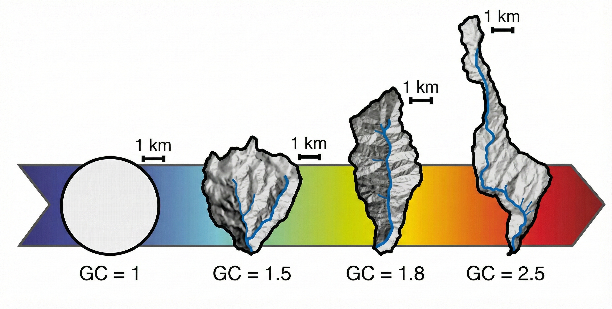
```

::: {.callout-note title="Ejemplo"}
Considérese una cuenca hidrográfica con un área de drenaje $A = 50 \ \text{km}^2$ y un perímetro $P = 30 \ \text{km}$. Se desea estimar el coeficiente de compacidad e identificar la clasificación morfológica de la cuenca.

El coeficiente de compacidad se calcula como:

$$
K_c = 0.28 \, \frac{P}{\sqrt{A}}
$$

Sustituyendo los valores:

$$
K_c = 0.28 \, \frac{30}{\sqrt{50}} = 0.28 \times 4.24 \approx 1.19
$$

De acuerdo con la clasificación presentada en el @tbl-compacidad, un valor de $K_c \approx 1.19$ corresponde a una cuenca de forma **circular**. Este resultado indica que la cuenca presenta una alta tendencia a la concentración rápida de la escorrentía superficial, lo cual puede favorecer la generación de picos de caudal elevados ante eventos de precipitación intensa.
:::


### Factor de forma

El factor de forma ($K_f$ o $R_f$) es una característica morfométrica cuantitativa, utilizada para describir la geometría en planta de una cuenca hidrográfica. Este índice permite evaluar el grado de compactación o elongación de la cuenca y su influencia en la respuesta hidrológica ante eventos de precipitación.

El factor de forma se define como la relación entre el ancho medio ($B$) y la longitud axial ($L$) de la cuenca. Conceptualmente, este parámetro compara la dimensión transversal promedio de la cuenca con su dimensión longitudinal dominante.

- La **longitud axial** ($L$) corresponde a la distancia medida siguiendo el cauce principal, desde el punto de salida o punto de control de la cuenca hasta el punto más alejado de la divisoria de aguas que se encuentra hidrológicamente conectado. Esta longitud representa el recorrido dominante del escurrimiento superficial y es un parámetro clave en el análisis del tiempo de concentración y de la propagación de caudales dentro de la cuenca.

- El **ancho medio** ($B$) de la cuenca se obtiene como la razón entre el área de drenaje ($A$) y la longitud axial ($L$), es decir:

$$
B = \frac{A}{L}
$$

Sustituyendo esta expresión en la definición original, el factor de forma puede expresarse como:

$$
K_f = \frac{A}{L^2}
$$

donde:

- $A$: área de drenaje de la cuenca (km$^2$).  
- $L$: longitud axial de la cuenca (km).  
- $K_f$: factor de forma (adimensional).

La magnitud del factor de forma ($K_f$) es un indicador directo de la tendencia de una cuenca hidrográfica a concentrar el escurrimiento superficial en el tiempo, y por tanto, de su susceptibilidad a la generación de crecientes.

- **Cuencas con $K_f$ alto (valores cercanos a $1$):**  
  Corresponden a cuencas de geometría compacta o aproximadamente circular. En este tipo de cuencas, el escurrimiento generado en distintas zonas tiende a llegar al punto de salida en intervalos de tiempo similares, lo que se traduce en un tiempo de concentración reducido y en hidrogramas con picos de caudal más altos y pronunciados. Estas cuencas presentan, en general, una mayor propensión a crecidas rápidas ante eventos de precipitación intensa.

- **Cuencas con $K_f$ bajo:**  
  Se asocian a cuencas alargadas o estrechas. En estos casos, el agua precipitada recorre distancias más largas antes de alcanzar el punto de salida, lo que prolonga el tiempo de viaje del escurrimiento. Como consecuencia, la respuesta hidrológica es más lenta, el flujo se distribuye en un mayor intervalo temporal y los picos de caudal suelen ser menores. La forma alargada disminuye además la probabilidad de que un evento de lluvia intensa cubra simultáneamente toda la cuenca.

```{r}
#| label: tbl-factor-forma
#| tbl-cap: "Clasificación de cuencas hidrográficas según el factor de forma ($K_f$)."
#| echo: false
#| message: false
#| warning: false

library(dplyr)
library(kableExtra)
library(tibble)

tabla_kf <- tribble(
~`Rango de Kf`,            ~`Forma de la cuenca`,        ~`Comportamiento hidrológico típico`,
"> 0.75",                 "Compacta / casi circular",  "Respuesta rápida, picos de caudal altos",
"0.40 – 0.75",            "Moderadamente alargada",     "Respuesta hidrológica intermedia",
"≤ 0.40",                 "Alargada",                  "Respuesta lenta, picos de caudal bajos"
)

tabla_kf %>%
kbl(
booktabs = TRUE,
align    = c("c", "c", "c"),
format   = "html",
escape   = FALSE
) %>%
kable_classic(html_font = "Latin Modern Roman") %>%
kable_styling(
full_width        = FALSE,
bootstrap_options = c("hover"),
htmltable_class   = "tabla-hover-custom"
) %>%
row_spec(0, bold = TRUE) %>%
column_spec(
1:3,
extra_css = "text-align: center; vertical-align: middle;"
)

```

```{r}
#| label: fig-fac_forma_kf
#| fig-cap: "Morfología de una cuenca hidrográfica, según su factor de forma $(K_f)$"
#| fig-align: center
#| out-width: 100%
#| echo: false
#| class: fig-border

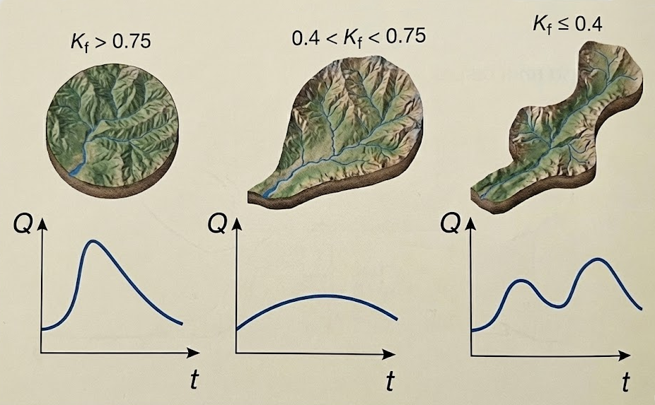
```

::: {.callout-note title="Ejemplo"}
Considérese una cuenca hidrográfica con un área de drenaje $A = 120 \ \text{km}^2$ y una longitud axial (longitud de cauce principal) de $L = 18 \ \text{km}$. Se desea estimar el factor de forma de la cuenca e interpretar su respuesta hidrológica.

El factor de forma se calcula mediante la expresión:

$$
K_f = \frac{A}{L^2}
$$

Sustituyendo los valores:

$$
K_f = \frac{120}{18^2} = \frac{120}{324} \approx 0.37
$$

De acuerdo con la clasificación típica del factor de forma, un valor de $K_f \approx 0.37$ corresponde a una cuenca **alargada**. Este resultado indica que la cuenca presenta una respuesta hidrológica más lenta, con mayor dispersión temporal de la escorrentía superficial y una menor probabilidad de generar picos de caudal elevados ante eventos de precipitación intensa.
:::


### Densidad de drenaje

La densidad de drenaje $(D_d)$ es un parámetro morfométrico cuantitativo que refleja la eficiencia del sistema de drenaje de una cuenca y la rapidez con la que esta responde ante un evento de precipitación. Se trata de un índice de carácter integral, ya que sintetiza la influencia conjunta de factores geológicos, climáticos, geomorfológicos y biológicos, representando el funcionamiento global de la cuenca hidrográfica [@Bloschl2013PUB].

La densidad de drenaje se define como la razón entre la longitud total de todos los cursos de agua presentes en la cuenca (permanentes, intermitentes y efímeros) y el área total de drenaje. Se expresa como:

$$
D_d = \frac{\sum L_{ci}}{A}
$$

donde:

- $D_d$: densidad de drenaje, generalmente expresada en km/km$^2$.
- $\sum L_{ci}$: sumatoria de la longitud total de todos los cauces dentro de la cuenca (km).
- $A$: área total de la cuenca (km$^2$).

La magnitud de la densidad de drenaje tiene implicaciones directas sobre la forma y dinámica del hidrograma de salida:

- **Densidad de drenaje alta**: Indica una cuenca altamente drenada, con una red de drenaje densa y muy ramificada. Este comportamiento suele asociarse a suelos poco permeables o fácilmente erosionables, pendientes pronunciadas y escasa cobertura vegetal. Desde el punto de vista hidrológico, una $D_d$ elevada favorece la rápida evacuación de la escorrentía superficial, generando hidrogramas con picos de caudal elevados y tiempos de concentración cortos (respuesta hidrológica rápida).

- **Densidad de drenaje baja**: Sugiere una cuenca con drenaje poco desarrollado, generalmente asociada a materiales altamente permeables, pendientes suaves o suelos resistentes a la erosión. En estas condiciones, el agua permanece más tiempo en superficie o en el subsuelo, favoreciendo la infiltración y otros procesos de abstracción antes de incorporarse a los cauces, lo que se traduce en una respuesta hidrológica más lenta y atenuada.

```{r}
#| label: fig-drenaje
#| fig-cap: "Influencia de la densidad de drenaje en la respuesta hidrológica de una cuenca hidrográfica."
#| fig-align: center
#| out-width: 100%
#| echo: false
#| class: fig-border

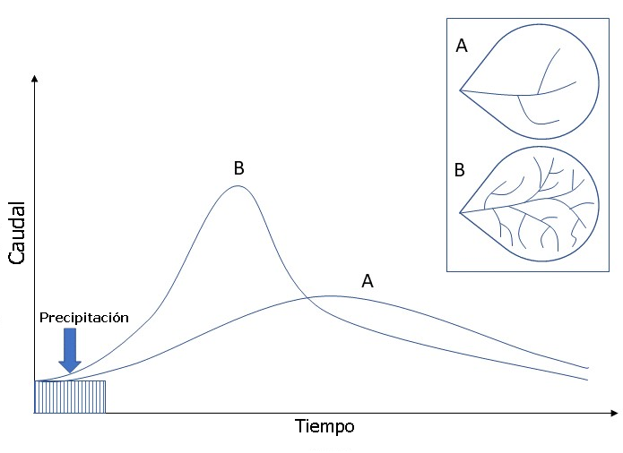
```

La densidad de drenaje es el resultado de la coevolución del paisaje bajo la influencia de la geología, el clima y el uso del suelo:

- **Rangos comunes**: En aplicaciones hidrológicas, los valores de $D_d$ suelen oscilar entre aproximadamente 0.5 km/km$^2$ para cuencas con drenaje deficiente y valores del orden de 2.5 km/km$^2$ o superiores para cuencas excepcionalmente bien drenadas.

- **Relación con el clima**: Existe una relación directa entre el balance hídrico regional y el desarrollo de la red de drenaje. En regiones muy áridas, la densidad de drenaje tiende a ser menor debido a la limitada disponibilidad de agua para esculpir el relieve.

La precisión en el cálculo de $D_d$ depende fuertemente de la escala cartográfica y de la información geográfica utilizada. Resoluciones espaciales gruesas pueden subestimar la longitud total de los cauces al suavizar meandros y eliminar tributarios de menor orden.

::: {.callout-note title="Ejemplo"}
Considérese una cuenca con un área total de drenaje $A = 52.87 \ \text{km}^2$ y una longitud total medida de sus cauces $\sum L_{ci} = 26.06 \ \text{km}$. Se desea estimar la densidad de drenaje e interpretar su significado hidrológico.

La densidad de drenaje se calcula como:

$$
D_d = \frac{86.06}{52.87} \approx 1.628 \ \text{km/km}^2
$$

El valor obtenido de $D_d \approx 1.63 \ \text{km/km}^2$ clasifica a la cuenca como una cuenca de **densidad de drenaje moderada a alta**. Este resultado indica un sistema de drenaje relativamente bien desarrollado, con una red de cauces suficientemente ramificada que favorece una evacuación más eficiente de la escorrentía superficial. Desde el punto de vista hidrológico, esta condición se asocia con una respuesta más rápida ante eventos de precipitación, tiempos de concentración menores y una mayor probabilidad de generar picos de caudal significativos, en comparación con cuencas de baja densidad de drenaje. No obstante, la magnitud del valor sugiere que aún existe una contribución importante de procesos de infiltración y almacenamiento, por lo que la respuesta hidrológica no es extrema.
:::

### Sinuosidad Alineamiento del cauce

La sinuosidad del cauce es un parámetro morfométrico adimensional que describe el grado de curvatura, tortuosidad^[La tortuosidad es una característica que representa lo tortuoso de una curva, es decir, el grado de vueltas o rodeos que tiene.] o meandrización de un curso de agua dentro de una cuenca hidrográfica. Este parámetro permite caracterizar la geometría en planta del cauce y evaluar la resistencia que el trazado del río ofrece al flujo, así como su capacidad para disipar energía.

Desde un punto de vista geométrico, la sinuosidad se define como la relación entre la longitud real del cauce, medida siguiendo su trazado natural, y la longitud medida en línea recta o siguiendo el eje del valle (*thalweg*) entre los mismos puntos. Matemáticamente, se expresa como:

$$
S = \frac{L}{L_t}
$$

donde:

- $L$: longitud real del cauce, medida a lo largo de su recorrido natural.  
- $L_t$: longitud en línea recta o longitud del eje del valle entre el inicio y el final del tramo analizado.

El valor mínimo teórico de la sinuosidad es $S = 1$, correspondiente a un cauce perfectamente recto. Valores cercanos a la unidad indican cauces poco sinuosos, mientras que valores mayores reflejan cauces progresivamente más curvos o meandriformes.

Los cauces se pueden clasificar, según su sinuosidad, en:

- <u>Baja sinuosidad$(S\leq 1.25)$</u> : Se define como un río de alineamiento recto. Estos canales favorecen un mayor transporte de sedimentos.

- <u>Sinuosidad moderada $(1.25<S\leq2)$</u> : Indica formas de transición o presencia de meandros regulares.

- <u>Canales sinuosos $(S>2.0)$</u> : Valores superiores a 2.0 son indicativos de cauces extremadamente sinuosos que reducen significativamente la velocidad de la escorrentía.

```{r}
#| label: fig-sinuosidad
#| fig-cap: "Sinuosidad de un cauce."
#| fig-align: center
#| out-width: 100%
#| echo: false
#| class: fig-border

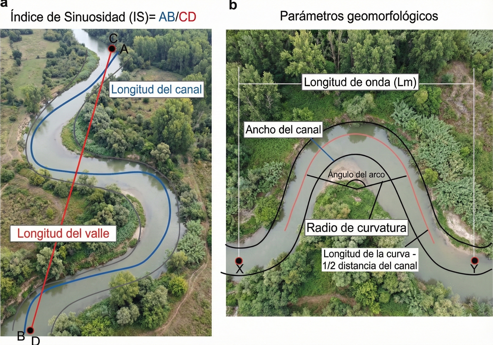
```


::: {.callout-note title="Ejemplo"}
Considérese un tramo de cauce cuyo recorrido natural medido a lo largo del eje del río es de $L = 12.6 \ \text{km}$, mientras que la distancia en línea recta entre el punto inicial y final del tramo es de $L_t = 8.4 \ \text{km}$. Se desea estimar la sinuosidad del cauce e interpretar su significado hidrológico.

La sinuosidad se calcula como:

$$
S = \frac{12.6}{8.4} = 1.50
$$

El valor obtenido de $S = 1.50$ indica un cauce con sinuosidad moderada, caracterizado por meandros bien desarrollados. Desde el punto de vista hidrológico, esta condición implica trayectorias de flujo más largas, velocidades medias reducidas y mayor disipación de energía en comparación con un cauce recto. En consecuencia, la sinuosidad contribuye a una respuesta hidrológica más atenuada, con mayores tiempos de tránsito y una reducción en la magnitud de los picos de caudal aguas abajo.
:::

### Alineamiento del cauce

En el análisis morfológico de una cuenca hidrográfica, el alineamiento del cauce se refiere a la geometría que adopta el curso de agua en su proyección en planta. Esta configuración es el resultado de la interacción dinámica entre el régimen de caudales, los procesos de transporte y depósito de sedimentos, y las condiciones geológicas y geomorfológicas del terreno. El alineamiento del cauce influye directamente en la hidráulica del flujo, la estabilidad del canal y la evolución morfológica del sistema fluvial.

De acuerdo con su trayectoria en planta, los cauces naturales pueden clasificarse principalmente en los siguientes tipos:

- <u>Cauces rectos</u>: Corresponden a tramos en los que el eje del cauce presenta una trayectoria aproximadamente rectilínea. Aun cuando las márgenes puedan ser casi paralelas, el flujo suele oscilar lateralmente dentro del canal. En ambientes aluviales, los cauces rectos suelen ser poco comunes en estado natural y, cuando existen, generalmente corresponden a estados transitorios previos al desarrollo de meandros o a cauces artificialmente rectificados.

- <u>Cauces sinuosos o meándricos</u>: Se caracterizan por una trayectoria curvilínea con curvas alternantes en forma de “S”. Este tipo de alineamiento se desarrolla típicamente en llanuras aluviales con pendientes suaves y sedimentos fácilmente erosionables. Los cauces sinuosos funcionan como un mecanismo natural de disipación de energía, ya que incrementan la longitud del recorrido del flujo, aumentan la resistencia hidráulica y reducen la velocidad media del agua.

- <u>Cauces trenzados (o con anastomosis)</u>: Presentan múltiples canales que se dividen y reconectan continuamente, formando islas o barras de sedimentos dentro del cauce. Estos sistemas son altamente dinámicos e inestables, y suelen estar asociados a pendientes relativamente fuertes, alta variabilidad de caudales y grandes aportes de sedimentos. El alineamiento trenzado refleja un equilibrio inestable entre la capacidad de transporte del flujo y la disponibilidad de material sedimentario.

```{r}
#| label: fig-alineamiento
#| fig-cap: "Clasificación de cuaces, según alineamiento.<br><span style='font-size:0.8em;'>Fuente: [@Charlton2008]</span>"
#| fig-align: center
#| out-width: 100%
#| echo: false
#| class: fig-border

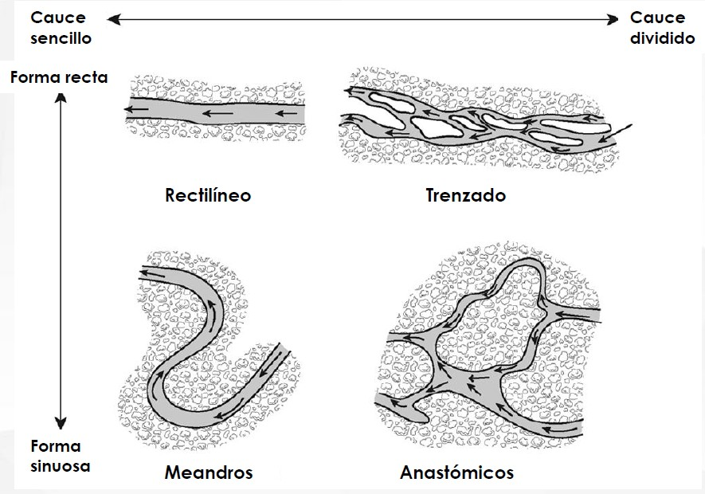
```

### Patrones de drenaje

Los patrones de drenaje corresponden a las configuraciones espaciales que adoptan las redes de dreanje dentro de una cuenca hidrográfica. Estos patrones son el resultado de la interacción entre los procesos erosivos que actúan sobre la superficie terrestre y la resistencia del sustrato geológico al flujo de agua, por lo que los patrones de drenaje está definidos por la geología de una cuenca.

La forma que adopta una red de drenaje refleja de manera directa variables físicas fundamentales como la litología, la estructura geológica, el grado de fracturamiento, la presencia de fallas o pliegues, el clima dominante y la topografía del terreno. En consecuencia, el análisis de los patrones de drenaje permite inferir características geológicas y geomorfológicas del área de estudio, así como comprender el comportamiento hidrológico de la cuenca.

Los patrones de drenaje influyen en la eficiencia del escurrimiento superficial, la conectividad entre los cauces y la respuesta de la cuenca ante eventos de precipitación. Redes bien organizadas y altamente conectadas suelen favorecer respuestas más rápidas, mientras que configuraciones condicionadas por estructuras geológicas pueden generar respuestas más complejas y heterogéneas.

```{r}
#| label: fig-patrones
#| fig-cap: "Patrones de drenaje de una cuenca."
#| fig-align: center
#| out-width: 100%
#| echo: false
#| class: fig-border

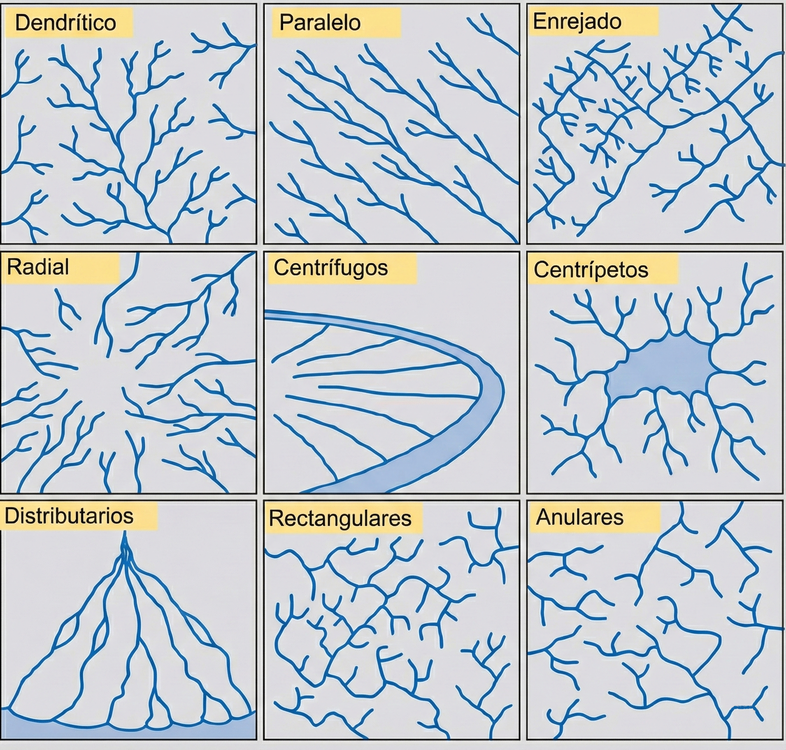
```

- <u>Dendrítico</u>  
  El drenaje dendrítico presenta un patrón ramificado similar a la forma de un árbol, con afluentes que se distribuyen de manera irregular y se unen al cauce principal en diversos ángulos. Este patrón se desarrolla principalmente sobre estratos horizontales y uniformemente resistentes, sedimentos no consolidados y rocas ígneas homogéneas, donde no existen controles estructurales marcados que condicionen la dirección del flujo.

- <u>Paralelo</u>  
  El drenaje paralelo se caracteriza por la presencia de corrientes principales aproximadamente paralelas entre sí, regularmente espaciadas, con afluentes que confluyen en ángulos agudos. Este patrón se desarrolla en regiones con pendientes regionales pronunciadas y estratos uniformemente resistentes, o bien donde existe un fuerte control estructural impuesto por fallas geológicas, monoclíneas o estructuras isoclinales estrechamente espaciadas.

- <u>Enrejado</u>  
  El drenaje enrejado es una configuración de red fluvial caracterizada por una geometría en la que los cursos de agua principales fluyen paralelos entre sí, mientras que sus tributarios se incorporan de manera casi perpendicular. Este patrón se asocia con la presencia de bandas alternas de rocas duras y blandas, estratos plegados o depósitos glaciales alineados. Un ejemplo clásico se observa en las montañas Apalaches, donde la erosión ha truncado estratos alternantes de distinta resistencia.

- <u>Radial</u>  
  El drenaje radial se caracteriza por corrientes que fluyen hacia afuera en todas las direcciones desde un punto elevado central. Este patrón es típico de cúpulas topográficas, como conos volcánicos y colinas cónicas aisladas. A gran escala, también puede desarrollarse en márgenes continentales afectados por crestas del manto que generan puntos altos litosféricos.
  
- <u>Centrífugo</u>  
  El drenaje centrífugo es similar al drenaje radial y se desarrolla cuando los canales fluyen hacia el exterior desde un punto central elevado, como ocurre, por ejemplo, en el interior de grandes meandros o estructuras elevadas locales.
  
- <u>Centrípeto</u>  
  El drenaje centrípeto se caracteriza porque todas las corrientes fluyen hacia un punto central bajo, generalmente localizado en el fondo de una cuenca endorréica^[Una cuenca endorreica (también conocida como cuenca cerrada) es una zona de la superficie terrestre en la que el punto de salida de las aguas superficiales se localiza dentro de los límites de la propia cuenca, en lugar de drenar hacia el océano. En estos sistemas, la escorrentía generada por las precipitaciones fluye hacia un colector común situado en el punto de menor elevación del relieve, que generalmente consiste en un lago, una laguna o un pantano interior.] Este patrón es típico de calderas volcánicas, cráteres, dolinas kársticas y cuencas tectónicas. Un ejemplo de gran escala se encuentra en áreas de drenaje interno de la meseta tibetana central.
  
- <u>Distribuido</u>  
  El drenaje distribuido es característico de ríos que atraviesan gargantas montañosas estrechas y luego se dispersan sobre llanuras o valles amplios. Este patrón es especialmente evidente durante eventos de inundación, cuando los cauces desbordan sus márgenes y el flujo se distribuye ampliamente sobre la planicie de inundación.

- <u>Rectangular</u>  
  El drenaje rectangular muestra una red de cauces con ángulos predominantemente rectos entre corrientes principales y afluentes. Este patrón está controlado por sistemas de fracturas, juntas o fallas geológicas que orientan el flujo. Es menos regular que el drenaje enrejado y es común en regiones como la costa noruega y partes de las montañas Adirondack en Estados Unidos.

- <u>Anular</u>  
  El drenaje anular presenta corrientes principales dispuestas en forma aproximadamente circular, con afluentes que confluyen en ángulo recto hacia ellas. Este patrón evoluciona en cúpulas o cuencas estructurales disecadas, donde la erosión ha expuesto bandas concéntricas de rocas duras y blandas.


## Características del relieve

Las características del relieve en el análisis morfométrico de una cuenca son determinantes para comprender su funcionamiento hidrológico, ya que condicionan la forma en que el sistema capta, almacena y transfiere el agua hacia su punto de salida. Mientras que parámetros como el área de drenaje controlan principalmente el volumen total de escorrentía generado, las variables asociadas al relieve (como las pendientes, las elevaciones y la distribución altimétrica) caracterizan la velocidad de respuesta de la cuenca ante los eventos de precipitación. En este sentido, el relieve influye de manera directa en el tiempo de concentración ($t_c$), en la sincronización de los aportes desde distintas zonas de la cuenca y, en consecuencia, en la magnitud y forma de los hidrogramas de creciente observados en punto de control [@Aparicio1992].


### Rangos de elevación

Los rangos de elevación describen la distribución altimétrica del terreno dentro de una cuenca hidrográfica y constituyen un elemento clave en el análisis morfométrico del relieve. 

1. La elevación máxima corresponde al punto topográficamente más alto de la cuenca y suele asociarse con las cabeceras y zonas de generación de escorrentía. 

2. La elevación mínima se localiza en el punto de salida o control y representa el nivel base hacia el cual converge el drenaje. 

3. La elevación promedio expresa una medida aritmética global del nivel altimétrico medio de la cuenca y resulta útil para caracterizar su contexto climático y energético.

4. La elevación mediana divide el área de la cuenca en dos partes iguales, aportando información más robusta frente a distribuciones asimétricas del relieve. 

En conjunto, estos indicadores permiten evaluar el gradiente altitudinal, inferir la variabilidad espacial de pendientes y comprender su influencia sobre la escorrentía, la erosión y la respuesta hidrológica de la cuenca.

```{r}
#| label: fig-DEM
#| fig-cap: "Modelo de elevación digital, río La Estrella."
#| fig-align: center
#| out-width: 100%
#| echo: false
#| class: fig-border

knitr::include_graphics("assets/img/DEM.png")
```

El histograma de elevaciones (también denominado curva de frecuencia de altitudes) es una herramienta estadística fundamental que permite visualizar la distribución espacial de las superficies de una cuenca en función de su altitud. Es una representación gráfica que describe cómo se distribuye el área de una cuenca hidrográfica a lo largo de diferentes intervalos de elevación. Constituye una herramienta fundamental en el análisis morfométrico, ya que permite identificar las cotas predominantes del relieve y evaluar la estructura altitudinal de la cuenca.

El histograma muestra qué porcentaje (o área absoluta) de la cuenca se encuentra comprendido dentro de rangos específicos de elevación, lo cual resulta clave para interpretar procesos hidrológicos y geomorfológicos como la generación de escorrentía, la zonificación climática, la erosión y la respuesta hidrológica ante eventos de precipitación.

La estimación del histograma de frecuencias altimétricas se realiza a partir de un Modelo Digital de Elevación (MDE) o de una curva hipsométrica. El procedimiento general consiste en dividir el rango total de elevaciones de la cuenca en intervalos altimétricos (por ejemplo, 50 m, 100 m o 200 m), calcular el área asociada a cada intervalo y expresar dicha área en términos absolutos o como porcentaje del área total de la cuenca.

La elección del tamaño del intervalo depende de la escala del estudio y del nivel de detalle requerido. Intervalos pequeños permiten un análisis más detallado del relieve, mientras que intervalos mayores facilitan una interpretación morfológica global.


```{r}
#| label: fig-histo2
#| fig-cap: "Histograma de frecuencias altimétricas, río La Estrella"
#| fig-align: center
#| out-width: 100%
#| echo: false
#| message: false
#| warning: false

library(dplyr)
library(ggplot2)

# -----------------------------
# Datos de la curva hipsométrica
# -----------------------------

datos <- tibble(
  Area = c(
    105741200, 217689700, 293419600, 355367300, 414231200,
    457549800, 494993600, 526764100, 550515100, 570622400,
    590035700, 611034000, 631324800, 650484600, 666875300,
    680265200, 690575500, 698378300, 703818400, 707048900,
    709171300, 709985700, 710048400
  ),
  Elevacion = c(
    83.04040909, 183.0404091, 283.0404091, 383.0404091,
    483.0404091, 583.0404091, 683.0404091, 783.0404091,
    883.0404091, 983.0404091, 1083.040409, 1183.040409,
    1283.040409, 1383.040409, 1483.040409, 1583.040409,
    1683.040409, 1783.040409, 1883.040409, 1983.040409,
    2083.040409, 2183.040409, 2283.040409
  )
)

# -----------------------------------------
# Conversión a áreas parciales por intervalo
# -----------------------------------------

datos_intervalos <- datos %>%
  arrange(Elevacion) %>%
  mutate(
    Area_intervalo = Area - lag(Area, default = 0),
    Area_total = max(Area),
    Porcentaje_area = 100 * Area_intervalo / Area_total,
    Clase = paste0(
      floor(Elevacion / 20) * 20,
      " - ",
      floor(Elevacion / 20) * 20 + 20
    )
  )

# -----------------------------
# Histograma altimétrico
# -----------------------------

ggplot(datos_intervalos, aes(
  x = Porcentaje_area,
  y = reorder(Clase, Elevacion)
)) +
  geom_col(fill = "#5B9BD5") +
  labs(
    x = "Porcentaje de área de la cuenca (%)",
    y = "Elevación (m.s.n.m.)",
    title = "Histograma de frecuencias altimétricas, río La Estrella"
  )

```

::: {.callout-note title="Ejemplo"}
Considérese una cuenca hidrográfica para la cual se dispone de una curva hipsométrica simplificada, expresada como área acumulada en función de la elevación. Los datos disponibles se resumen en la siguiente tabla:

| Elevación (m s.n.m.) | Área acumulada (km$^2$) |
|:-------------------:|:----------------------:|
|        200           |          5.2           |
|        400           |         14.8           |
|        600           |         28.1           |
|        800           |         41.0           |
|       1000           |         52.9           |


Se desea estimar el **histograma de frecuencias altimétricas** utilizando intervalos de elevación de $\Delta z = 200$ m, expresando los resultados en términos de área por intervalo y porcentaje del área total de la cuenca.

**Paso 1. Área total de la cuenca**

El área total corresponde al último valor de área acumulada:

$$
A_T = 52.9 \ \text{km}^2
$$

**Paso 2. Definición de los intervalos altimétricos**

Los intervalos se definen como:

- 200–400 m  
- 400–600 m  
- 600–800 m  
- 800–1000 m  

**Paso 3. Cálculo del área por intervalo**

El área correspondiente a cada intervalo se obtiene como la diferencia entre áreas acumuladas consecutivas:

$$
A_i = A_{acum}(z_{i+1}) - A_{acum}(z_i)
$$

**Paso 4. Conversión a porcentaje del área total**

$$
p_i = 100 \times \frac{A_i}{A_T}
$$

**Paso 5. Tabla base del histograma de frecuencias altimétricas**

```{r warning=FALSE, message=FALSE, error=FALSE}
library(dplyr)
library(tibble)
library(kableExtra)

tabla_altimetrica <- tribble(
  ~`Intervalo altimétrico (m)`, ~`Área del intervalo (km^2)`,
  "200 – 400", 14.8 - 5.2,
  "400 – 600", 28.1 - 14.8,
  "600 – 800", 41.0 - 28.1,
  "800 – 1000", 52.9 - 41.0
) %>%
  mutate(
    `Porcentaje del área (%)` = round(100 * `Área del intervalo (km^2)` / 52.9, 2)
  )

tabla_altimetrica %>%
  kbl(
    booktabs = TRUE,
    align = c("c", "c", "c"),
    format = "html",
    col.names = c("Intervalo (m)", "Área (km²)", "Área (%)")
  ) %>%
  kable_classic(html_font = "Latin Modern Roman") %>%
  kable_styling(full_width = FALSE, bootstrap_options = "hover") %>%
  row_spec(0, bold = TRUE)
```

<br>


Por lo tanto, el histograma de frecuencias se vería como: 

```{r warning=FALSE, message=FALSE, error=FALSE}

#| label: fig-histoejemplo
#| fig-cap: "Histograma de frecuencias altimétricas"
#| fig-align: center
#| out-width: 100%
#| echo: false
#| message: false
#| warning: false


ggplot(tabla_altimetrica,
       aes(y = `Intervalo altimétrico (m)`,
           x = `Porcentaje del área (%)`)) +
  geom_col(
    fill  = "darkseagreen3",
    color = "black",
    height = 0.8
  ) +
  labs(
    title = "Histograma de frecuencias altimétricas (porcentaje)",
    y     = "Intervalo de elevación (m.s.n.m.)",
    x     = "Área del intervalo (%)"
  ) +
  theme(
    plot.title = element_text(hjust = 0.5, face = "bold")
  )
```

**Paso 6. Interpretación**

El histograma de frecuencias altimétricas permite identificar los rangos de elevación que concentran la mayor proporción del área de la cuenca. En este ejemplo, los intervalos intermedios presentan las mayores contribuciones de área, lo que sugiere un relieve predominantemente de altitudes medias. Esta distribución influye en la respuesta de la cuenca al controlar gradientes térmicos, patrones de precipitación y la dinámica de generación y concentración de la escorrentía.
:::

### Curva hipsométrica

La curva hipsométrica es una herramienta que permite describir cómo se distribuye el relieve de una cuenca hidrográfica en función de su superficie. Esta curva relaciona la elevación del terreno con el área acumulada o el porcentaje del área total de la cuenca que se encuentra por encima de una determinada cota.

De manera conceptual, la curva hipsométrica responde a la pregunta: ¿qué proporción del área de la cuenca se localiza a diferentes niveles altitudinales? En la representación gráfica usual, la elevación se dispone en el eje vertical, mientras que el área acumulada (o su porcentaje) se ubica en el eje horizontal. Por convención, a la elevación máxima de la cuenca le corresponde un área acumulada cercana a 0 %, y a la elevación mínima le corresponde el 100 % del área.

```{r}
#| label: fig-hipso2
#| fig-cap: "Curva hipsométrica de una cuenca hidrográfica."
#| fig-align: center
#| out-width: 100%
#| echo: false
#| class: fig-border

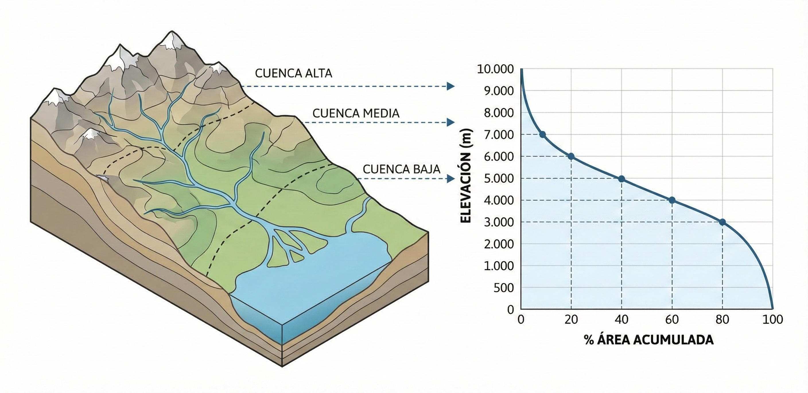
```

**Construcción de la curva hipsométrica**

La construcción de la curva hipsométrica se basa en información topográfica, tradicionalmente obtenida de mapas con curvas de nivel o, actualmente, de Modelos Digitales de Elevación. El procedimiento general incluye los siguientes pasos:

1. Se delimitan las franjas altimétricas comprendidas entre curvas de nivel consecutivas.

```{r}
#| label: fig-hipso3
#| fig-cap: "Área delimitada entre curvas de nivel."
#| fig-align: center
#| out-width: 60%
#| echo: false
#| class: fig-border

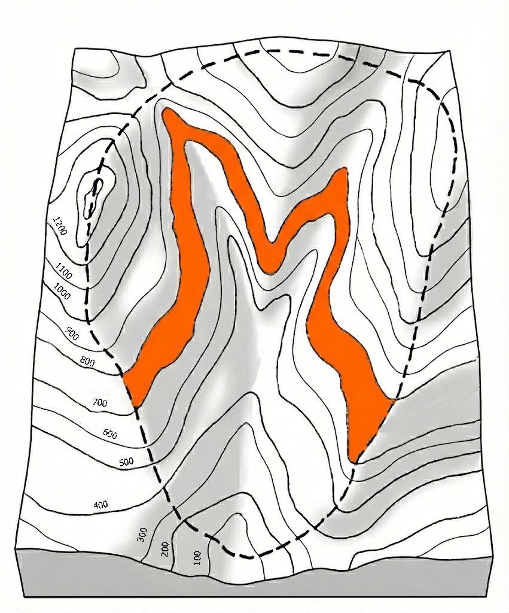
```

2. Se calcula el área parcial asociada a cada franja altitudinal.
3. Se determina el área acumulada por encima de cada cota.
4. Se normalizan los valores de área (como porcentaje del área total) y, opcionalmente, las elevaciones.
5. Se grafican los pares elevación–área, (área en las abcisas y elevación en las ordenadas) para obtener la curva hipsométrica.

Este procedimiento permite transformar la información espacial del relieve en una representación sintética y fácilmente interpretable.

La forma de la curva hipsométrica proporciona información sobre el estado geomorfológico y el grado de evolución erosiva de la cuenca. De acuerdo con la interpretación clásica propuesta por Strahler, se distinguen tres configuraciones típicas:

- Curva cóncava: característica de cuencas jóvenes, con relieves abruptos y alto potencial erosivo. Es común en zonas montañosas donde predominan pendientes fuertes y valles profundamente encajados.

- Curva en forma de S: asociada a cuencas en etapa de madurez, donde los procesos de erosión y sedimentación tienden a un equilibrio dinámico.

- Curva convexa: típica de cuencas envejecidas o sedimentarias, con relieves suaves, pendientes reducidas y amplias superficies planas.

```{r}
#| label: fig-hipso
#| fig-cap: "Estado geomorfológico, segun forma de curva hipsométrica."
#| fig-align: center
#| out-width: 100%
#| echo: false
#| class: fig-border

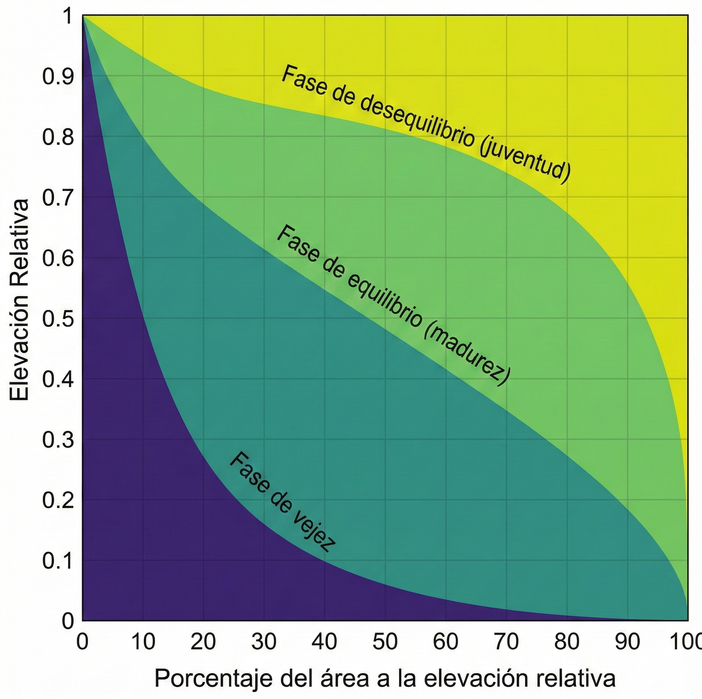
```

::: {.callout-note title="Ejemplo"}

Considere una cuenca hidrográfica para la cual se dispone de información altimétrica obtenida a partir de cartografía topográfica o de un Modelo Digital de Elevación. El objetivo es construir la curva hipsométrica, que relaciona la elevación con el área acumulada de la cuenca.

A partir del análisis del relieve, se han definido intervalos altimétricos de 50 m y se ha estimado el área comprendida en cada intervalo. La información se presenta a continuación.

```{r}
#| echo: false
#| message: false
#| warning: false

library(dplyr)
library(tibble)
library(kableExtra)

tabla_hipso <- tribble(
  ~`Intervalo altimétrico (m s.n.m.)`, ~`Cota media (m)`, ~`Área del intervalo (km^2)`,
  "900 – 850", 875, 2.40,
  "850 – 800", 825, 4.10,
  "800 – 750", 775, 6.80,
  "750 – 700", 725, 9.30,
  "700 – 650", 675, 11.20,
  "650 – 600", 625, 8.70,
  "600 – 550", 575, 5.50,
  "550 – 500", 525, 3.00
)

tabla_hipso %>%
  kbl(
    booktabs = TRUE,
    align = c("c", "c", "c"),
    format = "html",
    col.names = c("Intervalo altimétrico (m s.n.m.)", "Cota media (m)", "Área del intervalo (km²)")
  ) %>%
  kable_classic(html_font = "Latin Modern Roman") %>%
  kable_styling(full_width = FALSE, bootstrap_options = "hover") %>%
  row_spec(0, bold = TRUE)
```

**Paso 1. Cálculo del área total de la cuenca**

El área total de la cuenca se obtiene sumando las áreas parciales de todos los intervalos altimétricos:

$$
A_T = 2.40 + 4.10 + 6.80 + 9.30 + 11.20 + 8.70 + 5.50 + 3.00 = 51.00 \ \text{km}^2
$$

**Paso 2. Cálculo del área acumulada**

El área acumulada se calcula desde la cota máxima hacia la cota mínima, sumando progresivamente las áreas correspondientes a cada intervalo altimétrico. Este procedimiento permite determinar cuánta superficie de la cuenca se encuentra por debajo (o por encima, según la convención adoptada) de una determinada elevación y constituye la base para la construcción de la curva hipsométrica.


```{r}
#| echo: false
#| message: false
#| warning: false

tabla_hipso_acum <- tabla_hipso %>%
mutate(
`Área acumulada (km^2)` = cumsum(`Área del intervalo (km^2)`),
`Porcentaje acumulado (%)` = round(100 * `Área acumulada (km^2)` / 51.00, 2)
)

tabla_hipso_acum %>%
kbl(
booktabs = TRUE,
align = c("c", "c", "c", "c", "c"),
format = "html",
col.names = c("Intervalo (m)", "Cota media (m)", "Área del intervalo (km²)",
"Área acumulada (km²)", "Área acumulada (%)")
) %>%
kable_classic(html_font = "Latin Modern Roman") %>%
kable_styling(full_width = FALSE, bootstrap_options = "hover") %>%
row_spec(0, bold = TRUE)

```

**Paso 3. Construcción de la curva hipsométrica**

Para construir la curva hipsométrica se procede de la siguiente manera:

- En el eje de las ordenadas se representa la elevación, ya sea como cota media de cada intervalo altimétrico o como cota límite.
- En el eje horizontal se representa el porcentaje de área acumulada de la cuenca.
- El 0 % del área acumulada se asocia a la cota máxima de la cuenca, mientras que el 100 % corresponde a la cota mínima.

<br>

```{r}
#| label: fig-curva-hipsometrica
#| fig-cap: "Curva hipsométrica de la cuenca (elevación vs. porcentaje de área acumulada)."
#| fig-align: center
#| out-width: 85%
#| echo: false
#| message: false
#| warning: false

library(dplyr)
library(ggplot2)
library(scales)

tabla_hipso_acum$`Porcentaje acumulado (%)`[1] <- 0

datos_hipso <- tabla_hipso_acum %>%
  mutate(
    # Usar cota límite superior (inicio del intervalo)
    Cota_limite_superior = c(
      900, 850, 800, 750, 700, 650, 600, 550
    ),
    # Normalización clásica (opcional pero estándar)
    Elevacion_relativa = (Cota_limite_superior - min(Cota_limite_superior)) /
                         (max(Cota_limite_superior) - min(Cota_limite_superior))
  ) %>%
  arrange(`Porcentaje acumulado (%)`)

# Graficar curva hipsométrica
ggplot(datos_hipso,
       aes(x = `Porcentaje acumulado (%)`,
           y = Cota_limite_superior)) +
  geom_line(linewidth = 1.2, color = "black") +
  geom_point(size = 2) +
  scale_x_continuous(
    limits = c(0, 100),
    breaks = seq(0, 100, 10),
    labels = function(x) paste0(x, " %")
  ) +
  scale_y_continuous(
    limits = c(550, 900),
    breaks = seq(550, 900, 50)
  ) +
  labs(
    x = "Área acumulada (%)",
    y = "Elevación (m.s.n.m.)"
  ) 

```

:::

### Rectángulo equivalente de una cuenca hidrográfica

El concepto del rectángulo equivalente es una transformación geométrica, introducida originalmente por hidrólogos franceses, que permite representar una cuenca hidrográfica, de forma típicamente irregular, como un rectángulo que conserva la misma superficie $A$, el mismo perímetro $P$ y, por consiguiente, el mismo índice de compacidad $K_c$ que la cuenca original.

En la representación mediante el rectángulo equivalente, las curvas de nivel del terreno real se transforman en líneas rectas paralelas al lado menor del rectángulo, denotado como $l$. La distribución altimétrica dentro del rectángulo es equivalente a la curva hipsométrica de la cuenca original; es decir, la separación entre curvas de nivel en el rectángulo es proporcional al área comprendida entre dichas curvas en el terreno real.

Para que el rectángulo sea geométricamente equivalente a la cuenca, deben cumplirse simultáneamente las siguientes condiciones:

- **Área**:
$$
A = L \cdot l
$$

- **Perímetro**:
$$
P = 2(L + l)
$$

donde $L$ representa el lado mayor del rectángulo y $l$ el lado menor.

A partir de la definición del índice de compacidad:

$$
K_c = 0.28 \, \frac{P}{\sqrt{A}}
$$

Es posible derivar expresiones analíticas para estimar las dimensiones del rectángulo equivalente en función de $A$ y $K_c$.

Las expresiones son las siguientes:

- **Lado mayor ($L$)**:
$$
L =
\frac{K_c \, \sqrt{A}}{1.12}
\left[
1 + \sqrt{1 - \left(\frac{1.12}{K_c}\right)^2}
\right]
$$

- **Lado menor ($l$)**:
$$
l =
\frac{K_c \, \sqrt{A}}{1.12}
\left[
1 - \sqrt{1 - \left(\frac{1.12}{K_c}\right)^2}
\right]
$$

Estas expresiones permiten construir un rectángulo geométricamente equivalente a la cuenca real.

```{r}
#| label: fig-rec_equi
#| fig-cap: "Rectangulo equivalente de una cuenca hidrográfica."
#| fig-align: center
#| out-width: 100%
#| echo: false
#| class: fig-border

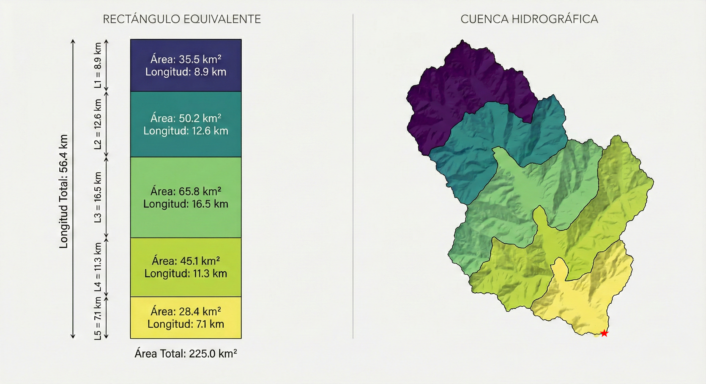
```

::: {.callout-note title="Ejemplo"}
Considérese una cuenca hidrográfica con un área de drenaje $A = 180 \ \text{km}^2$ y un perímetro $P = 62 \ \text{km}$.  
Se desea estimar las dimensiones del rectángulo equivalente asociado a la cuenca y analizar su significado hidrológico.

**Paso 1. Cálculo del coeficiente de compacidad**

El coeficiente de compacidad se calcula como:

$$
K_c = 0.28 \, \frac{P}{\sqrt{A}}
$$

Sustituyendo los valores:

$$
K_c = 0.28 \, \frac{62}{\sqrt{180}}
     = 0.28 \times \frac{62}{13.42}
     \approx 1.29
$$

***Paso 2. Cálculo del lado mayor del rectángulo equivalente***

El lado mayor $L$ se obtiene mediante:

$$
L =
\frac{K_c \, \sqrt{A}}{1.12}
\left[
1 + \sqrt{1 - \left(\frac{1.12}{K_c}\right)^2}
\right]
$$

Sustituyendo:

$$
L =
\frac{1.29 \times \sqrt{180}}{1.12}
\left[
1 + \sqrt{1 - \left(\frac{1.12}{1.29}\right)^2}
\right]
$$

$$
L \approx
\frac{1.29 \times 13.42}{1.12}
\left[
1 + \sqrt{1 - 0.75}
\right]
\approx
15.47 \times (1 + 0.50)
\approx 23.2 \ \text{km}
$$

**Paso 3. Cálculo del lado menor del rectángulo equivalente**

El lado menor $l$ se calcula como:

$$
l =
\frac{K_c \, \sqrt{A}}{1.12}
\left[
1 - \sqrt{1 - \left(\frac{1.12}{K_c}\right)^2}
\right]
$$

Sustituyendo:

$$
l \approx
15.47 \times (1 - 0.50)
\approx 7.7 \ \text{km}
$$

**Paso 4. Verificación geométrica**

Se comprueba que el rectángulo conserva el área de la cuenca:

$$
A = L \cdot l = 23.2 \times 7.7 \approx 179 \ \text{km}^2 \approx A
$$

La ligera diferencia se debe al redondeo numérico.


El rectángulo equivalente permite así simplificar la geometría real de la cuenca sin perder información esencial sobre su forma global y su influencia en la respuesta hidrológica.
:::

### Índice de pendiente

El índice de pendiente, conocido en la literatura técnica como índice de *Roche* o índice de susceptibilidad a la escorrentía, es un parámetro morfométrico que permite cuantificar el relieve de una cuenca hidrográfica de manera **ponderada**. 

A diferencia de la pendiente media simple, este índice incorpora explícitamente la distribución altimétrica y la longitud efectiva del recorrido del flujo, proporcionando una medida más representativa de la energía potencial disponible para la escorrentía superficial.

Este indicador resulta especialmente útil para analizar la respuesta hidrológica de la cuenca, ya que integra simultáneamente información geométrica y altimétrica del sistema.

El cálculo del índice de pendiente se apoya en el concepto del rectángulo equivalente, en esta representación:

- El lado mayor del rectángulo ($L$) coincide con la dirección principal de escurrimiento.
- El lado menor ($l$) es perpendicular al flujo principal.
- Las curvas de nivel de la cuenca real se transforman en líneas rectas paralelas al lado menor del rectángulo.
- La separación entre curvas en el rectángulo es proporcional al área comprendida entre dichas curvas en el terreno natural.

De esta forma, la variación altimétrica se redistribuye linealmente a lo largo del rectángulo equivalente, permitiendo evaluar el relieve de manera integrada.

El índice de pendiente se calcula mediante la expresión:

$$
I_p =
\frac{1}{\sqrt{L}}
\sum_{i=2}^{n}
\sqrt{\beta_i \, (a_i - a_{i-1})}
$$

donde:

- $I_p$: índice de pendiente (adimensional o expresado como índice de relieve).
- $n$: número total de curvas de nivel consideradas en el análisis, incluyendo las cotas extremas.
- $a_i, a_{i-1}$: cotas de las curvas de nivel consecutivas, expresadas en kilómetros (km).
- $\beta_i$: fracción del área total de la cuenca comprendida entre las cotas $a_i$ y $a_{i-1}$, definida como  
  $$
  \beta_i = \frac{A_i}{A_T}
  $$
  - $A_i$: área parcial entre dos curvas de nivel consecutivas.
  - $A_T$: área total de la cuenca.
- $L$: longitud del lado mayor del rectángulo equivalente (km).

Esta formulación pondera los desniveles altimétricos por la proporción de área asociada a cada franja, evitando que pequeñas áreas con grandes pendientes distorsionen la caracterización global del relieve.

El valor del índice de pendiente tiene implicaciones directas sobre el comportamiento hidrológico y geomorfológico de la cuenca:

- <u>Dinámica de la escorrentía</u>: Valores elevados de $I_p$ indican cuencas con relieve pronunciado, capaces de generar respuestas rápidas ante eventos de precipitación. Estas cuencas suelen presentar tiempos de concentración menores y picos de caudal más elevados.

- <u>Capacidad de transporte de sedimentos</u>: Un índice alto sugiere mayores pendientes hidráulicas efectivas, lo que incrementa la capacidad del flujo para movilizar sedimentos gruesos y condiciona la granulometría del cauce.

- <u>Susceptibilidad a la erosión</u>: El índice de pendiente es un buen indicador de la propensión de la cuenca a procesos erosivos, ya que pendientes largas y pronunciadas favorecen escorrentías más veloces y con mayor energía cinética.

::: {.callout-note title="Ejemplo"}

Considérese una cuenca hidrográfica para la cual se ha determinado el rectángulo equivalente, cuyo lado mayor tiene una longitud $L = 24.0 \ \text{km}.$

A partir del análisis altimétrico, la cuenca se divide en varios intervalos de pendiente definidos entre curvas de nivel consecutivas. Para cada intervalo se estima el área parcial y la pendiente media, con el fin de calcular el índice de pendiente $I_p$.

La información básica del análisis se resume en la siguiente tabla, construida a partir del rectángulo equivalente y de la distribución altimétrica de la cuenca.

```{r}
# Ejemplo ilustrativo para el cálculo del índice de pendiente
library(dplyr)
library(tibble)
library(kableExtra)

tabla_pendiente <- tribble(
  ~`Intervalo de pendiente (m/m)`, ~`Número de franjas`, ~`Área parcial (km²)`, ~`Pendiente media del intervalo`,
  "0.000 – 0.010",  5,  6.0,  0.005,
  "0.010 – 0.020",  7, 14.0,  0.015,
  "0.020 – 0.030",  6, 18.0,  0.025,
  "0.030 – 0.040",  4, 12.0,  0.035,
  "0.040 – 0.050",  2, 10.0,  0.045
) %>%
  mutate(
    `Fracción de área (βᵢ)` = round(`Área parcial (km²)` / sum(`Área parcial (km²)`), 3)
  )

tabla_pendiente %>%
  kbl(
    booktabs = TRUE,
    align = c("c","c","c","c","c"),
    format = "html",
    col.names = c("Intervalo de pendiente (m/m)",
                  "Número de franjas",
                  "Área parcial (km²)",
                  "Pendiente media",
                  "Fracción de área βᵢ")
  ) %>%
  kable_classic(html_font = "Latin Modern Roman") %>%
  kable_styling(full_width = FALSE, bootstrap_options = "hover") %>%
  row_spec(0, bold = TRUE)
```

<br>

El área total de la cuenca es:

$$
A_T =
6.0 +
14.0 +
18.0 +
12.0 +
10.0
=
60.0 \ \text{km}^2
$$

El índice de pendiente se expresa como:

$$
I_p =
\frac{1}{\sqrt{L}}
\sum_{i=2}^{n}
\sqrt{\beta_i \, (a_i - a_{i-1})}
$$
Así, cada término de la sumatoria se calcula como:

$$
\beta_i \, (a_i - a_{i-1}) = \beta_i \, \Delta a
$$

Primero se calculan las fracciones de área de cada intervalo:

$$
\beta_1 = \frac{6}{60} = 0.100,\quad
\beta_2 = \frac{14}{60} = 0.233,\quad
\beta_3 = \frac{18}{60} = 0.300,\quad
\beta_4 = \frac{12}{60} = 0.200,\quad
\beta_5 = \frac{10}{60} = 0.167
$$

Luego, se evalúan los términos de la sumatoria (con $\Delta a = 0.10 \ \text{km}$):

$$
\sqrt{\beta_2 \Delta a}
=
\sqrt{0.233(0.10)}
=
\sqrt{0.0233}
=
0.1526
$$

$$
\sqrt{\beta_3 \Delta a}
=
\sqrt{0.300(0.10)}
=
\sqrt{0.0300}
=
0.1732
$$

$$
\sqrt{\beta_4 \Delta a}
=
\sqrt{0.200(0.10)}
=
\sqrt{0.0200}
=
0.1414
$$

$$
\sqrt{\beta_5 \Delta a}
=
\sqrt{0.167(0.10)}
=
\sqrt{0.0167}
=
0.1292
$$

Sumando los términos desde el intervalo $i = 2$ hasta $n = 5$:

$$
\sum_{i=2}^{5} \sqrt{\beta_i \Delta a}
=
0.1526 + 0.1732 + 0.1414 + 0.1292
=
0.5964
$$

Finalmente, considerando que el lado mayor del rectángulo equivalente es $L = 24.0 \ \text{km}$, el índice de pendiente se obtiene como:

$$
I_p
=
\frac{1}{\sqrt{L}}
\left( \sum_{i=2}^{5} \sqrt{\beta_i \Delta a} \right)
=
\frac{0.5964}{\sqrt{24.0}}
=
\frac{0.5964}{4.899}
\approx 0.122
$$


:::

### Pendiente de laderas

En el estudio morfométrico de una cuenca, la pendiente de las laderas es uno de los factores topográficos más determinantes, ya que controla directamente la velocidad del flujo superficial y la capacidad del agua para erosionar y transportar sedimentos [@Linsley1958].

Mientras que el área de la cuenca condiciona principalmente el volumen potencial de escorrentía, la inclinación de las laderas regula la rapidez con la que dicha masa de agua alcanza la red de drenaje, influyendo de forma directa en el tiempo de concentración $(t_c)$ y en la magnitud de los caudales pico.

La pendiente de las laderas afecta el comportamiento hidrológico y geomorfológico de la cuenca de las siguientes maneras:

a. **Velocidad de escurrimiento**: A mayor pendiente, la escorrentía superficial adquiere mayores velocidades, lo que reduce el tiempo disponible para la infiltración y genera respuestas hidrológicas más rápidas ante eventos de precipitación intensa.

b. **Potencial erosivo**: La combinación de pendientes fuertes y longitudes significativas de ladera incrementa la energía cinética del flujo, favoreciendo procesos de erosión superficial, formación de surcos y cárcavas, especialmente en suelos poco protegidos por vegetación.

c. **Estabilidad de laderas**: En pendientes muy pronunciadas (generalmente superiores al 50–75 %), aumentan los riesgos de inestabilidad del terreno y la ocurrencia de movimientos en masa, como deslizamientos y flujos de detritos, debido al predominio de los esfuerzos cortantes sobre la resistencia del suelo.

La pendiente media de las laderas puede estimarse mediante Sistemas de Información Geográfica (SIG) a partir de Modelos Digitales de Elevación, o mediante métodos analítico-gráficos tradicionales, como el **método de Horton**, aplicado sobre mapas de curvas de nivel.

El método de Horton consiste en superponer una cuadrícula regular sobre el mapa topográfico de la cuenca y contabilizar las intersecciones entre las líneas de la cuadrícula y las curvas de nivel. La pendiente se estima mediante la expresión:

$$
P = \frac{\sum L}{n \cdot e}
$$

donde:
- $n$ es el número total de intersecciones entre la cuadrícula y las curvas de nivel,  
- $e$ es la equidistancia vertical entre curvas de nivel,  
- $\sum L$ es la longitud total de las líneas de la cuadrícula dentro de la cuenca.

La pendiente media de la cuenca ($P_m$) se obtiene como el promedio de las pendientes calculadas en sentido vertical y horizontal:

$$
P_m = \frac{P_{vert} + P_{hori}}{2}
$$

Para fines de análisis hidrológico, manejo de suelos y diseño de infraestructura, se emplean clasificaciones cualitativas basadas en rangos de pendiente.


```{r}
library(dplyr)
library(tibble)
library(kableExtra)

tabla_pendientes <- tribble(
  ~Clase, ~Símbolo, ~`Intervalo (%)`, ~`Clasificación cualitativa`,
  1, "A", "0 – 4",     "Plano a ligeramente inclinada",
  2, "B", "4 – 15",    "Moderada a fuertemente inclinada",
  3, "C", "15 – 25",   "Moderadamente empinada",
  4, "D", "25 – 50",   "Empinada",
  5, "E", "50 – 75",   "Muy empinada",
  6, "F", "75 – 100",  "Extremadamente muy empinada",
  7, "G", "> 100",     "Abrupta"
)

tabla_pendientes %>%
  kbl(
    booktabs = TRUE,
    align = c("c","c","c","c"),
    format = "html",
    col.names = c("Clase", "Símbolo", "Pendiente (%)", "Descripción")
  ) %>%
  kable_classic(html_font = "Latin Modern Roman") %>%
  kable_styling(full_width = FALSE, bootstrap_options = "hover") %>%
  row_spec(0, bold = TRUE)

```


### Pendiente del cauce principal

La pendiente del cauce principal es uno de los indicadores más relevantes del tipo de respuesta hidrológica de una cuenca ante un evento de precipitación, ya que controla directamente la velocidad del flujo y, en consecuencia, el tiempo de concentración. A mayor pendiente longitudinal del cauce, menor es el tiempo requerido para que la escorrentía alcance el punto de salida, incrementando la rapidez y magnitud de la respuesta hidrológica.

Dado que la pendiente de un río <u>no es uniforme a lo largo de su recorrido</u>, presentando usualmente un perfil longitudinal cóncavo hacia arriba, con mayores pendientes en los tramos altos y menores en los tramos bajos, resulta inadecuado describirla mediante un único valor puntual. Por esta razón, en la hidrología se emplean métodos de pendiente media representativa, que integran la variación altimétrica a lo largo del cauce principal, permitiendo caracterizar de forma más realista la energía disponible para el escurrimiento y su influencia sobre la propagación de las crecidas.


**Pendiente promedio $(S_1)$**

Es el método más sencillo y directo para estimar la pendiente del cauce principal. Define la pendiente media como la relación entre el desnivel total del cauce y su longitud total medida en planta.

Se describe mediante la siguiente expresión:

$$
S_1 = \frac{H}{L} = \frac{h_{\max} - h_{\min}}{L}
$$

donde:

- $h_{\max}$: elevación del punto más alto del cauce principal.  
- $h_{\min}$: elevación del punto de salida o punto de control.  
- $L$: longitud del cauce principal medida a lo largo de su eje.

Aunque es fácil de calcular, este parámetro tiene la limitación de no considerar las variaciones intermedias del perfil; dos ríos con perfiles radicalmente distintos (uno muy quebrado y otro suavizado) podrían tener la misma $S_1$ si sus extremos coinciden.


```{r}
#| label: fig-s1
#| fig-cap: "Pendiente promedio del cauce principal."
#| fig-align: center
#| out-width: 100%
#| echo: false
#| class: fig-border

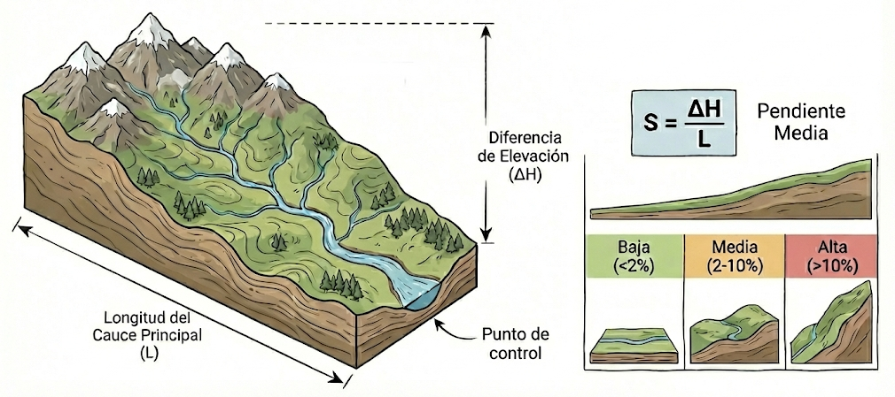
```

**Pendiente media ponderada $(S_2)$**

La pendiente media ponderada, también conocida como pendiente compensada o método de compensación de áreas, es un parámetro que ofrece una representación más fiel de la capacidad de transporte de energía de un cauce que la pendiente promedio simple ($S_1$).

En la naturaleza, el perfil longitudinal de un río rara vez es una línea recta; por lo general, presenta una forma cóncava hacia arriba, con pendientes pronunciadas en las cabeceras que se suavizan gradualmente hacia la desembocadura. Mientras que la pendiente simple $(S_1)$ solo considera el desnivel total entre los extremos, la pendiente ponderada integra las variaciones intermedias del relieve a lo largo de todo el curso.

Este método se basa en trazar una línea recta teórica que parta desde el punto de salida o control de la cuenca $(h_0)$, hasta un punto $(z_A)$ de elevación. Dicho punto $(z_A)$ es la altura del vértice de un triángulo con área equivalente al área bajo el perfil longitudinal del río, tal y como se muestra en la @fig-s2.

Matemáticamente, se expresa como:

$$
S_2 = \frac{z_A - h_0}{L}
$$

Donde:

• $S_2$: Pendiente media ponderada (adimensional o en m/m).  
• $z_A$: Elevación en el extremo superior de la línea de compensación (m).  
• $h_0$: Elevación del punto de salida o desembocadura (m).  
• $L$: Longitud total del cauce principal medida a lo largo de su eje (m o km).


```{r}
#| label: fig-s2
#| fig-cap: "Pendiente promedio del cauce principal.<br><span style='font-size:0.8em;'>Fuente: [@Porras2025]</span>"
#| fig-align: center
#| out-width: 100%
#| echo: false
#| class: fig-border

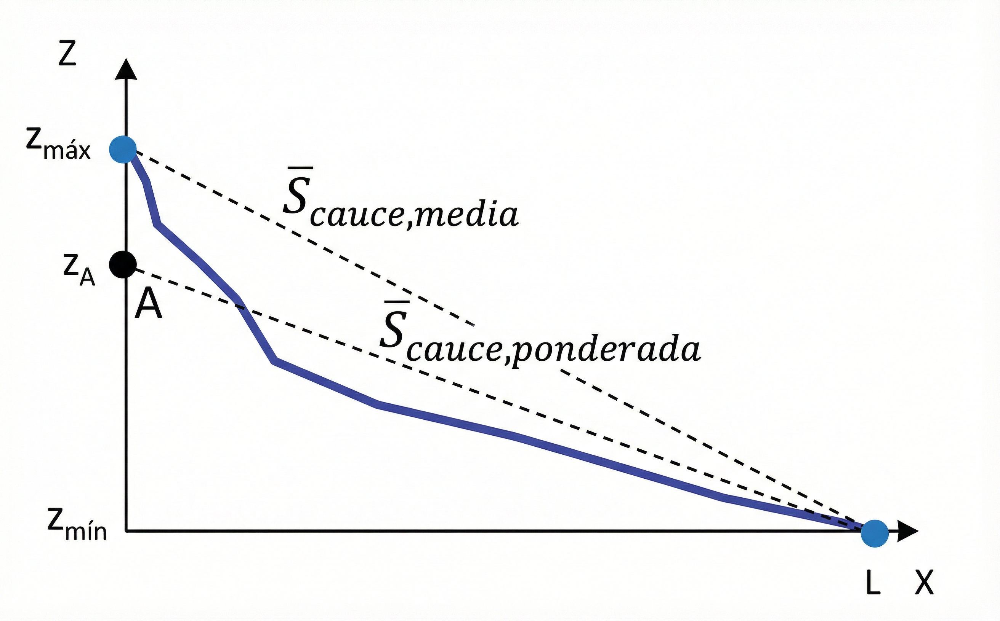
```

**Pendiente de Taylor y Schwartz $(S_3)$**

La pendiente de Taylor y Schwartz, también conocida como pendiente equivalente constante, es un parámetro morfométrico que ofrece una visión del relieve basada en el comportamiento hidráulico de la escorrentía. A diferencia de los métodos puramente geométricos como $(S_1)$ y $(S_2)$, este parámetro representa la pendiente de un canal teórico de sección transversal uniforme que tenga la misma longitud y el mismo tiempo de recorrido que el curso de agua real.

Este método parte de las fórmulas de flujo uniforme (como Manning o Chézy), donde se establece que la velocidad del agua $(V)$ es proporcional a la raíz cuadrada de la pendiente $(V = k \sqrt{S})$. Dado que el tiempo de recorrido varía en toda la extensión del río como el inverso de la raíz cuadrada de las pendientes de sus tramos, este índice pondera los segmentos del cauce para reflejar el retardo que imponen las zonas más planas.

En la práctica, se considera que el canal está dividido en $n$ tramos. Si el flujo debe recorrer cada tramo $i$ con una pendiente $S_i$, el tiempo de viaje total será la suma de los tiempos individuales.

Dependiendo de cómo se fragmente el cauce principal, existen dos expresiones para calcular $S_3$:

A. Para tramos de igual longitud ($\Delta x$):  
Si el río se divide en $m$ tramos de la misma longitud, la ecuación se simplifica a:

$$
S_3 = \left[ \frac{1}{m} \left( \frac{1}{\sqrt{S_1}} + \frac{1}{\sqrt{S_2}} + \cdots + \frac{1}{\sqrt{S_m}} \right) \right]^2
$$

B. Para tramos de diferentes longitudes $(d_i)$:  
Cuando los segmentos tienen longitudes variables (por ejemplo, divididos según cambios bruscos de pendiente), se utiliza la media armónica ponderada:

$$
S_3 = \left[ \frac{\sum_{i=1}^{n} d_i}{\sum_{i=1}^{n} \frac{d_i}{\sqrt{S_i}}} \right]^2
$$

Donde:

• $L$: Longitud total del cauce principal ($\sum l_i$).  
• $d_i$: Longitud del tramo $i$.  
• $S_i$: Pendiente del tramo $i$.


```{r}
#| label: fig-s3
#| fig-cap: "Pendiente promedio del cauce principal.<br><span style='font-size:0.8em;'>Fuente: [@Porras2025]</span>"
#| fig-align: center
#| out-width: 100%
#| echo: false
#| class: fig-border

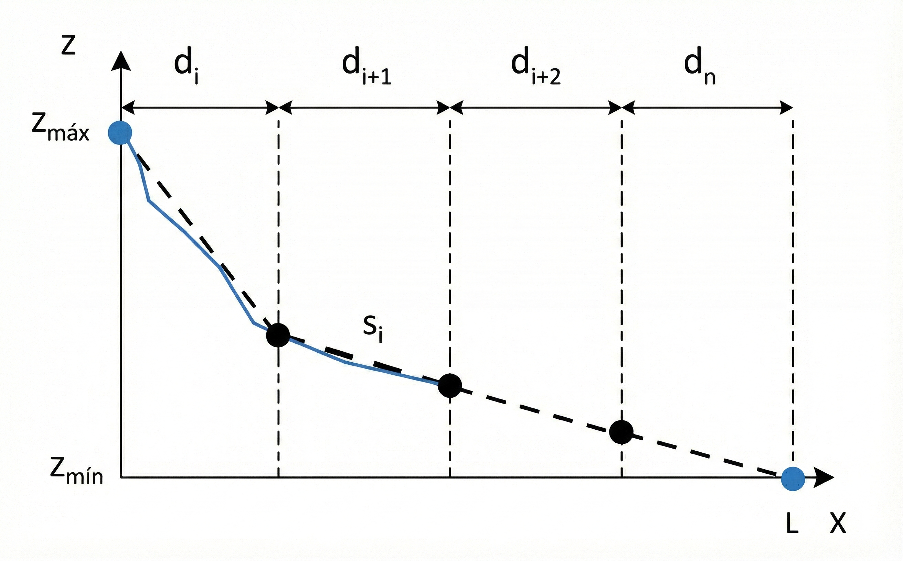
```


::: {.callout-note title="Ejemplo"}

Considérese un cauce principal de longitud total $L = 2000 \ \text{m}$, dividido en $m = 5$ tramos de igual longitud $d_i = 400 \ \text{m}$. Para cada tramo se conoce el desnivel $\Delta h_i$ y se calcula la pendiente media $S_i = \Delta h_i / d_i$. Se evalúa el término $d_i / \sqrt{S_i}$, que representa el tiempo relativo de recorrido en cada tramo.

```{r}
library(dplyr)
library(tibble)
library(kableExtra)

tabla_taylor <- tribble(
  ~`Tramo (i)`, ~`Longitud l_i (m)`, ~`Desnivel Δh_i (m)`, ~`Pendiente S_i (m/m)`, ~`l_i / sqrt(S_i)`,
  1, 400,  8,  0.0200, 2828.43,
  2, 400, 10,  0.0250, 2529.82,
  3, 400, 12,  0.0300, 2309.40,
  4, 400, 15,  0.0375, 2065.59,
  5, 400, 20,  0.0500, 1788.85
)

tabla_taylor %>%
  kbl(
    booktabs = TRUE,
    align = c("c","c","c","c","c"),
    format = "html",
    escape = FALSE,
    col.names = c(
      "Tramo",
      "Longitud (m)",
      "Desnivel (m)",
      "Pendiente S<sub>i</sub> (m/m)",
      "d<sub>i</sub> / &radic;S<sub>i</sub>"
    )
  ) %>%
  kable_classic(html_font = "Latin Modern Roman") %>%
  kable_styling(
    full_width = FALSE,
    bootstrap_options = "hover"
  ) %>%
  row_spec(0, bold = TRUE)
```


La suma de los términos $d_i / \sqrt{S_i}$ es:

$$
\sum_{i=1}^{5} \frac{d_i}{\sqrt{S_i}} = 11522.09
$$

Aplicando la expresión de Taylor y Schwartz para tramos de igual longitud:

$$
S_3 =
\left[
\frac{1}{L}
\sum_{i=1}^{m}
\frac{d_i}{\sqrt{S_i}}
\right]^2
$$

Sustituyendo los valores:

$$
S_3 =
\left[
\frac{11522.09}{2000}
\right]^2
=
(0.17358)^2
=
0.03013 \ \text{m/m}
$$

:::


## Geología de la cuenca

En la caracterización morfométrica y funcional de una unidad hidrológica, el estudio de la geología es un pilar fundamental, ya que determina los mecanismos de almacenamiento y movimiento del agua en el subsuelo, así como la composición química del recurso hídrico. Mientras que la topografía dicta principalmente el movimiento superficial, la estructura geológica y la litología controlan la capacidad de la cuenca para recibir, almacenar y transmitir agua hacia los acuíferos o de regreso a la red de drenaje en forma de flujo base.

El agua en el subsuelo ocupa los espacios vacíos de las formaciones geológicas, conocidos como intersticios o poros. Estos pueden ser:

- **Poros primarios**: formados simultáneamente con la roca, característicos de sedimentos no consolidados.

- **Poros secundarios**: generados por procesos posteriores como fracturación, fallamiento o disolución química, comunes en calizas y rocas ígneas.

Para cuantificar la capacidad de almacenamiento del medio geológico se emplean los siguientes parámetros:

- **Porosidad ($n$)**: relación entre el volumen de vacíos ($V_v$) y el volumen total de la muestra ($V_t$):
  
  $$
  n = \frac{V_v}{V_t} \cdot 100
  $$

- **Porosidad eficaz ($n_e$)**: fracción de poros interconectados que permiten la circulación del agua. No todo el volumen de poros contribuye al flujo, ya que una parte del agua queda retenida por fuerzas moleculares y capilares.

- **Producción específica o porosidad drenable ($S_y$)**: volumen de agua que un medio saturado libera por acción de la gravedad.

- **Retención específica ($S_r$)**: fracción del agua que permanece retenida en el medio por fuerzas capilares.

Entre estos parámetros se cumple la relación fundamental:

$$
n = S_y + S_r
$$

```{r}
#| label: fig-geologia
#| fig-cap: "Mapa geológico de Costa Rica.<br><span style='font-size:0.8em;'>Fuente: (Sociedad geológica de Costa Rica, 2007)</span>"
#| fig-align: center
#| out-width: 100%
#| echo: false
#| class: fig-border

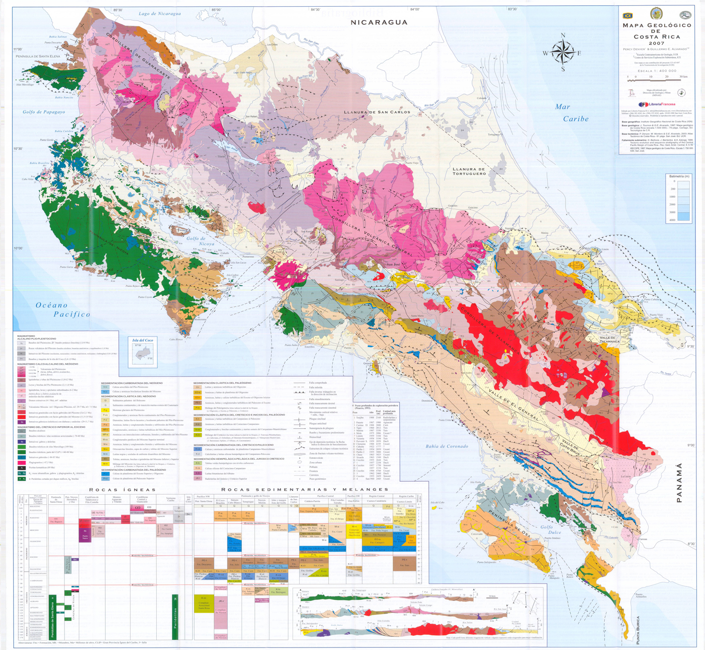
```

## Cobertura y uso del suelo

A diferencia de las características geométricas, como el área o la forma, que permanecen prácticamente constantes en el tiempo, la cobertura del suelo puede modificarse por procesos naturales o por actividades antrópicas, alterando de manera significativa la respuesta hidrológica ante los eventos de precipitación.

La cobertura y el uso del suelo representan uno de los parámetros dinámicos más influyentes en el ciclo hidrológico de una cuenca, <span class="firebrick"><strong>¡es importante tener presente la diferencia entre ambos términos!</strong></span> 

La **cobertura del suelo** se refiere a la capa física que recubre la superficie terrestre, e incluye la vegetación natural (bosques, pastizales), cultivos agrícolas, cuerpos de agua, afloramientos rocosos y superficies impermeables como pavimentos y edificaciones.  

El **uso del suelo**, por su parte, describe la actividad humana o el propósito económico asociado a dicha cobertura, por ejemplo, uso agrícola, urbano, forestal o de conservación.

La vegetación y litosfera^[Es la capa sólida más externa del planeta Tierra y constituye el soporte físico donde habitan los seres humanos y se desarrollan los sistemas naturales y antrópicos. Está formada por la corteza terrestre y la porción superior del manto, y se caracteriza por su comportamiento rígido en escalas de tiempo geológicas.] desempeñan un papel clave en la regulación del movimiento del agua a través de varios procesos fundamentales:

- **Intercepción**: corresponde al volumen de lluvia captado por el follaje, ramas y estructuras vegetales antes de alcanzar el suelo. En eventos de corta duración en zonas boscosas, este proceso puede devolver a la atmósfera entre el 10 % y el 30 % de la precipitación total.

- **Infiltración**: los sistemas radiculares generan macroporos que facilitan la entrada del agua hacia capas más profundas del suelo. Además, la cobertura vegetal amortigua el impacto de las gotas de lluvia, reduciendo la formación de costras superficiales que limitan la capacidad de infiltración.

- **Evapotranspiración (ET)**: constituye una de las principales salidas de agua en el balance hídrico de la cuenca. Las plantas extraen agua de la zona radicular para sus procesos fisiológicos y la liberan posteriormente a la atmósfera, influyendo de forma directa en la disponibilidad hídrica y en la magnitud de la escorrentía superficial.

```{r}
#| label: fig-cober
#| fig-cap: "Mapa de cobertura del suelo de Costa Rica.<br><span style='font-size:0.8em;'>Fuente: (Sociedad geológica de Costa Rica, 2007)</span>"
#| fig-align: center
#| out-width: 100%
#| echo: false
#| class: fig-border

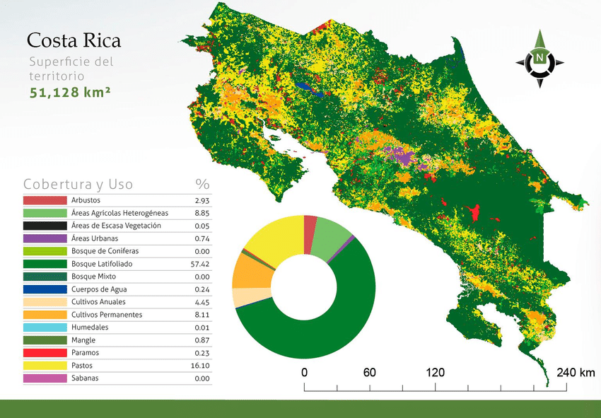
```

## Cuencas urbanas

En condiciones naturales, los límites de una cuenca están determinados por la topografía, específicamente por las divisorias de aguas que siguen las cotas más altas del terreno y separan direcciones opuestas de escorrentía superficial.

En una cuenca natural, el ciclo hidrológico está regulado por procesos biológicos, edafológicos y geomorfológicos que favorecen la infiltración, el almacenamiento temporal del agua y una liberación gradual de los caudales hacia la red de drenaje. 

Sin embargo, el desarrollo urbano altera de forma sustancial este equilibrio hidrológico. La sustitución de la cobertura natural por superficies impermeables como calles, aceras, techos y estacionamientos, reduce drásticamente la infiltración y la capacidad de almacenamiento del sistema, acelerando la generación de escorrentía superficial y modificando tanto la cantidad como la ruta del agua dentro de la cuenca.

```{r}
#| label: fig-urbana2
#| fig-cap: "Delimitación de cuenca natural, respecto a cuenca urbana.<br><span style='font-size:0.8em;'>Fuente: (Google Earth Engine, 2025)</span>"
#| fig-align: center
#| out-width: 100%
#| echo: false
#| class: fig-border

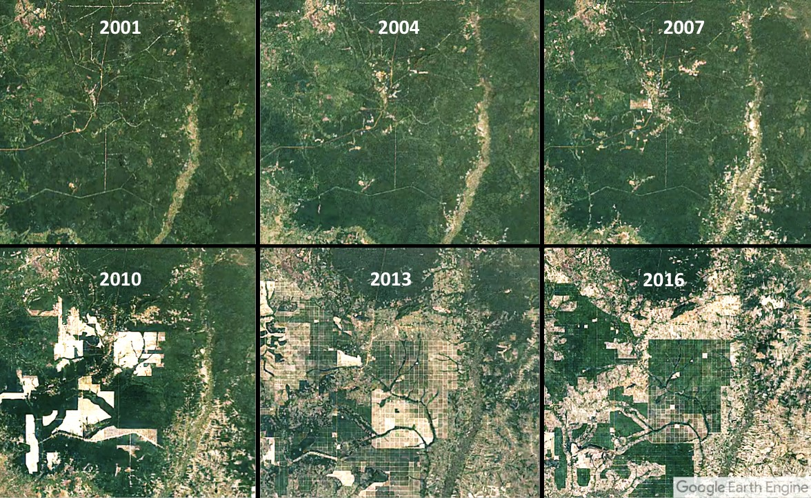
```

En una cuenca natural, el sistema presenta una alta capacidad de regulación hidrológica. La vegetación y los suelos permeables actúan como elementos de retención y amortiguamiento, lo que se traduce en hidrogramas de respuesta suave, con tiempos de concentración relativamente largos y caudales pico moderados. El flujo superficial se organiza de manera progresiva, siguiendo la topografía del terreno y convergiendo de forma natural hacia el cauce principal.

Por el contrario, una cuenca urbana se caracteriza por una respuesta hidrológica rápida y amplificada. La eliminación de la intercepción vegetal y la reducción de la infiltración provocan que una fracción significativamente mayor de la precipitación se transforme en escorrentía directa. En zonas urbanizadas, el volumen de escorrentía puede incrementarse de forma considerable en comparación con condiciones naturales, y el tiempo de concentración se reduce drásticamente, generando hidrogramas más abruptos y caudales pico elevados.

Uno de los aspectos más relevantes en hidrología urbana es que la divisoria de aguas deja de estar controlada exclusivamente por la topografía natural. En entornos urbanos, la red de drenaje artificial (compuesta por calles, cunetas, tragantes y colectores pluviales subterráneos) introduce nuevas rutas de escorrentía que pueden atravesar o ignorar completamente las divisorias topográficas originales. La delimitación topográfica natural no es suficiente, se debe considerar el sistema de alcantarillado pluvial, que a menudo traslada agua a través de las divisorias topográficas naturales mediante tuberías y canales artificiales

Las calles y aceras funcionan como canales superficiales que dirigen el agua hacia los puntos de captación del sistema pluvial. A partir de estos puntos, el flujo es conducido por tuberías subterráneas que conectan áreas que, desde un punto de vista topográfico, podrían pertenecer a cuencas distintas. Como resultado, la delimitación de una cuenca urbana responde principalmente a la configuración de la red de drenaje y no únicamente al relieve del terreno.

La modificación de la conectividad hidrológica en cuencas urbanas tiene implicaciones directas en la gestión del riesgo por inundaciones, el diseño de infraestructura pluvial y la calidad del agua. El incremento en la densidad de drenaje artificial y la reducción de los tiempos de respuesta hacen que los sistemas urbanos sean más vulnerables a eventos de lluvia intensa, incluso de corta duración, provocando que estas cuencas sean más vulnerables a sufrir inundaciones.

```{r}
#| label: fig-urbana
#| fig-cap: "Delimitación de cuenca natural, respecto a cuenca urbana."
#| fig-align: center
#| out-width: 100%
#| echo: false
#| class: fig-border

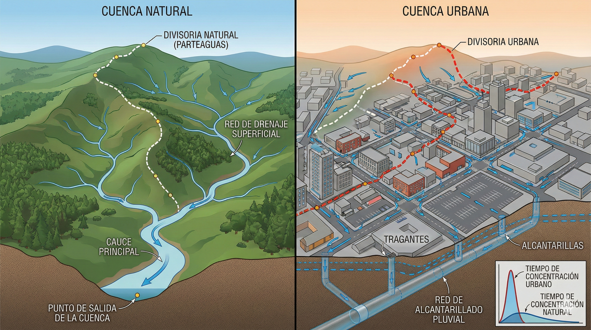
```

Por esta razón, el análisis y la delimitación de cuencas urbanas deben considerar explícitamente la red de drenaje superficial y subterránea, así como su interacción con la topografía original. Una comprensión adecuada de estos procesos es fundamental para el diseño de sistemas pluviales eficientes, la implementación de soluciones basadas en la naturaleza y la transición hacia esquemas de drenaje urbano más sostenibles.


## Fuentes de información

Para Costa Rica, existen diversas fuentes de las cuales se puede obtener información valiosa y necesaria para una correcta caracterización de cuenca. Algunas de estas fuentes son:

- Atlas digitales (e.g. [Atlas del ITCR](https://repositoriotec.tec.ac.cr/handle/2238/6749))

- Mapas de suelos oficiales ([MAG](https://www.mag.go.cr/bibliotecavirtual/av-1630.pdf))

- Imágenes satelitales o fotografías aéreas ([SNIT](https://www.snitcr.go.cr/ico_servicios_ogc))

- Reportes de campañas geológicas (e.g. Escuela Centroamericana de Geología)

- Estudios específicos de la cuenca a analizar (revisión bibliográfica)


---

<div style="font-size: 0.8em;">

**Nota Histórica**

Las contribuciones del hidrólogo Robert E. Horton sentaron las bases de la geomorfología cuantitativa en hidrología, al proponer un conjunto de leyes empíricas que describen cómo se organizan las redes de drenaje y cómo estas características influyen en la respuesta hidrológica de una cuenca. Estas leyes reflejan un proceso de ramificación que sigue una progresión geométrica.

 <u>1. Ley del número de órdenes de cauces</u>: Esta ley establece una jerarquía en el sistema de drenaje que cuantifica el grado de ramificación o bifurcación de la cuenca.
 
 <u>2. Ley de las longitudes y áreas de cauces</u>: Estas leyes postulan que, al igual que el número de corrientes, la longitud promedio de los cauces y las áreas de drenaje promedio de las cuencas correspondientes a cada orden siguen una progresión geométrica.
 
  - Ley de las longitudes: La longitud promedio de los cauces de orden $u$, $(L_u)$ está relacionada con el cociente de longitudes $(R_L)$.

  - Ley de las áreas: El área de drenaje promedio de las cuencas de orden $u$, $(A_u)$ está relacionada con el cociente de áreas $(R_A)$.
  
<u>3. Ley de las pendientes</u>: La pendiente promedio de los cauces dentro de una cuenca tiende a disminuir conforme aumenta el orden del cauce.

 </div>
 
---