::: {.quote-block}
“La hidrología no es solo el estudio del agua, sino el estudio de su medición.”\
— *Robert E. Horton, hidrólogo, padre de la hidrología moderna*
:::

La hidrología es una ciencia intensiva en información. Como disciplina que estudia la ocurrencia, circulación y distribución del agua en la superficie terrestre y la atmósfera, su progreso depende directamente de la disponibilidad de datos precisos y representativos. En la hidrología, el análisis de estos datos no constituye un fin en sí mismo, sino el primer paso fundamental para el diseño y dimensionamiento de obras de control y aprovechamiento del recurso hídrico, tales como presas, sistemas de drenaje vial y proyectos hidroeléctricos.

Sin mediciones sistemáticas y confiables, la hidróloga o el hidrólogo se enfrentan a una limitación crítica, ya que muchos de los procesos naturales involucrados no admiten un análisis puramente deductivo o mecánico. En su lugar, el estudio hidrológico debe apoyarse en hechos observados, a partir de los cuales se formulan relaciones empíricas y criterios de diseño que describen el comportamiento integrado de una cuenca hidrográfica.

Nuestro trabajo desde la hidrología no es una tarea meramente teórica, sino que consiste en construir, calibrar y probar modelos que representen la realidad física que se produce en una cuenca hidrográfica y dentro de alguna parte o la totalidad del ciclo hidrológico. Es por esto que tener información base confiable, nos permite mejorar y tener más precisión dentro de esa labor aplicada.

## Mediciones hidroclimáticas

### Precipitación

La precipitación es la fuente primaria de agua en la superficie terrestre. Se define como cualquier forma de humedad que, originándose en las nubes, llega hasta la superficie del suelo, incluyendo lluvia, nieve, granizo, y en menor medida, rocío y escarcha. Su cuantificación correcta es uno de los mayores desafíos en la hidrología, ya que es el motor principal del ciclo hidrológico y la entrada fundamental para cualquier modelo de balance hídrico o predicción de crecientes.

La precipitación se mide comúnmente en términos de la altura de lámina de agua $(h_p)$. La unidad estándar es el milímetro (mm), donde 1 mm equivale a 1 litro por metro cuadrado.

**Pluviómetros** 

Son recipientes cilíndricos abiertos en su parte superior con un área de captación estandarizada por la Organización Meteorológica Mundial (OMM), usualmente de 200 cm$^2$. El agua captada se mide manualmente mediante una probeta graduada o una regla. En zonas de difícil acceso se utilizan pluviómetros totalizadores que acumulan la lluvia durante períodos largos, protegidos con una capa de aceite para evitar la evaporación.

Permiten obtener un registro continuo de la precipitación en función del tiempo, lo cual es vital para determinar la intensidad de la lluvia. Los tipos principales son:

- De balanza o pesa: Pesa el agua o nieve acumulada mediante un resorte o báscula, registrando el peso total en una carta o formato digital (*datalogger*).

- De flotador: Utiliza un flotador que sube a medida que se llena el recipiente, moviendo una plumilla sobre un tambor giratorio; suelen tener sifones automáticos para vaciarse al alcanzar una capacidad fija.

- De cubeta basculante (balancín): Contiene un pequeño balancín con dos compartimentos que se vuelcan alternativamente cada vez que reciben una cantidad fija (usualmente 0.1 o 0.2 mm), generando un pulso eléctrico.

```{r}
#| label: fig-pluvio
#| fig-cap: "Diagrama de un pluviómetro de balancín"
#| fig-align: center
#| out-width: 100%
#| echo: false
#| class: fig-border

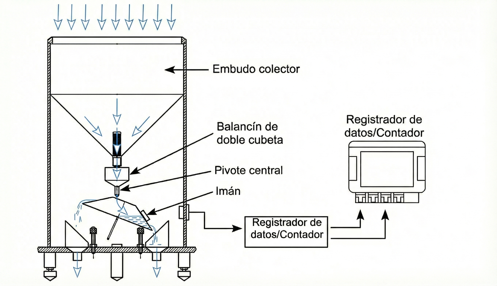

```


En términos generales, los instrumentos de medición de precipitación pueden agruparse en pluviómetros y pluviógrafos, los cuales se describen a continuación.

**Pluviómetro tradicional (sin registro)**

El pluviómetro convencional se utiliza para medir la cantidad total de lluvia acumulada durante un período determinado, usualmente diario. Este instrumento consiste en un recipiente cilíndrico con un área de captación conocida, donde el agua de lluvia se almacena hasta el momento de la lectura.

La medición se realiza manualmente, normalmente una vez al día (por ejemplo, a las 7:00 a.m.), mediante una probeta o cilindro graduado. Aunque es un método simple, su principal limitación es que no proporciona información sobre la intensidad ni la distribución temporal de la lluvia.

**Pluviómetro electrónico (automático)**

El pluviómetro electrónico es ampliamente utilizado en estaciones meteorológicas automáticas. Su funcionamiento se basa en un sistema de cazoletas o cubetas basculantes (balancín), que se llenan con una cantidad fija de lluvia y se vacían alternativamente por efecto del peso.

Cada basculamiento genera un pulso eléctrico, el cual es registrado por un datalogger. A partir del número de pulsos, se estima la precipitación acumulada. Este tipo de instrumento permite obtener datos con alta resolución temporal y facilita la transmisión automática de la información, reduciendo la necesidad de observaciones manuales.

**Pluviógrafo (medidor con registro continuo)**

El pluviógrafo es un instrumento diseñado para registrar de forma continua la precipitación en función del tiempo. Tradicionalmente, el registro se realiza mediante una pluma que traza una curva sobre una banda de papel montada en un tambor giratorio.

Gracias a este registro continuo, el pluviógrafo permite analizar la intensidad, la duración y la distribución temporal de los eventos de lluvia, información indispensable para estudios hidrológicos avanzados, como el análisis de tormentas, la construcción de curvas IDF y el diseño de obras hidráulicas.

```{r}
#| label: fig-pluviografo
#| fig-cap: "Funcionamiento de pluviógrafo.<br><span style='font-size:0.8em;'>Fuente: [@Sanguesa2025_PluviographDataset]</span>"
#| fig-align: center
#| out-width: 100%
#| echo: false
#| class: fig-border

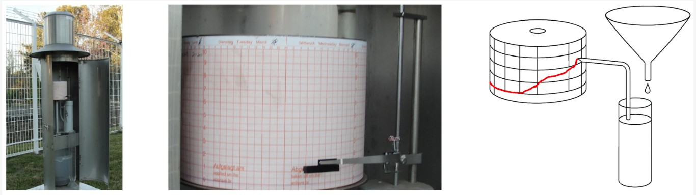

```

### Percepción remota: radar y satélites

En las últimas décadas, el uso de tecnologías de sensores remotos ha permitido superar la limitación de los pluviómetros, que solo proporcionan medidas puntuales.

- Radar Meteorológico: Emite pulsos de energía electromagnética que rebotan en las gotas de lluvia o cristales de hielo (reflectividad, $Z$). La relación entre la reflectividad y la tasa de lluvia ($R$) se rige por una ecuación de potencia:

$$
Z = a R^b
$$

donde $a$ y $b$ son parámetros empíricos que dependen del tipo de tormenta (por ejemplo, $a = 300$, $b = 1.4$ para lluvias convectivas). El radar ofrece una resolución espacial alta (hasta 1 km$^2$) y temporal (cada 1–15 min) sobre áreas extensas.

```{r}
#| label: fig-radar
#| fig-cap: "Imagen de detección de precipitación por medio de radar.<br><span style='font-size:0.8em;'>Fuente: (Instituto Nicaragüense de Estudios Territoriales, 2020)</span>"
#| fig-align: center
#| out-width: 65%
#| echo: false
#| class: fig-border

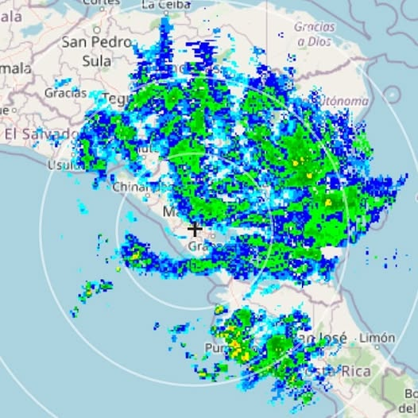

```

- Satélites: Estiman la precipitación mediante sensores infrarrojos (correlacionando la temperatura de las nubes con la intensidad de la lluvia) y sensores de microondas, que detectan directamente las gotas de agua.

```{r}
#| label: fig-satelite
#| fig-cap: "Precipitación promedio multianual, por medio de detección satelital.<br><span style='font-size:0.8em;'>Fuente: [@CHIRPS]</span>"
#| fig-align: center
#| out-width: 70%
#| echo: false
#| class: fig-border

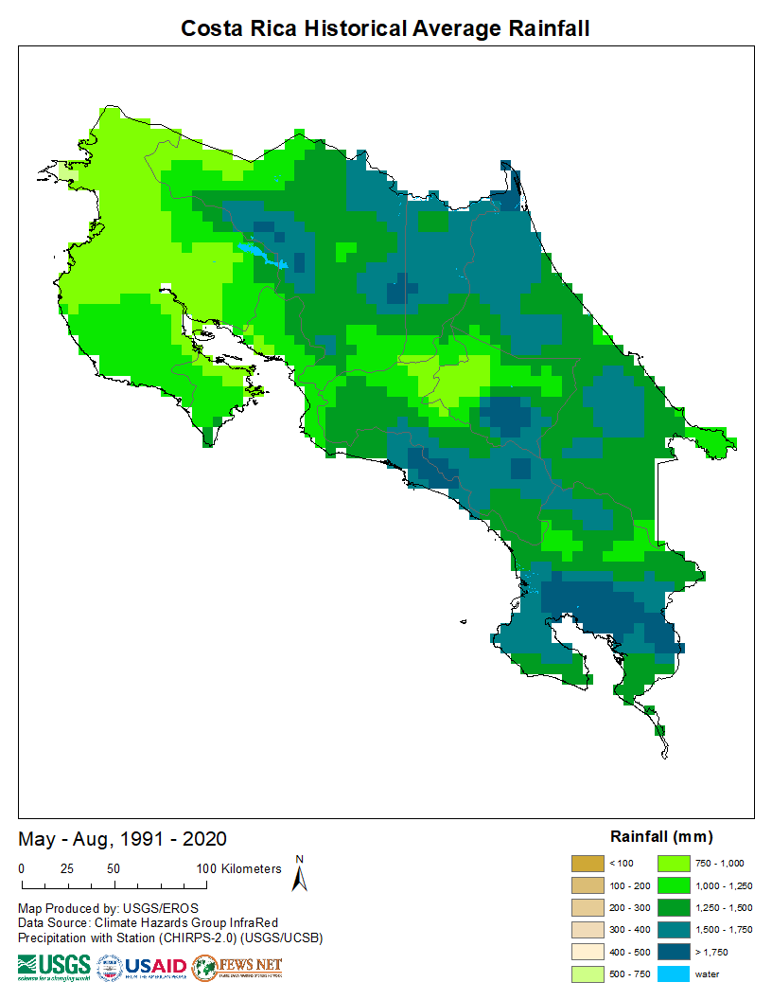

```

A la representación espacial de la precipitación, se le conoce como isoyetas.

```{r}
#| label: fig-isoyetas
#| fig-cap: "Mapa de isoyetas para Costa Rica.<br><span style='font-size:0.8em;'>Fuente: [@IMN_CostaRica]</span>"
#| fig-align: center
#| out-width: 100%
#| echo: false
#| class: fig-border

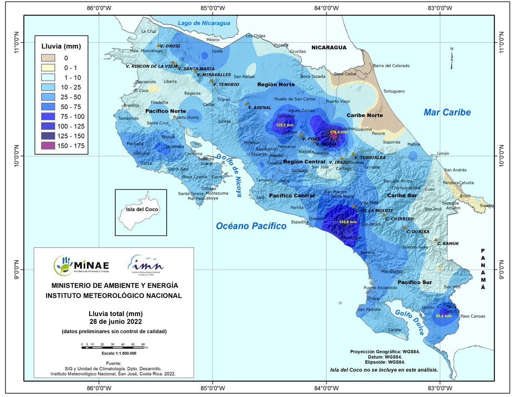

```


### Temperatura

La temperatura es una medida de la energía interna del aire. Su importancia radica en que actúa como el motor de diversos procesos del ciclo hidrológico: condiciona la tasa de evapotranspiración, determina la forma de la precipitación (lluvia o nieve) y regula el proceso de fusión de las capas de nieve. Además, influye en las propiedades físicas del agua, como su viscosidad y densidad, afectando así el movimiento del agua tanto en la atmósfera, cauces superficiales como en acuíferos.

La temperatura se mide por medio de:

- Termómetros de líquido en vidrio: utilizan mercurio para temperaturas máximas (con una constricción que impide el retroceso del fluido) y alcohol para las mínimas (con un índice que marca el valor más bajo alcanzado).

- Termógrafos: instrumentos que utilizan bandas bimetálicas o tubos de metal llenos de alcohol para registrar continuamente la temperatura en una banda de papel.

- Sensores electrónicos: en las estaciones automáticas modernas se utilizan termistores o termopares, que proporcionan medidas muy precisas y permiten la transmisión remota de datos hacia un datalogger.

En la hidrología y la meteorología, se procesan diversas variables térmicas para caracterizar el clima de una cuenca o región:

1. **Temperatura máxima** ($T_{max}$) y **temperatura mínima** ($T_{min}$): valores extremos registrados en un período de 24 horas.

2. **Temperatura media diaria** ($T_{media}$): se define comúnmente como:

  + El promedio aritmético de la máxima y la mínima.

$$
T_{media} = \frac{T_{max} + T_{min}}{2}
$$

  + El promedio de temperaturas horarias o continuas.
  + El promedio de temperaturas cada 3 o 6 horas.
  + El promedio de temperaturas en 3 momentos fijos del día.  

3. **Temperatura de punto de rocío** ($T_d$): temperatura a la cual una masa de aire debe enfriarse, a presión constante, para alcanzar la saturación.

4. **Temperatura media mensual** $(T_M)$: Promedio de las temperaturas medias diarias de un mes calendario.

5. **Temperatura media anual** $(T_A)$: Promedio de las temperaturas medias diarias (o mensuales) de un año calendario.

A la representación espacial de la temperatura, se le conoce como isotermas.

```{r}
#| label: fig-isoterma
#| fig-cap: "Mapa de isotermas para Costa Rica.<br><span style='font-size:0.8em;'>Fuente: [@IMN_CostaRica]</span>"
#| fig-align: center
#| out-width: 100%
#| echo: false
#| class: fig-border

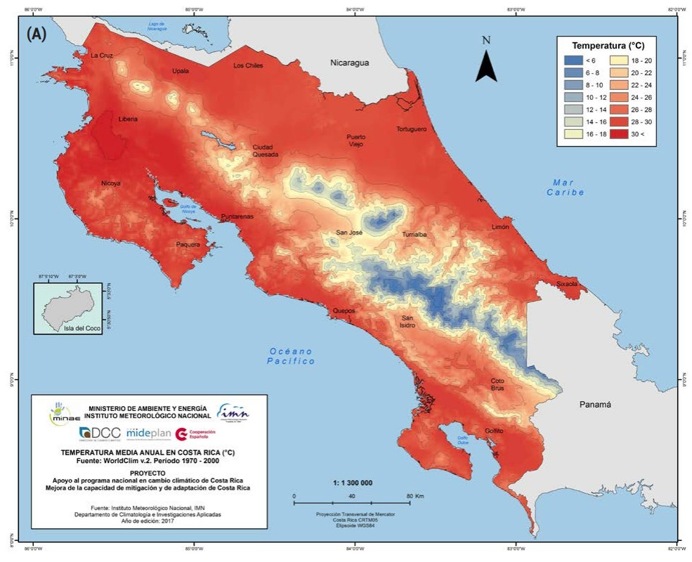

```

### Humedad relativa

La humedad relativa (HR) se define como la relación entre la cantidad de vapor de agua que el aire contiene en un momento determinado y la cantidad máxima que podría contener si estuviera totalmente saturado a la misma temperatura. Matemáticamente, se expresa como el cociente entre la presión real de vapor ($e_a$) y la presión de saturación de vapor ($e_s$) a una temperatura dada ($T$), expresado comúnmente en porcentaje:

$$
HR = 100 \, \frac{e_a}{e_s}
$$

Donde:

- HR: Humedad relativa [%].
- $e_a$: Presión real de vapor [kPa o mb].
- $e_s$: Presión de saturación de vapor a la temperatura $T$ [kPa o mb].

Para comprender la humedad relativa, es esencial distinguir entre sus componentes:

1. **Presión de saturación de vapor ($e_s$)**: Es la presión parcial ejercida por las moléculas de agua cuando el aire no puede almacenar más vapor sin condensarse. Su valor depende exclusivamente de la temperatura; a mayor temperatura, el aire tiene una mayor capacidad de almacenar vapor. Una expresión aproximada ampliamente utilizada para su cálculo es la ecuación de Tetens:

$$
e_s = 0.611 \, \exp\!\left(\frac{17.27\,T}{237.3 + T}\right)
$$

donde $T$ se expresa en grados Celsius y $e_s$ en kPa.

2. **Presión real de vapor ($e_a$)**: Es la presión parcial ejercida efectivamente por el vapor de agua presente en el aire. Representa el contenido real de humedad y suele ser más estable a lo largo del día que la humedad relativa.

3. **Déficit de presión de vapor ($e_s - e_a$)**: Es la diferencia entre la presión de saturación y la presión real de vapor. Este parámetro es un indicador directo de la capacidad evaporativa de la atmósfera y resulta especialmente relevante en estudios de evapotranspiración.

La humedad relativa varía de forma inversa de la temperatura. Durante el día, a medida que la temperatura aumenta, la presión de saturación ($e_s$) se incrementa de forma exponencial, lo que provoca una disminución de la HR incluso si el contenido real de vapor ($e_a$) permanece prácticamente constante. Por el contrario, antes del amanecer, cuando se alcanza la temperatura mínima diaria, la HR suele presentar sus valores máximos, frecuentemente cercanos al 100 %, condición que favorece la formación de rocío y niebla.

Existen varios métodos para cuantificar la humedad del aire en estaciones meteorológicas, entre los cuales destacan los siguientes:

**Psicrómetros (termómetros de bulbo seco y húmedo)**

Es el método clásico indirecto para la medición de la humedad. Consiste en dos termómetros: uno mide la temperatura del aire (bulbo seco) y el otro tiene su bulbo cubierto por una muselina humedecida (bulbo húmedo). La evaporación del agua en el bulbo húmedo consume calor latente, provocando un descenso de temperatura. La diferencia entre ambas lecturas se denomina depresión del bulbo húmedo y permite estimar la humedad relativa mediante tablas psicrométricas o ecuaciones empíricas.

- **Psicrómetro de Assmann**: Incorpora ventilación forzada para asegurar una evaporación constante y lecturas más precisas, reduciendo la influencia de la radiación y de condiciones ambientales variables.

- **Higrómetros y termohigrógrafos**

  - *Mecánicos (de cabello)*: Se basan en la propiedad del cabello humano de alargarse o acortarse en función de la humedad del aire. Este movimiento se transmite mediante un sistema de palancas a una aguja o plumilla que registra la variación de la humedad en un tambor giratorio.
  - *Electrónicos (capacitivos)*: Ampliamente utilizados en estaciones meteorológicas automáticas, emplean sensores con polímeros dieléctricos cuya capacitancia varía según el contenido de humedad del aire. Estos dispositivos permiten mediciones precisas, registro continuo y transmisión digital de datos.
  
Actualmente, la mayoría de los sensores electrónicos miden de manera conjunta los parámetros de temperatura y humedad.

```{r}
#| label: fig-higro
#| fig-cap: "Medición de temperatura y humedad.<br><span style='font-size:0.8em;'>Fuente: [@IMN_CostaRica]</span>"
#| fig-align: center
#| out-width: 100%
#| echo: false
#| class: fig-border

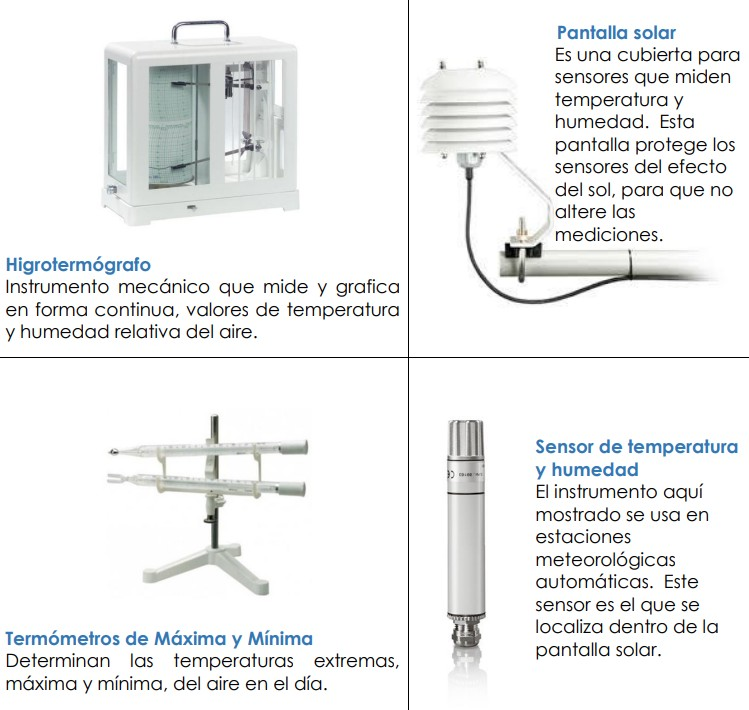
```

### Radiación solar

La radiación se transmite en forma de ondas electromagnéticas a través del espacio. En meteorología e hidrología, se clasifica principalmente según su longitud de onda:

1. <u>Radiación de onda corta</u>: Es la energía proveniente directamente del sol, con longitudes de onda entre 0.3 y 3.0 micrómetros (μm). Incluye la luz visible, la radiación ultravioleta e infrarroja cercana.  

2. <u>Radiación de onda larga</u>: Es la energía térmica emitida por la superficie terrestre y la atmósfera, con longitudes de onda superiores a 3.0 o 4.0 μm. También se le conoce como radiación terrestre o infrarroja térmica.

```{r}
#| label: fig-radiacion 
#| fig-cap: "Distribución espectral de la radiación solar.<br><span style='font-size:0.8em;'>Fuente: [Seiscubos.com, 2025]</span><br><span style='font-size:0.8em;'>Modificado por: [Matarrita, 2025]"
#| fig-align: center
#| out-width: 100%
#| echo: false
#| class: fig-border

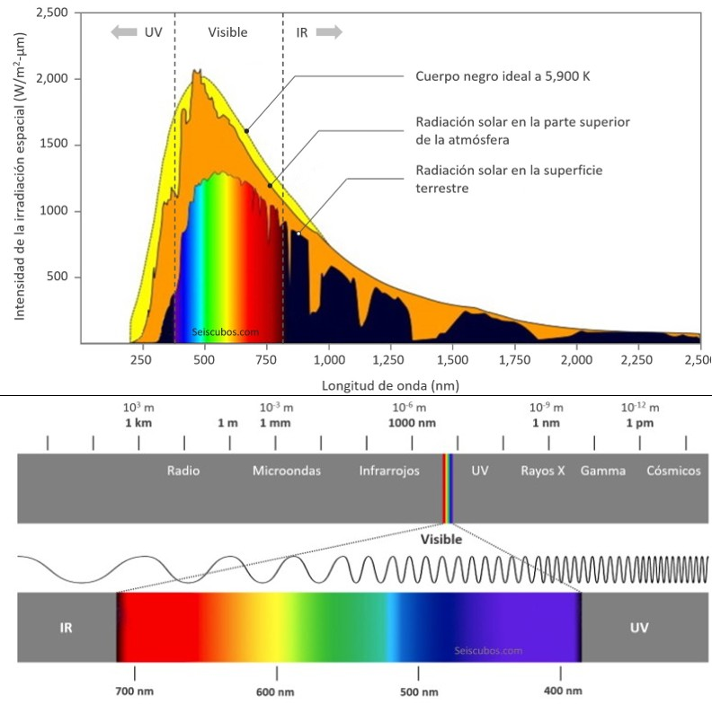
```

3. <u>Radiación Global</u>: Se define como la suma de la radiación solar directa que llega del disco solar y la radiación difusa dispersada por las moléculas y partículas de la atmósfera. "La radiación solar en un sitio depende de la latitud, día del año, hora del día y condiciones atmosféricas" [@Porras2025].

```{r}
#| label: fig-rad2 
#| fig-cap: "Diagrama de radiación solar: directa y difusa."
#| fig-align: center
#| out-width: 100%
#| echo: false
#| class: fig-border

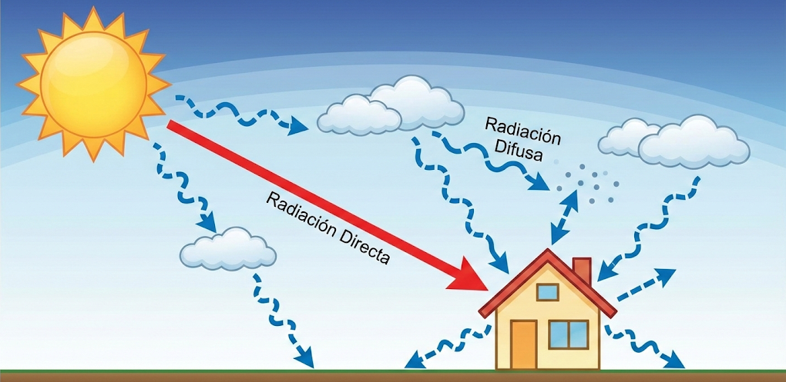
```

La medición directa de la radiación se realiza mediante instrumentos específicos conocidos colectivamente como radiómetros. Los más comunes son:

- Piranómetro: Mide la radiación solar global (directa + difusa) sobre una superficie horizontal. Utiliza sensores de termopila o diodos de silicio protegidos por una bóveda de cristal.  

- Pirheliómetro: Instrumento diseñado para medir exclusivamente la componente directa de la radiación solar, apuntando permanentemente hacia el sol.  

- Heliógrafo: Mide el “brillo solar” o insolación, que es el tiempo durante el cual la radiación directa del sol supera un umbral crítico (generalmente 120 W/m²). El modelo más común es el de Campbell-Stokes, que utiliza una esfera de cristal para quemar una banda de papel graduada.  

- Radiómetro Neto: Mide la diferencia entre la radiación total entrante y la saliente (el balance de todas las longitudes de onda).

```{r}
#| label: fig-piro
#| fig-cap: "Medición de radiación solar.<br><span style='font-size:0.8em;'>Fuente: [@IMN_CostaRica]</span>"
#| fig-align: center
#| out-width: 100%
#| echo: false
#| class: fig-border

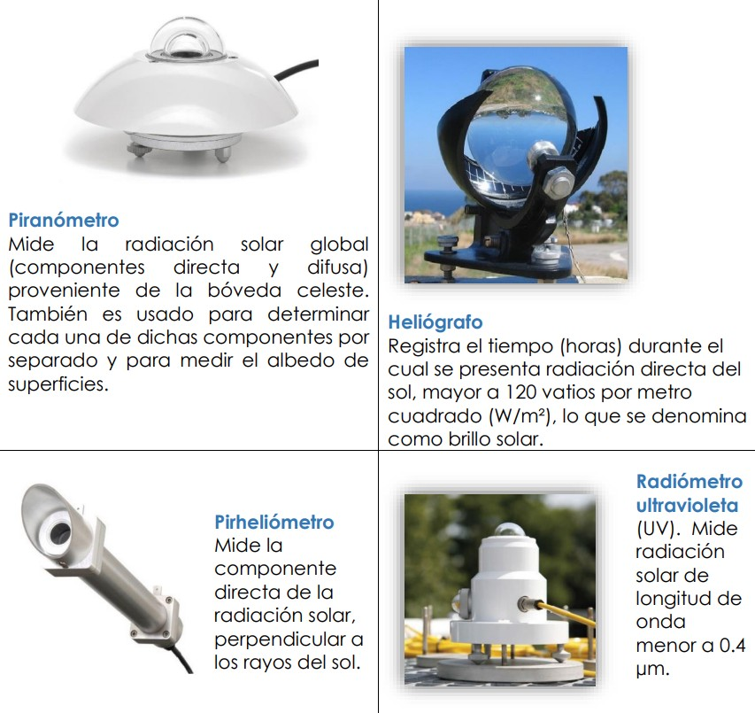
```

La intensidad de la radiación se expresa habitualmente como un flujo de energía por unidad de área y tiempo.

- Unidad Estándar (SI): Vatios por metro cuadrado (W/m²) o Julios por metro cuadrado (J/m²).  
- Reportes Diarios: Es común totalizar la energía diaria en Megajulios por metro cuadrado (MJ/m²·día).  
- Unidad Tradicional: El Langley (Ly), donde 1 Ly = 1 cal/cm².

**Estimación de la Radiación Solar (Ecuación de Angstrom)**

En estaciones donde no se dispone de piranómetros, la radiación solar ($R_s$) puede estimarse a partir de las horas de brillo solar registradas por un heliógrafo mediante la fórmula de Angstrom-Prescott:

$$
R_s = R_a \left( a_s + b_s \frac{n}{N} \right)
$$

Donde:

- $R_s$: Radiación solar o de onda corta [MJ/m²·día].  
- $R_a$: Radiación extraterrestre (la que llegaría si no hubiera atmósfera, obtenida por tablas según latitud y fecha).  
- $n$: Duración real de la insolación o brillo solar [horas].  
- $N$: Duración máxima posible de la luz del día (insolación máxima teórica).  
- $a_s$, $b_s$: Coeficientes empíricos locales (valores estándar recomendados: $a_s = 0.25$, $b_s = 0.50$).

```{r}
#| label: fig-global_solar_atlas
#| fig-cap: "Promedio multianual de radiación solar global.<br><span style='font-size:0.8em;'>Fuente: [Global Solar Atlas, 2025]</span>"
#| fig-align: center
#| out-width: 100%
#| echo: false
#| class: fig-border

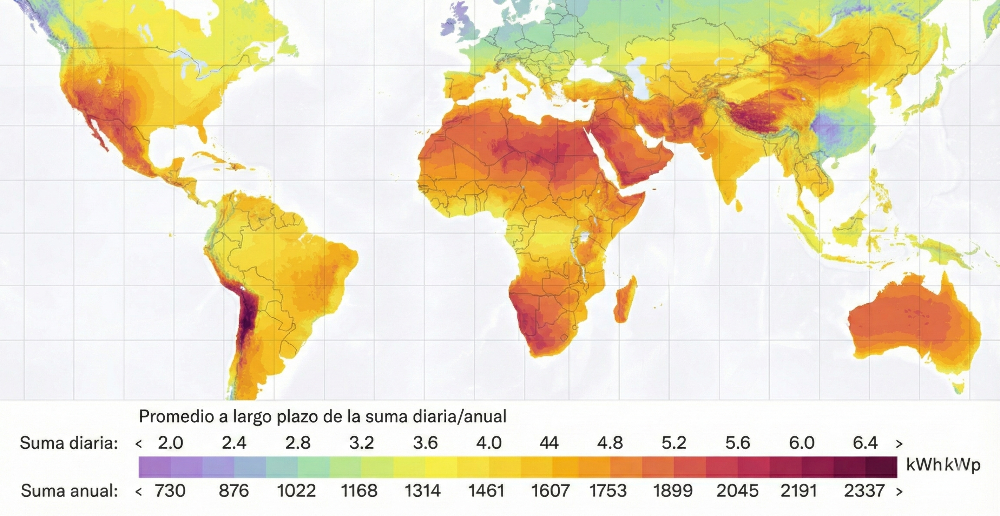
```

### Brillo solar

El brillo solar, también conocido como heliofanía, insolación o duración de la insolación, se define técnicamente como el tiempo (expresado en horas) durante el cual la radiación solar directa que llega a la superficie terrestre es lo suficientemente intensa como para proyectar una sombra clara. Según la Organización Meteorológica Mundial (OMM), este umbral se sitúa en una intensidad de radiación solar directa mayor a 120 vatios por metro cuadrado $\left(\frac{W}{m^2}\right)$.

El brillo solar es un parámetro importante dentro de la hidrología por dos razones fundamentales:

1. Actúa como un indicador indirecto de la nubosidad: a mayor brillo solar, menor cobertura nubosa.

2. Es la variable principal para estimar la radiación solar global ($R_s$) en estaciones que no disponen de piranómetros, lo cual es esencial para calcular la evapotranspiración mediante métodos como el de Penman-Monteith.

El instrumento estándar para medir esta variable es el heliógrafo, siendo el modelo Campbell–Stokes el más utilizado a nivel mundial.

a. Consiste en una esfera de cristal macizo (generalmente de unos 10 cm de diámetro) que actúa como una lente convergente. Esta esfera concentra los rayos solares en un punto focal que quema una banda de cartulina graduada en horas, la cual se coloca concéntricamente detrás de la esfera en un soporte metálico.  

b. A medida que el sol se desplaza por el firmamento, el punto focal se mueve a lo largo de la cartulina dejando un rastro quemado. Si el sol se oculta tras una nube, el rastro se interrumpe. La duración total del brillo solar ($n$) se obtiene sumando las longitudes de los segmentos quemados.  

c. Para asegurar registros precisos, el heliógrafo debe orientarse hacia el sur en el hemisferio norte y hacia el norte en el hemisferio sur, en un lugar libre de obstáculos que puedan proyectar sombras durante el día.

```{r}
#| label: fig-helio
#| fig-cap: "Medición de brillo solar, por medio de heliógrafo.<br><span style='font-size:0.8em;'>Fuente: [Guías Prácticas, 2025]</span>"
#| fig-align: center
#| out-width: 100%
#| echo: false
#| class: fig-border

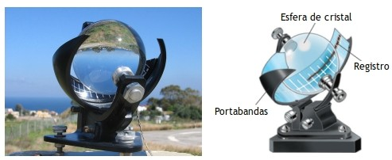
```

En la actualidad, las estaciones meteorológicas automáticas emplean sensores fotoeléctricos o de fibra óptica rotatoria que digitalizan esta información en tiempo real.

Para normalizar los datos de brillo solar, se utiliza el concepto de duración relativa de la insolación ($n/N$), donde:

- $n$: Duración real de la insolación (medida por el heliógrafo).  
- $N$: Duración máxima posible de la insolación o del día (desde la salida hasta el ocaso), la cual es función de la latitud y la época del año.

Bajo cielos despejados, $n = N$ y la relación es igual a 1; en días totalmente cubiertos, $n = 0$. Las horas de brillo solar se pueden representar de manera espacial.

```{r}
#| label: fig-brillo
#| fig-cap: "Mapa de brillo solar, para Costa Rica.<br><span style='font-size:0.8em;'>Fuente: [@IMN_CostaRica]</span>"
#| fig-align: center
#| out-width: 100%
#| echo: false
#| class: fig-border

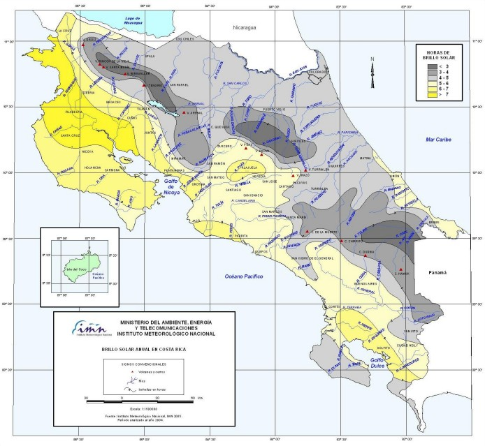
```

### Presión Atmosférica

La presión atmosférica se define como la fuerza por unidad de área que ejerce el peso de la columna de aire de la atmósfera sobre la superficie terrestre. En términos físicos, la presión en cualquier punto es el resultado de la masa de aire que gravita sobre dicho punto, comprimida por la acción de la gravedad.

El estudio de la presión es importante dentro de la hidrología por tres razones principales:

1. Motor del viento: Las diferencias horizontales de presión (gradientes) generan el movimiento del aire, el cual transporta la humedad necesaria para la precipitación.  
2. Evaporación: Según la Ley de Dalton^[Establece que la presión total de una mezcla de gases no reaccionantes es la suma de las presiones que ejercería cada gas individualmente si estuviera solo dentro de un volumen de control, manteniendo la temperatura constante.], la tasa de evaporación es inversamente proporcional a la presión atmosférica total.  

Históricamente, la presión se ha medido por la altura de una columna de mercurio (experimento de Torricelli). Al nivel del mar y a 0 °C, esta columna alcanza en promedio 760 mm de Hg.

En la práctica moderna, se utilizan las siguientes unidades y equivalencias:

- Hectopascal (hPa) / Milibar (mb): Son las unidades estándar en meteorología e hidrología. 1 hPa = 1 mb.  
- Pascal (Pa): Unidad del Sistema Internacional (SI). 100 Pa = 1 hPa.  
- Atmósfera estándar (atm): Se define como 1013.25 mb (o hPa) al nivel del mar.

Existen tres tipos principales de instrumentos para medir la presión:

1. Barómetro de Mercurio: Basado en el peso de una columna de mercurio.   
2. Barómetro Aneroide: Mide la deformación que el aire ejerce sobre una cápsula metálica sellada al vacío, la cual mueve una aguja sobre una escala.  
3. Barómetro Electrónico: Utiliza sensores digitales (comúnmente transductores de presión) integrados en estaciones meteorológicas automáticas, permitiendo registros continuos y transmisiones de datos en tiempo real.

```{r}
#| label: fig-presion
#| fig-cap: "Medición de presión atmosférica.<br><span style='font-size:0.8em;'>Fuente: [@IMN_CostaRica]</span>"
#| fig-align: center
#| out-width: 100%
#| echo: false
#| class: fig-border


```

Debido a que el aire es un fluido compresible, su densidad disminuye rápidamente conforme se aleja de la superficie terrestre. Por lo tanto, la presión siempre decrece con la altitud. Para fines de hidrología e ingeniería, esta variación se modela mediante una simplificación de la ley de los gases ideales y la ecuación hidrostática:

$$
P = 1013.2 \left[ \frac{288 - 0.0065 z}{288}\right]^{5.256}
$$

donde:

- $P$: Presión atmosférica en milibares (mb).  
- $z$: Altitud sobre el nivel del mar en metros (m).


**Variaciones horizontales y temporales**

- <u>Variación horizontal</u>: Las diferencias de presión entre dos puntos generan una fuerza denominada fuerza del gradiente de presión. Esta fuerza impulsa el aire desde las zonas de alta presión (anticiclones) hacia las zonas de baja presión (ciclones o borrascas), originando el viento.  

- <u>Variación periódica</u>: La presión presenta un ciclo diurno con dos máximos (10:00 y 22:00 horas) y dos mínimos (04:00 y 16:00 horas), fenómeno conocido como marea barométrica solar.


A la representación espacial de la presión atmosférica, se le conoce como isobaras.

```{r}
#| label: fig-isobaras
#| fig-cap: "Mapa de isobaras.<br><span style='font-size:0.8em;'>Fuente: [Agencia Estatal de Meteorológía, 2023]</span>"
#| fig-align: center
#| out-width: 100%
#| echo: false
#| class: fig-border

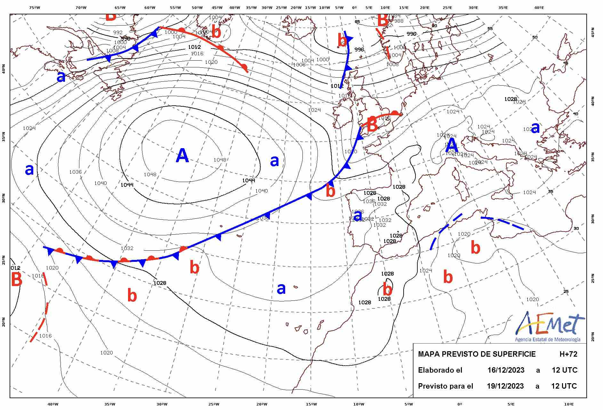

```

### Velocidad y dirección del viento

El viento se define como el aire en movimiento horizontal. Actúa como un factor que tiende a igualar las diferencias laterales de temperatura, humedad y presión en la atmósfera. Sus funciones principales incluyen:

- <u>Transporte de humedad</u>: Desplaza masas de aire húmedo desde los océanos hacia los continentes, permitiendo que el ciclo hidrológico continúe.  

- <u>Motor de la evaporación</u>: Al sustituir el aire saturado sobre una superficie de agua por aire más seco, mantiene el gradiente de presión de vapor necesario para la evaporación y la transpiración.  

- <u>Efecto en la precipitación</u>: Determina la distribución espacial de la lluvia mediante efectos orográficos.  

- <u>Agente erosivo</u>: Es el responsable de la erosión eólica, transportando partículas de suelo por rodamiento, saltación o suspensión.  

El movimiento del aire es el resultado de un balance de varias fuerzas físicas:

1. Fuerza del gradiente de presión: Impulsa el aire desde zonas de alta presión hacia zonas de baja presión.  

2. Efecto de *Coriolis*: Fuerza aparente debida a la rotación terrestre que desvía el viento hacia la derecha en el hemisferio norte y hacia la izquierda en el sur.  

3. Fuerza de rozamiento (fricción): Reduce la velocidad del aire en las capas cercanas al suelo debido a la rugosidad del terreno (árboles, edificios, relieve).  

El viento es una variable vectorial que requiere la determinación de su magnitud (velocidad) y su orientación (dirección).

a.  Velocidad: Se reporta comúnmente en metros por segundo (m/s), kilómetros por hora (km/h) o nudos (kn). La equivalencia estándar es $1\,\text{kn} = 0.514\,\text{m/s}$.  

b.  Dirección: Se define como la dirección de donde sopla el viento y se mide en grados sexagesimales ($0^\circ$ a $360^\circ$) a partir del norte geográfico en sentido de las agujas del reloj.  

La dirección y velocidad del viento se miden con:

+ Anemómetro: Se utiliza para registrar la magnitud de la velocidad del viento. El modelo más común es el de copas, cuyo eje vertical gira proporcionalmente a la fuerza del viento. También existen anemómetros de hélice y sensores ultrasónicos que miden el tiempo de tránsito de pulsos de sonido para derivar la velocidad sin partes móviles.  

+ Veleta: Determina la dirección horizontal de donde proviene el flujo.  

+ Sensores ultrasónicos: Instrumentos que registran ambas variables de forma continua en un gráfico o memoria digital (datalogger).

```{r}
#| label: fig-viento
#| fig-cap: "Medición de dirección y velocidad del viento.<br><span style='font-size:0.8em;'>Fuente: [@IMN_CostaRica]</span>"
#| fig-align: center
#| out-width: 100%
#| echo: false
#| class: fig-border

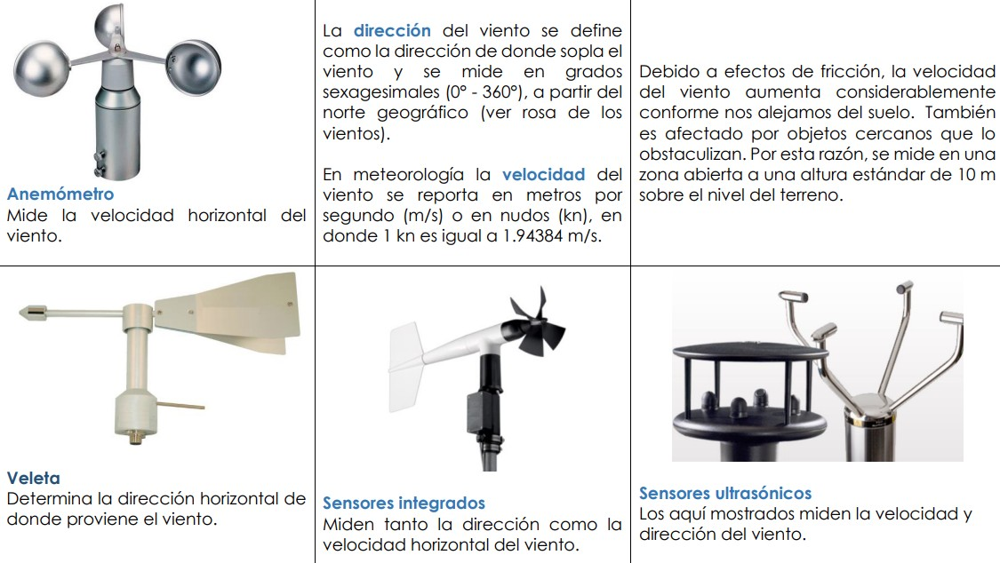
```

Debido a la fricción superficial, la velocidad del viento es mínima cerca del suelo y aumenta logarítmicamente con la altura. Por esta razón, la Organización Meteorológica Mundial (OMM) ha fijado una altura estándar de 10 metros para la medición del viento en estaciones meteorológicas. Sin embargo, en estudios de evapotranspiración agrícola, se suele requerir el dato a 2 metros.

Para convertir la velocidad medida a una altura $z$ ($u_z$) a la altura estándar de 2 metros ($u_2$), se utiliza la siguiente relación:

$$
u_2 = u_z \, \frac{4.87}{\ln(67.8z - 5.42)}
$$

Alternativamente, se utiliza la Ley Exponencial:

$$
v = v_1 \left( \frac{z}{z_1} \right)^k
$$

donde:

- $k$ es un exponente que depende de la estabilidad atmosférica y la rugosidad del terreno (típicamente $1/7 \approx 0.14$ para condiciones neutrales).

**Representación de datos: La Rosa de los Vientos**

La Rosa de los Vientos es una representación gráfica que resume la frecuencia de las direcciones de donde proviene el viento y sus rangos de velocidad en un periodo determinado. Se divide generalmente en 8 o 16 rumbos (N, NE, E, SE, etc.).

```{r}
#| label: fig-rosa
#| fig-cap: "Rosa de los vientos.<br><span style='font-size:0.8em;'>Fuente: [Meteoblue, 2025]</span>"
#| fig-align: center
#| out-width: 100%
#| echo: false
#| class: fig-border

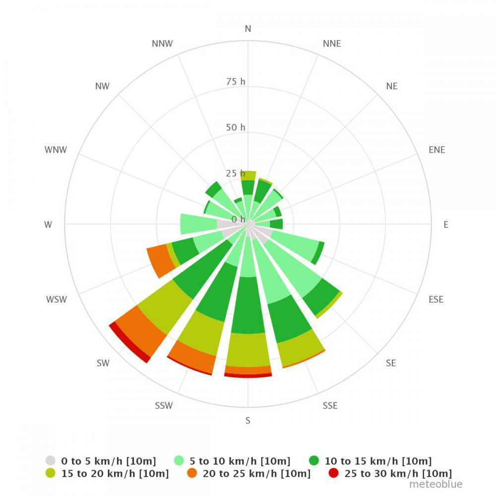
```


### Nubosidad

La nubosidad se refiere a la fracción del cielo cubierta por nubes. Físicamente, las nubes consisten en minúsculas gotas de agua líquida o cristales de hielo, con diámetros de apenas unas pocas milésimas de milímetro, que se mantienen en suspensión en la atmósfera a alturas variables. La nubosidad es un elemento fundamental del tiempo, ya que actúa como el principal regulador del balance energético terrestre.

Las nubes afectan la temperatura de la superficie mediante dos mecanismos opuestos:

1. <u>Reflexión (efecto Albedo)</u>: Las nubes reflejan una parte considerable de la radiación solar de onda corta de vuelta al espacio. La cantidad reflejada depende del espesor y tipo de nube: mientras que nubes altas y delgadas pueden reflejar menos del 20%, una capa densa de estratos a baja altura puede reflejar más del 80% de la radiación incidente.

2. <u>Absorción y eeemisión (efecto invernadero)</u>: Las nubes absorben la radiación infrarroja de onda larga emitida por la Tierra y la irradian nuevamente hacia el suelo. Por esta razón, las noches nubosas tienden a ser significativamente más cálidas que las noches de cielo despejado, ya que la nubosidad actúa como una “manta” térmica que evita el enfriamiento radiactivo rápido.

```{r}
#| label: fig-balance_rad
#| fig-cap: "Balance radiativo.<br><span style='font-size:0.8em;'>Fuente: [Le Treut, et al., 2007]</span>"
#| fig-align: center
#| out-width: 100%
#| echo: false

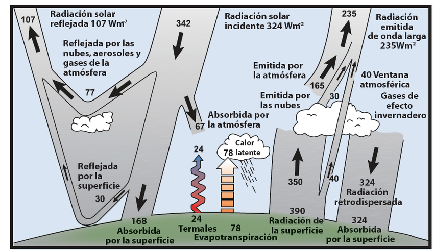
```

La nubosidad se mide tradicionalmente de forma visual, estimando la fracción del cielo cubierta por nubes. Aunque en algunos contextos se utilizan octavos, el estándar descrito en la literatura técnica suele expresar la nubosidad en décimas partes del cielo ocupado. 

```{r message=FALSE, warning=FALSE, error=FALSE}
library(dplyr)
library(tibble)
library(kableExtra)

tabla_nubosidad <- tribble(
  ~`Cantidad (décimas)`, ~`Descripción verbal`,
  "< 1",  "Claro",
  "1 a 5","Difuso (parcialmente nuboso)",
  "6 a 9","Desigual (nuboso)",
  "> 9",  "Cubierto"
)

tabla_nubosidad %>%
  kbl(
    booktabs = TRUE,
    align = c("c","c"),
    format = "html",
    escape = FALSE,
    col.names = c(
      "Cantidad (décimas)",
      "Descripción verbal"
    )
  ) %>%
  kable_classic(html_font = "Latin Modern Roman") %>%
  kable_styling(
    full_width = FALSE,
    bootstrap_options = "hover"
  ) %>%
  row_spec(0, bold = TRUE)
```

<br>

Un parámetro crítico para la hidrometeorología y la aviación es el techo de nubes, definido como la altura desde el suelo hasta la base de la capa nubosa más baja que cubra al menos seis décimas partes del cielo. Se mide mediante globos de velocidad ascensional conocida o, de noche, mediante proyectores de haz luminoso que permiten calcular la altura por trigonometría.

```{r}
#| label: fig-nubes2
#| fig-cap: "Uso de reflectancia para determinar el techo de nubes.<br><span style='font-size:0.8em;'>Fuente: [@SerranoPacheco_IC0808_Hidrologia]</span>"
#| fig-align: center
#| out-width: 80%
#| echo: false
#| class: fig-border

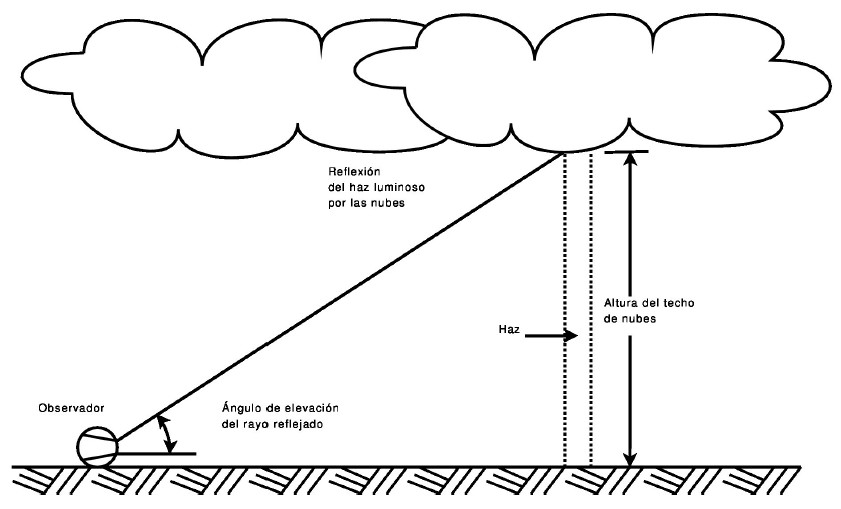
```

Las nubes se clasifican en tres géneros fundamentales según su apariencia y altura:

- **Cirrus**: Nubes altas (por encima de 9 000m), tenues y fibrosas.  
- **Cúmulus**: Masas individuales con base plana y desarrollo vertical.  
- **Estratos**: Capas continuas que cubren gran parte del cielo.  
- **Nimbus**: Término que se añade a cualquier género (por ejemplo, *Cumulonimbus*) para indicar que la nube está asociada a la precipitación.


```{r}
#| label: fig-nubes
#| fig-cap: "Clasificación de tipos de nubes.<br><span style='font-size:0.8em;'>Fuente: [Dirección Meteorológica de Chile, 2020]</span><br><span style='font-size:0.8em;'>Modificado por: [Matarrita, 2025]</span>"
#| fig-align: center
#| out-width: 100%
#| echo: false
#| class: fig-border

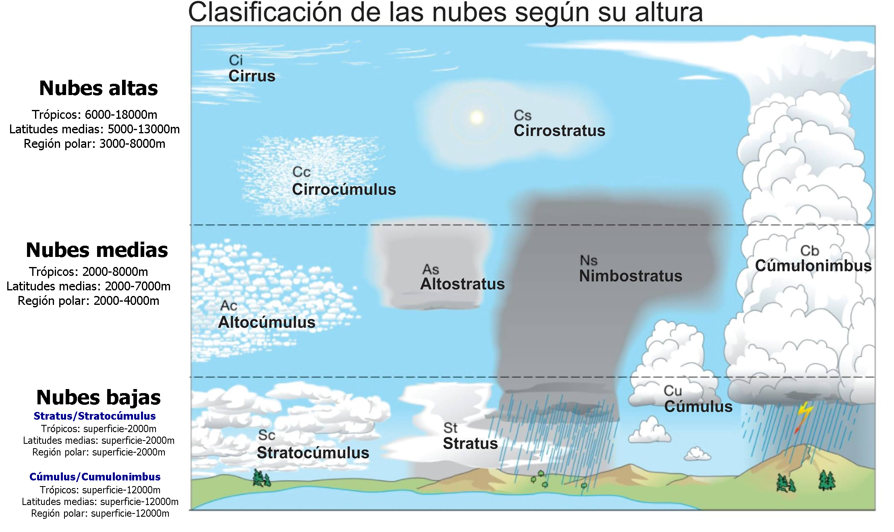
```

### Evaporación

La evaporación es el proceso físico mediante el cual el agua en estado líquido o sólido (sublimación) se convierte en vapor de agua a través de la transferencia de energía térmica. Este fenómeno es el único componente hidrológico que conecta directamente el balance de masa con el balance de energía en el ciclo hidrológico.

A nivel molecular, la evaporación ocurre cuando las moléculas de agua cercanas a la superficie adquieren suficiente energía cinética para vencer las fuerzas de atracción intermolecular y escapar hacia la atmósfera. Para que este cambio de fase ocurra, se requiere el calor latente de vaporización, $\lambda$, que es la energía necesaria para evaporar una unidad de masa de agua sin cambiar su temperatura. A una temperatura de 20 °C, el valor de $\lambda$ es aproximadamente $2.45 \ \text{MJ/kg}$.

La tasa de evaporación está gobernada por tres condiciones fundamentales:

1. <u>Suministro de energía</u>: Principalmente a través de la radiación solar y, en menor grado, la temperatura ambiente.  
2. <u>Déficit de presión de vapor</u>: La diferencia entre la presión de vapor en la superficie evaporante, $e_s$, y la presión de vapor de la atmósfera circundante, $e_a$.  
3. <u>Mecanismo de transporte</u>: La velocidad del viento, $u$, y la turbulencia, que remueven el aire saturado cerca de la superficie y lo reemplazan por aire más seco.

```{r}
#| label: fig-evapo
#| fig-cap: "Condiciones fundamentales que gobniernan la tasa de evaporación."
#| fig-align: center
#| out-width: 100%
#| echo: false
#| class: fig-border

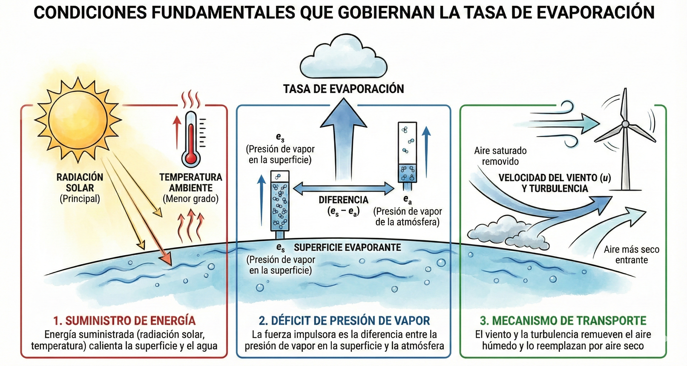
```


Físicamente, estos procesos se resumen en la Ley de Dalton:

$$
E = c \, (e_s - e_a)
$$

donde $c$ es una constante que depende, entre otros factores, de la velocidad del viento.

En la hidrología, se utilizan dos conceptos de referencia para normalizar las estimaciones:

- **Evaporación potencial ($E_o$)**: Se define como la cantidad de agua evaporada por unidad de área y tiempo desde una superficie de agua libre, extensa e idealizada, asumiendo que el agua no es un factor limitante, es decir, hay una cantidad "infinita" de agua disponible para evaporar.  
- **Evaporación real($E_P$)**: Es la cantidad de agua que efectivamente se evapora en condiciones naturales, la cual suele ser menor que la evaporación potencial cuando la disponibilidad de agua en el suelo es limitada.

El método más común para estimar la evaporación de cuerpos de agua es el tanque evaporímetro, siendo el tanque Clase A el estándar internacional. Consiste en un recipiente cilíndrico de hierro galvanizado de 1.21 m de diámetro y 25.4 cm de profundidad.

```{r}
#| label: fig-Evaporation_Pan
#| fig-cap: "Tanque evaporímetro clase A.<br><span style='font-size:0.8em;'>Fuente: [@IMN_CostaRica]</span>"
#| fig-align: center
#| out-width: 60%
#| echo: false
#| class: fig-border

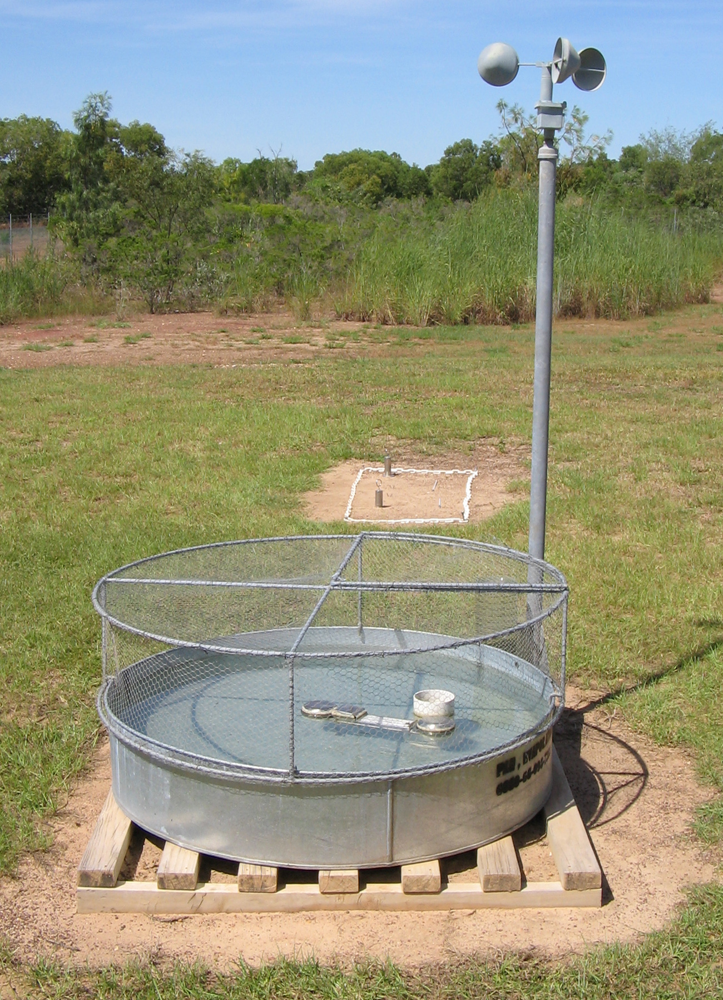
```

La evaporación diaria, $E$, se calcula midiendo el cambio en el nivel del agua en el tanque y corrigiéndolo por la precipitación ocurrida durante el intervalo:

$$
E = P \pm \Delta d
$$

donde $P$ es la precipitación y $\Delta d$ es la altura de agua añadida (+) o removida (–) para mantener el nivel estándar.

- **Coeficiente del tanque ($K_p$)**: Debido a que los tanques almacenan menos calor y tienen paredes expuestas al viento y a la radiación solar, suelen sobreestimar la evaporación de un lago real. Para corregir este efecto se aplica un coeficiente empírico:

$$
E_{\text{lago}} = K_p \cdot E_{\text{tanque}}
$$

El valor típico de $K_p$ oscila entre 0.65 y 0.85, siendo 0.70 un valor promedio aceptable para estimaciones anuales.

### Humedad del suelo

La humedad del suelo se define como el agua que se mantiene en los poros del suelo mediante fuerzas de atracción molecular, específicamente fuerzas de adhesión (atracción entre el agua y las superficies sólidas) y cohesión (atracción entre moléculas de agua). Dentro del ciclo hidrológico, esta variable es crítica porque actúa como el regulador de la partición de la precipitación entre la infiltración y la escorrentía superficial.

En un perfil de suelo, el agua se distribuye principalmente en dos zonas separadas por el nivel freático: la zona de saturación, donde todos los poros están llenos de agua, y la zona de aireación o zona vadosa, donde los poros contienen simultáneamente aire y agua. Dentro de esta última se distinguen tres estados principales, definidos según la energía con la que el agua es retenida por el suelo:

1. <u>Agua gravitacional</u>: Corresponde al agua en exceso que ocupa los macroporos y se drena libremente bajo la acción de la gravedad, contribuyendo a la recarga de los acuíferos o al flujo subsuperficial.
2. <u>Agua capilar</u>: Es el agua retenida en los poros pequeños por fuerzas capilares que se oponen a la gravedad; constituye la principal fuente de agua disponible para las plantas.
3. <u>Agua higroscópica</u>: Consiste en una película muy delgada de agua fuertemente adsorbida^[La principal diferencia entre la **absorción** y la **adsorción** es que la primera implica que una sustancia penetra y se disuelve en el volumen total de otra (como una esponja absorbiendo agua), mientras que la segunda es un fenómeno superficial donde las moléculas se adhieren solo a la superficie del material (como el polvo pegándose a un vidrio), sin incorporarse en su interior.] a las partículas del suelo, retenida con una energía tan alta que no puede ser aprovechada por la vegetación ni drenada por gravedad.

Para cuantificar la capacidad de almacenamiento hídrico de un suelo y su disponibilidad para la vegetación, se definen una serie de constantes hidrológicas asociadas a estados de equilibrio del agua en el perfil del suelo (véase Figura 10.1):

- **Capacidad de campo (CC o FC)**: Es el contenido de humedad que permanece en el suelo después de que el agua gravitacional ha drenado, generalmente entre 2 y 3 días después de un evento de lluvia intensa.
- **Punto de marchitez permanente (PMP o PWP)**: Es el nivel de humedad a partir del cual las plantas ya no pueden extraer agua del suelo, lo que conduce al marchitamiento irreversible.
- **Agua disponible o agua útil**: Corresponde a la fracción de agua comprendida entre la capacidad de campo y el punto de marchitez permanente, y representa el volumen de agua potencialmente aprovechable por las plantas.

```{r}
#| label: fig-suelo 
#| fig-cap: "Retención y disponibilidad del agua según textura de suelo.<br><span style='font-size:0.8em;'>Fuente: [@McCuen1997]</span><br><span style='font-size:0.8em;'>Modificado por: [Matarrita, 2025]"
#| fig-align: center
#| out-width: 100%
#| echo: false
#| class: fig-border

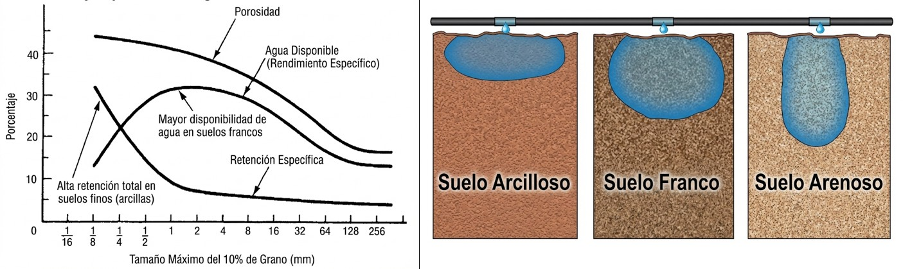
```


Existen dos formas estándar de expresar el contenido de agua en el suelo:

1. **Humedad gravimétrica ($w$)**: Relación entre la masa de agua ($M_w$) y la masa de sólidos secos ($M_s$).

$$
w = \frac{M_s}{M_w}
$$

2. **Humedad volumétrica ($\theta_v$)**: Relación entre el volumen de agua ($V_w$) y el volumen total de la muestra de suelo ($V_t$).

$$
\theta_v = \frac{V_t}{V_w}
$$

3. Conversión entre ambas: Se utiliza la densidad aparente del suelo ($\rho_b$) y la densidad del agua ($\rho_w \approx 1000 \ \text{kg/m}^3$).

$$
\theta_v = w \cdot \frac{\rho_w}{\rho_b}
$$

En laboratorio, se utiliza el método directo gravinétrico es el estándar de referencia para calibrar todos los demás instrumentos. Consiste en tomar una muestra de suelo, pesarla en estado húmedo, secarla en un horno a 105 °C durante 24 horas y pesarla nuevamente. La diferencia de masa representa el agua evaporada. Es preciso, pero destructivo y laborioso.

Para mediciones en campo, se utilizan comúnmente los siguientes instrumentos:

- <u>Tensiómetros</u>: Miden la succión o potencial matricial del suelo, es decir, qué tan fuerte el suelo retiene el agua. Son muy precisos en rangos húmedos, pero dejan de funcionar cuando la tensión supera los 0.85 bares.

- <u>Bloques de resistencia eléctrica</u>: Utilizan bloques de yeso o nylon enterrados. La resistencia eléctrica entre los electrodos internos disminuye a medida que el bloque, y el suelo circundante, se humedece.

- <u>Sonda de neutrones</u>: Emite neutrones rápidos que chocan con los núcleos de hidrógeno del agua, volviéndose neutrones lentos. El conteo de estos últimos se correlaciona con la humedad volumétrica.

- <u>TDR (Reflectometría en el Dominio del Tiempo)</u>: Mide la constante dieléctrica del suelo enviando un pulso electromagnético. Dado que la constante dieléctrica del agua (≈ 80) es mucho mayor que la del suelo seco (2–5), la velocidad de la señal depende directamente del contenido de agua.

```{r}
#| label: fig-suelo2 
#| fig-cap: "Tipos de sondas TDR.<br><span style='font-size:0.8em;'>Fuente: [Kargas & Soulis, 2012]"
#| fig-align: center
#| out-width: 80%
#| echo: false
#| class: fig-border

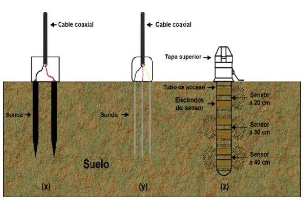
```

### Infiltración

En el ciclo hidrológico, la infiltración se define como el proceso mediante el cual el agua penetra desde la superficie del terreno hacia el interior del perfil del suelo. La percolación, se refiere específicamente al movimiento vertical y lateral del agua a través de los estratos del suelo hacia las zonas profundas o el nivel freático una vez que ya ha ingresado en la matriz del suelo. <span class="firebrick"><strong>¡Es importante tener presente la diferencia entre infiltración y percolación!</strong></span>  

```{r}
#| label: fig-suelo3 
#| fig-cap: "Proceso de movimiento del agua en el suelo."
#| fig-align: center
#| out-width: 80%
#| echo: false
#| class: fig-border

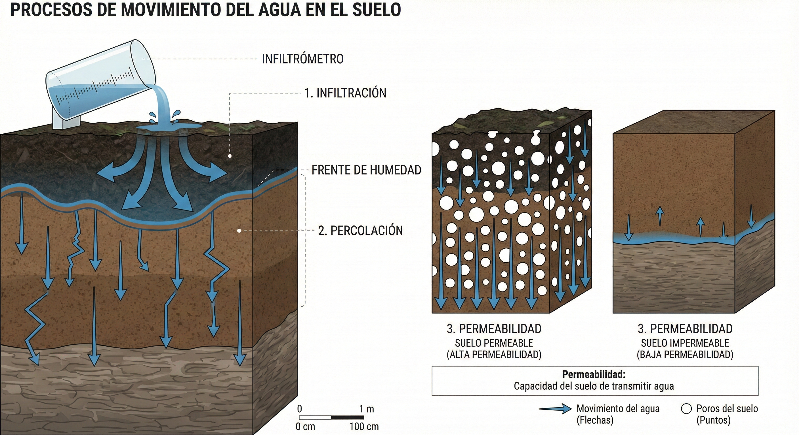
```

En la hidrología, la infiltración constituye la principal abstracción (o pérdida inicial) durante una tormenta, ya que determina la proporción de la precipitación que se transforma en escorrentía directa.

- **Capacidad de infiltración ($f_p$)**: Es la tasa máxima a la cual el suelo, bajo condiciones dadas, puede absorber agua.  

- **Tasa de infiltración ($f$)**: Es la velocidad real a la que el agua entra en el suelo. La relación entre ambas está gobernada por la intensidad de la lluvia ($i$):

  - Si $i < f_p$, entonces $f = i$ (toda la lluvia se infiltra).  
  - Si $i \geq f_p$, entonces $f = f_p$ (se produce encharcamiento y el excedente genera escorrentía).


La capacidad de infiltración no es constante; generalmente decrece de forma exponencial desde el inicio de la lluvia hasta alcanzar un valor casi constante denominado infiltración básica. Los factores más relevantes que influyen en este proceso son:

1. Textura del suelo: Suelos de grano grueso, como arenas, presentan poros grandes que facilitan el flujo gravitacional y altas capacidades de infiltración, mientras que suelos finos, como arcillas, presentan valores mucho menores.  

2. Contenido de humedad inicial: Un suelo seco presenta una elevada succión capilar, lo que produce tasas iniciales de infiltración altas. Conforme el suelo se humedece, la succión disminuye y la tasa de infiltración se reduce.  

3. Cobertura vegetal: Protege el suelo del impacto directo de las gotas de lluvia, evitando la formación de costras superficiales que sellan los poros. Además, las raíces generan macroporos que favorecen el movimiento del agua.  

4. Compactación: El tránsito de maquinaria pesada o el sobrepastoreo reducen la porosidad del suelo y disminuyen significativamente su capacidad de absorción.


Es el método de medición en campo más utilizado, es el infiltrómetro de doble anillo. Consiste en dos cilindros concéntricos hincados en el suelo.

Se mantiene un nivel constante de agua en ambos anillos. El anillo exterior minimiza el flujo lateral, asegurando que la infiltración medida en el anillo interior sea predominantemente vertical. Puede sobreestimar la infiltración real debido a la presión hidrostática ejercida por la columna de agua.

Otro método de medición de la capacidad de infiltración son los simuladores de lluvia. Estos utilizan boquillas de aspersión que reproducen el tamaño de gota y la energía de impacto de la lluvia natural sobre una parcela controlada. Son especialmente útiles en estudios hidrológicos, ya que consideran el sellado superficial por impacto de gotas y no aplican una carga hidrostática artificial.


### Conductividad hidráulica

La conductividad hidráulica ($K$) es una medida de la capacidad de un medio poroso (suelo o roca) para transmitir agua a través de sus poros. Constituye un parámetro fundamental en la hidrología subterránea, ya que representa la facilidad con la que el agua fluye bajo la acción de un gradiente hidráulico.

Desde el punto de vista físico, la conductividad hidráulica es un término de flujo con unidades de velocidad (típicamente m/s, cm/s o m/día), **aunque no debe confundirse con la velocidad real del agua dentro de los poros**. Su magnitud depende tanto de las propiedades intrínsecas del medio poroso (como el tamaño, la forma y la conectividad de los poros) como de las propiedades del fluido, principalmente la viscosidad y la densidad, las cuales están influenciadas por la temperatura.

Es importante distinguir entre la conductividad hidráulica saturada e instaurada, ya que ambas imponen diferentes condiciones de flujo:

A. **Conductividad hidráulica saturada ($K_{sat}$)**: Corresponde a la capacidad de transmisión del suelo cuando todos sus poros están completamente llenos de agua. Bajo estas condiciones, y para un suelo homogéneo, $K_{sat}$ puede considerarse constante.

B. **Conductividad hidráulica insaturada**: Se presenta cuando los poros contienen simultáneamente aire y agua. En este caso, la conductividad hidráulica es una función no lineal del contenido de humedad del suelo. A medida que el suelo se seca, disminuye la sección efectiva disponible para el flujo y aumenta la resistencia, provocando una reducción drástica de $K$.

El flujo de agua en medios porosos está regido por la Ley de Darcy, la cual establece que el caudal es proporcional al área transversal de flujo, a la conductividad hidráulica y al gradiente hidráulico:

$$
Q = K \cdot A \cdot i
$$

Expresada en términos de velocidad de flujo:

$$
v = K \cdot i
$$

donde el gradiente hidráulico se define como:

$$
i = \frac{\Delta h}{L}
$$

siendo $\Delta h$ la pérdida de carga hidráulica y $L$ la longitud del trayecto de flujo.

Existen muchos factores que afectan la conductividad hidráulica dentro de un medio poroso, alguno son:  

1. <u>Textura del suelo</u>: Los suelos de grano grueso, como arenas y gravas limpias, presentan poros grandes e interconectados que permiten valores elevados de $K$. En contraste, los suelos finos como las arcillas muestran conductividades muy bajas debido a la alta tortuosidad de sus poros y a las fuerzas de atracción molecular que retienen el agua.

2. <u>Propiedades del fluido</u>: La temperatura influye directamente en la viscosidad del agua. Un incremento de la temperatura reduce la viscosidad y puede aumentar significativamente la conductividad hidráulica; por ejemplo, el paso de 4 °C a 32 °C puede aproximadamente duplicar la velocidad de flujo bajo el mismo gradiente hidráulico.

3. <u>Estructura y compactación</u>: La presencia de macroporos, grietas de desecación o canales generados por raíces puede originar flujos preferenciales, incrementando localmente la conductividad. Por el contrario, la compactación del suelo reduce la porosidad y disminuye la capacidad de transmisión.

La conductividad hidráulica puede determinarse mediante ensayos de laboratorio o pruebas de campo. 

Entre los ensayos de laboratorio están:

A. Permeámetro de carga constante: Se utiliza en suelos de alta permeabilidad, como arenas y gravas. Se mantiene una diferencia de carga constante y se aplica directamente la Ley de Darcy:

$$
K = \frac{Q L}{A \Delta H}
$$

B. Permeámetro de carga variable: Adecuado para suelos de baja permeabilidad, como arcillas. Se mide el descenso del nivel de agua en un tubo estrecho:

$$
K = \left( \frac{R^2}{r^2 L} \right) \ln \left( \frac{H_2}{H_1} \right)
$$

Dentro de las pruebas de campo, existen:

A. Método del pozo barrenado (Auger Hole): Utilizado cuando el nivel freático es somero. Se extrae agua del pozo y se mide la velocidad de recuperación del nivel.

B. Pruebas de bombeo: Permiten estimar un valor promedio espacial de $K$ a gran escala, a partir del abatimiento observado en pozos de observación durante el bombeo.

C. Pruebas de *slug* (Slug Tests): Consisten en introducir o retirar rápidamente un cilindro sólido en el pozo, generando una perturbación instantánea del nivel y observando su recuperación.

D. Permeámetro de Guelph: Instrumento portátil ampliamente utilizado para medir la conductividad hidráulica saturada por encima del nivel freático.


## Medición de caudales

El caudal, también denominado descarga o escurrimiento, se define como el volumen de agua que circula a través de una sección transversal de un cauce por unidad de tiempo, expresándose técnicamente en unidades de volumen por tiempo, como metros cúbicos por segundo ($\mathrm{m^3/s}$) o litros por segundo ($\mathrm{L/s}$). 

En el ámbito de la ingeniería civil y la gestión de los recursos hídricos, el conocimiento de la magnitud y de la distribución temporal del caudal es fundamental para el diseño, dimensionamiento y operación de infraestructuras críticas, tales como centrales hidroeléctricas, puentes, vertederos de presas y sistemas de drenaje urbano. 

Esta variable actúa como el indicador más representativo del estado hidrológico de una cuenca, ya que integra los efectos de la precipitación, la infiltración, el almacenamiento y la evapotranspiración. Su análisis permite evaluar tanto la disponibilidad de agua para consumo humano, agrícola o industrial, como el riesgo asociado a eventos hidrológicos extremos, tales como inundaciones y sequías.


### Aforos

El aforo es la operación de campo que tiene como objetivo determinar el caudal ($Q$) que circula por la sección transversal de un curso de agua en un instante determinado.

El principio fundamental del aforo se basa en la ecuación de continuidad, que establece que para un fluido incompresible:

$$
Q = A \cdot \bar{v}
$$

Donde:

- $Q$: Caudal ($\mathrm{m^3/s}$).
- $A$: Área de la sección transversal mojada ($\mathrm{m^2}$).
- $\bar{v}$: Velocidad media del flujo en la sección ($\mathrm{m/s}$).

La medición de caudales es el pilar de la hidrometría y es vital para la gestión de los recursos hídricos por las siguientes razones:

1. **Diseño de infraestructura**: Permite determinar el caudal de diseño para vertederos de presas, puentes, alcantarillas y sistemas de drenaje.
2. **Balances hídricos**: Es esencial para cuantificar las salidas de agua de una cuenca y calcular la disponibilidad real del recurso.
3. **Calibración de modelos**: Los datos de aforo permiten validar modelos de precipitación–escorrentía y transformar registros de niveles en caudales continuos mediante curvas de descarga.
- **Prevención de desastres**: Facilita el pronóstico de crecientes y sequías para mitigar riesgos socioeconómicos.


Los métodos de aforo se clasifican generalmente en directos e indirectos.

**Métodos de aforo directo**

Implican la medición *in situ* de las variables del flujo mientras este ocurre.

- <u>Método volumétrico</u>: Es el más preciso, pero se limita a caudales pequeños. Consiste en medir el tiempo ($t$) que tarda el flujo en llenar un recipiente de volumen ($V$) conocido:
$$
Q = \frac{V}{t}
$$

- <u>Método velocidad–área</u>: Es el más utilizado en ríos medianos y grandes. Se divide la sección en subsecciones (dovelas) y se mide la velocidad en cada una a diferentes profundidades (comúnmente al 20%, 60% u 80% de la profundidad total) usando un molinete o hélice. El caudal total es la suma de los productos de área y velocidad de cada dovela.

```{r}
#| label: fig-aforo 
#| fig-cap: "Método de aforo por el método velocidad-área.<br><span style='font-size:0.8em;'>Basado en: [@SerranoPacheco_IC0808_Hidrologia]"
#| fig-align: center
#| out-width: 110%
#| echo: false
#| class: fig-border

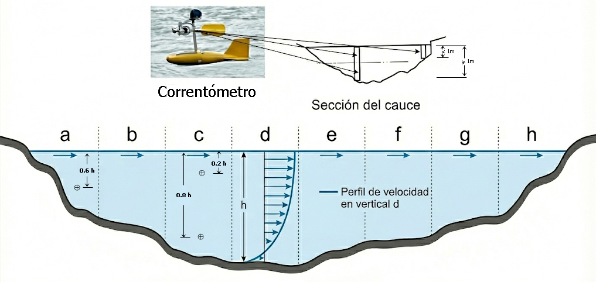
```

- <u>Aforos químicos (dilución)</u>: Se inyecta un trazador (sal, colorante o material radiactivo) de concentración conocida ($C_1$) a una tasa constante ($q$). Aguas abajo se mide la concentración de equilibrio ($C_2$):
$$
Q = q \cdot \frac{C_1 - C_2}{C_2 - C_0}
$$

- <u>Aforos acústicos (ADCP)</u>: Utilizan el efecto Doppler para medir perfiles de velocidad y profundidad simultáneamente mediante ultrasonido, permitiendo mediciones rápidas desde embarcaciones.

**Métodos de aforo indirecto**

Se basan en la medición del nivel del agua ($h$) y en el uso de relaciones matemáticas preestablecidas.

- <u>Estructuras de control (vertederos y canaletas)</u>: Estructuras precalibradas donde el caudal es función exclusiva de la carga hidráulica sobre una cresta.

```{r}
#| label: fig-vertedor 
#| fig-cap: "Método de aforo por el método de estructuras de control."
#| fig-align: center
#| out-width: 100%
#| echo: false
#| class: fig-border

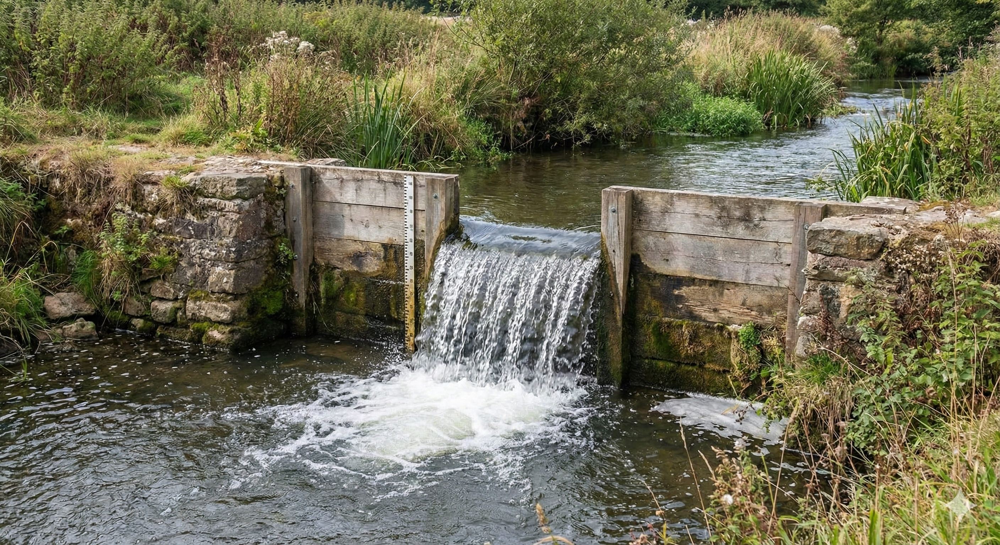
```

```{r}
#| label: fig-vertedor2 
#| fig-cap: "Ecuaciones de vertedores típicos."
#| fig-align: center
#| out-width: 100%
#| echo: false
#| class: fig-border

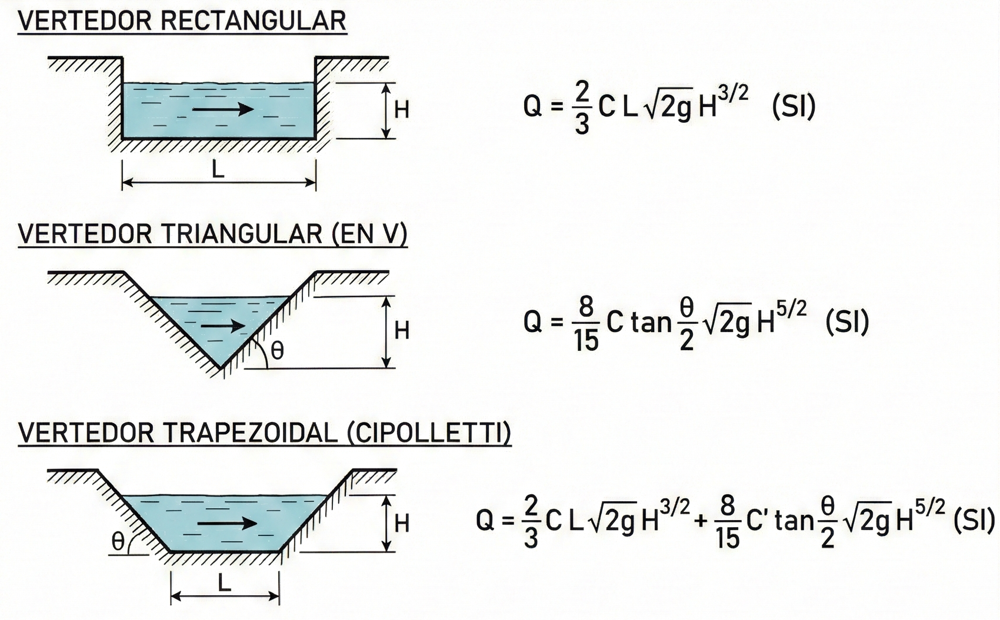
```

- <u>Método Sección–Pendiente</u>: Se utiliza después de una avenida extrema, estimando el caudal pico mediante las marcas de agua máxima, la geometría del cauce y la rugosidad de Manning.

- <u>Curva de Calibración (*rating curve*)</u>: Relación empírica $Q = f(h)$ establecida mediante múltiples aforos directos previos. Generalmente responde a una ecuación potencial:
$$
Q = a (h \pm h_0)^n
$$

```{r message=FALSE, warning=FALSE, error=FALSE}
#| label: fig-curva_descarga
#| fig-cap: "Ejemplo de curva de descarga."
#| fig-align: center
#| out-width: 100%
#| class: fig-border
# Simulación de una curva de descarga (curva nivel–caudal)
# Estilo inspirado en curvas clásicas de aforo

library(ggplot2)
library(dplyr)

set.seed(123)

# 1. Simular caudales (m3/s)
Q <- seq(0.5, 60, length.out = 40)

# 2. Curva teórica nivel–caudal (tipo potencial)
# Nivel en ms.n.m.
H_teorico <- 450 + 2.8 * log(Q + 1)

# 3. Agregar dispersión a los puntos observados
H_obs <- H_teorico + rnorm(length(Q), mean = 0, sd = 0.15)

datos <- tibble(
  Caudal = Q,
  Nivel_obs = H_obs,
  Nivel_teorico = H_teorico
)

# 4. Gráfica con ggplot
ggplot(datos, aes(x = Caudal)) +
  geom_line(
    aes(y = Nivel_teorico),
    linewidth = 1.4,
    color = "blue3"
  ) +
  geom_point(
    aes(y = Nivel_obs),
    size = 2,
    shape = 21,
    fill = "firebrick",
    color = "black"
  )   +
  labs(
    x = expression("Caudal ("*m^3*"/s)"),
    y = "Nivel (m.s.n.m.)"
  ) 
  

```


## Medición de sedimentos

El sedimento es el producto final de los procesos de erosión (hídrica, eólica o por gravedad) que ocurren en la superficie de una cuenca y en sus cauces. Dentro de la hidrología, la cuantificación del transporte de sedimentos es vital para determinar la vida útil de embalses, el diseño de canales estables y la evaluación de la calidad del agua, ya que muchos contaminantes se adhieren a las partículas sólidas.

El material sólido se desplaza a través de la red de drenaje en dos formas principales, dependiendo del mecanismo físico de transporte:

- **Carga de fondo (*Bed load*):** Partículas gruesas (arenas, gravas, cantos) que se desplazan rodando, deslizándose o saltando en contacto directo con el lecho.
- **Carga en suspensión (*Suspended load*):** Partículas finas (limos, arcillas) mantenidas en el cuerpo del flujo por la turbulencia del agua.  
  - Dentro de esta última, se denomina **carga de lavado** al material muy fino que no se encuentra en el lecho y viaja a la misma velocidad del agua sin depositarse.
  
```{r}
#| label: fig-lavado 
#| fig-cap: "Tipos de sedimento en cauce<br><span style='font-size:0.8em;'>Fuente: (Rheinheimer & Yarnell, 2017)</span>.<br><span style='font-size:0.8em;'>Modificado por: (Matarrita, 2021)</span>"
#| fig-align: center
#| out-width: 100%
#| echo: false
#| class: fig-border

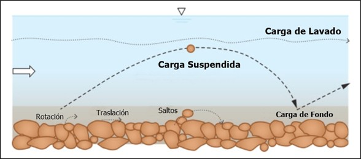
```

Debido a que la concentración de sólidos varía con la profundidad y el ancho del río, no basta con una muestra superficial. Existen diferentes técnicas dependiendo del tipo de sedimento que se desea muestrear.

- <u>Sedimento en suspensión</u>: Se utilizan muestreadores de integración de profundidad (como el estándar DH-48 o D-74). Estos aparatos se bajan y suben a una velocidad constante para recoger una muestra representativa de toda la vertical, asegurando que la velocidad de entrada en la boquilla sea igual a la de la corriente.

```{r}
#| label: fig-sediment 
#| fig-cap: "Muestreo de sedimento suspendido en cauce.<br><span style='font-size:0.8em;'>Fuente: [@usgsHydrosphere]</span>."
#| fig-align: center
#| out-width: 100%
#| echo: false
#| class: fig-border

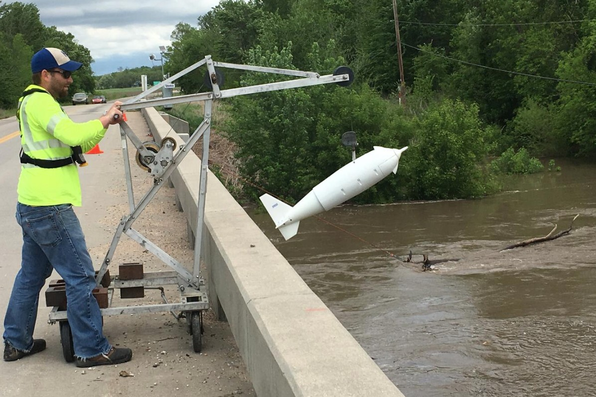
```

- <u>Carga de fondo</u>: Su medición es compleja y menos precisa. Se emplean trampas de sedimentos o muestreadores de presión diferencial como el Helley-Smith, que se colocan directamente sobre el lecho por intervalos de tiempo cortos.


## Medición de calidad del agua

El estudio del agua no puede limitarse únicamente a la cuantificación de volúmenes (hidrología física^[Es la rama de la ciencia que estudia los procesos físicos del agua en la Tierra, enfocándose en su movimiento, distribución, calidad y propiedades, desde la atmósfera hasta el subsuelo, aplicando principios de la física para entender el ciclo hidrológico y la interacción del agua con el entorno, vital para la gestión de recursos hídricos y la predicción de fenómenos como inundaciones.]), sino que debe integrar el análisis de su composición química, física y biológica. La calidad del agua se define como su idoneidad para un uso específico, ya sea consumo humano, riego agrícola, procesos industriales o mantenimiento de los ecosistemas naturales.

Existe una interdependencia crítica entre la cantidad y la calidad: los caudales bajos reducen la capacidad de dilución de los ríos, mientras que los caudales altos pueden aumentar el transporte de sedimentos y contaminantes desde las laderas.

Los indicadores de calidad se agrupan en tres grandes categorías fundamentales:

1. **Parámetros físicos:** Incluyen la temperatura (que afecta la solubilidad del oxígeno), el color, el olor, la conductividad eléctrica (relacionada con el total de sólidos disueltos) y la turbidez (presencia de partículas en suspensión que dispersan la luz).

2. **Parámetros químicos:**
    - <u>pH</u>: Mide la actividad de iones de hidrógeno; niveles fuera del rango 6.5–8.5 pueden ser letales para la biota.
    - <u>Oxígeno disuelto (OD)</u>: Es el indicador clave de la salud de un ecosistema acuático. Los niveles mínimos para mantener la vida piscícola suelen situarse en 5 mg/L.
    - <u>Nutrientes (nitrógeno y fósforo)</u>: Su exceso provoca eutrofización, caracterizada por el crecimiento desmedido de algas.
    - <u>Demanda bioquímica de oxígeno (DBO₅)</u>: Mide la cantidad de oxígeno consumida por microorganismos para degradar la materia orgánica en un período de 5 días.

- **Parámetros biológicos:** Se centran en la presencia de organismos patógenos como bacterias coliformes (por ejemplo *Escherichia coli*), virus y protozoos (*Giardia*, *Cryptosporidium*).

Dentro del estudio de agua y su calidad, es vital distinguir entre la concentración, que indica la intensidad del contaminante, y la carga, que representa la masa total transportada por la corriente.

La concentración se define como la masa de constituyente por unidad de volumen:

$$
C = \frac{\text{masa del constituyente}}{\text{volumen de fluido}}
$$

La tasa de carga o flujo de masa es el producto de la concentración por el caudal:

$$
L = C \times Q
$$

Esta relación es fundamental para realizar balances de masa en una cuenca o embalse, donde se aplica la ley de conservación de la materia.

La recolección de datos de calidad del agua debe seguir protocolos estrictos para garantizar que la muestra sea representativa del sistema hidrológico analizado.

- <u>Muestreo puntual</u>: Consiste en una única muestra tomada en un lugar y tiempo específicos. Es útil para caracterizar fuentes bien mezcladas o condiciones instantáneas.
- <u>Muestreo integrado</u>: Se obtiene mediante la mezcla de volúmenes iguales tomados a diferentes profundidades o posiciones transversales del cauce, proporcionando una muestra más representativa.
- <u>Sensores *in situ*</u>: El uso de sondas multiparamétricas permite medir en tiempo real variables como pH, conductividad, temperatura y oxígeno disuelto, reduciendo los errores asociados al transporte y almacenamiento de muestras para análisis de laboratorio.

```{r}
#| label: fig-hanna 
#| fig-cap: "Sensores multiparámetros para la caracterización de la calidad del agua.<br><span style='font-size:0.8em;'>Fuente: [Hanna Instruments, 2025]</span>."
#| fig-align: center
#| out-width: 80%
#| echo: false
#| class: fig-border

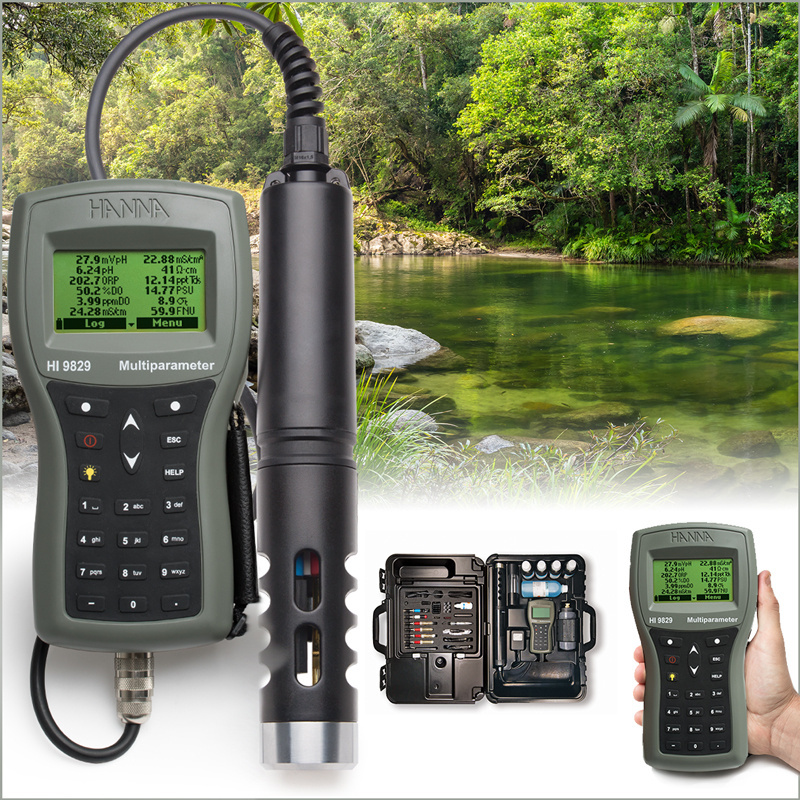
```

Estas mediciones suelen estar acompañadas por análisis más exhaustivos y detallados, realizados en laboratorios especializados. Tal es el caso del Laboratorio de Ingeniería Ambiental de la Escuela de Ingeniería Civil de la Universidad de Costa Rica. Donde las muestras recolectadas en campo, pasan por un proceso de análisis más detallado para complementar los análisis de campo.

```{r}
#| label: fig-ambiental 
#| fig-cap: "Análisis de calidad del agua en laboratorio.<br><span style='font-size:0.8em;'>Fuente: [CIEDES UCR, 2018]</span>."
#| fig-align: center
#| out-width: 100%
#| echo: false
#| class: fig-border


```


## Instrumentación hidrometeorológica en Costa Rica y desafíos asociados

En Costa Rica, la observación sistemática de las variables hidrometeorológicas se realiza a través de la red hidrometeorológica y climática nacional, conformada por un conjunto de estaciones distribuidas estratégicamente en el territorio. Estas estaciones, operadas por diversas instituciones como el Instituto Meteorológico Nacional (IMN), el Instituto Costarricense de Electricidad (ICE) y universidades, permiten la medición continua o periódica de variables meteorológicas (precipitación, temperatura, humedad, viento) y variables hidrológicas, principalmente niveles y caudales en ríos. En conjunto, esta red constituye la base observacional para el análisis del clima, la gestión de los recursos hídricos y la toma de decisiones operativas en sectores como la energía, la gestión del riesgo y el abastecimiento de agua.

```{r}
#| label: fig-cr_estaciones
#| fig-cap: "Red de estaciones meteorológicas en Costa Rica.<br><span style='font-size:0.8em;'>Fuente: [@IMN_CostaRica]</span>"
#| fig-align: center
#| out-width: 80%
#| echo: false
#| class: fig-border

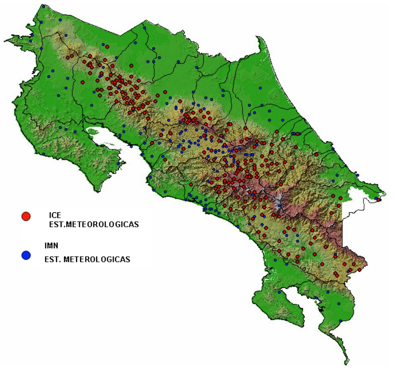

```

La red hidrometeorológica tiene como objetivo principal describir y monitorear el estado del tiempo y su componente hidrológico asociado en escalas temporales cortas, lo cual resulta esencial para la atención de eventos extremos, como lluvias intensas, crecidas repentinas o sequías. 

Desde el punto de vista hidrológico, uno de los principales retos asociados a la instrumentación en Costa Rica es la naturaleza puntual de las mediciones de precipitación. Los pluviómetros y pluviógrafos registran la lluvia únicamente en el punto donde se ubica la estación, mientras que la precipitación real presenta una variabilidad espacial muy marcada, especialmente en un país con topografía compleja, fuertes gradientes altitudinales y regímenes de lluvia convectiva y orográfica. Esta limitación implica que los datos puntuales no son directamente representativos del comportamiento espacial de la lluvia sobre una cuenca hidrográfica.

Como consecuencia, el análisis hidrológico debe recurrir de forma sistemática a métodos de estadística espacial y regionalización para transformar las mediciones puntuales en estimaciones areales. Entre estos métodos se incluyen técnicas clásicas como los polígonos de Thiessen y las isoyetas, así como enfoques más avanzados basados en interpolación geoestadística, modelos de regresión con variables topográficas y la integración de información de radar y satélites. Estos procedimientos permiten reducir la incertidumbre asociada a la escasez o distribución irregular de estaciones, pero introducen supuestos adicionales que deben ser cuidadosamente evaluados.

```{r}
#| label: fig-espacial
#| fig-cap: "Análisis de estadística espacial.<br><span style='font-size:0.8em;'>Fuente: [Biostats, 2013]</span>"
#| fig-align: center
#| out-width: 100%
#| echo: false
#| class: fig-border

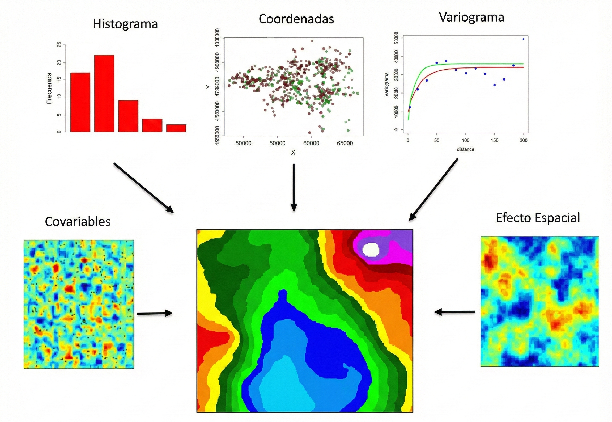

```

En este contexto, la calidad, densidad y continuidad de la red de observación hidrometeorológica se convierten en factores críticos para la confiabilidad de los estudios hidrológicos en Costa Rica. La correcta interpretación de los datos requiere no solo conocimiento de los instrumentos y sus limitaciones, sino también el uso riguroso de herramientas estadísticas y espaciales que permitan capturar la variabilidad real de los procesos hidroclimáticos que gobiernan la respuesta de las cuencas.

