::: {.quote-block}
“Para comprender el clima, primero debemos comprender el movimiento del aire.”\
— *Carl-Gustaf Rossby, meteorólogo, pionero en el estudio de los movimientos a gran escala del aire y las corrientes oceánicas*
:::

Dentro de la hidrología, es fundamental comprender el comportamiento de la atmósfera, ya que esta actúa como la fuerza motriz del ciclo hidrológico. 

## Principios de Meteorología y Climatología

La meteorología y la climatología constituyen disciplinas fundamentales para la hidrología, ya que permiten comprender y cuantificar los procesos atmosféricos que controlan la disponibilidad, distribución y variabilidad del agua en la superficie terrestre. Ambas ciencias estudian el comportamiento de la atmósfera, pero lo hacen desde escalas temporales y objetivos distintos, los cuales resultan complementarios en el análisis hidrológico.

La <span class="firebrick"><strong>meteorología</strong></span> es la ciencia que trata del estudio de la atmósfera y sus fenómenos. Se centra en las variaciones de corto plazo que tienen lugar en el aire; es decir, describe el estado físico de la atmósfera en un momento y lugar determinados, lo que comúnmente llamamos *tiempo*.


Por su parte, la <span class="firebrick"><strong>climatología</strong></span> se refiere a las condiciones de la atmósfera durante periodos prolongados en áreas extensas. Se puede definir de forma concisa como las propiedades estadísticas del tiempo, incluyendo promedios, normales y extremos registrados durante décadas (usualmente periodos de 30 años).

```{r}
#| label: tbl-meteovsclima
#| tbl-cap: "Comparación conceptual entre meteorología y climatología."
#| echo: false
#| message: false
#| warning: false

library(dplyr)
library(tibble)
library(kableExtra)

tabla_meteo_clima <- tribble(
  ~Concepto, ~`Enfoque Temporal`, ~`Objetivo Principal`,
  "Meteorología", "Horas o días (corto plazo)", "Pronóstico del tiempo y estudio de fenómenos momentáneos",
  "Climatología", "Décadas (largo plazo)", "Caracterización de regímenes regionales y estadísticas de diseño"
)

tabla_meteo_clima %>%
  kbl(
    booktabs = TRUE,
    align = c("c","c","c"),
    format = "html",
    col.names = c(
      "Concepto",
      "Enfoque temporal",
      "Objetivo principal"
    )
  ) %>%
  kable_classic(html_font = "Latin Modern Roman") %>%
  kable_styling(
    full_width = FALSE,
    bootstrap_options = "hover"
  ) %>%
  row_spec(0, bold = TRUE)
```


Desde una perspectiva física, ambas disciplinas se sustentan en principios comunes derivados de las leyes fundamentales de la física, en particular:

- La <u>conservación de la masa</u>, aplicada al vapor de agua y a los gases atmosféricos.

- La <u>conservación de la energía</u>, que explica los intercambios radiativos y térmicos entre la superficie terrestre y la atmósfera.

- Las <u>leyes del movimiento</u>, que gobiernan la circulación atmosférica y la generación del viento.

Un aspecto clave en meteorología y climatología es el balance energético de la Tierra, controlado principalmente por la radiación solar entrante y la radiación terrestre saliente. Las diferencias espaciales y temporales en la radiación solar generan gradientes de temperatura y presión que impulsan la circulación atmosférica, el transporte de humedad y la formación de sistemas nubosos y precipitantes. Estos procesos determinan, en última instancia, cuándo, dónde y en qué forma ocurre la precipitación, principal entrada del balance hídrico de una cuenca.

En el contexto de la hidrología, el conocimiento integrado de la meteorología y la climatología permite:

A. Interpretar adecuadamente los registros de estaciones hidrometeorológicas.

B. Seleccionar métodos apropiados para la estimación de variables climáticas faltantes, es decir, completar registros incompletos.

C. Evaluar la representatividad espacial y temporal de los datos.

D. Diseñar infraestructuras resilientes frente a la variabilidad natural del clima y a escenarios futuros de cambio climático.

Por lo tanto, los principios de meteorología y climatología constituyen la base conceptual sobre la cual se construyen los análisis hidrológicos, los modelos de simulación y las decisiones de gestión sostenible de los recursos hídricos.

## Atmósfera como sistema de transporte

El aire que respiramos es una mezcla de gases cuya masa total se estima en $5.8\times10^{14}$ toneladas. Esta mezcla se compone principalmente de nitrógeno (78 %) y oxígeno (21 %), los cuales se mantienen en proporciones constantes hasta aproximadamente 60 km de altura. El 1 % restante incluye gases como el argón, el dióxido de carbono ($\mathrm{CO_2}$) y trazas de ozono, metano y gases nobles.

Es importante destacar que el contenido de vapor de agua es extremadamente variable; mientras que en algunas zonas es casi nulo, en otras puede alcanzar hasta el 4 % del volumen. 

```{r}
#| label: tbl-atmosfera
#| tbl-cap: "Composición de la atmósfera."
#| echo: false
#| message: false
#| warning: false

library(dplyr)
library(tibble)
library(kableExtra)
library(ggplot2)
library(scales)

# -----------------------------
# Tabla: Gases permanentes de la atmósfera (porcentaje en volumen)
# -----------------------------
gases_atmosfera <- tribble(
  ~Constituyente,      ~Fórmula,                 ~`Porcentaje en volumen`,
  "Nitrógeno",         "N<sub>2</sub>",          78.08,
  "Oxígeno",           "O<sub>2</sub>",          20.95,
  "Argón",             "Ar",                      0.93,
  "Dióxido de carbono","CO<sub>2</sub>",          0.036,
  "Neón",              "Ne",                      0.002,
  "Helio",             "He",                      0.0005,
  "Kriptón",           "Kr",                      0.001,
  "Xenón",             "Xe",                      0.00009,
  "Hidrógeno",         "H<sub>2</sub>",           0.00005
)

gases_atmosfera %>%
  kbl(
    booktabs = TRUE,
    align = c("l","c","c"),
    format = "html",
    escape = FALSE,
    col.names = c("Constituyente", "Fórmula", "Porcentaje en volumen (%)")
  ) %>%
  kable_classic(html_font = "Latin Modern Roman") %>%
  kable_styling(full_width = FALSE, bootstrap_options = "hover") %>%
  row_spec(0, bold = TRUE) %>%
  column_spec(3, width = "6.5em") %>%
  footnote(
    general = "Valores típicos de gases permanentes (aprox.) expresados como porcentaje en volumen. El vapor de agua no se incluye por ser altamente variable.",
    general_title = ""
  )
```


```{r}
#| label: fig-atmosfera
#| fig-cap: "Composición de la atmósfera"
#| fig-align: center
#| out-width: 100%
#| echo: false
#| message: false
#| warning: false


# -----------------------------
# Alternativa (recomendada para docencia): dos paneles (mayores vs trazas)
# con colores diferenciados por gas (escala TURBO)
# -----------------------------

library(viridis)

gases_plot2 <- gases_atmosfera %>%
  mutate(
    Grupo = if_else(`Porcentaje en volumen` >= 0.1, "Mayoritarios", "Trazas"),
    Constituyente = factor(
      Constituyente,
      levels = Constituyente[order(`Porcentaje en volumen`, decreasing = TRUE)]
    )
  )

ggplot(
  gases_plot2,
  aes(
    x = Constituyente,
    y = `Porcentaje en volumen`,
    fill = Constituyente
  )
) +
  geom_col(width = 0.75, color = "black", linewidth = 0.2) +
  facet_wrap(~Grupo, scales = "free_y") +
  scale_fill_viridis_d(option = "turbo", guide = "none") +
  scale_y_continuous(labels = label_number(accuracy = 0.001)) +
  labs(
    x = NULL,
    y = "Porcentaje en volumen (%)"
  ) +
  theme(
    panel.grid.minor = element_blank(),
    axis.text.x = element_text(angle = 35, hjust = 1)
  )

```


A pesar de ser más ligero que otros gases, el 90 % del vapor de agua se concentra en los primeros kilómetros cerca del suelo, debido a que su fuente principal son los océanos y a que las bajas temperaturas en niveles superiores favorecen su condensación. Además, el aire contiene aerosoles, que son partículas sólidas y líquidas en suspensión (polvo, sales marinas, humo) que actúan como núcleos de condensación para la formación de nubes.


```{r}
#| label: fig-vapor
#| fig-cap: "Movimiento de masas de vapor de agua en la atmósfera.<br><span style='font-size:0.8em;'>Fuente: [@NOAA_OSPO]</span>"
#| fig-align: center
#| out-width: 80%
#| echo: false
#| class: fig-border

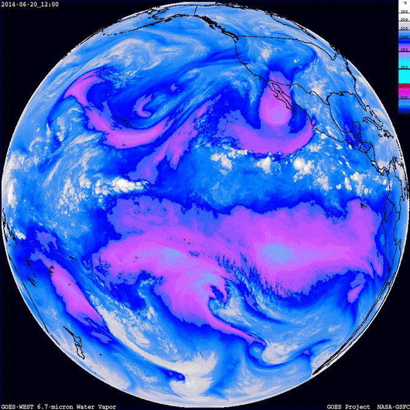

```


**Estructura y Estratos de la Atmósfera**

La atmósfera se organiza en una serie de capas o esferas concéntricas definidas por su perfil térmico.

- <u>Troposfera</u>: Es la capa más baja, extendiéndose desde la superficie hasta unos 8 km en los polos y 18 km en el ecuador. Contiene cerca del 75 % de la masa atmosférica y es donde ocurren los fenómenos meteorológicos de interés hidrológico. Aquí, la temperatura disminuye con la altura a una tasa promedio llamada *gradiente térmico vertical*.

```{r}
#| label: fig-troposfera
#| fig-cap: "Troposfera.<br><span style='font-size:0.8em;'>Fuente: [WorldAtlas, 2025]</span>"
#| fig-align: center
#| out-width: 70%
#| echo: false
#| class: fig-border


```

- <u>Estratósfera</u>: Se extiende desde la tropopausa hasta los 50 km. Se caracteriza por ser inicialmente isoterma y luego presentar un aumento de temperatura (inversión) debido a la absorción de radiación ultravioleta por la capa de ozono.

```{r}
#| label: fig-estratosfera
#| fig-cap: "Estratósfera.<br><span style='font-size:0.8em;'>Fuente: [WorldAtlas, 2025]</span>"
#| fig-align: center
#| out-width: 70%
#| echo: false
#| class: fig-border

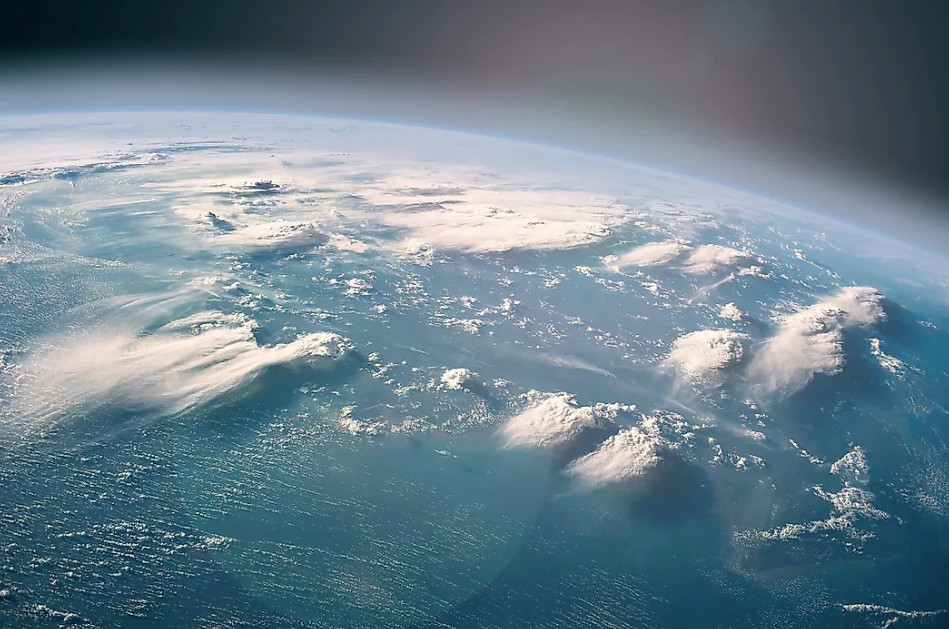

```

- <u>Mesosfera</u>: Situada entre los 50 y 80 km, la temperatura vuelve a disminuir hasta alcanzar aproximadamente $-95\ ^\circ\mathrm{C}$ en la mesopausa.

```{r}
#| label: fig-mesosfera
#| fig-cap: "Mesosfera.<br><span style='font-size:0.8em;'>Fuente: [WorldAtlas, 2025]</span>"
#| fig-align: center
#| out-width: 70%
#| echo: false
#| class: fig-border

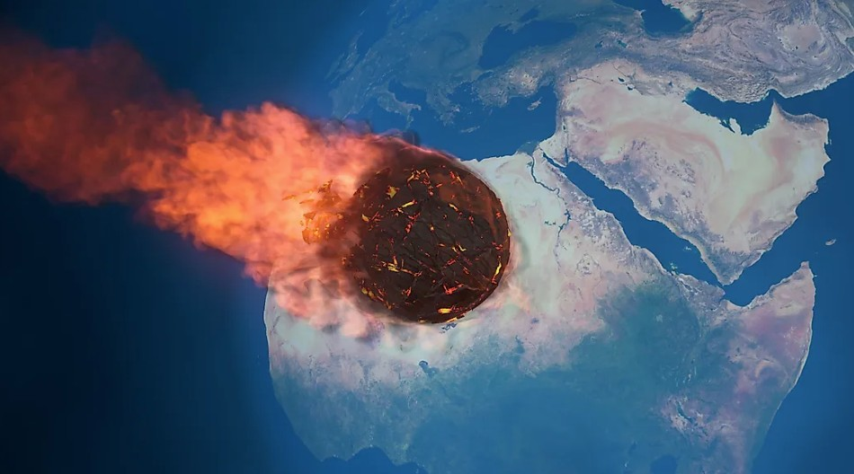

```

- <u>Termosfera</u>: Por encima de los 80 km, las temperaturas aumentan rápidamente por la absorción de radiación de alta energía, llegando hasta valores cercanos a $1000\ ^\circ\mathrm{C}$.

```{r}
#| label: fig-termosfera
#| fig-cap: "Termosfera.<br><span style='font-size:0.8em;'>Fuente: [WorldAtlas, 2025]</span>"
#| fig-align: center
#| out-width: 70%
#| echo: false
#| class: fig-border


```

- <u>Exosfera</u>: Es la región más externa (por encima de los 600 km), donde los gases ligeros escapan progresivamente al espacio exterior.

```{r}
#| label: fig-exosfera
#| fig-cap: "Exosfera.<br><span style='font-size:0.8em;'>Fuente: [WorldAtlas, 2025]</span>"
#| fig-align: center
#| out-width: 70%
#| echo: false
#| class: fig-border

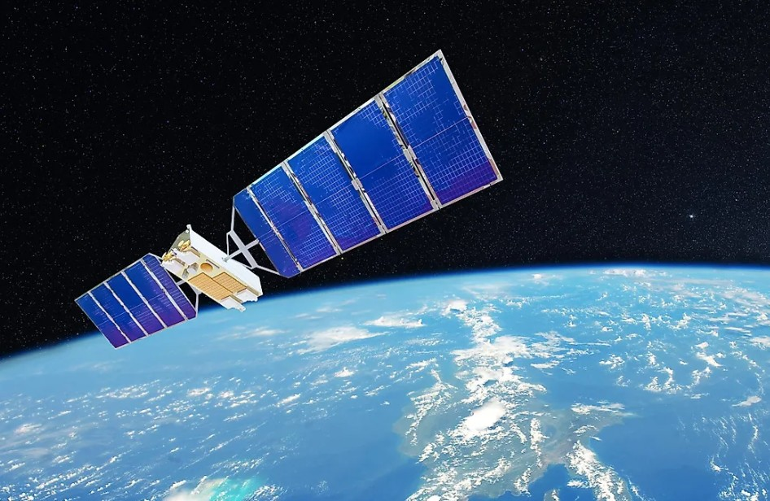

```

El gradiente de temperatura en las capas de la atmósfera se muestra en la siguiente figura.

```{r}
#| label: fig-capas3
#| fig-cap: "Gradiente térmico en capas de la atmósfera.<br><span style='font-size:0.8em;'>Fuente: [Dana Desonie, Ph.D., 2025]</span>"
#| fig-align: center
#| out-width: 100%
#| echo: false
#| class: fig-border

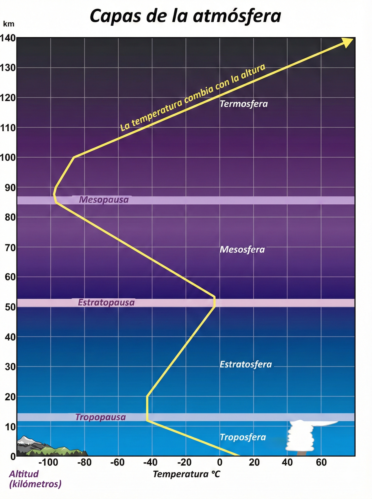

```

## Elementos del tiempo

El estado físico momentáneo de la atmósfera, el cual es esencialmente dinámico y cambia de un día a otro, o incluso de una hora a otra, se define a través de las variables o elementos del tiempo.

A. <u>Temperatura</u>

La temperatura mide la energía interna del aire. El gradiente térmico normal es de aproximadamente $6.5\ ^\circ\mathrm{C}$ por cada kilómetro de ascenso. Sin embargo, existen situaciones de inversión térmica, donde la temperatura aumenta con la altitud, creando condiciones de gran inestabilidad atmosférica.

B. <u>Presión Atmosférica</u>

Se define como el peso de la columna de aire que gravita sobre una unidad de área. Al nivel del mar, la presión estándar es de $1013.2$ mb. La presión disminuye rápidamente con la altura debido a que el aire es compresible y la gravedad concentra la mayor densidad cerca de la superficie. La relación entre presión ($P$), volumen ($V$), masa ($m$) y temperatura ($T$) se rige por la **Ley de los Gases Ideales**:

$$
PV = nRT
$$

O, expresada en función de la densidad ($\rho$):

$$
P = \rho RT
$$

C. <u>Humedad</u>

La humedad puede expresarse de varias formas:

  + Humedad absoluta ($\rho_v$): Masa de vapor de agua por unidad de volumen de aire.  
  - Humedad relativa (HR): Relación porcentual entre la presión real de vapor ($e_a$) y la presión de saturación ($e_s$) a la misma temperatura.  
  - Punto de rocío ($T_d$): Temperatura a la cual una masa de aire debe enfriarse, a presión constante, para alcanzar la saturación.

D. <u>Viento</u>

El viento es el aire en movimiento horizontal, generado por diferencias en el gradiente de presión. Su dirección se ve afectada por la rotación terrestre mediante la Fuerza de Coriolis^[Es una fuerza inercial que afecta a objetos en movimiento dentro de un sistema en rotación, como la Tierra, desviando su trayectoria hacia la derecha en el hemisferio norte y hacia la izquierda en el sur, debido a la rotación del planeta, lo que causa fenómenos como la formación de huracanes y patrones de viento], que desvía los vientos hacia la derecha en el hemisferio norte y hacia la izquierda en el hemisferio sur.

E. <u>Procesos Adiabáticos y Estabilidad</u>

Cuando una masa de aire asciende, se expande por la menor presión y se enfría sin intercambiar calor con su entorno. Las masas de aire puede ascender por efectos orográficos, conocidos también como **Efecto Foehn**.^[El efecto Foehn es un fenómeno meteorológico donde una masa de aire húmedo es forzada a ascender por una montaña, enfriándose y condensando su humedad para producir lluvia en la ladera de barlovento (húmeda y fresca), mientras que al descender por la ladera opuesta, la sotavento, el aire se calienta y se vuelve seco, creando un clima cálido y despejado, con efectos locales como sequías, incendios forestales o incluso impactos en la salud humana y animal.]

- **Gradiente adiabático seco**: El aire no saturado se enfría a una tasa de aproximadamente $10\ ^\circ\mathrm{C/km}$.  
- **Gradiente adiabático húmedo**: Si el aire está saturado, la condensación libera calor latente, reduciendo la tasa de enfriamiento a unos $6\ ^\circ\mathrm{C/km}$.

```{r}
#| label: fig-foehn
#| fig-cap: "Efecto Foehn de gradientes de presión.<br><span style='font-size:0.8em;'>Fuente: [Instituto Geográfico Nacional, Centro Nacional de Información Geográfica, UNAM; 2024]</span>"
#| fig-align: center
#| out-width: 100%
#| echo: false

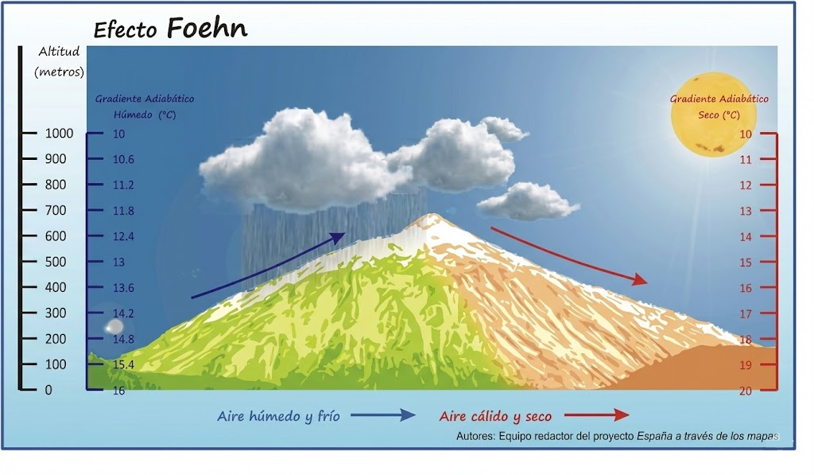
```


Los elementos del tiempo no deben ser analizados como entidades aisladas, sino como los componentes de un sistema dinámico e interrelacionado, donde la temperatura actúa como el motor fundamental que impulsa las variaciones en la humedad, la presión y, en consecuencia, el viento y la precipitación. Dentro de la hidrología, la comprensión y medición precisa de estas variables momentáneas representan la materia prima para el modelado de procesos como la escorrentía superficial y la evapotranspiración. 

Al registrar estos datos de forma continua y someterlos a un análisis estadístico de largo plazo (típicamente mediante el cálculo de las *normales climatológicas*^[Las normales climatológicas son promedios de datos meteorológicos (como temperatura y precipitación) calculados para períodos de 30 años consecutivos.] de 30 años) se logra la transición conceptual y metodológica del estudio del tiempo meteorológico al de la climatología.

## Cinturones de radiación

Antes de entrar en la dinámica del calor troposférico, es necesario comprender los mecanismos de protección energética de nuestro planeta. La Tierra posee cinturones de radiación, conocidos como **cinturones de Van Allen**, que consisten en concentraciones densas de protones y electrones de alta energía atrapados por el campo magnético terrestre.

- <u>Estructura</u>: Se organizan en dos zonas principales con forma de *cuarto creciente*, localizadas aproximadamente a 3 200 km y 16 000 km sobre la superficie terrestre.

- <u>Dinámica</u>: Las partículas cargadas se desplazan en trayectorias helicoidales entre los hemisferios Norte y Sur, confinadas por las líneas del campo magnético de la Tierra.

- <u>Fenómenos asociados</u>: Cuando parte de estas partículas penetra en la atmósfera superior, interactúa con los gases atmosféricos y produce las auroras boreales y australes. Este fenómeno se intensifica durante períodos de alta actividad solar, cuando flujos energéticos de electrones y protones son emitidos al espacio, perturbando el campo magnético terrestre y suministrando energía lumínica a la alta atmósfera mediante procesos de ionización.

```{r}
#| label: fig-allen
#| fig-cap: "Diagrama de anillos de Van Allen.<br><span style='font-size:0.8em;'>Fuente: [https://www.astronomynotes.com]</span><br><span style='font-size:0.8em;'>Modificado por (Matarrita,2025)"
#| fig-align: center
#| out-width: 110%
#| echo: false
#| class: fig-border

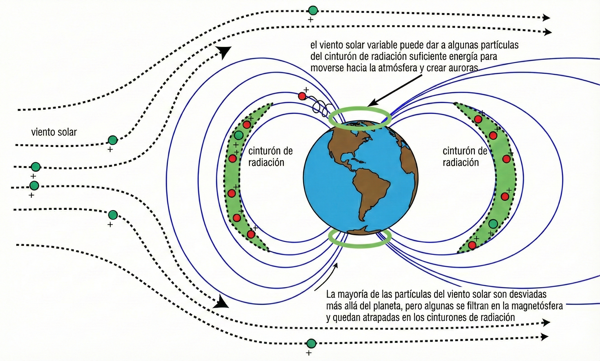
```

## Procesos de Transmisión de Calor

La energía calorífica se distribuye en la atmósfera mediante cuatro procesos físicos fundamentales. Estos mecanismos controlan procesos clave como la evaporación, la estabilidad atmosférica y la formación de nubes y tormentas.

1. <u>Radiación</u>  
Es la transferencia de energía a través de ondas electromagnéticas, sin necesidad de un medio material. Es el único mecanismo mediante el cual la energía solar alcanza la Tierra. La radiación emitida por un cuerpo depende de su temperatura absoluta, según la ley de Stefan–Boltzmann^[La Ley de Stefan-Boltzmann establece que la radiación térmica total emitida por un objeto (un cuerpo negro) es directamente proporcional a la cuarta potencia de su temperatura absoluta ($T^{4}$).]:

$$
R = \sigma T^4
$$

donde $\sigma$ es la constante de Stefan–Boltzmann y $T$ la temperatura absoluta del cuerpo.

2. <u>Conducción</u>  
Es la transmisión de calor por contacto directo entre moléculas. Dado que el aire es un mal conductor térmico, este proceso solo es relevante en una capa muy delgada de aire en contacto directo con la superficie del suelo o del agua.

3. <u>Convección</u>  
Corresponde al transporte vertical de calor mediante el movimiento de masas de fluido (aire o agua). El aire calentado en la superficie se expande, disminuye su densidad y asciende, siendo reemplazado por aire más frío y denso que desciende. Este mecanismo es fundamental en la formación de nubes convectivas y tormentas.

4. <u>Advección</u>  
Se refiere al transporte horizontal de calor debido al movimiento del aire. Es el principal proceso responsable de la redistribución de energía desde las regiones ecuatoriales hacia latitudes medias y polares.

```{r}
#| label: fig-calor
#| fig-cap: "Mecanismos de transferencia de calor."
#| fig-align: center
#| out-width: 100%
#| echo: false
#| class: fig-border

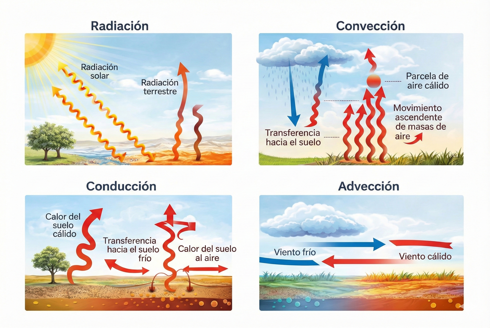
```

## La Insolación y el Calentamiento Atmosférico

La energía radiante que llega del Sol recibe el nombre de **insolación**. Esta energía alcanza la superficie terrestre principalmente en forma de radiación de onda corta, para la cual la atmósfera es mayoritariamente transparente. Esta transferencia de energía se detalló en la @fig-balance_rad.

- **Geometría Tierra–Sol**: Debido a la curvatura de la Tierra, la inclinación de su eje de rotación y su movimiento de traslación, los rayos solares inciden sobre la superficie con ángulos variables según la latitud y la época del año. Cuanto mayor es el ángulo de incidencia (rayos más perpendiculares), mayor es la concentración de energía por unidad de superficie y, por lo tanto, mayor el calentamiento.

```{r}
#| label: fig-latitud
#| fig-cap: "Distribución de la radiación debido a la curvatura de la Tierra."
#| fig-align: center
#| out-width: 100%
#| echo: false
#| class: fig-border

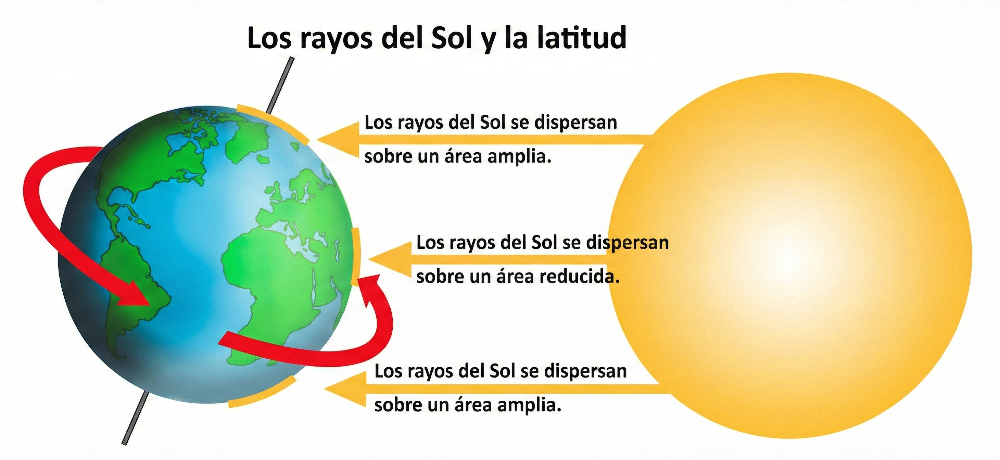
```

- **Rol del vapor de agua y otros gases**: Aunque la radiación solar calienta directamente la superficie, la atmósfera se calienta principalmente desde abajo. La superficie terrestre absorbe la radiación de onda corta y la reemite como radiación infrarroja de onda larga. El vapor de agua y el dióxido de carbono absorben esta radiación, reteniendo el calor en las capas bajas de la atmósfera, esto se conoce como efecto invernadero. Sin este efecto invernadero natural, la temperatura media de la Tierra sería cercana a −40 °C, haciendo inviable la vida tal como se conoce.

```{r}
#| label: fig-invernadero
#| fig-cap: "Efecto invernadero."
#| fig-align: center
#| out-width: 100%
#| echo: false
#| class: fig-border

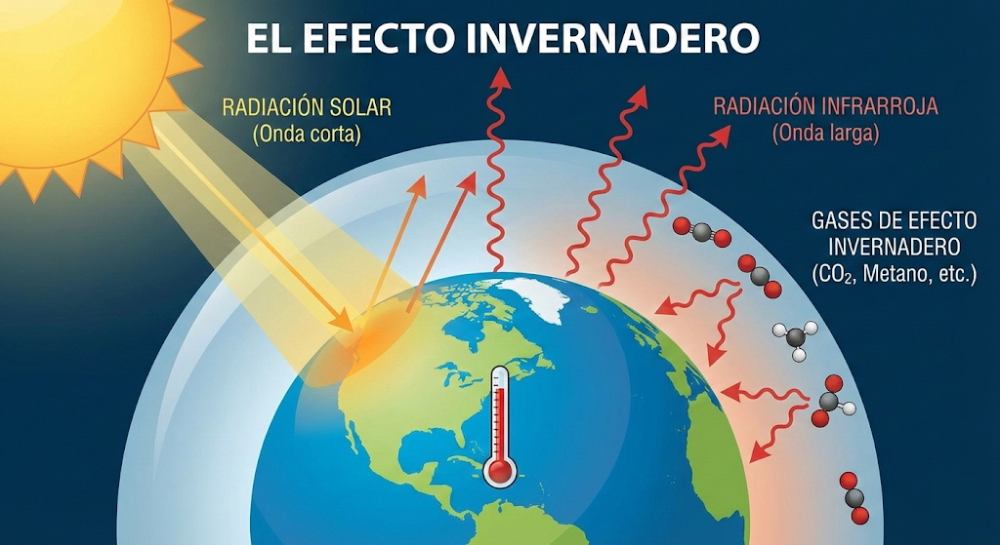
```

En regiones tropicales, por ejemplo, la nubosidad convectiva reduce la radiación directa, mientras que en zonas áridas la atmósfera limpia favorece una mayor insolación.

- **Espesor atmosférico atravesado por la radiación**  
  Cuando el Sol se encuentra cerca del horizonte, los rayos solares recorren una mayor longitud dentro de la atmósfera, aumentando los procesos de absorción, dispersión y reflexión. En consecuencia, la energía que alcanza la superficie es menor que cuando el Sol se encuentra próximo al cenit.

- **Duración de la insolación diaria**  
  En un lugar determinado, la duración del día varía a lo largo del año, siendo mayor en verano y menor en invierno. En latitudes medias y altas, esta variación puede ser del doble o más entre estaciones, afectando directamente la cantidad total de energía recibida y condicionando los regímenes climáticos e hidrológicos.

## Balance Térmico de la Tierra

Para que el clima global se mantenga estable, debe existir un equilibrio entre la energía entrante y saliente del sistema Tierra–atmósfera. De forma aproximada:

- Entre un 28 % y 34 % de la insolación es reflejada directamente al espacio (albedo terrestre), principalmente por las nubes y superficies claras.
- Del resto, la superficie terrestre absorbe aproximadamente entre 47 % y 51 % de la radiación solar incidente.
- La energía absorbida se transfiere nuevamente a la atmósfera mediante:
  - Calor latente, asociado a la evaporación del agua y liberado durante la condensación en las nubes.
  - Radiación infrarroja emitida por el suelo.
  - Intercambio turbulento, que combina procesos de conducción y convección.
  
## Calentamiento irregular de la atmósfera

La mayor parte de los cambios y fenómenos del tiempo que ocurren en la atmósfera son consecuencia directa del hecho de que la superficie terrestre y la atmósfera que la rodea no se calientan de manera uniforme. Esta distribución desigual de la energía solar constituye el motor fundamental de la circulación atmosférica y, por extensión, de los procesos hidrometeorológicos que gobiernan el ciclo hidrológico.

El calentamiento irregular de la atmósfera es clave para comprender la generación de gradientes de temperatura y presión que controlan la formación de vientos, la convección atmosférica, el desarrollo de nubes y la ocurrencia de la precipitación.

Esta falta de uniformidad en el calentamiento se debe principalmente a dos grandes grupos de factores:

1. <u>Factores sistemáticos</u> que afectan la cantidad de insolación disponible para su absorción por la superficie terrestre.

2. <u>Variaciones en la naturaleza de la propia superficie</u>, que determinan diferencias en la capacidad de absorción, almacenamiento y liberación del calor.


Además de la cantidad de energía incidente, el calentamiento atmosférico depende en gran medida de las características de la superficie que recibe la radiación:

- <u>Albedo superficial</u>  
  Superficies claras, como la nieve o los suelos secos, reflejan una fracción significativa de la radiación solar, mientras que superficies oscuras, como bosques densos o cuerpos de agua, absorben mayor energía. Este contraste influye directamente en la temperatura del aire cercano y en los flujos de calor sensible y latente.

- <u>Capacidad térmica y conductividad</u>  
  Los cuerpos de agua poseen una alta capacidad calorífica, lo que les permite almacenar grandes cantidades de energía y liberarla lentamente. Esto explica el efecto moderador de lagos y océanos sobre el clima local y regional, así como la menor amplitud térmica diaria en zonas costeras.

- <u>Cobertura vegetal y uso del suelo</u>  
  La vegetación intercepta radiación, da sombra al suelo y favorece la evapotranspiración, proceso que consume energía en forma de calor latente. En contraste, superficies urbanas impermeables tienden a almacenar calor y liberarlo rápidamente, intensificando el calentamiento del aire y alterando los balances hidrológicos locales.

El calentamiento irregular de la atmósfera tiene consecuencias directas sobre los procesos hidrológicos:

a. Genera gradientes térmicos que impulsan la circulación atmosférica y el transporte de vapor de agua.

b. Controla la intensidad y distribución espacial de la evaporación y la evapotranspiración.

c. Favorece la formación de sistemas convectivos responsables de lluvias intensas y eventos extremos.

d. Determina patrones climáticos regionales que condicionan la disponibilidad hídrica a largo plazo.

## Temperatura del aire

La temperatura del aire constituye uno de los elementos fundamentales del tiempo atmosférico. Como consecuencia de la distribución irregular de la energía solar incidente (insolación) sobre la superficie terrestre, la temperatura presenta variaciones espaciales y temporales significativas, las cuales influyen directamente en otros elementos meteorológicos como la presión, la humedad, el viento y la precipitación. 

### Variaciones térmicas diurnas y estacionales

La temperatura del aire presenta una variación diurna de carácter periódico. Generalmente, la temperatura máxima se alcanza durante las primeras horas de la tarde, mientras que la mínima ocurre poco antes de la salida del sol. Esta oscilación diaria está estrechamente ligada al balance radiativo: durante la noche, tanto la superficie terrestre como la atmósfera pierden calor por radiación infrarroja, alcanzándose el mínimo térmico poco antes de que comience el calentamiento solar matutino.

A escala anual, la temperatura también exhibe una variación estacional marcada. En los continentes, las temperaturas máximas suelen registrarse uno o dos meses después del solsticio de verano, mientras que las mínimas ocurren uno o dos meses después del solsticio de invierno. Este desfase responde a la inercia térmica del sistema superficie–atmósfera. En regiones continentales, donde la capacidad térmica del suelo es relativamente baja, las oscilaciones térmicas anuales son más pronunciadas que en regiones marítimas, donde la influencia moderadora de los océanos reduce la amplitud térmica.

Estas variaciones controlan la estacionalidad de la evapotranspiración, la disponibilidad de agua en el suelo y el régimen de caudales en cuencas con influencia nival o glaciar.

### Inversiones térmicas

En determinadas condiciones, la temperatura del aire puede aumentar con la altura en lugar de disminuir. Esta situación, conocida como inversión térmica, representa una condición de gran inestabilidad atmosférica. Las inversiones pueden originarse por diversos mecanismos:

- Enfriamiento intenso del aire cercano al suelo durante noches despejadas y calmadas.

- Desplazamiento de una masa de aire cálido sobre una masa de aire frío.

- Subsidencia atmosférica asociada a sistemas de alta presión.

- Reducción de la turbulencia vertical.

Las inversiones térmicas inhiben los movimientos verticales del aire, dificultan la dispersión de contaminantes y pueden tener efectos significativos sobre la calidad del aire y los procesos hidrológicos urbanos. La tropopausa constituye un ejemplo de inversión térmica a escala planetaria, separando la troposfera de la estratósfera.

### Efectos del movimiento vertical del aire sobre la temperatura

Además del movimiento horizontal de aire, que genera vientos y circulación atmosférica del aire por gradientes térmicos, la atmósfera experimenta movimientos verticales frecuentes que influyen directamente en la temperatura del aire. Estos movimientos pueden ser ascendentes o descendentes y están controlados por diversas causas físicas.

- **Calentamiento o enfriamiento local**

El aire en contacto con una superficie más cálida se calienta, se expande y asciende; por el contrario, el aire enfriado se vuelve más denso y desciende.

- **Ascenso orográfico**

Cuando una masa de aire se aproxima a una cordillera o relieve elevado, es forzada a ascender por la ladera expuesta al viento, enfriándose y favoreciendo la condensación y la precipitación. Este efecto se puede observar en la @fig-foehn.

- **Frentes y cuñas de aire frío**: En los sistemas frontales, el aire frío, más denso, se introduce por debajo del aire cálido, obligándolo a ascender y generando nubosidad y precipitación.

```{r}
#| label: fig-frente_frio
#| fig-cap: "Esquema de frente frío."
#| fig-align: center
#| out-width: 100%
#| echo: false
#| class: fig-border

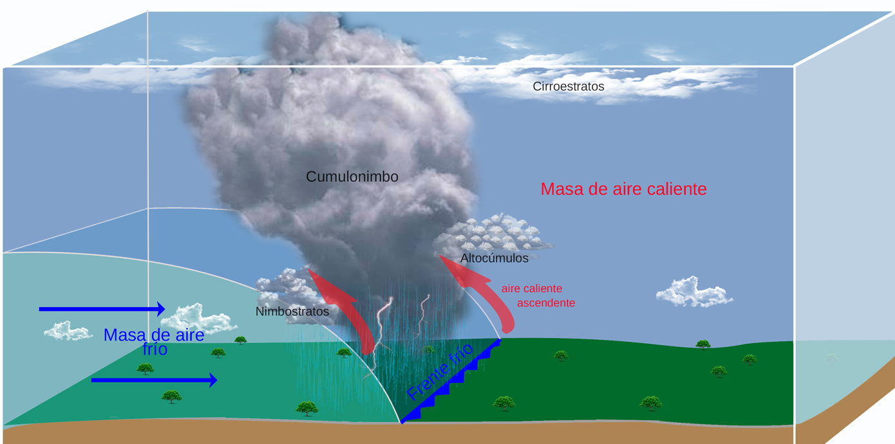
```

- **Convergencia y divergencia**

La convergencia del flujo de aire induce ascensos, mientras que la divergencia provoca subsidencia.

```{r}
#| label: fig-conver_diver
#| fig-cap: "Esquema de movimiento convergente y divergente del aire."
#| fig-align: center
#| out-width: 70%
#| echo: false
#| class: fig-border

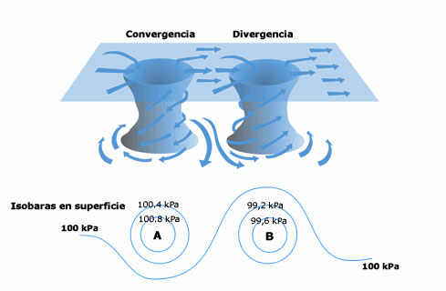
```


## Presión atmosférica

La presión atmosférica es uno de los elementos fundamentales en el estudio de la meteorología y la hidrología, ya que actúa como el motor que impulsa la circulación general de la atmósfera y condiciona fenómenos como la evaporación y la precipitación.

Físicamente, la presión atmosférica se define como la fuerza por unidad de superficie que ejerce la columna de aire que gravita sobre un área determinada. Esta fuerza es el resultado del número y la velocidad de las moléculas de aire al chocar contra una superficie; por lo tanto, un aumento en la densidad de moléculas en un volumen dado incrementará la presión.

Desde una perspectiva hidrostática, puede considerarse que la superficie terrestre se encuentra en el fondo de un “océano de aire” que presiona sobre todo lo que nos rodea con un peso aproximado de 1.033 kg/cm² al nivel del mar. En hidrología, esta variable actúa como un indicador del comportamiento atmosférico: cuando la presión aumenta, el aire es más pesado y tiende a descender (condiciones estables); cuando disminuye, el aire es más ligero y tiende a ascender, favoreciendo la condensación y la ocurrencia de tiempo inestable.


En una atmósfera en reposo, la relación entre presión \(p\) y elevación \(z\) está gobernada por la ecuación hidrostática:

$$
\frac{dp}{dz} = -\rho g
$$

donde $\rho$ es la densidad del aire y $g$ la aceleración de la gravedad. Al combinar esta relación con la ley de los gases ideales $P = \rho RT$, se obtiene una expresión práctica para estimar la presión en función de la altitud:

$$
P = 1013.2 \left[ \frac{288 - 0.0065 z}{288} \right]^{5.256}
$$

Esta ecuación es fundamental en hidrología para ajustar registros meteorológicos de estaciones ubicadas a diferentes elevaciones.


```{r}
### Tabla de referencia: atmósfera estándar

library(dplyr)
library(tibble)
library(kableExtra)

atm_estandar <- tribble(
  ~`Altitud (m)`, ~`Presión (mb/hPa)`, ~`Temperatura (°C)`,
  0,    1013.2, 15.0,
  500,   954.6, 11.8,
  1000,  898.8,  8.5,
  2000,  795.0,  2.0
)

atm_estandar %>%
  kbl(
    booktabs = TRUE,
    align = c("c","c","c"),
    format = "html",
    col.names = c(
      "Altitud (m)",
      "Presión (mb / hPa)",
      "Temperatura (°C)"
    )
  ) %>%
  kable_classic(html_font = "Latin Modern Roman") %>%
  kable_styling(
    full_width = FALSE,
    bootstrap_options = "hover"
  ) %>%
  row_spec(0, bold = TRUE)

```

[**Fuente:** Adaptado de la Atmósfera Estándar U.S.]{style="font-size: 0.8em;"}


**Distribución global y ciclos periódicos**

La presión atmosférica presenta oscilaciones periódicas conocidas como **mareas barométricas solares**, caracterizadas por dos máximos diarios (aproximadamente a las 10:00 y 22:00 h) y dos mínimos (alrededor de las 04:00 y 16:00 h).

A escala planetaria, la presión se organiza en cinturones latitudinales:

- Depresión ecuatorial: Zona de bajas presiones cercana a los 0° de latitud, asociada a convergencia de vientos y elevada nubosidad.
- Cinturones subtropicales de alta presión: Ubicados alrededor de los 30° N y S, vinculados a climas secos y regiones desérticas.
- Altas polares: Centros persistentes de alta presión sobre el Ártico y la Antártida.


## Viento

Dentro de la hidrología, el viento no es simplemente el movimiento del aire; es el agente responsable del transporte de humedad desde los océanos hacia los continentes y un factor determinante en la cuantificación de la evaporación y la evapotranspiración. Físicamente, el viento se define como el movimiento horizontal del aire, mientras que los movimientos verticales se denominan corrientes.

El aire se mueve como respuesta a desequilibrios de energía y presión en la atmósfera. Las principales fuerzas involucradas en la generación y modificación del viento son las siguientes:

- **Fuerza del gradiente de presión**

Es la fuerza impulsora inicial del movimiento del aire. El viento siempre tiende a desplazarse desde las zonas de alta presión hacia las zonas de baja presión, buscando restablecer el equilibrio atmosférico.

- **Fuerza de Coriolis**

Es una fuerza aparente originada por la rotación de la Tierra. Desvía el movimiento del aire hacia la derecha en el hemisferio norte y hacia la izquierda en el hemisferio sur. Su magnitud se expresa mediante la aceleración de Coriolis $G$:

$$
G = 2 v \, \omega \, \sin \varphi
$$

donde:

- $v$ es la velocidad del viento
- $\omega$ es la velocidad angular de rotación de la Tierra 
- $\varphi$ es la latitud. 

Esta fuerza no genera viento por sí misma, sino que modifica su dirección.

- **Fuerza de fricción**: El rozamiento del aire con la superficie terrestre reduce la velocidad del viento y altera su dirección, especialmente en las capas inferiores de la atmósfera. Esta influencia define la denominada *capa de fricción*, que se extiende aproximadamente hasta los primeros 500–600 m de altura y depende de la rugosidad del terreno (vegetación, edificaciones, relieve).

### La células de circulación general de la atmósfera

A escala planetaria, la atmósfera funciona como una gran máquina térmica impulsada por el calentamiento desigual entre el ecuador y los polos. Este sistema de redistribución de energía se organiza, en cada hemisferio, en tres grandes células de circulación: la célula de Hadley (tropical), la célula de Ferrel (latitudes medias) y la célula Polar.

```{r}
#| label: fig-hadley
#| fig-cap: "Células de circulación atmosférica.<br><span style='font-size:0.8em;'>Fuente: [CEUPE, 2025]</span>"
#| fig-align: center
#| out-width: 100%
#| echo: false
#| class: fig-border

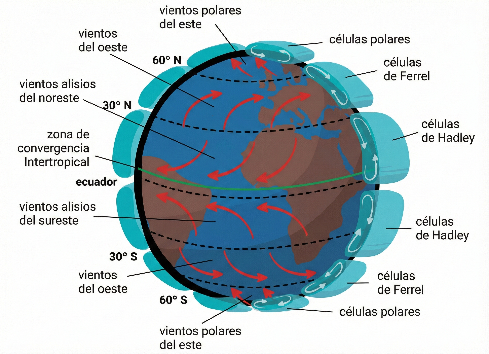

```


La célula de Hadley constituye el componente más intenso y organizado de la circulación atmosférica global en las regiones tropicales. Su funcionamiento puede describirse mediante un ciclo cerrado de cuatro etapas principales:

1. <u>Ascenso ecuatorial</u>: En las proximidades del ecuador, la intensa radiación solar calienta el aire cercano a la superficie, disminuyendo su densidad y provocando su ascenso. Este movimiento genera una banda persistente de bajas presiones conocida como la *Zona de Convergencia Intertropical* (ZCIT).

2. <u>Divergencia en altura</u>: Al alcanzar la tropopausa, el aire ascendente se desplaza horizontalmente hacia latitudes mayores. Durante este trayecto se enfría progresivamente y pierde gran parte de su humedad en forma de precipitaciones intensas, característica de las regiones tropicales húmedas.

3. <u>Subsidencia subtropical</u>: Aproximadamente a los $30^\circ$ de latitud norte y sur, el aire ya enfriado y más denso desciende hacia la superficie. Este descenso produce un calentamiento adiabático que reduce la humedad relativa del aire, dando origen a los cinturones de altas presiones subtropicales y explicando la localización de los principales desiertos del planeta.

4. <u>Vientos alisios</u>: Para cerrar el sistema, el aire fluye en superficie desde las altas presiones subtropicales hacia la baja presión ecuatorial. Debido al efecto de Coriolis, este flujo se desvía, formando los vientos alisios del noreste en el hemisferio norte y del sureste en el hemisferio sur.
  
5. <u>Chorro de Bajo Nivel del Caribe</u>: es uno de los componentes atmosféricos más influyentes en el transporte de humedad y en la modulación de las lluvias en Centroamérica y el norte de Sudamérica. Su comportamiento controla de manera directa la distribución espacial y temporal de la precipitación, con implicaciones hidrológicas significativas a escala regional.

```{r}
#| label: fig-chorro
#| fig-cap: "Chorro de bajo nivel del Caribe.<br><span style='font-size:0.8em;'>Fuente: [@Cigefi]</span>"
#| fig-align: center
#| out-width: 80%
#| echo: false
#| class: fig-border

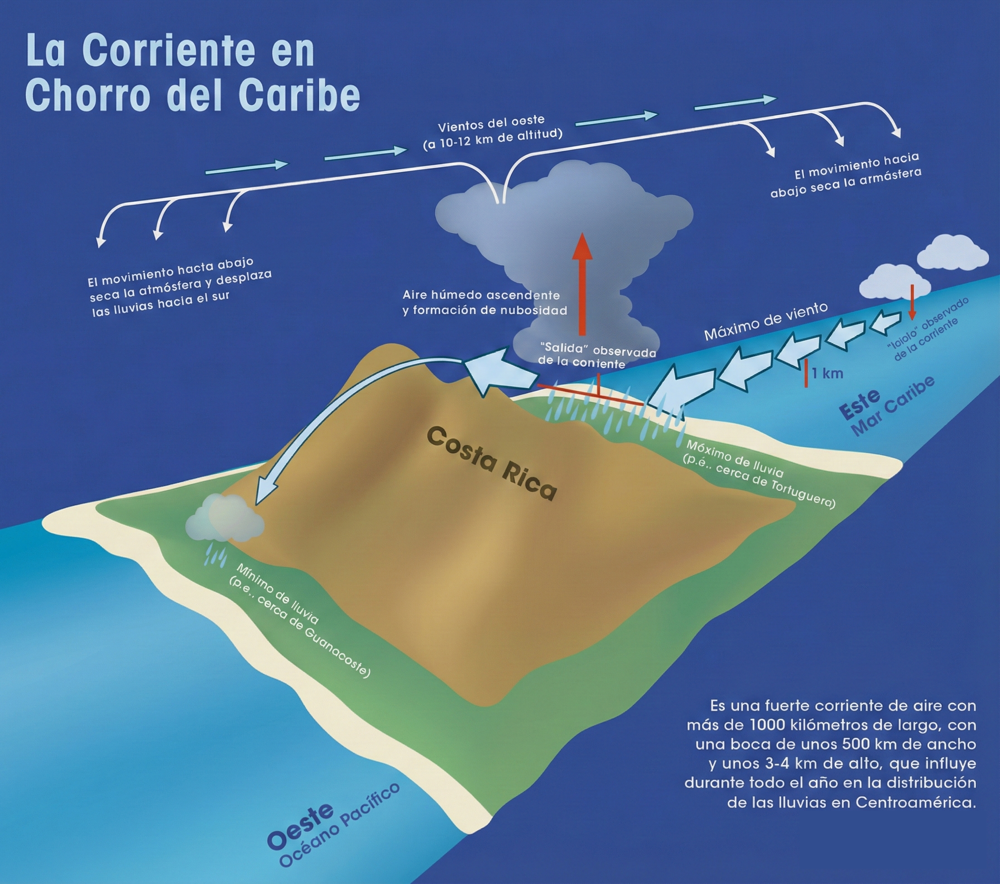

```

  A diferencia de las corrientes *jet* de la alta tropósfera, que se desplazan cerca de la tropopausa a grandes velocidades (entre 30 y 135 m/s), los chorros de bajo nivel corresponden a bandas de vientos máximos localizadas en la tropósfera inferior, generalmente por debajo de los 3 km de altura. Estas corrientes transportan grandes volúmenes de vapor de agua y tienen una interacción directa con la topografía y la superficie terrestre.

  El chorro del Caribe está estrechamente vinculado a la intensidad y persistencia de los vientos alisios del noreste. Estos vientos se originan en los cinturones subtropicales de alta presión y se desplazan hacia la zona de bajas presiones ecuatoriales, siguiendo el esquema de la circulación de Hadley.

  - **Intensificación estacional**: Entre los meses de julio y agosto, el viento alisio experimenta un fortalecimiento notable. Esta aceleración del flujo actúa como una verdadera cinta transportadora de humedad, impulsando grandes masas de vapor de agua desde el océano Atlántico tropical hacia el istmo centroamericano.

  - **Influencia del ENOS**: Durante la fase cálida del fenómeno El Niño–Oscilación del Sur (ENOS), el viento alisio tiende a intensificarse aún más, particularmente en los meses de mayo y julio. Este fortalecimiento incrementa la nubosidad y las precipitaciones en la vertiente del Caribe. Por el contrario, durante episodios de La Niña, el alisio suele debilitarse entre julio y septiembre, modificando los patrones de precipitación regional.

  - **Vertiente del Caribe**: Al impactar contra las barreras montañosas, como la Cordillera de Talamanca, las masas de aire húmedo son forzadas a ascender. Este ascenso provoca un enfriamiento adiabático, la condensación del vapor de agua y precipitaciones orográficas intensas. Este mecanismo explica por qué amplias zonas del Caribe costarricense y centroamericano carecen de una estación seca bien definida y presentan lluvias prácticamente continuas a lo largo del año.

  - **Vertiente del Pacífico**: Durante los períodos de máxima intensificación del chorro (julio y agosto), se produce un efecto de subsidencia a sotavento de las montañas. El descenso del aire inhibe la formación de nubosidad convectiva, dando lugar al fenómeno conocido como *veranillo* o *canícula*, caracterizado por una disminución relativa de las lluvias en plena estación lluviosa del Pacífico.


## Escalas de circulación atmosférica

La atmósfera funciona como una gigantesca máquina térmica alimentada por la energía solar y el campo gravitatorio terrestre, donde el movimiento del aire busca redistribuir el calor desde el ecuador hacia los polos. Esta redistribución se manifiesta en diferentes dimensiones espaciales y temporales, desde sistemas que abarcan todo el globo hasta pequeños remolinos que afectan la evaporación a nivel del suelo.

1. **Escala planetaria o global** ($\geq 10^{4}\ \text{km}^{2}$):  
   Incluye los grandes patrones de circulación general de la atmósfera, como las Células de Hadley, Ferrel y Polar, así como los cinturones de vientos dominantes y la distribución latitudinal de la radiación solar. Estos sistemas tienen escalas temporales de meses a años y definen los regímenes climáticos permanentes del planeta.

2. **Macroescala o escala sinóptica** ($\sim 10^{3}\ \text{km}^{2}$):  
   Corresponde a la escala de los mapas del tiempo utilizados en la predicción hidrometeorológica. Incluye sistemas de alta y baja presión, ciclones extratropicales, ondas frontales y huracanes, con tiempos característicos de evolución que van desde varios días hasta algunas semanas. Esta escala controla la disponibilidad regional de humedad y la ocurrencia de eventos de precipitación extensos.

```{r}
#| label: fig-sinop
#| fig-cap: "Escala sinóptica de circulación atmosférica.<br><span style='font-size:0.8em;'>Fuente: [@NOAA_OSPO]</span>"
#| fig-align: center
#| out-width: 60%
#| echo: false
#| class: fig-border

knitr::include_graphics("assets/img/sinop.jfif")

```

3. **Mesoescala** ($10^{0}$ a $10^{2}\ \text{km}^{2}$ ):  
   Comprende fenómenos de especial relevancia para cuencas pequeñas y medianas, tales como tormentas convectivas, líneas de turbonada, sistemas convectivos de mesoescala y brisas mar–tierra o valle–montaña. Aunque su duración suele limitarse a minutos u horas, estos sistemas pueden generar precipitaciones intensas y concentradas, responsables de inundaciones repentinas.
   
```{r}
#| label: fig-lluvia
#| fig-cap: "Mesoescala de circulación atmosférica.<br><span style='font-size:0.8em;'>Fuente: [@NOAA_OSPO]</span>"
#| fig-align: center
#| out-width: 60%
#| echo: false
#| class: fig-border

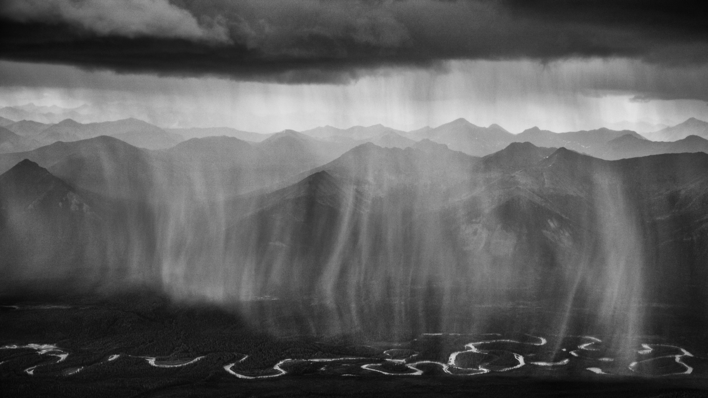

```   

4. **Microescala** ($\leq 10^{-1}\ \text{km}^{2}$):  
   Se refiere a procesos muy locales que ocurren cerca de la superficie, como la turbulencia atmosférica, los remolinos, la difusión de vapor de agua y el intercambio de energía entre el suelo, la vegetación y el aire. Aunque su escala temporal es del orden de segundos a minutos, estos procesos son determinantes para la evapotranspiración y el balance hídrico local.

```{r}
#| label: tbl-escala
#| tbl-cap: "Resumen de escala de circulación atmosférica."
#| echo: false
#| message: false
#| warning: false

### Resumen de escalas de variabilidad atmosférica relevantes para la hidrología

library(dplyr)
library(tibble)
library(kableExtra)

tabla_escalas <- tribble(
  ~Escala, ~`Dimensión espacial`, ~`Ejemplos de procesos`,
  "Planetaria", "≥ 10,000 km", "Radiación solar entrante, Células de Hadley, Corrientes jet",
  "Macroescala", "≈ 1,000 km", "Sistemas de latitudes medias, huracanes, frentes",
  "Mesoescala", "1 – 100 km", "Brisas marinas, vientos de valle, tormentas convectivas",
  "Microescala", "≤ 0.1 km", "Turbulencia, intercambio suelo–atmósfera, vegetación"
)

tabla_escalas %>%
  kbl(
    booktabs = TRUE,
    align = c("c", "c", "l"),
    format = "html",
    escape = FALSE,
    col.names = c(
      "Escala",
      "Dimensión espacial",
      "Ejemplos de procesos atmosféricos"
    )
  ) %>%
  kable_classic(html_font = "Latin Modern Roman") %>%
  kable_styling(
    full_width = FALSE,
    bootstrap_options = "hover"
  ) %>%
  row_spec(0, bold = TRUE)
```


## Corrientes oceánicas

## Fenómeno ENOS (El Niño- Oscilación del Sur)


