::: {.quote-block}
“Algunas personas sienten la lluvia. Otras solo se mojan.”\
— *Bob Marley.*
:::

La precipitación constituye el primer insumo directo del ciclo hidrológico y el vínculo natural entre los procesos atmosféricos y la respuesta hidrológica de una cuenca. Una vez comprendidos los fundamentos de la atmósfera, la circulación del aire y los mecanismos de generación de humedad, el siguiente paso lógico es analizar cómo esa humedad se transforma en precipitación, por qué ocurre en determinadas regiones y momentos, y de qué manera puede ser cuantificada y caracterizada. Este capítulo introduce la precipitación como variable hidrológica esencial, estableciendo una transición desde la hidroclimatología hacia el análisis hidrológico aplicado, y sienta las bases para su medición, descripción espacial y temporal, y uso en estudios de diseño y gestión del recurso hídrico.


## ¿Qué es la precipitación?


La precipitación se define técnicamente como cualquier forma de hidrometeoro, ya sea en estado líquido o sólido, que se origina en las nubes por la condensación del vapor de agua y alcanza la superficie terrestre. Desde la perspectiva de la hidrología, es la fuente primaria del suministro de agua en la Tierra y actúa como la fuerza motriz que impulsa el ciclo hidrológico.

## ¿Cómo se forma la precipitación? 

Para que el vapor de agua atmosférico se convierta en precipitación, deben cumplirse tres condiciones simultáneas:

1. La atmósfera debe alcanzar un estado de saturación (generalmente mediante el enfriamiento de la masa de aire).

2. Deben existir partículas minúsculas denominadas núcleos de condensación (polvo o sales) sobre los cuales el vapor pueda condensarse.

```{r}
#| label: fig-lluvia_2
#| fig-cap: "Núcleos de condensación, como mecanismo de formación de precipitación."
#| fig-align: center
#| out-width: 100%
#| echo: false
#| class: fig-border

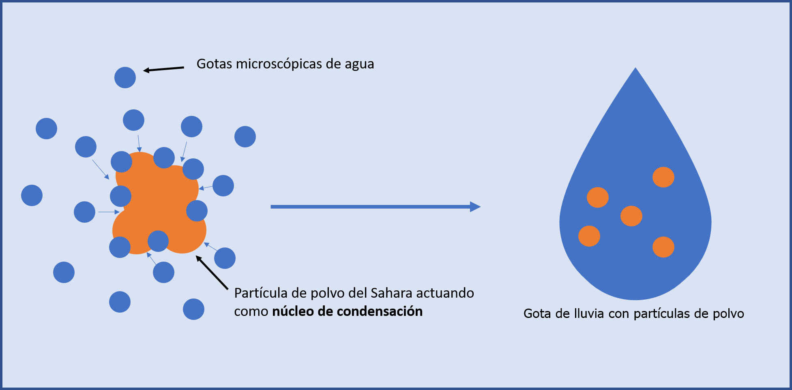

```

3. Las gotas o cristales resultantes deben crecer lo suficiente para vencer las corrientes ascendentes de aire y la gravedad.

Existen dos mecanismos principales para este crecimiento:

A.  Colisión y coalescencia: Ocurre en nubes cálidas ($T > 0\,^{\circ}\mathrm{C}$), donde las gotas de mayor tamaño descienden más rápido y absorben a las más pequeñas al chocar con ellas.

B. Proceso de cristales de hielo: Predomina en latitudes medias y altas (nubes frías), donde coexisten gotas de agua superenfriada y cristales de hielo; estos últimos crecen rápidamente por la difusión de vapor y agregación.

### Clasificación por su forma (fase)

La precipitación se manifiesta en diversas formas dependiendo de la temperatura de la atmósfera y del aire cercano al suelo.

**A. Formas líquidas**

- Lluvia: Gotas de agua con diámetros generalmente superiores a 0.5 mm.

- Llovizna: Gotas muy pequeñas (diámetro < 0.5 mm) con velocidades de caída muy bajas.

- Lluvia engelante (freezing rain): Gotas superenfriadas que se congelan instantáneamente al entrar en contacto con superficies frías a nivel del suelo.

**B. Formas sólidas**

- Nieve: Cristales de hielo complejos y ramificados formados por sublimación directa del vapor de agua.

- Granizo: Bolas o formas irregulares de hielo (diámetro > 5 mm) formadas por capas concéntricas en nubes de gran desarrollo vertical como los cumulonimbos.

- Sleet (cellisca): Bolitas de hielo transparentes resultantes de la congelación de gotas de lluvia al atravesar una capa de aire frío cerca de la superficie.

- Graupel (bolitas de nieve): Partículas de hielo opacas de 2 a 5 mm de diámetro, más suaves que el granizo.

### Tipos según el mecanismo de elevación

Dentro de la hidrología y la meteorología, es vital clasificar la precipitación según el fenómeno meteorológico que provoca el ascenso del aire.

- Convectiva: Producida por el calentamiento de la superficie terrestre. El aire caliente asciende violentamente, generando tormentas de alta intensidad, corta duración y áreas reducidas.

- Orográfica: Ocurre cuando masas de aire húmedo son obligadas a ascender por barreras montañosas. Esto genera lluvias abundantes en la ladera de barlovento y zonas secas o sombra de lluvia en la ladera de sotavento.

- Ciclónica o frontal: Asociada al encuentro de masas de aire con diferente temperatura (frentes) o a centros de baja presión. Son lluvias de larga duración, intensidad moderada y cubren grandes extensiones geográficas.

- Convergencia: Se da producto de la interacción de bajas presiones y alta nubosidad cerca del ecuador donde convergen los vientos alisios del noreste y sureste.

```{r}
#| label: fig-tipos_lluvia
#| fig-cap: "Tipos de mecanismo de formación de precipitación."
#| fig-align: center
#| out-width: 100%
#| echo: false
#| class: fig-border

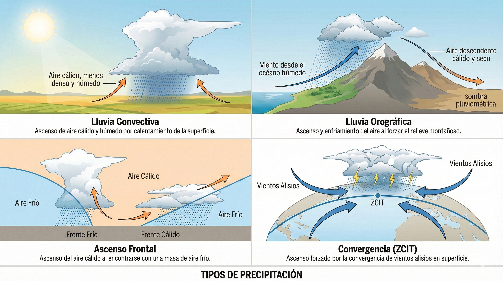

```

### Cuantificación de la precipitación

En la hidrología, meteorología, ingeniería y muchas otras disciplinas, la precipitación se mide como una lámina de agua vertical expresada en milímetros (mm).

$1\ \text{mm}$ de lluvia equivale exactamente a verter $1\ \text{L}$ de agua sobre una superficie impermeable de $1\ \text{m}^2$  
$(1\ \text{mm} \equiv 1\ \text{L m}^{-2})$.

## Distribución geográfica de la precipitación

La distribución geográfica de la precipitación es un factor determinante, ya que define la disponibilidad de agua y los riesgos de inundación en distintas regiones del planeta. Esta distribución no es uniforme y responde a una combinación de factores estáticos, como la altitud y la topografía, y factores dinámicos asociados a los patrones de circulación atmosférica.

**1. Variación latitudinal y circulación global**

A escala planetaria, la precipitación sigue un patrón zonal estrechamente ligado a las células de circulación atmosférica.

- Zonas ecuatoriales (0°–10° N/S): Es donde se registra la mayor pluviosidad global, con promedios que pueden superar los 2000 mm anuales. El intenso calentamiento solar provoca el ascenso convectivo de masas de aire húmedo en la Zona de Convergencia Intertropical (ZCIT), lo que resulta en lluvias abundantes y frecuentes.

- Zonas subtropicales (23.4°–30° N/S): Aquí la precipitación disminuye drásticamente, con valores del orden de 600 mm/año. El aire que ascendió en el ecuador desciende en estas latitudes, calentándose adiabáticamente y volviéndose extremadamente seco. Este fenómeno de subsidencia explica la ubicación de los grandes desiertos del mundo, como el Sahara o el desierto australiano.

- Latitudes medias (35°–60° N/S): La precipitación vuelve a aumentar debido a la actividad de ciclones extratropicales y frentes atmosféricos, donde interactúan masas de aire polar y tropical.

- Regiones polares: Presentan valores mínimos de precipitación, ya que el aire frío tiene una capacidad muy limitada para retener vapor de agua, de acuerdo con la ley de Clausius–Clapeyron.


```{r}
#| label: fig-dist_lluvia
#| fig-cap: "Distribución espacial de la precipitación, según latitud."
#| fig-align: center
#| out-width: 100%
#| echo: false
#| class: fig-border

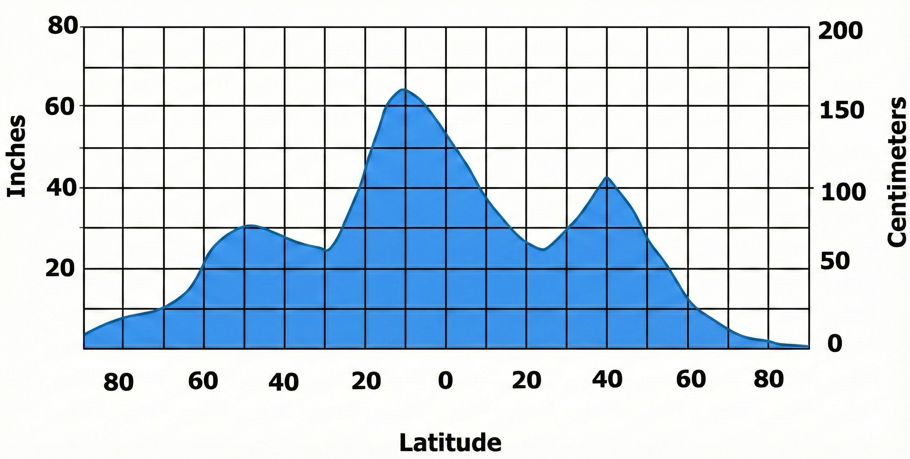

```

**2. Influencia de la continentalidad y fuentes de humedad**

La distancia a una fuente de humedad, principalmente los océanos, es uno de los factores más importantes en la distribución espacial de la precipitación.

- Efecto oceánico: Las regiones costeras suelen ser más húmedas, dado que aproximadamente el 85% del agua que se evapora anualmente proviene de los océanos.

- Interiores continentales: A medida que las masas de aire avanzan hacia el interior de los continentes, pierden progresivamente su contenido de vapor de agua, lo que da lugar a climas más secos en el centro de las grandes masas terrestres.

**3. Influencias orográficas y efecto de sombra pluviométrica**

La topografía actúa como una barrera mecánica que modifica de forma significativa el clima local. Cuando una masa de aire húmedo encuentra una cordillera, es obligada a ascender por la ladera de barlovento, enfriándose adiabáticamente y condensando su vapor en forma de precipitación orográfica.

Al cruzar la divisoria de aguas, el aire desciende por la ladera de sotavento, se calienta y se seca, generando lo que se conoce como sombra de lluvia.

```{r}
#| label: fig-orografia
#| fig-cap: "Interacción del terreno con la precipitación.<br><span style='font-size:0.8em;'>Fuente: [@IMN_CostaRica]</span>"
#| fig-align: center
#| out-width: 70%
#| echo: false
#| class: fig-border

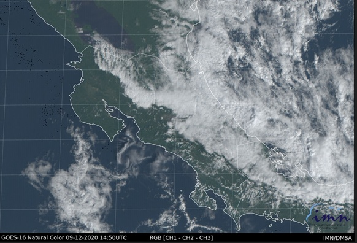

```

**4. Relación precipitación–altitud**

En términos generales, existe una correlación positiva entre la altitud y la cantidad de precipitación registrada. Dentro de la hidrología, y para fines prácticos de diseño en cuencas de montaña, esta relación suele aproximarse mediante una ecuación lineal:

$$
P = a + bH
$$

donde:

- $P$ es la precipitación anual (mm),
- $H$ es la altitud (m.s.n.m.),
- $a$ y $b$ son parámetros estadísticos característicos de la región.

No obstante, en cuencas de gran elevación (típicamente mayores a 2000 m), se ha observado la existencia de una altura óptima pluvial, a partir de la cual la precipitación puede comenzar a disminuir debido al agotamiento progresivo del contenido de humedad en la columna de aire.

## Distribución temporal de la precipitación

Dentro de un análisis hidrológico exhaustivo, no basta con conocer la cantidad total de lluvia que cae en un área; es igualmente crítico entender cuándo y con qué rapidez ocurre. La distribución temporal de la precipitación se analiza en diversas escalas, desde fluctuaciones interanuales que duran décadas hasta variaciones de pocos minutos durante una tormenta intensa.

### Escalas de variabilidad temporal

La variabilidad en el tiempo se puede clasificar en tres niveles principales:

- **Variación de largo plazo e interanual**: 

Se refiere a cambios en los totales anuales a lo largo de décadas. Estas variaciones suelen estar ligadas a teleconexiones atmosféricas, como el fenómeno de El Niño–Oscilación del Sur (ENOS). Por ejemplo, en algunos años el flujo normal de aire se altera significativamente, modificando los balances de energía y provocando años extremadamente secos o lluviosos en distintas regiones del planeta.

```{r}
#| label: fig-niño
#| fig-cap: "Perturbación periódica e irregular de las temperaturas de la superficie del oceáno.<br><span style='font-size:0.8em;'>Fuente: [@Bob2025]</span>"
#| fig-align: center
#| out-width: 100%
#| echo: false
#| class: fig-border

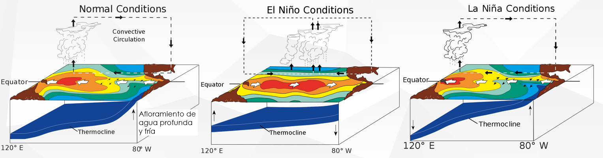

```

- **Variación estacional**: 

Define los regímenes climáticos característicos de una región, como la alternancia entre épocas secas y lluviosas. En el caso de Costa Rica, se distinguen claramente el régimen del Pacífico, con una estación seca bien definida entre diciembre y marzo, y el régimen del Caribe, lluvioso durante la mayor parte del año, con disminuciones relativas en marzo y septiembre–octubre, tal y como se mostró en la @fig-estacionalidad.

- **Variación de corta duración (escala de tormenta)**: 

Resulta de eventos sinópticos, como frentes fríos o ciclones, y de fluctuaciones diurnas impulsadas por el ciclo solar. Estas variaciones son determinantes para la estimación de caudales pico utilizados en el diseño de obras de drenaje y control de inundaciones.

```{r}
#| label: fig-dist_temp
#| fig-cap: "Ejemplo de patrones de distribución temporal de la precipitación.<br><span style='font-size:0.8em;'>Fuente: [@Kimura2014FloodHyetograph]</span>"
#| fig-align: center
#| out-width: 70%
#| echo: false
#| class: fig-border

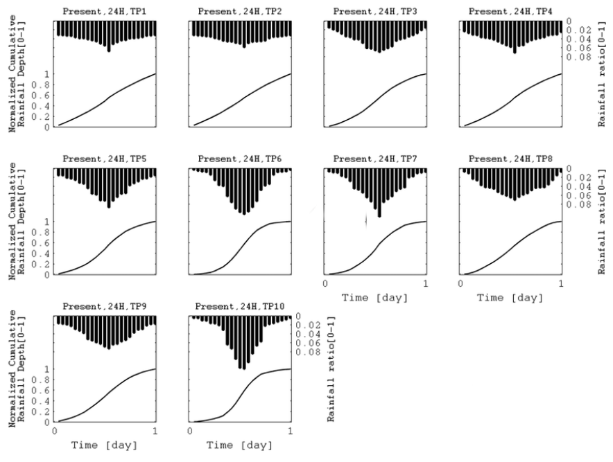

```

En Costa Rica, se han hecho algunos estudios sobre patrones caracteristicos de la precipitación. Estos estudios son sumamente valiosos para diseño y análisis en hidrología, ya que nos brindan una idea de como llueve típicamente en una región. 

Algunos de estos estudios son:

- Murillo Muñoz, R. E. (1994). *Estudio de las intensidades de lluvia en la cuenca del río Virilla*. Proyecto de graduación, Escuela de Ingeniería Civil, Universidad de Costa Rica, San José, Costa Rica.

- Maroto, J. A. (2011). *Distribución temporal de la precipitación en el Valle del Guarco*. Proyecto de graduación, Escuela de Ingeniería Civil, Universidad de Costa Rica, San José, Costa Rica.

- Sandí Rojas, S. G. (2012). *Generación de hidrogramas de creciente de la tormenta tropical Tomás para la evaluación de la infraestructura urbana en la cuenca del río Virilla*. Proyecto de graduación, Escuela de Ingeniería Civil, Universidad de Costa Rica, San José, Costa Rica.

### Parámetros de análisis de tormentas

Para cuantificar cómo se distribuye la lluvia durante un evento específico, se utilizan tres propiedades fundamentales:

1. Intensidad ($i$): Tasa a la que cae el agua sobre el terreno, expresada usualmente en mm/h.

2. Duración ($d$): Tiempo total durante el cual se mantiene una intensidad dada o duración completa del evento.

3. Frecuencia ($F$): Número probable de años que transcurren antes de que una combinación específica de intensidad y duración vuelva a ocurrir, relacionada con el periodo de retorno $T_r$.

**Ecuación fundamental de intensidad**

La intensidad máxima de una tormenta se calcula a partir de los datos registrados por el pluviómetro mediante la relación:

$$
i = \frac{\Delta h}{\Delta t}
$$

donde:

- $i$ es la intensidad de la lluvia (mm/h),
- $\Delta h$ es la altura de lluvia registrada en el intervalo considerado (mm),
- $\Delta t$ es la duración del intervalo de tiempo (h).

El análisis de intensidades es uno de los principales estudios dentro de la hidrología y el diseño hidrológico de infraestructuras civiles. Este tema se verá con mayor nivel de detalle en capítulos posteriores.

### Representaciones gráficas

Existen dos herramientas gráficas esenciales para visualizar la distribución temporal de la precipitación:

- Curva masa de precipitación: Representa la precipitación acumulada en función del tiempo. Es una curva no decreciente, cuya pendiente en cualquier punto corresponde a la intensidad instantánea de la lluvia.

```{r}
#| label: fig-masa
#| fig-cap: "Ejemplo de curva de masa de precipitación.<br><span style='font-size:0.8em;'>Fuente: [@Kimura2014FloodHyetograph]</span>"
#| fig-align: center
#| out-width: 70%
#| echo: false
#| class: fig-border

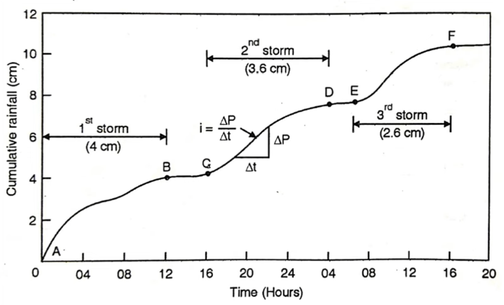

```

- Hietograma: Gráfico de barras que muestra la variación de la intensidad o de la altura de lluvia en intervalos de tiempo sucesivos. Constituye la herramienta básica para alimentar modelos de transformación lluvia–escorrentía.

```{r}
#| label: fig-hieto
#| fig-cap: "Ejemplo de hietograma de precipitación.<br><span style='font-size:0.8em;'>Fuente: [@Kimura2014FloodHyetograph]</span>"
#| fig-align: center
#| out-width: 70%
#| echo: false
#| class: fig-border

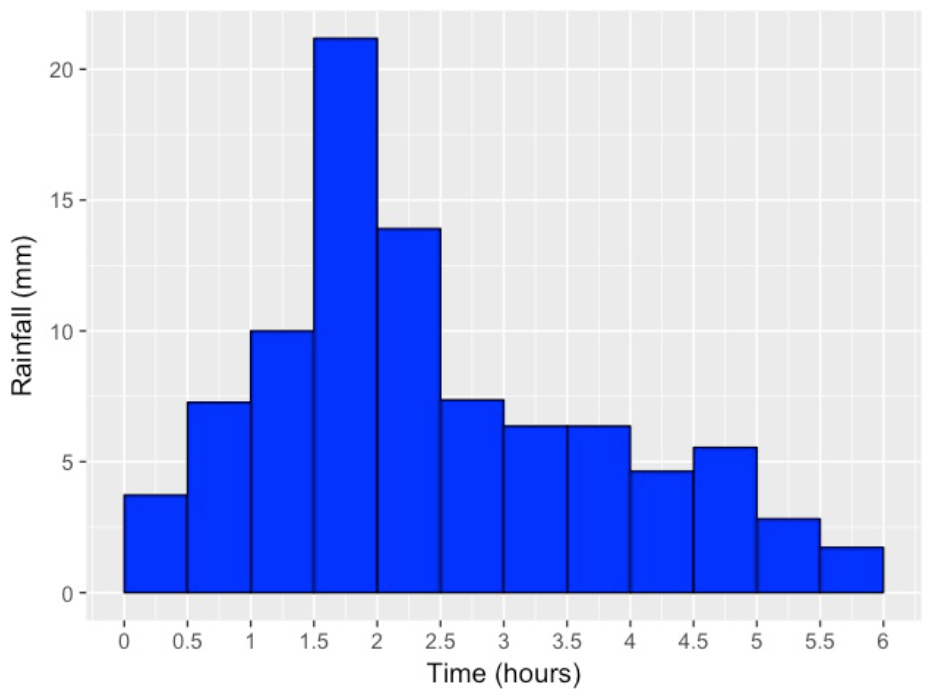

```

## Precipitación media sobre una cuenca

Para el diseño y la gestión de recursos hídricos, la precipitación registrada en estaciones individuales representa medidas puntuales en el espacio. No obstante, para el desarrollo de estudios y modelos de simulación hidrológica, es indispensable conocer la precipitación media sobre una cuenca (MAP, por sus siglas en inglés), <span class="firebrick"><strong>la cual se define técnicamente como la lámina uniforme equivalente de agua caída sobre la totalidad de la superficie de drenaje en un intervalo de tiempo determinado</strong></span>. Este parámetro constituye la entrada principal para los modelos de lluvia–escorrentía y es el punto de partida para la mayor parte de los cálculos de balance hídrico.

El objetivo fundamental de los métodos de estimación es generalizar las mediciones puntuales de los pluviómetros para obtener un valor representativo de toda el área de interés. Matemáticamente, la precipitación promedio de la cuenca ($P_A$) se calcula como un promedio ponderado de los registros de las estaciones disponibles ($P_i$), siguiendo la expresión general:

$$
P_A = \sum_{i=1}^{n} w_i \, P_i
$$

donde $w_i$ representa el factor de peso asignado a cada estación en función de su representatividad espacial dentro de la cuenca. En la práctica de la ingeniería, los tres métodos de uso generalizado son el promedio aritmético, los polígonos de Thiessen y el método de las isoyetas.

### Principales metodologías de estimación de precipitación media

- **1. Método aritmético**

Es el procedimiento más elemental para estimar la precipitación media. Consiste en calcular el promedio arimético simple de las lecturas registradas en las estaciones pluviométricas situadas dentro de los límites de la cuenca.

Ecuación:

$$
\bar{h}_p = \frac{1}{n} \sum_{i=1}^{n} h_{pi}
$$

Donde:

- $\bar{h}_p$: Precipitación media en la cuenca (mm).  
- $h_{pi}$: Altura de precipitación registrada en la estación $i$ (mm).  
- $n$: Número de estaciones consideradas.

Este método asigna el mismo peso a todas las estaciones, independientemente de su ubicación o del área que representan. Por lo tanto, su aplicación solo se considera aceptable bajo tres condiciones:

1. La cuenca presenta una topografía suave o plana.  
2. La red de pluviómetros es densa y está distribuida de forma homogénea.  
3. Las variaciones entre las lecturas de las estaciones individuales son mínimas.

En casos de topografía accidentada o redes de monitoreo dispersas, este método suele ser el menos preciso.


- **2. Método de los polígonos de Thiessen**

Este método, desarrollado por el meteorólogo estadounidense Alfred Thiessen en 1911, asigna a cada estación un área de influencia proporcional a su representatividad geográfica dentro de la cuenca. 

Esta técnica se basa en una premisa geométrica fundamental: en cualquier punto de la cuenca, se asume que la precipitación es igual a la registrada en el pluviómetro más cercano. A diferencia del promedio aritmético, este enfoque es objetivo, ya que elimina la subjetividad del analista en el trazado (propia del método de isoyetas) y permite incluir estaciones localizadas fuera de los límites de la cuenca si estas se encuentran geográficamente próximas.

Este método busca corregir la distribución no uniforme de los pluviómetros mediante la asignación de un factor de peso basado en el área de influencia de cada estación. Es un método objetivo y flexible, ya que, una vez determinados los pesos, el cálculo es inmediato mientras la red no cambie.

Ecuación:

$$
\bar{h}_p = \frac{1}{A_T} \sum_{i=1}^{n} A_i \, h_{pi}
$$

Donde:

- $A_i$: Área de influencia del polígono correspondiente a la estación $i$ (km$^2$).  
- $A_T$: Área total de la cuenca (km$^2$).  
- $h_{pi}$: Precipitación en la estación $i$ (mm).

Procedimiento de construcción

La delimitación de los polígonos, conocida matemáticamente como teselación de Voronoi, sigue un proceso geométrico riguroso:

1. **Triangulación**  
   Se unen las estaciones adyacentes mediante líneas rectas. En sistemas de información geográfica, este paso se realiza mediante la triangulación de Delaunay, la cual garantiza que ningún vértice quede contenido dentro del círculo circunscrito de los triángulos formados.

2. **Trazado de mediatrices**  
   Sobre cada segmento de unión entre estaciones se dibujan líneas perpendiculares en su punto medio (perpendiculares bisectrices).

3. **Cierre de polígonos**  
   Las intersecciones de estas mediatrices definen los vértices de los polígonos. Los límites finales de cada zona de influencia quedan determinados por dichas mediatrices y la divisoria de aguas de la cuenca.

```{r}
#| label: fig-thiessen
#| fig-cap: "Ejemplo de construcción de polígonos de Thiessen."
#| fig-align: center
#| out-width: 100%
#| echo: false
#| class: fig-border

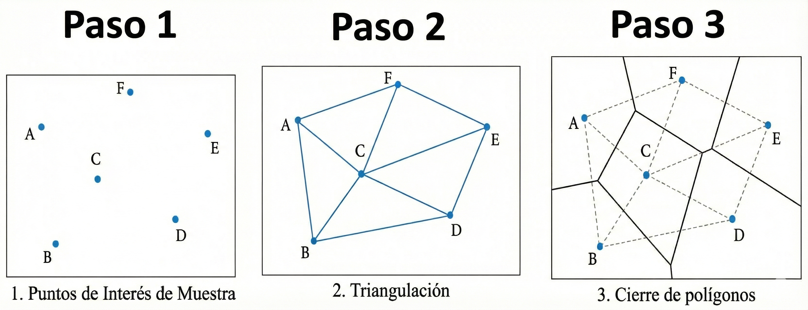

```


La precipitación media sobre la cuenca se calcula como un promedio ponderado, donde el factor de peso corresponde a la fracción del área total representada por cada polígono:

$$
P_A = \frac{1}{A_T} \sum_{i=1}^{n} A_i \, P_i
$$

O, de forma equivalente, expresado mediante coeficientes de peso:

$$
P_A = \sum_{i=1}^{n} w_i \, P_i
$$

Donde: 

- $P_A$: Precipitación media sobre la cuenca (mm).  
- $P_i$: Precipitación registrada en la estación $i$ (mm).  
- $A_i$: Área del polígono asociado a la estación $i$ (km$^2$).  
- $A_T$: Área total de la cuenca (km$^2$).  
- $w_i$: Factor de peso definido como $w_i = A_i / A_T$, cumpliendo que $\sum w_i=1$

```{r}
#| label: fig-thiessen3
#| fig-cap: "Ejemplo de construcción de polígonos de Thiessen, caso cuenca río Grande de Orosi."
#| fig-align: center
#| out-width: 100%
#| echo: false
#| class: fig-border

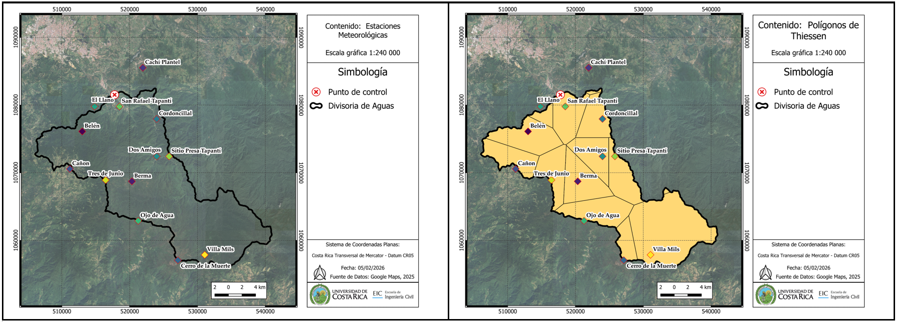

```


::: {.callout-note title="Ejemplo"}
Considere una cuenca de 175 km² con cinco estaciones pluviométricas. Los pesos obtenidos mediante el método de los polígonos de Thiessen y los registros de precipitación asociados se muestran en la siguiente tabla.

```{r}
#| label: tbl-thiessen-ejemplo
#| tbl-cap: "Cálculo de la precipitación media mediante el método de los polígonos de Thiessen."
#| echo: false
#| message: false
#| warning: false

library(dplyr)
library(tibble)
library(kableExtra)

tabla_thiessen <- tribble(
  ~Estación, ~`Lluvia (mm)`, ~`Área de influencia (km²)`, ~`Peso`, ~`Aporte ponderado (mm)`,
  "A", 3.90, 25.0, 0.143, 0.558,
  "B", 3.35, 20.8, 0.119, 0.399,
  "C", 3.55, 61.3, 0.350, 1.243,
  "D", 3.50, 11.0, 0.063, 0.221,
  "E", 3.10, 56.9, 0.325, 1.008,
  "Total", NA, 175.0, 1.000, 3.43
)

tabla_thiessen %>%
  kbl(
    booktabs = TRUE,
    align = c("c", "c", "c", "c", "c"),
    format = "html",
    escape = FALSE
  ) %>%
  kable_classic(html_font = "Latin Modern Roman") %>%
  kable_styling(
    full_width = FALSE,
    bootstrap_options = "hover"
  ) %>%
  row_spec(0, bold = TRUE)
```


Resultado: La precipitación media sobre la cuenca es de 3.43 mm. Nótese que, si se hubiera aplicado el promedio aritmético simple, el valor obtenido sería de 3.48 mm, ignorando que la estación C representa casi el triple del área de influencia de la estación B.

:::


**Ventajas**

- Eficiencia: Una vez determinados los pesos (áreas de influencia), estos permanecen constantes mientras no cambie la red de estaciones, lo que facilita el análisis de múltiples eventos de lluvia.
- Objetividad: Proporciona un resultado único y reproducible, independiente del analista que realice el procedimiento geométrico.

**Limitaciones**

- Orografía: No considera explícitamente los efectos de la altitud y del relieve sobre la precipitación, asumiendo una variación lineal entre estaciones, lo cual resulta inadecuado en cuencas montañosas.
- Rigidez: Cualquier modificación en la red de estaciones obliga a reconstruir el diagrama de Thiessen y recalcular las áreas de influencia.
- Discontinuidad: Genera un modelo espacial de lluvia por zonas con cambios abruptos en los límites de los polígonos, que no siempre representa fielmente la continuidad física del fenómeno.


- **3. Método de las isoyetas**

Es considerado el método más preciso y riguroso en hidrología, especialmente en regiones montañosas. Se basa en el trazado de isoyetas, que son líneas que unen puntos de igual precipitación, de forma análoga a las curvas de nivel en topografía.

```{r}
#| label: fig-isoyetas2
#| fig-cap: "Mapa de isoyetas de Costa Rica del 24 al 28 de octubre del 2025.<br><span style='font-size:0.8em;'>Fuente: [@IMN_CostaRica]</span>"
#| fig-align: center
#| out-width: 100%
#| echo: false
#| class: fig-border

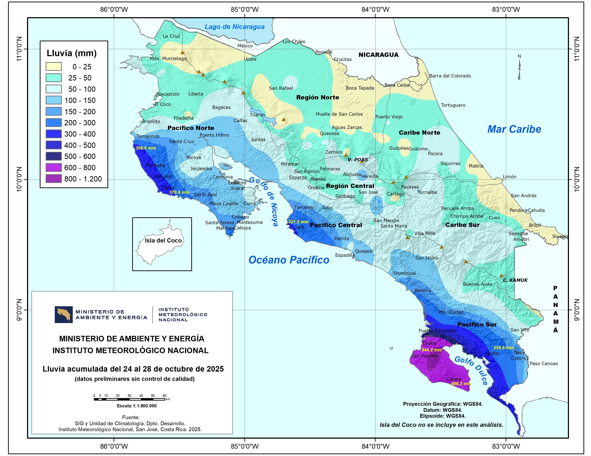

```

Ecuación: 

$$
\bar{h}_p = \frac{1}{A_T} \sum_{i=1}^{n'} A_i' \, \bar{h}_{pi}
$$

Donde:

- $A_i'$: Área comprendida entre dos isoyetas sucesivas (km$^2$).  
- $\bar{h}_{pi}$: Precipitación promedio entre las dos isoyetas limítrofes (mm).  
- $n'$: Número de franjas o áreas parciales consideradas.

**Ventajas**

Este método permite al hidrólogo aplicar su juicio profesional e incorporar conocimientos sobre la morfología de la tormenta y los efectos del relieve. Con una red densa y experiencia del analista, es posible representar patrones de lluvia mucho más realistas que los obtenidos por interpolaciones puramente geométricas.

**Limitaciones**

Su principal desventaja es que es el método más laborioso, ya que el mapa de isoyetas debe elaborarse nuevamente para cada evento de precipitación analizado.

::: {.callout-note title="Ejemplo"}
Se desea estimar la precipitación media sobre una cuenca de área total $A_T=50\ \text{km}^2$ para un evento de lluvia. Con base en los datos de estaciones y el trazado de isoyetas, se obtuvieron las siguientes isoyetas (en mm): 40, 60, 80 y 100. El mapa de isoyetas, recortado al límite de la cuenca, permite medir las áreas comprendidas entre isoyetas sucesivas (franjas isoyetales) según:

- Área entre 40–60 mm: $A_1=12\ \text{km}^2$
- Área entre 60–80 mm: $A_2=18\ \text{km}^2$
- Área entre 80–100 mm: $A_3=14\ \text{km}^2$
- Área entre 100–120 mm: $A_4=6\ \text{km}^2$ (zona interna por encima de 100 mm; se asume isoyeta superior de 120 mm)

Verifique que $\sum A_i = A_T$ y calcule la precipitación media $P_A$ mediante el método de isoyetas.


- Paso 1. Verificación de áreas

$$
\sum_{i=1}^{4} A_i = 12 + 18 + 14 + 6 = 50\ \text{km}^2 = A_T
$$

- Paso 2. Precipitación representativa por franja (promedio entre isoyetas)

En cada franja, la precipitación representativa se aproxima como el promedio de las dos isoyetas limítrofes:

  - Franja 40–60: $\bar{P}_1=\frac{40+60}{2}=50\ \text{mm}$
  - Franja 60–80: $\bar{P}_2=\frac{60+80}{2}=70\ \text{mm}$
  - Franja 80–100: $\bar{P}_3=\frac{80+100}{2}=90\ \text{mm}$
  - Franja 100–120: $\bar{P}_4=\frac{100+120}{2}=110\ \text{mm}$

```{r}
#| label: tbl-isoyetas-calculo
#| tbl-cap: "Cálculo de precipitación media areal (método de isoyetas)."
#| echo: false
#| message: false
#| warning: false

library(dplyr)
library(tibble)
library(kableExtra)

# Datos del enunciado
A_T <- 50

tabla_isoyetas <- tribble(
  ~`Franja (mm)`, ~`A_i (km²)`, ~`P_inf (mm)`, ~`P_sup (mm)`,
  "40–60",  12,  40,  60,
  "60–80",  18,  60,  80,
  "80–100", 14,  80, 100,
  "100–120", 6, 100, 120
) %>%
  mutate(
    `P̄_i (mm)` = (`P_inf (mm)` + `P_sup (mm)`) / 2,
    `A_i · P̄_i` = `A_i (km²)` * `P̄_i (mm)`
  )

P_A <- sum(tabla_isoyetas$`A_i · P̄_i`) / A_T

tabla_isoyetas %>%
  kbl(
    booktabs = TRUE,
    align = c("c","c","c","c","c","c"),
    format = "html",
    escape = FALSE,
    col.names = c("Franja", "Área (km²)", "Isoyeta inferior (mm)", "Isoyeta superior (mm)", "Precipitación media (mm)", "Producto área·precip (km²·mm)")
  ) %>%
  kable_classic(html_font = "Latin Modern Roman") %>%
  kable_styling(full_width = FALSE, bootstrap_options = "hover") %>%
  row_spec(0, bold = TRUE)

```


- Paso 3. Aplicación de la ecuación del método de isoyetas

$$
P_A=\frac{1}{A_T}\sum_{i=1}^{n'} A_i\,\bar{P}_i
$$

Sustituyendo:

$$
P_A=\frac{1}{50}\left(12\cdot 50 + 18\cdot 70 + 14\cdot 90 + 6\cdot 110\right)
$$

Cálculo del numerador:

- $12\cdot 50 = 600$
- $18\cdot 70 = 1260$
- $14\cdot 90 = 1260$
- $6\cdot 110 = 660$

$$
\sum A_i\bar{P}_i = 600 + 1260 + 1260 + 660 = 3780
$$

Por tanto:

$$
P_A=\frac{3780}{50}=75.6\ \text{mm}
$$


La precipitación media estimada por el método de isoyetas es:

$$
P_A=75.6\ \text{mm}
$$


:::


- **4. Método del inverso del cuadrado de la distancia (IDW)**

Este procedimiento es una técnica de interpolación espacial ampliamente utilizada en implementaciones computacionales y sistemas de información geográfica. Se basa en la premisa de que la influencia de una estación sobre un punto disminuye a medida que aumenta la distancia entre ellos.

Ecuación general de interpolación en un punto $j$:

$$
P_j =
\frac{\sum_{i=1}^{n} \left( \frac{P_i}{d_{ij}^{p}} \right)}
{\sum_{i=1}^{n} \left( \frac{1}{d_{ij}^{p}} \right)}
$$

Donde:

- $P_j$: Precipitación estimada en el punto de interés $j$ (mm).  
- $P_i$: Precipitación observada en la estación de referencia $i$ (mm).  
- $d_{ij}$: Distancia entre la estación $i$ y el punto $j$.  
- $p$: Exponente de ponderación (usualmente $p = 2$).

Es importante mencionar que aunque comúnmente se utiliza un exponente de ponderación $p=2$, se puede usar cualquier valor de inverso de exponente que suavice y represente mejor la transferencia de información entre estaciones (puntos con información) hacia puntos de la cuenca sin medición.

Para obtener la precipitación media de la cuenca con este método, el área se divide en una cuadrícula regular. Se estima $P_j$ en cada celda y luego se calcula el promedio aritmético de todas las celdas contenidas dentro de la cuenca.


::: {.callout-note title="Ejemplo"} 

Considere el mapa de una cuenca, como la que se muestra en la siguiente figura. 

```{r}
#| label: fig-cuenca_ejemplo
#| fig-cap: "Ejemplo de cuenca para estimación de precipitación promedio"
#| fig-align: center
#| out-width: 80%
#| echo: false
#| class: fig-border

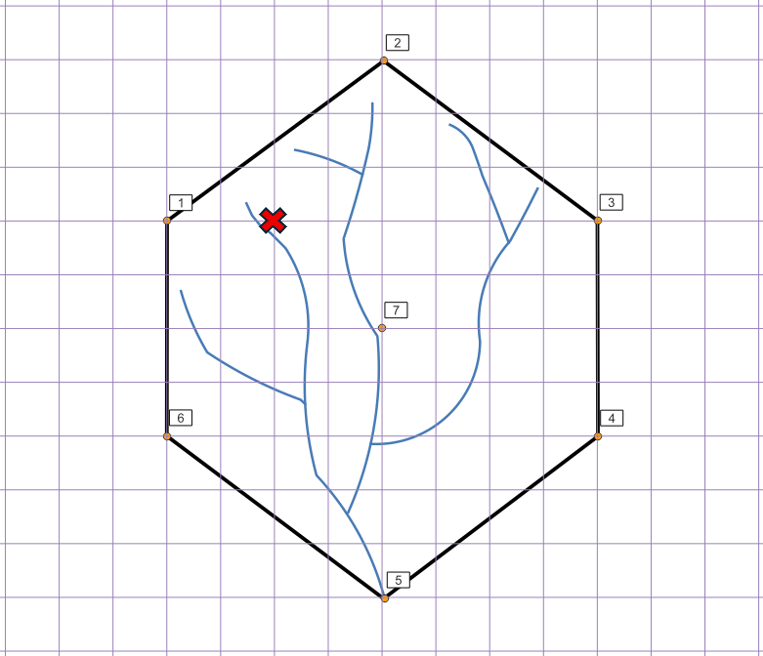

```

La cuadrícula que se muestra en la figura anterior tiene cuadrados con lados de 1 km y área de 1 $km^2$. En el mapa se muestra la ubicación de 7 estaciones pluviométricas marcadas del 1 al 7. El pluviómetro del punto 5 está ubicado en el punto de control de la cuenca. Adicionalmente, en el siguiente cuadro se muestran sus correspondientes valores de precipitación promedio multianual de los últimos 25 años.

```{r error=FALSE}
#| label: tbl-precip-promedio-multianual
#| tbl-cap: "Datos de precipitación promedio multianual."
#| echo: false
#| message: false
#| warning: false

library(tibble)
library(kableExtra)

tabla_precip <- tribble(
  ~Estación, ~`P (mm)`,
  1, 1500,
  2, 2200,
  3, 1100,
  4, 1750,
  5, 1600,
  6,  800,
  7, 1200
)

tabla_precip %>%
  kbl(
    booktabs = TRUE,
    align = c("c", "c"),
    format = "html",
    col.names = c("Estación", "Precipitación promedio anual (mm)")
  ) %>%
  kable_classic(html_font = "Latin Modern Roman") %>%
  kable_styling(
    full_width = FALSE,
    bootstrap_options = c("hover", "condensed")
  ) %>%
  row_spec(0, bold = TRUE)

```

Para la cuenca mostrada, estime y documente detalladamente la **memoria de cálculo** de los siguientes procedimientos hidrológicos, utilizando la información de precipitación promedio multianual presentada en el cuadro anterior:

a) **Método de las isoyetas**  
   Estime y trace las isoyetas resultantes de la distribución espacial de la precipitación sobre la cuenca. A partir de ellas, calcule la precipitación media anual sobre el área de drenaje (puede aproximar el área entre curvas a partir del conteo de cuadrículas).

b) **Método del inverso del cuadrado de la distancia (IDW)**  
   Estime la precipitación media anual en el punto X, donde no existen mediciones directas de lluvia, utilizando como referencia las estaciones pluviométricas disponibles.

c) **Método de los polígonos de Thiessen**  
   Construya los polígonos de Thiessen asociados a la red de estaciones pluviométricas y determine la precipitación media anual sobre la cuenca mediante un promedio ponderado por áreas de influencia.


::: 

La construcción de los métodos descritos anteriormente no suele hacerse de manera manual dentro de la práctica profesional, sino que es muy común utilizar Sistemas de Información Geográfica (SIG) para el desarollo de estos insumos. Una pequeña guía para la construcción de estos elementos, aplicando (SIG) se muestra a continuación:


<iframe width="650" height="515"
  src="https://www.youtube.com/embed/Te5QsFMGFuY"
  title="YouTube video player"
  frameborder="1"
  allow="accelerometer; autoplay; clipboard-write; encrypted-media; gyroscope; picture-in-picture; web-share"
  allowfullscreen>
</iframe>

