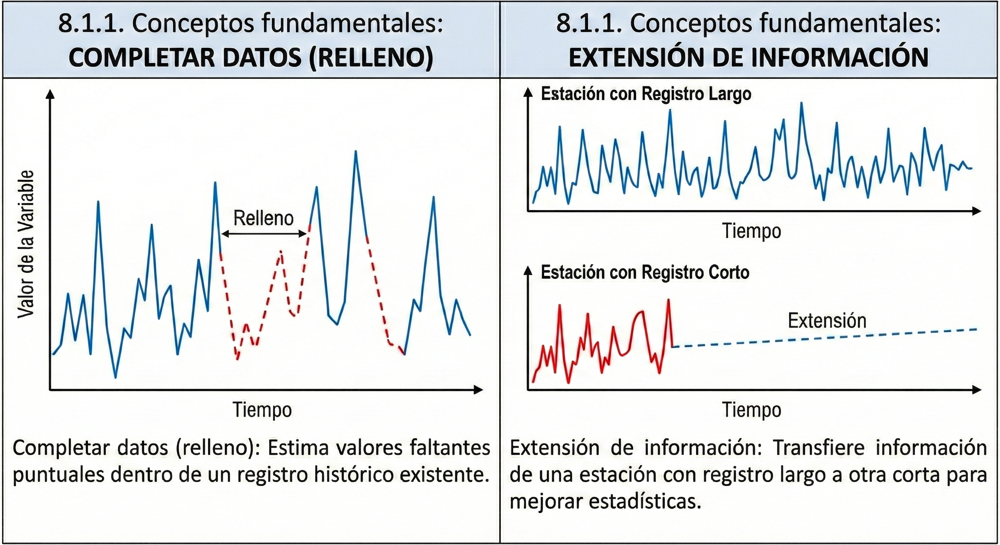
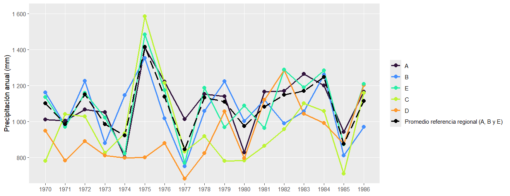
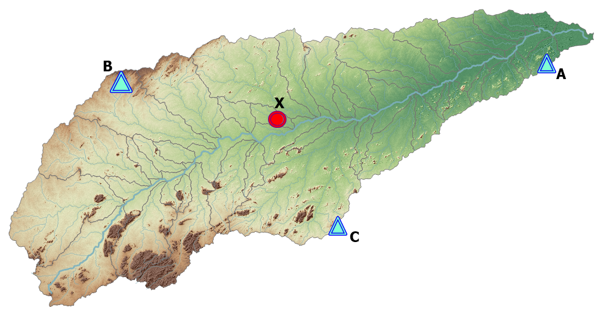
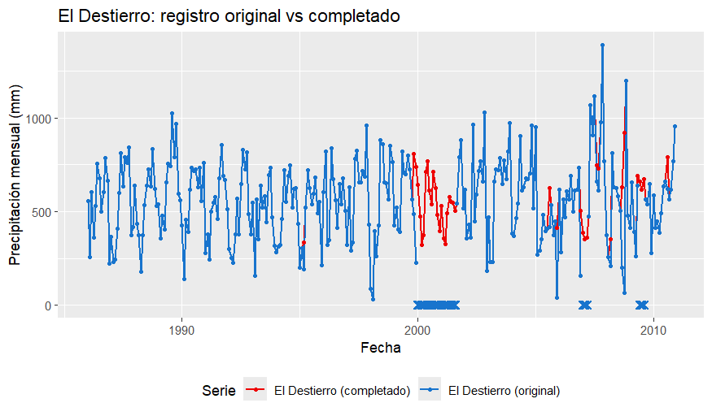
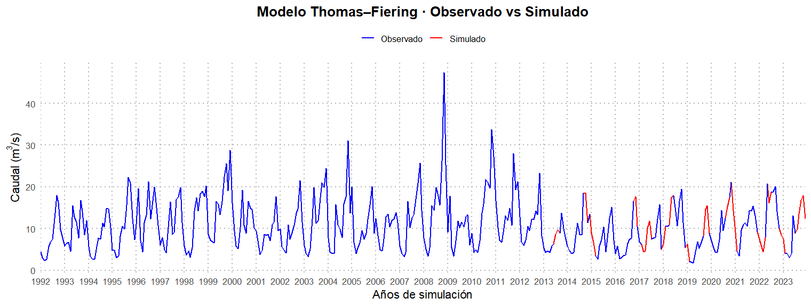

::: {.quote-block}
“Lo que no se define no se puede medir. Lo que no se mide, no se puede mejorar. Lo que no se mejora, se degrada siempre.”\
— *Lord Kelvin (físico e ingeniero)*
:::

En la práctica de la hidrología, es sumamente común enfrentarse a registros de precipitación o caudales que presentan interrupciones o “huecos” temporales. Estas lagunas en la información pueden deberse a múltiples factores, como la falla de instrumental, la ausencia o negligencia del observador, el vandalismo o la pérdida accidental de archivos digitales. Dado que la mayoría de los modelos de simulación y análisis de frecuencias requieren series continuas, el hidrólogo o hidróloga debe ser capaz de procesar, derivar y generar la información faltante mediante métodos estadísticamente robustos.

## Conceptos fundamentales: extensión vs. relleno

Es fundamental establecer una distinción técnica entre dos procesos que, aunque relacionados, persiguen objetivos distintos:

- **Completar datos (relleno):** Proceso mediante el cual se estiman valores faltantes puntuales dentro de un registro histórico existente.
- **Extensión de información:** Procedimiento orientado a transferir información desde una estación con un registro largo hacia otra con un registro corto, con el fin de mejorar la estimación de parámetros estadísticos poblacionales como la media y la varianza.

```{r}
#| label: fig-datos
#| fig-cap: "Ejemplo de completado y extensión de registro de datos."
#| fig-align: center
#| out-width: 100%
#| echo: false
#| class: fig-border



```

## Verificación de la calidad: homogeneidad y consistencia

Antes de proceder a la estimación de datos faltantes, es indispensable realizar un control de calidad riguroso, bajo la premisa de que <span class="firebrick"><strong>no tener datos es preferible a tener datos incorrectos</strong></span>. Una serie se considera homogénea cuando todos sus valores pertenecen a una misma población estadística, es decir, cuando su media permanece invariante en el tiempo.

Las causas más frecuentes de pérdida de homogeneidad no están asociadas al clima, sino a factores externos como la reubicación de estaciones, cambios en el entorno inmediato (urbanización, crecimiento de vegetación cercana), modificaciones en el instrumental o errores de calibración. 

## El análisis de doble masa

El método más utilizado para verificar la consistencia interna de una serie hidrometeorológica es el análisis de doble masa. Este procedimiento gráfico compara la precipitación (o caudal) acumulada de la estación en estudio contra el promedio acumulado de un conjunto de estaciones vecinas consideradas confiables.

- **Interpretación:** Una relación lineal con pendiente constante indica consistencia. Un cambio abrupto en la pendiente revela una inconsistencia en el registro.
- **Ajuste:** La porción inconsistente puede corregirse multiplicando los valores afectados por un factor de ajuste $F_a$, definido como la razón entre la pendiente del período reciente y la del período anterior.

**Procedimiento de construcción**

La curva de doble masa se construye con base en acumulados:

- Se selecciona un conjunto de estaciones de referencia (idealmente 2 o más) dentro de la misma región climática y con registros confiables.
- Se calculan acumulados para el periodo de análisis:
  - $Y$: acumulado de la estación en estudio.
  - $X$: acumulado del promedio (o suma) de las estaciones de referencia.
- Se grafica $Y$ (ordenadas) contra $X$ (abscisas).

- Línea recta (pendiente aproximadamente constante): registro consistente.
- Quiebre o cambio de pendiente: evidencia de inconsistencia (*break point*).

Si existe un quiebre y se desea homogeneizar el periodo antiguo para hacerlo comparable con el periodo reciente, se utiliza un factor de ajuste:

$$
F_a = \frac{M_a}{M_o}
$$

donde:

- $M_a$: pendiente del periodo consistente.
- $M_o$: pendiente del periodo a corregir.

La corrección se aplica a los datos del periodo antiguo:

$$
P_{aj} = F_a \cdot P_o
$$

Si una estación fue reubicada en un año dado, el análisis puede revelar dos pendientes distintas. Un valor $F_a > 1$ indica subestimación del periodo antiguo respecto al reciente; un valor $F_a < 1$ indica sobreestimación.

::: {.callout-note title="Ejemplo"}

Se dispone de una serie anual de precipitación $P_y$ (estación en estudio) y de un promedio regional $P_x$ (promedio de estaciones vecinas). La estación fue reubicada en el año 1980, lo que provocó un cambio sistemático en la captación. Se pide:

1. Construir la curva de doble masa (acumulados Y vs X).
2. Identificar el quiebre (aquí se asume conocido: 1980).
3. Estimar pendientes antes y después del quiebre.
4. Calcular el factor de ajuste F_a y corregir el periodo antiguo.
5. Mostrar gráficamente la mejora (antes vs después).


```{r echo=FALSE, message=FALSE, warning=FALSE, error=FALSE}
# Paquetes
library(dplyr)
library(ggplot2)
library(tidyr)
library(tibble)
library(kableExtra)

# ------------------------------------------------------------
# 1) Datos simulados (controlados para docencia)
# ------------------------------------------------------------
set.seed(123)

anios <- 1960:2010
n <- length(anios)

# Promedio regional anual (X): variabilidad climática interanual razonable
Px <- pmax(0, rnorm(n, mean = 2000, sd = 250))  # mm/año (solo ejemplo)

# Estación en estudio (Y): proporcional a X, pero con cambio de pendiente antes de 1980
anio_quiebre <- 1980

# Pendientes "verdaderas" (para simulación):
M_o_true <- 0.63
M_a_true <- 0.83

# Ruido observacional (mantener varianza realista)
eps <- rnorm(n, mean = 0, sd = 80)

Py <- ifelse(
  anios < anio_quiebre,
  M_o_true * Px + eps,
  M_a_true * Px + eps
)

Py <- pmax(0, Py)

datos <- tibble(
  Anio = anios,
  Px = Px,
  Py = Py,
  Periodo = if_else(Anio < anio_quiebre, "Antiguo", "Reciente")
) %>%
  mutate(
    X_acum = cumsum(Px),
    Y_acum = cumsum(Py)
  )

# ------------------------------------------------------------
# 2) Estimación de pendientes antes y después del quiebre
# ------------------------------------------------------------
datos_antiguo  <- filter(datos, Anio < anio_quiebre)
datos_reciente <- filter(datos, Anio >= anio_quiebre)

fit_antiguo  <- lm(Y_acum ~ 0 + X_acum, data = datos_antiguo)
fit_reciente <- lm(Y_acum ~ 0 + X_acum, data = datos_reciente)

M_o <- unname(coef(fit_antiguo)[1])
M_a <- unname(coef(fit_reciente)[1])

# Factor de ajuste para llevar el periodo antiguo a la escala del periodo reciente
F_a <- M_a / M_o

# ------------------------------------------------------------
# 3) Aplicación de la corrección sobre los datos del periodo antiguo
# ------------------------------------------------------------
datos_aj <- datos %>%
  mutate(
    Py_aj = if_else(Anio < anio_quiebre, F_a * Py, Py),
    Yacum_aj = cumsum(Py_aj)
  )

# ------------------------------------------------------------
# 4) Resultados numéricos (resumen)
# ------------------------------------------------------------
resumen <- tibble(
  `Año de quiebre` = anio_quiebre,
  `Pendiente periodo antiguo (M_o)` = round(M_o, 3),
  `Pendiente periodo reciente (M_a)` = round(M_a, 3),
  `Factor de ajuste (F_a = M_a/M_o)` = round(F_a, 3)
)

resumen %>%
  kbl(
    booktabs = TRUE,
    align = "c",
    format = "html",
    escape = FALSE,
    col.names = c(
  "Año de quiebre",
  "Pendiente periodo antiguo (Mₒ)",
  "Pendiente periodo reciente (Mₐ)",
  "Factor de ajuste (Fₐ = Mₐ / Mₒ)"
)
  ) %>%
  kable_classic(html_font = "Latin Modern Roman") %>%
  kable_styling(
    full_width = FALSE,
    bootstrap_options = c("hover", "condensed")
  ) %>%
  row_spec(0, bold = TRUE)
```


```{r echo=FALSE, warning=FALSE, message=FALSE}
# ------------------------------------------------------------
# 6) Gráfica 2: Comparación antes vs después del ajuste
#     con diferenciación de color antes y después del quiebre
# ------------------------------------------------------------

datos_plot <- datos_aj %>%
  mutate(
    Tramo = if_else(Anio < anio_quiebre, "Antes del quiebre", "Después del quiebre")
  ) %>%
  transmute(
    Anio,
    X_acum,
    Y_original = Y_acum,
    Y_ajustado = Yacum_aj,
    Tramo
  ) %>%
  tidyr::pivot_longer(
    cols = c(Y_original, Y_ajustado),
    names_to = "Serie",
    values_to = "Y"
  ) %>%
  mutate(
    Serie = recode(
      Serie,
      Y_original = "Original",
      Y_ajustado = "Ajustada"
    )
  )

g2 <- ggplot() +
  # Serie original antes del quiebre
  geom_line(
    data = filter(datos_plot, Serie == "Original", Tramo == "Antes del quiebre"),
    aes(x = X_acum, y = Y, color = Tramo),
    linewidth = 0.8
  ) +
  # Serie original después del quiebre
  geom_line(
    data = filter(datos_plot, Serie == "Original", Tramo == "Después del quiebre"),
    aes(x = X_acum, y = Y, color = Tramo),
    linewidth = 0.8
  ) +
  # Serie ajustada (color neutro)
  geom_line(
    data = filter(datos_plot, Serie == "Ajustada"),
    aes(x = X_acum, y = Y),
    linewidth = 0.8,
    linetype = "dashed"
  ) +
  scale_color_manual(
    values = c(
      "Antes del quiebre" = "#1f78b4",
      "Después del quiebre" = "#e31a1c"
    )
  ) +
  labs(
    x = "Acumulado regional, X (mm)",
    y = "Acumulado estación, Y (mm)",
    color = NULL
  ) +
  theme_minimal(base_family = "serif")

print(g2)

```

::: 

**Limitaciones**

- La detección visual del quiebre puede ser subjetiva si el cambio es gradual.
- El método requiere una referencia regional estable; si todas las estaciones cambiaron simultáneamente, el diagnóstico se complica.
- Se recomienda aplicar el método en agregaciones anuales o estacionales, donde la variabilidad natural diaria no oculte los cambios de pendiente.

En un análisis de doble masa, una vez identificado un posible quiebre en la pendiente de la curva acumulada, es indispensable verificar estadísticamente si dicho cambio visual corresponde a una alteración real del comportamiento del registro o si puede atribuirse únicamente a la variabilidad natural de los datos. Para ello se aplican pruebas de estabilidad de la media y de la varianza, comparando los dos tramos definidos por el punto de quiebre.

El registro se divide en dos subconjuntos temporales claramente definidos:

- Tramo I: periodo previo al quiebre.
- Tramo II: periodo posterior al quiebre.

Para cada tramo se calculan estadísticas descriptivas básicas, tales como la media, la desviación estándar y el número de datos. Estas medidas permiten caracterizar tanto el nivel promedio de la variable hidrológica como su dispersión interna en cada periodo. Diferencias apreciables entre estos estadísticos constituyen una primera señal de posible inconsistencia, pero deben evaluarse formalmente mediante pruebas estadísticas.

**Prueba de estabilidad de la media (prueba t)**

El objetivo de esta prueba es evaluar si las medias de ambos tramos pueden considerarse estadísticamente iguales.

- Hipótesis nula $(H_0)$: la media del Tramo I es igual a la media del Tramo II.  
- Hipótesis alternativa $(H_1)$: las medias son diferentes.

La estadística $t$ se calcula a partir de la diferencia entre las medias de ambos tramos, normalizada por la variabilidad y el tamaño muestral. El valor absoluto de t calculado se compara con el valor crítico de la distribución t para un nivel de significancia usual del 5 %.

- Si $|t_{calc}| ≤ t_{crit}$, no se detecta un cambio significativo en la media.
- Si $|t_{calc}| > t_{crit}$, existe una diferencia estadísticamente significativa en la media.

Cuando el valor calculado supera el valor crítico, se concluye que el nivel promedio del registro cambió de forma significativa entre ambos tramos, lo cual respalda la presencia de una inconsistencia real en el registro.

**Prueba de estabilidad de la varianza (prueba F)**

Además del nivel medio, es fundamental evaluar si la variabilidad del registro se mantiene constante en el tiempo.

- Hipótesis nula $(H_0)$: las varianzas de ambos tramos son iguales.  
- Hipótesis alternativa $(H_1)$: las varianzas son diferentes.

La prueba F compara la razón entre las varianzas de los dos tramos. El valor F calculado se contrasta con el valor crítico de la distribución F para el nivel de significancia seleccionado.

- Si $F_{calc} ≤ F_{crit}$, se asume homogeneidad de varianzas.
- Si $F_{calc} > F_{crit}$, se concluye que existe una diferencia significativa en la varianza.

Una diferencia significativa en la varianza indica que la dispersión de los datos también cambió entre periodos, reforzando la evidencia de heterogeneidad.

En el contexto del análisis de doble masa, **no es necesario que ambas pruebas (media y varianza) detecten diferencias significativas para justificar la corrección del registro**. Basta con que **una sola de ellas evidencie inestabilidad estadística** para concluir que la serie no es homogénea y que debe ajustarse.

Desde el punto de vista hidrológico y estadístico, el criterio se resume así:

- <u>Si la prueba de la media es significativa</u>:  
  Existe un cambio en el nivel promedio del registro. Esto implica que la estación comenzó a medir sistemáticamente más o menos lluvia/caudal que antes, lo cual es una inconsistencia clara.

- <u>Si la prueba de la varianza es significativa</u>:  
  Aunque la media sea similar, la dispersión cambió. Esto indica que la respuesta del sistema o del instrumento es diferente entre periodos (mayor o menor variabilidad), lo cual también rompe la homogeneidad.

En ambos casos, el registro deja de pertenecer a una única población estadística, por lo que <span class="firebrick"><strong>no es válido para análisis hidrológicos sin corrección</strong></span>.

La regla aceptada y aplicada en manuales y práctica profesional es:

> *Si al menos una de las pruebas (media o varianza) rechaza la hipótesis de homogeneidad, el registro debe corregirse mediante el análisis de doble masa.*


Cuando las pruebas estadísticas confirman inestabilidad, el registro debe corregirse antes de ser utilizado en análisis de frecuencia, estimación de eventos extremos o modelación hidrológica. El ajuste mediante un factor de corrección derivado de las pendientes de la curva de doble masa permite homogeneizar la serie y garantizar su consistencia interna.

De esta forma, las pruebas estadísticas transforman una observación gráfica en una decisión técnica objetiva, fortaleciendo la confiabilidad de los análisis hidrológicos posteriores.

::: {.callout-note title="Ejemplo"}

```{r}
#| label: tbl-Registro
#| tbl-cap: "Registro de precipitación total multianual (mm)."
#| echo: false
#| message: false
#| warning: false

library(dplyr)
library(tibble)
library(kableExtra)

tabla_precip <- tribble(
  ~Año,  ~A,      ~B,      ~C,      ~D,      ~E,
  1970L, 1010,    1161,     780,     949,    1135,
  1971L, 1005,     978,    1041,     784,     970,
  1972L, 1067,    1226,    1027,     890,    1158,
  1973L, 1051,     880,     825,     810,    1022,
  1974L,  801,    1146,     933,     798,     821,
  1975L, 1411,    1353,    1584,     801,    1483,
  1976L, 1222,    1018,    1215,     880,    1174,
  1977L, 1012,     751,     832,     683,     771,
  1978L, 1153,    1059,     918,     824,    1188,
  1979L, 1140,    1223,     781,    1056,     967,
  1980L,  829,    1003,     782,     796,    1088,
  1981L, 1165,    1120,     865,    1121,     963,
  1982L, 1170,     989,     956,    1286,    1287,
  1983L, 1264,    1056,    1102,    1044,    1190,
  1984L, 1200,    1261,    1058,     991,    1283,
  1985L,  942,     811,     710,     875,     873,
  1986L, 1166,     969,    1158,    1202,    1209
) %>%
  mutate(Año = as.character(Año))

resumen_stats <- tribble(
  ~Año,         ~A,       ~B,       ~C,      ~D,      ~E,
  "Media",      1094.59,  1059.06,   974.53,  928.82, 1093.06,
  "Desv. Est.",  154.5,    161.3,    214.4,   165.3,  185.3
)

tabla_final <- bind_rows(tabla_precip, resumen_stats)

tabla_final %>%
  kbl(
    booktabs = TRUE,
    align = c("c", rep("c", 5)),
    format = "html",
    escape = FALSE,
    col.names = c("Año", "A", "B", "C", "D", "E")
  ) %>%
  kable_classic(html_font = "Latin Modern Roman") %>%
  kable_styling(
    full_width = FALSE,
    bootstrap_options = c("hover", "condensed")
  ) %>%
  row_spec(0, bold = TRUE) %>%
  row_spec(nrow(tabla_final) - 1, bold = TRUE) %>%
  row_spec(nrow(tabla_final), bold = TRUE)%>%
  add_header_above(c(" ", "Precipitación anual (mm)" = 5))


```

Con base en los registros de precipitación anual mostrados en la tabla anterior, se solicita evaluar la consistencia y homogeneidad de una de las estaciones pluviométricas mediante el análisis de doble masa. Parea esto y tomando como casos de análisis las estaciones C y D compare su precipitación acumulada con el promedio acumulado de las demás estaciones consideradas como referencia regional (A, B y E).

El análisis debe incluir:

1. La construcción de la curva de doble masa (precipitación acumulada de la estación vs. precipitación acumulada regional).
2. La identificación de posibles cambios de pendiente que indiquen inconsistencias en el registro.
3. La aplicación de pruebas estadísticas de estabilidad de la media y la varianza entre los periodos definidos.
4. La determinación y aplicación del factor de ajuste correspondiente, en caso de detectarse inconsistencias.
5. La interpretación hidrológica de los resultados obtenidos y su impacto en el uso del registro para análisis posteriores.

Justifique cada etapa del procedimiento con base en criterios hidrológicos y estadísticos.

La gráfica de series anuales permite una inspección preliminar de consistencia:

i) ayuda a detectar años atípicos (picos o caídas abruptas) compartidos por varias estaciones (señal climática regional) versus discrepancias aisladas en una estación (posible problema de medición).

ii) orienta la selección de periodos candidatos a quiebre antes de aplicar formalmente la curva de doble masa.

iii) facilita verificar si C y D mantienen una variabilidad comparable a la referencia regional (A, B y E).


```{r echo=FALSE, warning=FALSE, message=FALSE, error=FALSE, eval=FALSE}
# Paquetes
library(dplyr)
library(tidyr)
library(ggplot2)
library(scales)
library(viridis)
#Sys.setlocale("LC_CTYPE", "spanish")
# ------------------------------------------------------------
# 1) Datos
# ------------------------------------------------------------
tabla_precip <- tibble::tribble(
  ~Año,  ~A,   ~B,   ~C,   ~D,   ~E,
  1970L, 1010, 1161,  780,  949, 1135,
  1971L, 1005,  978, 1041,  784,  970,
  1972L, 1067, 1226, 1027,  890, 1158,
  1973L, 1051,  880,  825,  810, 1022,
  1974L,  801, 1146,  933,  798,  821,
  1975L, 1411, 1353, 1584,  801, 1483,
  1976L, 1222, 1018, 1215,  880, 1174,
  1977L, 1012,  751,  832,  683,  771,
  1978L, 1153, 1059,  918,  824, 1188,
  1979L, 1140, 1223,  781, 1056,  967,
  1980L,  829, 1003,  782,  796, 1088,
  1981L, 1165, 1120,  865, 1121,  963,
  1982L, 1170,  989,  956, 1286, 1287,
  1983L, 1264, 1056, 1102, 1044, 1190,
  1984L, 1200, 1261, 1058,  991, 1283,
  1985L,  942,  811,  710,  875,  873,
  1986L, 1166,  969, 1158, 1202, 1209
)

# ------------------------------------------------------------
# 2) Formato largo
# ------------------------------------------------------------
datos_long <- tabla_precip %>%
  pivot_longer(
    cols = c(A, B, C, D, E),
    names_to = "Estacion",
    values_to = "P_mm"
  ) %>%
  mutate(
    Año = as.integer(Año),
    Estacion = factor(Estacion, levels = c("A", "B", "C", "D", "E")),
    Grupo = case_when(
      Estacion %in% c("C", "D") ~ "Estaciones en evaluación",
      TRUE ~ "Referencia regional"
    )
  )

# ------------------------------------------------------------
# Serie regional + estaciones individuales A, B, C, D y E
# (con promedio regional explícito y líneas A, B y E visibles)
# ------------------------------------------------------------

ref_completa <- tabla_precip %>%
  transmute(
    Año = as.integer(Año),
    A = A,
    B = B,
    C = C,
    D = D,
    E = E,
    `Promedio referencia regional (A, B y E)` = (A + B + E) / 3
  ) %>%
  pivot_longer(
    cols = -Año,
    names_to = "Serie",
    values_to = "P_mm"
  ) %>%
  mutate(
    Serie = factor(
      Serie,
      levels = c(
        "A", "B", "E",
        "C", "D",
        "Promedio referencia regional (A, B y E)"
      )
    )
  )

ggplot(
  ref_completa,
  aes(
    x = Año,
    y = P_mm,
    group = Serie,
    color = Serie,
    linetype = Serie
  )
) +
  geom_line(linewidth = 1.1) +
  geom_point(size = 2.4) +
  scale_color_manual(
    values = c(
      "A" = viridis::viridis(6, option = "H", end = 0.9)[1],
      "B" = viridis::viridis(6, option = "H", end = 0.9)[2],
      "E" = viridis::viridis(6, option = "H", end = 0.9)[3],
      "C" = viridis::viridis(6, option = "H", end = 0.9)[4],
      "D" = viridis::viridis(6, option = "H", end = 0.9)[5],
      "Promedio referencia regional (A, B y E)" = "black"
    )
  ) +
  scale_linetype_manual(
    values = c(
      "A" = "solid",
      "B" = "solid",
      "E" = "solid",
      "C" = "solid",
      "D" = "solid",
      "Promedio referencia regional (A, B y E)" = "longdash"
    )
  ) +
  scale_x_continuous(
    breaks = seq(min(tabla_precip$Año), max(tabla_precip$Año), by = 1)
  ) +
  scale_y_continuous(
    labels = label_number(accuracy = 1),
    expand = expansion(mult = c(0.03, 0.08))
  ) +
  labs(
    x = NULL,
    y = "Precipitación anual (mm)",
    color = NULL,
    linetype = NULL
  ) +
  theme(
    panel.grid.minor = element_blank(),
    legend.position = "right"
  )

```


```{r}
#| label: fig-plot
#| fig-cap: "Series de precipitación anual para cada una de las estaciones."
#| fig-align: center
#| out-width: 100%
#| echo: false
#| class: fig-border



```

Adicionalmente, se analizan el comportamiento entre estaciones. Esto se hace por medio del análisis del coeficiente de determinación $R^2$ y de construcción de matrices de correlación.

```{r echo=FALSE, warning=FALSE, message=FALSE, error=FALSE}
#| label: fig-plot2
#| fig-cap: "Gráficas de dispersión entre estaciones."
# Paquetes
library(dplyr)
library(tidyr)
library(ggplot2)
library(scales)
library(patchwork)

# ------------------------------------------------------------
# 1) Datos (mismos de tu tabla)
# ------------------------------------------------------------
tabla_precip <- tibble::tribble(
  ~Año,  ~A,   ~B,   ~C,   ~D,   ~E,
  1970L, 1010, 1161,  780,  949, 1135,
  1971L, 1005,  978, 1041,  784,  970,
  1972L, 1067, 1226, 1027,  890, 1158,
  1973L, 1051,  880,  825,  810, 1022,
  1974L,  801, 1146,  933,  798,  821,
  1975L, 1411, 1353, 1584,  801, 1483,
  1976L, 1222, 1018, 1215,  880, 1174,
  1977L, 1012,  751,  832,  683,  771,
  1978L, 1153, 1059,  918,  824, 1188,
  1979L, 1140, 1223,  781, 1056,  967,
  1980L,  829, 1003,  782,  796, 1088,
  1981L, 1165, 1120,  865, 1121,  963,
  1982L, 1170,  989,  956, 1286, 1287,
  1983L, 1264, 1056, 1102, 1044, 1190,
  1984L, 1200, 1261, 1058,  991, 1283,
  1985L,  942,  811,  710,  875,  873,
  1986L, 1166,  969, 1158, 1202, 1209
)

# ------------------------------------------------------------
# 2) Función auxiliar: ecuación + R2 para anotar en el gráfico
# ------------------------------------------------------------
etiqueta_lm <- function(fit) {
  cf <- coef(fit)
  r2 <- summary(fit)$r.squared
  paste0(
    "y = ", round(cf[2], 4), "x + ", round(cf[1], 2), "\n",
    "R² = ", round(r2, 4)
  )
}

# ------------------------------------------------------------
# 3) Gráfico 1: Dispersión E vs A + recta de regresión
# ------------------------------------------------------------
fit_E_A <- lm(E ~ A, data = tabla_precip)
lab_E_A <- etiqueta_lm(fit_E_A)

g_E_A <- ggplot(tabla_precip, aes(x = A, y = E)) +
  geom_point(size = 2.6, alpha = 0.95) +
  geom_smooth(method = "lm", se = FALSE, linewidth = 1.0) +
  annotate(
    geom = "text",
    x = Inf, y = -Inf,
    label = lab_E_A,
    hjust = 1.05, vjust = -0.35,
    size = 4.0,
    family = "serif"
  ) +
  scale_x_continuous(
    limits = c(0, 1600),
    breaks = seq(0, 1600, by = 200),
    minor_breaks = seq(0, 1600, by = 50)
  ) +
  scale_y_continuous(
    limits = c(0, 1600),
    breaks = seq(0, 1600, by = 200),
    minor_breaks = seq(0, 1600, by = 50)
  ) +
  labs(
    x = "P anual (mm) - Estación A",
    y = "P anual (mm) - Estación E"
  ) +
  theme_bw(base_family = "serif") +
  theme(
    panel.grid.major = element_line(linewidth = 0.4),
    panel.grid.minor = element_line(linewidth = 0.25),
    plot.margin = margin(8, 10, 8, 8)
  )

# ------------------------------------------------------------
# 4) Gráfico 2: Dispersión D vs C + recta de regresión
# ------------------------------------------------------------
fit_D_C <- lm(D ~ C, data = tabla_precip)
lab_D_C <- etiqueta_lm(fit_D_C)

g_D_C <- ggplot(tabla_precip, aes(x = C, y = D)) +
  geom_point(size = 2.6, alpha = 0.95) +
  geom_smooth(method = "lm", se = FALSE, linewidth = 1.0) +
  annotate(
    geom = "text",
    x = Inf, y = -Inf,
    label = lab_D_C,
    hjust = 1.05, vjust = -0.35,
    size = 4.0,
    family = "serif"
  ) +
  scale_x_continuous(
    limits = c(0, 2000),
    breaks = seq(0, 2000, by = 200),
    minor_breaks = seq(0, 2000, by = 50)
  ) +
  scale_y_continuous(
    limits = c(0, 1400),
    breaks = seq(0, 1400, by = 200),
    minor_breaks = seq(0, 1400, by = 50)
  ) +
  labs(
    x = "P anual (mm) - Estación C",
    y = "P anual (mm) - Estación D"
  ) +
  theme_bw(base_family = "serif") +
  theme(
    panel.grid.major = element_line(linewidth = 0.4),
    panel.grid.minor = element_line(linewidth = 0.25),
    plot.margin = margin(8, 10, 8, 8)
  )

# ------------------------------------------------------------
# 5) Mostrar ambas gráficas lado a lado (tipo Excel)
# ------------------------------------------------------------
(g_E_A | g_D_C)
```


```{r echo=FALSE, warning=FALSE, message=FALSE, error=FALSE}
#| label: fig-plot3
#| fig-cap: "Matriz de correlación entre estaciones."
# ------------------------------------------------------------
# 6) (Opcional) Corrplot: correlaciones entre A, B, C, D, E
# ------------------------------------------------------------
library(corrplot)

M <- tabla_precip %>%
  select(A, B, C, D, E) %>%
  cor(use = "pairwise.complete.obs", method = "pearson")

corrplot(
  M,
  method = "color",
  type = "upper",
  addCoef.col = "black",
  number.cex = 0.8,
  tl.col = "black",
  tl.srt = 0
)

```


Ahora se generan las curvas de precipitación acumulada de cada una de las estaciones.

```{r}
#| label: tbl-precip-acumulada
#| tbl-cap: "Precipitación anual acumulada por estación y promedio regional (mm)."
#| echo: false
#| message: false
#| warning: false

library(dplyr)
library(tibble)
library(kableExtra)

tabla_acum <- tribble(
  ~Año,  ~A,    ~B,    ~C,    ~D,    ~E,    ~Promedio,
  1970L,  1010,  1161,   780,   949,  1135,  1007.0,
  1971L,  2015,  2139,  1821,  1733,  2105,  1962.6,
  1972L,  3082,  3365,  2848,  2623,  3263,  3036.2,
  1973L,  4133,  4245,  3673,  3433,  4285,  3953.8,
  1974L,  4934,  5391,  4606,  4231,  5106,  4853.6,
  1975L,  6345,  6744,  6190,  5032,  6589,  6180.0,
  1976L,  7567,  7762,  7405,  5912,  7763,  7281.8,
  1977L,  8579,  8513,  8237,  6595,  8534,  8091.6,
  1978L,  9732,  9572,  9155,  7419,  9722,  9120.0,
  1979L, 10872, 10795,  9936,  8475, 10689, 10153.4,
  1980L, 11701, 11798, 10718,  9271, 11777, 11053.0,
  1981L, 12866, 12918, 11583, 10392, 12740, 12099.8,
  1982L, 14036, 13907, 12539, 11678, 14027, 13237.4,
  1983L, 15300, 14963, 13641, 12722, 15217, 14368.6,
  1984L, 16500, 16224, 14699, 13713, 16500, 15527.2,
  1985L, 17442, 17035, 15409, 14588, 17373, 16369.4,
  1986L, 18608, 18004, 16567, 15790, 18582, 17510.2
) %>%
  mutate(Año = as.character(Año))

tabla_acum %>%
  kbl(
    booktabs = TRUE,
    align = c("c", rep("c", 6)),
    format = "html",
    escape = FALSE,
    col.names = c("Año", "A", "B", "C", "D", "E", "Promedio")
  ) %>%
  kable_classic(html_font = "Latin Modern Roman") %>%
  kable_styling(
    full_width = FALSE,
    bootstrap_options = c("hover", "condensed")
  ) %>%
  row_spec(0, bold = TRUE) %>%
  add_header_above(c(" " = 1, "Precipitación anual acumulada (mm)" = 6))
```

```{r echo=FALSE, warning=FALSE, message=FALSE, error=FALSE}
#| label: fig-plot4
#| fig-cap: "Curvas de masa de las estaciones."
library(dplyr)
library(tidyr)
library(ggplot2)
library(scales)
tabla_acum <- tribble(
  ~Año,  ~A,    ~B,    ~C,    ~D,    ~E,    ~Promedio,
  1970L,  1010,  1161,   780,   949,  1135,  1007.0,
  1971L,  2015,  2139,  1821,  1733,  2105,  1962.6,
  1972L,  3082,  3365,  2848,  2623,  3263,  3036.2,
  1973L,  4133,  4245,  3673,  3433,  4285,  3953.8,
  1974L,  4934,  5391,  4606,  4231,  5106,  4853.6,
  1975L,  6345,  6744,  6190,  5032,  6589,  6180.0,
  1976L,  7567,  7762,  7405,  5912,  7763,  7281.8,
  1977L,  8579,  8513,  8237,  6595,  8534,  8091.6,
  1978L,  9732,  9572,  9155,  7419,  9722,  9120.0,
  1979L, 10872, 10795,  9936,  8475, 10689, 10153.4,
  1980L, 11701, 11798, 10718,  9271, 11777, 11053.0,
  1981L, 12866, 12918, 11583, 10392, 12740, 12099.8,
  1982L, 14036, 13907, 12539, 11678, 14027, 13237.4,
  1983L, 15300, 14963, 13641, 12722, 15217, 14368.6,
  1984L, 16500, 16224, 14699, 13713, 16500, 15527.2,
  1985L, 17442, 17035, 15409, 14588, 17373, 16369.4,
  1986L, 18608, 18004, 16567, 15790, 18582, 17510.2
) %>%
  mutate(Año = as.character(Año))
# ------------------------------------------------------------
# Curva regional (eje X): promedio acumulado de todas las estaciones (A–E)
# Curvas (eje Y): acumulado por estación (A, B, C, D, E)
# ------------------------------------------------------------
tabla_x <- tabla_acum %>%
  transmute(
    Año = as.integer(Año),
    X_prom_todas = (A + B + C + D + E) / 5
  )

tabla_y <- tabla_acum %>%
  transmute(
    Año = as.integer(Año),
    A, B, C, D, E
  ) %>%
  pivot_longer(
    cols = c(A, B, C, D, E),
    names_to = "Estacion",
    values_to = "Y_acum"
  )

datos_dm <- tabla_y %>%
  left_join(tabla_x, by = "Año") %>%
  mutate(
    Estacion = factor(Estacion, levels = c("A", "B", "C", "D", "E"))
  )

ggplot(datos_dm, aes(x = X_prom_todas, y = Y_acum, color = Estacion, group = Estacion)) +
  geom_line(linewidth = 1.1) +
  geom_point(size = 2.2) +
  scale_x_continuous(
    labels = label_number(accuracy = 1),
    expand = expansion(mult = c(0.03, 0.06))
  ) +
  scale_y_continuous(
    labels = label_number(accuracy = 1),
    expand = expansion(mult = c(0.03, 0.06))
  ) +
  labs(
    x = "Precipitación anual acumulada promedio (mm) - Promedio de todas las estaciones (A–E)",
    y = "Precipitación anual acumulada (mm) - Estación en revisión",
    color = "Estación"
  ) +
  theme(
    panel.grid.minor = element_blank(),
    legend.position = "right"
  )


```


Como se puede observar en la gráfica anterior, las curvas de doble masa de las estaciones C y D son las que presentan mayor variación, por lo tanto, se procede a su análisis.

**Análisis para C**:

```{r}
#| label: tbl-precip-acumulada-patron
#| tbl-cap: "Precipitación anual acumulada por estación y patrón regional (mm)."
#| echo: false
#| message: false
#| warning: false

library(dplyr)
library(tibble)
library(kableExtra)

tabla_anual <- tribble(
  ~Año,  ~A,    ~B,    ~C,    ~D,    ~E,    ~`Patrón`,
  1970L, 1010,  1161,   780,   949,  1135,  1102.0,
  1971L, 1005,   978,  1041,   784,   970,   984.3,
  1972L, 1067,  1226,  1027,   890,  1158,  1150.3,
  1973L, 1051,   880,   825,   810,  1022,   984.3,
  1974L,  801,  1146,   933,   798,   821,   922.7,
  1975L, 1411,  1353,  1584,   801,  1483,  1415.7,
  1976L, 1222,  1018,  1215,   880,  1174,  1138.0,
  1977L, 1012,   751,   832,   683,   771,   844.7,
  1978L, 1153,  1059,   918,   824,  1188,  1133.3,
  1979L, 1140,  1223,   781,  1056,   967,  1110.0,
  1980L,  829,  1003,   782,   796,  1088,   973.3,
  1981L, 1165,  1120,   865,  1121,   963,  1082.7,
  1982L, 1170,   989,   956,  1286,  1287,  1148.7,
  1983L, 1264,  1056,  1102,  1044,  1190,  1170.0,
  1984L, 1200,  1261,  1058,   991,  1283,  1248.0,
  1985L,  942,   811,   710,   875,   873,   875.3,
  1986L, 1166,   969,  1158,  1202,  1209,  1114.7
) %>%
  mutate(Año = as.character(Año))

resumen_stats <- tribble(
  ~Año,         ~A,       ~B,       ~C,      ~D,      ~E,      ~`Patrón`,
  "Media",      1094.59,  1059.06,  974.53,  928.82,  1093.06, 1082.24,
  "Desv. Est.",  154.5,    161.3,    214.4,   165.3,   185.3,   141.2
)

tabla_final <- bind_rows(tabla_anual, resumen_stats)

library(dplyr)
library(kableExtra)

# ---------------------------------------------
# Preparación: colorear SOLO filas 1 a 8 de la columna C
# ---------------------------------------------
tabla_final_fmt <- tabla_final %>%
  mutate(
    C = if_else(
      row_number() %in% 1:8,
      cell_spec(C, background = "#97FFFF"),
      as.character(C)
    )
  )%>%
  mutate(
    C = if_else(
      row_number() %in% 9:17,
      cell_spec(C, background = "#1C86EE"),
      as.character(C)
    )
  )

# ---------------------------------------------
# Tabla final con kableExtra
# ---------------------------------------------
tabla_final_fmt %>%
  kbl(
    booktabs = TRUE,
    align = c("c", rep("c", 6)),
    format = "html",
    escape = FALSE,
    col.names = c("Año", "A", "B", "C", "D", "E", "Patrón (promedio de A, B y E)")
  ) %>%
  kable_classic(html_font = "Latin Modern Roman") %>%
  kable_styling(
    full_width = FALSE,
    bootstrap_options = c("hover", "condensed")
  ) %>%
  add_header_above(c(" " = 1, "Precipitación anual (mm)" = 6)) %>%
  row_spec(0, bold = TRUE) %>%
  row_spec(nrow(tabla_final) - 1, bold = TRUE) %>%
  row_spec(nrow(tabla_final), bold = TRUE)


```

Según la inspección visual, para la estación C el cambio de pendiente ocurre a partir del año 1978. Por lo tanto, se define un Tramo I que va desde 1970 hasta 1977 y un Tramo II que va desde 1978 hasta 1986. A partir de esta información, se realiza el análisis estadístico para determinar la estabilidad de la media y la varianza.


Sea una serie hidrológica dividida en dos periodos (tramos) para evaluar si existe cambio estadísticamente significativo asociado a una posible inconsistencia del registro.

- Tramo I: $n_1$ observaciones $\{x_{1,1},\dots,x_{1,n_1}\}$
- Tramo II: $n_2$ observaciones $\{x_{2,1},\dots,x_{2,n_2}\}$
- Nivel de significancia: $\alpha = 0.05$

- Media muestral

Para cada tramo $k \in \{1,2\}$:

$$
\bar{x}_k=\frac{1}{n_k}\sum_{i=1}^{n_k}x_{k,i}
$$

- Desviación estándar muestral

Para cada tramo $k$:

$$
s_k=\sqrt{\frac{1}{n_k-1}\sum_{i=1}^{n_k}\left(x_{k,i}-\bar{x}_k\right)^2}
$$

**Prueba de estabilidad de la media (t de dos muestras con varianzas iguales)**

Hipótesis:

- $H_0:\ \mu_1=\mu_2$
- $H_1:\ \mu_1\neq\mu_2$ (bilateral)

Se estima una varianza común $S_p^2$ ponderando por grados de libertad:

$$
S_p^2=\frac{(n_1-1)s_1^2+(n_2-1)s_2^2}{n_1+n_2-2}
$$

Luego:

$$
S_p=\sqrt{S_p^2}
$$

- Error estándar de la diferencia de medias

$$
S_d=S_p\sqrt{\frac{1}{n_1}+\frac{1}{n_2}}
$$

- Estadístico de prueba

$$
t_{calc}=\frac{\bar{x}_1-\bar{x}_2}{S_d}
$$

- Grados de libertad y valor crítico

$$
\nu=n_1+n_2-2
$$

- Para prueba bilateral:

$$
t_{\alpha/2,\nu} = t_{(1-\alpha/2,\nu)}
$$

- Regla de decisión:

- Si $|t_{calc}|>t_{\alpha/2,\nu}$, se rechaza $H_0$ (diferencia significativa en la media).
- Si $|t_{calc}|\le t_{\alpha/2,\nu}$, no se rechaza $H_0$.


**Prueba de estabilidad de la varianza (F)**

Hipótesis

- $H_0:\ \sigma_1^2=\sigma_2^2$
- $H_1:\ \sigma_1^2\neq\sigma_2^2$

- Estadístico F (cociente mayor/menor)

Para asegurar $F_{calc}\ge 1$:

$$
F_{calc}=\frac{\max(s_1^2,s_2^2)}{\min(s_1^2,s_2^2)}
$$

Grados de libertad asociados:

- $\nu_1 = (n_{\text{del mayor}}-1)$
- $\nu_2 = (n_{\text{del menor}}-1)$

- Valor crítico (cola superior)

En el esquema tipo hoja de cálculo (comparación por cola superior):

$$
F_{crit}=F_{(1-\alpha;\ \nu_1,\nu_2)}
$$

Regla de decisión:

- Si $F_{calc}>F_{crit}$, se rechaza $H_0$ (varianzas significativamente distintas).
- Si $F_{calc}\le F_{crit}$, no se rechaza $H_0$.

```{r}
#| label: tbl-sec-doble-masa-pruebas
#| tbl-cap: "Estadisticos para Tramo I y Tramo II."
#| echo: false
#| message: false
#| warning: false

library(dplyr)
library(tibble)
library(kableExtra)

# ------------------------------------------------------------
# 1) Definir datos del ejemplo (dos tramos)
#    (ajusta estos vectores por tus datos reales si aplica)
# ------------------------------------------------------------
# Tramo I: n = 8
tramo_I <- c(780, 1041, 1027, 825, 933, 1584, 1215, 832)

# Tramo II: n = 9
tramo_II <- c(918, 781, 782,865,956,1102,1058,710,1158)

# ------------------------------------------------------------
# 2) Estadísticas básicas por tramo
# ------------------------------------------------------------
n1 <- length(tramo_I)
n2 <- length(tramo_II)

x1 <- mean(tramo_I)
x2 <- mean(tramo_II)

s1 <- sd(tramo_I)   # desviación estándar muestral (n-1)
s2 <- sd(tramo_II)

# Tabla 1: estadísticos de tramos
tabla_tramos <- tribble(
  ~`Estadístico`, ~`Tramo I`, ~`Tramo II`,
  "Media (mm)", round(x1, 2), round(x2, 2),
  "Desv. Est. (mm)", round(s1, 2), round(s2, 2),
  "# datos", n1, n2
)

tabla_tramos %>%
  kbl(
    booktabs = TRUE,
    align = c("l", "c", "c"),
    format = "html",
    escape = FALSE
  ) %>%
  kable_classic(html_font = "Latin Modern Roman") %>%
  kable_styling(full_width = FALSE, bootstrap_options = c("hover", "condensed")) %>%
  row_spec(0, bold = TRUE)

```


```{r}
#| label: tbl-sec-doble-masa-pruebas2
#| tbl-cap: "Prueba de estabilidad de la media"
#| echo: false
#| message: false
#| warning: false
library(dplyr)
library(tibble)
library(kableExtra)
alpha <- 0.05
#
# -----------------------------
# 4.3 Prueba t (media) con varianzas iguales
# -----------------------------
Sp2 <- (((n1 - 1) * s1^2) + ((n2 - 1) * s2^2)) / (n1 + n2 - 2)
Sp  <- sqrt(Sp2)

Sd  <- Sp * sqrt((1 / n1) + (1 / n2))

t_calc <- (x1 - x2) / Sd
df_t <- n1 + n2 - 2

t_crit <- qt(1 - alpha/2, df = df_t)

decision_media <- if (abs(t_calc) > t_crit) {
  "Hay diferencia significativa en la media: se sugiere corregir."
} else {
  "No hay diferencia significativa en la media: no se sugiere corregir."
}

# IMPORTANTE: forzar que "Valor" sea texto (character) para evitar el error de tribble
tabla_media <- tribble(
  ~`Magnitud`,                                   ~`Valor`,
  "Desviación estándar combinada, Sp (mm)",     as.character(round(Sp, 2)),
  "Error estándar de la diferencia, Sd (mm)",   as.character(round(Sd, 2)),
  "Estadístico t calculado",                    as.character(round(t_calc, 4)),
  "Valor absoluto de t calculado",              as.character(round(abs(t_calc), 4)),
  "Valor crítico de t al 5% (bilateral)",       as.character(round(t_crit, 4)),
  "Conclusión",                                 decision_media
)

tabla_media %>%
  kbl(
    booktabs = TRUE,
    align = c("l", "c"),
    format = "html",
    escape = FALSE
  ) %>%
  kable_classic(html_font = "Latin Modern Roman") %>%
  kable_styling(
    full_width = FALSE,
    bootstrap_options = c("hover", "condensed")
  ) %>%
  row_spec(0, bold = TRUE)
```


```{r}
#| label: tbl-sec-doble-masa-pruebas3
#| tbl-cap: "Prueba de estabilidad de la varianza"
#| echo: false
#| message: false
#| warning: false
# -----------------------------
# 4.4 Prueba F (varianza) por cola superior (estilo hoja de cálculo)
# -----------------------------
var1 <- s1^2
var2 <- s2^2

F_calc <- max(var1, var2) / min(var1, var2)

df1 <- if (var1 >= var2) n1 - 1 else n2 - 1
df2 <- if (var1 >= var2) n2 - 1 else n1 - 1

F_crit <- qf(1 - alpha, df1 = df1, df2 = df2)

decision_var <- if (F_calc > F_crit) {
  "Hay diferencia significativa en la varianza: se sugiere corregir."
} else {
  "No hay diferencia significativa en la varianza: no se sugiere corregir."
}

tabla_var <- tribble(
  ~`Magnitud`, ~`Valor`,
  "Estadístico F calculado", as.character(round(F_calc, 8)),
  "Valor crítico de F al 5% (cola superior)", as.character(round(F_crit, 8)),
  "Conclusión", decision_var
)

tabla_var %>%
  kbl(
    booktabs = TRUE,
    align = c("l", "c"),
    format = "html",
    escape = FALSE
  ) %>%
  kable_classic(html_font = "Latin Modern Roman") %>%
  kable_styling(
    full_width = FALSE,
    bootstrap_options = c("hover", "condensed")
  ) %>%
  row_spec(0, bold = TRUE)

```


Se analiza el comportamiento de la estación C, respecto al promedio general (patrón) 

```{r message=FALSE, warning=FALSE, error=FALSE}
#| label: fig-plot5
#| fig-cap: "Curva de doble masa para la estación C."
#| class: fig-border
# Paquetes
library(dplyr)
library(tidyr)
library(ggplot2)
library(scales)
library(patchwork)

library(dplyr)
library(ggplot2)
library(scales)

# ------------------------------------------------------------
# 1) Datos acumulados (A, B, C, D, E) — tal como los tienes
# ------------------------------------------------------------
tabla_acum <- tibble::tribble(
  ~Año,  ~A,    ~B,    ~C,    ~D,    ~E,
  1970L,  1010,  1161,   780,   949,  1135,
  1971L,  2015,  2139,  1821,  1733,  2105,
  1972L,  3082,  3365,  2848,  2623,  3263,
  1973L,  4133,  4245,  3673,  3433,  4285,
  1974L,  4934,  5391,  4606,  4231,  5106,
  1975L,  6345,  6744,  6190,  5032,  6589,
  1976L,  7567,  7762,  7405,  5912,  7763,
  1977L,  8579,  8513,  8237,  6595,  8534,
  1978L,  9732,  9572,  9155,  7419,  9722,
  1979L, 10872, 10795,  9936,  8475, 10689,
  1980L, 11701, 11798, 10718,  9271, 11777,
  1981L, 12866, 12918, 11583, 10392, 12740,
  1982L, 14036, 13907, 12539, 11678, 14027,
  1983L, 15300, 14963, 13641, 12722, 15217,
  1984L, 16500, 16224, 14699, 13713, 16500,
  1985L, 17442, 17035, 15409, 14588, 17373,
  1986L, 18608, 18004, 16567, 15790, 18582
)

# ------------------------------------------------------------
# 2) Construir el Patrón correcto = promedio de A, B y E
# ------------------------------------------------------------
tabla_acum <- tabla_acum %>%
  mutate(
    Patron = (A + B + E) / 3
  )

# (Chequeo rápido didáctico)
# tabla_acum %>% transmute(Año, A, B, E, Patron)

# ------------------------------------------------------------
# 3) Ajuste lineal COMO EXCEL (sin intercepto): y = b x
# ------------------------------------------------------------
fit_C_patron_0 <- lm(C ~ 0 + Patron, data = tabla_acum)
b <- unname(coef(fit_C_patron_0)[1])

# R² para modelo sin intercepto (más comparable con Excel cuando se fuerza origen):
# Nota: summary(lm(...)) da un R² "clásico" pensado para modelos con intercepto.
# Para replicar Excel mejor, usamos R² no-centrado:
y <- tabla_acum$C
x <- tabla_acum$Patron
yhat <- b * x
R2_nocent <- 1 - sum((y - yhat)^2) / sum(y^2)

lab_fit <- paste0(
  "y = ", round(b, 4), "x\n",
  "R² = ", round(R2_nocent, 4)
)

# ------------------------------------------------------------
# 4) Gráfica: Doble masa (acumulado estación C vs Patrón)
# ------------------------------------------------------------
ggplot(tabla_acum, aes(x = Patron, y = C)) +
  geom_point(size = 2.6, alpha = 0.95, color = "black") +
  geom_abline(intercept = 0, slope = b, linewidth = 1.1, color = "#00B2EE") +
  annotate(
    geom = "text",
    x = Inf, y = -Inf,
    label = lab_fit,
    hjust = 1.05, vjust = -0.35,
    size = 4.0,
    family = "serif"
  ) +
  scale_y_continuous(
    limits = c(0, 18000),
    breaks = seq(0, 18000, by = 2000),
    minor_breaks = seq(0, 18000, by = 500)
  ) +
  scale_x_continuous(
    limits = c(0, 20000),
    breaks = seq(0, 20000, by = 4000),
    minor_breaks = seq(0, 20000, by = 500)
  ) +
  labs(
    x = "P anual acumulada (mm) - Patrón (promedio de A, B y E)",
    y = "P anual acumulada (mm) - Estación C"
  ) +
  theme_bw(base_family = "serif") +
  theme(
    panel.grid.major = element_line(linewidth = 0.4),
    panel.grid.minor = element_line(linewidth = 0.25),
    plot.margin = margin(8, 10, 8, 8)
  )
```


**Análisis para D**:

```{r}
#| label: tbl-precip-acumulada-patron-D
#| tbl-cap: "Precipitación anual acumulada por estación y patrón regional (mm)."
#| echo: false
#| message: false
#| warning: false

library(dplyr)
library(tibble)
library(kableExtra)

tabla_anual <- tribble(
  ~Año,  ~A,    ~B,    ~C,    ~D,    ~E,    ~`Patrón`,
  1970L, 1010,  1161,   780,   949,  1135,  1102.0,
  1971L, 1005,   978,  1041,   784,   970,   984.3,
  1972L, 1067,  1226,  1027,   890,  1158,  1150.3,
  1973L, 1051,   880,   825,   810,  1022,   984.3,
  1974L,  801,  1146,   933,   798,   821,   922.7,
  1975L, 1411,  1353,  1584,   801,  1483,  1415.7,
  1976L, 1222,  1018,  1215,   880,  1174,  1138.0,
  1977L, 1012,   751,   832,   683,   771,   844.7,
  1978L, 1153,  1059,   918,   824,  1188,  1133.3,
  1979L, 1140,  1223,   781,  1056,   967,  1110.0,
  1980L,  829,  1003,   782,   796,  1088,   973.3,
  1981L, 1165,  1120,   865,  1121,   963,  1082.7,
  1982L, 1170,   989,   956,  1286,  1287,  1148.7,
  1983L, 1264,  1056,  1102,  1044,  1190,  1170.0,
  1984L, 1200,  1261,  1058,   991,  1283,  1248.0,
  1985L,  942,   811,   710,   875,   873,   875.3,
  1986L, 1166,   969,  1158,  1202,  1209,  1114.7
) %>%
  mutate(Año = as.character(Año))

resumen_stats <- tribble(
  ~Año,         ~A,       ~B,       ~C,      ~D,      ~E,      ~`Patrón`,
  "Media",      1094.59,  1059.06,  974.53,  928.82,  1093.06, 1082.24,
  "Desv. Est.",  154.5,    161.3,    214.4,   165.3,   185.3,   141.2
)

tabla_final <- bind_rows(tabla_anual, resumen_stats)

library(dplyr)
library(kableExtra)

# ---------------------------------------------
# Preparación: colorear SOLO filas 1 a 8 de la columna C
# ---------------------------------------------
tabla_final_fmt <- tabla_final %>%
  mutate(
    D = if_else(
      row_number() %in% 1:9,
      cell_spec(D, background = "#00FF00"),
      as.character(D)
    )
  )%>%
  mutate(
    D = if_else(
      row_number() %in% 10:17,
      cell_spec(D, background = "#698B22"),
      as.character(D)
    )
  )

# ---------------------------------------------
# Tabla final con kableExtra
# ---------------------------------------------
tabla_final_fmt %>%
  kbl(
    booktabs = TRUE,
    align = c("c", rep("c", 6)),
    format = "html",
    escape = FALSE,
    col.names = c("Año", "A", "B", "C", "D", "E", "Patrón (promedio de A, B y E)")
  ) %>%
  kable_classic(html_font = "Latin Modern Roman") %>%
  kable_styling(
    full_width = FALSE,
    bootstrap_options = c("hover", "condensed")
  ) %>%
  add_header_above(c(" " = 1, "Precipitación anual (mm)" = 6)) %>%
  row_spec(0, bold = TRUE) %>%
  row_spec(nrow(tabla_final) - 1, bold = TRUE) %>%
  row_spec(nrow(tabla_final), bold = TRUE)


```

Según la inspección visual, para la estación D el cambio de pendiente ocurre a partir del año 1979. Por lo tanto, se define un Tramo I que va desde 1970 hasta 1978 y un Tramo II que va desde 1979 hasta 1986. A partir de esta información, se realiza el análisis estadístico para determinar la estabilidad de la media y la varianza.


```{r}
#| label: tbl-sec-doble-masa-pruebas4
#| tbl-cap: "Estadisticos para Tramo I y Tramo II. Estación D."
#| echo: false
#| message: false
#| warning: false

library(dplyr)
library(tibble)
library(kableExtra)

# ------------------------------------------------------------
# 1) Definir datos del ejemplo (dos tramos)
#    (ajusta estos vectores por tus datos reales si aplica)
# ------------------------------------------------------------
# Tramo I: n = 9
tramo_I <- c(949,784,890,810,798,801,880,683,824)

# Tramo II: n = 8
tramo_II <- c(1056,796,1121,1286,1044,991,875,1202)

# ------------------------------------------------------------
# 2) Estadísticas básicas por tramo
# ------------------------------------------------------------
n1 <- length(tramo_I)
n2 <- length(tramo_II)

x1 <- mean(tramo_I)
x2 <- mean(tramo_II)

s1 <- sd(tramo_I)   # desviación estándar muestral (n-1)
s2 <- sd(tramo_II)

# Tabla 1: estadísticos de tramos
tabla_tramos <- tribble(
  ~`Estadístico`, ~`Tramo I`, ~`Tramo II`,
  "Media (mm)", round(x1, 2), round(x2, 2),
  "Desv. Est. (mm)", round(s1, 2), round(s2, 2),
  "# datos", n1, n2
)

tabla_tramos %>%
  kbl(
    booktabs = TRUE,
    align = c("l", "c", "c"),
    format = "html",
    escape = FALSE
  ) %>%
  kable_classic(html_font = "Latin Modern Roman") %>%
  kable_styling(full_width = FALSE, bootstrap_options = c("hover", "condensed")) %>%
  row_spec(0, bold = TRUE)

```


```{r}
#| label: tbl-sec-doble-masa-pruebas5
#| tbl-cap: "Prueba de estabilidad de la media para la estación D"
#| echo: false
#| message: false
#| warning: false
library(dplyr)
library(tibble)
library(kableExtra)
alpha <- 0.05
#
# -----------------------------
# 4.3 Prueba t (media) con varianzas iguales
# -----------------------------
Sp2 <- (((n1 - 1) * s1^2) + ((n2 - 1) * s2^2)) / (n1 + n2 - 2)
Sp  <- sqrt(Sp2)

Sd  <- Sp * sqrt((1 / n1) + (1 / n2))

t_calc <- (x1 - x2) / Sd
df_t <- n1 + n2 - 2

t_crit <- qt(1 - alpha/2, df = df_t)

decision_media <- if (abs(t_calc) > t_crit) {
  "Hay diferencia significativa en la media: se sugiere corregir."
} else {
  "No hay diferencia significativa en la media: no se sugiere corregir."
}

# IMPORTANTE: forzar que "Valor" sea texto (character) para evitar el error de tribble
tabla_media <- tribble(
  ~`Magnitud`,                                   ~`Valor`,
  "Desviación estándar combinada, Sp (mm)",     as.character(round(Sp, 2)),
  "Error estándar de la diferencia, Sd (mm)",   as.character(round(Sd, 2)),
  "Estadístico t calculado",                    as.character(round(t_calc, 4)),
  "Valor absoluto de t calculado",              as.character(round(abs(t_calc), 4)),
  "Valor crítico de t al 5% (bilateral)",       as.character(round(t_crit, 4)),
  "Conclusión",                                 decision_media
)

tabla_media %>%
  kbl(
    booktabs = TRUE,
    align = c("l", "c"),
    format = "html",
    escape = FALSE
  ) %>%
  kable_classic(html_font = "Latin Modern Roman") %>%
  kable_styling(
    full_width = FALSE,
    bootstrap_options = c("hover", "condensed")
  ) %>%
  row_spec(0, bold = TRUE)
```


```{r}
#| label: tbl-sec-doble-masa-pruebas6
#| tbl-cap: "Prueba de estabilidad de la varianza para la estación D"
#| echo: false
#| message: false
#| warning: false
# -----------------------------
# 4.4 Prueba F (varianza) por cola superior (estilo hoja de cálculo)
# -----------------------------
var1 <- s1^2
var2 <- s2^2

F_calc <- max(var1, var2) / min(var1, var2)

df1 <- if (var1 >= var2) n1 - 1 else n2 - 1
df2 <- if (var1 >= var2) n2 - 1 else n1 - 1

F_crit <- qf(1 - alpha, df1 = df1, df2 = df2)

decision_var <- if (F_calc > F_crit) {
  "Hay diferencia significativa en la varianza: se sugiere corregir."
} else {
  "No hay diferencia significativa en la varianza: no se sugiere corregir."
}

tabla_var <- tribble(
  ~`Magnitud`, ~`Valor`,
  "Estadístico F calculado", as.character(round(F_calc, 8)),
  "Valor crítico de F al 5% (cola superior)", as.character(round(F_crit, 8)),
  "Conclusión", decision_var
)

tabla_var %>%
  kbl(
    booktabs = TRUE,
    align = c("l", "c"),
    format = "html",
    escape = FALSE
  ) %>%
  kable_classic(html_font = "Latin Modern Roman") %>%
  kable_styling(
    full_width = FALSE,
    bootstrap_options = c("hover", "condensed")
  ) %>%
  row_spec(0, bold = TRUE)

```


Se analiza el comportamiento de la estación C, respecto al promedio general (patrón).

```{r message=FALSE, warning=FALSE, error=FALSE}
#| label: fig-plot8
#| fig-cap: "Curva de doble masa para la estación D."
#| class: fig-border
# Paquetes
library(dplyr)
library(tidyr)
library(ggplot2)
library(scales)
library(patchwork)

library(dplyr)
library(ggplot2)
library(scales)

# ------------------------------------------------------------
# 1) Datos acumulados (A, B, C, D, E) — tal como los tienes
# ------------------------------------------------------------
tabla_acum <- tibble::tribble(
  ~Año,  ~A,    ~B,    ~C,    ~D,    ~E,
  1970L,  1010,  1161,   780,   949,  1135,
  1971L,  2015,  2139,  1821,  1733,  2105,
  1972L,  3082,  3365,  2848,  2623,  3263,
  1973L,  4133,  4245,  3673,  3433,  4285,
  1974L,  4934,  5391,  4606,  4231,  5106,
  1975L,  6345,  6744,  6190,  5032,  6589,
  1976L,  7567,  7762,  7405,  5912,  7763,
  1977L,  8579,  8513,  8237,  6595,  8534,
  1978L,  9732,  9572,  9155,  7419,  9722,
  1979L, 10872, 10795,  9936,  8475, 10689,
  1980L, 11701, 11798, 10718,  9271, 11777,
  1981L, 12866, 12918, 11583, 10392, 12740,
  1982L, 14036, 13907, 12539, 11678, 14027,
  1983L, 15300, 14963, 13641, 12722, 15217,
  1984L, 16500, 16224, 14699, 13713, 16500,
  1985L, 17442, 17035, 15409, 14588, 17373,
  1986L, 18608, 18004, 16567, 15790, 18582
)

# ------------------------------------------------------------
# 2) Construir el Patrón correcto = promedio de A, B y E
# ------------------------------------------------------------
tabla_acum <- tabla_acum %>%
  mutate(
    Patron = (A + B + E) / 3
  )

# (Chequeo rápido didáctico)
# tabla_acum %>% transmute(Año, A, B, E, Patron)

# ------------------------------------------------------------
# 3) Ajuste lineal COMO EXCEL (sin intercepto): y = b x
# ------------------------------------------------------------
fit_D_patron_0 <- lm(D ~ 0 + Patron, data = tabla_acum)
b <- unname(coef(fit_D_patron_0)[1])

# R² para modelo sin intercepto (más comparable con Excel cuando se fuerza origen):
# Nota: summary(lm(...)) da un R² "clásico" pensado para modelos con intercepto.
# Para replicar Excel mejor, usamos R² no-centrado:
y <- tabla_acum$D
x <- tabla_acum$Patron
yhat <- b * x
R2_nocent <- 1 - sum((y - yhat)^2) / sum(y^2)

lab_fit <- paste0(
  "y = ", round(b, 4), "x\n",
  "R² = ", round(R2_nocent, 4)
)

# ------------------------------------------------------------
# 4) Gráfica: Doble masa (acumulado estación C vs Patrón)
# ------------------------------------------------------------
ggplot(tabla_acum, aes(x = Patron, y = D)) +
  geom_point(size = 2.6, alpha = 0.95, color = "black") +
  geom_abline(intercept = 0, slope = b, linewidth = 1.1, color = "#008B00") +
  annotate(
    geom = "text",
    x = Inf, y = -Inf,
    label = lab_fit,
    hjust = 1.05, vjust = -0.35,
    size = 4.0,
    family = "serif"
  ) +
  scale_y_continuous(
    limits = c(0, 18000),
    breaks = seq(0, 18000, by = 2000),
    minor_breaks = seq(0, 18000, by = 500)
  ) +
  scale_x_continuous(
    limits = c(0, 20000),
    breaks = seq(0, 20000, by = 4000),
    minor_breaks = seq(0, 20000, by = 500)
  ) +
  labs(
    x = "P anual acumulada (mm) - Patrón (promedio de A, B y E)",
    y = "P anual acumulada (mm) - Estación D"
  ) +
  theme_bw(base_family = "serif") +
  theme(
    panel.grid.major = element_line(linewidth = 0.4),
    panel.grid.minor = element_line(linewidth = 0.25),
    plot.margin = margin(8, 10, 8, 8)
  )
```

Dado que se tiene suficiente evidencia estadística para asegurar que ambos tramos son inconsistentes, se procede a descomponer la serie en sus tramos identificados para poder analizar las pendientes.


```{r message=FALSE, warning=FALSE, error=FALSE}
#| label: fig-plot9
#| fig-cap: "Descomposición de curva de la estación D."
#| class: fig-border
# Paquetes
library(dplyr)
library(tibble)
library(ggplot2)

# ------------------------------------------------------------
# 1) Datos (Tramo I y Tramo II)
# ------------------------------------------------------------
tramo_I <- tibble(
  Tramo = "Tramo I",
  x = c(1102.0, 2086.3, 3236.7, 4221.0, 5143.7, 6559.3, 7697.3, 8542.0, 9675.3),
  y = c(949, 1733, 2623, 3433, 4231, 5032, 5912, 6595, 7419)
)

tramo_II <- tibble(
  Tramo = "Tramo II",
  x = c(10785.3, 11758.7, 12841.3, 13990.0, 15160.0, 16408.0, 17283.3, 18398.0),
  y = c(8475, 9271, 10392, 11678, 12722, 13713, 14588, 15790)
)

datos <- bind_rows(tramo_I, tramo_II) %>%
  mutate(Tramo = factor(Tramo, levels = c("Tramo I", "Tramo II")))

# ------------------------------------------------------------
# 2) Ajustes lineales por tramo + etiquetas (ecuación y R²)
# ------------------------------------------------------------
ajustes <- datos %>%
  group_by(Tramo) %>%
  group_modify(~{
    fit <- lm(y ~ x , data = .x)
    cf <- coef(fit)
    r2 <- summary(fit)$r.squared

    tibble(
      intercepto = unname(cf[1]),
      pendiente  = unname(cf[2]),
      r2         = r2,
      etiqueta   = paste0(
        "y = ", sprintf("%.4f", unname(cf[2])),
        "x ", ifelse(unname(cf[1]) >= 0, "+ ", "- "),
        sprintf("%.1f", abs(unname(cf[1]))),
        "\nR² = ", sprintf("%.4f", r2)
      )
    )
  }) %>%
  ungroup()

# Posiciones de las etiquetas (ajusta si querés moverlas)
pos_etiquetas <- tibble(
  Tramo = factor(c("Tramo I", "Tramo II"), levels = levels(datos$Tramo)),
  x_pos = c(6500, 9000),
  y_pos = c(1700, 14000)
)

labels_df <- ajustes %>%
  select(Tramo, etiqueta) %>%
  left_join(pos_etiquetas, by = "Tramo")

# ------------------------------------------------------------
# 3) Gráfico: dispersión + rectas + ecuación y R²
# ------------------------------------------------------------
ggplot(datos, aes(x = x, y = y, color = Tramo, shape = Tramo)) +
  geom_point(size = 3.0, alpha = 0.95) +
  geom_smooth(method = "lm", se = FALSE, linewidth = 1.0) +
  geom_text(
    data = labels_df,
    aes(x = x_pos, y = y_pos, label = etiqueta, color = Tramo),
    inherit.aes = FALSE,
    family = "serif",
    size = 4.0,
    hjust = 0,
    vjust = 0
  ) +
  scale_color_manual(
    values = c(
      "Tramo I"  = "#1F77B4",
      "Tramo II" = "#D62728"
    )
  ) +
  scale_shape_manual(
    values = c(
      "Tramo I"  = 2,
      "Tramo II" = 5
    )
  ) +
  labs(
    x = "Pₐc (mm) - Patrón",
    y = "Pₐc (mm) - Estación Inconsistente",
    color = NULL,
    shape = NULL
  ) +
  theme_bw(base_family = "serif") +
  theme(
    panel.grid.major = element_line(linewidth = 0.45),
    panel.grid.minor = element_line(linewidth = 0.25),
    legend.position = "right",
    legend.box = "vertical"
  )

```

Se asume que el periodo más reciente como correcto (puede aplicarse otro ciriterio, según el caso). A partir de la información anterior, se tiene la siguiente estimación de factor de corrección de pendientes. 

$$
F_a=\frac{M_a}{M_o}=\frac{0.9568}{0.7483}=1.2786
$$
A partir de esta estimación de factor de corrección, se recalculan los valores del tramo incosistente dentro de la curva de masa de la estación D.

```{r}
#| label: tbl-precip-acumulada-patron6
#| tbl-cap: "Aplicación de la corrección por doble masa."
#| echo: false
#| message: false
#| warning: false

library(dplyr)
library(tibble)
library(kableExtra)

# -----------------------------
# Datos base (Año y D)
# -----------------------------
tabla_anual <- tribble(
  ~Año,  ~A,    ~B,    ~C,    ~D,    ~E,    ~`Patrón`,
  1970L, 1010,  1161,   780,   949,  1135,  1102.0,
  1971L, 1005,   978,  1041,   784,   970,   984.3,
  1972L, 1067,  1226,  1027,   890,  1158,  1150.3,
  1973L, 1051,   880,   825,   810,  1022,   984.3,
  1974L,  801,  1146,   933,   798,   821,   922.7,
  1975L, 1411,  1353,  1584,   801,  1483,  1415.7,
  1976L, 1222,  1018,  1215,   880,  1174,  1138.0,
  1977L, 1012,   751,   832,   683,   771,   844.7,
  1978L, 1153,  1059,   918,   824,  1188,  1133.3,
  1979L, 1140,  1223,   781,  1056,   967,  1110.0,
  1980L,  829,  1003,   782,   796,  1088,   973.3,
  1981L, 1165,  1120,   865,  1121,   963,  1082.7,
  1982L, 1170,   989,   956,  1286,  1287,  1148.7,
  1983L, 1264,  1056,  1102,  1044,  1190,  1170.0,
  1984L, 1200,  1261,  1058,   991,  1283,  1248.0,
  1985L,  942,   811,   710,   875,   873,   875.3,
  1986L, 1166,   969,  1158,  1202,  1209,  1114.7
) %>%
  mutate(Año = as.character(Año))

resumen_stats <- tribble(
  ~Año,         ~A,       ~B,       ~C,      ~D,      ~E,      ~`Patrón`,
  "Media",      1094.59,  1059.06,  974.53,  928.82,  1093.06, 1082.24,
  "Desv. Est.",  154.5,    161.3,    214.4,   165.3,   185.3,   141.2
)

# -----------------------------
# Nuevas columnas solicitadas
# -----------------------------
P_anual_corr <- c(
  1213.4, 1002.4, 1138.0, 1035.7, 1020.3, 1024.2, 1125.2, 873.3,
  1053.6, 1056.0, 796.0, 1121.0, 1286.0, 1044.0, 991.0, 875.0, 1202.0
)

P_corr_acum <- c(
  1213.4, 2215.8, 3353.8, 4389.4, 5409.8, 6433.9, 7559.1, 8432.4,
  9485.9, 10541.9, 11337.9, 12458.9, 13744.9, 14788.9, 15779.9, 16654.9, 17856.9
)

# -----------------------------
# Tabla final (Año, D, P anual corr., P_corr. acum.) + Media/Desv. Est.
# -----------------------------
tabla_datos <- tabla_anual %>%
  select(Año, D) %>%
  mutate(
    `P anual corr. (mm)` = P_anual_corr,
    `P<sub>corr. acum.</sub> (mm)` = P_corr_acum
  )

tabla_stats <- resumen_stats %>%
  select(Año, D) %>%
  mutate(
    `P anual corr. (mm)` = c(1050.41, 127.0),
    `P<sub>corr. acum.</sub> (mm)` = c(NA, NA)
  )

tabla_final <- bind_rows(tabla_datos, tabla_stats)

# (Opcional) Formato numérico consistente
tabla_final_fmt <- tabla_final %>%
  mutate(
    D = if_else(Año %in% c("Media", "Desv. Est."), as.numeric(D), as.numeric(D)),
    `P anual corr. (mm)` = as.numeric(`P anual corr. (mm)`),
    `P<sub>corr. acum.</sub> (mm)` = as.numeric(`P<sub>corr. acum.</sub> (mm)`)
  )

tabla_final_fmt <- tabla_final_fmt %>%
  mutate(
    `P anual corr. (mm)` = if_else(
      row_number() %in% 1:9,
      cell_spec(`P anual corr. (mm)`, background = "#7FFFD4"),
      as.character(`P anual corr. (mm)`)
    )
  )%>%
  mutate(
    `P anual corr. (mm)` = if_else(
      row_number() %in% 10:17,
      cell_spec(`P anual corr. (mm)`, background = "#EE6AA7"),
      as.character(`P anual corr. (mm)`)
    )
  )

tabla_final_fmt %>%
  kbl(
    booktabs = TRUE,
    align = c("c", "c", "c", "c"),
    format = "html",
    escape = FALSE,
    col.names = c("Año", "D", "P anual corr. (mm)", "P<sub>corr. acum.</sub> (mm)")
  ) %>%
  kable_classic(html_font = "Latin Modern Roman") %>%
  kable_styling(
    full_width = FALSE,
    bootstrap_options = c("hover", "condensed")
  ) %>%
  add_header_above(c(" " = 1, "Aplicación de la corrección por doble masa" = 3)) %>%
  row_spec(0, bold = TRUE) %>%
  row_spec(nrow(tabla_final_fmt) - 1, bold = TRUE) %>%
  row_spec(nrow(tabla_final_fmt), bold = TRUE)


```

Por lo que la corrección de la curva de doble masa para la estación D se ve de la siguiente forma:

```{r echo=FALSE, warning=FALSE, message=FALSE}
#| label: fig-plot10
#| fig-cap: "Corrección por doble masa para la estación D."
#| class: fig-border
# Paquetes
# Paquetes
library(dplyr)
library(tibble)
library(ggplot2)

# ------------------------------------------------------------
# 1) Datos (Tramo I, Tramo II y Curva corregida)
# ------------------------------------------------------------
tramo_I <- tibble(
  Tramo = "Tramo I",
  x = c(1102.0, 2086.3, 3236.7, 4221.0, 5143.7, 6559.3, 7697.3, 8542.0, 9675.3),
  y = c(949, 1733, 2623, 3433, 4231, 5032, 5912, 6595, 7419)
)

tramo_II <- tibble(
  Tramo = "Tramo II",
  x = c(10785.3, 11758.7, 12841.3, 13990.0, 15160.0, 16408.0, 17283.3, 18398.0),
  y = c(8475, 9271, 10392, 11678, 12722, 13713, 14588, 15790)
)

curva_corregida <- tibble(
  Tramo = "Curva corregida",
  x = c(
    1102.0, 2086.3, 3236.7, 4221.0, 5143.7, 6559.3, 7697.3, 8542.0, 9675.3,
    10785.3, 11758.7, 12841.3, 13990.0, 15160.0, 16408.0, 17283.3, 18398.0
  ),
  y = c(
    1213.4, 2215.8, 3353.8, 4389.4, 5409.8, 6433.9, 7559.1, 8432.4, 9485.9,
    10541.9, 11337.9, 12458.9, 13744.9, 14788.9, 15779.9, 16654.9, 17856.9
  )
)

datos <- bind_rows(tramo_I, tramo_II, curva_corregida) %>%
  mutate(
    Tramo = factor(
      Tramo,
      levels = c("Tramo I", "Tramo II", "Curva corregida")
    )
  )

# ------------------------------------------------------------
# 2) Ajustes lineales por tramo + etiquetas (ecuación y R²)
# ------------------------------------------------------------
etiqueta_lm <- function(fit) {
  cf <- coef(fit)
  r2 <- summary(fit)$r.squared
  paste0(
    "y = ", sprintf("%.4f", unname(cf[2])), "x ",
    ifelse(unname(cf[1]) >= 0, "+ ", "- "),
    sprintf("%.1f", abs(unname(cf[1]))),
    "\nR² = ", sprintf("%.4f", r2)
  )
}

ajustes <- datos %>%
  group_by(Tramo) %>%
  group_modify(~{
    fit <- lm(y ~ 0 + x, data = .x)  # <<<<<< CLAVE
    m  <- coef(fit)[1]
    r2 <- summary(fit)$r.squared

    tibble(
      pendiente = unname(m),
      r2 = r2,
      etiqueta = paste0(
        "y = ", sprintf("%.4f", m), "x",
        "\nR² = ", sprintf("%.4f", r2)
      )
    )
  }) %>%
  ungroup()

# Posiciones de etiquetas (ajustables)
pos_etiquetas <- tibble(
  Tramo = factor(
    c("Tramo I", "Tramo II", "Curva corregida"),
    levels = levels(datos$Tramo)
  ),
  x_pos = c(6500, 14500, 9500),
  y_pos = c(2200, 9000, 16500)
)

labels_df <- ajustes %>%
  select(Tramo, etiqueta) %>%
  left_join(pos_etiquetas, by = "Tramo")

# ------------------------------------------------------------
# 3) Gráfico: dispersión + 3 rectas + ecuación y R² (una por serie)
# ------------------------------------------------------------
ggplot(datos, aes(x = x, y = y, color = Tramo, shape = Tramo, linetype = Tramo)) +
  geom_point(size = 3.0, alpha = 0.95) +
  geom_smooth(method = "lm", formula = y ~ 0 + x, se = FALSE, linewidth = 1.0) +
  geom_text(
    data = labels_df,
    aes(x = x_pos, y = y_pos, label = etiqueta, color = Tramo),
    inherit.aes = FALSE,
    family = "serif",
    size = 4.0,
    hjust = 0,
    vjust = 0
  ) +
  scale_color_manual(
    values = c(
      "Tramo I" = "#1F77B4",
      "Tramo II" = "#D62728",
      "Curva corregida" = "#00CD00"
    )
  ) +
  scale_shape_manual(
    values = c(
      "Tramo I" = 2,
      "Tramo II" = 5,
      "Curva corregida" = 16
    )
  ) +
  scale_linetype_manual(
    values = c(
      "Tramo I" = "solid",
      "Tramo II" = "solid",
      "Curva corregida" = "longdash"
    )
  ) +
  labs(
    x = "Pₐc (mm) - Patrón",
    y = "Pₐc (mm) - Estación corregida",
    color = NULL,
    shape = NULL,
    linetype = NULL
  ) +
  theme_bw(base_family = "serif") +
  theme(
    panel.grid.major = element_line(linewidth = 0.45),
    panel.grid.minor = element_line(linewidth = 0.25),
    legend.position = "right",
    legend.box = "vertical"
  )

```

:::

## Métodos de extensión y completado de registros

Una vez se ha verificado que los registro son consistentes y climatológicamente homogéneos, se puede proceder con las metodologías de extensión o completado de datos faltantes.

Para el diseño de obras hidráulicas y la gestión de los recursos hídricos, la disponibilidad de series de datos completas y confiables constituye una condición indispensable, dado que los registros hidrológicos representan la base técnica para la toma de decisiones en ingeniería. En la práctica profesional, es sumamente frecuente enfrentar registros que presentan interrupciones o *huecos* temporales como consecuencia de fallas instrumentales, negligencia del observador o pérdida de archivos históricos.

### Método del Promedio Aritmético entre Estaciones

Este es el procedimiento más elemental para el relleno de datos faltantes y se utiliza cuando la precipitación media anual de las estaciones de referencia difiere en menos de un 10 % respecto a la estación que se desea completar. Bajo esta condición, se asume que todas las estaciones aportan información equivalente y, por tanto, se asigna un peso igual a cada una.

La precipitación estimada se obtiene mediante:

$$
P_x = \frac{1}{n} \sum_{i=1}^{n} P_i
$$

donde:

- $P_x$ es la precipitación estimada en la estación con datos faltantes.  
- $P_i$ es la precipitación registrada en la estación de referencia $i$ durante el período faltante.  
- $n$ es el número de estaciones de referencia, usualmente no menor que tres.

::: {.callout-note title="Ejemplo"}
Se dispone de un registro de precipitación diaria (mm) para una estación **X** que presenta un dato faltante el día **15/09/2020**. Para estimar el valor faltante se cuenta con tres estaciones vecinas **A**, **B** y **C**, que registraron precipitación el mismo día. Se asume que las estaciones pertenecen a la misma región climática y que sus precipitaciones medias anuales difieren en menos de 10% respecto a la estación X, por lo que es válido aplicar el Método del Promedio Aritmético.

Datos del día 15/09/2020:

- Estación A: $P_A = 38.0$ mm  
- Estación B: $P_B = 41.5$ mm  
- Estación C: $P_C = 36.5$ mm  
- Estación X: $P_X = \text{NA}$ (faltante)

Estime $P_X$ mediante el Método del Promedio Aritmético.  


$$
P_X = \frac{1}{n}\sum_{i=1}^{n} P_i
$$

donde:

- $P_X$ = precipitación estimada en la estación X (dato faltante),
- $P_i$ = precipitación observada en la estación de referencia $i$,
- $n$ = número de estaciones de referencia (en este caso $n=3$).

$$
P_X = \frac{P_A + P_B + P_C}{3}
$$

Sustituyendo valores:

$$
P_X = \frac{38.0 + 41.5 + 36.5}{3}
$$


$$
P_X = \frac{116.0}{3} = 38.6667 \approx 38.7 \text{ mm}
$$

:::

### Método de la Razón Normal (Normal Ratio)

El método de la razón normal (o relación normal) es una técnica estadística ampliamente utilizada para el relleno de vacíos de información en estaciones pluviométricas, basada en la información proveniente de estaciones circundantes que sean climatológicamente homogéneas.

A diferencia del método del promedio aritmético simple, que asigna un peso igual a todas las estaciones de referencia, el método de la razón normal ajusta el peso de cada estación en función de su precipitación media anual de largo plazo. El *Servicio Meteorológico Nacional (NWS)* de los Estados Unidos recomienda el uso de este método bajo una condición específica: cuando la precipitación media anual de una o más estaciones de referencia excede a la de la estación con datos faltantes en más de un 10 %.

Si la variación entre las medias anuales de las estaciones índice y la estación en estudio es menor al 10 %, el promedio aritmético simple suele ser suficiente. Sin embargo, en regiones con efectos orográficos marcados o con alta variabilidad espacial de la precipitación, la razón normal proporciona estimaciones más precisas y representativas del comportamiento climático regional.

El fundamento del método reside en el concepto de <u>proporción promedio</u>. Se asume que la relación entre la precipitación observada durante un evento específico y la precipitación media anual (razón normal) es una propiedad aproximadamente conservativa dentro de una región hidrológicamente homogénea. En consecuencia, dicha relación tiende a ser similar para todas las estaciones durante un mismo evento de precipitación.

Bajo este supuesto, el dato faltante puede estimarse promediando las proporciones observadas en las estaciones vecinas y escalando ese promedio por la media anual de largo plazo de la estación de interés.

**Formulación matemática**

La ecuación general para estimar la precipitación faltante $P_x$ en la estación $x$, utilizando $n$ estaciones de referencia (con $n \geq 3$ para obtener resultados confiables), se expresa como:

$$
P_x = \frac{1}{n}
\left[
\frac{P_x}{\bar{P_1}} P_1 +
\frac{P_x}{\bar{P_2}} P_2 + \cdots +
\frac{P_x}{\bar{P_n}} P_n
\right]
$$

o, de forma compacta,

$$
P_x = \frac{1}{n} \sum_{i=1}^{n}
\left( \frac{\bar{P_x}}{\bar{P_i}} P_i \right)
$$

donde:

- $P_x$ es la precipitación estimada para el período faltante en la estación en estudio.  
- $P_i$ es la precipitación registrada en la estación de referencia $i$ durante el mismo período.  
- $\bar{P_x}$ es la precipitación media anual de largo plazo (normal) en la estación $x$.  
- $\bar{P_i}$ es la precipitación media anual de largo plazo (normal) en la estación de referencia $i$.  

Para asegurar la validez y consistencia de la estimación, el procedimiento recomendado es el siguiente:

1. **Selección de estaciones**  
   Elegir al menos tres estaciones cercanas que cuenten con registros completos para el período faltante y que compartan características climáticas similares con la estación en estudio.

2. **Verificación de homogeneidad**  
   Realizar un análisis de doble masa u otras pruebas de consistencia para confirmar que las estaciones son homogéneas entre sí y que no han sufrido cambios significativos en sus condiciones de medición, como reubicaciones o modificaciones instrumentales.

3. **Evaluación de medias anuales**  
   Calcular las precipitaciones medias anuales de largo plazo ($N$) para todas las estaciones involucradas en el análisis.

4. **Cálculo de la estimación**  
   Aplicar la fórmula de la razón normal únicamente si se cumple el criterio del 10 % de diferencia entre las medias anuales, obteniendo así el valor estimado de precipitación faltante para la estación en estudio.

::: {.callout-note title="Ejemplo"}

Se requiere estimar la precipitación mensual del mes de agosto de 1985 en la estación **X**, la cual presenta un dato faltante (N.D.) debido a que el pluviómetro no operó durante 25 días. Para la estimación se dispone de tres estaciones vecinas A, B y C con dato observado en agosto de 1985, así como las precipitaciones medias (1970–2010) de cada estación.  

Se aplica el método de la razón normal con $n=3$ estaciones de referencia, resolviendo por dos caminos:

1) Usando **normales anuales** (promedios anuales 1970–2010).  
2) Usando **normales mensuales de agosto** (promedios mensuales de agosto 1970–2010).

```{r}
#| label: tbl-ejemplo_normales
#| tbl-cap: "Registro de precipitación total multianual (mm)."
#| echo: false
#| message: false
#| warning: false


library(dplyr)
library(tibble)
library(kableExtra)

df <- tribble(
  ~Estacion, ~P_agosto_1985_mm, ~N_anual_1970_2010_mm, ~N_agosto_1970_2010_mm, ~Distancia_km,
  "A",                 125,                 1250,                 202,            34,
  "B",                 220,                 2050,                 235,            13,
  "C",                 374,                 2400,                 368,            11,
  "X",                  NA,                 2350,                 320,            NA
)

df_tab <- df %>%
  mutate(
    `Lluvia mensual agosto 1985 (mm)` = ifelse(is.na(P_agosto_1985_mm), "N.D.", as.character(P_agosto_1985_mm)),
    `Distancia a X (km)` = ifelse(is.na(Distancia_km), "---", as.character(Distancia_km))
  ) %>%
  select(
    Estacion,
    `Lluvia mensual agosto 1985 (mm)`,
    `Lluvia promedio anual 1970–2010 (mm)` = N_anual_1970_2010_mm,
    `Lluvia promedio mensual de agosto 1970–2010 (mm)` = N_agosto_1970_2010_mm,
    `Distancia a X (km)`
  )

df_tab %>%
  kbl(
    booktabs = TRUE,
    align = c("c","c","c","c","c"),
    format = "html",
    escape = FALSE,
    col.names = colnames(df_tab)
  ) %>%
  kable_classic(html_font = "Latin Modern Roman") %>%
  kable_styling(
    full_width = FALSE,
    bootstrap_options = c("hover","condensed")
  ) %>%
  row_spec(0, bold = TRUE) %>%
  row_spec(which(df_tab$Estacion == "X"), bold = TRUE)

```

Ecuación general:

$$
P_X = \frac{N_X}{n}\sum_{i=1}^{n}\left(\frac{P_i}{N_i}\right)
$$

donde:

- $P_X$ = precipitación estimada en X (agosto 1985),  
- $P_i$ = precipitación observada en la estación vecina $i$ (agosto 1985),  
- $N_X$ = precipitación media (normal) en X (anual o de agosto, según el camino),  
- $N_i$ = precipitación media (normal) en la estación vecina $i$,  
- $n$ = número de estaciones vecinas ($n=3$).

**Camino 1 — Normales multianuales 1970–2010**

Datos para el cálculo:

- $n = 3$
- $N_X = 2350$ mm (normal anual de X)
- $P_A=125$ mm, $P_B=220$ mm, $P_C=374$ mm (agosto 1985)
- $N_A=1250$ mm, $N_B=2050$ mm, $N_C=2400$ mm (normales anuales)


$$
\frac{P_A}{N_A}=\frac{125}{1250}=0.100000
$$

$$
\frac{P_B}{N_B}=\frac{220}{2050}=0.107317
$$

$$
\frac{P_C}{N_C}=\frac{374}{2400}=0.155833
$$


$$
S \;=\;\sum_{i=1}^{3}\left(\frac{P_i}{N_i}\right)
\;=\;0.100000+0.107317+0.155833
\;=\;0.363150
$$


$$
P_X \;=\;\frac{N_X}{n}\,S
\;=\;\frac{2350}{3}\,(0.363150)
\;=\;284.4678 \approx 284.5\text{ mm}
$$


**Camino 2 — Normales mensuales de agosto 1970–2010**

Datos para el cálculo:

- $n = 3$
- $N_X = 320$ mm (normal mensual de agosto en X)
- $P_A=125$ mm, $P_B=220$ mm, $P_C=374$ mm (agosto 1985)
- $N_A=202$ mm, $N_B=235$ mm, $N_C=368$ mm (normales de agosto)


$$
\frac{P_A}{N_A}=\frac{125}{202}=0.618812
$$

$$
\frac{P_B}{N_B}=\frac{220}{235}=0.936170
$$

$$
\frac{P_C}{N_C}=\frac{374}{368}=1.016304
$$


$$
S \;=\;\sum_{i=1}^{3}\left(\frac{P_i}{N_i}\right)
\;=\;0.618812+0.936170+1.016304
\;=\;2.571286
$$


$$
P_X \;=\;\frac{N_X}{n}\,S
\;=\;\frac{320}{3}\,(2.571286)
\;=\;274.2706 \approx 274.3\text{ mm}
$$
::: 


### Ponderación por el Inverso del Cuadrado de la Distancia (IDW)

El método IDW estima el valor de una variable en un punto de interés (donde el dato es faltante) mediante un promedio ponderado de los valores observados en las estaciones circundantes. La ponderación asignada a cada estación es inversamente proporcional a la distancia entre la estación de referencia y el punto a estimar, elevada a una potencia $p$.

La formulación matemática general para estimar la precipitación en el punto $x$ es:

$$
P_x \;=\; \frac{\displaystyle \sum_{i=1}^{n} \frac{P_i}{d_i^{\,p}}}{\displaystyle \sum_{i=1}^{n} \frac{1}{d_i^{\,p}}}
$$

donde:

- $P_x$: precipitación estimada en el punto con datos faltantes,  
- $P_i$: precipitación observada en la estación de referencia $i$,  
- $d_i$: distancia horizontal entre la estación de referencia $i$ y el punto $x$,  
- $n$: número de estaciones de referencia utilizadas,  
- $p$: exponente de ponderación o potencia de fricción de la distancia.

La selección del exponente $p$ controla la rapidez con la que disminuye la influencia de las estaciones a medida que aumenta la distancia.

- **Caso estándar ($p=2$):** en hidrología, el valor más utilizado es $p=2$, razón por la cual el método se conoce comúnmente como el *Inverso del Cuadrado de la Distancia*.  

- **Influencia del exponente:** valores elevados de $p$ (por ejemplo, $p>3$) producen estimaciones fuertemente locales, otorgando un peso predominante a las estaciones más cercanas. En contraste, valores bajos (por ejemplo, $p=1$) generan superficies más suavizadas, permitiendo que estaciones más lejanas influyan de manera significativa en el resultado.

Para evitar que conjuntos de estaciones muy cercanas entre sí, pero ubicadas en una misma dirección, introduzcan sesgos en la estimación, se han propuesto variantes del método IDW. Entre ellas destaca el método de cuadrantes, utilizado por agencias como el Servicio Meteorológico Nacional de los Estados Unidos (NWS).

En este enfoque, el área alrededor del punto faltante se divide en cuatro cuadrantes definidos por los ejes Norte–Sur y Este–Oeste. Se selecciona únicamente la estación más cercana dentro de cada cuadrante y se aplica posteriormente la ponderación por el inverso del cuadrado de la distancia. De esta forma se garantiza que la información utilizada provenga de distintas direcciones y mantenga una mayor independencia espacial.

**Ventajas**

- Simplicidad y objetividad: el método es fácil de implementar y no depende del juicio subjetivo del analista, a diferencia de métodos como el trazado de isoyetas.  
- Consistencia: el valor estimado siempre se encuentra dentro del rango de los valores observados, evitando extrapolaciones no físicas por encima del máximo o por debajo del mínimo medido.

**Limitaciones**

Un sesgo frecuente del método, especialmente cuando la red de estaciones es poco densa, es el denominado efecto de *poste de tienda* (*tent pole effect*). Este fenómeno se manifiesta como picos o depresiones artificiales directamente sobre la ubicación de los pluviómetros, generando una representación físicamente poco realista de la precipitación. Asimismo, el método IDW no incorpora explícitamente efectos orográficos o de altitud, a menos que se adopten variantes multivariadas de mayor complejidad.

::: {.callout-note title="Ejemplo"}

Se requiere estimar la precipitación mensual del mes de agosto de 1985 en la estación **X**, la cual presenta un dato faltante (N.D.) debido a que el pluviómetro no operó durante 25 días. Para la estimación se dispone de tres estaciones vecinas A, B y C con dato observado en agosto de 1985, así como las precipitaciones medias (1970–2010) de cada estación. 

Utilice el método del inverso de la distancia para estimar la precipitación mensual de agosto en la estación X. Los valores de precipitación y distancias se detallan en el @tbl-ejemplo_normales.


```{r}
#| label: fig-cuenca_idw
#| fig-cap: "Ubicación de estaciones meteorológicas dentro de la cuenca de interés."
#| fig-align: center
#| out-width: 100%
#| echo: false
#| class: fig-border



```

Datos usados:

- $P_A = 125$ mm, $d_A = 34$ km  
- $P_B = 220$ mm, $d_B = 13$ km  
- $P_C = 374$ mm, $d_C = 11$ km  
- $P_X = \text{N.D.}$  

Se aplica el método IDW en su forma estándar con $p=2$ (inverso del cuadrado de la distancia) y $n=3$ estaciones.

La estimación en el punto $x$ se define como:

$$
P_X \;=\; \frac{\displaystyle \sum_{i=1}^{n}\frac{P_i}{d_i^{\,p}}}{\displaystyle \sum_{i=1}^{n}\frac{1}{d_i^{\,p}}}
$$

donde $P_i$ es la precipitación observada en la estación $i$, $d_i$ la distancia desde $i$ hasta X, $p$ el exponente de ponderación y $n=3$.

Para el caso estándar $p=2$:

$$
P_X \;=\; \frac{\displaystyle \sum_{i=1}^{3}\frac{P_i}{d_i^{\,2}}}{\displaystyle \sum_{i=1}^{3}\frac{1}{d_i^{\,2}}}
$$


Se definen los pesos no normalizados:

$$
w_i \;=\;\frac{1}{d_i^{\,2}}
$$

Por tanto:

$$
w_A=\frac{1}{34^2}=\frac{1}{1156}=0.0008650519
$$

$$
w_B=\frac{1}{13^2}=\frac{1}{169}=0.0059171598
$$

$$
w_C=\frac{1}{11^2}=\frac{1}{121}=0.0082644628
$$

Suma de pesos:

$$
\sum w_i = w_A+w_B+w_C
=0.0008650519+0.0059171598+0.0082644628
=0.0150466745
$$

El numerador de la expresión IDW es:

$$
\sum\left(w_iP_i\right)=w_A P_A + w_B P_B + w_C P_C
$$

Sustituyendo:

$$
w_A P_A = 0.0008650519\times 125 = 0.1081315
$$

$$
w_B P_B = 0.0059171598\times 220 = 1.3017752
$$

$$
w_C P_C = 0.0082644628\times 374 = 3.0909091
$$

Por tanto:

$$
\sum(w_iP_i)=0.1081315+1.3017752+3.0909091
=4.5008158
$$

Aplicando la ecuación IDW:

$$
P_X=\frac{\sum(w_iP_i)}{\sum(w_i)}
=\frac{4.5008158}{0.0150466745}
=299.1401\text{ mm}
$$

Redondeando:

$$
P_X \approx 299.1\text{ mm}
$$


::: 


### Regresión Lineal Simple

La regresión lineal simple es uno de los métodos matemáticos más utilizados en hidrología para transferir información de una estación con un registro histórico largo (estación base o independiente) a otra con un registro corto o con vacíos de información (estación dependiente). Este procedimiento permite <u>rellenar datos faltantes</u> o <u>extender series temporales</u>, con el fin de mejorar la estimación de parámetros poblacionales como la media y la varianza.

El modelo busca establecer una relación funcional entre la variable de respuesta $y$ y una variable explicativa $x$, asumiendo una relación lineal. La ecuación fundamental es:

$$
y_i = \beta_0 + \beta_1 x_i + \varepsilon_i
$$

donde:

- $y_i$: valor de la variable dependiente (estación a completar),
- $x_i$: valor de la variable independiente (estación de referencia),
- $\beta_0$: intercepto con el eje $y$,
- $\beta_1$: pendiente de la recta,
- $\varepsilon_i$: error aleatorio o residual, asumido con media cero y varianza constante (homocedasticidad).

En la práctica, los parámetros $\beta_0$ y $\beta_1$ se estiman mediante el método de Mínimos Cuadrados Ordinarios (MCO), que minimiza la suma de los cuadrados de las distancias verticales entre los datos observados y la recta ajustada, es decir, busca minimizar los residuos.

**Procedimiento para completar registros**

Para garantizar la validez científica del relleno de datos mediante regresión, se recomienda seguir los siguientes pasos:

1. <u>Selección de la estación de referencia</u>  
   Se elige una estación cercana, climatológicamente homogénea y con buena correlación con la estación de estudio.

2. <u>Análisis de consistencia</u>  
   Previo a la regresión, se recomienda realizar un análisis de curva de doble masa para verificar que ninguna de las series presenta cambios por causas no climáticas (por ejemplo, reubicación del instrumento o cambio de observador).

3. <u>Cálculo de los coeficientes</u>  
   Usando los períodos comunes de registro ($n_1$), los estimadores de la pendiente y el intercepto se obtienen como:

   $$
   b_1 = \frac{\sum (x_i-\bar{x})(y_i-\bar{y})}{\sum (x_i-\bar{x})^2}
   $$

   $$
   b_0 = \bar{y} - b_1 \bar{x}
   $$

   donde $\bar{x}$ y $\bar{y}$ son las medias muestrales de las estaciones independiente y dependiente, respectivamente.

4. <u>Verificación estadística</u>  
   Se evalúa el coeficiente de determinación $R^2$, que representa la fracción de la varianza explicada por el modelo. En aplicaciones hidrológicas, generalmente se acepta un ajuste con $R^2 \ge 0.70$.
   
   Como parte de la verificación estadística del modelo de regresión, es necesario evaluar si la correlación lineal observada entre las series $x$ e $y$ es **estadísticamente significativa** o si puede atribuirse al azar. Esta verificación se realiza mediante la prueba $t$ de Student para el coeficiente de correlación.
   
   Sea $r$ el coeficiente de correlación lineal de Pearson calculado a partir del período común de registro entre ambas estaciones, de tamaño $N_1$. El estadístico de prueba se define como:

$$
t_c = \frac{r\sqrt{N_1-2}}{\sqrt{1-r^2}}
$$

donde:

- $t_c$ es el valor calculado del estadístico t,
- $r$ es el coeficiente de correlación lineal entre $x$ e $y$,
- $N_1$ es el número de observaciones simultáneas en el período común.
   
   El valor crítico $t_t$ se obtiene de las *tablas de la distribución t de Student*, para un nivel de significancia $\alpha = 0.05$ (confianza del 95%) y con $N_1 - 2$ grados de libertad. En una prueba bilateral, se utiliza $\alpha/2 = 0.025$.

   La decisión estadística se establece comparando $|t_c|$ con $t_t$:

- Si $|t_c| \le t_t$, el coeficiente de correlación **no es significativo**, por lo que no existe evidencia estadística suficiente de relación lineal entre las variables. En este caso, **no se recomienda** el uso del modelo de regresión para completar o extender registros.

- Si $|t_c| > t_t$, el coeficiente de correlación **es significativo**, lo que indica la existencia de una relación lineal estadísticamente significativa entre $x$ e $y$. Bajo esta condición, se justifica el uso de las ecuaciones de regresión para rellenar de datos faltantes o extensión de registros.

   
   Adicionalmente, se aplica una prueba t de Student para verificar que la pendiente es estadísticamente significativa y que la relación no es producto del azar.

Es fundamental distinguir el objetivo del análisis, ya que determina la forma final de la ecuación utilizada:

- **Relleno de datos**  
  Si el objetivo es estimar valores puntuales faltantes, se utiliza directamente la ecuación de la recta ajustada (modelo determinista, sin término aleatorio).

- **Extensión de registros**  
  Si el objetivo es generar una serie extendida que conserve la variabilidad natural del proceso hidrológico, es necesario incorporar un término de ruido aleatorio. Sin este componente, la serie resultante sería artificialmente suavizada y subestimaría la varianza real.

La ecuación de extensión con preservación de varianza puede expresarse como:

$$
y_t = \bar{y}_1 + r\,\frac{s_y}{s_x}\,(x_t-\bar{x}_1)
      + \theta\,\sqrt{1-r^2}\,s_y\,\varepsilon_t
$$

donde:

- $r$: coeficiente de correlación lineal entre ambas estaciones,
- $s_x$, $s_y$: desviaciones estándar de $x$ e $y$ en el período común,
- $\varepsilon_t$: variable aleatoria con media cero y varianza unitaria,
- $\theta$: indicador del objetivo del análisis ($\theta=0$ para relleno; $\theta=1$ para extensión).

Esta formulación permite que la serie extendida mantenga coherencia estadística y represente adecuadamente la variabilidad hidrológica observada.

::: {.callout-note title="Ejemplo"}

Se dispone de registros mensuales de precipitación (mm) correspondientes a las estaciones 73039 Tres de Junio y 73037 El Destierro, para el período comprendido entre enero de 1986 y diciembre de 2010.  
La estación Tres de Junio presenta un registro prácticamente continuo, mientras que la estación El Destierro contiene vacíos de información en distintos intervalos del período de análisis.

Dado que ambas estaciones se encuentran próximas espacialmente y pertenecen a una misma región climática, se asume que existe una relación lineal entre sus registros de precipitación mensual. Complete el registro de datos faltantes de la estación 73037 El Destierro por medio de una regresión lineal simple, siempre y cuando esta cumpla con todos los supuestos estadísticos básicos.


```{r}
#| echo: false
#| message: false
#| warning: false
library(dplyr)
library(tidyr)
library(stringr)
library(tibble)
library(lubridate)
library(kableExtra)

# Datos (formato: mes año | 73039_Tres_de_Junio_mm | 73037_El_Destierro_mm)
# Nota: "N.D." se interpreta como NA.
txt <- "
ene 86 186.7 557.6
feb 86 27.2 258.1
mar 86 223.6 604.6
abr 86 104.8 361.0
may 86 272.7 531.4
jun 86 424.8 754.4
jul 86 279.4 676.0
ago 86 213.7 498.2
sept 86 320.5 603.0
oct 86 388.4 785.0
nov 86 177.5 663.7
dic 86 54.0 220.4
ene 87 114.9 364.2
feb 87 16.9 229.7
mar 87 34.8 242.2
abr 87 196.5 409.0
may 87 280.6 598.1
jun 87 319.5 813.3
jul 87 271.4 635.9
ago 87 538.8 790.2
sept 87 311.6 759.7
oct 87 476.3 841.9
nov 87 119.3 372.9
dic 87 96.7 416.4
ene 88 359.3 637.8
feb 88 67.9 433.6
mar 88 92.2 372.7
abr 88 46.6 179.9
may 88 262.9 373.9
jun 88 305.0 532.6
jul 88 292.8 638.2
ago 88 537.6 726.8
sept 88 447.2 635.0
oct 88 622.9 833.3
nov 88 206.9 621.8
dic 88 221.0 527.9
ene 89 115.2 540.5
feb 89 129.4 354.5
mar 89 69.0 476.0
abr 89 115.9 402.8
may 89 249.7 656.6
jun 89 376.1 755.8
jul 89 231.3 741.4
ago 89 421.0 1022.5
sept 89 494.5 791.1
oct 89 498.9 969.7
nov 89 236.8 596.1
dic 89 228.8 561.1
ene 90 92.0 425.4
feb 90 30.2 141.3
mar 90 71.4 455.8
abr 90 85.8 391.8
may 90 267.8 616.7
jun 90 347.6 732.9
jul 90 365.1 716.8
ago 90 373.5 726.1
sept 90 324.0 630.2
oct 90 408.8 733.9
nov 90 334.8 555.8
dic 90 274.0 761.9
ene 91 49.8 278.0
feb 91 77.4 376.5
mar 91 19.1 242.0
abr 91 120.6 500.7
may 91 274.2 545.2
jun 91 282.3 576.9
jul 91 230.4 460.6
ago 91 393.6 675.7
sept 91 299.0 855.9
oct 91 609.6 688.4
nov 91 345.6 666.7
dic 91 134.9 514.1
ene 92 29.0 298.9
feb 92 71.5 251.0
mar 92 32.3 228.0
abr 92 95.0 378.1
may 92 184.5 570.4
jun 92 341.5 376.6
jul 92 336.4 648.3
ago 92 504.1 830.7
sept 92 497.7 724.1
oct 92 397.4 814.4
nov 92 182.4 487.6
dic 92 210.1 379.5
ene 93 216.5 547.6
feb 93 44.5 155.4
mar 93 225.3 565.6
abr 93 122.8 351.3
may 93 335.1 636.5
jun 93 416.0 523.1
jul 93 259.6 583.7
ago 93 213.2 443.9
sept 93 541.0 695.5
oct 93 378.5 735.8
nov 93 184.6 468.7
dic 93 221.6 317.3
ene 94 104.1 283.8
feb 94 33.7 315.1
mar 94 74.9 321.1
abr 94 90.6 461.3
may 94 290.0 722.1
jun 94 308.3 552.6
jul 94 228.1 691.6
ago 94 447.9 746.8
sept 94 347.2 520.5
oct 94 369.3 619.6
nov 94 304.5 626.3
dic 94 230.7 434.5
ene 95 33.3 198.4
feb 95 125.9 302.6
mar 95 42.9 192.7
abr 95 121.3 521.6
may 95 348.4 721.2
jun 95 389.1 623.9
jul 95 333.2 537.4
ago 95 464.8 595.0
sept 95 405.9 683.1
oct 95 464.0 491.8
nov 95 211.1 552.7
dic 95 88.8 211.7
ene 96 245.4 602.4
feb 96 441.5 819.0
mar 96 63.2 321.2
abr 96 95.6 347.0
may 96 467.7 838.3
jun 96 400.5 674.4
jul 96 513.3 560.5
ago 96 262.9 414.2
sept 96 360.9 646.9
oct 96 329.0 536.7
nov 96 276.1 679.0
dic 96 168.0 503.2
ene 97 104.0 321.5
feb 97 173.7 628.4
mar 97 42.9 293.1
abr 97 109.0 335.9
may 97 457.1 781.7
jun 97 340.9 824.7
jul 97 210.4 657.5
ago 97 266.3 653.9
sept 97 401.5 718.2
oct 97 328.2 687.8
nov 97 443.5 957.8
dic 97 155.1 431.8
ene 98 4.7 89.4
feb 98 30.2 30.7
mar 98 120.8 395.3
abr 98 67.5 260.8
may 98 203.5 426.4
jun 98 588.8 883.0
jul 98 496.9 861.3
ago 98 435.2 654.9
sept 98 490.2 649.3
oct 98 429.9 565.6
nov 98 321.6 852.7
dic 98 382.4 763.3
ene 99 112.2 424.7
feb 99 109.8 522.2
mar 99 110.2 402.4
abr 99 327.3 389.3
may 99 376.0 821.6
jun 99 410.2 705.8
jul 99 208.7 700.8
ago 99 457.0 796.8
sept 99 527.6 724.2
oct 99 499.4 565.7
nov 99 510.5 484.9
dic 99 441.9 227.5
ene 00 346.0 N.D.
feb 00 177.0 N.D.
mar 00 30.1 N.D.
abr 00 81.1 N.D.
may 00 417.4 N.D.
jun 00 473.9 N.D.
jul 00 315.9 N.D.
ago 00 245.1 N.D.
sept 00 415.3 N.D.
oct 00 329.3 N.D.
nov 00 187.4 N.D.
dic 00 99.5 N.D.
ene 01 234.9 N.D.
feb 01 61.5 N.D.
mar 01 34.3 N.D.
abr 01 197.9 N.D.
may 01 281.5 N.D.
jun 01 255.1 N.D.
jul 01 251.4 N.D.
ago 01 208.0 N.D.
sept 01 331.5 541.9
oct 01 256.0 790.6
nov 01 316.6 881.1
dic 01 132.9 515.0
ene 02 108.3 618.6
feb 02 72.7 354.9
mar 02 224.5 432.0
abr 02 40.1 359.2
may 02 424.0 964.7
jun 02 151.6 448.8
jul 02 352.3 588.7
ago 02 493.6 718.2
sept 02 359.1 769.7
oct 02 443.8 659.6
nov 02 412.1 1028.0
dic 02 8.9 182.9
ene 03 140.3 470.5
feb 03 21.0 229.4
mar 03 82.3 232.6
abr 03 198.3 658.7
may 03 449.2 726.0
jun 03 393.2 718.6
jul 03 296.4 785.5
ago 03 351.4 646.8
sept 03 463.9 772.4
oct 03 419.6 674.6
nov 03 371.2 818.8
dic 03 324.5 972.9
ene 04 69.0 383.8
feb 04 130.7 368.6
mar 04 57.5 465.6
abr 04 106.0 542.5
may 04 574.1 901.0
jun 04 396.4 611.4
jul 04 255.9 628.1
ago 04 360.7 678.5
sept 04 449.7 673.5
oct 04 467.3 701.8
nov 04 467.0 957.5
dic 04 185.3 515.4
ene 05 171.3 952.0
feb 05 52.3 270.8
mar 05 88.9 290.1
abr 05 138.1 352.3
may 05 283.4 483.8
jun 05 426.1 394.3
jul 05 327.1 410.0
ago 05 331.4 418.9
sept 05 436.2 535.7
oct 05 359.8 375.7
nov 05 411.2 447.1
dic 05 118.4 39.3
ene 06 365.9 616.4
feb 06 147.8 283.5
mar 06 79.4 564.0
abr 06 74.3 468.3
may 06 328.0 606.1
jun 06 416.7 566.7
jul 06 341.0 689.4
ago 06 266.4 498.1
sept 06 347.9 614.1
oct 06 410.2 616.8
nov 06 375.7 734.5
dic 06 210.6 159.2
ene 07 94.6 N.D.
feb 07 57.2 N.D.
mar 07 67.7 N.D.
abr 07 179.9 475.4
may 07 639.7 1067.0
jun 07 285.8 906.2
jul 07 448.7 1113.2
ago 07 450.8 661.1
sept 07 433.6 612.3
oct 07 412.9 975.9
nov 07 480.3 1389.4
dic 07 406.6 769.0
ene 08 97.2 374.3
feb 08 92.8 258.9
mar 08 58.5 207.1
abr 08 165.2 811.1
may 08 573.9 627.9
jun 08 265.0 623.5
jul 08 475.0 581.3
ago 08 418.2 504.3
sept 08 334.3 198.9
oct 08 621.9 64.4
nov 08 980.9 1197.3
dic 08 297.8 477.8
ene 09 176.7 411.8
feb 09 431.8 655.9
mar 09 81.8 390.1
abr 09 146.9 260.4
may 09 395.8 639.6
jun 09 364.5 N.D.
jul 09 323.2 N.D.
ago 09 376.0 N.D.
sept 09 290.1 563.5
oct 09 423.3 537.7
nov 09 324.2 646.7
dic 09 93.2 279.3
ene 10 321.3 587.3
feb 10 151.1 410.8
mar 10 150.2 446.7
abr 10 208.1 388.5
may 10 209.5 493.1
jun 10 357.1 636.0
jul 10 461.0 661.3
ago 10 493.1 621.0
sept 10 496.8 564.2
oct 10 374.1 614.6
nov 10 610.4 769.8
dic 10 440.3 955.4
"

# 1) Lectura y depuración
datos <- read.table(text = txt, header = FALSE, stringsAsFactors = FALSE)
colnames(datos) <- c("mes_txt", "yy", "tres_mm", "dest_mm")

datos <- datos %>%
  mutate(
    tres_mm = suppressWarnings(as.numeric(tres_mm)),
    dest_mm = suppressWarnings(as.numeric(ifelse(dest_mm == "N.D.", NA, dest_mm))),
    anio = ifelse(yy <= 30, 2000 + yy, 1900 + yy),
    mes = case_when(
      mes_txt == "ene"  ~ 1L,
      mes_txt == "feb"  ~ 2L,
      mes_txt == "mar"  ~ 3L,
      mes_txt == "abr"  ~ 4L,
      mes_txt == "may"  ~ 5L,
      mes_txt == "jun"  ~ 6L,
      mes_txt == "jul"  ~ 7L,
      mes_txt == "ago"  ~ 8L,
      mes_txt == "sept" ~ 9L,
      mes_txt == "oct"  ~ 10L,
      mes_txt == "nov"  ~ 11L,
      mes_txt == "dic"  ~ 12L,
      TRUE ~ NA_integer_
    )
  ) %>%
  mutate(fecha = make_date(anio, mes, 1L)) %>%
  select(fecha, anio, mes, tres_mm, dest_mm) %>%
  arrange(fecha)

# 2) Función corregida: tabla resumen anual (ENE..DIC + TOTAL + PROM)
#    Corrección aplicada: forzar el tipo de 'anio' a character antes de bind_rows()

tabla_resumen_estacion <- function(df, value_col, nombre_estacion, caption_tbl = NULL) {

  meses_lbl <- c("ENE","FEB","MAR","ABR","MAY","JUN","JUL","AGO","SET","OCT","NOV","DIC")

  base <- df %>%
    transmute(
      anio = as.character(anio),
      mes,
      P = .data[[value_col]]
    ) %>%
    mutate(
      MES = factor(mes, levels = 1:12, labels = meses_lbl)
    )

  anual <- base %>%
    select(anio, MES, P) %>%
    pivot_wider(names_from = MES, values_from = P) %>%
    arrange(as.integer(anio))

  anual <- anual %>%
    rowwise() %>%
    mutate(
      TOTAL = {
        v <- c_across(all_of(meses_lbl))
        if (all(is.na(v))) NA_real_ else sum(v, na.rm = TRUE)
      }
    ) %>%
    ungroup()

  prom <- anual %>%
    summarise(
      anio = "PROM",
      across(all_of(meses_lbl), ~ mean(.x, na.rm = TRUE)),
      TOTAL = mean(TOTAL, na.rm = TRUE)
    )

  out <- bind_rows(anual, prom) %>%
    mutate(
      across(all_of(c(meses_lbl, "TOTAL")), ~ round(.x, 1))
    )

  cap <- ifelse(is.null(caption_tbl),
                paste0("Resumen anual de precipitación mensual (mm) — ", nombre_estacion, "."),
                caption_tbl)

  out %>%
    kbl(
      booktabs = TRUE,
      format = "html",
      align = c("c", rep("c", 12), "c"),
      escape = FALSE,
      col.names = c("", meses_lbl, "TOTAL"),
      caption = cap
    ) %>%
    kable_classic(html_font = "Latin Modern Roman") %>%
    kable_styling(
      full_width = FALSE,
      bootstrap_options = c("hover","condensed")
    ) %>%
    row_spec(0, bold = TRUE) %>%
    row_spec(nrow(out), bold = TRUE)
}

# ------------------------------------------------------------
# Tabla resumen: 73039 Tres de Junio
# ------------------------------------------------------------

#| label: tbl-73039-resumen
#| tbl-cap: "Resumen anual de precipitación mensual (mm) — Estación 73039 Tres de Junio."
#| echo: false
#| message: false
#| warning: false

tabla_resumen_estacion(
  df = datos,
  value_col = "tres_mm",
  nombre_estacion = "Estación 73039 Tres de Junio",
  caption_tbl = "Resumen anual de precipitación mensual (mm) — Estación 73039 Tres de Junio."
)
```


```{r}
# ------------------------------------------------------------
# Tabla resumen: 73037 El Destierro
# ------------------------------------------------------------

#| label: tbl-precip-promedio-multianual
#| tbl-cap: "Datos de precipitación promedio multianual."
#| echo: false
#| message: false
#| warning: false

tabla_resumen_estacion(
  df = datos,
  value_col = "dest_mm",
  nombre_estacion = "Estación 73037 El Destierro",
  caption_tbl = "Resumen anual de precipitación mensual (mm) — Estación 73037 El Destierro."
)

```


```{r message=FALSE, warning=FALSE, error=FALSE}
#| label: fig-plot7
#| fig-cap: "Análisis de series cronológicas en ambas estaciones meteorológicas."
library(ggplot2)
library(dplyr)
library(tidyr)
library(lubridate)

# Datos en formato largo para graficar ambas series en el mismo eje
datos_long <- datos %>%
  select(fecha, tres_mm, dest_mm) %>%
  pivot_longer(
    cols = c(tres_mm, dest_mm),
    names_to = "Serie",
    values_to = "P_mm"
  ) %>%
  mutate(
    Serie = recode(
      Serie,
      "tres_mm" = "73039 Tres de Junio",
      "dest_mm" = "73037 El Destierro"
    )
  )

# Indicador de faltantes (solo para la serie con huecos, para que el gráfico los haga evidentes)
faltantes_dest <- datos %>%
  select(fecha, dest_mm) %>%
  filter(is.na(dest_mm)) %>%
  mutate(Serie = "73037 El Destierro")

# Gráfico: líneas para valores observados + marcadores de faltantes en cero (referencia visual)
ggplot() +
  geom_line(
    data = datos_long,
    aes(x = fecha, y = P_mm, color = Serie),
    linewidth = 0.7,
    na.rm = TRUE
  ) +
  geom_point(
    data = datos_long,
    aes(x = fecha, y = P_mm, color = Serie),
    size = 1.2,
    na.rm = TRUE
  ) +
  geom_point(
    data = faltantes_dest,
    aes(x = fecha, y = 0, color = Serie),
    shape = 4,
    size = 2.2,
    stroke = 0.9,
    inherit.aes = FALSE
  ) +
  labs(
    x = "Fecha",
    y = "Precipitación mensual (mm)",
    color = "Estación",
    title = "Series cronológicas de precipitación mensual (1986–2010)")+
  theme(
    legend.position = "bottom"
  )


```


Se dispone de dos series mensuales de precipitación:

- $x_i$: precipitación mensual en la estación Tres de Junio  
- $y_i$: precipitación mensual en la estación El Destierro

Ambas series presentan un período común de observación, con algunos datos faltantes en una de las estaciones.

El objetivo es verificar si existe una correlación lineal estadísticamente significativa entre ambas series, de forma que la regresión pueda utilizarse para completar o extender registros.

Sea $N_1$ el número de pares $(x_i, y_i)$ simultáneamente observados, es decir, meses para los cuales:

$$
x_i \neq \text{NA} \quad \text{y} \quad y_i \neq \text{NA}
$$

Contabilizando únicamente esos meses válidos, se obtiene:

$$
N_1 = 255
$$

Este valor corresponde al **tamaño muestral efectivo** utilizado en el análisis de correlación.

El coeficiente de correlación lineal de Pearson se define como:

$$
r = \frac{\sum_{i=1}^{N_1}(x_i-\bar{x})(y_i-\bar{y})}
{\sqrt{\sum_{i=1}^{N_1}(x_i-\bar{x})^2 \;
      \sum_{i=1}^{N_1}(y_i-\bar{y})^2}}
$$

donde:

- $\bar{x}$ = media muestral de la estación Tres de Junio  
- $\bar{y}$ = media muestral de la estación El Destierro  

Aplicando esta expresión a los $N_1 = 255$ pares de datos observados, se obtiene:

$$
r = 0.7649
$$

Este valor indica una correlación positiva alta entre ambas estaciones.


El coeficiente de determinación se calcula como:

$$
R^2 = (0.7649)^2 = 0.5850
$$


Aproximadamente el $58.5\%$  de la variabilidad de $y$ es explicada linealmente por $x$.


Se contrasta:

- $H_0:\ \rho = 0$  (no existe correlación lineal poblacional)
- $H_1:\ \rho \ne 0$ (sí existe correlación lineal poblacional)

Nivel de significancia:

$$
\alpha = 0.05 \quad (95\% \text{ de confianza})
$$

Prueba bilateral.


El estadístico t para la prueba de significancia de $r$ es:

$$
t_c = \frac{r\sqrt{N_1-2}}{\sqrt{1-R^2}}
$$


$$
R^2 = 0.5850
$$

$$
1-R^2 = 0.4150
$$

$$
\sqrt{N_1-2} = \sqrt{255-2} = \sqrt{253} \approx 15.905
$$

Numerador:

$$
r\sqrt{N_1-2} = 0.7649(15.905) \approx 12.167
$$

Denominador:

$$
\sqrt{1-R^2} = \sqrt{0.4150} \approx 0.6442
$$

Estadístico calculado:

$$
t_c = \frac{12.167}{0.6442} \approx 18.8865
$$

Grados de libertad:

$$
\text{g.l.} = N_1 - 2 = 253
$$

Como la prueba es bilateral:

$$
\alpha/2 = 0.025
$$

De las tablas de t de Student:

$$
t_t = t_{0.025,\;253} \approx 1.969
$$


Comparación:

$$
|t_c| = 18.8865 > t_t = 1.969
$$

Por lo tanto:

- Se rechaza $H_0$
- La correlación es estadísticamente significativa al 5%
- Existe evidencia sólida de relación lineal entre ambas estaciones


En hidrología, además de la significancia estadística, se emplean criterios empíricos para evaluar la calidad práctica del ajuste:

- Correlación fuerte: $r \ge 0.8$
- Poder explicativo alto: $R^2 \ge 0.7$

Resultados obtenidos:

$$
r = 0.7649 \approx 0.8
$$

$$
R^2 = 0.5850 < 0.7
$$

Esto indica que:

- La relación es **estadísticamente significativa**
- El ajuste es **moderado** desde el punto de vista empírico
- El uso de regresión es **aceptable**, pero debe interpretarse con cautela, especialmente para extrapolaciones o extensión de series

```{r echo=FALSE, warning=FALSE, message=FALSE, error=FALSE}
#| label: fig-plot20
#| fig-cap: "Gráfica de dispersión entre estaciones."
# ============================================================
# Gráfica de dispersión: El Destierro (Y) vs Tres de Junio (X)
# Incluye puntos, recta de regresión, ecuación y R^2
# ============================================================

library(ggplot2)
library(dplyr)

# ------------------------------------------------------------
# 1) Construcción explícita del data frame (255 observaciones)
# ------------------------------------------------------------

datos <- data.frame(
  tres_mm = c(
    186.7, 27.2, 223.6, 104.8, 272.7, 424.8, 279.4, 213.7, 320.5, 388.4,
    177.5, 54.0, 114.9, 16.9, 34.8, 196.5, 280.6, 319.5, 271.4, 538.8,
    476.3, 119.3, 96.7, 359.3, 67.9, 92.2, 46.6, 262.9, 305.0, 292.8,
    537.6, 447.2, 622.9, 206.9, 221.0, 115.2, 129.4, 69.0, 115.9, 249.7,
    376.1, 231.3, 421.0, 494.5, 498.9, 236.8, 228.8, 92.0, 30.2, 71.4,
    85.8, 267.8, 347.6, 365.1, 373.5, 324.0, 408.8, 334.8, 274.0, 49.8,
    77.4, 19.1, 120.6, 274.2, 282.3, 230.4, 393.6, 299.0, 609.6, 345.6,
    134.9, 29.0, 71.5, 32.3, 95.0, 184.5, 341.5, 336.4, 504.1, 497.7,
    397.4, 182.4, 210.1, 216.5, 44.5, 225.3, 122.8, 335.1, 416.0, 259.6,
    213.2, 541.0, 378.5, 184.6, 221.6, 104.1, 33.7, 74.9, 90.6, 290.0,
    308.3, 228.1, 447.9, 347.2, 369.3, 304.5, 230.7, 33.3, 125.9, 121.3,
    389.1, 333.2, 464.8, 405.9, 464.0, 211.1, 88.8, 441.5, 63.2, 95.6,
    467.7, 400.5, 513.3, 262.9, 360.9, 329.0, 276.1, 168.0, 104.0, 173.7,
    42.9, 109.0, 457.1, 340.9, 210.4, 266.3, 401.5, 328.2, 443.5, 155.1,
    4.7, 30.2, 120.8, 67.5, 203.5, 588.8, 496.9, 435.2, 490.2, 429.9,
    321.6, 382.4, 112.2, 109.8, 110.2, 376.0, 410.2, 208.7, 457.0, 527.6,
    499.4, 331.5, 256.0, 316.6, 132.9, 108.3, 72.7, 224.5, 40.1, 424.0,
    151.6, 352.3, 493.6, 359.1, 443.8, 412.1, 8.9, 140.3, 21.0, 82.3,
    198.3, 449.2, 393.2, 296.4, 351.4, 463.9, 419.6, 371.2, 324.5, 69.0,
    130.7, 57.5, 106.0, 574.1, 396.4, 255.9, 360.7, 449.7, 467.3, 467.0,
    185.3, 171.3, 52.3, 88.9, 138.1, 283.4, 426.1, 327.1, 436.2, 359.8,
    411.2, 365.9, 147.8, 79.4, 74.3, 328.0, 416.7, 341.0, 266.4, 347.9,
    410.2, 375.7, 639.7, 285.8, 448.7, 412.9, 480.3, 97.2, 92.8, 165.2,
    573.9, 265.0, 475.0, 418.2, 980.9, 297.8, 176.7, 431.8, 81.8, 146.9,
    290.1, 423.3, 324.2, 93.2, 321.3, 151.1, 150.2, 208.1, 209.5, 357.1,
    461.0, 496.8, 374.1, 610.4, 440.3
  ),
  dest_mm = c(
    557.6, 258.1, 604.6, 361.0, 531.4, 754.4, 676.0, 498.2, 603.0, 785.0,
    663.7, 220.4, 364.2, 229.7, 242.2, 409.0, 598.1, 813.3, 635.9, 790.2,
    841.9, 372.9, 416.4, 637.8, 433.6, 372.7, 179.9, 373.9, 532.6, 638.2,
    726.8, 635.0, 833.3, 621.8, 527.9, 540.5, 354.5, 476.0, 402.8, 656.6,
    755.8, 741.4, 1022.5, 791.1, 969.7, 596.1, 561.1, 425.4, 141.3, 455.8,
    391.8, 616.7, 732.9, 716.8, 726.1, 630.2, 733.9, 555.8, 761.9, 278.0,
    376.5, 242.0, 500.7, 545.2, 576.9, 460.6, 675.7, 855.9, 688.4, 666.7,
    514.1, 298.9, 251.0, 228.0, 378.1, 570.4, 376.6, 648.3, 830.7, 724.1,
    814.4, 487.6, 379.5, 547.6, 155.4, 565.6, 351.3, 636.5, 523.1, 583.7,
    443.9, 695.5, 735.8, 468.7, 317.3, 283.8, 315.1, 321.1, 461.3, 722.1,
    552.6, 691.6, 746.8, 520.5, 619.6, 626.3, 434.5, 198.4, 302.6, 521.6,
    623.9, 537.4, 595.0, 683.1, 491.8, 552.7, 211.7, 819.0, 321.2, 347.0,
    838.3, 674.4, 560.5, 414.2, 646.9, 536.7, 679.0, 503.2, 321.5, 628.4,
    293.1, 335.9, 781.7, 824.7, 657.5, 653.9, 718.2, 687.8, 957.8, 431.8,
    89.4, 30.7, 395.3, 260.8, 426.4, 883.0, 861.3, 654.9, 649.3, 565.6,
    852.7, 763.3, 424.7, 522.2, 402.4, 821.6, 705.8, 700.8, 796.8, 724.2,
    565.7, 541.9, 790.6, 881.1, 515.0, 618.6, 354.9, 432.0, 359.2, 964.7,
    448.8, 588.7, 718.2, 769.7, 659.6, 1028.0, 182.9, 470.5, 229.4, 232.6,
    658.7, 726.0, 718.6, 785.5, 646.8, 772.4, 674.6, 818.8, 972.9, 383.8,
    368.6, 465.6, 542.5, 901.0, 611.4, 628.1, 678.5, 673.5, 701.8, 957.5,
    515.4, 952.0, 270.8, 290.1, 352.3, 483.8, 394.3, 410.0, 535.7, 375.7,
    447.1, 616.4, 283.5, 564.0, 468.3, 606.1, 566.7, 689.4, 498.1, 614.1,
    616.8, 734.5, 1067.0, 906.2, 1113.2, 975.9, 1389.4, 374.3, 258.9, 811.1,
    627.9, 623.5, 581.3, 504.3, 1197.3, 477.8, 411.8, 655.9, 390.1, 260.4,
    563.5, 537.7, 646.7, 279.3, 587.3, 410.8, 446.7, 388.5, 493.1, 636.0,
    661.3, 564.2, 614.6, 769.8, 955.4
  )
)

# ------------------------------------------------------------
# 2) Correlación y regresión
# ------------------------------------------------------------

r  <- cor(datos$tres_mm, datos$dest_mm)
mod <- lm(dest_mm ~ tres_mm, data = datos)

a  <- coef(mod)[1]
b  <- coef(mod)[2]
r2 <- summary(mod)$r.squared

eq_text <- paste0(
  "y = ", round(b, 4), "x + ", round(a, 1), "\n",
  "R² = ", round(r2, 3)
)

# ------------------------------------------------------------
# 3) Gráfica
# ------------------------------------------------------------

ggplot(datos, aes(x = tres_mm, y = dest_mm)) +
  geom_point(size = 2, alpha = 0.8, color="#9400D3") +
  geom_smooth(method = "lm", se = FALSE, linetype = "dotted") +
  annotate(
    "text",
    x = max(datos$tres_mm) * 0.55,
    y = max(datos$dest_mm) * 0.90,
    label = eq_text,
    hjust = 0,
    size = 4
  ) +
  labs(
    title = "Correlación El Destierro – Tres de Junio",
    x = "P mensual Tres de Junio (mm)",
    y = "P mensual El Destierro (mm)"
  )
```

Por lo tanto el modelo de regresión lineal que se debe emplear para completar datos faltantes es:

$$
y_i = 1.0058\cdot x_i +293.47
$$

A partir de este modelo, se procede a llenar los valores faltantes:

```{r}
#| label: tbl-73037-destierro-resumen
#| tbl-cap: "Resumen anual de precipitación mensual (mm) — Estación 73037 El Destierro."
#| echo: false
#| message: false
#| warning: false

library(dplyr)
library(kableExtra)

# ============================================================
# SOLUCIÓN AL ERROR:
# tribble() no permite mezclar tipos en una misma columna.
# Aquí se fuerza `anio` a character en TODAS las filas (incluye PROM).
# ============================================================

df_dest_res <- tibble::tribble(
  ~anio,  ~ENE, ~FEB, ~MAR, ~ABR, ~MAY, ~JUN, ~JUL, ~AGO, ~SET, ~OCT, ~NOV, ~DIC, ~TOTAL,
  "1986", 557.6, 258.1, 604.6, 361.0, 531.4, 754.4, 676.0, 498.2, 603.0, 785.0, 663.7, 220.4, 6513.4,
  "1987", 364.2, 229.7, 242.2, 409.0, 598.1, 813.3, 635.9, 790.2, 759.7, 841.9, 372.9, 416.4, 6473.5,
  "1988", 637.8, 433.6, 372.7, 179.9, 373.9, 532.6, 638.2, 726.8, 635.0, 833.3, 621.8, 527.9, 6513.5,
  "1989", 540.5, 354.5, 476.0, 402.8, 656.6, 755.8, 741.4, 1022.5, 791.1, 969.7, 596.1, 561.1, 7868.1,
  "1990", 425.4, 141.3, 455.8, 391.8, 616.7, 732.9, 716.8, 726.1, 630.2, 733.9, 555.8, 761.9, 6888.6,
  "1991", 278.0, 376.5, 242.0, 500.7, 545.2, 576.9, 460.6, 675.7, 855.9, 688.4, 666.7, 514.1, 6380.7,
  "1992", 298.9, 251.0, 228.0, 378.1, 570.4, 376.6, 648.3, 830.7, 724.1, 814.4, 487.6, 379.5, 5987.6,
  "1993", 547.6, 155.4, 565.6, 351.3, 636.5, 523.1, 583.7, 443.9, 695.5, 735.8, 468.7, 317.3, 6024.4,
  "1994", 283.8, 315.1, 321.1, 461.3, 722.1, 552.6, 691.6, 746.8, 520.5, 619.6, 626.3, 434.5, 6295.3,
  "1995", 198.4, 302.6, 336.8, 521.6, 721.2, 623.9, 537.4, 595.0, 683.1, 491.8, 552.7, 211.7, 5776.2,
  "1996", 602.4, 819.0, 321.2, 347.0, 838.3, 674.4, 560.5, 414.2, 646.9, 536.7, 679.0, 503.2, 6942.8,
  "1997", 321.5, 628.4, 293.1, 335.9, 781.7, 824.7, 657.5, 653.9, 718.2, 687.8, 957.8, 431.8, 7292.3,
  "1998",  89.4,  30.7, 395.3, 260.8, 426.4, 883.0, 861.3, 654.9, 649.3, 565.6, 852.7, 763.3, 6432.7,
  "1999", 424.7, 522.2, 402.4, 389.3, 821.6, 705.8, 700.8, 796.8, 724.2, 565.7, 807.2, 738.2, 7598.8,
  "2000", 641.7, 471.7, 324.0, 375.3, 713.5, 770.3, 611.4, 540.2, 711.4, 624.9, 482.2, 393.8, 6660.5,
  "2001", 530.0, 355.6, 328.2, 492.7, 576.8, 550.3, 546.6, 502.9, 541.9, 790.6, 881.1, 515.0, 6611.6,
  "2002", 618.6, 354.9, 432.0, 359.2, 964.7, 448.8, 588.7, 718.2, 769.7, 659.6, 1028.0, 182.9, 7125.3,
  "2003", 470.5, 229.4, 232.6, 658.7, 726.0, 718.6, 785.5, 646.8, 772.4, 674.6, 818.8, 972.9, 7706.8,
  "2004", 383.8, 368.6, 465.6, 542.5, 901.0, 611.4, 628.1, 678.5, 673.5, 701.8, 957.5, 515.4, 7427.7,
  "2005", 952.0, 270.8, 290.1, 352.3, 483.8, 394.3, 410.0, 627.0, 535.7, 375.7, 447.1, 412.8, 5551.6,
  "2006", 616.4, 283.5, 564.0, 468.3, 606.1, 566.7, 689.4, 498.1, 614.1, 616.8, 734.5, 505.5, 6763.4,
  "2007", 388.8, 351.2, 361.8, 475.4, 1067.0, 906.2, 1113.2, 747.1, 729.8, 975.9, 1389.4, 769.0, 9274.9,
  "2008", 374.3, 258.9, 352.5, 811.1, 627.9, 623.5, 581.3, 504.3, 629.9, 919.2, 1197.3, 477.8, 7358.1,
  "2009", 411.8, 655.9, 390.1, 260.4, 691.8, 660.3, 618.8, 671.9, 563.5, 537.7, 646.7, 279.3, 6388.2,
  "2010", 587.3, 410.8, 446.7, 388.5, 493.1, 636.0, 661.3, 789.7, 564.2, 614.6, 769.8, 955.4, 7317.4,
  "PROM", 461.8, 353.2, 377.8, 419.0, 667.7, 648.7, 653.8, 660.0, 669.7, 694.4, 730.5, 510.4, 6846.9
)

# 2) Formato kableExtra (mismo estilo que vienes usando)
meses_lbl <- c("ENE","FEB","MAR","ABR","MAY","JUN","JUL","AGO","SET","OCT","NOV","DIC")

out <- df_dest_res %>%
  mutate(
    across(all_of(c(meses_lbl, "TOTAL")), ~ round(as.numeric(.x), 1))
  )

out %>%
  kbl(
    booktabs = TRUE,
    format = "html",
    align = c("c", rep("c", 12), "c"),
    escape = FALSE,
    col.names = c("", meses_lbl, "TOTAL")
  ) %>%
  kable_classic(html_font = "Latin Modern Roman") %>%
  kable_styling(
    full_width = FALSE,
    bootstrap_options = c("hover","condensed")
  ) %>%
  row_spec(0, bold = TRUE) %>%
  row_spec(nrow(out), bold = TRUE)

```


```{r eval=FALSE}
#| label: fig-destierro-original-vs-completado
#| fig-cap: "El Destierro: serie original (con faltantes) vs serie completada (regresión)."
#| message: false
#| warning: false

library(dplyr)
library(tidyr)
library(lubridate)
library(ggplot2)

# ============================================================
# MEDIDA DEFINITIVA:
# Este bloque NO asume que `datos` tenga anio/mes/fecha.
# Si `datos` viene del `txt` (mes_txt, yy, tres_mm, dest_mm),
# aquí se construyen anio/mes/fecha de forma robusta.
# ============================================================

# 0) Si `datos` NO tiene `mes_txt` y `yy`, entonces este bloque no puede
#    reconstruir fechas y debe existir ya `fecha` o `anio+mes`.
#    (Con tu error actual, lo normal es que `datos` sí tenga mes_txt y yy.)

mes_a_num <- function(x) {
  dplyr::case_when(
    x == "ene"  ~ 1L,
    x == "feb"  ~ 2L,
    x == "mar"  ~ 3L,
    x == "abr"  ~ 4L,
    x == "may"  ~ 5L,
    x == "jun"  ~ 6L,
    x == "jul"  ~ 7L,
    x == "ago"  ~ 8L,
    x == "sept" ~ 9L,
    x == "oct"  ~ 10L,
    x == "nov"  ~ 11L,
    x == "dic"  ~ 12L,
    TRUE ~ NA_integer_
  )
}

nms <- names(datos)

datos2 <- datos %>%
  mutate(
    # A) Construir anio/mes SOLO si no existen
    anio = if ("anio" %in% nms) anio else ifelse(as.integer(yy) <= 30, 2000 + as.integer(yy), 1900 + as.integer(yy)),
    mes  = if ("mes"  %in% nms) mes  else mes_a_num(mes_txt),

    # B) Construir fecha SOLO si no existe
    fecha = if ("fecha" %in% nms) as.Date(fecha) else make_date(as.integer(anio), as.integer(mes), 1L),

    # C) Asegurar numéricos
    tres_mm = suppressWarnings(as.numeric(tres_mm)),
    dest_mm = suppressWarnings(as.numeric(ifelse(dest_mm == "N.D.", NA, dest_mm)))
  ) %>%
  arrange(fecha)

# ------------------------------------------------------------
# 1) Serie original (con faltantes)
# ------------------------------------------------------------
dest_orig <- datos2 %>%
  select(fecha, dest_mm) %>%
  mutate(Serie = "El Destierro (original)")

faltantes_dest <- dest_orig %>%
  filter(is.na(dest_mm))

# ------------------------------------------------------------
# 2) Serie completada (desde df_dest_res anual -> mensual)
# ------------------------------------------------------------
mes_map <- tibble(
  MES = c("ENE","FEB","MAR","ABR","MAY","JUN","JUL","AGO","SET","OCT","NOV","DIC"),
  mes = 1:12
)

dest_comp <- df_dest_res %>%
  filter(anio != "PROM") %>%
  select(anio, ENE, FEB, MAR, ABR, MAY, JUN, JUL, AGO, SET, OCT, NOV, DIC) %>%
  pivot_longer(
    cols = c(ENE, FEB, MAR, ABR, MAY, JUN, JUL, AGO, SET, OCT, NOV, DIC),
    names_to = "MES",
    values_to = "dest_mm"
  ) %>%
  left_join(mes_map, by = "MES") %>%
  mutate(
    anio = as.integer(anio),
    fecha = make_date(anio, mes, 1L),
    dest_mm = as.numeric(dest_mm),
    Serie = "El Destierro (completado)"
  ) %>%
  select(fecha, dest_mm, Serie)

# ------------------------------------------------------------
# 3) Datos largos para el gráfico
# ------------------------------------------------------------
dest_long <- bind_rows(dest_orig, dest_comp) %>%
  arrange(fecha, Serie)

# ------------------------------------------------------------
# 4) Gráfico: líneas + puntos + cruces (faltantes del original)
# ------------------------------------------------------------
ggplot(dest_long, aes(x = fecha, y = dest_mm, color = Serie)) +
  geom_line(linewidth = 0.7, na.rm = TRUE) +
  geom_point(size = 1.2, na.rm = TRUE) +
  geom_point(
    data = faltantes_dest,
    aes(x = fecha, y = 0),
    shape = 4,
    size = 2.3,
    stroke = 0.9,
    inherit.aes = FALSE,
    color = "#1874CD"
  ) +
  scale_color_manual(
    values = c(
      "El Destierro (original)"   = "#1874CD",
      "El Destierro (completado)" = "#EE0000"
    )
  ) +
  labs(
    x = "Fecha",
    y = "Precipitación mensual (mm)",
    color = "Serie",
    title = "El Destierro: registro original vs completado"
  ) +
  theme(
    legend.position = "bottom"
  )


```

Por lo tanto, la serie con los datos faltante completos se puede visualizar en la siguiente figura:

```{r}
#| label: fig-rplot3
#| fig-cap: "El Destierro: serie original (con faltantes) vs serie completada (regresión)."
#| fig-align: center
#| out-width: 100%
#| echo: false
#| class: fig-border



```

:::


### Método Estocástico de Thomas–Fiering

En la planificación y gestión de recursos hídricos, uno de los desafíos más recurrentes dentro de la hidrología es la poca extensión de los registros históricos de caudales. Estas series suelen ser insuficientes para capturar la variabilidad natural extrema de una cuenca, lo que puede llevar a subestimar la magnitud de sequías prolongadas o crecientes extremas en el diseño de obras como embalses, puentes o alcantarillas. 

Para solventar esta limitación, la hidrología estocástica proporciona herramientas como el Método de Thomas-Fiering, diseñado para generar series sintéticas de caudales mensuales o estacionales que son estocásticamente equivalentes al registro observado. Esto implica que las nuevas series, aunque compuestas por valores generados por el modelo, preservan las propiedades estadísticas fundamentales del pasado, como la media, la desviación estándar y la autocorrelación, permitiendo realizar simulaciones de Monte Carlo^[La Simulación de Montecarlo es una técnica computacional que usa muestreo aleatorio repetido para modelar la probabilidad de diferentes resultados en sistemas complejos con variables inciertas, simulando miles de escenarios posibles para predecir tendencias y evaluar riesgos, muy útil en finanzas, ingeniería y gestión de proyectos para tomar decisiones informadas bajo incertidumbre.] para evaluar la confiabilidad de los sistemas hidráulicos a largo plazo.

Desde el punto de vista dinámico, el modelo se fundamenta en un proceso autorregresivo de primer orden, denominado $AR(1)$, el cual reconoce que el caudal de un mes posee una memoria o persistencia respecto al mes inmediatamente anterior. No obstante, a diferencia de los modelos anuales, el método de Thomas-Fiering es de naturaleza periódica: no emplea una única ecuación para todo el año, sino que estima parámetros específicos para cada uno de los doce meses, captando así la marcada estacionalidad del ciclo hidrológico. La estructura matemática del modelo divide el caudal generado en una componente determinística y una aleatoria, expresándose como:

$$
Q_{i+1}
=
\bar{Q}_{j+1}
+
b_j \left( Q_i - \bar{Q}_j \right)
+
Z_i \, s_{j+1} \sqrt{1 - r_j^2}
$$

donde:

• $Q_{i+1}$ es el caudal generado para el mes $i+1$.  
• $Q_i$ es el caudal observado o generado del mes actual.  
• $\bar{Q}_{j+1}$ y $\bar{Q}_j$ son las medias históricas de los meses $j+1$ y $j$, respectivamente.  
• $s_{j+1}$ es la desviación estándar histórica del mes $j+1$.  
• $r_j$ es el coeficiente de correlación serial entre los caudales del mes $j$ y el mes $j+1$.  
• $Z_i$ es una variable aleatoria normal con media cero y varianza unitaria.  
• $b_j$ es el coeficiente de regresión que relaciona los caudales consecutivos, definido como:

$$
b_j = r_j \left( \frac{s_{j+1}}{s_j} \right)
$$

En esta formulación, el término determinístico

$$
\bar{Q}_{j+1} + b_j \left( Q_i - \bar{Q}_j \right)
$$

representa la parte predecible del flujo basada en la persistencia hidrológica, mientras que el término aleatorio

$$
Z_i \, s_{j+1} \sqrt{1 - r_j^2}
$$

introduce la incertidumbre asociada a los procesos no explicados por la correlación serial.

Para su implementación práctica, el método requiere la estimación de $36$ parámetros básicos a partir de los datos históricos: 

- $12$ medias mensuales.
- $12$ desviaciones estándar.
- $12$ coeficientes de correlación serial entre meses consecutivos. 

Sin embargo, la aplicación directa de una distribución normal para la variable aleatoria $Z_i$ suele ser cuestionada en hidrología, dado que los caudales rara vez presentan una distribución simétrica y tienden a exhibir asimetría positiva. Para mitigar este problema y evitar la generación de valores físicamente inconsistentes, como caudales negativos, es común aplicar el método sobre los logaritmos de los datos o utilizar transformaciones que preserven el coeficiente de asimetría histórico, como la distribución Pearson Tipo III.

En el caso de ríos intermitentes o corrientes efímeras, frecuentes en regiones áridas, donde es habitual la presencia de meses con caudal nulo, el método debe complementarse con un análisis de probabilidad de ocurrencia de flujo. Para cada mes $j$, se define la probabilidad de no sequía como:

$$
P_j = \frac{n_j}{N}
$$

donde $n_j$ es el número de años en los que el mes $j$ presenta caudal distinto de cero y $N$ es el número total de años registrados. Antes de generar el caudal mensual, se extrae un número aleatorio uniforme $U \sim \mathcal{U}(0,1)$. Si $U > P_j$, se asigna directamente un caudal igual a cero; si $U \leq P_j$, se procede a generar el caudal utilizando la ecuación de Thomas-Fiering.


::: {.callout-note title="Ejemplo"}

Para la estación 0922 Tapantí Arriba, se tiene el siguiente registro de caudales promedio mensuales en $(m^3/s)$. 

```{r}
#| label: tbl-datos-kableextra
#| tbl-cap: "Tabla de datos mensuales (valores faltantes como NA)."
#| echo: false
#| message: false
#| warning: false

library(dplyr)
library(tidyr)
library(kableExtra)

# ============================================================
# 1) Datos en texto (celdas vacías -> NA)
# ============================================================
txt <- "
Año Enero Febrero Marzo Abril Mayo Junio Julio Agosto Septiembre Octubre Noviembre Diciembre
1992 4.4 3.1 2.4 2.7 5.7 6.7 7.5 12.5 18 16.3 9.8 7.7
1993 5.8 6.5 6.7 4.6 15.5 12.9 11.6 7.8 16.8 14 8.5 12
1994 5.7 3.4 2.7 2.7 5.7 7.8 7.5 11.3 10.4 14.7 14.7 10.3
1995 4.8 4.8 3.1 3.5 8.2 10.5 9.9 15.6 22.3 20.9 12.5 7.4
1996 11.1 19.6 7.2 4.5 11.4 13.2 21.3 12.4 15.7 20 15 10.8
1997 6.1 7.9 5 4.2 10.3 16.4 8.7 9.1 16.9 17.7 19.9 11.5
1998 5.9 3.7 4.7 3.2 5.5 14.2 17.5 14.3 18.3 19 17.7 20.2
1999 8.7 7.2 6.8 6.6 16.5 15.8 13.3 16.5 22.4 25.6 19.1 28.8
2000 16.2 9.4 5.9 5.2 10.3 19.2 10.8 8.9 16.6 14.9 14.6 10.2
2001 9.4 6.2 3.8 4.8 8.6 8.4 8.6 7.1 10.9 11.6 17.7 9.6
2002 9.9 5.7 4.8 4.2 11 7.5 9 10.8 13.8 14.8 21.5 11.6
2003 6 4.2 3.3 5.2 12.4 19.8 11.3 11.9 17.4 21 19.9 24.5
2004 7.8 4.5 4.1 4 15.8 10.9 9.8 7.9 15.9 17.6 31.1 13.8
2005 20 6.7 4.1 5.7 6.6 9.5 7.5 8.9 12.2 15.6 20.1 8.9
2006 12.5 8.4 4.9 4.7 7.5 12.9 13.5 10.4 11.9 12.3 13.9 11.4
2007 5.9 4 3.3 4.3 16.6 10.3 12.6 13.3 17 20.9 25.7 14.4
2008 7.8 5.1 3.4 5.5 15.5 14.4 19.8 18.5 15.7 26.2 47.4 25.4
2009 9.2 17.8 5.4 3.4 7.1 11.8 10.3 11.6 10.4 12.9 13.4 6.1
2010 8.9 4.3 4.9 4.3 7.1 13.8 15.9 21.8 21 19.7 33.7 27.3
2011 16.7 10.3 7.3 6.7 10 13.1 12 14.9 10.8 28 19.4 21.3
2012 12.8 6.8 6 7.2 10.6 9.5 12.2 12.2 14.3 13.4 23.3 8.3
2013 5.3 4.3 4.7 4.3 5.9 6.4 NA NA 8.9 13.7 10 7.5
2014 5.9 4.7 4.1 4.3 7.6 11.3 8.6 8.5 18.4 NA 11.5 13.5
2015 NA NA 3.6 2.6 5.9 7.4 10.4 4.5 7.7 12.5 15.2 7.3
2016 4.1 5.9 2.8 3.1 3.5 3.7 6.5 7.4 7.7 16.6 NA 10.6
2017 6.8 6.2 NA NA 10 NA 7.5 7.7 7.9 12.4 15.8 5.1
2018 NA 10.5 10.5 10.9 NA 17.9 14.1 10.7 16.5 19.5 11.5 5.5
2019 NA 2.1 2 1.8 4.4 6.8 5.3 6.7 8.2 NA NA 8.9
2020 7.1 5.5 4.5 4.3 7.4 14.4 9.6 12.5 NA 17.4 21.1 NA
2021 NA 4.6 3.4 9.7 11 11.5 10.6 14.3 14.2 15.4 13.1 9.3
2022 NA NA NA 7.9 20.7 NA 18.7 18.9 20.1 14.1 10 NA
2023 NA 4 4.1 3.1 4.1 13.1 8.9 NA NA NA NA NA
"

# ============================================================
# 2) Lectura robusta (NA, "", "NA") y tipado numérico
# ============================================================
df <- read.table(
  text = txt,
  header = TRUE,
  stringsAsFactors = FALSE,
  na.strings = c("NA", "")
)

df <- df %>%
  mutate(
    Año = as.integer(Año),
    across(-Año, ~ suppressWarnings(as.numeric(.x)))
  )

# ============================================================
# 3) Tabla kableExtra
# ============================================================
df %>%
  arrange(Año) %>%
  kbl(
    format = "html",
    booktabs = TRUE,
    align = c("c", rep("c", ncol(df) - 1)),
    digits = 1) %>%
  kable_classic(html_font = "Latin Modern Roman") %>%
  kable_styling(
    full_width = FALSE,
    bootstrap_options = c("hover", "condensed")
  ) %>%
  row_spec(0, bold = TRUE)

```

Aplique el Método Estocástico de Thomas–Fiering para simular los caudales faltantes del registro.

Para una transición del mes $j$ al mes $j+1$, el caudal simulado se genera como:

$$
Q_{t,j+1}
=
\mu_{j+1}
+
b_j\left(Q_{t,j}-\mu_j\right)
+
\sigma_{j+1}\sqrt{1-r_j^2}\;Z_t
$$

donde:

- $Q_{t,j}$: caudal del año $t$ en el mes $j$ (observado o ya simulado).
- $\mu_j$: media histórica del mes $j$.
- $\sigma_j$: desviación estándar histórica del mes $j$.
- $r_j$: correlación serial entre el mes $j$ y el mes $j+1$.
- $Z_t \sim N(0,1)$: número aleatorio normal estándar (ruido blanco).
- $b_j$: coeficiente de regresión “mes a mes”, definido como:

$$
b_j = r_j\left(\frac{\sigma_{j+1}}{\sigma_j}\right)
$$

> Nota: el método es **periódico**: se estiman parámetros para $j=1,\dots,12$ y la transición $12\to 1$ (dic→ene) cruza de año.

Se dispone de una serie mensual (1992–2023) con faltantes en algunos meses.  
Se trabaja con el vector cronológico:

$$
\{Q_1, Q_2, \dots, Q_n\}
$$

donde cada índice corresponde a un mes consecutivo (ene-1992, feb-1992, …).

Para cada mes $j$ (por ejemplo, **enero**), se recopilan todos los valores disponibles de ese mes en distintos años:

$$
\{Q_{1,j}, Q_{2,j}, \dots, Q_{N_j,j}\}
$$

donde $N_j$ es el número de años con dato disponible para el mes $j$ (excluye NA).

La media mensual es:

$$
\mu_j = \frac{1}{N_j}\sum_{t=1}^{N_j} Q_{t,j}
$$

**Ejemplo con 4 años de análisis, de forma ilustrativa:**  

Supóngase que para un mes $j$ se tienen: $Q_{1,j}=4.4$, $Q_{2,j}=5.8$, $Q_{3,j}=5.7$, $Q_{4,j}=4.8$.

Entonces:

$$
\mu_j = \frac{4.4+5.8+5.7+4.8}{4} = \frac{20.7}{4}=5.175
$$

Se calcula con:

$$
\sigma_j
=
\sqrt{
\frac{1}{N_j-1}
\sum_{t=1}^{N_j}\left(Q_{t,j}-\mu_j\right)^2
}
$$


1) Diferencias al cuadrado:

$$
(4.4-5.175)^2 = 0.600625
$$
$$
(5.8-5.175)^2 = 0.390625
$$
$$
(5.7-5.175)^2 = 0.275625
$$
$$
(4.8-5.175)^2 = 0.140625
$$

2) Suma:

$$
S = 0.600625+0.390625+0.275625+0.140625 = 1.4075
$$

3) Varianza muestral y desviación estándar:

$$
\sigma_j = \sqrt{\frac{1.4075}{4-1}} = \sqrt{0.4691667}=0.6850
$$

**Estimación de la correlación serial $r_j$ (mes $j$ vs mes $j+1$)**

- Caso típico (enero→febrero, ..., noviembre→diciembre)

Se forman pares por año **del mismo año**:

$$
\left(Q_{t,j},\,Q_{t,j+1}\right)
$$

para todos los años $t$ donde existan ambos datos (no NA).

La correlación se calcula como:

$$
r_j
=
\frac{
\sum_{t=1}^{n_j}\left(Q_{t,j}-\bar{Q}_j\right)\left(Q_{t,j+1}-\bar{Q}_{j+1}\right)
}{
\sqrt{\sum_{t=1}^{n_j}\left(Q_{t,j}-\bar{Q}_j\right)^2}\;
\sqrt{\sum_{t=1}^{n_j}\left(Q_{t,j+1}-\bar{Q}_{j+1}\right)^2}
}
$$

donde $n_j$ es el número de pares disponibles y $\bar{Q}_j,\bar{Q}_{j+1}$ son las medias de los valores usados en esos pares (en la práctica suelen coincidir con $\mu_j,\mu_{j+1}$ si hay pocos NA).

- Caso especial (diciembre→enero cruza año)

Se empareja:

$$
\left(Q_{t,12},\,Q_{t+1,1}\right)
$$

es decir, diciembre del año $t$ con enero del año $t+1$.


Una vez estimados $\sigma_j$, $\sigma_{j+1}$ y $r_j$:

$$
b_j = r_j\left(\frac{\sigma_{j+1}}{\sigma_j}\right)
$$

**Interpretación rápida:**

- Si $r_j>0$, un mes alto tiende a seguirse de un mes alto.

- Si $r_j \approx 0$, no hay “memoria” mes a mes y el término determinístico pierde peso.

- El cociente $\sigma_{j+1}/\sigma_j$ ajusta la escala entre meses (porque la variabilidad cambia con la estación).

Supóngase que falta el valor del mes $j+1$ en cierto año, pero el mes $j$ sí existe (observado o ya simulado).

1. Identificar la transición mensual
Ejemplo: falta agosto, entonces $j$ es julio y $j+1$ es agosto.

2. Tomar parámetros del par de meses
Se usan $\mu_j$, $\mu_{j+1}$, $\sigma_j$, $\sigma_{j+1}$, $r_j$.

3. Calcular $b_j$
$$
b_j = r_j\left(\frac{\sigma_{j+1}}{\sigma_j}\right)
$$

4. Generar un $Z$ normal estándar. Se elige (por ejemplo) un valor de tabla o simulador: $Z=0.25$ (solo para ilustración).

5. Sustituir en Thomas–Fiering

$$
Q_{t,j+1}
=
\mu_{j+1}
+
b_j\left(Q_{t,j}-\mu_j\right)
+
\sigma_{j+1}\sqrt{1-r_j^2}\;Z
$$

- La parte **determinística** es:


$$
\mu_{j+1}+b_j(Q_{t,j}-\mu_j)
$$

- La parte **aleatoria** es: 

$$
\sigma_{j+1}\sqrt{1-r_j^2}\;Z
$$

6.  Si hay varios faltantes seguidos

Si faltan varios meses consecutivos, se aplica el mismo procedimiento en cadena:

   - Se simula el primero usando el último observado disponible.

   - Luego ese simulado se usa como “anterior” para simular el siguiente, y así sucesivamente.

   - En imputación de faltantes, usualmente se reporta un estimado (p. ej., media de muchas simulaciones).
   
   - En tu script se usa un esquema de $M$ simulaciones (Monte Carlo) y se reporta:
   
   - Promedio imputado:
    $$
    \hat{Q}_t = \frac{1}{M}\sum_{m=1}^{M} Q_t^{(m)}
    $$
   - Incertidumbre (desv. estándar entre simulaciones):
    $$
    s_t = \sqrt{\frac{1}{M-1}\sum_{m=1}^{M}\left(Q_t^{(m)}-\hat{Q}_t\right)^2}
    $$


Aplicando este procedimiento y retomando el caso de la estación medidora de caudal 0922 Tapantí Arriba, se tienen lo siguientes valores de caudales observados e imputados.

```{r}
#| label: tbl-datos-kableextra2
#| tbl-cap: "Serie de caudales simulados 0922 Tapantí Arriba"
#| echo: false
#| message: false
#| warning: false
# ============================================================
# Thomas–Fiering usando como INSUMO la tabla de caudales pegada
# (sin leer Excel). Celdas vacías -> NA.
# ============================================================

library(tidyverse)
library(lubridate)
library(kableExtra)

# ------------------------------------------------------------
# 1) INSUMO: datos en texto (celdas vacías/NA -> NA)
# ------------------------------------------------------------
txt_caudal <- "
Año Enero Febrero Marzo Abril Mayo Junio Julio Agosto Septiembre Octubre Noviembre Diciembre
1992 4.4 3.1 2.4 2.7 5.7 6.7 7.5 12.5 18 16.3 9.8 7.7
1993 5.8 6.5 6.7 4.6 15.5 12.9 11.6 7.8 16.8 14 8.5 12
1994 5.7 3.4 2.7 2.7 5.7 7.8 7.5 11.3 10.4 14.7 14.7 10.3
1995 4.8 4.8 3.1 3.5 8.2 10.5 9.9 15.6 22.3 20.9 12.5 7.4
1996 11.1 19.6 7.2 4.5 11.4 13.2 21.3 12.4 15.7 20 15 10.8
1997 6.1 7.9 5 4.2 10.3 16.4 8.7 9.1 16.9 17.7 19.9 11.5
1998 5.9 3.7 4.7 3.2 5.5 14.2 17.5 14.3 18.3 19 17.7 20.2
1999 8.7 7.2 6.8 6.6 16.5 15.8 13.3 16.5 22.4 25.6 19.1 28.8
2000 16.2 9.4 5.9 5.2 10.3 19.2 10.8 8.9 16.6 14.9 14.6 10.2
2001 9.4 6.2 3.8 4.8 8.6 8.4 8.6 7.1 10.9 11.6 17.7 9.6
2002 9.9 5.7 4.8 4.2 11 7.5 9 10.8 13.8 14.8 21.5 11.6
2003 6 4.2 3.3 5.2 12.4 19.8 11.3 11.9 17.4 21 19.9 24.5
2004 7.8 4.5 4.1 4 15.8 10.9 9.8 7.9 15.9 17.6 31.1 13.8
2005 20 6.7 4.1 5.7 6.6 9.5 7.5 8.9 12.2 15.6 20.1 8.9
2006 12.5 8.4 4.9 4.7 7.5 12.9 13.5 10.4 11.9 12.3 13.9 11.4
2007 5.9 4 3.3 4.3 16.6 10.3 12.6 13.3 17 20.9 25.7 14.4
2008 7.8 5.1 3.4 5.5 15.5 14.4 19.8 18.5 15.7 26.2 47.4 25.4
2009 9.2 17.8 5.4 3.4 7.1 11.8 10.3 11.6 10.4 12.9 13.4 6.1
2010 8.9 4.3 4.9 4.3 7.1 13.8 15.9 21.8 21 19.7 33.7 27.3
2011 16.7 10.3 7.3 6.7 10 13.1 12 14.9 10.8 28 19.4 21.3
2012 12.8 6.8 6 7.2 10.6 9.5 12.2 12.2 14.3 13.4 23.3 8.3
2013 5.3 4.3 4.7 4.3 5.9 6.4 NA NA 8.9 13.7 10 7.5
2014 5.9 4.7 4.1 4.3 7.6 11.3 8.6 8.5 18.4 NA 11.5 13.5
2015 NA NA 3.6 2.6 5.9 7.4 10.4 4.5 7.7 12.5 15.2 7.3
2016 4.1 5.9 2.8 3.1 3.5 3.7 6.5 7.4 7.7 16.6 NA 10.6
2017 6.8 6.2 NA NA 10 NA 7.5 7.7 7.9 12.4 15.8 5.1
2018 NA 10.5 10.5 10.9 NA 17.9 14.1 10.7 16.5 19.5 11.5 5.5
2019 NA 2.1 2 1.8 4.4 6.8 5.3 6.7 8.2 NA NA 8.9
2020 7.1 5.5 4.5 4.3 7.4 14.4 9.6 12.5 NA 17.4 21.1 NA
2021 NA 4.6 3.4 9.7 11 11.5 10.6 14.3 14.2 15.4 13.1 9.3
2022 NA NA NA 7.9 20.7 NA 18.7 18.9 20.1 14.1 10 NA
2023 NA 4 4.1 3.1 4.1 13.1 8.9 NA NA NA NA NA
"

caudal_wide <- read.table(
  text = txt_caudal,
  header = TRUE,
  stringsAsFactors = FALSE,
  na.strings = c("NA", "")
) %>%
  mutate(
    Año = as.integer(Año),
    across(-Año, ~ suppressWarnings(as.numeric(.x)))
  )

# ------------------------------------------------------------
# 2) Largo
# ------------------------------------------------------------
mes_map <- tibble(
  MesLargo = c("Enero","Febrero","Marzo","Abril","Mayo","Junio",
               "Julio","Agosto","Septiembre","Octubre","Noviembre","Diciembre"),
  Mes      = c("Ene","Feb","Mar","Abr","May","Jun","Jul","Ago","Sep","Oct","Nov","Dic"),
  MesNum   = 1:12
)

caudal_long <- caudal_wide %>%
  pivot_longer(
    cols = c(Enero, Febrero, Marzo, Abril, Mayo, Junio,
             Julio, Agosto, Septiembre, Octubre, Noviembre, Diciembre),
    names_to = "MesLargo",
    values_to = "Caudal"
  ) %>%
  left_join(mes_map, by = "MesLargo") %>%
  mutate(
    Fecha = make_date(year = Año, month = MesNum, day = 1L),
    mes_idx = row_number()
  ) %>%
  select(Año, Mes, MesNum, Fecha, mes_idx, Caudal) %>%
  arrange(Fecha)

# ------------------------------------------------------------
# 3) Parámetros TF
# ------------------------------------------------------------
stats_mes <- caudal_long %>%
  group_by(MesNum) %>%
  summarise(
    mu    = mean(Caudal, na.rm = TRUE),
    sigma = sd(Caudal, na.rm = TRUE),
    .groups = "drop"
  )

calc_r_m <- function(df) {
  res <- rep(NA_real_, 12)
  for (m in 1:12) {
    if (m < 12) {
      pares <- df %>%
        filter(MesNum %in% c(m, m + 1)) %>%
        select(Año, MesNum, Caudal) %>%
        pivot_wider(names_from = MesNum, values_from = Caudal) %>%
        rename(
          c_m   = !!as.name(as.character(m)),
          c_mp1 = !!as.name(as.character(m + 1))
        )
    } else {
      dic <- df %>% filter(MesNum == 12) %>% select(Año, c_m = Caudal)
      ene <- df %>% filter(MesNum == 1)  %>% transmute(Año = Año - 1L, c_mp1 = Caudal)
      pares <- left_join(dic, ene, by = "Año")
    }
    res[m] <- suppressWarnings(cor(pares$c_m, pares$c_mp1, use = "pairwise.complete.obs"))
  }
  res
}

r_vec <- calc_r_m(caudal_long)

tf_params <- tibble(
  MesNum = 1:12,
  Mes    = c("Ene","Feb","Mar","Abr","May","Jun","Jul","Ago","Sep","Oct","Nov","Dic"),
  mu     = stats_mes$mu,
  sigma  = stats_mes$sigma,
  r      = r_vec
)

# ------------------------------------------------------------
# 4) Imputación TF (MI)
# ------------------------------------------------------------
tf_impute_MI <- function(q_vec, mu, sigma, r, M = 200, seed = 123) {
  set.seed(seed)
  n <- length(q_vec)
  draws <- matrix(NA_real_, nrow = n, ncol = M)

  mu2 <- mu; sigma2 <- sigma; r2 <- r
  if (all(is.na(mu2))) stop("mu es todo NA: revise datos.")
  mu2[is.na(mu2)] <- mean(mu2, na.rm = TRUE)
  sigma2[is.na(sigma2) | sigma2 == 0] <- median(sigma2[sigma2 > 0], na.rm = TRUE)
  r2[is.na(r2)] <- 0

  one_draw <- function() {
    q <- q_vec
    if (is.na(q[1])) q[1] <- mu2[1]

    for (t in 1:(n - 1)) {
      if (is.na(q[t])) q[t] <- mu2[((t - 1) %% 12) + 1]

      if (is.na(q[t + 1])) {
        m  <- ((t - 1) %% 12) + 1
        mp <- (m %% 12) + 1
        z  <- rnorm(1)

        b <- r2[m] * (sigma2[mp] / sigma2[m])
        q[t + 1] <- mu2[mp] + b * (q[t] - mu2[m]) +
          sigma2[mp] * sqrt(max(1 - r2[m]^2, 0)) * z
      }
    }
    q
  }

  for (j in 1:M) draws[, j] <- one_draw()
  list(mean = rowMeans(draws), sd = apply(draws, 1, sd), draws = draws)
}

q_vec <- caudal_long %>% pull(Caudal)

imp <- tf_impute_MI(
  q_vec = q_vec,
  mu    = tf_params$mu,
  sigma = tf_params$sigma,
  r     = tf_params$r,
  M     = 500,
  seed  = 123
)

caudal_long <- caudal_long %>%
  mutate(Caudal_Imputado = imp$mean)

# ------------------------------------------------------------
# 5) Tabla final (anual en formato ancho)
# ------------------------------------------------------------
tabla_final <- caudal_long %>%
  mutate(Mes = factor(Mes, levels = c("Ene","Feb","Mar","Abr","May","Jun","Jul","Ago","Sep","Oct","Nov","Dic"))) %>%
  arrange(Año, Mes) %>%
  select(Año, Mes, Caudal_Imputado) %>%
  pivot_wider(names_from = Mes, values_from = Caudal_Imputado)

# ------------------------------------------------------------
# 6) kableExtra (misma “línea estética” que vienes usando)
# ------------------------------------------------------------
tabla_final %>%
  mutate(across(-Año, ~ round(.x, 2))) %>%
  kbl(
    booktabs = TRUE,
    format = "html",
    align = c("c", rep("c", 12)),
    col.names = c("Año","Ene","Feb","Mar","Abr","May","Jun","Jul","Ago","Sep","Oct","Nov","Dic"),
    escape = FALSE
  ) %>%
  kable_classic(html_font = "Latin Modern Roman") %>%
  kable_styling(full_width = FALSE, bootstrap_options = c("hover","condensed")) %>%
  row_spec(0, bold = TRUE)
```

Luego de la simulación de caudales, resulta indispensable evaluar el grado de ajuste entre la serie observada y la serie simulada. Esta etapa permite verificar si el modelo estocástico reproduce de manera adecuada el comportamiento hidrológico del registro original, tanto en términos de magnitud como de variabilidad. Para ello, es necesario aplicar estadísticos de bondad de ajuste que cuantifiquen la concordancia entre ambas series y permitan identificar posibles sesgos, errores sistemáticos o pérdidas de información. La utilización de estas métricas constituye un paso fundamental para asegurar la confiabilidad y la calidad de los caudales simulados antes de emplearlos en análisis hidrológicos posteriores.


```{r}
#| label: tbl-datos-kableextra3
#| tbl-cap: "Parámetros de ajuste entre serie observada y simulada."
#| echo: false
#| message: false
#| warning: false


library(dplyr)
library(kableExtra)

# ------------------------------------------------------------
# 7) Evaluación (solo donde hay observado)
# ------------------------------------------------------------
eval_df <- caudal_long %>%
  filter(!is.na(Caudal) & !is.na(Caudal_Imputado))

R2   <- cor(eval_df$Caudal, eval_df$Caudal_Imputado)^2
NSE  <- 1 - sum((eval_df$Caudal_Imputado - eval_df$Caudal)^2) /
  sum((eval_df$Caudal - mean(eval_df$Caudal))^2)
RMSE <- sqrt(mean((eval_df$Caudal_Imputado - eval_df$Caudal)^2))
Bias <- mean(eval_df$Caudal_Imputado - eval_df$Caudal)
PBIAS <- 100 * sum(eval_df$Caudal_Imputado - eval_df$Caudal) / sum(eval_df$Caudal)

# ------------------------------------------------------------
# 8) Tabla resumen en kableExtra
# ------------------------------------------------------------
tabla_eval <- tibble::tibble(
  `Métrica` = c("R²", "NSE", "RMSE (m³/s)", "Sesgo medio (Bias, m³/s)", "PBIAS (%)"),
  `Valor`   = c(R2, NSE, RMSE, Bias, PBIAS)
) %>%
  mutate(
    Valor = round(Valor, 3)
  )

tabla_eval %>%
  kbl(
    booktabs = TRUE,
    format = "html",
    align = c("l", "c"),
    escape = FALSE
  ) %>%
  kable_classic(html_font = "Latin Modern Roman") %>%
  kable_styling(full_width = FALSE, bootstrap_options = c("hover","condensed")) %>%
  row_spec(0, bold = TRUE)
```

Se procede a graficar ademas la dispersión entre los caudales observados y los imputados por el método para verificar el ajuste de la simulación.

```{r echo=FALSE, warning=FALSE, message=FALSE, error=FALSE}
#| label: fig-plot45
#| fig-cap: "Dispersión observado vs imputado."

# 8.2 Dispersión observado vs imputado
ggplot(eval_df, aes(Caudal, Caudal_Imputado)) +
  geom_point(color = "darkcyan", size = 2, alpha = 0.7) +
  geom_abline(slope = 1, intercept = 0, linetype = "dashed", color = "red") +
  labs(
    title = "Comparación: Observado vs Imputado",
    x = "Caudal observado (m3/s)",
    y = "Caudal imputado (m3/s)"
  ) +
  theme_minimal(base_size = 12)
```

Debido a que es importante llevar un registro de los valores imputados por el método, se procede a realizar un mapa de calor que indica como se distribuyeron los caudales simulados por el método:

```{r echo=FALSE, warning=FALSE, message=FALSE, error=FALSE}
#| label: fig-plot46
#| fig-cap: "Gráficas de dispersión entre estaciones."
# 8.3 Mapa de calor año × mes (imputado)
caudal_long %>%
  mutate(Mes = factor(Mes, levels = c("Ene","Feb","Mar","Abr","May","Jun","Jul","Ago","Sep","Oct","Nov","Dic"))) %>%
  ggplot(aes(Mes, factor(Año), fill = Caudal_Imputado)) +
  geom_tile(color = "white") +
  scale_fill_viridis_c(option = "C") +
  labs(
    title = "Mapa de calor de caudales imputados (Thomas–Fiering)",
    x = "Mes", y = "Año", fill = "Caudal"
  ) +
  theme_minimal(base_size = 12)
```

Finalmente, se procede a mostrar la serie de caudales promedio mensuales tanto para los caudales simulados como los imputados y validados por diferentes métricas de ajuste.

```{r echo=FALSE, warning=FALSE, message=FALSE, error=FALSE, eval=FALSE}
#| label: fig-plot47
#| fig-cap: "Gráficas de dispersión entre estaciones."
# 8.4 Observado vs Simulado sobre índice mensual (con ticks en enero)
idx_enero <- which(format(caudal_long$Fecha, "%m") == "01")
labs_anio <- format(caudal_long$Fecha[idx_enero], "%Y")

ggplot(caudal_long, aes(x = mes_idx)) +
  geom_line(aes(y = Caudal_Imputado, color = "Simulado"), linewidth = 0.8) +
  geom_line(aes(y = Caudal,          color = "Observado"), linewidth = 0.8, na.rm = TRUE) +
  scale_color_manual(values = c("Observado" = "blue", "Simulado" = "red"), name = NULL) +
  scale_x_continuous(
    name = "Años de simulación",
    breaks = idx_enero,
    labels = labs_anio,
    expand = c(0, 0)
  ) +
  ylab(expression("Caudal (m"^3*"/s)")) +
  ggtitle("Modelo Thomas–Fiering · Observado vs Simulado") +
  theme_minimal(base_size = 13) +
  theme(
    panel.grid.major = element_line(linetype = "dotted", colour = "grey70"),
    panel.grid.minor = element_blank(),
    legend.position  = "top",
    plot.title = element_text(hjust = 0.5, face = "bold")
  )

```

```{r}
#| label: fig-plot48
#| fig-cap: "Serie de caudales completa por medio de método de Thomas-Fiering"
#| fig-align: center
#| out-width: 100%
#| echo: false
#| class: fig-border



```

:::

Debido a que el Método Estocástico de Thomas–Fiering es un método complejo, no es sencillo su implementación en plataformas como Excel, LibreOffice, etc. por lo tanto se adjunta un ejemplo de scrtip de R, qe puede ser usado como base para la simulación de caudales.

```{r echo=TRUE, eval=FALSE}
# Paquetes
library(tidyverse)
library(readxl)
library(lubridate)

datos <- read_excel("caudales.xlsx", sheet = 1)

mes_map <- tibble::tribble(
  ~MesLargo,     ~MesCorto, ~MesNum,
  "Enero",       "Ene",       1,
  "Febrero",     "Feb",       2,
  "Marzo",       "Mar",       3,
  "Abril",       "Abr",       4,
  "Mayo",        "May",       5,
  "Junio",       "Jun",       6,
  "Julio",       "Jul",       7,
  "Agosto",      "Ago",       8,
  "Septiembre",  "Sep",       9,
  "Octubre",     "Oct",      10,
  "Noviembre",   "Nov",      11,
  "Diciembre",   "Dic",      12
)

#pivot_long
caudal_long <- datos %>%
  pivot_longer(cols = c(Enero, Febrero, Marzo, Abril, Mayo, Junio,
                        Julio, Agosto, Septiembre, Octubre, Noviembre, Diciembre),
               names_to = "MesLargo", values_to = "Caudal") %>%
  left_join(mes_map, by = "MesLargo") %>%
  mutate(Fecha = make_date(year = Año, month = MesNum, day = 1)) %>%
  select(Año, Mes = MesCorto, MesNum, Fecha, Caudal) %>%
  arrange(Fecha)

#EDA
resumen_mensual <- caudal_long %>%
  group_by(Mes) %>%
  summarise(
    Media  = mean(Caudal, na.rm = TRUE),
    SD     = sd(Caudal, na.rm = TRUE),
    Q1     = quantile(Caudal, 0.25, na.rm = TRUE),
    Mediana= median(Caudal, na.rm = TRUE),
    Q3     = quantile(Caudal, 0.75, na.rm = TRUE),
    Min    = min(Caudal, na.rm = TRUE),
    Max    = max(Caudal, na.rm = TRUE),
    NAs    = sum(is.na(Caudal)),
    .groups = "drop"
  ) %>%
  arrange(match(Mes, c("Ene","Feb","Mar","Abr","May","Jun","Jul","Ago","Sep","Oct","Nov","Dic")))
print(resumen_mensual, n = 12)

# Correlación lag-1 global
serie <- caudal_long %>% arrange(Fecha) %>% pull(Caudal)
r1_global <- cor(serie[-length(serie)], serie[-1], use = "pairwise.complete.obs")
cat("r1 (global) =", round(r1_global, 3), "\n")

#Parámetros Thomas–Fiering (mu, sigma, r por transición m->m+1)
stats_mes <- caudal_long %>%
  group_by(MesNum) %>%
  summarise(mu = mean(Caudal, na.rm = TRUE),
            sigma = sd(Caudal, na.rm = TRUE),
            .groups="drop")

# r_m
calc_r_m <- function(df) {
  res <- vector("numeric", 12)
  for (m in 1:12) {
    if (m < 12) {
      pares <- df %>%
        filter(MesNum %in% c(m, m+1)) %>%
        select(Año, MesNum, Caudal) %>%
        pivot_wider(names_from = MesNum, values_from = Caudal) %>%
        # columnas m y m+1
        rename(c_m = !!as.name(as.character(m)),
               c_mp1 = !!as.name(as.character(m+1)))
    } else {
      # Diciembre del año t con Enero del año t+1
      dic <- df %>% filter(MesNum == 12) %>% select(Año, c_m = Caudal)
      ene <- df %>% filter(MesNum == 1)  %>% transmute(Año = Año - 1, c_mp1 = Caudal)
      pares <- left_join(dic, ene, by = "Año")
    }
    res[m] <- suppressWarnings(cor(pares$c_m, pares$c_mp1, use = "pairwise.complete.obs"))
  }
  res
}
r_vec <- calc_r_m(caudal_long)

tf_params <- tibble(
  MesNum = 1:12,
  Mes = c("Ene","Feb","Mar","Abr","May","Jun","Jul","Ago","Sep","Oct","Nov","Dic"),
  mu = stats_mes$mu,
  sigma = stats_mes$sigma,
  r = r_vec
)
print(tf_params, n = 12)

#Imputación con Thomas–Fiering
tf_impute_MI <- function(q_vec, mu, sigma, r, M = 200, seed = 123) {
  set.seed(seed)
  n <- length(q_vec)
  draws <- matrix(NA_real_, nrow = n, ncol = M)
  
  one_draw <- function() {
    q <- q_vec
    # Recorre de inicio a fin; cuando hay bloque de NA, simula en cadena
    for (t in seq_len(n-1)) {
      # si siguiente es NA pero el actual NO, simula t+1
      if (is.na(q[t+1]) && !is.na(q[t])) {
        m  <- ((t - 1) %% 12) + 1
        mp <- (m %% 12) + 1
        z <- rnorm(1)
        q[t+1] <- mu[mp] +
          (sigma[mp] / sigma[m]) * r[m] * (q[t] - mu[m]) +
          sigma[mp] * sqrt(max(1 - r[m]^2, 0)) * z
      }
    }
    # Si faltan al inicio, arranque con media mensual y propaga hacia adelante
    if (is.na(q[1])) {
      m1 <- 1
      q[1] <- ifelse(is.na(mu[m1]), mean(mu, na.rm=TRUE), mu[m1])
    }
    # Rellenar bloques largos propagando mientras siga habiendo NA intermedios
    for (t in seq_len(n-1)) {
      if (is.na(q[t+1])) {
        m  <- ((t - 1) %% 12) + 1
        mp <- (m %% 12) + 1
        z <- rnorm(1)
        q[t+1] <- mu[mp] +
          (sigma[mp] / sigma[m]) * r[m] * (q[t] - mu[m]) +
          sigma[mp] * sqrt(max(1 - r[m]^2, 0)) * z
      }
    }
    q
  }
  
  for (j in 1:M) draws[, j] <- one_draw()
  list(mean = rowMeans(draws), sd = apply(draws, 1, sd), draws = draws)
}

# Vector mensual
q_vec <- caudal_long %>% arrange(Fecha) %>% pull(Caudal)

imp <- tf_impute_MI(
  q_vec = q_vec,
  mu    = tf_params$mu,
  sigma = tf_params$sigma,
  r     = tf_params$r,
  M     = 500,   # entre 100 y 1000, a mayor cantidad más estable
  seed  = 123
)

caudal_long$Caudal_Imputado <- imp$mean
caudal_long$Imputacion_SD   <- imp$sd

#Tabla final
tabla_final <- caudal_long %>%
  select(Año, Mes, Caudal_Imputado) %>%
  mutate(Mes = factor(Mes, levels = c("Ene","Feb","Mar","Abr","May","Jun",
                                      "Jul","Ago","Sep","Oct","Nov","Dic"))) %>%
  arrange(Año, Mes) %>%
  pivot_wider(names_from = Mes, values_from = Caudal_Imputado)

# Guardar
write.csv(tabla_final, "Caudales_completos_TF.csv", row.names = FALSE)

#Evaluación del desempeño de imputación/simulación

eval_df <- caudal_long %>%
  filter(!is.na(Caudal) & !is.na(Caudal_Imputado))

# Métricas clásicas -----------------------------------------------------------
# 1. Coeficiente de determinación
R2 <- cor(eval_df$Caudal, eval_df$Caudal_Imputado)^2

# 2. Nash–Sutcliffe Efficiency (NSE)
NSE <- 1 - sum((eval_df$Caudal_Imputado - eval_df$Caudal)^2) /
  sum((eval_df$Caudal - mean(eval_df$Caudal))^2)

# 3. Root Mean Square Error (RMSE)
RMSE <- sqrt(mean((eval_df$Caudal_Imputado - eval_df$Caudal)^2))

# 4. Sesgo medio (Bias)
Bias <- mean(eval_df$Caudal_Imputado - eval_df$Caudal)

# 5. Error relativo porcentual medio (PBIAS)
PBIAS <- 100 * sum(eval_df$Caudal_Imputado - eval_df$Caudal) / sum(eval_df$Caudal)

# Resultados ---------------------------------------------------------------
cat("\n--- Evaluación del modelo Thomas–Fiering ---\n")
cat("Coeficiente de determinación (R²):", round(R2, 3), "\n")
cat("Eficiencia Nash–Sutcliffe (NSE): ", round(NSE, 3), "\n")
cat("RMSE (m³/s):                     ", round(RMSE, 3), "\n")
cat("Sesgo medio (Bias, m³/s):        ", round(Bias, 3), "\n")
cat("PBIAS (%):                       ", round(PBIAS, 2), "%\n")


library(ggplot2)

# --- 1. Serie temporal completa (observado vs imputado) ---
ggplot(caudal_long, aes(Fecha)) +
  geom_line(aes(y = Caudal_Imputado), color = "steelblue", linewidth = 0.8) +
  geom_point(aes(y = Caudal), color = "firebrick", size = 1.2, alpha = 0.8) +
  labs(
    title = "Serie mensual de caudales: Observados (rojo) vs Imputados (azul)",
    y = "Caudal (m³/s)", x = ""
  )

# --- 2. Boxplot mensual: estacionalidad antes y después ---
ggplot(caudal_long, aes(Mes, Caudal_Imputado, fill = Mes)) +
  geom_boxplot(outlier.color = "gray40") +
  labs(
    title = "Distribución mensual (caudales imputados)",
    y = "Caudal (m³/s)", x = "Mes"
  ) +
  theme_minimal(base_size = 12) +
  theme(legend.position = "none")

# --- 3. Comparación observados vs imputados (dispersión) ---
ggplot(caudal_long, aes(Caudal, Caudal_Imputado)) +
  geom_point(color = "darkcyan", size = 2, alpha = 0.7) +
  geom_abline(slope = 1, intercept = 0, color = "red", linetype = "dashed") +
  labs(
    title = "Comparación: Observado vs. Imputado",
    x = "Caudal observado (m³/s)",
    y = "Caudal imputado (m³/s)"
  )

# --- 4. Mapa de calor año × mes ---
caudal_long %>%
  mutate(
    Mes = factor(Mes, levels = c("Ene","Feb","Mar","Abr","May","Jun",
                                 "Jul","Ago","Sep","Oct","Nov","Dic"))
  ) %>%
  ggplot(aes(Mes, factor(Año), fill = Caudal_Imputado)) +
  geom_tile(color = "white") +
  scale_fill_viridis_c(option = "C") +
  labs(
    title = "Mapa de calor de caudales imputados (m³/s)",
    x = "Mes", y = "Año", fill = "Caudal"
  )


###########################################################
idx_enero <- which(format(caudal_long$Fecha, "%m") == "01")
labs_anio <- format(caudal_long$Fecha[idx_enero], "%Y")
##########################################################
# === Gráfico Observado vs Simulado ===
ggplot(caudal_long, aes(x = mes_idx)) +
  geom_line(aes(y = Caudal_Imputado, color = "Simulado"), linewidth = 0.8) +
  geom_line(aes(y = Caudal,          color = "Observado"), linewidth = 0.8, na.rm = TRUE) +
  scale_color_manual(values = c("Observado" = "blue", "Simulado" = "red"), name = NULL) +
  scale_x_continuous(
    name = "Años de simulación",
    breaks = idx_enero,
    labels = labs_anio,
    expand = c(0, 0)
  ) +
  ylab(expression("Caudal (m"^3*"/s)")) +
  ggtitle("Modelo Thomas–Fiering · Observado vs Simulado") +
  theme_minimal(base_size = 13) +
  theme(
    panel.grid.major = element_line(linetype = "dotted", colour = "grey70"),
    panel.grid.minor = element_blank(),
    legend.position  = "top",
    plot.title = element_text(hjust = 0.5, face = "bold")
  )
```

