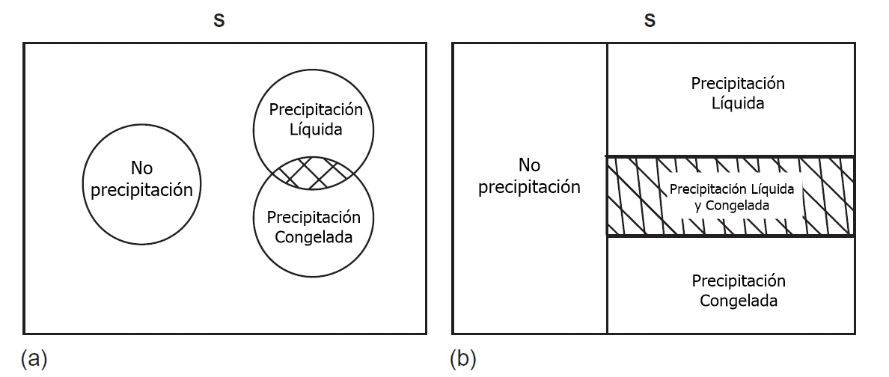
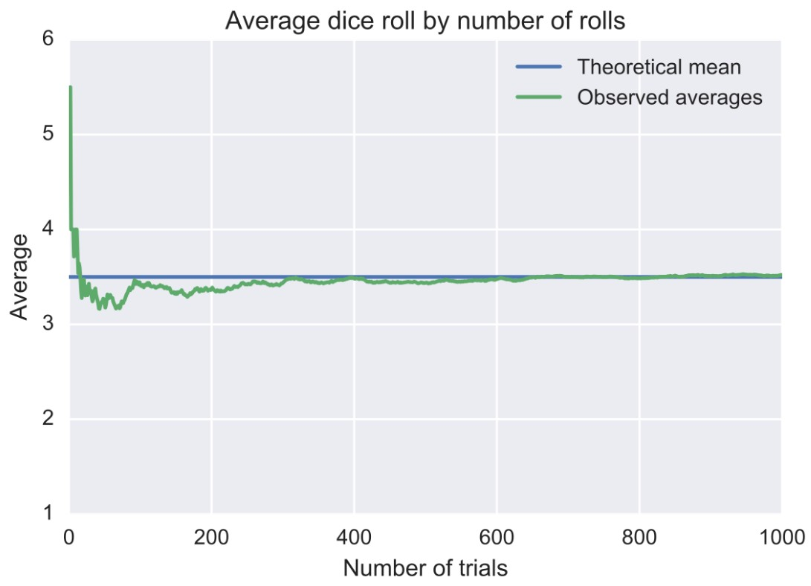
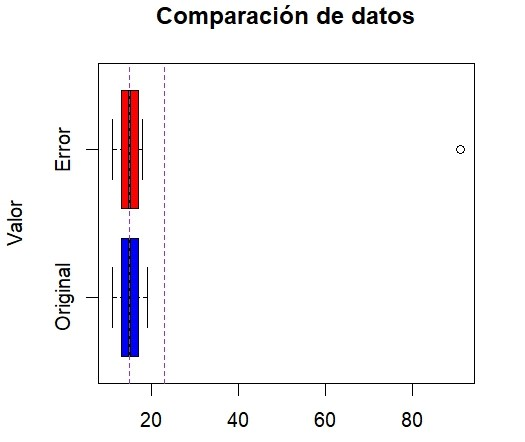
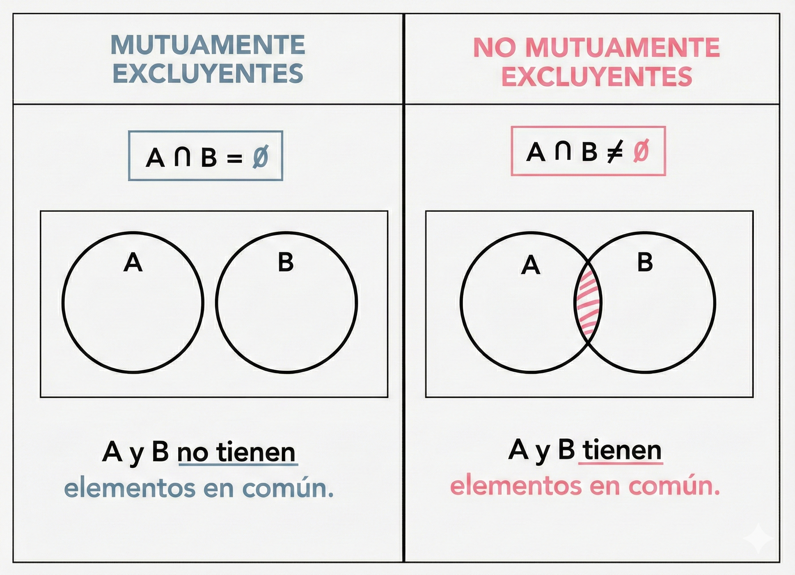
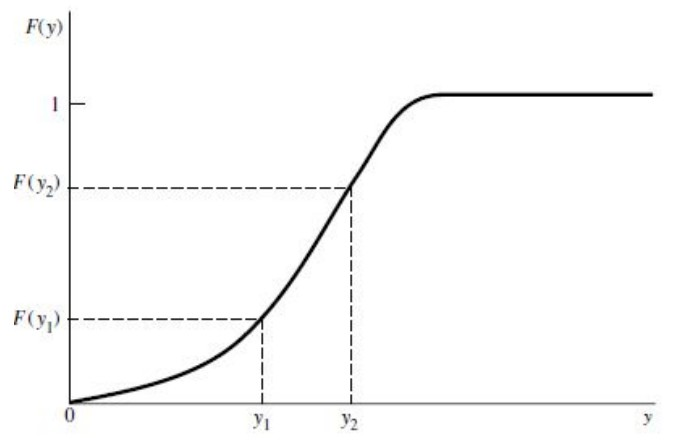
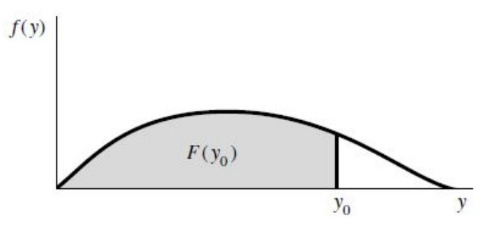
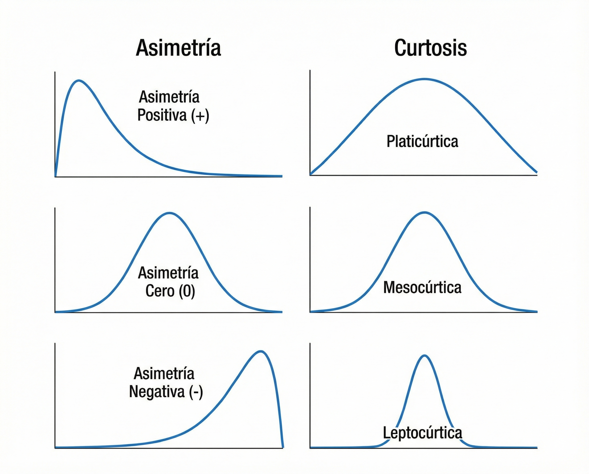

::: {.quote-block}
“Es imposible que lo improbable nunca ocurra.”\
— *Emil Julius Gumbel (1891-1966), estadístico famoso por su trabajo en la teoría de valores extremos*
:::

## Introducción a la estadística hidrológica

La hidrología es una ciencia que, si bien se fundamenta en principios físicos de conservación de masa y energía, se enfrenta a sistemas de una complejidad tal que los enfoques puramente determinísticos resultan, en muchos casos, insuficientes. En este contexto, la estadística y el cálculo de probabilidades no constituyen herramientas auxiliares, <u>sino el lenguaje fundamental</u> para describir, interpretar y resolver los problemas hidrológicos de carácter práctico. 

En la ingeniería civil, el hidrólogo tiene la responsabilidad de definir los eventos de diseño que interactuarán con las estructuras hidráulicas. De forma análoga a como un ingeniero estructural calcula las cargas muertas y vivas, el hidrólogo debe determinar las magnitudes de precipitación, caudal o volumen que una obra debe ser capaz de conducir, almacenar o disipar de manera segura.

El papel de la estadística en la hidrología se manifiesta principalmente en tres áreas críticas:

1. **Planeación y diseño**: 

   Determinación de la capacidad hidráulica de vertederos de presas, puentes, alcantarillas y sistemas de drenaje urbano.

2. **Gestión de los recursos hídricos**:

   Evaluación de la disponibilidad de agua para abastecimiento poblacional, riego agrícola y generación hidroeléctrica.

3. **Operación**: 

   Pronóstico de crecidas y sequías en tiempo real para apoyar la toma de decisiones críticas y la gestión del riesgo.

Desde el punto de vista ingenieril, el objetivo central del análisis estadístico es realizar inferencias sobre una población, entendida como el conjunto de todos los eventos hidrológicos posibles, pasados y futuros, a partir de una **muestra limitada de datos observados**. Este proceso transforma registros históricos de precipitación o caudal en información útil para el diseño mediante un análisis estadístico riguroso. 

Desde la hidrología y la ingeniería en general, se adopta mucho el enfoque de sistemas para analizar, describir y resolver problemas.

```{r echo=FALSE, warning=FALSE, message=FALSE, error=FALSE}
#| label: fig-plotdiagrama
#| fig-cap: "Diagrama de análisis de sistemas."
# Instalar el paquete si no lo tienes
if (!requireNamespace("DiagrammeR", quietly = TRUE)) {
  install.packages("DiagrammeR")
}

library(DiagrammeR)

grViz("
digraph mapaconceptual {

  # Estilo general del diagrama
  graph [layout = dot, rankdir = LR, bgcolor = 'white']

  # Estilo de nodos
  node [shape = box, style = filled, color = orange, fillcolor = gold, fontname = Palatino_Linotype, fontsize = 14]

  # Definición de nodos
  nodo1 [label = 'Desarrollar\ndescripción clara']
  nodo2 [label = 'Identificar\nfactores importantes']
  nodo3 [label = 'Proponer o\nrefinar modelo']
  nodo4 [label = 'Realizar\nexperimentos']
  nodo5 [label = 'Manipular el\nmodelo']
  nodo6 [label = 'Confirmar la\nsolución']
  nodo7 [label = 'Conclusiones y\nrecomendaciones']

  # Estilo de borde rojo
  subgraph cluster0 {
    style = dashed
    color = red
    label = ''
    nodo2 -> nodo3
    nodo3 -> nodo4
    nodo4 -> nodo3
    nodo2
    nodo3
    nodo4
  }

  # Conexiones entre nodos
  nodo1 -> nodo2
  nodo3 -> nodo5
  nodo5 -> nodo6
  nodo6 -> nodo7
}
")

```

Los procesos hidrológicos, tales como la precipitación y el escurrimiento superficial, son **intrínsecamente estocásticos**^[Un proceso estocástico es un conjunto de variables aleatorias que representa la evolución de un sistema a lo largo del tiempo o del espacio, caracterizado por el azar y la incertidumbre. Se utiliza para modelar fenómenos dinámicos donde el valor futuro no se puede predecir con certeza, como la bolsa de valores, la temperatura o el clima.]. Aunque obedecen a leyes físicas bien definidas, la alta variabilidad de las condiciones meteorológicas y la heterogeneidad espacial de las cuencas (suelos, topografía, cobertura vegetal y acuíferos) generan respuestas altamente variables en el tiempo y el espacio.

De manera general, existen dos enfoques para la modelación de estos procesos:

- **Modelos determinísticos**: se basan en leyes físicas explícitas (por ejemplo, las ecuaciones de Saint-Venant), donde una entrada determinada produce siempre la misma salida.
- **Modelos estocásticos**: reconocen que la respuesta del sistema está parcialmente gobernada por el azar y se describe mediante distribuciones de probabilidad.

El diseño hidrológico se desarrolla inevitablemente bajo condiciones de incertidumbre, la cual tiene múltiples fuentes:

1. **Variabilidad natural (aleatoriedad)**: asociada a la naturaleza estocástica de la lluvia y el caudal. Por ejemplo, un registro de 10 años puede no incluir una crecida extrema que, físicamente, es posible que ocurra.

2. **Errores de muestreo**: los registros disponibles representan solo una fracción de una población potencialmente infinita. Series cortas (menores a 20–25 años) suelen ser insuficientes para caracterizar con confianza eventos de baja frecuencia, como crecientes con periodos de retorno elevados.

3. **Errores de medición**: debidos tanto a fallas instrumentales (pluviómetros, limnígrafos, sensores) como a errores humanos en la lectura, procesamiento o transcripción de datos.

4. **No estacionariedad**: la estadística clásica asume que las propiedades de la población permanecen constantes en el tiempo. Sin embargo, procesos como la urbanización, la deforestación y el cambio climático modifican la respuesta hidrológica de las cuencas, limitando la validez de los registros históricos como predictores exactos del futuro.


## Conceptos básicos de probabilidad

1. **Experimento determinístico (*Modelo Determinístico*)**:

Es un experimento del que se tiene certeza del resultado que se obtendrá al realizarlo varias veces bajo las mismas condiciones.
  
  + Hervir agua.
  + Suma de números naturales.

2. **Experimento aleatorio (*Modelo Probabilístico*)**:

Es un experimento que, si se repite una cierta cantidad de veces bajo las mismas condiciones, no se tiene certeza del resultado que se obtendrá, es decir, depende del azar.

  + Lanzar un dado.
  + Elegir una carta.

Un experimento aleatorio en hidrología es aquel cuyo resultado exacto no puede predecirse con certeza antes de su ocurrencia, aun cuando se repita bajo condiciones aparentemente idénticas. Un ejemplo clásico es la medición del caudal máximo anual en una sección específica de un río: se sabe que cada año ocurrirá una creciente, pero su magnitud exacta varía de forma irregular y no determinística.


El **espacio muestral** o espacio de eventos (S o $\Omega$) es el conjunto de todos los posibles eventos elementales. Por lo tanto, el espacio muestral representa el universo de todos los posibles resultados o eventos. De manera equivalente, es el evento compuesto más grande posible.

- **Cualitativas ( o categóricas)**: son aquellas no numéricas utilizadas para describir los distintos resultados, por ejemplo, sexo, profesión, color de cabello, provincia, estado civil, etcétera. Existen dos tipos:

  + Ordinal.
  
  + Nominal.


- **Cuantitativas**: son las que pueden expresarse numéricamente como la temperatura, el salario, la edad, la nota obtenida, entre otras. A su vez, estas mismas variables se pueden subdividir entre:


  - Discretas: Sólo pueden ser contadas por medio de números naturales.
  
  - Continuas: Pueden expresarse de manera continua.


Las variables cuantitativas también se pueden expresar como:

+ Razón: cero implica la ausencia de algo.

+ Intervalo: Cero no es la ausencia de algo.

En hidrología, la mayoría de las variables de interés para el diseño hidráulico se modelan como variables aleatorias continuas.

### Eventos simples y eventos compuestos

Un **evento** es un conjunto, o clase, o grupo de posibles resultados inciertos. Los eventos pueden ser de dos tipos: un *evento compuesto* puede descomponerse en dos o más (sub)eventos, mientras que un *evento elemental* no puede. 

  - A manera de ejemplo, se piensa en lanzar un dado ordinario de seis caras. El evento "sale un número par" es un evento compuesto, ya que ocurrirá si aparecen dos, cuatro o seis puntos. El evento "sale un seis" es un evento elemental.
  
1. **Evento simple (o elemental)**: es aquel que no puede descomponerse en resultados más básicos. Por ejemplo, en un experimento hipotético, el evento “el caudal máximo anual es exactamente 200 m³/s” puede considerarse un evento simple desde un punto de vista conceptual.
2. **Evento compuesto**: es aquel que está formado por dos o más eventos simples. En hidrología, la mayoría de los eventos relevantes son de este tipo. Por ejemplo, el evento “ocurre precipitación mañana” puede incluir distintos tipos de precipitación, mientras que el evento “$Q > 500\ \text{m}^3/\text{s}$” es compuesto, ya que abarca una infinidad de valores posibles por encima de dicho umbral.

```{r}
#| label: fig-prob1
#| fig-cap: "Diagrama de Venn sobre precipitación.<br><span style='font-size:0.8em;'>Fuente: [@Wilks2019]</span>"
#| fig-align: center
#| out-width: 100%
#| echo: false
#| class: fig-border



```

### Interpretación frecuentista de la probabilidad

La probabilidad es una medida numérica, definida en el intervalo entre 0 y 1, que cuantifica la posibilidad de ocurrencia de un evento. En hidrología, se adopta predominantemente la interpretación frecuentista de la probabilidad, basada en el análisis de registros históricos observados.

Si un experimento aleatorio se repite $n$ veces y un evento $A$ ocurre en $n_A$ de esas repeticiones, la probabilidad del evento $A$ se define como el límite de la frecuencia relativa cuando el número de observaciones tiende a infinito:

$$
P(A) = \lim_{n \to \infty} \frac{n_A}{n}
$$

Supongamos que lanzamos el dado 1000 veces y estimamos el promedio de los números obtenidos en cada lanzamiento. Al graficar el promedio en cada iteración, vemos que el resultado converge a un valor central de estimación.

```{r}
#| label: fig-prob2
#| fig-cap: "Medición de promedios tiende a valor central al aumentar el tamaño de muestra."
#| fig-align: center
#| out-width: 75%
#| echo: false
#| class: fig-border



```

Esta regularidad estadística implica que, aunque un evento individual no pueda predecirse con exactitud, una muestra suficientemente grande, por ejemplo, un registro de 30 a 50 años, permite caracterizar de forma confiable el comportamiento probabilístico de la población hidrológica subyacente.

Es importante entonces introducir dos conceptos clave al momento de analizar comportamientos de conjuntos muestrales.

"**Robustez**" y "**resistencia**" son conceptos fundamentales en estadística que se refieren a la capacidad de los métodos estadísticos para mantener su validez y desempeño bajo condiciones diversas, incluyendo la presencia de datos atípicos o anomalías.

- Un método *robusto* no es necesariamente óptimo en circunstancias particulares, pero funciona razonablemente bien en la mayoría de las circunstancias. Por ejemplo, el promedio muestral es la mejor caracterización del centro de un conjunto de datos si se sabe que esos datos siguen una distribución gaussiana.

- Un método *resistente* no se ve excesivamente influenciado por un pequeño número de valores atípicos. Los resultados de un método resistente cambian muy poco si se cambia una pequeña fracción de los valores de los datos, incluso si se cambian drásticamente.

::: {.callout-note title="Ejemplo"}
El promedio **no es** una medida ni robusta ni resistente. Considere el pequeño conjunto $\{11, 12, 13, 14, 15, 16, 17, 18, 19\}$. Su promedio es $15$. 
Sin embargo, si en su lugar se tiene el conjunto $\{11, 12, 13, 14, 15, 16, 17, 18,\color{red}{91} \color{black}{} \}$ producto de un error de transcripción, el "centro" de los datos (erróneamente) caracterizado usando el promedio muestral sería $23$. Medidas resistentes del centro de un conjunto de datos, como las que se presentarán más adelante, cambiarían poco o nada por la sustitución de "91" por "19" en este ejemplo simple.

```{r}
#| label: fig-prob3
#| fig-cap: "Efecto de valores atípicos sobre el promedio."
#| fig-align: center
#| out-width: 75%
#| echo: false
#| class: fig-border



```
::: 


## Axiomas fundamentales de la probabilidad

Una vez que el espacio muestral y sus eventos constituyentes han sido cuidadosamente definidos, el siguiente paso es asociar probabilidades con cada uno de los eventos. Para poder hacer esto se puede seguir los **tres axiomas de probabilidad**. 

Existen definiciones matemáticas formales de los axiomas, pero se pueden enunciar cualitativamente de la siguiente manera:

1. **No negatividad**: La probabilidad de cualquier evento es no negativa.

   Formalmente, si $E$ es un evento perteneciente a la familia de eventos $F$, entonces:

$$
P(E) \ge 0 \qquad \forall E \in F
$$

2. **Normalización**: La probabilidad del evento compuesto S es 1. Este axioma establece que la probabilidad de que ocurra algún resultado dentro del espacio muestral completo es igual a uno. Es decir, la certeza absoluta de que el experimento aleatorio producirá un resultado posible.

Si $\Omega$ denota el espacio muestral, se tiene:

$$
P(\Omega) = 1
$$

3. **Aditividad**: La probabilidad de que ocurra uno u otro de dos eventos mutuamente excluyentes es la suma de sus dos probabilidades individuales. Para cualquier colección numerable de eventos mutuamente excluyentes (es decir, que no pueden ocurrir simultáneamente), la probabilidad de que ocurra al menos uno de ellos es igual a la suma de sus probabilidades individuales.

Sean $E_1, E_2, \ldots$ eventos disjuntos, entonces:

$$
P\left(\bigcup_{i=1}^{\infty} E_i \right)
=
\sum_{i=1}^{\infty} P(E_i)
$$

## Operaciones y reglas básicas de la probabilidad

### Regla de la adición o suma

La regla de la adición se utiliza para calcular la probabilidad de que ocurra el evento $A$, el evento $B$, o ambos simultáneamente. Matemáticamente, esta situación corresponde a la **unión de eventos**, denotada como $A \cup B$.

**1. Eventos no mutuamente excluyentes**

En hidrología es frecuente que dos causas de un mismo fenómeno puedan ocurrir de manera simultánea. Por ejemplo, una inundación en la desembocadura de un tributario puede ser causada tanto por una crecida del propio tributario ($A$) como por el remanso del río principal ($B$).

En este caso, la ley aditiva general de la probabilidad se expresa como:

$$
P(A \cup B) = P(A) + P(B) - P(A \cap B)
$$

donde $P(A \cap B)$ representa la probabilidad conjunta de que ambos eventos ocurran simultáneamente. Este término se resta para evitar contabilizar dos veces la región común del espacio muestral.

**2. Eventos mutuamente excluyentes**

Si los eventos no pueden ocurrir al mismo tiempo, es decir, si su intersección es nula,

$$
A \cap B = \varnothing
$$

entonces la regla de la adición se simplifica a:

$$
P(A \cup B) = P(A) + P(B)
$$

Este caso es común, por ejemplo, cuando se definen intervalos disjuntos de caudal máximo anual.

```{r}
#| label: fig-prob4
#| fig-cap: "Diagrama de Venn de eventos mutuamente excluyentes y no mutuamente excluyentes."
#| fig-align: center
#| out-width: 75%
#| echo: false
#| class: fig-border



```

 
### Probabilidad condicional

La probabilidad condicional mide la probabilidad de que ocurra un evento $A$, dado que ya ha ocurrido (o se sabe que ocurrirá) un evento condicionante $B$. Se denota como $P(A \mid B)$ y se define matemáticamente como:

$$
P(A \mid B) = \frac{P(A \cap B)}{P(B)}
$$

Este concepto es fundamental en ingeniería hidrológica. Por ejemplo, la probabilidad de que mañana ocurra una helada ($A$) aumenta considerablemente si se sabe que hoy la temperatura mínima ya es extremadamente baja ($B$), reflejando la dependencia física entre procesos atmosféricos consecutivos.


### Regla de la multiplicación

A partir de la definición de probabilidad condicional se obtiene la regla de la multiplicación, que permite calcular la probabilidad conjunta de dos eventos:

$$
P(A \cap B) = P(A \mid B)\, P(B)
$$

Si los eventos son **independientes**, la ocurrencia de uno no afecta la probabilidad del otro, por lo que:

$$
P(A \mid B) = P(A)
$$

y la expresión anterior se reduce a:

$$
P(A \cap B) = P(A)\, P(B)
$$

Este caso particular es ampliamente utilizado en análisis de riesgo, aunque debe aplicarse con cautela en sistemas hidrológicos reales.


### Independencia y dependencia estadística en hidrología

La suposición de independencia estadística es clave en muchos métodos clásicos, como el uso de la distribución binomial para estimar la probabilidad de falla de una obra hidráulica durante $n$ años de servicio. Sin embargo, los procesos hidrológicos rara vez cumplen estrictamente esta condición.

Entre las principales formas de dependencia se encuentran:

1. **Persistencia o autocorrelación**  
   Las variables hidrológicas y meteorológicas suelen presentar dependencia con sus valores pasados. En una serie de caudales diarios, el caudal del día actual está fuertemente influenciado por el del día anterior, especialmente durante periodos de recesión. Este comportamiento se conoce como **persistencia** o **autocorrelación**.

2. **Dependencia física**  
   El caudal de un río no es un proceso puramente aleatorio, sino que depende de la precipitación antecedente y del estado de almacenamiento de la cuenca (humedad del suelo, embalses naturales, acuíferos). Ignorar esta dependencia puede conducir a una subestimación de la varianza y, en consecuencia, a errores significativos en la estimación de eventos extremos.

## Variables aleatorias y distribuciones de probabilidad

En el contexto hidrológico, una variable aleatoria se define como una cantidad cuyo valor exacto no puede predecirse con certeza antes de su ocurrencia, debido a la influencia de múltiples factores aleatorios. Matemáticamente, la variable aleatoria se denota usualmente con una letra mayúscula (por ejemplo, $X$), mientras que un valor específico observado se representa con una letra minúscula ($x$).

Desde el punto de vista estadístico, se distinguen dos tipos fundamentales de variables aleatorias:

1. **Variables discretas**: Son aquellas que solo pueden tomar valores aislados, generalmente enteros. Un ejemplo hidrológico es el número de inundaciones ocurridas en un periodo de 10 años.

2. **Variables continuas**: Son aquellas que pueden tomar cualquier valor dentro de un intervalo continuo de la recta real (dominio de los reales $\mathbb{R}$). Ejemplos típicos en hidrología son el caudal máximo instantáneo anual de un río o la intensidad máxima de una tormenta.

### Función de distribución acumulada (FDA)

La Función de Distribución Acumulada (FDA), denotada comúnmente como $F(x)$, describe la probabilidad de que la variable aleatoria $X$ tome un valor menor o igual que un valor específico $x$. Matemáticamente, se define como:

$$
F(x) = P(X \le x) = \int_{-\infty}^{x} f(u)\,du
$$

donde $f(u)$ es la función de densidad de probabilidad asociada.

La FDA posee propiedades fundamentales para el análisis hidrológico:

- Es una función **no decreciente**, es decir, a medida que $x$ aumenta, la probabilidad acumulada nunca disminuye.

$$
P(a \leq Y \leq b) = \int_{a}^{b} f(y) dy
$$
```{r}
#| label: fig-prob5
#| fig-cap: "Propiedad monotónicamente creciente de la FDA."
#| fig-align: center
#| out-width: 75%
#| echo: false
#| class: fig-border



```


- Sus valores están acotados entre 0 y 1, cumpliéndose que:

$$
0 \le F(x) \le 1
$$

- En hidrología, $F(x)$ suele interpretarse como la **probabilidad de no excedencia** de un valor $x$.

Adicionalmente, debe cumplir con estas propiedades.
           
1. $F(-\infty) \equiv \lim\limits_{y \to -\infty} F(y) = 0$.

2. $F(+\infty) \equiv \lim\limits_{y \to +\infty} F(y) = 1$.

3. $F(y)$ es una función no decreciente de $y$. Si $y_1 < y_2$, entonces $F(y_1) \leq F(y_2)$.

4. Si la variable aleatoria $Y$ es continua, su función de densidad de probabilidad (f.d.p) $f_Y(y)$ está relacionada con la función de distribución acumulada mediante la derivada:


$$
\frac{d}{dy} F_Y(y) = f_Y(y)
$$

o lo que es lo mismo:

$$
\int_{-\infty}^{y} f_Y(t) \, dt = F_Y(y)
$$

### Función de densidad de probabilidad (FDP)

Para variables aleatorias continuas, la Función de Densidad de Probabilidad (FDP), denotada como $f(x)$, representa la tasa de cambio de la probabilidad acumulada y se define como la derivada de la FDA:

$$
f(x) = \frac{dF(x)}{dx}
$$

Es importante destacar que, para una variable continua, la probabilidad de que $X$ sea exactamente igual a un valor puntual es nula:

$$
P(X = x) = 0
$$

Por lo tanto, la probabilidad siempre se interpreta como el área bajo la curva de la FDP entre dos límites específicos.

```{r}
#| label: fig-prob6
#| fig-cap: "Función de densidad de probabilidad."
#| fig-align: center
#| out-width: 85%
#| echo: false
#| class: fig-border



```

La FDP debe cumplir con los axiomas de la probabilidad.

## Estadísticos descriptivos y momentos estadísticos

En la hidrología, el análisis de datos (como registros de precipitación o caudal) requiere resumir grandes volúmenes de información en indicadores numéricos que describan sus propiedades fundamentales. Estos indicadores, conocidos como <u>estadísticos descriptivos</u>, permiten caracterizar la tendencia central, la dispersión y la forma de la distribución de los datos.

Desde una perspectiva matemática, estas medidas se fundamentan en los **momentos estadísticos**. Para una variable aleatoria continua $X$ con función de densidad de probabilidad $f(x)$, el momento de orden $k$ respecto al origen se define como:

$$
\mu'_k \;=\; \int_{-\infty}^{\infty} x^{k}\, f(x)\, dx
$$

Mientras que el momento de orden $k$ respecto a la media $\mu$ se define como:

$$
\mu_k \;=\; \int_{-\infty}^{\infty} (x-\mu)^{k}\, f(x)\, dx
$$

Estos momentos constituyen la base teórica de los principales estadísticos descriptivos utilizados en hidrología.


### Medidas de tendencia central

Las medidas de tendencia central identifican el valor alrededor del cual se agrupan los datos.

1. **Media aritmética** ($\bar{x}$):  
   Es el primer momento respecto al origen y representa el centro de gravedad de la distribución. Para una muestra de tamaño $n$, se calcula como:

$$
\bar{x} \;=\; \frac{1}{n}\sum_{i=1}^{n} x_i
$$

2. **Mediana** ($P_{0.50}$):  
   Es el valor que divide la serie de datos ordenados en dos partes iguales, de modo que el 50% de las observaciones son menores o iguales a ella. Es una medida robusta y resistente, poco sensible a valores extremos.

3. **Moda**:  
   Es el valor que ocurre con mayor frecuencia en la serie de datos. En un histograma o hietograma corresponde a la clase con mayor altura.


### Medidas de dispersión

Estas medidas cuantifican qué tan dispersos o concentrados se encuentran los datos respecto al valor central.

1. **Varianza** ($\sigma^2$):  
   Es el segundo momento respecto a la media y mide la dispersión cuadrática de los datos. El estimador muestral insesgado se expresa como:

$$
S^2 \;=\; \frac{1}{n-1}\sum_{i=1}^{n} (x_i - \bar{x})^2
$$

2. **Desviación estándar** ($\sigma$):  
   Es la raíz cuadrada de la varianza y tiene las mismas unidades que la variable original, lo que facilita su interpretación física:

$$
S \;=\; \sqrt{S^2}
$$

3. **Rango**:  
   Es la diferencia entre el valor máximo y el valor mínimo de la muestra.

4. **Cuantiles y rango intercuartílico (IQR)**:  
   Los cuantiles dividen la distribución en intervalos de igual probabilidad. El rango intercuartílico se define como:

$$
IQR \;=\; P_{0.75} - P_{0.25}
$$

y mide la dispersión del 50% central de los datos, siendo poco sensible a valores extremos.


### Medidas adimensionales

Para comparar la variabilidad y la forma de series hidrológicas entre distintas cuencas o regiones, se utilizan índices sin dimensiones.

- **Coeficiente de variación** ($CV$):  
  Relaciona la desviación estándar con la media:

$$
CV \;=\; \frac{S}{\bar{x}}
$$

Un valor elevado de $CV$ indica una variable más errática o variable.

- **Coeficiente de oblicuidad o asimetría** ($C_s$):  
  Basado en el tercer momento respecto a la media, describe la falta de simetría de la distribución:

$$
C_s \;=\; \frac{\mu_3}{S^3}
$$

  Interpretación hidrológica:
  
  - $C_s > 0$: asimetría positiva (cola larga a la derecha), común en lluvias intensas y caudales máximos.
  
  - $C_s = 0$: distribución simétrica (por ejemplo, Normal).
  
  - $C_s < 0$: asimetría negativa (cola larga a la izquierda).

- **Curtosis** ($C_k$):  
  Basada en el cuarto momento respecto a la media, mide qué tan puntiaguda o achatada es la distribución en comparación con la Normal:

$$
C_k \;=\; \frac{\mu_4}{S^4}
$$

Distribuciones con picos agudos y colas pesadas se denominan leptocúrticas, mientras que aquellas más planas se denominan platicúrticas.

```{r}
#| label: fig-prob7
#| fig-cap: "Asimetría y curtosis en una FDP"
#| fig-align: center
#| out-width: 85%
#| echo: false
#| class: fig-border



```

### Relación con los momentos estadísticos

Existe una correspondencia directa entre los estadísticos descriptivos y los momentos estadísticos:

- Primer momento (respecto al origen): media — localización.
- Segundo momento (respecto a la media): varianza — escala o dispersión.
- Tercer momento (respecto a la media): asimetría — forma.
- Cuarto momento (respecto a la media): curtosis — grado de apuntamiento y peso de las colas.

Esta relación proporciona un marco unificado para interpretar los estadísticos descriptivos como manifestaciones cuantitativas de la estructura probabilística de los procesos hidrológicos.

