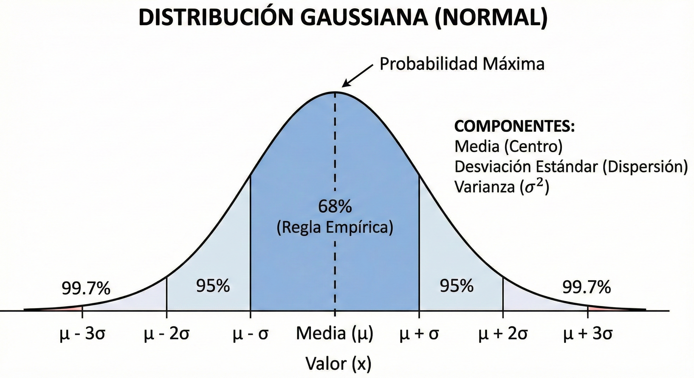
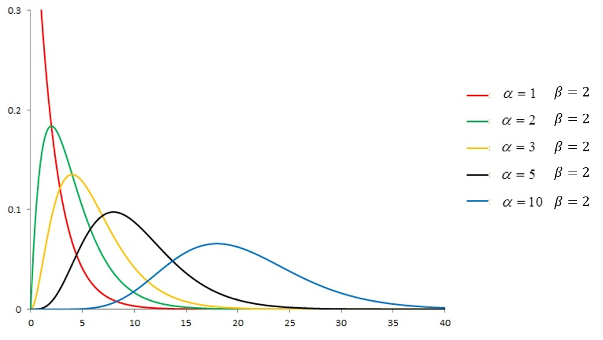
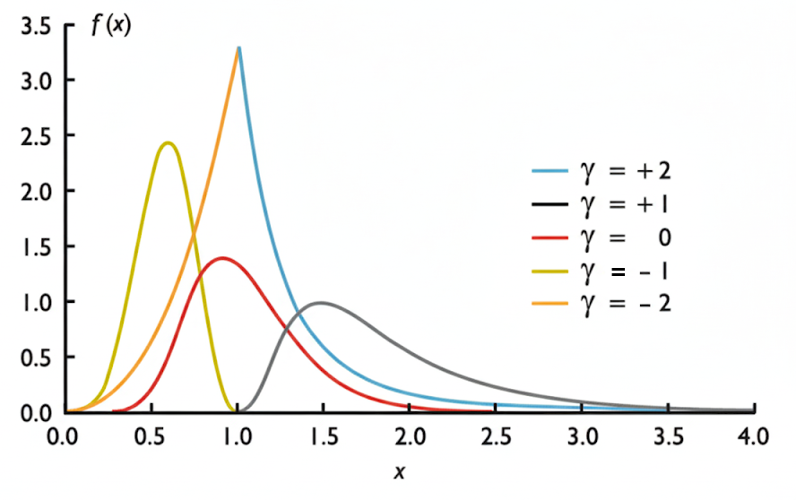
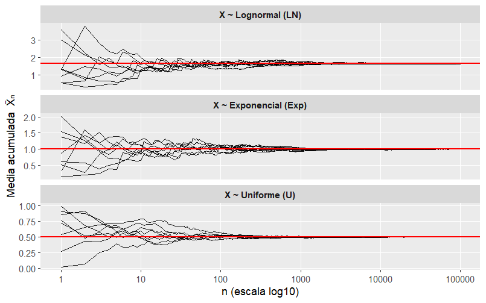
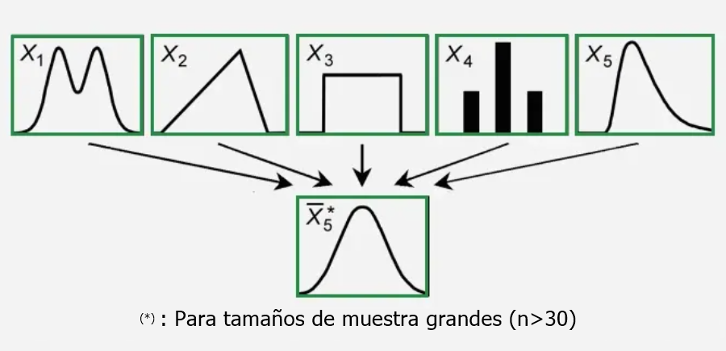
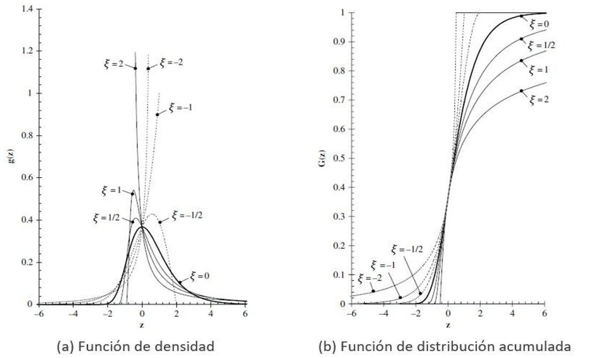
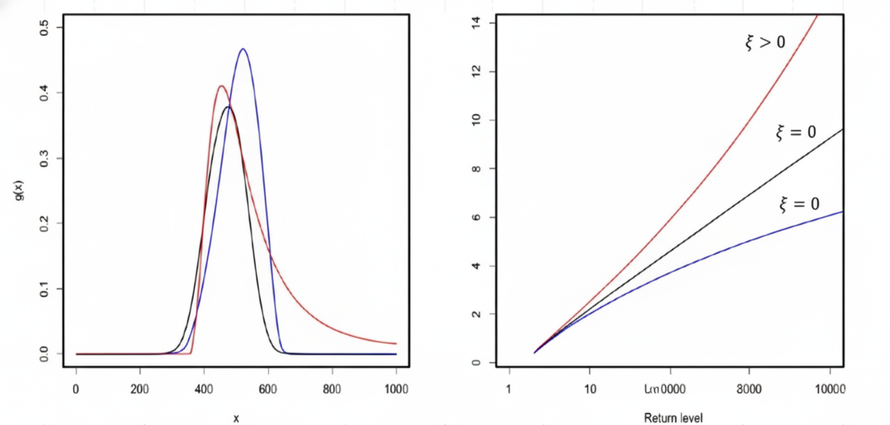
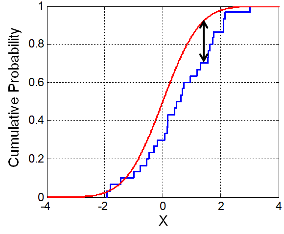

::: {.quote-block}
“Todos los modelos están equivocados, pero algunos son útiles.”\
— *Box, George E.P. (Estadístico)*
:::

En el análisis hidrológico, la selección de un modelo probabilístico adecuado permite representar el comportamiento estadístico de variables como la lluvia y el caudal, con el fin de realizar extrapolaciones necesarias para el diseño de obras de ingeniería. Estas distribuciones se clasifican generalmente según el tipo de datos que modelan: valores medios o valores extremos.

## Distribuciones para valores medios

Estas funciones son apropiadas para variables aleatorias que cubren todo el rango de resultados posibles de un experimento hidrológico.

### Distribución Normal


La distribución Normal, también conocida como *Gaussiana*, constituye la piedra angular de la estadística clásica y desempeña un papel central en la hidrología moderna. Su relevancia no se limita a ser un modelo directo para ciertos fenómenos hidrológicos, sino que actúa como fundamento teórico para la inferencia estadística, la estimación de incertidumbre y el desarrollo de distribuciones más complejas empleadas en el análisis hidrológico.

**Definición y características fundamentales**

La distribución Normal describe una variable aleatoria continua cuyo comportamiento está completamente determinado por dos parámetros:

- **Media** $(\mu)$: parámetro de localización que define el centro de la distribución.
- **Desviación estándar** $(\sigma)$: parámetro de escala que controla la dispersión de los datos alrededor de la media.

```{r}
#| label: fig-prob8
#| fig-cap: "Parámetros y componentes de la distribución normal."
#| fig-align: center
#| out-width: 100%
#| echo: false
#| class: fig-border



```

La función de densidad de probabilidad (FDP) se expresa como:

$$
f(x)=\frac{1}{\sigma\sqrt{2\pi}}
\exp\left[-\frac{1}{2}\left(\frac{x-\mu}{\sigma}\right)^2\right],
\qquad -\infty < x < \infty
$$

Esta función define una curva continua, suave y unimodal.

**Propiedades geométricas y estadísticas**

- <u>Simetría</u>:  
  La distribución es perfectamente simétrica respecto a $\mu$, por lo que los valores equidistantes de la media tienen la misma probabilidad.

- <u>Momentos estadísticos</u>:  
  Debido a su simetría:
  - El coeficiente de asimetría es exactamente cero:  
    $$
    C_s = 0
    $$
  - La curtosis es constante e igual a 3, lo que define una distribución mesocúrtica.

- <u>Regla empírica (68–95–99.7)</u>:   
  En una población normal:
  - El 68.3% de los valores se encuentra en el intervalo $\mu \pm 1\sigma$.
  - El 95.4% se encuentra en $\mu \pm 2\sigma$.
  - El 99.7% se encuentra en $\mu \pm 3\sigma$.

Esta propiedad es ampliamente utilizada para la detección de valores atípicos y el control de calidad de datos hidrológicos.

**El Teorema del Límite Central (TLC)**

La importancia conceptual de la distribución Normal radica en el Teorema del Límite Central, el cual establece que, si una variable aleatoria $X$ resulta de la suma de un número suficientemente grande $n$ de variables aleatorias independientes e idénticamente distribuidas, entonces la distribución de $X$ tiende a una distribución Normal, independientemente de la distribución original de las variables individuales.

En términos hidrológicos, esto explica por qué muchas variables agregadas presentan un comportamiento aproximadamente Normal. Por ejemplo:

- La precipitación total anual, que resulta de la suma de múltiples eventos diarios.
- El caudal medio mensual o anual, que integra la respuesta hidrológica de numerosos procesos físicos independientes.

Este principio justifica el uso de la distribución normal como modelo aproximado para variables hidrológicas de **larga escala temporal**, aun cuando los procesos elementales no sean normales.

```{r message=FALSE, warning=FALSE, error=FALSE}
#| label: fig-plot12400
#| fig-cap: "Teorema de Límite Central"
#| class: fig-border
# ============================================================
# TLC (mejorado): campana Normal teórica correcta en cada panel
#   - Se ajusta a N(mu, sigma/sqrt(n)) para cada tamaño n
#   - La curva se dibuja SOLO dentro del rango del panel
# ============================================================

library(tidyverse)

set.seed(123)

# ------------------------------------------------------------
# 1) Población NO normal (ej.: Exponencial)
# ------------------------------------------------------------
n_pop <- 100000
poblacion <- rexp(n_pop, rate = 1)

mu_pop <- mean(poblacion)
sd_pop <- sd(poblacion)

# ------------------------------------------------------------
# 2) Medias muestrales para distintos tamaños n
# ------------------------------------------------------------
n_sim <- 5000
tamanios_muestra <- c(1, 4, 10, 300)

medias_muestrales <- map_df(tamanios_muestra, function(n) {
  tibble(
    media = replicate(n_sim, mean(sample(poblacion, n))),
    n     = n
  )
}) %>%
  mutate(n_lab = factor(paste0("n = ", n),
                        levels = paste0("n = ", tamanios_muestra)))

# ------------------------------------------------------------
# 3) Curvas normales teóricas por panel (n)
#    Normal: N(mu_pop, sd_pop/sqrt(n))
# ------------------------------------------------------------
rangos_panel <- medias_muestrales %>%
  group_by(n, n_lab) %>%
  summarise(xmin = min(media), xmax = max(media), .groups = "drop")

curvas_normales <- rangos_panel %>%
  mutate(sd_n = sd_pop / sqrt(n)) %>%
  rowwise() %>%
  mutate(curva = list(tibble(
    n_lab = n_lab,
    x     = seq(xmin, xmax, length.out = 400),
    y     = dnorm(seq(xmin, xmax, length.out = 400), mean = mu_pop, sd = sd_n)
  ))) %>%
  ungroup() %>%
  select(curva) %>%
  unnest(curva)

# ------------------------------------------------------------
# 4) Gráfico
#    - Histograma en densidad
#    - Curva normal teórica por panel (roja)
# ------------------------------------------------------------
ggplot(medias_muestrales, aes(x = media)) +
  geom_histogram(
    aes(y = after_stat(density)),
    bins = 40,
    fill = "steelblue",
    color = "white",
    alpha = 0.8
  ) +
  geom_line(
    data = curvas_normales,
    aes(x = x, y = y),
    color = "red",
    linewidth = 1
  ) +
  facet_wrap(~ n_lab, scales = "free") +
  labs(
    title = "Ilustración del Teorema del Límite Central",
    x = "Media muestral",
    y = "Densidad"
  ) +
  theme_minimal(base_size = 12) +
  theme(
    plot.title.position = "plot",
    panel.grid.minor = element_blank()
  )

```


**La variable normal estándar**

Dado que existen infinitas combinaciones posibles de $\mu$ y $\sigma$, no es práctico tabular probabilidades para cada distribución normal. Para resolver este problema, se introduce el proceso de **estandarización**, mediante el cual cualquier variable normal $X \sim N(\mu,\sigma^2)$ se transforma en una variable normal estándar $Z \sim N(0,1)$:

$$
z = \frac{x-\mu}{\sigma}
$$

La función de densidad de la normal estándar se simplifica a:

$$
f(z)=\frac{1}{\sqrt{2\pi}}
\exp\left(-\frac{z^2}{2}\right)
$$

Esta transformación permite utilizar tablas universales o funciones computacionales para evaluar probabilidades de forma eficiente.

**Función de distribución acumulada (FDA)**

La función de distribución acumulada describe la probabilidad de que la variable aleatoria tome un valor menor o igual que un umbral dado:

$$
F(x)=P(X\leq x)=\int_{-\infty}^{x} f(u)\,du
$$

En el caso de la distribución normal, esta integral no tiene solución analítica definida, lo que históricamente motivó el uso de tablas de la normal estándar. En la práctica moderna, la FDA se calcula mediante algoritmos numéricos de alta precisión, como las aproximaciones de Abramowitz y Stegun[^AS], implementadas actualmente en lenguajes de programación y software estadístico.

[^AS]: Abramowitz y Stegun se refiere al manual clásico *Handbook of Mathematical Functions* (1964), una obra de referencia fundamental en matemáticas aplicadas, física e ingeniería.  
No desarrollaron nuevas aproximaciones teóricas originales, sino que recopilaron y sistematizaron fórmulas, aproximaciones y valores numéricos de alta precisión para funciones especiales, tales como funciones de Bessel, gamma, función error y funciones trigonométricas.

Su contribución principal consistió en proporcionar aproximaciones polinómicas y racionales altamente precisas, especialmente valiosas en la era previa a la computación masiva. Muchas de estas aproximaciones continúan integradas, de forma explícita o implícita, en librerías numéricas modernas y en software estadístico de uso profesional.


En hidrología, la FDA se interpreta como **probabilidad de no excedencia**, mientras que su complemento $1-F(x)$ representa la probabilidad de excedencia.

**Aplicaciones más comunes en hidrología**

- <u>Variables de largo plazo</u>:  
  Ajuste de precipitaciones o caudales medios mensuales y anuales, especialmente en regiones húmedas donde la asimetría es reducida.

- <u>Errores de medición</u>:  
  Modelado de errores aleatorios en pluviómetros, estaciones hidrométricas y procesos de aforo.

- <u>Simulación y generación de datos</u>:  
  Uso como distribución base en métodos de Monte Carlo y en modelos estocásticos donde se requiere generar ruido aleatorio con propiedades bien definidas.

- <u>Inferencia estadística</u>:  
  Base para intervalos de confianza, pruebas de hipótesis y análisis de incertidumbre en parámetros hidrológicos.

**Limitaciones críticas en hidrología**

A pesar de su elegancia matemática, la distribución normal presenta limitaciones importantes cuando se aplica a fenómenos hidrológicos:

- <u>Valores negativos</u>:  
  El dominio de la distribución es $[-\infty, +\infty]$, lo que implica una probabilidad distinta de cero de obtener valores negativos. Esto carece de sentido físico para variables como la lluvia o el caudal.

- <u>Incapacidad para modelar asimetría</u>:  
  La mayoría de las variables hidrológicas asociadas a eventos extremos presentan un sesgo positivo pronunciado y colas pesadas. La normal tiende a subestimar la probabilidad de eventos extremos, lo que puede conducir a diseños inseguros.

- <u>Uso inapropiado en análisis de extremos</u>:  
  Para máximos anuales de caudal o lluvia intensa, la normal no es recomendable; en su lugar, deben emplearse distribuciones de valores extremos como Gumbel, Log-Pearson III o GEV.

::: {.callout-note title="Ejemplo"}

En una estación hidrométrica se dispone de un registro de caudales medios mensuales (m³/s) suficientemente estable como para aproximarse con una distribución normal. A partir de la estadística histórica se tiene:

- Media: $\mu = 12.0$ m³/s  
- Desviación estándar: $\sigma = 3.0$ m³/s  

Se solicita:

1) Calcular la probabilidad de que, en un mes cualquiera, el caudal medio sea **menor o igual** que $x=15.0$ m³/s.  
2) Calcular la probabilidad de que el caudal medio sea **mayor** que $x=18.0$ m³/s.  
3) Determinar el **percentil 90** ($x_{0.90}$), es decir, el caudal que **no se excede** el 90% de los meses.  

- Pregunta 1. 

Se asume:

$$
X \sim N(\mu,\sigma^2)
$$

con $\mu=12.0$ y $\sigma=3.0$.

La estandarización se realiza con:

$$
Z=\frac{X-\mu}{\sigma}
\quad\Rightarrow\quad
Z \sim N(0,1)
$$

y la FDA se expresa como:

$$
P(X\le x)=P\!\left(Z\le \frac{x-\mu}{\sigma}\right)=\Phi(z)
$$

donde $\Phi(\cdot)$ es la FDA de la Normal estándar.


- Pregunta 2.

**Paso 1. Estandarizar**

$$
z=\frac{15.0-12.0}{3.0}=\frac{3.0}{3.0}=1.0
$$

**Paso 2. Evaluar la FDA estándar**

$$
P(X\le 15.0)=\Phi(1.0)\approx 0.8413
$$

**Interpretación hidrológica**: aproximadamente el **84.13%** de los meses el caudal medio será $\le 15.0$ m³/s.

- Pregunta 3.

**Paso 1. Estandarizar**

$$
z=\frac{18.0-12.0}{3.0}=\frac{6.0}{3.0}=2.0
$$

**Paso 2. Usar complemento**

$$
P(X>18.0)=1-\Phi(2.0)
$$

con $\Phi(2.0)\approx 0.9772$:

$$
P(X>18.0)=1-0.9772=0.0228
$$

**Interpretación hidrológica**: solo cerca del **2.28%** de los meses se esperaría un caudal medio superior a 18.0 m³/s.

- Pregunta 4.

Por definición:

$$
P(X\le x_{0.90})=0.90
$$

**Paso 1. Encontrar el cuantil estándar**

$$
z_{0.90}=\Phi^{-1}(0.90)\approx 1.2816
$$

**Paso 2. Desestandarizar**

$$
x_{0.90}=\mu+\sigma z_{0.90}
$$

Sustituyendo:

$$
x_{0.90}=12.0+3.0(1.2816)=12.0+3.8448=15.8448\approx 15.85\text{ m}^3/\text{s}
$$

Interpretación: el **90%** de los meses el caudal medio será $\le 15.85$ m³/s.

::: 


### Distribución Log-normal (2 y 3 parámetros)

La distribución Log-normal es un modelo probabilístico ampliamente utilizado en la hidrología debido a su capacidad para representar variables <span class="firebrick"><strong>estrictamente positivas</strong></span> y con <span class="firebrick"><strong>asimetría positiva marcada</strong></span>, características típicas de muchas variables hidrológicas. Entre ellas se incluyen la precipitación, los caudales (medios y máximos), los volúmenes de escorrentía y diversas variables hidroclimáticas acumuladas.

Desde un punto de vista conceptual, mientras que la distribución Normal surge naturalmente cuando un fenómeno es el resultado de la suma de muchos efectos independientes (procesos aditivos), la distribución Log-normal aparece cuando los factores que gobiernan el fenómeno actúan de forma multiplicativa. En hidrología, esto es consistente con procesos como la lluvia, donde la intensidad, la duración y la extensión espacial interactúan de manera no aditiva.

#### Distribución Log-normal de dos parámetros (LN2)

Se dice que una variable aleatoria continua $X$ sigue una distribución Log-normal de dos parámetros si la variable transformada

$$
Y = \ln(X)
$$

sigue una distribución Normal con media $\mu_y$ y desviación estándar $\sigma_y$, es decir:

$$
Y \sim N(\mu_y,\sigma_y^2)
$$

En este caso, la variable original $X$ solo puede tomar valores positivos:

$$
X > 0
$$

lo cual resulta físicamente coherente para variables hidrológicas como la precipitación o el caudal.

**Función de densidad de probabilidad (FDP)**

La función de densidad de probabilidad de la variable $X$ está dada por:

$$
f(x)=\frac{1}{x\,\sigma_y\sqrt{2\pi}}
\exp\left[
-\frac{1}{2}
\left(
\frac{\ln(x)-\mu_y}{\sigma_y}
\right)^2
\right],
\qquad x>0
$$

donde:

- $x$: valor observado de la variable hidrológica (caudal, lluvia, volumen, etc.).
- $\mu_y$: media aritmética de los logaritmos naturales de los datos.
- $\sigma_y$: desviación estándar de los logaritmos naturales de los datos.

La presencia del término $1/x$ introduce la **asimetría positiva** característica de esta distribución.

**Relación entre parámetros y momentos de la variable original**

Un aspecto crucial en el uso correcto de la distribución Log-normal es distinguir entre:

- $\mu_x$, $\sigma_x^2$: media y varianza de la variable original $X$.
- $\mu_y$, $\sigma_y^2$: media y varianza de la variable transformada $Y=\ln(X)$.

Estas cantidades se relacionan mediante:

<u>Media de la variable original</u>:

$$
\mu_x = e^{\left(\mu_y + \frac{\sigma_y^2}{2}\right)}
$$

<u>Varianza de la variable original</u>:

$$
\sigma_x^2 = e^{\left(2\mu_y+\sigma_y^2\right)}
\left[e^{\left(\sigma_y^2\right)}-1\right]
$$

Estas expresiones muestran que, aun cuando $Y$ sea simétrica, la variable $X$ presenta una asimetría creciente a medida que $\sigma_y$ aumenta.

**Estimación inversa de parámetros**

Si se dispone de la media $\mu_x$ y la varianza $\sigma_x^2$ de los datos originales, los parámetros del modelo Log-normal se obtienen mediante:

$$
\sigma_y^2 = \ln\left(1+\frac{\sigma_x^2}{\mu_x^2}\right)
$$

$$
\mu_y = \ln(\mu_x) - \frac{1}{2}\sigma_y^2
$$

Estas expresiones son ampliamente utilizadas en la práctica cuando se emplea el método de los momentos para ajustar una Log-normal de dos parámetros.

**Cálculo de probabilidades y estandarización**

El cálculo de probabilidades se realiza transformando el valor de interés $x$ a la variable normal estándar:

$$
Z = \frac{\ln(x)-\mu_y}{\sigma_y}
$$

Una vez obtenido $Z$, la probabilidad de no excedencia se evalúa como:

$$
P(X \le x) = \Phi(Z)
$$

y la probabilidad de excedencia como:

$$
P(X > x) = 1 - \Phi(Z)
$$

donde $\Phi(\cdot)$ es la función de distribución acumulada de la Normal estándar.

**Aplicaciones típicas de LN2 en hidrología**

- Precipitación total anual o mensual.
- Caudales medios mensuales y anuales.
- Volúmenes de escorrentía acumulados.
- Variables hidrológicas con asimetría moderada y sin valores cercanos a un umbral físico distinto de cero.

#### Distribución Log-normal de tres parámetros (LN3)

En muchos registros hidrológicos, incluso después de aplicar la transformación logarítmica, los datos no presentan una simetría adecuada. Esto ocurre cuando existe un **límite físico inferior distinto de cero** o cuando los valores pequeños están sistemáticamente desplazados.

Para abordar esta situación, se introduce un **tercer parámetro**, denominado **parámetro de posición o umbral** $\xi$, y se define la variable transformada como:

$$
Y = \ln(X - \xi)
$$

con la condición:

$$
X > \xi
$$

Este parámetro $\xi$ representa un límite inferior físico o estadístico de la variable.

**Función de densidad de probabilidad (LN3)**

La FDP del modelo Log-normal de tres parámetros se expresa como:

$$
f(x)=\frac{1}{(x-\xi)\,\sigma_y\sqrt{2\pi}}
\exp\left[
-\frac{1}{2}
\left(
\frac{\ln(x-\xi)-\mu_y}{\sigma_y}
\right)^2
\right],
\qquad x>\xi
$$

Este modelo generaliza el caso de dos parámetros, el cual se obtiene cuando $\xi=0$.

**Interpretación del parámetro de posición**

El parámetro $\xi$ cumple un rol clave:

- Desplaza el origen de la variable, ajustando el modelo a un mínimo físico realista.

- Reduce la curvatura observada en gráficos de probabilidad log-normal.

- Mejora significativamente el ajuste en la cola superior, crucial para eventos extremos de baja frecuencia.

En términos prácticos, $\xi$ suele estimarse mediante métodos iterativos, ajuste visual en papel de probabilidad o técnicas basadas en L-momentos.

**Comparación LN2 vs LN3**

- **LN2**:  
  Adecuada cuando los datos son estrictamente positivos y la asimetría es moderada.

- **LN3**:  
  Preferible cuando existe evidencia de un umbral inferior o cuando el ajuste LN2 subestima los extremos.

En análisis de diseño hidrológico, la LN3 suele proporcionar estimaciones más conservadoras para cuantiles asociados a grandes periodos de retorno.

**Uso práctico y advertencias**

- La Log-normal <span class="firebrick"><strong>no es una distribución de valores extremos</strong></span>.

- Para caudales máximos, suele compararse con distribuciones como Gumbel, Log-Pearson III o GEV.

- El ajuste debe evaluarse siempre mediante gráficos de probabilidad y pruebas de bondad de ajuste.


La distribución Log-normal constituye una herramienta esencial en hidrología aplicada debido a su coherencia física, flexibilidad y facilidad de implementación. Su correcta utilización exige distinguir claramente entre la variable original y su transformación logarítmica, así como comprender el papel de sus parámetros en la forma de la distribución y en la estimación del riesgo hidrológico.

::: {.callout-note title="Ejemplo"}

Se tiene un registro de 15 años de caudales máximos anuales (m³/s) en una estación hidrométrica. Se requiere ajustar estos datos a:

- Distribución Log-Normal de 2 parámetros  
- Distribución Log-Normal de 3 parámetros  

y determinar el caudal correspondiente a un periodo de retorno de 50 años.

Datos de caudales máximos anuales (m³/s):

215, 320, 185, 410, 280, 350, 240, 380, 295, 265, 330, 310, 275, 290, 420

Los datos se ordenan de menor a mayor:

185, 215, 240, 265, 275, 280, 290, 295, 310, 320, 330, 350, 380, 410, 420

Número de datos:

$$
n = 15
$$

2.1 Transformación logarítmica

Se define la transformación:

$$
y_i = \ln(x_i)
$$


```{r}
#| label: tbl-Registro
#| tbl-cap: "Datos transformados a LN2"
#| echo: false
#| message: false
#| warning: false

library(tidyverse)
library(kableExtra)

tabla_ln2 <- tibble(
  `x_i (m³/s)` = c(185, 215, 240, 265, 275, 280, 290, 295, 310, 320, 330, 350, 380, 410, 420),
  `ln(x_i)`    = c(5.2204, 5.3753, 5.4806, 5.5797, 5.6168, 5.6348, 5.6699,
                   5.6870, 5.7366, 5.7683, 5.7991, 5.8579, 5.9402, 6.0162, 6.0403)
)

tabla_ln2 %>%
  kbl(
    booktabs = TRUE,
    format = "html",
    align = c("c", "c"),
    col.names = c("xᵢ (m³/s)", "yᵢ=ln(xᵢ)")
  ) %>%
  kable_classic(html_font = "Latin Modern Roman") %>%
  kable_styling(full_width = FALSE)
```

Media muestral de y:

$$
\bar{y} = \frac{1}{n}\sum_{i=1}^{n} y_i
$$

$$
\bar{y} = \frac{84.8231}{15} = 5.6549
$$

Varianza muestral de y:

$$
s_y^2 = \frac{1}{n-1}\sum_{i=1}^{n}(y_i - \bar{y})^2
$$

$$
s_y^2 = 0.05396
$$

Desviación estándar:

$$
s_y = \sqrt{s_y^2} = \sqrt{0.05396} = 0.2323
$$

Parámetros LN2 estimados:

$$
\mu_y = 5.6549
$$

$$
\sigma_y = 0.2323
$$


- Cálculo para periodo de retorno PR = 50 años


Probabilidad de no excedencia

$$
T_r = 50 \ \text{años}
$$

$$
F = 1 - \frac{1}{T_r} = 1 - \frac{1}{50} = 0.98
$$

Valor de la variable normal estándar asociado:

$$
z = 2.0537
$$

Valor en escala logarítmica

$$
y_{50} = \mu_y + z \cdot \sigma_y
$$

$$
y_{50} = 5.6549 + 2.0537 \times 0.2323
$$

$$
y_{50} = 6.1320
$$

Transformación inversa a caudal

$$
Q_{50} = e^{y_{50}}
$$

$$
Q_{50} = e^{6.1320} = 460.1 \ \text{m³/s}
$$

Resultado LN2:

$$
Q_{50} = 460.1 \ \text{m³/s}
$$


**Distribución Log-Normal de 3 parámetros (LN3)**


Estimación del parámetro de ubicación $\xi$ 

Se define la transformación:

$$
w_i = \ln(x_i - \xi)
$$

Estadísticos de la serie original:

$$
\bar{x} = 308.0
$$

$$
s_x = 68.64
$$

Coeficiente de asimetría (sin corrección):

$$
g \approx \frac{n\sum (x_i - \bar{x})^3}{(n-1)(n-2)s_x^3} = 0.375
$$

Coeficiente de variación:

$$
C_v = \frac{s_x}{\bar{x}} = 0.2228
$$

Se adopta un valor inicial:

$$
\xi = 100
$$


Transformación para $\xi = 100$

```{r}
#| label: tbl-RegistroLN3
#| tbl-cap: "Datos transformados a LN3"
#| echo: false
#| message: false
#| warning: false

tabla_ln3_100 <- tibble(
  `x_i (m³/s)` = c(185, 215, 240, 265, 275, 280, 290, 295, 310, 320, 330, 350, 380, 410, 420),
  `x_i - 100`  = c(85, 115, 140, 165, 175, 180, 190, 195, 210, 220, 230, 250, 280, 310, 320),
  `ln(x_i - 100)` = c(4.4427, 4.7449, 4.9416, 5.1059, 5.1648, 5.1929, 5.2470,
                      5.2730, 5.3471, 5.3936, 5.4381, 5.5215, 5.6348, 5.7366, 5.7683)
)

tabla_ln3_100 %>%
  kbl(
    booktabs = TRUE,
    format = "html",
    align = c("c", "c", "c"),
    col.names = c("xᵢ (m³/s)", "xᵢ − 100", "yᵢ=ln(xᵢ − 100)")
  ) %>%
  kable_classic(html_font = "Latin Modern Roman") %>%
  kable_styling(full_width = FALSE)
```


Media y desviación estándar:

$$
\bar{w} = 5.160
$$

$$
s_w = 0.356
$$


Cálculo para PR = 50 años


$$
w_{50} = \bar{w} + z \cdot s_w
$$

$$
w_{50} = 5.160 + 2.0537 \times 0.356 = 5.891
$$

$$
Q_{50} = \xi + e^{w_{50}}
$$

$$
Q_{50} = 100 + e^{5.891} = 461.5 \ \text{m³/s}
$$

Resultado LN3 (a = 100):

$$
Q_{50} = 461.5 \ \text{m³/s}
$$


**Ajuste óptimo del parámetro $\xi$**

Iteración de $\xi$ para minimizar la asimetría de $\ln(x_i - \xi)$:

- $\xi$ = 0   → asimetría ≈ 0.15  
- $\xi$ = 80  → asimetría ≈ 0.05  
- $\xi$ = 90  → asimetría ≈ 0.02  
- $\xi$ = 95  → asimetría ≈ 0.00  

Usando:

$$
\xi = 95
$$

$$
\mu_w = 5.215
$$

$$
\sigma_w = 0.381
$$

$$
w_{50} = 5.215 + 2.0537 \times 0.381 = 5.997
$$

$$
Q_{50} = 95 + e^{5.997} = 497.4 \ \text{m³/s}
$$


Interpretación de resultados

```{r}
#| label: tbl-RegistroLN4
#| tbl-cap: "Resultados de la transformación"
#| echo: false
#| message: false
#| warning: false

tabla_resultados <- tibble(
  Metodo = c("LN2", "LN3 (ξ = 100)", "LN3 (ξ = 95)"),
  `Q_50 (m³/s)` = c(460.1, 461.5, 497.4)
)

tabla_resultados %>%
  kbl(
    booktabs = TRUE,
    format = "html",
    align = c("c", "c"),
    col.names = c("Método", "Q₅₀ (m³/s)")
  ) %>%
  kable_classic(html_font = "Latin Modern Roman") %>%
  kable_styling(full_width = FALSE)
```


Análisis:

- LN2 es más simple, pero menos flexible.
- LN3 incorpora el parámetro $\xi$, mejorando el ajuste para datos con asimetría positiva.

Recomendación:

Para diseño con $PR = 50$ años, se recomienda utilizar:

$$
Q_{50} = 497.4 \ \text{m³/s}
$$

::: 


### Distribución Gamma (2 y 3 parámetros)

La distribución Gamma es uno de los modelos probabilísticos más versátiles y conceptualmente importantes en la hidrología aplicada. Se utiliza principalmente para representar variables hidrológicas que son estrictamente positivas, asimétricas y sin un límite superior definido, características típicas de la precipitación, los volúmenes de escorrentía y ciertos caudales medios. Su flexibilidad matemática permite describir una amplia gama de comportamientos hidrológicos, desde procesos altamente asimétricos hasta casos que se aproximan a la normalidad.

A diferencia de la distribución Normal, la Gamma es físicamente coherente para variables hidrológicas, ya que no asigna probabilidad a valores negativos, los cuales carecen de significado físico en este contexto.


**La función Gamma: base matemática del modelo**

El núcleo matemático es la función Gamma, denotada como $\Gamma(\alpha)$, definida para $\alpha > 0$ mediante la integral:

$$
\Gamma(\alpha)=\int_{0}^{\infty} t^{\alpha-1} e^{-t}\,dt
$$

Esta función generaliza el concepto de factorial a números reales positivos. Una propiedad fundamental es que, si $\alpha$ es un número entero positivo, entonces:

$$
\Gamma(\alpha) = (\alpha - 1)!
$$

Gracias a esta propiedad, la distribución Gamma puede adoptar múltiples formas, lo que explica su enorme utilidad práctica en hidrología y estadística aplicada.

#### Distribución Gamma de dos parámetros

La distribución Gamma de dos parámetros se emplea cuando la variable hidrológica comienza en cero y no presenta un límite superior definido.

**Función de densidad de probabilidad (FDP)**

La función de densidad de probabilidad se expresa como:

$$
f(x)=\frac{x^{\alpha-1} e^{-x/\beta}}{\Gamma(\alpha)\,\beta^{\alpha}}
,
\qquad x \ge 0,\; \alpha>0,\; \beta>0
$$

donde:

- $x$: valor de la variable aleatoria (precipitación, caudal, volumen, etc.).
- $\alpha$: parámetro de forma.
- $\beta$: parámetro de escala, con las mismas unidades físicas que $x$.

Interpretación física de los parámetros

• **Parámetro de forma $\alpha$**: Controla la asimetría y la forma de la distribución.

- Si $\alpha = 1$, la distribución Gamma se reduce a la distribución Exponencial.

- Para $1 < \alpha < 5$, la distribución presenta una fuerte asimetría positiva.

- Para valores grandes de $\alpha$ (por ejemplo, $\alpha > 30$), la distribución se aproxima progresivamente a una Normal.

• **Parámetro de escala $\beta$**: Determina la dispersión de los datos y actúa como un factor de estiramiento horizontal. Incrementos en $\beta$ desplazan la distribución hacia valores mayores de $x$.

```{r}
#| label: fig-prob9
#| fig-cap: "Comportamiento de distribución Gamma según su parámetro de forma."
#| fig-align: center
#| out-width: 100%
#| echo: false
#| class: fig-border



```

**Estadísticos fundamentales** 

Los momentos teóricos de la distribución Gamma de dos parámetros son:

• Media:
$$
\mu = \alpha\,\beta
$$

• Varianza:
$$
\sigma^2 = \alpha\,\beta^2
$$

• Coeficiente de asimetría:
$$
\gamma = \frac{2}{\sqrt{\alpha}}
$$

Esta última expresión muestra que la asimetría disminuye a medida que $\alpha$ aumenta, una propiedad clave para interpretar datos hidrológicos.


#### Distribución Gamma de tres parámetros (Pearson Tipo III)

En muchos problemas de hidrología, la variable de interés no comienza exactamente en cero, o bien presenta una asimetría que el modelo de dos parámetros no logra capturar adecuadamente. En estos casos se emplea la distribución Gamma de tres parámetros, conocida como distribución Pearson Tipo III.

**Función de densidad de probabilidad**

Se introduce un parámetro adicional de posición o desplazamiento $\xi$:

$$
f(x)=\frac{(x-\xi)^{\alpha-1} e^{-(x-\xi)/\beta}}{\Gamma(\alpha)\,\beta^{\alpha}}
,
\qquad x>\xi
$$

Interpretación del parámetro de posición $\xi$

- $\xi$ representa un límite inferior físico o estadístico de la variable.

- Permite desplazar la distribución a la derecha, ajustándose mejor a datos observados.

- Cuando $\xi = 0$, el modelo se reduce a la distribución Gamma de dos parámetros.

En hidrología, esta versión es especialmente útil para modelar caudales o volúmenes donde existe un umbral mínimo distinto de cero.


**Estimación de parámetros: Método de los Momentos**

Para aplicar la distribución Gamma a datos observados, es necesario estimar sus parámetros a partir de estadísticos muestrales.

- <u>Modelo Gamma de dos parámetros</u>

Sean $\bar{x}$ la media muestral y $s^2$ la varianza muestral. Los estimadores por el método de los momentos son:

$$
\hat{\alpha} = \frac{\bar{x}^2}{s^2}
$$

$$
\hat{\beta} = \frac{s^2}{\bar{x}}
$$

Estas expresiones son simples, directas y ampliamente utilizadas en aplicaciones hidrológicas.

- <u>Modelo Gamma de tres parámetros (Pearson III)</u>

Además de $\bar{x}$ y $s^2$, se requiere el coeficiente de asimetría muestral $C_s$ para estimar los tres parámetros $\alpha$, $\beta$ y $\xi$. La solución suele requerir procedimientos iterativos o el uso de relaciones empíricas desarrolladas específicamente para el modelo Pearson Tipo III.


**Aplicaciones prácticas en hidrología**

1. Precipitación  
   Es el modelo estándar para representar láminas de lluvia diarias, mensuales y estacionales, debido a su coherencia física y flexibilidad.

2. Caudales y volúmenes  
   Se emplea para modelar caudales medios, volúmenes anuales de escorrentía y disponibilidad hídrica.

3. Hidrogramas unitarios sintéticos  
   El modelo de Nash utiliza una función Gamma para representar la transformación de la lluvia efectiva en escorrentía directa a través de reservorios lineales en cascada.

4. Índice de Precipitación Estandarizado (SPI)  
   La precipitación se ajusta a una distribución Gamma y luego se transforma a una Normal estándar para cuantificar sequías en diferentes escalas temporales.
   
## Distribuciones para valores extremos

### Distribución Log-Pearson Tipo III (LP3)

La distribución Log-Pearson Tipo III (LP3) es muy utilizada en la hidrología moderna para el análisis de frecuencias de crecientes. Su importancia no es solo académica, sino también normativa y práctica: ha sido adoptada durante décadas como el estándar oficial para estudios de inundaciones por agencias federales, particularmente en los Estados Unidos, a través del Boletín 17B (y sus actualizaciones posteriores) [@ASCE1996_HydrologyHandbook]. 

La razón de su amplia aplicación radica en su gran flexibilidad estadística, su capacidad para representar datos altamente asimétricos. 

**Concepto fundamental de la distribución LP3**

La distribución Log-Pearson Tipo III no se ajusta directamente a los valores originales observados (por ejemplo, caudales en m³/s). En su lugar, se aplica una transformación logarítmica a los datos, y es sobre estos logaritmos donde se ajusta una distribución Pearson Tipo III.

Es decir, si $x$ representa el valor original observado (caudal máximo anual), se define la variable transformada como $y=\log(x)$, usualmente en base 10 (aunque en algunos contextos se emplea el logaritmo natural).

La familia de distribuciones Pearson es un sistema general que permite aproximar prácticamente cualquier distribución unimodal mediante la combinación de tres parámetros: localización, escala y forma. La Pearson Tipo III es una distribución asimétrica que puede describir colas largas hacia valores altos, una característica típica de los eventos hidrológicos extremos.

Al aplicar esta distribución a los logaritmos de los datos, se obtiene un modelo extremadamente potente para describir y extrapolar crecientes extraordinarias.

Un aspecto conceptual clave es el siguiente: si la asimetría de los logaritmos es cero, la distribución LP3 se reduce exactamente a una distribución Log-normal de dos parámetros. Esto permite interpretar la LP3 como una generalización natural de la Log-normal.

**Función de densidad de probabilidad (FDP)**

La complejidad matemática de la LP3 se refleja en su función de densidad de probabilidad, que describe la probabilidad de que la variable original $x$ tome un valor específico. La FDP se expresa como:

$$
f(x)=\frac{1}{x\,|\beta|\,\Gamma(\gamma)}
\left[\frac{ln(x)-x_0}{\beta}\right]^{\gamma-1}
\exp\left[-\frac{ln(x)-x_0}{\beta}\right]
$$

donde:

- $x$: valor original de la variable (por ejemplo, caudal máximo anual).
- $x_0$: parámetro de posición, que actúa como un límite inferior en el espacio logarítmico cuando el sesgo es positivo.
- $\beta$: parámetro de escala.
- $\gamma$: parámetro de forma, relacionado directamente con la asimetría.
- $\Gamma(\gamma)$: función Gamma.

No es necesario memorizar esta expresión para aplicar el modelo en la práctica. Lo fundamental es comprender que la forma de la distribución está controlada por la asimetría de los logaritmos, lo que le permite adaptarse a una gran variedad de registros hidrológicos reales.

```{r}
#| label: fig-prob10
#| fig-cap: "Comportamiento de distribución log-Pearson tipo III según su parámetro de forma."
#| fig-align: center
#| out-width: 85%
#| echo: false
#| class: fig-border



```


**Procedimiento de ajuste mediante el método de los momentos**

Para aplicar la distribución LP3 a un registro histórico (por ejemplo, 30 años de caudales máximos anuales), se sigue un procedimiento sistemático y bien definido.

- <u>Paso 1: Transformación logarítmica</u>

Se transforman los $n$ valores observados $x_i$ a sus logaritmos:

$$
y_i=\log(x_i)
$$

En la práctica hidrológica tradicional se emplea logaritmo base 10, aunque el uso de logaritmos naturales es igualmente válido si se mantiene la consistencia en todo el análisis.

- <u>Paso 2: Cálculo de estadísticos de la serie logarítmica</u>

Sobre la serie $\{y_i\}$ se calculan los siguientes estadísticos muestrales:

Media:

$$
\bar{y}=\frac{1}{n}\sum_{i=1}^{n}y_i
$$

Desviación estándar:

$$
s_y=\sqrt{\frac{\sum_{i=1}^{n}(y_i-\bar{y})^2}{n-1}}
$$

Coeficiente de asimetría (sesgo):

$$
G=\frac{n\sum_{i=1}^{n}(y_i-\bar{y})^3}{(n-1)(n-2)s_y^3}
$$

Este coeficiente $G$ es el elemento clave que distingue a la LP3 de otros modelos. Su valor controla la curvatura de la distribución y la magnitud de los eventos extremos estimados. 

- <u>Paso 3: Determinación del factor de frecuencia $K$</u>

El factor de frecuencia $K$ depende simultáneamente del periodo de retorno deseado $T$ y del coeficiente de asimetría $G$. Tradicionalmente, $K$ se obtiene de tablas oficiales (como las del Boletín 17B). Sin embargo, cuando dichas tablas no están disponibles, puede emplearse la aproximación analítica propuesta por Kite (1977):

$$
K=z+(z^2-1)k+\frac{1}{3}(z^3-6z)k^2
-(z^2-1)k^3+zk^4-\frac{1}{3}k^5
$$

donde $z$ es la variable normal estándar asociada a la probabilidad de excedencia deseada y $k=G/6$.

- <u>Paso 4: Estimación del valor de diseño</u>

Una vez obtenido $K$, se calcula el logaritmo del valor de diseño asociado al periodo de retorno $T$:

$$
y_T=\bar{y}+K\,s_y
$$

Finalmente, se regresa al espacio original aplicando el antilogaritmo:

$$
x_T=10^{\,y_T}
$$

Este valor $x_T$ corresponde al caudal de diseño para el periodo de retorno $T$.


::: {.callout-note title="Ejemplo"}

Se dispone de un registro de $n=20$ caudales máximos instantáneos anuales $Q$ (m³/s) en la estación El Salto. Se requiere ajustar la distribución **Log-Pearson Tipo III (LP3)** mediante el **método de los momentos** (aplicado sobre la serie transformada $y=\log_{10}(Q)$) y estimar el caudal de diseño asociado a un periodo de retorno $T$ (por ejemplo, $T=50$ o $T=100$ años).  


> **Nota:** en LP3 el ajuste se realiza en el espacio logarítmico $$y=\log_{10}(Q)$$.

```{r}
#| label: tbl-lp3-datos-elsalto
#| tbl-cap: "Estación El Salto: caudal máximo instantáneo anual y transformación logarítmica base 10."
#| echo: false
#| message: false
#| warning: false

library(tidyverse)
library(kableExtra)

datos_lp3 <- tibble::tribble(
  ~`Q máx inst (m³/s)`, ~`log₁₀(Q máx inst)`,
  319.0, 2.504,
  271.0, 2.433,
  269.0, 2.430,
  206.0, 2.314,
  198.0, 2.297,
  155.0, 2.190,
  144.0, 2.158,
  142.0, 2.152,
  131.0, 2.117,
  120.0, 2.079,
  115.0, 2.061,
  104.0, 2.017,
  104.0, 2.017,
  101.0, 2.004,
   98.2, 1.992,
   97.8, 1.990,
   81.3, 1.910,
   68.9, 1.838,
   46.0, 1.663,
   32.5, 1.512
)

datos_lp3 %>%
  mutate(
    `Q máx inst (m³/s)` = round(`Q máx inst (m³/s)`, 1),
    `log₁₀(Q máx inst)` = round(`log₁₀(Q máx inst)`, 3)
  ) %>%
  kbl(
    booktabs = TRUE,
    format = "html",
    align = c("c","c"),
    col.names = c("Q máx inst (m³/s)", "log₁₀(Q máx inst)"),
    escape = FALSE
  ) %>%
  kable_classic(html_font = "Latin Modern Roman") %>%
  kable_styling(
    full_width = FALSE,
    bootstrap_options = c("hover","condensed")
  ) %>%
  row_spec(0, bold = TRUE)
```

- Paso 1: Definir la variable transformada (LP3)

En LP3 se trabaja con:

$$
y_i=\log_{10}(Q_i)
$$

y se asume que $\{y_i\}$ sigue una distribución Pearson Tipo III (equivalente a una Gamma desplazada), caracterizada por sus momentos: media, desviación estándar y asimetría.

- Paso 2: Cálculo de estadísticos muestrales en el espacio logarítmico

Sea $n=20$ el tamaño de muestra. Se calculan:

**Media muestral**

$$
\bar{y}=\frac{1}{n}\sum_{i=1}^{n}y_i
$$

**Desviación estándar muestral**

Primero la varianza:

$$
s_y^2=\frac{1}{n-1}\sum_{i=1}^{n}(y_i-\bar{y})^2
$$

y luego:

$$
s_y=\sqrt{s_y^2}
$$

**Coeficiente de asimetría muestral (sesgo)**

$$
G=\frac{n\sum_{i=1}^{n}(y_i-\bar{y})^3}{(n-1)(n-2)s_y^3}
$$

- Paso 3: Factor de frecuencia $K$ y cuantíl en logaritmos

Para un periodo de retorno $T$, la probabilidad de no excedencia es:

$$
F=1-\frac{1}{T}
$$

Se obtiene el valor $z$ tal que $\Phi(z)=F$.

El factor de frecuencia $K$ depende de $T$ y del sesgo $G$ (tablas del Boletín 17B). Si no se dispone de tablas, puede usarse la aproximación de Kite (1977):

$$
K=z+(z^2-1)k+\frac{1}{3}(z^3-6z)k^2-(z^2-1)k^3+zk^4-\frac{1}{3}k^5
$$

donde:

$$
k=\frac{G}{6}
$$

El cuantíl en logaritmos se calcula como:

$$
y_T=\bar{y}+K\,s_y
$$

- Paso 4: Regresar al espacio original (caudal de diseño)

Finalmente, el caudal de diseño es:

$$
Q_T=10^{\,y_T}
$$

- Paso 5: Cálculo numérico (resumen de resultados)

A continuación se calcula $\bar{y}$, $s_y$, $G$ y, como ejemplo, se estima $Q_T$ para $T=50$ y $T=100$ años.

```{r echo=FALSE, warning=FALSE, message=FALSE, error=FALSE}
#| label: tbl-lp3-resumen-elsalto
#| tbl-cap: "Resumen numérico del ajuste LP3 (momentos en espacio log₁₀)."

library(tidyverse)
library(kableExtra)

y <- datos_lp3$`log₁₀(Q máx inst)`
n <- length(y)

y_bar <- mean(y)
s_y   <- sd(y)  # usa n-1
G <- (n * sum((y - y_bar)^3)) / ((n - 1) * (n - 2) * (s_y^3))

kite_K <- function(z, G){
  k <- G/6
  z + (z^2 - 1)*k + (1/3)*(z^3 - 6*z)*k^2 - (z^2 - 1)*k^3 + z*k^4 - (1/3)*k^5
}

calcular_QT <- function(T){
  F <- 1 - 1/T
  z <- qnorm(F)
  K <- kite_K(z, G)
  yT <- y_bar + K*s_y
  QT <- 10^yT
  tibble(
    `T (años)` = T,
    `F = 1 - 1/T` = F,
    `z` = z,
    `K (Kite)` = K,
    `y_T` = yT,
    `Q_T (m³/s)` = QT
  )
}

res_T <- bind_rows(
  calcular_QT(50),
  calcular_QT(100)
) %>%
  mutate(across(where(is.numeric), ~round(.x, 4)))

res_param <- tibble(
  `n` = n,
  `ȳ (media log₁₀)` = y_bar,
  `s_y (desv. est. log₁₀)` = s_y,
  `G (asimetría log₁₀)` = G
) %>%
  mutate(across(where(is.numeric), ~round(.x, 4)))

# Tabla parámetros
res_param %>%
  kbl(
    booktabs = TRUE,
    format = "html",
    align = "c",
    col.names = c("n", "ȳ (media log₁₀)", "sᵧ (desv. est. log₁₀)", "G (asimetría log₁₀)"),
    escape = FALSE
  ) %>%
  kable_classic(html_font = "Latin Modern Roman") %>%
  kable_styling(full_width = FALSE, bootstrap_options = c("hover","condensed")) %>%
  row_spec(0, bold = TRUE)
```

A partir de esta información, se procede a resumir la estimación para 50 y 100 años de periodo de retorno.

```{r echo=FALSE, warning=FALSE, message=FALSE, error=FALSE}
#| label: tbl-lp3-resumen-elsalto2
#| tbl-cap: "Estimaciones para diferentes periodos de retorno"
# Tabla cuantiles
res_T %>%
  kbl(
    booktabs = TRUE,
    format = "html",
    align = "c",
    col.names = c("T (años)", "F = 1 - 1/T", "z", "K", "yₜ", "Qₜ (m³/s)"),
    escape = FALSE
  ) %>%
  kable_classic(html_font = "Latin Modern Roman") %>%
  kable_styling(full_width = FALSE, bootstrap_options = c("hover","condensed")) %>%
  row_spec(0, bold = TRUE)
```

```{r echo=FALSE, warning=FALSE, message=FALSE, error=FALSE}
#| label: fig-lp3-elsalto
#| fig-cap: "Gráfico de probabilidad (espacio log₁₀) con ajuste LP3 usando aproximación de factores de frecuencias."
#| class: fig-border

# ============================================================
# Mejorar la línea de tendencia (curva de ajuste) en LP3
# - En lugar de trazar la recta en (z, y) con K(z,G),
#   se calcula la CURVA TEÓRICA LP3 directamente:
#     y_T = Q_PearsonIII(F; mean=ȳ, sd=s_y, skew=G)
#     Q_T = 10^(y_T)
# - Luego se grafica en el espacio usual: Q vs T (años),
#   con eje X en escala log (como el ejemplo).
# ============================================================

library(tidyverse)
library(kableExtra)
library(PearsonDS)

# ------------------------------------------------------------
# 1) Datos (Estación El Salto)
# ------------------------------------------------------------
datos_lp3 <- tibble::tribble(
  ~Q,    ~logQ,
  319.0, 2.504,
  271.0, 2.433,
  269.0, 2.430,
  206.0, 2.314,
  198.0, 2.297,
  155.0, 2.190,
  144.0, 2.158,
  142.0, 2.152,
  131.0, 2.117,
  120.0, 2.079,
  115.0, 2.061,
  104.0, 2.017,
  104.0, 2.017,
  101.0, 2.004,
   98.2, 1.992,
   97.8, 1.990,
   81.3, 1.910,
   68.9, 1.838,
   46.0, 1.663,
   32.5, 1.512
)

# ------------------------------------------------------------
# 2) Estadísticos en el espacio log10 (y = log10(Q))
# ------------------------------------------------------------
y <- datos_lp3$logQ
n <- length(y)

y_bar <- mean(y)
s_y   <- sd(y)  # usa n-1

# Sesgo muestral (como en tu texto)
G <- (n * sum((y - y_bar)^3)) / ((n - 1) * (n - 2) * (s_y^3))

# ------------------------------------------------------------
# 3) Curva teórica LP3 (Pearson III en log10)
#    Pearson III ~ Gamma desplazada:
#      skewness = 2/sqrt(shape)  => shape = (2/G)^2
#      scale    = sd/sqrt(shape)
#      location = mean - shape*scale
#    (Si G ~ 0, el ajuste tiende a Normal en log10)
# ------------------------------------------------------------
eps <- 1e-8

if (abs(G) < eps) {
  usar_normal <- TRUE
} else {
  usar_normal <- FALSE
  shape <- (2 / G)^2
  scale <- s_y / sqrt(shape)
  location <- y_bar - shape * scale
}

# ------------------------------------------------------------
# 4) Datos ordenados + periodo de retorno empírico
#    Usamos Weibull en excedencia:
#      p_ex = m/(n+1)
#      T_emp = 1/p_ex = (n+1)/m
# ------------------------------------------------------------
df_obs <- datos_lp3 %>%
  arrange(desc(Q)) %>%
  mutate(
    m = row_number(),
    p_ex = m/(n + 1),
    T_emp = 1/p_ex
  )

# ------------------------------------------------------------
# 5) Curva teórica para un rango suave de T
#    F = 1 - 1/T   (no excedencia)
# ------------------------------------------------------------
T_grid <- exp(seq(log(1.01), log(max(200, max(df_obs$T_emp)*1.5)), length.out = 500))
F_grid <- 1 - 1/T_grid
F_grid <- pmin(pmax(F_grid, 1e-8), 1 - 1e-8)

if (usar_normal) {
  y_fit <- qnorm(F_grid, mean = y_bar, sd = s_y)
} else {
  y_fit <- qpearsonIII(F_grid, shape = shape, location = location, scale = scale)
}

df_fit <- tibble(
  T = T_grid,
  Q_fit = 10^y_fit
)

# ------------------------------------------------------------
# 6) Gráfico profesional: Q vs T (eje T en log)
# ------------------------------------------------------------
# ggplot() +
#   geom_point(
#     data = df_obs,
#     aes(x = T_emp, y = Q),
#     size = 2.6,
#     alpha = 0.95
#   ) +
#   geom_line(
#     data = df_fit,
#     aes(x = T, y = Q_fit),
#     linewidth = 1.2
#   ) +
#   scale_x_log10(
#     breaks = c(1, 2, 5, 10, 20, 50, 100, 200),
#     minor_breaks = NULL
#   ) +
#   labs(
#     title = "Curva de frecuencia Log-Pearson Tipo III (LP3) – Estación El Salto",
#     subtitle = paste0(
#       "Ajuste por momentos en y = log₁₀(Q).  n = ", n,
#       " | ȳ = ", round(y_bar, 4),
#       " | sᵧ = ", round(s_y, 4),
#       " | G = ", round(G, 4),
#       ifelse(usar_normal, " (aprox. Normal en log₁₀)", "")
#     ),
#     x = "Periodo de retorno, T (años) [escala log]",
#     y = "Caudal máximo instantáneo, Q (m³/s)"
#   ) +
#   theme_minimal(base_size = 12) +
#   theme(
#     plot.title.position = "plot",
#     panel.grid.minor = element_blank(),
#     legend.position = "none"
#   )

# ------------------------------------------------------------
# (Opcional) Si quieres ver también la curva con Kite (para comparar),
# descomenta esta sección: traza Kite como línea punteada.
# ------------------------------------------------------------
kite_K <- function(z, G){
  k <- G/6
  z + (z^2 - 1)*k + (1/3)*(z^3 - 6*z)*k^2 - (z^2 - 1)*k^3 + z*k^4 - (1/3)*k^5
}

z_grid <- qnorm(F_grid)
K_grid <- map_dbl(z_grid, ~kite_K(.x, G))
y_kite <- y_bar + K_grid*s_y
df_kite <- tibble(T = T_grid, Q_kite = 10^y_kite)

ggplot() +
  geom_point(data = df_obs, aes(x = T_emp, y = Q), size = 2.6, alpha = 0.95, color="#CD00CD") +
  geom_line(data = df_kite, aes(x = T, y = Q_kite), linewidth = 1.0, linetype = "dashed", color="blue") +
  scale_x_log10(breaks = c(1, 2, 5, 10, 20, 50, 100, 200), minor_breaks = NULL) +
  labs(
    title = "Curva de frecuencia LP3",
    x = "Periodo de retorno, T (años) [escala log]",
    y = "Caudal máximo instantáneo, Q (m³/s)"
  ) +
  theme(plot.title.position = "plot", panel.grid.minor = element_blank())

```

::: 

### Distribución Gumbel (Valor Extremo Tipo I)

La distribución Gumbel, también conocida como distribución de Valor Extremo Tipo I (EVI), distribución doble exponencial o Fisher–Tippett Tipo I, es uno de los modelos probabilísticos más utilizados y fundamentales en el análisis de frecuencias hidrológicas. Su relevancia radica en que fue desarrollada <span class="firebrick"><strong>específicamente para modelar valores extremos</strong></span> (máximos o mínimos) seleccionados de muestras de datos, como caudales máximos anuales o intensidades máximas de lluvia.

A diferencia de otras distribuciones que describen el comportamiento promedio de un proceso, la distribución Gumbel se enfoca directamente en los <u>eventos más severos</u>, que son los de mayor interés en el diseño y la gestión del riesgo hidrológico.

**Fundamentos teóricos y origen físico**

En hidrología, si la distribución subyacente de los eventos diarios (por ejemplo, lluvias o caudales diarios) posee colas que decrecen exponencialmente, como ocurre con la Normal, Exponencial o Gamma, entonces los máximos anuales tienden a seguir una distribución Gumbel.

Este fundamento explica por qué la Gumbel ha sido históricamente tan utilizada para modelar:

- Caudales máximos anuales.

- Precipitaciones máximas en 24 h.

- Intensidades máximas en estudios IDF.

**Formulación matemática**

La distribución Gumbel se caracteriza por dos parámetros:

- <u>Parámetro de localización</u> $\mu$: controla la posición central de la distribución y está relacionado con la moda.

- <u>Parámetro de escala</u> $\alpha$: controla la dispersión y la pendiente de la cola derecha.

**Función de Distribución Acumulada (FDA)**

La FDA expresa la probabilidad de que la variable aleatoria $x$ sea menor o igual a un valor dado:

$$
F(x)=\exp\left[-\exp\left(-\frac{x-\mu}{\alpha}\right)\right],
\quad -\infty < x < \infty
$$

**Función de Densidad de Probabilidad (FDP)**

La FDP se obtiene derivando la FDA respecto a $x$:

$$
f(x)=\frac{F(x)}{dx}=\frac{1}{\alpha}exp^{-\frac{x-\mu}{\alpha}-exp^{-\frac{x-\mu}{\alpha}}}, \text{      para } -\infty<x<\infty
$$

La FDP describe cómo se concentran los valores extremos alrededor de la localización $(\mu)$ y cómo decrece la probabilidad hacia eventos cada vez más extremos.

**Propiedades estadísticas y momentos**

Una característica clave de la distribución Gumbel es que <u>su forma es fija</u>, independientemente de los valores de $\mu$ y $\alpha$:

- **Coeficiente de asimetría** $\gamma$ (o $C_s$): constante e igual a $1.1396$.

- **Curtosis**: constante e igual a $5.4$.

La relación entre los parámetros y los momentos poblacionales es:

- **Media** $\bar{x}$:
  
  $$
  \bar{x}=\mu+0.5772\,\alpha
  $$

 donde $0.5772$ es la **constante de Euler–Mascheroni**[^EM].

[^EM]: La constante de Euler–Mascheroni (también conocida como constante de Mascheroni) es una constante matemática que aparece principalmente en teoría de números y se denota con la letra griega minúscula $\gamma$. Está definida como el límite de la diferencia entre la serie armónica y el logaritmo natural:
$$
\gamma
=
\lim_{n\to\infty}
\left(
\sum_{k=1}^{n}\frac{1}{k}
-
\ln\!\left(1+\frac{1}{n}\right)
\right)
$$
Una representación equivalente es mediante la integral impropia:
$$
\gamma
=
\int_{1}^{\infty}
\left(
\frac{1}{\lfloor x \rfloor}
-
\frac{1}{x}
\right)\,dx
$$
donde $\lfloor x \rfloor$ denota la función parte entera. Su valor aproximado es:
$$
\gamma
=
0.57721\,56649\,01532\,86060\,65120\,90082\,40243\,10421\,59335\,93992\ldots
$$
No debe confundirse con el número $e$, también conocido como número de Euler, el cual es la base del logaritmo natural.


- **Varianza** $S^2$:
  
  $$
  S^2=\frac{\pi^2}{6}\,\alpha^2 \approx 1.645\,\alpha^2
  $$

Estas relaciones permiten estimar directamente los parámetros a partir de estadísticas muestrales.

**Estimación de parámetros por el método de los momentos (MOM)**

El método de los momentos consiste en igualar los momentos teóricos con los momentos observados de la muestra. Para una serie de máximos anuales, los estimadores son:

- <u>Estimador del parámetro de escala</u>:

  $$
  \hat{\alpha}=\sqrt{\frac{6}{\pi^2}}\,S \approx 0.7797\,S
  $$

- <u>Estimador del parámetro de localización</u>:

  $$
  \hat{\mu}=\bar{x}-0.5772\,\hat{\alpha}
  \approx \bar{x}-0.45\,S
  $$

donde $\bar{x}$ es la media aritmética y $S$ la desviación estándar de la muestra.

Estos estimadores son simples, robustos y muy utilizados en estudios de ingeniería.

**Análisis de frecuencias y periodo de retorno**

En hidrología, el objetivo principal es estimar la magnitud de un evento extremo $x_T$ asociado a un periodo de retorno $T$.

La relación básica es:

- **Probabilidad de excedencia**: $p = 1/T$.

- **Probabilidad de no excedencia**: $F = 1 - 1/T$.

Se define la variable reducida de Gumbel $y$ como:

$$
y=\frac{x-\mu}{\alpha}
$$

Para un periodo de retorno $T$, la variable reducida correspondiente es:

$$
y_T=-\ln\left[\ln\left(\frac{T}{T-1}\right)\right]
$$

Finalmente, el cuantil de diseño se calcula mediante la forma general de Chow:

$$
x_T=\bar{x}+K_T\,S
$$

donde $K_T$ es el <u>factor de frecuencia</u>, dependiente de $T$ (y, en algunos métodos, de la longitud del registro).

El <u>factor de frecuencia</u> de la estimación de niveles de retorno, por medio de la forma general del Chow está dado por:

$$
K_T=-\frac{\sqrt{6}}{\pi} \left( 0.5572+ln \left[ln \left(\frac{T}{T-1} \right) \right] \right)
$$
Donde $T$ es el periodo de retorno en años, asociado a la estimación.

**Aplicaciones típicas**

- Estimación de caudales máximos anuales para el diseño de:
  - Puentes.
  - Vertederos.
  - Alcantarillas.
- Análisis de intensidades máximas de precipitación en curvas IDF.
- Estudios preliminares de riesgo hidrológico.

**Limitaciones importantes**

- <u>Asignación de valores negativos</u>: el dominio de la Gumbel es $(-\infty,+\infty)$, por lo que puede asignar probabilidad a valores negativos, sin significado físico en lluvias o caudales.

- <u>Cola derecha relativamente delgada</u>: en algunos climas extremos, la Gumbel puede subestimar eventos muy raros en comparación con modelos de **colas pesadas**, como Fréchet o la distribución GEV con $k<0$.


::: {.callout-note title="Ejemplo"}


Se dispone de un registro de $n=20$ años de caudales máximos anuales $Q$ (m³/s) en un río. Se requiere determinar el caudal de diseño para un periodo de retorno de $T=100$ años utilizando la distribución Gumbel. También se pide calcular los caudales para periodos de retorno de $T=10,25,50$ y $100$ años usando factores de frecuencia.

Datos de caudales máximos anuales (m³/s):

$210, 245, 190, 305, 280, 325, 260, 295, 230, 275, 310, 340, 250, 290, 320, 270, 300, 330, 285, 365$

- Paso 1. Ordenar datos de menor a mayor

$190, 210, 230, 245, 250, 260, 270, 275, 280, 285, 290, 295, 300, 305, 310, 320, 325, 330, 340, 365$

Número de datos: $n=20$

Media:

$$
\bar{x}=\frac{\sum_{i=1}^{n}x_i}{n}=\frac{5450}{20}=272.5\;\text{m}^3/\text{s}
$$

Desviación estándar:

$$
s_x=\sqrt{\frac{\sum_{i=1}^{n}(x_i-\bar{x})^2}{n-1}}
=\sqrt{\frac{23612.5}{19}}
=\sqrt{1242.763}
=35.25\;\text{m}^3/\text{s}
$$

Coeficiente de variación:

$$
C_v=\frac{s_x}{\bar{x}}=\frac{35.25}{272.5}=0.1294
$$

Para aplicar la distribución Gumbel, los parámetros se estiman como:

a. Parámetro de escala ($\alpha$):

$$
\alpha=\frac{s_x}{s_n}
$$

donde $s_n$ es el factor de desviación reducida (tabla Gumbel).

Parámetro de ubicación ($u$):

$$
u=\bar{x}-\bar{y}_n\,\alpha
$$

donde $\bar{y}_n$ es la media reducida (tabla Gumbel).

```{r}
#| label: tbl-tabla_gumbel55
#| tbl-cap: "Tabla de parámetros de la distribución Gumbel. "
#| echo: false
#| message: false
#| warning: false

# ============================================================
# Tabla de parámetros de la distribución Gumbel
# Valores de ȳ_N y σ_N en función de N
# Fuente: Método Gumbel (tabla clásica de medias y desviaciones reducidas)
# ============================================================

library(tidyverse)
library(kableExtra)

tabla_gumbel <- tibble::tribble(
  ~N, ~`ȳ_N`, ~`σ_N`,
   8, 0.4843, 0.9043,
   9, 0.4902, 0.9288,
  10, 0.4952, 0.9497,
  11, 0.4996, 0.9676,
  12, 0.5033, 0.9833,
  13, 0.5070, 0.9972,
  14, 0.5100, 1.0095,
  15, 0.5128, 1.0206,
  16, 0.5157, 1.0316,
  17, 0.5181, 1.0411,
  18, 0.5202, 1.0493,
  19, 0.5220, 1.0566,
  20, 0.5236, 1.0628,
  21, 0.5252, 1.0696,
  22, 0.5268, 1.0754,
  23, 0.5283, 1.0811,
  24, 0.5296, 1.0854,
  25, 0.5308, 1.0898,
  26, 0.5320, 1.0940,
  27, 0.5332, 1.1004,
  28, 0.5343, 1.1047,
  29, 0.5353, 1.1086,
  30, 0.5362, 1.1124,
  31, 0.5371, 1.1159,
  32, 0.5380, 1.1193,
  33, 0.5388, 1.1226,
  34, 0.5396, 1.1255,
  35, 0.5403, 1.1285,
  36, 0.5410, 1.1313,
  37, 0.5418, 1.1339,
  38, 0.5424, 1.1363,
  39, 0.5430, 1.1388,
  40, 0.5436, 1.1412,
  45, 0.5463, 1.1515,
  50, 0.5485, 1.1606,
  60, 0.5520, 1.1747,
  70, 0.5547, 1.1854,
  80, 0.5569, 1.1938,
  90, 0.5586, 1.2007,
 100, 0.5600, 1.2055,
 150, 0.5646, 1.2253,
 200, 0.5671, 1.2359,
 250, 0.5688, 1.2429,
 300, 0.5699, 1.2479,
 400, 0.5714, 1.2540,
 500, 0.5724, 1.2580,
 750, 0.5737, 1.2651,
1000, 0.5745, 1.2685
)

tabla_gumbel %>%
  mutate(
    `ȳ_N` = round(`ȳ_N`, 4),
    `σ_N` = round(`σ_N`, 4)
  ) %>%
  kbl(
    booktabs = TRUE,
    format = "html",
    align = c("c","c","c"),
    col.names = c(
  "N",
  "ȳₙ (media reducida)",
  "σₙ (desviación reducida)"
),
    escape = FALSE,
    caption = "Valores de la media reducida (ȳₙ) y desviación reducida (σₙ) de la distribución Gumbel en función del tamaño de muestra n"
  ) %>%
  kable_classic(html_font = "Latin Modern Roman") %>%
  kable_styling(
    full_width = FALSE,
    bootstrap_options = c("hover","condensed","striped")
  ) %>%
  row_spec(0, bold = TRUE)

```


De tablas estadísticas:

- Media reducida: $\bar{y}_n=0.5236$
- Desviación reducida: $s_n=1.0628$

**Cálculo de parámetros**

$$
\alpha=\frac{35.25}{1.0628}=33.17
$$

$$
u=272.5-(0.5236)(33.17)=272.5-17.38=255.12
$$

Parámetros Gumbel:

- $\alpha=33.17$
- $u=255.12$

**Variable reducida de Gumbel ($y_T$)**

$$
y_T=-\ln\left[-\ln\left(1-\frac{1}{T_r}\right)\right]
$$

Para $T=100$:

$$
y_T=-\ln\left[-\ln\left(1-\frac{1}{100}\right)\right]
=-\ln\left[-\ln(0.99)\right]
$$

Como $\ln(0.99)=-0.01005$, entonces $-\ln(0.99)=0.01005$ y:

$$
y_T=-\ln(0.01005)=4.6001
$$

Comprobación con fórmula equivalente:

$$
y_T=-\ln\left[\ln\left(\frac{T_r}{T_r-1}\right)\right]
=-\ln\left[\ln\left(\frac{100}{99}\right)\right]
$$

**Caudal para $T_r=100$ años**

$$
Q_T=u+\alpha\,y_T
$$

$$
Q_{100}=255.12+(33.17)(4.6001)=255.12+152.58=407.70\;\text{m}^3/\text{s}
$$

**Método de factores de frecuencia**

Fórmula general

$$
Q_T=\bar{x}+K_T\,s_x,
$$

con $\bar{x}=272.5\ \text{m}^3/\text{s}$ y $s_x=35.25\ \text{m}^3/\text{s}$.

En este método, el factor de frecuencia se calcula directamente como:

$$
K_T
=
-\frac{\sqrt{6}}{\pi}
\left(
0.5572+\ln\!\left[\ln\!\left(\frac{T}{T-1}\right)\right]
\right).
$$

Ejemplo: $T=100$

1) Cálculo del argumento:

$$
\frac{T}{T-1}=\frac{100}{99}=1.0101010101.
$$

2) Logaritmo natural:

$$
\ln\!\left(\frac{T}{T-1}\right)=\ln(1.0101010101)=0.0100503359.
$$

3) Segundo logaritmo natural:

$$
\ln\!\left[\ln\!\left(\frac{T}{T-1}\right)\right]
=
\ln(0.0100503359)
=
-4.6001492268.
$$

4) Sustitución en $K_T$ (usando $\frac{\sqrt{6}}{\pi}=0.7796968012$):

$$
K_{100}
=
-0.7796968012\,
\Big(
0.5572-4.6001492268
\Big)
=
-0.7796968012\,(-4.0429492268)
=
3.1522745797.
$$

5) Caudal de diseño:

$$
Q_{100}
=
272.5+(3.1522745797)(35.25)
=
272.5+111.1176789333
=
383.6176789333\ \text{m}^3/\text{s}.
$$

Resultados para $T=10,25,50,100$

Se repite el mismo procedimiento para cada $T$ (cambiando únicamente $\frac{T}{T-1}$):

$$
K_{10}=1.3201571491,
\qquad
Q_{10}=272.5+(1.3201571491)(35.25)=319.0355\ \text{m}^3/\text{s}.
$$

$$
K_{25}=2.0594398746,
\qquad
Q_{25}=272.5+(2.0594398746)(35.25)=345.0952\ \text{m}^3/\text{s}.
$$

$$
K_{50}=2.6078820326,
\qquad
Q_{50}=272.5+(2.6078820326)(35.25)=364.4278\ \text{m}^3/\text{s}.
$$

$$
K_{100}=3.1522745797,
\qquad
Q_{100}=272.5+(3.1522745797)(35.25)=383.6176\ \text{m}^3/\text{s}.
$$

**Verificación con método de momentos (parámetros alternativos)**


$$
\beta=\sqrt{\frac{6}{\pi^2}}\,s_x=0.7797\,s_x=0.7797(35.25)=27.48
$$

$$
\xi=\bar{x}-\gamma\,\beta
$$

donde $\gamma=0.5772$ (constante de Euler–Mascheroni).

$$
\xi=272.5-(0.5772)(27.48)=272.5-15.86=256.64
$$

- Cálculo con estos parámetros

$$
Q_T=\xi+\beta\,y_T
$$

$$
Q_{100}=256.64+(27.48)(4.6001)=256.64+126.41=383.05\;\text{m}^3/\text{s}
$$

> Observación: existe discrepancia debido a diferentes métodos de estimación de parámetros. El método de factores de frecuencia es más preciso para muestras finitas.

```{r eval=FALSE}
#| echo: false
#| message: false
#| warning: false

# ============================================================
# Script en R: tablas (kableExtra) + verificación numérica + gráfico (ggplot2)
# ============================================================

library(tidyverse)
library(kableExtra)

# ------------------------------------------------------------
# 0) Datos
# ------------------------------------------------------------
x <- c(210, 245, 190, 305, 280, 325, 260, 295, 230, 275,
       310, 340, 250, 290, 320, 270, 300, 330, 285, 365)

n <- length(x)

# ------------------------------------------------------------
# 1) Ordenamiento + estadísticos (se redondea para coincidir con el enunciado)
# ------------------------------------------------------------
x_ord <- sort(x)

x_bar <- mean(x)
s_x   <- sd(x) # usa n-1

Cv <- s_x / x_bar


# Tabla resumen estadísticos
tabla_stats <- tibble(
  `n` = n,
  `x̄ (m³/s)` = x_bar,
  `sₓ (m³/s)` = s_x,
  `Cᵥ = sₓ/x̄` = Cv
) %>%
  mutate(across(where(is.numeric), ~round(.x, 4)))

tabla_stats %>%
  kbl(
    booktabs = TRUE,
    format = "html",
    align = "c",
    col.names = c("n", "x̄ (m³/s)", "sₓ (m³/s)", "Cᵥ"),
    escape = FALSE
  ) %>%
  kable_classic(html_font = "Latin Modern Roman") %>%
  kable_styling(full_width = FALSE, bootstrap_options = c("hover","condensed")) %>%
  row_spec(0, bold = TRUE)
```


```{r}
#| label: tbl-tabla_gumbel334
#| tbl-cap: "Parámetros Gumbel por corrección de muestra finita (tabla para n=20)"
#| echo: false
#| message: false
#| warning: false
# ------------------------------------------------------------
# 2) Parámetros Gumbel por corrección de muestra finita (tabla para n=20)
# ------------------------------------------------------------
x <- c(210, 245, 190, 305, 280, 325, 260, 295, 230, 275,
       310, 340, 250, 290, 320, 270, 300, 330, 285, 365)

n <- length(x)

# ------------------------------------------------------------
# 1) Ordenamiento + estadísticos (se redondea para coincidir con el enunciado)
# ------------------------------------------------------------
x_ord <- sort(x)

x_bar <- mean(x)
s_x   <- sd(x) # usa n-1

Cv <- s_x / x_bar

ybar_n <- 0.5236
s_n    <- 1.0628

alpha <- s_x / s_n
u     <- x_bar - ybar_n * alpha

tabla_param <- tibble(
  `ȳₙ (tabla)` = ybar_n,
  `sₙ (tabla)` = s_n,
  `α = sₓ/sₙ`  = alpha,
  `u = x̄ - ȳₙ α` = u
) %>%
  mutate(across(where(is.numeric), ~round(.x, 4)))

```


```{r}
#| label: tbl-tabla_gumbel33554
#| tbl-cap: "Estimación de caudales por medio de factores de frecuenca"
#| echo: false
#| message: false
#| warning: false
library(tidyverse)
library(kableExtra)

# ----------------------------
# 1) Insumos del ejercicio (según tu desarrollo)
# ----------------------------
n <- 20
x_bar <- 272.5
s_x <- 35.25
Cv <- s_x / x_bar

ybar_n <- 0.5236
s_n <- 1.0628

alpha_hat <- 33.17
u_hat <- 255.12

T_vals <- c(10, 25, 50, 100)
F_vals <- 1 - 1 / T_vals

yT_vals <- c(2.2504, 3.1985, 3.9019, 4.6001)

K_direct <- c(1.3201571491, 2.0594398746, 2.6078820326, 3.1522745797)
Q_direct <- c(319.0355395043, 345.0952555810, 364.4278416476, 383.6176789333)

beta_mom <- 27.48
xi_mom <- 256.64
Q100_mom <- 383.05

Q100_u_alpha <- 407.70


tbl_freq <- tibble(
  `T (años)` = T_vals,
  `F = 1 − 1/T` = F_vals,
  `y_T` = yT_vals,
  `K_T (directa)` = K_direct,
  `Q_T (directa) (m³/s)` = Q_direct
) %>%
  mutate(across(where(is.numeric), ~round(.x, 4)))

tbl_freq %>%
  kbl(
    booktabs = TRUE,
    format = "html",
    align = "c",
    col.names = c("T (años)", "F", "y<sub>T</sub>", "K<sub>T</sub> (directa)", "Q<sub>T</sub> (directa) (m³/s)"),
    escape = FALSE
  ) %>%
  kable_classic(html_font = "Latin Modern Roman") %>%
  kable_styling(full_width = FALSE, bootstrap_options = c("hover","condensed","striped")) %>%
  row_spec(0, bold = TRUE)
```


```{r echo=FALSE, warning=FALSE, message=FALSE, error=FALSE}
#| label: fig-plot2656565
#| fig-cap: "Gráfico Q (m³/s) vs Periodo de retorno años"
#| class: fig-border
# Paquetes
library(tidyverse)
library(evd)

library(tidyverse)

x <- c(210, 245, 190, 305, 280, 325, 260, 295, 230, 275,
       310, 340, 250, 290, 320, 270, 300, 330, 285, 365)

n <- length(x)

df_emp <- tibble(Q = sort(x, decreasing = TRUE)) %>%
  mutate(
    m     = row_number(),
    p_exc = m/(n + 1),
    T     = 1/p_exc,
    F     = 1 - p_exc
  )

K_gumbel_direct <- function(T){
  -(sqrt(6)/pi) * (0.5572 + log(log(T/(T - 1))))
}

q_freq_factor <- function(T, x_bar, s_x){
  x_bar + K_gumbel_direct(T) * s_x
}

x_bar <- mean(x)
s_x   <- sd(x)

T_max_plot <- 200
T_grid <- exp(seq(log(1.01), log(T_max_plot), length.out = 600))

df_fit <- tibble(
  T = T_grid,
  Q = q_freq_factor(T_grid, x_bar, s_x)
)

set.seed(123)
B <- 500

sim_QT <- replicate(B, {
  x_b <- sample(x, size = n, replace = TRUE)
  x_bar_b <- mean(x_b)
  s_x_b   <- sd(x_b)
  q_freq_factor(T_grid, x_bar_b, s_x_b)
})

df_band <- tibble(
  T = T_grid,
  Q_lo = apply(sim_QT, 1, quantile, probs = 0.05, na.rm = TRUE),
  Q_hi = apply(sim_QT, 1, quantile, probs = 0.95, na.rm = TRUE)
)

T_obj <- c(10, 25, 50, 100)
df_obj <- tibble(
  T = T_obj,
  Q = q_freq_factor(T_obj, x_bar, s_x)
)

ggplot() +
  geom_ribbon(
    data = df_band,
    aes(x = T, ymin = Q_lo, ymax = Q_hi),
    alpha = 0.20,
    fill = "grey70"
  ) +
  geom_point(
    data = df_emp,
    aes(x = T, y = Q, color = "Valor observado"),
    size = 2.6,
    alpha = 0.9
  ) +
  geom_line(
    data = df_fit,
    aes(x = T, y = Q, linetype = "Linea de tendencia"),
    linewidth = 1,
    color = "black"
  ) +
  geom_point(
    data = df_obj,
    aes(x = T, y = Q, color = "Valor estimado"),
    size = 2.8,
    shape = 17
  ) +
  scale_x_log10(
    breaks = c(1.1, 2, 5, 10, 20, 50, 100, 200),
    minor_breaks = NULL
  ) +
  scale_color_manual(
    name = "",
    values = c(
      "Valor observado" = "red",
      "Valor estimado" = "#0000FF"
    )
  ) +
  scale_linetype_manual(
    name = "",
    values = c("Linea de tendencia" = "dashed")
  ) +
  labs(
    title = "Curva de frecuencia Gumbel",
    x = "Periodo de retorno T (años) [escala log10]",
    y = "Q (m³/s)"
  ) +
  theme(
    plot.title.position = "plot",
    panel.grid.minor = element_blank(),
    legend.position = "right"
  )


```

::: 

### Distribución Generalizada de Valor Extremo (GEV)  

La Distribución Generalizada de Valor Extremo (GEV) es un modelo probabilístico unificado que surge directamente de la **Teoría de Valores Extremos (EVT)** y es considerada actualmente el estándar de referencia en hidrología para el análisis de frecuencias de eventos máximos, tales como precipitación y caudales extremos o extraordinarios.

Su principal fortaleza radica en que integra en un solo marco matemático a las tres familias clásicas de distribuciones de valores extremos, permitiendo que los propios datos determinen el comportamiento de la cola, eliminando el sesgo de selección, lo cual resulta esencial para una representación física realista del riesgo hidrológico.

**Fundamento teórico y comportamiento asintótico**

La GEV se fundamenta en tres teoremas estadísticos, lo cual le da robustez al método. Los teoremas que fundamentan la GEV son:

1. La <span class="firebrick"><strong>Ley Fuerte de los Grandes Números</strong></span>:

En la estadística aplicada, uno de los pilares es realizar inferencias sobre una población (entendida en hidrología como el conjunto de *todos los eventos posibles pasados y futuros*) a partir de una muestra finita de datos observados, como registros históricos de precipitación anual o caudales máximos.

El fundamento teórico que justifica este procedimiento es la **Ley Fuerte de los Grandes Números (LFGN)**, la cual garantiza que, conforme aumenta el tamaño del registro disponible, los estadísticos muestrales tienden a reproducir las propiedades reales del fenómeno natural subyacente.

**Definición teórica y formulación matemática**

Sea $\{X_1, X_2, \dots, X_n\}$ una sucesión de variables aleatorias **independientes e idénticamente distribuidas (i.i.d.)**, que representan, por ejemplo, la precipitación anual o el caudal máximo instantáneo observado durante $n$ años consecutivos.

La media aritmética muestral $\bar{x}$ se define como:

$$
\bar{x}
=
\frac{1}{n}
\sum_{i=1}^{n} X_i
$$

Por su parte, la media poblacional o esperanza matemática $\mu$ se define como:

$$
\mu
=
\mathbb{E}(X)
=
\int_{-\infty}^{\infty} x\,f(x)\,dx
$$

donde $f(x)$ es la función de densidad de probabilidad de la variable aleatoria $X$.

La Ley Fuerte de los Grandes Números establece que la media muestral converge "casi seguramente" hacia la media poblacional cuando el tamaño de la muestra tiende a infinito:

$$
\mathbb{P}
\left(
\lim_{n \to \infty}
\bar{X}_n
=
\mu
\right)
=
1
$$

Esta expresión formaliza matemáticamente la idea de que el promedio observado se estabiliza alrededor del valor real del proceso físico.

```{r echo=FALSE, warning=FALSE, message=FALSE, error=FALSE, eval=FALSE}
#| label: fig-plot26654654
#| fig-cap: "Ejemplo de convergencia a la media, por Ley Fuerte de los Grandes Números."
#| class: fig-border
# Paquetes

# ============================================================
# Ley Fuerte de los Grandes Números (LFGN) – estilo "como la imagen"
# - 3 paneles (Lognormal, Exponencial, Uniforme)
# - Varias trayectorias (varios experimentos) por panel
# - Eje x en escala log10 para ver convergencia con n grande
# - Línea roja: media poblacional μ (valor esperado)
# ============================================================

library(tidyverse)

set.seed(123)

# ------------------------------------------------------------
# 1) Configuración general
# ------------------------------------------------------------
n_max <- 100000
B     <- 8  # número de trayectorias por distribución

# ------------------------------------------------------------
# 2) Generador de trayectorias: Xbar_n para una distribución dada
# ------------------------------------------------------------
sim_xbar <- function(dist, n_max, B){
  
  gen_sample <- function(){
    if(dist == "LN"){
      # Lognormal: X = exp(N(0,1));  E[X] = exp(1/2)
      rlnorm(n_max, meanlog = 0, sdlog = 1)
    } else if(dist == "Exp"){
      # Exponencial con tasa = 1; E[X] = 1
      rexp(n_max, rate = 1)
    } else if(dist == "U"){
      # Uniforme(0,1); E[X] = 0.5
      runif(n_max, min = 0, max = 1)
    } else {
      stop("dist debe ser 'LN', 'Exp' o 'U'.")
    }
  }
  
  mu_true <- if(dist == "LN") exp(0.5) else if(dist == "Exp") 1 else 0.5
  
  map_dfr(1:B, function(b){
    x <- gen_sample()
    tibble(
      n = 1:n_max,
      Xbar_n = cumsum(x) / (1:n_max),
      Sim = paste0("Sim ", b),
      Dist = dist,
      mu = mu_true
    )
  })
}

# ------------------------------------------------------------
# 3) Simular para las 3 distribuciones y unir
# ------------------------------------------------------------
df_all <- bind_rows(
  sim_xbar("LN",  n_max, B),
  sim_xbar("Exp", n_max, B),
  sim_xbar("U",   n_max, B)
) %>%
  mutate(
    Dist_lab = factor(
      Dist,
      levels = c("LN","Exp","U"),
      labels = c("X ~ Lognormal (LN)", "X ~ Exponencial (Exp)", "X ~ Uniforme (U)")
    )
  )

# ------------------------------------------------------------
# 4) Gráfico tipo ejemplo
#    - Varias trayectorias (líneas negras)
#    - Línea roja horizontal: μ
#    - Eje x log10
# ------------------------------------------------------------
ggplot(df_all, aes(x = n, y = Xbar_n, group = Sim)) +
  geom_line(linewidth = 0.35, alpha = 0.9) +
  geom_hline(aes(yintercept = mu), color = "red", linewidth = 0.8) +
  scale_x_log10(
    breaks = c(1, 10, 100, 1000, 10000, 100000),
    labels = c("1","10","100","1000","10000","100000")
  ) +
  facet_wrap(~Dist_lab, ncol = 1, scales = "free_y") +
  labs(
    x = "n (escala log10)",
    y = "Media acumulada  X̄ₙ"
  ) +
  theme(
    plot.title.position = "plot",
    panel.grid.minor = element_blank(),
    strip.text = element_text(face = "bold")
  )

# ------------------------------------------------------------
# 5) Nota conceptual (en comentarios):
#    Sí: bajo supuestos i.i.d. y E[X] finita, X̄ₙ -> μ c.s.
#    Ojo: si E[X] no existe (colas muy pesadas), la convergencia puede fallar.
# ------------------------------------------------------------

```


```{r}
#| label: fig-LFGN
#| fig-cap: "Ley Fuerte de los Grandes Números."
#| fig-align: center
#| out-width: 100%
#| echo: false
#| class: fig-border



```

**Interpretación hidrológica y enfoque frecuentista**

La LFGN permite interpretar la probabilidad como una frecuencia relativa a largo plazo.

Sea $A$ un evento hidrológico de interés, por ejemplo:

- $A$: “el caudal anual supera un umbral de inundación $Q_0$”.

Si el evento $A$ ocurre $\mu_r$ veces durante un periodo de observación de $n_r$ años, la probabilidad del evento se define como:

$$
p
=
\mathbb{P}(A)
=
\lim_{n_r \to \infty}
\frac{\mu_r}{n_r}
$$

Esta definición justifica el uso de frecuencias empíricas para estimar probabilidades de excedencia en análisis de frecuencia hidrológica.

La Ley Fuerte de los Grandes Números implica consecuencias fundamentales para el análisis estadístico en la hidrología:

A. **Representatividad de la muestra**  
   Aunque un registro hidrológico sea finito, es razonable asumir que su comportamiento estadístico se aproxima al de la población completa, especialmente cuando $n$ es grande.

B. **Reducción del error muestral**  
   La incertidumbre asociada a los estimadores nunca desaparece por completo, pero **disminuye sistemáticamente** conforme aumenta el tamaño de la muestra.

C. **Justificación del análisis de frecuencia**  
   El uso de promedios, probabilidades empíricas y periodos de retorno se apoya directamente en este principio de convergencia.

2. El <span class="firebrick"><strong>Teorema del Límite Central</strong></span>:

El Teorema del Límite Central (TLC) proporciona la justificación teórica de por qué muchas variables naturales y agregadas pueden modelarse adecuadamente mediante la **distribución Normal o Gaussiana**, aun cuando los procesos elementales que las generan no sean normales.

Desde el punto de vista hidrológico, el TLC explica el comportamiento estadístico de magnitudes acumuladas como la precipitación anual, el volumen total de escorrentía o el aporte mensual, las cuales resultan de la suma de múltiples contribuciones aleatorias individuales.

El TLC establece que, bajo condiciones generales, la suma o el promedio aritmético de una secuencia de $n$ variables aleatorias independientes e idénticamente distribuidas (i.i.d.) converge en distribución a una Normal, conforme el tamaño de la muestra crece indefinidamente, es decir, cuando $n \to \infty$.

Un aspecto clave del teorema es que esta convergencia ocurre **independientemente de la forma de la distribución original** de las variables individuales, siempre que exista una media y una varianza finitas. Dicho efecto se muestra en la @fig-plot12400.

```{r}
#| label: fig-TLC
#| fig-cap: "Teorema del Límite Central."
#| fig-align: center
#| out-width: 100%
#| echo: false
#| class: fig-border



```


**Formulación matemática**

Sea $X_1, X_2, \ldots, X_n$ una secuencia de variables aleatorias i.i.d., cada una con media $\mu$ y varianza $\sigma^2$ finitas.

La suma de las variables,

$$
S_n = \sum_{i=1}^{n} X_i,
$$

tiende, en distribución, a una Normal con:

- media $E(S_n) = n\mu$.

- varianza $\operatorname{Var}(S_n) = n\sigma^2$.

De forma equivalente, la media muestral

$$
\bar{X}_n = \frac{1}{n}\sum_{i=1}^{n} X_i
$$

tiende a una Normal con:

- media $\mu$.

- varianza $\sigma^2/n$.

Al estandarizar la suma, el TLC se expresa como:

$$
Z_n =
\frac{1}{\sigma \sqrt{n}}
\left(
\sum_{i=1}^{n} X_i - n\mu
\right)
\;\xrightarrow{d}\;
\mathcal{N}(0,1),
$$

donde $\xrightarrow{d}$ denota convergencia en distribución.

**Distribución Normal resultante**

La función de densidad de probabilidad (FDP) de la Normal resultante es la conocida **campana de Gauss**:

$$
f(x)=
\frac{1}{\sigma\sqrt{2\pi}}
\exp\!\left[
-\frac{1}{2}
\left(
\frac{x-\mu}{\sigma}
\right)^2
\right].
$$

Esta distribución presenta las siguientes propiedades fundamentales:

- Área total bajo la curva igual a 1.
- Simetría perfecta alrededor de la media $\mu$.
- Dominio continuo desde $-\infty$ hasta $+\infty$.
- Dispersión controlada únicamente por $\sigma$.

> El TLC no afirma que los datos individuales sigan una distribución Normal, sino que **la distribución del promedio** de muchos datos independientes tiende a ser Normal.

En términos prácticos:

- Para muestras pequeñas, la forma de la distribución original aún influye.
- Conforme $n$ aumenta, la influencia de la distribución original se diluye.
- La variabilidad del promedio disminuye como $1/\sqrt{n}$.

Esto explica por qué los promedios son estadísticamente más estables que las observaciones individuales.

**Importancia y aplicabilidad en hidrología**

Muchos procesos hidrológicos son inherentemente aditivos. Algunos ejemplos clave son:

- La precipitación total anual como suma de eventos diarios.
- El caudal medio mensual como promedio de caudales diarios.
- El volumen anual de escorrentía como acumulación de aportes instantáneos.

Aunque las variables elementales (por ejemplo, lluvias diarias) suelen seguir distribuciones altamente asimétricas como la Exponencial, Gamma o Weibull, el TLC explica por qué sus acumulados tienden a comportarse de forma aproximadamente Normal.

Esto justifica el uso de modelos normales en:

- Balances hídricos.
- Análisis de errores de medición.
- Modelación hidrológica estocástica.
- Propagación de incertidumbre.


El TLC requiere que las observaciones sean independientes y la media y la varianza sean finitas. 

En presencia de colas extremadamente pesadas, dependencia temporal fuerte o procesos no estacionarios (por ejemplo, cambio climático), la convergencia puede ser lenta o incluso no cumplirse, por lo que se recomienda siempre un análisis exploratorio previo.

3. El <span class="firebrick"><strong>Teorema de Fisher–Tippett–Gnedenko</strong></span>:

El Teorema de Fisher–Tippett–Gnedenko, es el análogo directo del Teorema del Límite Central, pero aplicado específicamente a los valores extremos en lugar de las sumas o promedios.

Este teorema constituye la base teórica fundamental que justifica el uso de distribuciones de valores extremos como **Gumbel**, **Fréchet** y **Weibull** para modelar caudales máximos anuales, precipitaciones extremas y, en general, eventos hidrológicos extremos asociados a grandes riesgos.

**Definición del teorema**

Sea $X_1, X_2, \ldots, X_n$ una secuencia de variables aleatorias independientes e idénticamente distribuidas (i.i.d.), que representan, por ejemplo, caudales diarios o precipitaciones diarias observadas durante $n$ años.

Se define el máximo muestral como:

$$
M_n = \max(X_1, X_2, \ldots, X_n).
$$

El teorema establece que, si el máximo $M_n$ se normaliza adecuadamente, su distribución converge necesariamente hacia <span style="color:red;"><strong>una y solo una</strong></span>
 de tres posibles formas límite, independientemente de la distribución original de los datos.

**Formulación matemática**

Sean $a_n > 0$ y $b_n$ sucesiones de constantes de escala y localización, respectivamente.  
Si existe una función de distribución no degenerada[^DND] $G(x)$ tal que:

[^DND]: Una función de distribución no degenerada significa que la variable aleatoria no colapsa a un solo valor fijo.  
En otras palabras, la variable presenta variabilidad real y no toma un único valor con probabilidad igual a uno.
Una forma de entenderlo es contrastarla con el caso degenerado:
<br> 
- <u>Distribución degenerada (caso trivial)</u>: toda la probabilidad está concentrada en un único punto $c$. En ese caso, la función de distribución es
$$
F(x)=
\begin{cases}
0, & x<c \\
1, & x\ge c
\end{cases}
$$
La interpretación física es que la variable aleatoria siempre vale $c$, por lo que no existe incertidumbre ni variación.
<br>
- <u>Distribución no degenerada (caso de interés):</u> la variable aleatoria sí presenta dispersión, es decir, no existe un único valor que concentre toda la probabilidad. De manera equivalente, existen al menos dos valores $a<b$ tales que
$$
P(a<X<b)>0
$$
Esto implica que hay probabilidad positiva de observar valores dentro de un intervalo y no únicamente en un punto aislado.
<br>
**Relevancia en el Teorema de Fisher–Tippett–Gnedenko:**  
El teorema requiere que el límite $G(x)$ sea no degenerado para que el resultado sea informativo. Si el límite fuese degenerado, indicaría únicamente que los máximos normalizados convergen a una constante, lo cual no permite describir ni cuantificar el comportamiento probabilístico de los eventos extremos que se desean modelar.


$$
\lim_{n \to \infty}
P\!\left(
\frac{M_n - b_n}{a_n} \le x
\right)
=
G(x),
$$

entonces la función límite $G(x)$ pertenece necesariamente a una de las tres familias de distribuciones de valores extremos.

En este caso, se dice que la distribución original de $X$ <u>pertenece al dominio de atracción</u> de $G(x)$.

**Las tres formas asintóticas (dominios de atracción)**

La forma límite de $G(x)$ depende exclusivamente del comportamiento de la cola de la distribución original de los datos, es decir, de cómo decrecen las probabilidades asociadas a valores muy grandes.

<span style="color:#00B2EE;">Tipo I: Distribución Gumbel (EVI)</span> 

Representa una distribución de cola exponencial (cola delgada). Es adecuada cuando los valores extremos crecen de forma moderada. Su coeficiente de asimetría es constante e igual a $1.1396$.

Desde el punto de vista teórico, surge cuando la distribución original tiene colas que decrecen al menos tan rápido como una exponencial. En este caso, los máximos normalizados convergen a una distribución sin parámetro de forma adicional.

Ejemplos típicos de distribuciones de origen:

- Normal

- Exponencial

- Gamma

La función de distribución acumulada se expresa como:

$$
G(x)=\exp\left[-\exp\left(-\frac{x-\mu}{\alpha}\right)\right]
$$

Características físicas relevantes:

a. No existe un límite superior teórico para los extremos.

b. El crecimiento de los valores máximos es moderado.

c. La asimetría es constante e independiente de los parámetros.

<span style="color:#00B2EE;">Tipo II: Distribución Fréchet (EVII)</span>

Corresponde a distribuciones de **cola pesada**, típicas de fenómenos donde los eventos extremos pueden ser muy superiores al promedio. En hidrología, es especialmente relevante para lluvias intensas y crecidas excepcionales.

Este tipo aparece cuando la distribución original posee colas pesadas de tipo potencial, lo que implica que la probabilidad de eventos extremadamente grandes decae lentamente.

Ejemplos típicos de distribuciones de origen:

- Pareto

- Cauchy

- Leyes de potencia

La función de distribución acumulada puede escribirse como:

$$
G(x)=\exp\left[-x^{-1/\xi}\right], \quad x>0,\; \xi<0
$$

Implicaciones físicas:

- No existe una escala característica para los extremos.

- Eventos muy grandes siguen teniendo probabilidad significativa.

- Los cuantiles de diseño crecen rápidamente con el periodo de retorno.

<span style="color:#00B2EE;">Tipo III: Distribución Weibull (EVIII)</span>

Presenta una cola corta, con un límite superior físico dado por $\mu + \sigma/\xi$. Es poco común para máximos hidrológicos, pero ampliamente utilizada en el análisis de valores mínimos, como sequías o bajos caudales.

Este caso surge cuando la distribución original está acotada superiormente, lo que impone una barrera natural al crecimiento de los extremos.

La función de distribución acumulada se expresa como:

$$
G(x)=\exp\left[-(x_{\max}-x)^{1/\xi}\right], \quad x<x_{\max},\; \xi>0
$$

Características físicas:

- Existe un valor máximo absoluto que no puede superarse.

- Los extremos se concentran cerca de ese límite.

- La extrapolación a grandes periodos de retorno es conservadora.

```{r}
#| label: fig-GEV
#| fig-cap: "Construcción de la distribución GEV, según su parámetro de forma."
#| fig-align: center
#| out-width: 100%
#| echo: false
#| class: fig-border



```


<span style="color:#00B2EE;">Relación unificadora</span>

En la práctica, estos tres comportamientos se integran en la Distribución Generalizada de Valor Extremo (GEV), cuya función de distribución acumulada es:

$$
G(x)=\exp\left\{-\left[1+\xi\left(\frac{x-\xi}{\alpha}\right)\right]^{-1/\xi}\right\}
$$

El signo y magnitud de $\xi$ determinan automáticamente si los datos siguen un régimen tipo Gumbel ($\xi=0$), Fréchet ($\xi<0$) o Weibull ($\xi>0$), permitiendo que el propio registro hidrológico defina el comportamiento extremo más adecuado.


**Interpretación hidrológica y significado físico** 

Desde un punto de vista de análisis, este teorema tiene una consecuencia crucial:

> **No es necesario conocer la distribución exacta de los eventos diarios** para modelar correctamente los máximos anuales.

Siempre que se analicen máximos de <u>periodos suficientemente largos</u>, la teoría garantiza que el modelo matemático correcto para describir el riesgo extremo será una de las formas de la GEV.


**Parámetros fundamentales de la GEV**

La distribución GEV se define mediante tres parámetros esenciales:

- **Localización** ($\alpha$): controla la posición central de la distribución.

- **Escala** ($\sigma$): mide la dispersión o amplitud de los valores extremos.

- **Forma** ($\xi$): determina el comportamiento de la cola y es el parámetro más crítico desde el punto de vista hidrológico.

El parámetro de forma gobierna directamente la magnitud esperada de eventos raros y, por tanto, condiciona de manera decisiva los caudales o volúmenes de diseño asociados a grandes periodos de retorno.

```{r}
#| label: fig-GEV2
#| fig-cap: "Cambio el la curva de estimaciones de niveles de retorno, según el parámetro de forma."
#| fig-align: center
#| out-width: 100%
#| echo: false
#| class: fig-border



```


La FDA de la GEV se expresa como:

$$
F(x)
=
\exp\left\{
-
\left[
1+\xi\left(\frac{x-\mu}{\sigma}\right)
\right]^{-1/\xi}
\right\}
$$

válida para el dominio:

$$
1+\xi\left(\frac{x-\mu}{\sigma}\right) > 0
$$

donde $x$ representa la magnitud del evento extremo (por ejemplo, caudal máximo anual).

**Función cuantil (nivel de retorno)** 

Para el análisis de diseño hidrológico, resulta fundamental la función inversa de la FDA, que permite calcular el nivel de retorno $x_p$ asociado a una probabilidad de excedencia $p$:

$$
x_p
=
\mu
+
\frac{\sigma}{\xi}
\left\{
1-
\left[
-\ln(p)
\right]^{\xi}
\right\}
$$

Esta expresión constituye la base matemática para estimar **caudales de diseño** asociados a periodos de retorno específicos.

**¿Por qué la GEV es la mejor opción en hidrología?**

La GEV ofrece ventajas claras frente a distribuciones tradicionales:

- <u>Evita la subestimación del riesgo</u>: modelos como la Normal o incluso la Gumbel pueden subestimar eventos extremos al imponer colas demasiado delgadas.
- <u>Sustento teórico sólido</u>: la GEV es el resultado directo de la teoría de valores extremos, no un ajuste empírico arbitrario.
- <u>Flexibilidad y realismo físico</u>: el parámetro $\xi$ permite adaptar el modelo a la dinámica real de la cuenca.
- <u>Unificación metodológica</u>: elimina la necesidad de seleccionar entre múltiples distribuciones, ya que el ajuste estadístico determina automáticamente el tipo adecuado.
- <u>Relación con POT</u>: existe una equivalencia teórica fundamental entre la GEV (para máximos anuales) y la Distribución Generalizada de Pareto (GP) aplicada a excedencias sobre umbral. 


::: {.callout-note title="Ejemplo 1. Análisis de máximos"}
Se dispone de un registro anual de volúmenes máximos anuales de precipitación (mm) correspondientes al periodo 1964–2022, registrados en una estación meteorológica de Costa Rica.  
El objetivo es ajustar una Distribución Generalizada de Valor Extremo (GEV) mediante L-momentos y estimar los niveles de retorno asociados a periodos de retorno $T=10$, $25$, $50$ y $100$ años.

Los volúmenes de máxima precipitación anual registrados en la estación se muestran a continuación.

```{r echo=FALSE, message=FALSE, warning=FALSE, error=FALSE}
#| label: fig-datos_precip
#| fig-cap: "Gráfica de precipitación máxima anual (mm)."
#| fig-align: center
#| out-width: 100%
#| class: fig-border

library(tidyverse)  
library(extRemes)  
library(kableExtra)

datos <- tibble(
  Año = 1964:2022,
  Precip = c(
    135.2,114.3,127.6,102.2,149.8,68.4,359.4,103.5,102.5,128,
    196.3,144.6,95.8,65.6,89.4,94.3,163.7,107.7,160.5,210.6,
    133.3,133.5,154.9,119.6,222.4,160.3,135.9,127.7,154.2,280.2,
    125.7,142.7,251.0,162.9,145.2,104.1,139.1,130.0,124.6,135.8,
    155.2,162.6,177.3,120.4,158.8,226.3,170.9,88.4,126.7,121.7,
    110.2,120.9,140.5,178.8,140.0,92.2,105.7,132.8,219.5
  )
)

ggplot(datos, aes(x = Año, y = Precip)) +
  geom_line(color = "#1C6BA0") +
  geom_point(color = "#1C6BA0", size = 2) +
  scale_x_continuous(
    breaks = seq(min(datos$Año), max(datos$Año), by = 5)
  ) +
  scale_y_continuous(
    breaks = seq(0, 400, by = 50)
  ) +
  labs(
    title = "Serie anual de precipitación máxima",
    x = "Año",
    y = "Precipitación anual máxima (mm)"
  ) +
  theme(
    plot.title.position = "plot",
    panel.grid.minor = element_blank()
  )

```


```{r}
#| label: tbl-precip_anual
#| tbl-cap: "Serie de precipitación máxima anual."
#| echo: false
#| message: false
#| warning: false

datos <- tibble::tribble(
  ~Año, ~Precip,
  1964, 135.2,
  1965, 114.3,
  1966, 127.6,
  1967, 102.2,
  1968, 149.8,
  1969,  68.4,
  1970, 359.4,
  1971, 103.5,
  1972, 102.5,
  1973, 128.0,
  1974, 196.3,
  1975, 144.6,
  1976,  95.8,
  1977,  65.6,
  1978,  89.4,
  1979,  94.3,
  1980, 163.7,
  1981, 107.7,
  1982, 160.5,
  1983, 210.6,
  1984, 133.3,
  1985, 133.5,
  1986, 154.9,
  1987, 119.6,
  1988, 222.4,
  1989, 160.3,
  1990, 135.9,
  1991, 127.7,
  1992, 154.2,
  1993, 280.2,
  1994, 125.7,
  1995, 142.7,
  1996, 251.0,
  1997, 162.9,
  1998, 145.2,
  1999, 104.1,
  2000, 139.1,
  2001, 130.0,
  2002, 124.6,
  2003, 135.8,
  2004, 155.2,
  2005, 162.6,
  2006, 177.3,
  2007, 120.4,
  2008, 158.8,
  2009, 226.3,
  2010, 170.9,
  2011,  88.4,
  2012, 126.7,
  2013, 121.7,
  2014, 110.2,
  2015, 120.9,
  2016, 140.5,
  2017, 178.8,
  2018, 140.0,
  2019,  92.2,
  2020, 105.7,
  2021, 132.8,
  2022, 219.5
)
x <- datos$Precip
n <- length(x)
datos %>%
  mutate(
    Año = as.integer(Año),
    Precip = round(Precip, 1)
  ) %>%
  kbl(
    booktabs = TRUE,
    format = "html",
    align = c("c","c"),
    col.names = c("Año", "Precipitación (mm)"),
    escape = FALSE
  ) %>%
  kable_classic(html_font = "Latin Modern Roman") %>%
  kable_styling(full_width = FALSE, bootstrap_options = c("hover","condensed")) %>%
  row_spec(0, bold = TRUE)%>% 
  scroll_box(width = "700px", height = "500px")
```


Se procede a realizar un análisis exploratorio (EDA) de la serie de precipitaciones máximas anuales.

```{r}
#| label: tbl-EDA
#| tbl-cap: "Análisis exploratorio de datos."
#| echo: false
#| message: false
#| warning: false

## Paso 1: EDA compacto (estadísticos + asimetría + outliers IQR)

x <- datos$Precip
n <- length(x)

q1 <- as.numeric(quantile(x, 0.25))
q3 <- as.numeric(quantile(x, 0.75))
iqr <- q3 - q1
lim_inf <- q1 - 1.5 * iqr
lim_sup <- q3 + 1.5 * iqr

eda <- tibble(
  `n` = n,
  `Media (mm)` = mean(x),
  `Mediana (mm)` = median(x),
  `Desv. est. (mm)` = sd(x),
  `CV (-)` = sd(x)/mean(x),
  `Mín (mm)` = min(x),
  `Q1 (mm)` = q1,
  `Q3 (mm)` = q3,
  `Máx (mm)` = max(x),
  `Asimetría` = moments::skewness(x),
  `Límite IQR inf (mm)` = lim_inf,
  `Límite IQR sup (mm)` = lim_sup
) %>%
  mutate(across(where(is.numeric), ~round(.x, 3)))

eda %>%
  pivot_longer(cols = everything(), names_to = "Estadístico", values_to = "Valor") %>%
  kbl(
    booktabs = TRUE,
    format = "html",
    align = c("l","c"),
    col.names = c("Estadístico", "Valor"),
    escape = FALSE
  ) %>%
  kable_classic(html_font = "Latin Modern Roman") %>%
  kable_styling(full_width = FALSE, bootstrap_options = c("hover","condensed")) %>%
  row_spec(0, bold = TRUE)

outliers <- datos %>%
  mutate(Outlier_IQR = ifelse(Precip < lim_inf | Precip > lim_sup, "Sí", "No")) %>%
  filter(Outlier_IQR == "Sí") %>%
  arrange(desc(Precip))

outliers %>%
  mutate(Precip = round(Precip, 1)) %>%
  kbl(
    booktabs = TRUE,
    format = "html",
    align = c("c","c","c"),
    col.names = c("Año", "Precipitación (mm)", "Outlier (IQR)"),
    escape = FALSE
  ) %>%
  kable_classic(html_font = "Latin Modern Roman") %>%
  kable_styling(full_width = FALSE, bootstrap_options = c("hover","condensed")) %>%
  row_spec(0, bold = TRUE)
```

Una vez realizado el EDA, se procede a realizar el ajuste de los datos a la distribución GEV. Debido a que la distribución GEV es compleja de analizar de manera manual, el ajuste se hace por medio del software estadístico R y el paquete `extRemes()`. 

```{r echo=TRUE}
library(extRemes) # se carga el paquete dentro del ambiente.
#___ Paso 1: Ajuste GEV por L-momentos (extRemes) ___#

ajuste_GEV <- fevd(x = datos$Precip, type = "GEV", method = "Lmoments")
summary(ajuste_GEV)

#___  Paso 2. Diagnósticos base (extRemes) ___#

plot(ajuste_GEV)

#___ Paso 3. Niveles de retorno + intervalos de confianza (IC 95%) ___#

periodos <- c(2, 5, 10, 20, 25, 50, 75, 100, 150, 200, 500)

niveles_ret <- return.level(ajuste_GEV, return.period = periodos)

ci_GEV <- ci(
  ajuste_GEV,
  return.period = periodos,
  type = "return.level",
  alpha = 0.05
)

df_ci <- data.frame(
  `Qₜ 2.5% (mm)` = ci_GEV[, "2.5%"],
  `Qₜ (mm)`      = ci_GEV[, "Estimate"],
  `Qₜ 97.5% (mm)`= ci_GEV[, "97.5%"],
  `T (años)`     = periodos
) %>%
  as_tibble() %>%
  mutate(across(where(is.numeric), ~round(.x, 2)))

```

```{r}
#| label: tbl-resultados_GEV
#| tbl-cap: "Niveles estimados para diferentes periodos de retorno."
#| echo: false
#| message: false
#| warning: false

df_ci %>%
  kbl(
    booktabs = TRUE,
    format = "html",
    align = c("c","c","c","c"),
    col.names = c("IC 2.5% (mm)", "Xₜ (mm)", "IC 97.5% (mm)", "T (años)"),
    escape = FALSE
  ) %>%
  kable_classic(html_font = "Latin Modern Roman") %>%
  kable_styling(full_width = FALSE, bootstrap_options = c("hover","condensed")) %>%
  row_spec(0, bold = TRUE)

```

```{r echo=TRUE}
#| label: fig-plot200987
#| fig-cap: "Gráfica de volúmenes de precipitación según periodo de retorno."
#| class: fig-border
df_plot <- df_ci %>%
  rename(
    T    = `T..años.`,
    X    = `Qₜ..mm.`,
    X_lo = `Qₜ.2.5...mm.`,
    X_hi = `Qₜ.97.5...mm.`
  )

ggplot(df_plot, aes(x = T)) +
  geom_line(aes(y = X), linewidth = 1.0, color="#8B0000") +
  geom_point(aes(y = X), size = 2.2) +
  geom_line(aes(y = X_lo), linetype = "dashed", color="#1E90FF") +
  geom_line(aes(y = X_hi), linetype = "dashed", color="#1E90FF") +
  scale_x_log10(breaks = df_plot$T) +
  labs(
    title = "Períodos de retorno (GEV) – niveles de retorno con IC 95%",
    x = "Período de retorno T (años, escala log10)",
    y = "Precipitación (mm)"
  ) +
  theme(
    plot.title.position = "plot",
    panel.grid.minor = element_blank()
  )
```


:::  

Aunque su aplicación más común es en el análisis de frecuencias de valores máximos, los eventos extremos también pueden estar conformados por eventos mínimos, es decir, sequías extremas.

En el análisis de frecuencias de mínimos anuales mediante la Distribución Generalizada de Valor Extremo (GEV), se utiliza una transformación de signo para aprovechar directamente la teoría de valores extremos, la cual está formulada para máximos. 

Sea $X$ el mínimo anual observado (por ejemplo, caudal mínimo anual). Se define la variable transformada $Y=-X$. Con esta transformación se cumple que el evento “$X \le x$” es equivalente a “$Y \ge -x$”, es decir, los mínimos de $X$ se convierten en máximos de $Y$. De este modo, la teoría de valores extremos puede aplicarse sin modificaciones conceptuales al ajuste de la GEV.

Formalmente, si 

$$
M_n=\max(Y_1,\dots,Y_n)
$$ 

sigue una distribución GEV con función de cuantiles $y_T$, el nivel de retorno asociado a mínimos se obtiene simplemente revirtiendo la transformación:

$$
x_T=-\,y_T
$$

Aquí, $x_T$ representa el mínimo asociado a un periodo de retorno $T$, es decir, un valor bajo que, en promedio, se espera sea igualado o superado hacia abajo una vez cada $T$ años. Al aumentar $T$, los valores $x_T$ disminuyen, reflejando mínimos más severos, mientras que los intervalos de confianza cuantifican la incertidumbre debida a la longitud finita del registro y a la variabilidad inherente de los extremos.


::: {.callout-note title="Ejemplo 2. Análisis de mínimos"}

Se dispone de un registro anual de caudales mínimos anuales $m^3/s$,  correspondientes al periodo 1964–2023, registrados en una estación fluviográfica de Costa Rica.  
El objetivo es ajustar una Distribución Generalizada de Valor Extremo (GEV) mediante L-momentos y estimar los niveles de retorno asociados a periodos de retorno $T=10$, $25$, $50$ y $100$ años.

Los valores de caudales mínimo anuales registrados en la estación se muestran a continuación.

```{r}
#| label: tbl-cauda-min
#| tbl-cap: "Serie de caudales mínimos anuales."
#| echo: false
#| message: false
#| warning: false

# ------------------------------------------------------------
# 1) Datos sintéticos (n = 60)
#    - Se generan mínimos anuales positivos (p. ej. caudal mínimo anual, mm o m³/s según convenga)
# ------------------------------------------------------------
set.seed(20260213)

datos <- tibble(
  Año  = 1963 + seq_len(60),
  Min  = round(rlnorm(60, meanlog = log(22), sdlog = 0.45), 1)
) %>%
  mutate(
    Min = pmax(Min, 0.1)
  )

x <- datos$Min
n <- length(x)

# ------------------------------------------------------------
# 2) Tabla de datos + gráfica de serie temporal
# ------------------------------------------------------------
datos %>%
  kbl(
    booktabs = TRUE,
    format   = "html",
    align    = c("c","c"),
    col.names = c(
      "Año",
      "Caudal mínimo anual (m<sup>3</sup>/s)"
    ),
    escape   = FALSE
  ) %>%
  kable_classic(html_font = "Latin Modern Roman") %>%
  kable_styling(
    full_width = FALSE,
    bootstrap_options = c("hover","condensed")
  ) %>%
  row_spec(0, bold = TRUE)%>% 
  scroll_box(width = "700px", height = "500px")

```


```{r echo=FALSE, message=FALSE, warning=FALSE, error=FALSE}
#| label: fig-datos_caudal_min
#| fig-cap: "Gráfica de caudales mínimos registrados."
#| fig-align: center
#| out-width: 100%
#| class: fig-border

ggplot(datos, aes(x = Año, y = Min)) +
  geom_line(color = "#1C6BA0") +
  geom_point(color = "#1C6BA0", size = 2) +
  scale_x_continuous(
    breaks = seq(min(datos$Año), max(datos$Año), by = 4)
  ) +
  labs(
    title = "Serie anual de caudales mínimos",
    x = "Año",
    y = expression("Caudal mínimo anual ("*m^3*"/s)")
  ) +
  theme(
    plot.title.position = "plot",
    panel.grid.minor = element_blank()
  )

```

Se procede a realizar un análisis exploratorio (EDA) de la serie de caudales mínimos anuales.

```{r}
#| label: tbl-EDA-minimos
#| tbl-cap: "Análisis exploratorio de datos."
#| echo: false
#| message: false
#| warning: false
library(tidyverse)  
library(extRemes)  
library(kableExtra)
library(moments)

# ------------------------------------------------------------
# 3) EDA compacto (estadísticos + asimetría + outliers IQR)
# ------------------------------------------------------------
q1 <- as.numeric(quantile(x, 0.25))
q3 <- as.numeric(quantile(x, 0.75))
iqr <- q3 - q1
lim_inf <- q1 - 1.5 * iqr
lim_sup <- q3 + 1.5 * iqr

eda <- tibble(
  `n` = n,
  `Media` = mean(x),
  `Mediana` = median(x),
  `Desv. est.` = sd(x),
  `CV` = sd(x) / mean(x),
  `Mín` = min(x),
  `Q1` = q1,
  `Q3` = q3,
  `Máx` = max(x),
  `Asimetría` = skewness(x),
  `Límite IQR inf` = lim_inf,
  `Límite IQR sup` = lim_sup
) %>%
  mutate(across(where(is.numeric), ~round(.x, 3)))

eda %>%
  pivot_longer(cols = everything(), names_to = "Estadístico", values_to = "Valor") %>%
  kbl(
    booktabs = TRUE,
    format   = "html",
    align    = c("l","c"),
    col.names = c("Estadístico", "Valor"),
    escape   = FALSE
  ) %>%
  kable_classic(html_font = "Latin Modern Roman") %>%
  kable_styling(full_width = FALSE, bootstrap_options = c("hover","condensed")) %>%
  row_spec(0, bold = TRUE)

outliers <- datos %>%
  mutate(Outlier_IQR = ifelse(Min < lim_inf | Min > lim_sup, "Sí", "No")) %>%
  filter(Outlier_IQR == "Sí") %>%
  arrange(Min)

outliers %>%
  kbl(
    booktabs = TRUE,
    format   = "html",
    align    = c("c","c","c"),
    col.names = c("Año", "Mínimo anual (unidad)", "Outlier (IQR)"),
    escape   = FALSE
  ) %>%
  kable_classic(html_font = "Latin Modern Roman") %>%
  kable_styling(full_width = FALSE, bootstrap_options = c("hover","condensed")) %>%
  row_spec(0, bold = TRUE)

```

Al igual que el caso anterior, se procede a realizar el ajuste de los datos a la distribución GEV. El ajuste se hace por medio del software estadístico R y el paquete `extRemes()`.

```{r echo=TRUE}
library(extRemes) # se carga el paquete dentro del ambiente.

#___ Paso 1: Ajuste GEV por L-momentos (extRemes) ___#

y <- -x

ajuste_GEV_min <- fevd(x = y, type = "GEV", method = "Lmoments")
summary(ajuste_GEV_min)

#___  Paso 2. Diagnósticos base (extRemes) ___#

plot(ajuste_GEV_min)

#___ Paso 3. Niveles de retorno + intervalos de confianza (IC 95%) ___#
# Se regresa a mínimos con x_T = - y_T

ci_GEV <- ci(
  ajuste_GEV_min,
  return.period = periodos,
  type = "return.level",
  alpha = 0.05
)

df_ci <- tibble(
  `T (años)`       = periodos,
  `xₜ 2.5% (unidad)`  = -ci_GEV[, "97.5%"],
  `xₜ (unidad)`       = -ci_GEV[, "Estimate"],
  `xₜ 97.5% (unidad)` = -ci_GEV[, "2.5%"]
) %>%
  mutate(across(where(is.numeric), ~round(.x, 2)))

```

```{r}
#| label: tbl-resultados_GEV_min
#| tbl-cap: "Niveles de mínimos estimados para diferentes periodos de retorno."
#| echo: false
#| message: false
#| warning: false

df_ci %>%
  kbl(
    booktabs = TRUE,
    format   = "html",
    align    = c("c","c","c","c"),
    col.names = c("T (años)", "IC 2.5% (unidad)", "xₜ (unidad)", "IC 97.5% (unidad)"),
    escape   = FALSE
  ) %>%
  kable_classic(html_font = "Latin Modern Roman") %>%
  kable_styling(full_width = FALSE, bootstrap_options = c("hover","condensed")) %>%
  row_spec(0, bold = TRUE)

```

```{r echo=TRUE}
#| label: fig-plot55858
#| fig-cap: "Gráfica de caudales mínimos según periodo de retorno."
#| class: fig-border
#| 
ggplot(df_ci, aes(x = `T (años)`)) +
  geom_line(aes(y = `xₜ (unidad)`), linewidth = 1.0, color = "#8B0000") +
  geom_point(aes(y = `xₜ (unidad)`), size = 2.2, color = "black") +
  geom_line(aes(y = `xₜ 2.5% (unidad)`), linetype = "dashed", color = "#1E90FF") +
  geom_line(aes(y = `xₜ 97.5% (unidad)`), linetype = "dashed", color = "#1E90FF") +
  scale_x_log10(breaks = df_ci$`T (años)`) +
  labs(
    title = "GEV para mínimos – niveles de retorno con IC 95%",
    x = "Período de retorno T (años, escala log10)",
    y = expression("Caudal mínimo ("*m^3*"/s)")
  ) +
  theme(
    plot.title.position = "plot",
    panel.grid.minor = element_blank()
  )
```

:::

### Distribución Generalizada de Pareto (GP)

En el análisis de frecuencias hidrológicas, el enfoque clásico se basa en las Series de Máximos Anuales (AMS), donde se selecciona únicamente el mayor evento observado en cada año hidrológico. Aunque este enfoque es conceptualmente simple y está sólidamente respaldado por la teoría de valores extremos, presenta una limitación importante: puede descartar información hidrológicamente relevante. Por ejemplo, el segundo o tercer evento más grande de un año muy húmedo puede ser mayor que el máximo anual de un año seco, pero queda excluido del análisis AMS. Un ejemplo de esto se vio en secciones anteriores y en la @fig-plot128.

Para superar esta limitación, la hidrología moderna adopta el enfoque de Series Parciales o Picos Sobre un Umbral (POT), cuyo sustento teórico es la **Distribución Generalizada de Pareto (GP)**. Este enfoque permite aprovechar un mayor número de eventos extremos y es especialmente ventajoso cuando se analizan eventos frecuentes o registros relativamente cortos.

Una serie parcial se construye seleccionando todos los eventos independientes que exceden **un umbral crítico predefinido** $x_0$ (también denotado $\xi$). Este umbral debe ser suficientemente alto para garantizar que solo se incluyan eventos extremos, pero no tan alto que reduzca excesivamente el tamaño de la muestra. 

Aspectos clave del enfoque POT:

- **Independencia de los eventos**:  
  Es un requisito fundamental. Dos picos muy cercanos en el tiempo suelen pertenecer a un mismo sistema meteorológico y no deben considerarse independientes. En la práctica, se emplean criterios de separación temporal o hidrológica para garantizar la independencia estadística.

- **Serie de excedencias anuales**:  
  Es un caso particular del enfoque POT donde el umbral se elige de modo que el número total de excedencias sea igual al número de años de registro $N$. Esta serie actúa como un puente conceptual entre POT y AMS.

**Distribución Generalizada de Pareto (GP)**

La teoría de valores extremos establece que, al analizar las magnitudes de los excesos $x-x_0$ sobre un umbral suficientemente alto, su distribución converge hacia una Distribución Generalizada de Pareto (GP).

La función de distribución acumulada de la GP se expresa como:

$$
G(x)=1-\left[1-\kappa\frac{x-x_0}{\alpha}\right]^{1/\kappa},
\qquad \kappa \ne 0
$$

donde:

- $x_0$: parámetro de localización (umbral).
- $\alpha>0$: parámetro de escala.
- $\kappa$: parámetro de forma, que controla el comportamiento de la cola.

> Nota: En la GDP se denota el parámetro de forma como $\kappa$, para diferenciarlo del caso de la GEV $(\xi)$. 

**Interpretación del parámetro de forma $\kappa$**

- $\kappa=0$: caso límite que conduce a la **distribución exponencial**, con decaimiento constante de la cola.

- $\kappa<0$: distribución sin límite superior, con **cola pesada**, adecuada para cuencas propensas a eventos extremos excepcionales.

- $\kappa>0$: distribución con **límite superior finito** en $x_0+\alpha/\kappa$, asociada a procesos físicamente acotados.

**Comparación entre POT y AMS**

El enfoque POT y el AMS no son excluyentes; su elección depende del objetivo del estudio y del rango de periodos de retorno de interés.

```{r}
#| label: tbl-pot_Ams
#| tbl-cap: "Comparación entre enfoques AMS y POT."
#| echo: false
#| message: false
#| warning: false

library(kableExtra)

tabla_comp <- tibble::tibble(
  Característica = c(
    "Muestreo",
    "Uso de datos",
    "Periodo de retorno recomendado",
    "Complejidad operativa"
  ),
  `AMS` = c(
    "1 valor por año (máximo anual)",
    "Puede perder información en años muy húmedos",
    "Adecuado para T>10 años",
    "Implementación simple"
  ),
  `POT / Serie parcial` = c(
    "Todos los valores mayores que x<sub>0</sub>",
    "Aprovecha mejor registros cortos",
    "Adecuado para T<5 años",
    "Requiere definir umbral e independencia"
  )
)

tabla_comp %>%
  kbl(
    booktabs = TRUE,
    format = "html",
    align = c("c","c","c"),
    escape = FALSE
  ) %>%
  kable_classic(html_font = "Latin Modern Roman") %>%
  kable_styling(full_width = FALSE, bootstrap_options = c("hover","condensed")) %>%
  row_spec(0, bold = TRUE)
```

Existe un vínculo matemático fundamental entre ambos enfoques. Si la ocurrencia de eventos que exceden el umbral sigue un **proceso de Poisson** con tasa media de ocurrencia $\lambda$ (eventos por año), y las magnitudes de los excesos siguen una distribución GP, entonces los máximos anuales convergen necesariamente a una Distribución Generalizada de Valor Extremo (GEV), según el teorema de Fisher–Tippett–Gnedenko.

La relación aproximada entre los periodos de retorno de ambos métodos se expresa mediante la relación de Langbein[^RL].

[^RL]: La relación de Langbein establece un vínculo aproximado entre los periodos de retorno estimados mediante Series de Máximos Anuales (AMS) y aquellos obtenidos a partir de Series Parciales o Picos Sobre un Umbral (POT). Esta relación surge bajo el supuesto de que la ocurrencia de excedencias sobre un umbral sigue un proceso de Poisson con tasa media constante.
<br>
Si $T_{\text{POT}}$ denota el periodo de retorno asociado a la serie POT y $T_{\text{AMS}}$ el periodo de retorno equivalente en la serie de máximos anuales, la relación de Langbein se expresa como:
$$
T_{\text{AMS}}
=
\frac{1}{1-\exp\!\left(-\frac{1}{T_{\text{POT}}}\right)}
$$
<br>
Desde el punto de vista estadístico, esta expresión indica que ambos enfoques no son directamente equivalentes para eventos frecuentes, pero convergen para eventos extraordinarios. En particular:
<br>
- Para valores grandes de $T$ (típicamente $T>10$ años), se cumple aproximadamente  
  $T_{\text{AMS}} \approx T_{\text{POT}}$.
<br>
- Para eventos frecuentes, el enfoque POT produce periodos de retorno ligeramente menores, reflejando un uso más eficiente de la información extrema disponible.
<br>
La relación de Langbein proporciona así una herramienta conceptual clave para comparar e interpretar resultados obtenidos mediante AMS y POT dentro de un marco probabilístico coherente.


$$
T_{\text{AMS}}=\frac{1}{1-e^{\left( \frac{-1}{T_{\text{POT}}} \right)}}
$$

Para periodos de retorno grandes ($T>10$ años), ambos enfoques producen resultados prácticamente idénticos para fines de diseño. En cambio, para eventos frecuentes, el enfoque POT ofrece una estimación más eficiente y realista del riesgo, al incorporar mayor información extrema del registro.

El enfoque POT, sustentado por la distribución Generalizada de Pareto, no reemplaza al AMS, sino que lo complementa. Su correcta aplicación permite al hidrólogo pasar de un análisis descriptivo básico a una modelación extrema robusta, alineada con la teoría moderna de valores extremos y con mayor poder inferencial para el diseño hidráulico e hidrológico.

::: {.callout-note title="Ejemplo."}

A continuación, se presenta una serie de precipitación diaria con 30 años de registro.

Como parte de un diseño hidrológico, se le pide realizar un análisis de frecuencias para definir los volúmenes de precipitación con 10, 25, 50 y 100 años de periodo de retorno. Debido a que cuenta con una serie diaria y no con valores máximos anuales, se le pide que haga la estimación por medio de la Distribución Generalizada de Pareto.

La serie de precipitación se muestra a continuación:

```{r}
#| label: fig-plot200549
#| fig-cap: "Serie de precipitación total diaria (mm)."
#| class: fig-border

library(tidyverse)  
library(extRemes)  
library(evir)  
library(kableExtra)

set.seed(20260213)

datos <- tibble(
  Fecha = seq.Date(
    from = as.Date("1994-01-01"),
    to   = as.Date("2023-12-31"),
    by   = "day"
  )
) %>%
  mutate(
    Precip = rgamma(n(), shape = 0.6, scale = 18),
    Precip = ifelse(runif(n()) < 0.7, 0, Precip)
  )

ggplot(datos, aes(x = Fecha, y = Precip)) +
  geom_line(color = "#1C6BA0") +
  labs(
    title = "Serie diaria de precipitación",
    x = "Fecha",
    y = "Precipitación diaria (mm)"
  ) +
  theme(
    plot.title.position = "plot",
    panel.grid.minor = element_blank()
  )
```

Una vez se tiene la serie de precipitación diaria, se procede a realizar el análisis exploratorio para conocer la estructura de la serie.

```{r}
#| label: tbl-EDA-diaria
#| tbl-cap: "Análisis exploratorio (EDA) de la serie diaria de precipitación."
#| echo: false
#| message: false
#| warning: false

library(tidyverse)
library(kableExtra)
library(moments)

# ------------------------------------------------------------
# 0) Supuesto: ya existe el data frame `datos` con columnas:
#     - Fecha (Date)
#     - Precip (mm)
# ------------------------------------------------------------
stopifnot(all(c("Fecha","Precip") %in% names(datos)))

x <- datos$Precip
n <- length(x)

# ------------------------------------------------------------
# 1) Estadísticos descriptivos + cuantiles + asimetría + ceros
# ------------------------------------------------------------
q <- quantile(x, probs = c(0.01, 0.05, 0.10, 0.25, 0.50, 0.75, 0.90, 0.95, 0.99), na.rm = TRUE)

q1 <- unname(q["25%"])
q3 <- unname(q["75%"])
iqr <- q3 - q1
lim_inf <- q1 - 1.5 * iqr
lim_sup <- q3 + 1.5 * iqr

eda <- tibble(
  `n (días)` = n,
  `Años (aprox.)` = n/365.25,
  `Media (mm)` = mean(x, na.rm = TRUE),
  `Mediana (mm)` = median(x, na.rm = TRUE),
  `Desv. est. (mm)` = sd(x, na.rm = TRUE),
  `CV (-)` = sd(x, na.rm = TRUE) / mean(x, na.rm = TRUE),
  `Mín (mm)` = min(x, na.rm = TRUE),
  `P01 (mm)` = unname(q["1%"]),
  `P05 (mm)` = unname(q["5%"]),
  `P10 (mm)` = unname(q["10%"]),
  `Q1 (mm)`  = q1,
  `Q3 (mm)`  = q3,
  `P90 (mm)` = unname(q["90%"]),
  `P95 (mm)` = unname(q["95%"]),
  `P99 (mm)` = unname(q["99%"]),
  `Máx (mm)` = max(x, na.rm = TRUE),
  `Asimetría` = moments::skewness(x, na.rm = TRUE),
  `Kurtosis` = moments::kurtosis(x, na.rm = TRUE),
  `% ceros` = 100 * mean(x == 0, na.rm = TRUE),
  `% húmedos` = 100 * mean(x > 0, na.rm = TRUE),
  `Límite IQR inf (mm)` = lim_inf,
  `Límite IQR sup (mm)` = lim_sup
) %>%
  mutate(across(where(is.numeric), ~round(.x, 3)))

eda %>%
  pivot_longer(cols = everything(), names_to = "Estadístico", values_to = "Valor") %>%
  kbl(
    booktabs = TRUE,
    format   = "html",
    align    = c("l","c"),
    col.names = c("Estadístico", "Valor"),
    escape   = FALSE
  ) %>%
  kable_classic(html_font = "Latin Modern Roman") %>%
  kable_styling(full_width = FALSE, bootstrap_options = c("hover","condensed")) %>%
  row_spec(0, bold = TRUE)

# ------------------------------------------------------------
# 2) Outliers (IQR) solo sobre días húmedos (Precip > 0)
# ------------------------------------------------------------
x_wet <- x[x > 0]
q_wet <- quantile(x_wet, probs = c(0.25, 0.75), na.rm = TRUE)
q1_w  <- unname(q_wet[1])
q3_w  <- unname(q_wet[2])
iqr_w <- q3_w - q1_w
lim_sup_w <- q3_w + 1.5 * iqr_w

outliers <- datos %>%
  mutate(
    Outlier_IQR = ifelse(Precip > 0 & Precip > lim_sup_w, "Sí", "No")
  ) %>%
  filter(Outlier_IQR == "Sí") %>%
  arrange(desc(Precip)) %>%
  mutate(
    Fecha = as.character(Fecha),
    Precip = round(Precip, 1)
  ) %>%
  select(Fecha, Precip, Outlier_IQR)


# ------------------------------------------------------------
# 3) Máximos por mes y por año (útil para ver estacionalidad/extremos)
# ------------------------------------------------------------
resumen_cal <- datos %>%
  mutate(
    Año = as.integer(format(Fecha, "%Y")),
    Mes = as.integer(format(Fecha, "%m"))
  ) %>%
  group_by(Año) %>%
  summarise(
    `Máx anual (mm)` = max(Precip, na.rm = TRUE),
    `Total anual (mm)` = sum(Precip, na.rm = TRUE),
    `Días húmedos` = sum(Precip > 0, na.rm = TRUE),
    .groups = "drop"
  )

resumen_cal %>%
  summarise(
    `Máx anual: media (mm)` = mean(`Máx anual (mm)`),
    `Máx anual: P95 (mm)` = as.numeric(quantile(`Máx anual (mm)`, 0.95)),
    `Total anual: media (mm)` = mean(`Total anual (mm)`),
    `Días húmedos: media` = mean(`Días húmedos`)
  ) %>%
  pivot_longer(cols = everything(), names_to = "Indicador anual", values_to = "Valor") %>%
  mutate(Valor = round(Valor, 2)) %>%
  kbl(
    booktabs = TRUE,
    format   = "html",
    align    = c("l","c"),
    col.names = c("Indicador anual", "Valor"),
    escape   = FALSE
  ) %>%
  kable_classic(html_font = "Latin Modern Roman") %>%
  kable_styling(full_width = FALSE, bootstrap_options = c("hover","condensed")) %>%
  row_spec(0, bold = TRUE)

```

Una vez se conoce la estructura de la serie de precipitación, se procede a definir los umbrales a partir de los cuales se aplicará el POT. Para definir dicho umbral, no existe una única técnica ni método robusto o consistente, dicha estimación de umbrales suele ser por medio de métodos teóricos-empíricos. Estos métodos poseen la gran limitación de que son subjetivos y requieren de inspección visual y criterio profesional para darle sentido físico a las interpretaciones.

Algunos de los más utilizados son:
 
1. **Método del Mean Residual Life Plot (MRL)**

Si los excesos siguen una GP, la esperanza condicional cumple:

$$
e(u)=\mathbb{E}[X-u\mid X>u]
$$

y debe ser aproximadamente lineal en $u$.

```{r echo=TRUE, warning=FALSE, message=FALSE}
#| label: fig-plot20055449
#| fig-cap: "Series de excesos para definición de umbral por el método Mean Residual Life Plot"
#| class: fig-border
#| 
mrlplot(
  datos$Precip,
  umin = quantile(datos$Precip, 0.90),
  umax = quantile(datos$Precip, 0.995)
)
```


**Selección:**

Se elige un $u$ donde el gráfico muestra tendencia aproximadamente lineal. El **Mean Residual Life Plot** representa la esperanza condicional $E(X-u \mid X>u)$ en función del umbral $u$. Desde la teoría de valores extremos, si los excesos sobre $u$ siguen una Distribución Generalizada de Pareto (GP), entonces la función media residual debe comportarse aproximadamente de forma aproximadamente lineal para valores de $u$ suficientemente altos.

En la gráfica observada:

- Se identifica un tramo aproximadamente lineal y estable del MRL para valores de $u$ comprendidos, de forma aproximada, entre los umbrales de entre 20 y 40 de la serie.
- Para valores de $u$ más bajos, la curvatura indica que el umbral aún es insuficiente para garantizar comportamiento asintótico.
- Para valores de $u$ muy altos (extremo derecho), la alta variabilidad y el ensanchamiento de las bandas de confianza reflejan **escasez de excedencias**, lo que incrementa la incertidumbre.

Conclusión:  
El MRL sugiere que un umbral razonable debe ubicarse en la **zona de linealidad intermedia**, evitando tanto valores bajos (sesgo) como valores excesivamente altos (alta varianza).

2. **Método del gráfico de estabilidad de parámetros**

Para una secuencia de umbrales $u$, se ajusta una GP y se examina la estabilidad de
$\alpha(u)$ y $\kappa(u)$.

```{r echo=TRUE}
#| label: fig-plot20540549
#| fig-cap: "Gráfica de estabilidad del parámetro de forma según tamaño de umbral."
#| class: fig-border
u_seq <- quantile(datos$Precip, probs = seq(0.90, 0.99, by = 0.01))

pars <- map_df(u_seq, function(u){
  fit <- gpd(datos$Precip, threshold = u)
  tibble(
    u = u,
    alpha = fit$par.ests["beta"],
    kappa = fit$par.ests["xi"]
  )
})

ggplot(pars, aes(x = u, y = kappa)) +
  geom_line() +
  geom_point() +
  labs(
    title = "Estabilidad del parámetro de forma",
    x = "Umbral u (mm)",
    y = "κ"
  )
```

**Selección:**  

El menor $u$ a partir del cual $\kappa$ se mantiene aproximadamente constante.

3. **Método empírico–operativo basado en cuantiles altos**

El umbral se define como:

$$
u = Q_p(X), \qquad p\in[0.95,0.99]
$$

```{r echo=TRUE}
u_emp <- quantile(datos$Precip, 0.95); u_emp
```

Para efectos del presente ejercicio, se selecciona un valor de $u=30$. Es necesario tener siempre presente que estos valores deben seleccionarse y revisarse con mucho cuidado. Una vez fijado un umbral $u$, se define la serie de excedencias $Y=X-u$ condicionada a $X>u$.  
El modelo POT supone:

- Independencia (eventos y/o indicador de excedencia).

- Ajuste GP y estabilidad del índice extremo (parámetro de forma).

```{r echo=TRUE}
#___ Paquetes ___#
library(tidyverse)
library(ercv)
library(extRemes)

# ------------------------------------------------------------
#     Entradas mínimas requeridas
#    - datos: data.frame/tibble con columnas:
#        * Fecha (Date) o Año/Mes/Día equivalente
#        * X: precipitación diaria (mm) o caudal diario (m³/s)
#    - u: umbral elegido (mm o m³/s)
# ------------------------------------------------------------

x <- datos$Precip
t <- datos$Fecha
u <- 30  # Umbral definido en pasos anteriores

df0 <- tibble(Fecha = t, X = x) %>%
  filter(!is.na(X), !is.na(Fecha)) %>%
  arrange(Fecha)

# ------------------------------------------------------------
# 1) Selección/validación estadística del umbral con `ercv::thrselect`
#    - Entrega estadístico `tms` y `pvalue` asociados al test de cola
# ------------------------------------------------------------
thr <- thrselect(
  data = df0$X,
  threshold = u,
  nsim = 500,
  conf.level = 0.90,
  oprint = FALSE
)

thr_sol <- as_tibble(thr$solution)
```


```{r}
#| label: tbl-resultadosPOT
#| tbl-cap: "Selección/validación estadística del umbral."
#| echo: false
#| message: false
#| warning: false

n_total <- nrow(df0)

thr_sol %>%
  transmute(
    `u` = round(threshold, 4),
    `RCV` = round(rcv, 4),
    `κ` = round(evi, 4),
    `Tms` = round(tms, 4),
    `p-valor` = signif(pvalue, 3),
    `Excedencias` = nextremes,
    `Proporción exced.` = round(nextremes / n_total, 4)
  ) %>%
  kbl(
    booktabs = TRUE,
    format = "html",
    align = rep("c", 7),
    col.names = c("u", "RCV", "κ", "Tms", "p-valor", "Excedencias", "Proporción exced."),
    escape = FALSE
  ) %>%
  kable_classic(html_font = "Latin Modern Roman") %>%
  kable_styling(full_width = FALSE, bootstrap_options = c("hover", "condensed")) %>%
  row_spec(0, bold = TRUE)
```


A partir de estos resultados, el umbral seleccionado $u=30.01\ \text{mm}$ presenta un RCV[^RCV] ≈ 1.03, valor cercano a la unidad, lo que indica estabilidad adecuada de los coeficientes de variación de los excedentes y respalda la consistencia del umbral desde el punto de vista estadístico. El parámetro de forma estimado es $\kappa=-0.052$, ligeramente negativo y cercano a cero, lo que sugiere una cola moderadamente pesada, compatible con procesos de precipitación extrema sin evidencia de inestabilidad en la cola.

[^RCV]: El RCV (*Residual Coefficient of Variation*) es el coeficiente de variación de los excedentes sobre un umbral $u$ y se utiliza como criterio de diagnóstico en el enfoque POT para evaluar si un umbral es adecuado.
<br>
Sea $X$ la variable de interés y $u$ un umbral. Los excedentes se definen como:
<br>
$$
Y=X-u \;\; \text{condicionado a } X>u.
$$
<br>
El RCV se calcula como:
<br>
$$
\text{RCV}=\frac{\operatorname{sd}(Y)}{\operatorname{E}(Y)}.
$$
<br>
**Interpretación estadística**
<br>
- Para una Distribución Generalizada de Pareto (GP) con parámetro de forma $\kappa<\tfrac{1}{2}$, el RCV teórico es:
<br>
$$
\text{RCV}=\frac{1}{\sqrt{1-2\kappa}}.
$$
<br>
- En particular, si $\kappa=0$ (caso exponencial), entonces:
<br>
$$
\text{RCV}=1.
$$
<br>
**Uso práctico en selección de umbral**
<br>
- Valores de RCV cercanos a $1$ indican que los excedentes son compatibles con un comportamiento exponencial o GP estable.
<br>
- Si el RCV varía fuertemente al cambiar $u$, el umbral es inestable.
<br>
- Un RCV aproximadamente constante en un rango de $u$ sugiere una zona válida de umbrales.
<br>
El RCV es un indicador simple y robusto para verificar si, a partir de un umbral dado, los excedentes presentan la estructura requerida por la GP, complementando métodos como el MRL y la estabilidad del parámetro de forma.

El estadístico Tms = 0.41 y su p-valor = 0.254 indican que **no se rechaza la hipótesis nula** del test de estabilidad, por lo que el modelo POT–GP es **adecuado** para este umbral. Se identifican 318 excedencias, correspondientes a una proporción de 2.9 $\%$ del total de observaciones, un intercambio razonable entre sesgo (umbral demasiado bajo) y varianza (umbral demasiado alto). En conjunto, los resultados validan $u$ como un **umbral estadísticamente consistente y operativamente adecuado** para el análisis POT.

- Si p-valor es grande (p. ej. > 0.05), no se rechaza que exista consistencia del índice extremo en ese umbral.
- Si p-valor es pequeño, el umbral podría ser inadecuado (o faltan datos en la cola).

```{r message=FALSE, warning=FALSE, error=FALSE}
#| label: fig-plot12555559
#| fig-cap: "Valores de precipitación que exceden el umbral definido."
#| class: fig-border

# ------------------------------------------------------------
# Gráfica POT: precipitación diaria + umbral + excedencias
# ------------------------------------------------------------
# Requisitos:
#  - datos: tibble/data.frame con columnas Fecha (Date) y Precip (mm)
#  - u: umbral POT definido (mm)
# ------------------------------------------------------------

library(tidyverse)

stopifnot(all(c("Fecha","Precip") %in% names(datos)))
stopifnot(exists("u"))

df_plot <- datos %>%
  mutate(
    Excedencia = ifelse(Precip > u, "Sobre umbral", "Bajo umbral")
  )

ggplot(df_plot, aes(x = Fecha, y = Precip)) +
  geom_point(
    aes(color = Excedencia),
    size = 1.2,
    alpha = 0.7
  ) +
  geom_hline(
    yintercept = u,
    linetype = "dashed",
    color = "red",
    linewidth = 0.9
  ) +
  scale_color_manual(
    values = c(
      "Bajo umbral"  = "#BABABA",
      "Sobre umbral" = "#104E8B"
    )
  ) +
  labs(
    title = "Serie diaria de precipitación y umbral POT",
    x = "Fecha",
    y = "Precipitación diaria (mm)",
    color = NULL
  ) +
  theme_minimal(base_size = 12) +
  theme(
    plot.title.position = "plot",
    panel.grid.minor = element_blank()
  )


```


**Ajuste de la GP a los excedentes**

Sea $Y = X-u \mid X>u$.

```{r echo=TRUE}
excesos <- datos %>%
  filter(Precip > u) %>%
  pull(Precip) - u

ajuste_gp <- gpd(excesos, threshold = 0)

alpha_hat  <- ajuste_gp$par.ests["beta"]
kappa_hat  <- ajuste_gp$par.ests["xi"]
lambda_hat <- length(excesos) / 30
```


**Niveles de retorno POT**

Para un periodo de retorno $T$, el cuantil POT se obtiene como:

$$
x_T
=
u+\frac{\alpha}{\kappa}
\left[
\left(\lambda T\right)^{\kappa}-1
\right]
$$

```{r}
#| label: tbl-nievelesPOT
#| tbl-cap: "Niveles de retorno ajustados por medio de POT."
#| echo: false
#| message: false
#| warning: false
#| 
T_obj <- c(2, 5, 10, 20, 25, 50, 75, 100, 150, 200, 500)

x_T <- u +
  (alpha_hat / kappa_hat) *
  ((lambda_hat * T_obj)^kappa_hat - 1)

tabla_rt <- tibble(
  `T (años)` = T_obj,
  `Precipitación POT (mm)` = round(x_T, 2)
)

tabla_rt %>%
  kbl(
    booktabs = TRUE,
    format = "html",
    align = c("c","c"),
    escape = FALSE
  ) %>%
  kable_classic(html_font = "Latin Modern Roman") %>%
  kable_styling(
    full_width = FALSE,
    bootstrap_options = c("hover","condensed")
  ) %>%
  row_spec(0, bold = TRUE)
```


::: 

## Pruebas de bondad de ajuste

Las pruebas de bondad de ajuste tienen como objetivo evaluar la concordancia estadística entre la distribución empírica observada en una muestra y una distribución teórica propuesta para representar un proceso hidrológico subyacente. Formalmente, estas pruebas analizan la validez de la hipótesis nula:

$H_0$: *Los datos de la muestra provienen de una población descrita por la distribución teórica $D$.*

Desde el punto de vista de la hidrología, estas pruebas cumplen tres funciones esenciales:

1. <u>Validar la extrapolación</u>: respaldan el uso del modelo para estimar eventos con periodos de retorno mayores que la longitud del registro disponible.

2. <u>Reducir la incertidumbre del modelo</u>: permiten discriminar entre varias distribuciones que presentan ajustes visuales similares.

3. <u>Cuantificar la confianza estadística</u>: mediante un nivel de significancia $\alpha$ (típicamente $0.05$), se controla la probabilidad de rechazar un modelo que en realidad es correcto.

Debe enfatizarse que estas pruebas **no demuestran que un modelo sea verdadero**, sino únicamente que **no existe evidencia estadística suficiente para rechazarlo** dado el tamaño muestral disponible.

### Prueba de Chi-cuadrado ($\chi^2$)

La prueba de Chi-cuadrado es uno de los contrastes clásicos de bondad de ajuste y se basa en la comparación entre frecuencias observadas y frecuencias esperadas en intervalos de clase previamente definidos.

El estadístico de prueba se define como:

$$
\chi^2_{\text{calc}}
=
\sum_{i=1}^{k}
\frac{(O_i - E_i)^2}{E_i}
$$

donde:

- $O_i$ es el número de observaciones en el intervalo $i$.
- $E_i = n P_i$ es el número esperado de observaciones según el modelo teórico.
- $k$ es el número de intervalos de clase.
- $n$ es el tamaño de la muestra.

El criterio de decisión se establece comparando $\chi^2_{\text{calc}}$ con el valor crítico $\chi^2_{\text{tabla}}$, definido para un nivel de significancia $\alpha$ y grados de libertad:

$$
\nu = k - 1 - m
$$

donde $m$ es el número de parámetros estimados del modelo.

>Nota importante: para garantizar la validez de la prueba, se requiere que $E_i \ge 5$ en todos los intervalos. Esta condición rara vez se cumple en análisis de extremos hidrológicos con muestras cortas, lo que limita seriamente la aplicabilidad práctica de la prueba.

::: {.callout-note title="Ejemplo."}
 Se dispone de n = 20 caudales máximos instantáneos anuales (m³/s) para 1976–1995. Se desea evaluar si una distribución Gumbel (EV1) es consistente con la muestra, aplicando la prueba $\chi^2$ con $\alpha=0.05$.
 
```{r}
#| label: tbl-datoschicuadrado
#| tbl-cap: "Valores de caudal máximo instantáneo (m<sup>3</sup>/s)"
#| echo: false
#| message: false
#| warning: false
# ------------------------------------------------------------
# 1) Datos
# ------------------------------------------------------------

datos <- tibble::tribble(
  ~Año, ~Q,
  1976,  98.2,
  1977, 120.0,
  1978, 131.0,
  1979, 271.0,
  1980, 115.0,
  1981, 155.0,
  1982, 269.0,
  1983,  97.8,
  1984,  68.9,
  1985,  81.3,
  1986, 319.0,
  1987, 104.0,
  1988, 206.0,
  1989, 104.0,
  1990,  46.0,
  1991,  32.5,
  1992, 142.0,
  1993, 101.0,
  1994, 198.0,
  1995, 144.0
)

x <- datos$Q
n <- length(x)

datos %>%
  mutate(Q = round(Q, 1)) %>%
  kbl(
    booktabs = TRUE,
    format = "html",
    align = c("c","c"),
    col.names = c("Año", "Caudal máximo instantáneo (m<sup>3</sup>/s)"),
    escape = FALSE
  ) %>%
  kable_classic(html_font = "Latin Modern Roman") %>%
  kable_styling(full_width = FALSE, bootstrap_options = c("hover","condensed")) %>%
  row_spec(0, bold = TRUE)
```
 
 
 La hipótesis nula se define como:

$H_0$: los datos provienen de una población Gumbel$(\mu,\beta)$  
$H_1$: los datos no provienen de una población Gumbel

El estadístico de prueba se define como:

$$
\chi^2_{\text{calc}}=\sum_{i=1}^{k}\frac{(O_i-E_i)^2}{E_i}
$$

con grados de libertad:

$$
\nu = k-1-m
$$

donde $m$ es el número de parámetros estimados del modelo.

**Ajuste de la distribución Gumbel por momentos**

Para una distribución Gumbel$(\mu,\beta)$ se cumple:

$$
\mathbb{E}[X] = \mu + \gamma \beta
$$

$$
\operatorname{Var}(X) = \frac{\pi^2}{6}\beta^2
$$

donde $\gamma \approx 0.5772$ es la constante de Euler–Mascheroni.

A partir de la media muestral $\bar{x}$ y la desviación estándar $s$, los estimadores por momentos se obtienen como:

$$
\hat{\beta} = s\frac{\sqrt{6}}{\pi}
$$

$$
\hat{\mu} = \bar{x} - \gamma \hat{\beta}
$$

```{r}
#| label: tbl-ajuste_ejemplo_chi2
#| tbl-cap: "Parámetros de ajuste."
#| echo: false
#| message: false
#| warning: false
gamma_euler <- 0.5772156649015329

xbar <- mean(x)
s    <- sd(x)

beta_hat <- s * sqrt(6) / pi
mu_hat   <- xbar - gamma_euler * beta_hat

tibble(
  Cantidad = c("n", "Media muestral", "Desviación estándar", "β̂","μ̂"),
  Valor = c(n, xbar, s, beta_hat, mu_hat)
) %>%
  mutate(Valor = round(as.numeric(Valor), 4)) %>%
  kbl(
    booktabs = TRUE,
    format = "html",
    align = c("l","c"),
    escape = FALSE
  ) %>%
  kable_classic(html_font = "Latin Modern Roman") %>%
  kable_styling(full_width = FALSE, bootstrap_options = c("hover","condensed")) %>%
  row_spec(0, bold = TRUE)

```


**Definición de clases para la prueba $\chi^2$**

La prueba $\chi^2$ requiere que el número esperado de observaciones por clase cumpla $E_i\ge5$.  
Con $n=20$, se selecciona $k=4$ clases equiprobables, de modo que:

$$
E_i = \frac{n}{k} = 5
$$

Los límites de clase se definen a partir de los cuantiles teóricos de la Gumbel:

$$
Q(p)=\mu-\beta\ln[-\ln(p)]
$$

```{r}
#| label: tbl-ajuste_ejemplo_chi3
#| tbl-cap: "Estimación de ajuste por medio de χ²."
#| echo: false
#| message: false
#| warning: false
# ------------------------------------------------------------
# 4) Memoria de cálculo del estadístico χ²
library(tidyverse)
library(kableExtra)

O <- c(4, 7, 4, 5)
E <- c(5, 5, 5, 5)
k <- 4

chi_terms <- (O - E)^2 / E
chi_calc  <- sum(chi_terms)

m <- 2
nu <- k - 1 - m

alpha <- 0.05
chi_crit <- qchisq(1 - alpha, df = nu)
p_value  <- 1 - pchisq(chi_calc, df = nu)

Intervalo <- c("Clase 1", "Clase 2", "Clase 3", "Clase 4")

tabla_chi <- tibble(
  Clase = paste0("i=", 1:k),
  Intervalo = Intervalo,
  `Oᵢ` = O,
  `Eᵢ` = E,
  `(Oᵢ − Eᵢ)² / Eᵢ` = round(chi_terms, 4)
)

tabla_chi %>%
  kbl(
    booktabs = TRUE,
    format = "html",
    align = c("c","c","c","c","c"),
    col.names = c("Clase", "Intervalo", "Oᵢ", "Eᵢ", "(Oᵢ − Eᵢ)² / Eᵢ"),
    escape = FALSE
  ) %>%
  kable_classic(html_font = "Latin Modern Roman") %>%
  kable_styling(full_width = FALSE, bootstrap_options = c("hover","condensed")) %>%
  row_spec(0, bold = TRUE)

tibble(
  Cantidad = c(
    "Número de clases k",
    "Parámetros estimados m",
    "Grados de libertad ν",
    "χ² calculado",
    "χ² crítico (α = 0.05)",
    "p-valor"
  ),
  Valor = round(c(k, m, nu, chi_calc, chi_crit, p_value), 5)
) %>%
  kbl(
    booktabs = TRUE,
    format = "html",
    align = c("l","c"),
    col.names = c("Cantidad", "Valor"),
    escape = FALSE
  ) %>%
  kable_classic(html_font = "Latin Modern Roman") %>%
  kable_styling(full_width = FALSE, bootstrap_options = c("hover","condensed")) %>%
  row_spec(0, bold = TRUE)

```


```{r}
# ------------------------------------------------------------
# 9) (Opcional) Gráfico útil: histograma + densidad teórica (solo apoyo visual)
# ------------------------------------------------------------
# FDP Gumbel:
# f(x) = (1/β) exp(-(z + exp(-z))),  z=(x-μ)/β
d_gumbel <- function(x, mu, beta){
  z <- (x - mu)/beta
  (1/beta) * exp(-(z + exp(-z)))
}

df_grid <- tibble(
  x = seq(min(x), max(x), length.out = 400),
  f = d_gumbel(seq(min(x), max(x), length.out = 400), mu_hat, beta_hat)
)

ggplot(tibble(Q = x), aes(x = Q)) +
  geom_histogram(aes(y = after_stat(density)), bins = 8) +
  geom_line(data = df_grid, aes(x = x, y = f), linewidth = 1.0) +
  labs(
    title = "Chequeo visual: histograma vs densidad Gumbel ajustada",
    x = "Caudal máximo instantáneo (m³/s)",
    y = "Densidad"
  ) +
  theme_minimal(base_size = 12) +
  theme(
    plot.title.position = "plot",
    panel.grid.minor = element_blank()
  )
```

Dado que el estadístico $\chi^2_{\text{calc}}$ se compara con $\chi^2_{\text{tabla}}$ para $\nu=1$ y $\alpha=0.05$, la decisión estadística se basa en dicha comparación o, de forma equivalente, en el p-valor.

Con una muestra tan corta, el número de grados de libertad es muy reducido, lo que limita severamente la potencia del contraste. Por tanto, no rechazar $H_0$ no implica que la Gumbel sea el modelo verdadero, sino únicamente que la información disponible no es suficiente para descartarla.


1. La prueba $\chi^2$ puede aplicarse únicamente forzando un número muy reducido de clases para cumplir $E_i\ge5$.  
2. En muestras cortas de extremos hidrológicos, el contraste tiene baja potencia estadística.  
3. La prueba $\chi^2$ debe considerarse únicamente como apoyo preliminar y siempre complementarse con pruebas no agrupadas (K–S, Anderson–Darling) y diagnóstico gráfico.

::: 

### Prueba de Kolmogórov–Smirnov (K–S)

La prueba de Kolmogórov–Smirnov evita la necesidad de agrupar los datos y se basa en la comparación directa entre la función de distribución acumulada empírica $P(x)$ y la teórica $F(x)$.

El estadístico se define como:

$$
\Delta
=
\max_x \left| F(x) - P(x) \right|
$$

La función empírica $P(x)$ se estima usualmente mediante posiciones de graficación, como la fórmula de Weibull:

$$
P(x_m)=\frac{m}{n+1}
$$

donde $m$ es el orden del dato.

El modelo se considera aceptable si $\Delta$ es menor que el valor crítico tabulado, el cual depende únicamente de $n$ y $\alpha$.

Esta prueba es especialmente intuitiva, ya que $\Delta$ corresponde a la máxima distancia vertical entre ambas curvas acumuladas. Sin embargo, su principal limitación en hidrología es que presenta mayor sensibilidad en la zona central de la distribución y menor sensibilidad en las colas.

```{r}
#| label: fig-SKCD
#| fig-cap: "Ejemplo de análisis de las distancias verticales entre distribución teórica y empírica."
#| fig-align: center
#| out-width: 70%
#| echo: false
#| class: fig-border



```

**Valores críticos en la prueba de Kolmogórov–Smirnov (K–S)**

En la prueba de Kolmogórov–Smirnov para **una muestra**, el valor crítico no depende de la forma específica de la distribución teórica $F(x)$, sino fundamentalmente de **dos elementos**: el tamaño muestral $n$ y el nivel de significancia $\alpha$.

Sea
$$
\Delta=max\left|P_n(x)-F(x)\right|,
$$

donde $P_n(x)$ es la función de distribución empírica. Bajo la hipótesis nula $H_0$, el comportamiento asintótico de $\sqrt{n}\,\Delta$ converge a la llamada distribución de Kolmogórov.

**Valores críticos asintóticos**

Para tamaños muestrales moderados a grandes, el valor crítico se aproxima por

$$
\Delta_\alpha \approx \frac{c_\alpha}{\sqrt{n}},
$$
donde la constante $c_\alpha$ depende únicamente del nivel de significancia $\alpha$.

Constantes más utilizadas:
$$
\begin{aligned}
c_{0.10} &\approx 1.22,\\
c_{0.05} &\approx 1.36,\\
c_{0.01} &\approx 1.63.
\end{aligned}
$$

 
- A mayor $n$, el umbral crítico $\Delta_\alpha$ disminuye como $1/\sqrt{n}$, lo que hace la prueba más exigente: pequeñas discrepancias pueden volverse significativas.

- A menor $\alpha$, mayor es $c_\alpha$, lo que endurece el criterio de rechazo y reduce la probabilidad de rechazar $H_0$ cuando es verdadera.


::: {.callout-note title="Ejemplo."}

Se dispone de una serie de máximas precipitaciones anuales (mm) para el periodo 1970–2022.  
Se requiere evaluar si un modelo probabilístico seleccionado describe adecuadamente la muestra, utilizando la prueba de Kolmogórov–Smirnov (K–S).


```{r}
#| label: tbl-datosSK
#| tbl-cap: "Volúmenes de precipitación maxima anual."
#| echo: false
#| message: false
#| warning: false

library(tidyverse)
library(kableExtra)


datos <- tibble::tribble(
  ~Año, ~Precip,
  1970, 107.3,
  1971, 112.5,
  1972, 129.8,
  1973, 132.5,
  1974, 123.1,
  1975, 108.9,
  1976, 121.6,
  1977,  78.2,
  1978,  92.4,
  1979,  91.4,
  1980, 181.6,
  1981, 129.4,
  1982, 116.1,
  1983, 159.4,
  1984, 194.4,
  1985, 106.1,
  1986, 122.0,
  1987, 105.3,
  1988, 310.5,
  1989, 160.7,
  1990, 133.6,
  1991,  91.1,
  1992,  86.9,
  1993, 151.1,
  1994, 112.8,
  1995,  97.6,
  1996, 169.3,
  1997, 136.8,
  1998,  91.7,
  1999, 177.4,
  2000, 155.3,
  2001, 149.8,
  2002, 222.6,
  2003, 126.5,
  2004, 268.3,
  2005,  88.2,
  2006, 178.3,
  2007, 118.7,
  2008, 209.2,
  2009, 157.4,
  2010, 177.8,
  2011, 177.5,
  2012, 152.1,
  2013, 153.4,
  2014, 121.9,
  2015,  89.7,
  2016, 136.7,
  2017, 192.3,
  2018, 211.6,
  2019,  95.8,
  2020, 117.9,
  2021,  99.8,
  2022, 133.9
)

x <- datos$Precip
n <- length(x)


datos %>%
  mutate(Precip = round(Precip, 1)) %>%
  kbl(
    booktabs = TRUE,
    format   = "html",
    align    = c("c","c"),
    col.names = c("Año", "Precipitación máxima anual (mm)"),
    escape   = FALSE
  ) %>%
  kable_classic(html_font = "Latin Modern Roman") %>%
  kable_styling(full_width = FALSE, bootstrap_options = c("hover","condensed")) %>%
  row_spec(0, bold = TRUE)%>% 
  scroll_box(width = "700px", height = "500px")
```


```{r message=FALSE, warning=FALSE, error=FALSE}
#| label: fig-plot1255544459
#| fig-cap: "Valores de precipitación maxima anual."
#| class: fig-border
ggplot(datos, aes(x = Año, y = Precip)) +
  geom_line(color = "#1C6BA0") +
  geom_point(size = 2, color = "#104E8B") +
  scale_x_continuous(breaks = seq(min(datos$Año), max(datos$Año), by = 4)) +
  labs(
    title = "Serie anual de precipitación máxima",
    x = "Año",
    y = "Precipitación máxima anual (mm)"
  ) +
  theme(
    plot.title.position = "plot",
    panel.grid.minor = element_blank()
  )
```


La prueba contrasta las hipótesis:

$H_0$: La muestra proviene de la distribución teórica $F(x)$.  
$H_1$: La muestra no proviene de la distribución teórica $F(x)$.

El estadístico de prueba se define como:

$$
\Delta=\max_x \left|F(x)-P(x)\right|
$$

donde $P(x)$ es la función de distribución acumulada empírica, estimada mediante posiciones de graficación de Weibull:

$$
P(x_{(m)})=\frac{m}{n+1}
$$

y $F(x)$ es la función de distribución acumulada del modelo teórico.  
En este ejemplo, se adopta una distribución Normal ajustada por máxima verosimilitud:

$$
F(x)=\Phi\!\left(\frac{x-\mu}{\sigma}\right)
$$

con estimadores:

$$
\hat{\mu}=\bar{x}, \qquad \hat{\sigma}=s
$$

**Modelo teórico (Normal)**

$$
F(x)=\Phi\!\left(\frac{x-\mu}{\sigma}\right)
$$

- Estimadores (muestra)

$$
\hat{\mu}=\bar{x}=\frac{1}{n}\sum_{i=1}^{n}x_i,
\qquad
\hat{\sigma}=s=\sqrt{\frac{1}{n-1}\sum_{i=1}^{n}(x_i-\bar{x})^2}
$$

- Función empírica por Weibull

Ordenar la muestra: $x_{(1)}\le\cdots\le x_{(n)}$.

$$
P\!\left(x_{(m)}\right)=\frac{m}{n+1}
$$

Distancia vertical en cada orden $m$

$$
d_m=\left|F\!\left(x_{(m)}\right)-P\!\left(x_{(m)}\right)\right|
=
\left|\Phi\!\left(\frac{x_{(m)}-\hat{\mu}}{\hat{\sigma}}\right)-\frac{m}{n+1}\right|
$$

- Estadístico K–S

$$
\Delta=\max_{m=1,\dots,n} d_m
$$

Datos globales (sumas calculadas a partir de la serie 1970–2022):

$$
n=53,\qquad \sum x_i = 7466.2,\qquad \sum x_i^2 = 1221671.92
$$

Media muestral:
$$
\hat{\mu}=\bar{x}=\frac{7466.2}{53}=140.8717\;\text{mm}
$$

Varianza muestral:
$$
s^2
=
\frac{\sum x_i^2 - n\bar{x}^2}{n-1}
=
\frac{1221671.92 - 53(140.8717)^2}{52}
=
2280.8796
$$

Desviación estándar:
$$
\hat{\sigma}=s=\sqrt{2280.8796}=47.7596\;\text{mm}
$$

Para cada dato ordenado $x_{(m)}$:

1) Probabilidad empírica (Weibull)  
$$
P\!\left(x_{(m)}\right)=\frac{m}{n+1}=\frac{m}{54}
$$

2) Puntaje estandarizado  
$$
z_m=\frac{x_{(m)}-\hat{\mu}}{\hat{\sigma}}
$$

3) Probabilidad teórica (Normal)  
$$
F\!\left(x_{(m)}\right)=\Phi(z_m)
$$

4) Diferencia absoluta  
$$
d_m=\left|F\!\left(x_{(m)}\right)-P\!\left(x_{(m)}\right)\right|
$$

Cálculos ilustrativos (muestra de órdenes relevantes):

- Caso $m=1$ (mínimo ordenado $x_{(1)}=78.2$)  
$$
P(x_{(1)})=\frac{1}{54}=0.01852
$$
$$
z_1=\frac{78.2-140.8717}{47.7596}=-1.3391
$$
$$
F(x_{(1)})=\Phi(-1.3391)=0.09027
$$
$$
d_1=\left|0.09027-0.01852\right|=0.07175
$$

- Caso $m=32$ (donde ocurre el máximo $d_m$ en esta serie) con $x_{(32)}=136.8$  
$$
P(x_{(32)})=\frac{32}{54}=0.59259
$$
$$
z_{32}=\frac{136.8-140.8717}{47.7596}=-0.0870
$$
$$
F(x_{(32)})=\Phi(-0.0870)=0.46534
$$
$$
d_{32}=\left|0.46534-0.59259\right|=0.12726
$$

- Caso $m=53$ (máximo ordenado $x_{(53)}=310.5$)  
$$
P(x_{(53)})=\frac{53}{54}=0.98148
$$
$$
z_{53}=\frac{310.5-140.8717}{47.7596}=3.6244
$$
$$
F(x_{(53)})=\Phi(3.6244)=0.99986
$$
$$
d_{53}=\left|0.99986-0.98148\right|=0.01837
$$


```{r}
# -----------------------------------------------------------
# Tabla resumen (solo para presentar resultados)
# ------------------------------------------------------------

#| label: tbl-ks-memoria
#| tbl-cap: "Memoria de cálculo (ejemplos) para la prueba K–S con Normal."
#| echo: false
#| message: false
#| warning: false

library(tidyverse)
library(kableExtra)

tabla_ks <- tibble::tibble(
  `m` = c(1, 32, 53),
  `x₍ₘ₎ (mm)` = c(78.2, 136.8, 310.5),
  `P(x₍ₘ₎)=m/(n+1)` = c(0.01852, 0.59259, 0.98148),
  `zₘ=(x₍ₘ₎−μ̂)/σ̂` = c(-1.3391, -0.0870, 3.6244),
  `F(x₍ₘ₎)=Φ(zₘ)` = c(0.09027, 0.46534, 0.99986),
  `dₘ=|F−P|` = c(0.07175, 0.12726, 0.01837)
)

tabla_ks %>%
  kbl(
    booktabs = TRUE,
    format   = "html",
    align    = c("c","c","c","c","c","c"),
    escape   = FALSE,
    col.names = c(
      "m",
      "x₍ₘ₎ (mm)",
      "P(x₍ₘ₎)=m/(n+1)",
      "zₘ=(x₍ₘ₎−μ̂)/σ̂",
      "F(x₍ₘ₎)=Φ(zₘ)",
      "dₘ=|F−P|"
    )
  ) %>%
  kable_classic(html_font = "Latin Modern Roman") %>%
  kable_styling(full_width = FALSE, bootstrap_options = c("hover","condensed")) %>%
  row_spec(0, bold = TRUE)
```

Por lo tanto, el estadístico K–S observado es:
$$
\Delta=\max_m d_m = 0.12726
$$

Aproximación para el valor crítico (una muestra, $\alpha=0.05$):
$$
\Delta_{0.05}\approx \frac{c_{0.05}}{\sqrt{n}}=\frac{1.36}{\sqrt{n}}=\frac{1.36}{\sqrt{53}}=0.1868
$$

Regla de decisión:
- Si $\Delta>\Delta_{0.05}$, se rechaza $H_0$.
- Si $\Delta\le\Delta_{0.05}$, no se rechaza $H_0$.

Como $0.12726 \le 0.1868$, no se rechaza $H_0$ (bajo este criterio aproximado).


```{r}
#| label: tbl-ks-resumen
#| tbl-cap: "Resumen del contraste K–S (criterio aproximado clásico)."
#| echo: false
#| message: false
#| warning: false

tabla_resumen <- tibble::tibble(
  Cantidad = c(
    "n",
    "μ̂ (mm)",
    "σ̂ (mm)",
    "Δ observado",
    "Δ crítico (α=0.05)",
    "Decisión"
  ),
  Valor = c(
    "53",
    "140.8717",
    "47.7596",
    "0.12726",
    "0.18680",
    "No rechazar H0 (criterio aproximado)"
  )
)

tabla_resumen %>%
  kbl(
    booktabs = TRUE,
    format   = "html",
    align    = c("l","c"),
    escape   = FALSE,
    col.names = c("Cantidad", "Valor")
  ) %>%
  kable_classic(html_font = "Latin Modern Roman") %>%
  kable_styling(full_width = FALSE, bootstrap_options = c("hover","condensed")) %>%
  row_spec(0, bold = TRUE)

```

El valor $\Delta=0.12726$ representa la máxima separación vertical entre la curva acumulada empírica (Weibull) y la acumulada teórica Normal ajustada por $\hat{\mu}$ y $\hat{\sigma}$. Bajo el criterio clásico aproximado, $\Delta$ es menor que el umbral crítico, por lo que la Normal no muestra evidencia suficiente para ser descartada como modelo global de la muestra.

En hidrología de extremos, este resultado no implica que la Normal sea adecuada para extrapolar colas (eventos raros); el contraste K–S es más sensible en la zona central. 

::: 


### Prueba de Anderson-Darling

La principal limitación de la prueba de Kolmogórov–Smirnov es que se basa únicamente en la desviación máxima entre la función de distribución empírica $P(x)$ y la teórica $F_0(x)$. En la práctica, esta desviación suele ocurrir cerca del centro de la distribución, donde hay mayor densidad de datos.

En hidrología, sin embargo, el interés no está únicamente en los valores medios, sino también en los eventos extremos asociados a grandes periodos de retorno, como crecientes extraordinarias o sequías severas. La prueba de Anderson–Darling aborda explícitamente esta necesidad introduciendo una función de ponderación que asigna mayor peso a las discrepancias en las colas de la distribución.

Intuitivamente, la prueba “penaliza” con mayor severidad los errores en probabilidades pequeñas o cercanas a uno, precisamente donde se definen los eventos críticos para el diseño hidráulico.

Sea $F_0(x)$ la función de distribución acumulada teórica bajo la hipótesis nula, y $\hat{F}(x)$ la función empírica asociada a la muestra. El estadístico de Anderson–Darling $A^2$ se define como

$$
A^2
=
\int_{-\infty}^{+\infty}
\left[\hat{F}(x)-F_0(x)\right]^2
\, w(x)\, dF_0(x),
$$

donde la función de ponderación clásica es

$$
w(x)=\frac{1}{F_0(x)\,[1-F_0(x)]}.
$$

Esta forma muestra explícitamente que las discrepancias cercanas a $F_0(x)=0$ o $F_0(x)=1$ reciben un peso mucho mayor que las discrepancias en la zona central de la distribución.

Para una muestra de tamaño $n$, ordenada como

$$
x_{(1)} \le x_{(2)} \le \cdots \le x_{(n)},
$$

la expresión del estadístico es:

$$
A^2
=
-\,n
-
\frac{1}{n}
\sum_{i=1}^{n}
(2i-1)
\left[
\ln F_0\!\left(x_{(i)}\right)
+
\ln\!\left(1-F_0\!\left(x_{(n+1-i)}\right)\right)
\right].
$$

En esta expresión:

- $n$ es el tamaño de la muestra,
- $i$ es la posición del dato en la serie ordenada,
- $F_0(x_{(i)})$ es la probabilidad acumulada teórica evaluada en el dato $x_{(i)}$.

Esta forma revela que todos los datos participan en el estadístico, pero con pesos crecientes hacia los extremos.

**Versión modificada para extremos superiores ($AU^2$)**

En aplicaciones hidrológicas es común que el interés se concentre exclusivamente en la cola superior, asociada a crecidas e inundaciones. Para este caso se utiliza una variante conocida como Anderson–Darling unilateral o Anderson–Darling para la cola superior, cuyo estadístico se denota como $AU^2$ y se expresa como

$$
AU^2
=
\frac{2}{n}
\sum_{i=1}^{n}
\left[
F_0\!\left(x_{(i)}\right)
-
\left(2-\frac{2i-1}{n}\right)
\ln\!\left(1-F_0\!\left(x_{(i)}\right)\right)
\right].
$$

Esta formulación incrementa aún más la sensibilidad en valores grandes de $x$, por lo que resulta especialmente adecuada cuando se ajusta una distribución GEV a caudales máximos anuales.

**Procedimiento de aplicación**

Un análisis correcto mediante la prueba de Anderson–Darling debe seguir, de forma sistemática, los siguientes pasos:

1. Ordenar la muestra de datos en forma ascendente.

2. Calcular $F_0(x_{(i)})$ evaluando la función de distribución teórica con los parámetros estimados.

3. Calcular el estadístico $A^2$ (o $AU^2$ si el interés es unilateral).

4. Comparar el valor obtenido con el valor crítico tabulado, el cual depende del tipo de distribución ajustada y del nivel de significancia $\alpha$.

5. Tomar la decisión estadística:
   - Si $A^2 < A^2_{\text{crítico}}$, no se rechaza $H_0$.
   - Si $A^2 \ge A^2_{\text{crítico}}$, se rechaza $H_0$.


La prueba de Anderson–Darling no debe interpretarse de forma aislada. En práctica profesional:

- Un valor pequeño de $A^2$ indica que el modelo reproduce adecuadamente tanto el centro como las colas de la distribución.

- Valores moderados pueden ser aceptables si el ajuste en la cola de interés es satisfactorio, aun cuando existan discrepancias menores en la zona central.

- En muestras cortas, la prueba puede carecer de potencia suficiente para detectar deficiencias reales del modelo; por ello debe complementarse con análisis gráficos y criterios físicos.

::: {.callout-note title="Ejemplo"}

Se dispone de un registro de caudales medios mensuales ($m^3/s$) para un periodo de 10 años (120 meses) medidos en una estación fluviográfica de Costa Rica.  
Evalue por medio de una prueba de bondad de ajuste de Anderson–Darling, si los caudales pueden modelarse razonablemente con una distribución Normal como modelo base para posteriores inferencias (p. ej. estandarización, anomalías y modelación estocástica).

```{r}
library(tidyverse)
library(kableExtra)
library(moments)
library(nortest)

set.seed(20260214)

# ------------------------------------------------------------
# 1) Datos sintéticos: caudales medios mensuales (10 años = 120 meses)
#    - estacionalidad tipo Costa Rica (pico en Sep–Oct)
# ------------------------------------------------------------
fechas <- seq.Date(from = as.Date("2014-01-01"), to = as.Date("2023-12-01"), by = "month")

datos <- tibble(
  Fecha = fechas,
  Año   = as.integer(format(Fecha, "%Y")),
  Mes   = as.integer(format(Fecha, "%m"))
) %>%
  mutate(
    # estacionalidad suave (seno) + pulso lluvioso (Sep–Oct) + ruido
    est = 18 + 6*sin(2*pi*(Mes - 2)/12) + 9*exp(-0.5*((Mes - 9.5)/1.3)^2),
    Q   = est + rnorm(n(), mean = 0, sd = 3.2),
    Q   = pmax(Q, 0.05),
    Q   = round(Q, 2)
  ) %>%
  select(Fecha, Año, Mes, Q)

x <- datos$Q
n <- length(x)

```

```{r}
#| label: tbl-caudales_mensuales
#| tbl-cap: "Serie de caudales medios mensuales (m<sup>3</sup>/s)."
#| echo: false
#| message: false
#| warning: false

datos %>%
  mutate(
    Mes = factor(Mes, levels = 1:12, labels = month.abb)
  ) %>%
  kbl(
    booktabs = TRUE,
    format   = "html",
    align    = c("c","c","c","c"),
    col.names = c("Fecha", "Año", "Mes", "Caudal medio (m<sup>3</sup>/s)"),
    escape   = FALSE
  ) %>%
  kable_classic(html_font = "Latin Modern Roman") %>%
  kable_styling(full_width = FALSE, bootstrap_options = c("hover","condensed")) %>%
  row_spec(0, bold = TRUE) %>% 
  scroll_box(width = "700px", height = "500px") 
```

```{r}
#| label: fig-serie_mensual
#| fig-cap: "Serie cronológica de caudales medios mensuales ($m<sup>3</sup>/s)."
#| fig-align: center
#| out-width: 100%
#| class: fig-border
#| echo: false
#| message: false
#| warning: false

ggplot(datos, aes(x = Fecha, y = Q)) +
  geom_line(linewidth = 0.7, color = "#63B8FF") +
  geom_point(size = 1.6, color = "#104E8B") +
  scale_x_date(
    date_breaks = "1 year",
    date_labels = "%Y"
  ) +
  labs(
    title = "Caudales medios mensuales",
    x = "Fecha",
    y = expression("Caudal medio mensual ("*m^3*"/s)")
  ) +
  theme(
    plot.title.position = "plot",
    panel.grid.minor = element_blank()
  )

```

Una vez se cuenta con la información, se procede a analizar el patrón o ciclo de los datos mensuales, a manera de conocer su estructura interna.

```{r}
#| label: fig-ciclo_anual
#| fig-cap: "Ciclo anual medio (estacionalidad mensual)."
#| fig-align: center
#| out-width: 100%
#| class: fig-border
#| echo: false
#| message: false
#| warning: false

df_ciclo <- datos %>%
  group_by(Mes) %>%
  summarise(
    `Media` = mean(Q),
    `P25` = quantile(Q, 0.25),
    `P75` = quantile(Q, 0.75),
    .groups = "drop"
  )

ggplot(df_ciclo, aes(x = Mes, y = Media)) +
  geom_line(linewidth = 0.8, color = "#8B0000") +
  geom_point(size = 2.2, color = "#8B0000") +
  scale_x_continuous(breaks = 1:12, labels = month.abb) +
  labs(
    title = "Ciclo anual medio del caudal",
    x = "Mes",
    y = expression("Caudal medio mensual ("*m^3*"/s)")
  ) +
  theme(
    plot.title.position = "plot",
    panel.grid.minor = element_blank()
  )

```

Adicionalmente, se procede a realizar un análisis exploratorio de los información de caudales mensuales. 

```{r}
#| label: tbl-eda_mensual
#| tbl-cap: "Análisis exploratorio (EDA) de caudales medios mensuales."
#| echo: false
#| message: false
#| warning: false

q <- quantile(x, probs = c(0.01,0.05,0.10,0.25,0.50,0.75,0.90,0.95,0.99), na.rm = TRUE)

q1 <- unname(q["25%"])
q3 <- unname(q["75%"])
iqr <- q3 - q1
lim_inf <- q1 - 1.5 * iqr
lim_sup <- q3 + 1.5 * iqr

eda <- tibble(
  `n (meses)` = n,
  `Años (aprox.)` = n / 12,
  `Media (m³/s)` = mean(x),
  `Mediana (m³/s)` = median(x),
  `Desv. est. (m³/s)` = sd(x),
  `CV (-)` = sd(x) / mean(x),
  `Mín (m³/s)` = min(x),
  `P01 (m³/s)` = unname(q["1%"]),
  `P05 (m³/s)` = unname(q["5%"]),
  `P10 (m³/s)` = unname(q["10%"]),
  `Q1 (m³/s)`  = q1,
  `Q3 (m³/s)`  = q3,
  `P90 (m³/s)` = unname(q["90%"]),
  `P95 (m³/s)` = unname(q["95%"]),
  `P99 (m³/s)` = unname(q["99%"]),
  `Máx (m³/s)` = max(x),
  `Asimetría` = moments::skewness(x),
  `Curtosis` = moments::kurtosis(x),
  `Límite IQR inf (m³/s)` = lim_inf,
  `Límite IQR sup (m³/s)` = lim_sup
) %>%
  mutate(across(where(is.numeric), ~ round(.x, 3)))

eda %>%
  pivot_longer(
    cols = everything(),
    names_to = "Estadístico",
    values_to = "Valor"
  ) %>%
  mutate(
    Estadístico = gsub(
      "m³/s",
      "m<sup>3</sup>/s",
      Estadístico
    )
  ) %>%
  kbl(
    booktabs = TRUE,
    format = "html",
    align = c("l", "c"),
    col.names = c("Estadístico", "Valor"),
    escape = FALSE
  ) %>%
  kable_classic(html_font = "Latin Modern Roman") %>%
  kable_styling(
    full_width = FALSE,
    bootstrap_options = c("hover", "condensed")
  ) %>%
  row_spec(0, bold = TRUE)


```

Una vez descrita la estructura de la serie, el siguiente paso es evaluar si un modelo probabilístico propuesto representa razonablemente la muestra.  
En este ejemplo se adopta, como hipótesis nula, que los caudales mensuales siguen una Normal $N(\mu,\sigma^2)$ con parámetros estimados por $\hat{\mu}=\bar{x}$ y $\hat{\sigma}=s$.  

La prueba de Anderson–Darling contrasta:

$$
H_0:\; X \sim F_0(x)\ \ \text{(Normal con parámetros estimados)}
\qquad\text{vs}\qquad
H_1:\; X \not\sim F_0(x).
$$

Un rechazo de $H_0$ no “invalida” el análisis estadístico e hidrológico, pero indica que la Normal no describe bien la muestra (frecuentemente por asimetría, colas pesadas o estacionalidad), y sugiere transformar la variable (p. ej. $\log X$), modelar por meses/estaciones, o considerar familias más flexibles.

```{r}
#| echo: true
#| message: false
#| warning: false

mu_hat <- mean(x)
sigma_hat <- sd(x)

ad_r <- nortest::ad.test((x - mu_hat)/sigma_hat)

alpha <- 0.05
p_value <- unname(ad_r$p.value)
decision <- ifelse(p_value < alpha, "Rechazar H0", "No rechazar H0")
```


```{r echo=FALSE, message=FALSE, warning=FALSE, error=FALSE}
#| label: tbl-AD_test
#| tbl-cap: "Resultados de la prueba de Anderson-Darling."
res_ad <- tibble(
  `Cantidad` = c(
    "n",
    "Media muestral",
    "Desv. estándar",
    "A² (Anderson–Darling)",
    "p-valor",
    "α",
    "Decisión"
  ),
  `Valor` = c(
    n,
    round(mu_hat, 4),
    round(sigma_hat, 4),
    round(unname(ad_r$statistic), 4),
    signif(p_value, 3),
    alpha,
    decision
  )
)

res_ad %>%
  kbl(
    booktabs = TRUE,
    format   = "html",
    align    = c("l","c"),
    col.names = c("Cantidad", "Valor"),
    escape   = FALSE
  ) %>%
  kable_classic(html_font = "Latin Modern Roman") %>%
  kable_styling(full_width = FALSE, bootstrap_options = c("hover","condensed")) %>%
  row_spec(0, bold = TRUE)

```

 
::: 