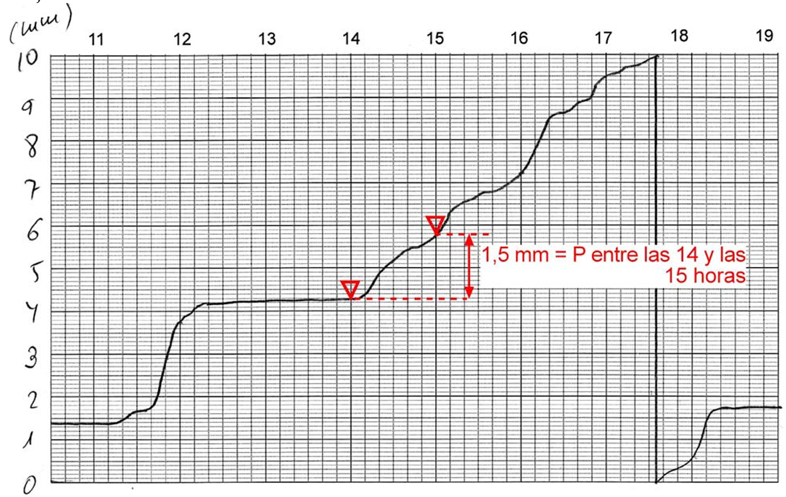
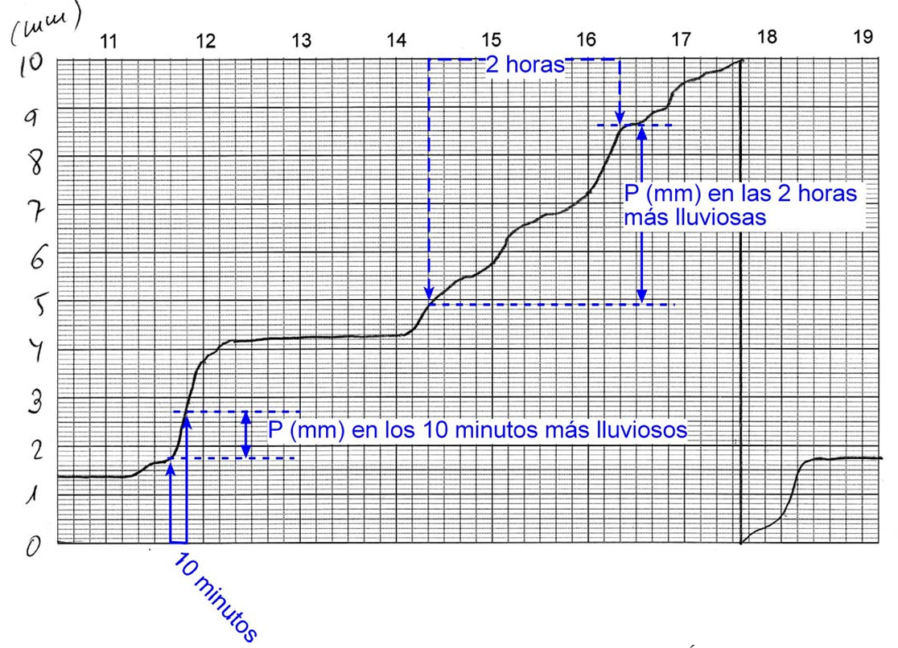
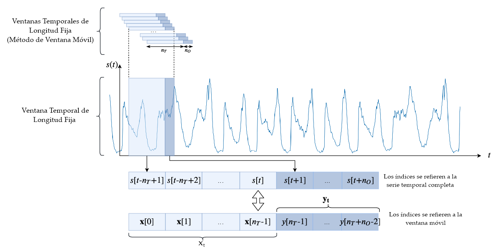
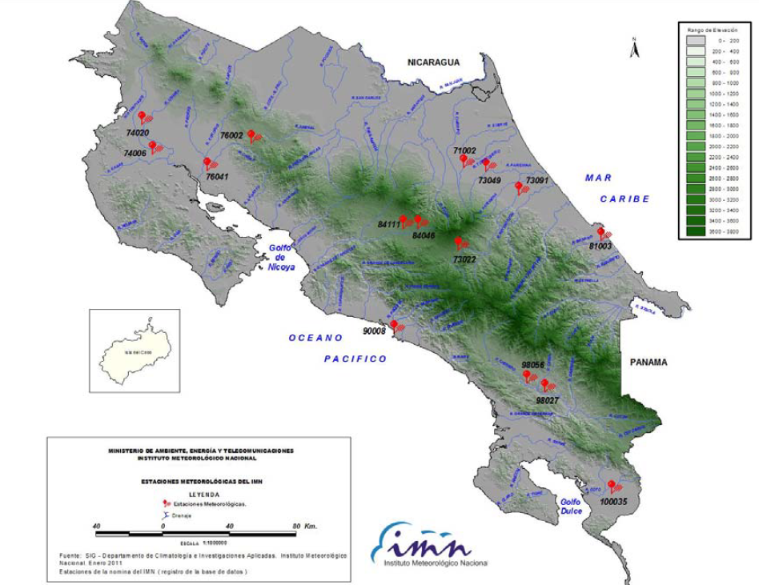
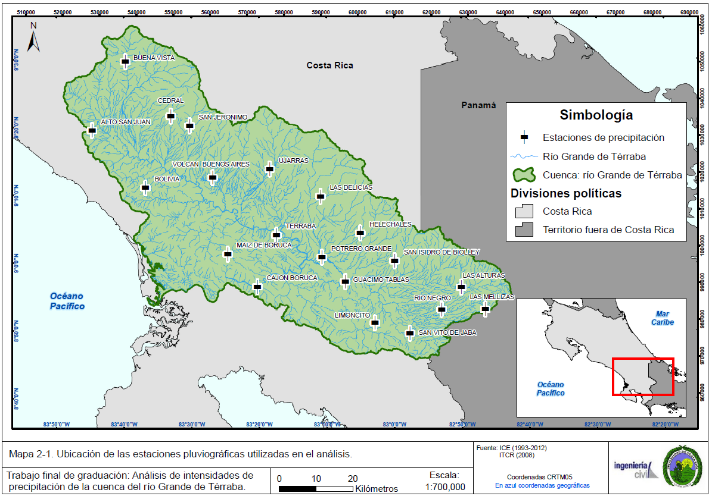

::: {.quote-block}
“La lluvia ligera suele tener duración larga, pero las grandes tempestades son repentinas.”\
— *William Shakespeare (Dramaturgo)*
:::

La precipitación extrema constituye uno de los insumos fundamentales en el diseño hidrológico e hidráulico. Obras como alcantarillados pluviales, drenajes urbanos, vertederos, canales y estructuras de control dependen directamente de una correcta caracterización de la intensidad de lluvia asociada a diferentes duraciones y niveles de riesgo.

El análisis Intensidad-Duración-Frecuencia (IDF) permite cuantificar, de forma probabilística, la relación entre la magnitud de la precipitación, el tiempo durante el cual ocurre y su frecuencia de excedencia, proporcionando una base objetiva para el diseño hidrológico.

## Definición de las variables de lluvia

Para comprender y aplicar correctamente el análisis de Intensidad–Duración–Frecuencia (IDF), es indispensable definir con precisión los tres parámetros fundamentales que caracterizan una tormenta de diseño. Estos parámetros describen no solo la magnitud de la precipitación, sino también su comportamiento temporal y su probabilidad de ocurrencia, constituyendo la
base conceptual de la hidrología de diseño.

1. **Intensidad de la precipitación $(i)$**

La intensidad de la precipitación se define como la tasa temporal de lluvia, es decir, la profundidad de agua precipitada por unidad de tiempo. Matemáticamente, puede expresarse como

$$
i = \frac{h}{\Delta t},
$$

donde $h$ es la lámina de precipitación acumulada y $\Delta t$ es la duración del intervalo considerado. Sus unidades habituales son milímetros por hora $(\text{mm/h})$ o pulgadas por hora.

En hidrología aplicada, el interés no radica en la intensidad promedio de toda la tormenta, sino en la intensidad máxima asociada a un intervalo crítico de duración específica.
Esta intensidad máxima controla directamente procesos como la escorrentía superficial, la capacidad hidráulica de drenajes urbanos y el dimensionamiento de obras de control de avenidas. A medida que la duración considerada disminuye, la intensidad máxima tiende a incrementarse, reflejando la naturaleza altamente concentrada de los eventos convectivos
intensos.

2. **Duración de la precipitación $(d)$**

La duración corresponde al intervalo de tiempo durante el cual se acumula la precipitación. Puede definirse como el tiempo total de una tormenta o, más comúnmente en análisis IDF, como una ventana temporal fija sobre la cual se evalúa la lluvia máxima acumulada. Los valores típicos de duración abarcan desde pocos minutos hasta varias horas, dependiendo del tipo de cuenca y del diseño de ingeniería para el cual es considerado.

Desde el punto de vista hidrológico, la duración está estrechamente relacionada con el tiempo de respuesta de la cuenca. Duraciones cortas suelen ser críticas en cuencas pequeñas y sistemas urbanos, mientras que duraciones largas resultan más relevantes en cuencas extensas. La selección adecuada de $\Delta t$ garantiza que la intensidad estimada sea físicamente consistente con el proceso de generación de escorrentía.

3. **Frecuencia y periodo de retorno $(T)$**

La frecuencia de ocurrencia de un evento de lluvia se expresa usualmente mediante el periodo de retorno $T$, definido como el tiempo promedio, en años, entre ocurrencias sucesivas de eventos cuya magnitud es igualada o superada. Desde un enfoque probabilístico, el periodo de retorno se relaciona con la probabilidad anual de excedencia $p$ mediante

$$
p = \frac{1}{T}.
$$

Así, una tormenta con $T = 50$ años posee una probabilidad anual de excedencia de $p = 1/50 = 0.02$, lo que implica un $2\%$ de probabilidad de ser igualada o superada en cualquier año dado. Es fundamental enfatizar que el periodo de retorno no implica que el evento ocurra regularmente cada $T$ años, sino que describe un comportamiento promedio
en el largo plazo.

## Integración de las variables en el análisis IDF

Las curvas IDF sintetizan la relación funcional entre intensidad $(i)$, duración $(d)$ y frecuencia $(T)$, permitiendo estimar intensidades de diseño coherentes para distintos escenarios hidrológicos. Conceptualmente, estas curvas reflejan que:

- Para un periodo de retorno fijo, la intensidad disminuye al aumentar la duración.
- Para una duración fija, la intensidad aumenta al incrementarse el periodo de retorno.
- La relación entre las tres variables es no lineal y depende de las características
  climáticas regionales.

Comprender en profundidad estas definiciones permite al ingeniero interpretar correctamente las curvas IDF, seleccionar valores de diseño realistas y evaluar con criterio técnico los riesgos hidrológicos asociados a eventos extremos de precipitación.

```{r}
#| label: fig-idf_ggplot_turbo
#| fig-cap: "Curvas Intensidad-Duración-Frecuencia."
#| fig-align: center
#| out-width: 100%
#| class: fig-border

library(tidyverse)
library(viridis)

Dur_min <- seq(5, 120, by = 5)
T_anios <- c(2, 5, 10, 25, 50, 100, 200)

k <- 1800
m <- 0.18
b <- 10
c <- 0.72

idf <- expand_grid(
  `Duración (min)` = Dur_min,
  `T (años)` = T_anios
) %>%
  mutate(
    aT = k * (`T (años)`^m),
    `Intensidad (mm/h)` = aT / ((`Duración (min)` + b)^c),
    `T (años)` = factor(`T (años)`, levels = T_anios)
  )

ggplot(idf, aes(x = `Duración (min)`, y = `Intensidad (mm/h)`, color = `T (años)`)) +
  geom_line(linewidth = 1.1) +
  scale_color_viridis_d(option = "turbo", end = 0.98) +
  scale_x_continuous(breaks = seq(0, 120, by = 15), limits = c(0, 120), expand = c(0, 0)) +
  scale_y_continuous(breaks = seq(0, 700, by = 50), limits = c(0, 700), expand = c(0, 0)) +
  labs(
    title = "         Curvas IDF",
    x = "Duración (min)",
    y = "Intensidad (mm/h)",
    color = "T (años)"
  ) +
  theme(
    plot.title.position = "plot",
    panel.grid.minor = element_blank(),
    legend.position = "right"
  )

```


**Duración de la precipitación**

La duración representa el intervalo temporal continuo durante el cual se evalúa la precipitación acumulada o, de forma equivalente, la intensidad media asociada a dicho intervalo. En el contexto del análisis Intensidad–Duración–Frecuencia (IDF), la duración no se define de manera arbitraria, sino que responde a escalas hidrológicamente relevantes para el diseño y análisis de obras hidráulicas.

En la práctica ingenieril, se emplean duraciones normalizadas que permiten comparar resultados entre regiones y estudios. Un conjunto típico de duraciones es:

$$
d \in \{5, 10, 15, 30, 60, 120, 360, 720, 1440\}\ \text{min},
$$

las cuales cubren desde tormentas muy cortas (asociadas a drenaje urbano y escorrentía rápida) hasta eventos de larga duración (relevantes para cuencas grandes y análisis de almacenamiento).

Desde un punto de vista físico, la duración controla el volumen total de lluvia y la forma del hietograma. Una misma tormenta puede presentar intensidades muy altas en intervalos cortos, pero intensidades medias significativamente menores cuando se promedia sobre intervalos más largos.

**Efecto de la duración sobre la intensidad**

Existe una relación inversa y sistemática entre la duración $\Delta t$ y la intensidad promedio $i$. Matemáticamente, esta relación se expresa de forma general como una función decreciente:

$$
i = f(\Delta t), \qquad \frac{\partial i}{\partial \Delta t} < 0.
$$

Esto implica que, a medida que la duración aumenta, la intensidad promedio disminuye. Este comportamiento refleja la estructura temporal interna de las tormentas:

- En duraciones cortas, la intensidad está dominada por núcleos convectivos intensos y altamente concentrados en el tiempo.
- En duraciones largas, la intensidad promedio incorpora periodos de lluvia típicamente estratigráfica o intermitente, reduciendo el valor medio.

Desde el punto de vista hidrológico, esta propiedad es fundamental, ya que los procesos de generación de escorrentía, inundación urbana y erosión responden de forma distinta según la escala temporal de la lluvia considerada.

**Frecuencia y periodo de retorno**

La frecuencia describe cuán a menudo se espera que ocurra un evento de precipitación de determinada magnitud. En hidrología se expresa usualmente mediante el periodo de retorno $T$, definido como el inverso de la probabilidad anual de excedencia $p$:

$$
T = \frac{1}{p}.
$$

Equivalentemente, la probabilidad anual de que un evento con periodo de retorno $T$ sea igualado o superado en un año cualquiera es:

$$
p = \frac{1}{T}.
$$

Es importante enfatizar, como se ha mencionado en anteriores ocasiones, que el periodo de retorno no implica periodicidad determinista. Un evento con $T=50$ años no ocurre necesariamente cada 50 años, sino que tiene una probabilidad anual de excedencia del $2\%$. En años consecutivos pueden ocurrir eventos extremos de igual o mayor magnitud, o bien puede transcurrir un largo periodo sin que se observe ninguno.

**Interacción duración–frecuencia**

Para una duración fija $\Delta t$, intensidades mayores están asociadas a periodos de retorno más grandes. De forma análoga, para un mismo periodo de retorno $T$, las intensidades disminuyen al aumentar la duración. Esta doble dependencia se resume conceptualmente como:

$$
i = f(\Delta t, T),
$$

donde $i$ aumenta con $T$ y disminuye con $\Delta t$. Esta relación constituye la base conceptual de las curvas IDF y permite al hidrólogo traducir información estadística de precipitaciones extremas en criterios cuantitativos de diseño.

**Forma general de las curvas IDF**

Tal y como se observó en la @fig-idf_ggplot_turbo, las curvas IDF presentan características estructurales que se repiten de forma consistente en distintas regiones climáticas:

- Intensidades decrecientes con la duración, lo que se traduce gráficamente en curvas descendentes cuando $i$ se representa frente a $d$.
- Intensidades crecientes con el periodo de retorno, de modo que, para una misma duración, las curvas asociadas a mayores valores de $T$ se sitúan sistemáticamente por encima de las correspondientes a valores menores.
- Comportamiento suavemente no lineal, que se aproxima a relaciones lineales cuando se utilizan escalas logarítmicas para la duración y, en muchos casos, para la intensidad.

Estas propiedades permiten representar las curvas IDF mediante familias de curvas aproximadamente paralelas en diagramas semilogarítmicos o log–log, facilitando la interpolación y extrapolación controlada de valores.

## Procesamiento de Datos Pluviográficos

Para dominar la construcción de curvas Intensidad–Duración–Frecuencia (IDF), el hidrólogo debe transformar registros pluviográficos brutos en información estadística estructurada y físicamente coherente. Este proceso constituye uno de los pasos más delicados del análisis hidrológico, pues de su correcta ejecución depende directamente la confiabilidad de las intensidades de diseño utilizadas en obras de drenaje, control de inundaciones y planeamiento urbano.

Los pluviógrafos proporcionan un registro continuo de la precipitación acumulada en función del tiempo, conocido como pluviograma. Este tipo de registro permite observar no solo la cantidad total de lluvia, sino también la evolución temporal del evento, la identificación de pulsos intensos y la variabilidad intra–tormenta. A diferencia de los pluviómetros convencionales, que solo entregan acumulados diarios, los pluviógrafos constituyen la fuente indispensable para el análisis de intensidades extremas.

**Lectura y digitalización de bandas pluviográficas**

Históricamente, los registros pluviográficos se obtenían en forma de bandas de papel donde la precipitación acumulada se representaba como una curva continua. La primera tarea del analista consistía en interpretar gráficamente estas bandas, identificando cambios de pendiente asociados a variaciones de intensidad. En la actualidad, estos registros suelen encontrarse digitalizados o pueden ser convertidos mediante escáneres y software de digitalización, lo que permite trabajar directamente con series temporales discretas de precipitación acumulada o incremental.

Independientemente del formato, el principio fundamental es el mismo: se dispone de una función acumulada de precipitación $P(t)$, definida en intervalos de tiempo suficientemente pequeños (por ejemplo, 1, 5 o 10 minutos), que representa la materia prima para el análisis posterior.

A continuación, se muestra un ejemplo de lectura de bandas pluviográficas para estimación de hietogramas e intensidades de precipitación.


::: {.callout-note title="Ejemplo. (Tomando de [Universidad de Salamanca, 2025])"}
A partir de la siguiente banda de pluviógrafo, estime el hietograma con intervalos de $\Delta t=1\ hr$ y dibujar la curva de intensidad-duración del evento registrado.

- Paso 1. Lectura de acumulados en intervalos de 1 hora.

```{r}
#| label: fig-idf1
#| fig-cap: "Lectura de volúmenes acumulados en cada periodo de 1 hora."
#| fig-align: center
#| out-width: 100%
#| echo: false
#| class: fig-border



```

Ejemplo de lectura de la banda:

$$
P_{\{15\ h \ - 14 \ h\} }= 5.8 \text{ mm} - 4.3 \text{ mm} = 1.5 \text{ mm}
$$

Este mismo procedimiento se realiza para toda la duración de la tormenta registrada.

$$
P_{\{12\ h \ - 11 \ h\} }= 3.8 \text{ mm} - 1.4 \text{ mm} = 2.4 \text{ mm}
$$

$$
P_{\{13\ h \ - 12 \ h\} }= 4.2 \text{ mm} - 3.8 \text{ mm} = 0.4 \text{ mm}
$$

$$
P_{\{14\ h \ - 13 \ h\} }= 4.3\text{ mm} - 4.2 \text{ mm} = 0.1 \text{ mm}
$$

$$
P_{\{15\ h \ - 14 \ h\} }= 5.8 \text{ mm} - 4.3 \text{ mm} = 1.5 \text{ mm}
$$

$$
P_{\{16\ h \ - 15 \ h\} }= 7.2 \text{ mm} - 5.8 \text{ mm} = 1.4 \text{ mm}
$$


$$
P_{\{17\ h \ - 16 \ h\} }= 9.5 \text{ mm} - 7.2 \text{ mm} = 2.3 \text{ mm}
$$

$$
P_{\{18\ h \ - 17 \ h\} }= 0.6_{\text{(sifón)}} \text{ mm} - 9.5 \text{ mm} =  10.6 \text{ mm} - 9.5 \text{ mm} = 1.1 \text{ mm}
$$

$$
P_{\{19\ h \ - 18 \ h\} }= 1.8 \text{ mm} - 0.6 \text{ mm} = 1.2 \text{ mm}
$$

```{r}
#| label: tbl-valores_hieto_banda
#| tbl-cap: "Pulsos de precipitación por hora."
#| echo: false
#| message: false
#| warning: false

library(tidyverse)
library(kableExtra)

# ------------------------------------------------------------
# Tabla resumen del evento de precipitación (banda pluviográfica)
# ------------------------------------------------------------
tabla_evento <- tibble(
  `Intervalo horario` = c(
    "11–12", "12–13", "13–14", "14–15",
    "15–16", "16–17", "17–18", "18–19"
  ),
  `Precipitación incremental (mm)` = c(
    2.4, 0.4, 0.1, 1.5,
    1.4, 2.3, 1.1, 1.2
  )
) %>%
  mutate(
    `Precipitación incremental (mm)` =
      round(`Precipitación incremental (mm)`, 2)
  )

# ------------------------------------------------------------
# Presentación con kableExtra
# ------------------------------------------------------------
tabla_evento %>%
  kbl(
    booktabs = TRUE,
    format = "html",
    align = c("c", "c"),
    col.names = c(
      "Intervalo horario",
      "Precipitación incremental (mm)"
    ),
    escape = FALSE) %>%
  kable_classic(html_font = "Latin Modern Roman") %>%
  kable_styling(
    full_width = FALSE,
    bootstrap_options = c("hover", "condensed", "striped")
  ) %>%
  row_spec(0, bold = TRUE)

```


```{r message=FALSE, warning=FALSE, error=FALSE}
#| label: fig-plot_idfbanda
#| fig-cap: "Hietograma asociado a la tormenta registrada."
#| class: fig-border

library(tidyverse)

# ------------------------------------------------------------
# Datos del pluviograma (precipitación incremental por hora)
# ------------------------------------------------------------
hietograma <- tibble(
  Hora = c(
    "11–12", "12–13", "13–14", "14–15",
    "15–16", "16–17", "17–18", "18–19"
  ),
  `Precipitación (mm)` = c(
    2.4, 0.4, 0.1, 1.5,
    1.4, 2.3, 1.1, 1.2
  )
) %>%
  mutate(
    Hora = factor(Hora, levels = Hora)
  )

# ------------------------------------------------------------
# Gráfico de hietograma
# ------------------------------------------------------------
ggplot(hietograma, aes(x = Hora, y = `Precipitación (mm)`)) +
  geom_col(
    fill = "#1f78b4",
    width = 0.75
  ) +
  scale_y_continuous(
    breaks = seq(0, 2.5, by = 0.5),
    minor_breaks = seq(0, 2.5, by = 0.1),
    expand = c(0, 0.1)
  ) +
  labs(
    title = "Hietograma horario a partir de banda pluviográfica",
    x = "Intervalo horario",
    y = "Precipitación (mm)"
  ) +
  theme(
    plot.title.position = "plot",
    panel.grid.major.y = element_line(color = "grey70", linewidth = 0.4),
    panel.grid.minor.y = element_line(color = "grey85", linewidth = 0.25),
    panel.grid.minor.x = element_blank()
  )
```

Después se discretiza la banda en intervalos de $\Delta t=\{10,20,30,60,120,180 \}$ min para dentro de cada intervalo definido determinar el tramo de mayor pendiente, es decir, la mayor concentración de volumen para cumplir con la definición de intensidad:

$$
i = \frac{h}{\Delta t},
$$

```{r}
#| label: fig-idf2
#| fig-cap: "Lectura de intensidades de precipitación para cada intervalo de duración definido."
#| fig-align: center
#| out-width: 100%
#| echo: false
#| class: fig-border



```

```{r}
#| label: tbl-valores_intensidad
#| tbl-cap: "Volúmenes de máxima precipitación para cada intervalo de duración definido."
#| echo: false
#| message: false
#| warning: false

library(tidyverse)
library(kableExtra)

tabla_intervalos <- tibble(
  `Duración (min)` = c(
    "10",
    "20",
    "30",
    "60",
    "120",
    "180"
  ),
  `Duración (h)` = c(
    "0.16667",
    "0.33333",
    "0.5",
    "1",
    "2",
    "3"
  ),
  `P (mm)` = c(
    1.2,
    1.9,
    2.2,
    2.8,
    3.6,
    5.2
  )
)

tabla_intervalos %>%
  kbl(
    booktabs = TRUE,
    format = "html",
    align = c("c", "c", "c"),
    col.names = c("Duración (min)","Duración (h)" ,"P (mm)"),
    escape = FALSE
  ) %>%
  kable_classic(
    html_font = "Latin Modern Roman"
  ) %>%
  kable_styling(
    full_width = FALSE,
    bootstrap_options = c("hover", "condensed", "striped")
  ) %>%
  row_spec(0, bold = TRUE)

```

una vez definidos lo máximos volúmenes de precipitación para cada intervalo de duración $\Delta t$ definido, se procede a estimar para cada duración, la intensidad en mm/h. 

**Ejemplo de estimación de intensidad para $\Delta t= 10 \text{ min}$.**

$$
i = \frac{h}{\Delta t} = \frac{1.2 \text{ mm}}{0.17 \text{ h}} = 7.2 \text{ mm/h}
$$

**Ejemplo de estimación de intensidad para $\Delta t= 120 \text{ min}$.**

$$
i = \frac{h}{\Delta t} = \frac{3.6 \text{ mm}}{2 \text{ h}} = 1.8 \text{ mm/h}
$$


Por lo que al final se obtiene para cada duración, una intensidad definida.

```{r}
#| label: tbl-valores_intensidad2
#| tbl-cap: "Máximas intensidades de precipitación para cada intervalo de duración definido."
#| echo: false
#| message: false
#| warning: false

library(tidyverse)
library(kableExtra)

tabla_intervalos <- tibble(
  `Duración (min)` = c(
    "10",
    "20",
    "30",
    "60",
    "120",
    "180"
  ),
  `Duración (h)` = c(
    "0.16667",
    "0.33333",
    "0.5",
    "1",
    "2",
    "3"
  ),
  `P (mm)` = c(
    1.2,
    1.9,
    2.2,
    2.8,
    3.6,
    5.2
  ),
  `I (mm/h)`=c(
    7.2,
    5.7,
    4.4,
    2.8,
    1.8,
    1.7
  )
)

tabla_intervalos %>%
  kbl(
    booktabs = TRUE,
    format = "html",
    align = c("c", "c", "c", "c"),
    col.names = c("Duración (min)","Duración (h)" ,"P (mm)", "I (mm/h)"),
    escape = FALSE
  ) %>%
  kable_classic(
    html_font = "Latin Modern Roman"
  ) %>%
  kable_styling(
    full_width = FALSE,
    bootstrap_options = c("hover", "condensed", "striped")
  ) %>%
  row_spec(0, bold = TRUE)

```

A partir de la información anterior, se procede a generar la curva IDF asociada al evento de precipitación registrado en la banda pluviográfica.

```{r message=FALSE, warning=FALSE, error=FALSE}
#| label: fig-plot_idfbanda2
#| fig-cap: "Curva IDF asociada a la tormenta registrada."
#| class: fig-border

library(tidyverse)

library(tidyverse)

tabla_intervalos <- tibble(
  `Duración (min)` = c("10","20","30","60","120","180"),
  `Duración (h)` = c("0.16667","0.33333","0.5","1","2","3"),
  `P (mm)` = c(1.2, 1.9, 2.2, 2.8, 3.6, 5.2),
  `I (mm/h)` = c(7.2, 5.7, 4.4, 2.8, 1.8, 1.7)
) %>%
  mutate(
    `Duración (min)` = as.numeric(`Duración (min)`),
    `Duración (h)` = as.numeric(`Duración (h)`),
    `P (mm)` = as.numeric(`P (mm)`),
    `I (mm/h)` = as.numeric(`I (mm/h)`)
  )

idf_evento <- tabla_intervalos %>%
  arrange(`Duración (min)`)

d_grid <- seq(
  min(idf_evento$`Duración (min)`),
  max(idf_evento$`Duración (min)`),
  length.out = 400
)

idf_suave <- tibble(`Duración (min)` = d_grid) %>%
  mutate(
    `I (mm/h)` = approx(
      x = idf_evento$`Duración (min)`,
      y = idf_evento$`I (mm/h)`,
      xout = `Duración (min)`,
      method = "linear",
      rule = 2
    )$y
  )

ggplot() +
  geom_line(
    data = idf_suave,
    aes(x = `Duración (min)`, y = `I (mm/h)`),
    linewidth = 1.1,
    color = "#009ACD"
  ) +
  geom_point(
    data = idf_evento,
    aes(x = `Duración (min)`, y = `I (mm/h)`),
    size = 3.2,
    shape = 18,
    color = "#0B2C8A"
  ) +
  scale_x_continuous(
    breaks = c(10, 20, 30, 60, 120, 180),
    limits = c(0, 180),
    expand = c(0, 2)
  ) +
  scale_y_continuous(
    breaks = seq(0, 8, by = 1),
    limits = c(0, 8),
    expand = c(0, 0)
  ) +
  labs(
    title = "Curva Intensidad–Duración (evento)",
    x = "Duración (min)",
    y = "I (mm/h)"
  ) +
  theme(
    plot.title.position = "plot",
    panel.grid.minor = element_blank()
  )

```

:::


**Extracción de máximos mediante ventanas móviles**

El paso central del procesamiento pluviográfico es la extracción sistemática de máximos de precipitación para duraciones predefinidas. Este procedimiento se basa en el concepto de ventana móvil. Para una duración $d$, se desplaza un intervalo temporal de longitud $d$ a lo largo de todo el registro de una tormenta, calculando en cada posición la precipitación acumulada dentro de dicha ventana. 

```{r}
#| label: fig-rollingwindow
#| fig-cap: "Planteamiento algebráico de la ventana móvil."
#| fig-align: center
#| out-width: 100%
#| echo: false
#| class: fig-border



```

Matemáticamente, si $P(t)$ representa la precipitación acumulada, la altura asociada a la ventana que inicia en $t$ es:

$$
h_d(t) = P(t+d) - P(t).
$$

El máximo de $h_d(t)$ sobre toda la tormenta define la mayor altura de lluvia asociada a la duración $d$ para ese evento. Este procedimiento se repite para todas las duraciones estándar de interés, típicamente:

$$
d \in \{5, 10, 15, 30, 45, 60, 90, 120, 180, 360, 720, 1440\}\ \text{min}.
$$

Para cada año hidrológico, se selecciona el valor máximo absoluto de $h_d(t)$ correspondiente a cada duración. De esta forma se construyen las Series de Máximos Anuales (AMS) para cada duración, las cuales constituyen la base clásica del análisis IDF. 


```{r message=FALSE, warning=FALSE, error=FALSE}
#| label: fig-plot_idfbanda3
#| fig-cap: "Ventana móvil para diferentes duraciones."
#| class: fig-border
library(tidyverse)

set.seed(123)

tiempo_min <- seq(0, 180, by = 5)

precip_incremental <- c(
  0, 0, 0.2, 0.4, 0.8, 1.5, 1.2, 0.6, 0.3,
  0.1, 0, 0, 0.4, 0.9, 1.3, 0.8, 0.4,
  0.2, 0, 0, 0.1, 0.2, 0, 0, 0, 0,
  0, 0, 0, 0, 0, 0, 0, 0, 0, 0, 0
)

precip_acum <- cumsum(precip_incremental)

pluvio <- tibble(
  t = tiempo_min,
  P = precip_acum
)

duraciones <- c(10, 45)

colores <- tibble(
  dur_label = paste0("d = ", duraciones, " min"),
  col = c("#33a02c", "#6a3d9a")
)

ventanas <- purrr::map_dfr(duraciones, function(d){
  k <- as.integer(d / 5)

  tmp <- pluvio %>%
    mutate(
      d = d,
      dur_label = paste0("d = ", d, " min"),
      P_t_d = dplyr::lead(P, n = .env$k),
      h_d = P_t_d - P
    )

  t_max <- tmp$t[which.max(tmp$h_d)]
  h_max <- max(tmp$h_d, na.rm = TRUE)

  tmp %>%
    mutate(
      t_max = t_max,
      h_max = h_max
    )
}) %>%
  left_join(colores, by = "dur_label")

rect_data <- ventanas %>%
  distinct(d, dur_label, t_max, col) %>%
  mutate(
    xmin = t_max,
    xmax = t_max + d
  )

seg_data <- ventanas %>%
  distinct(d, dur_label, t_max, col) %>%
  mutate(
    x = t_max,
    xend = t_max + d,
    y = pluvio$P[match(t_max, pluvio$t)],
    yend = pluvio$P[match(t_max + d, pluvio$t)]
  )

label_data <- ventanas %>%
  distinct(d, dur_label, col) %>%
  mutate(
    x = 5,
    y1 = max(pluvio$P) * 0.92,
    y2 = max(pluvio$P) * 0.84,
    txt1 = paste0("Ventana móvil (", dur_label, ")"),
    txt2 = "h[d](t) = P(t + d) - P(t)"
  )

ggplot(ventanas, aes(x = t, y = P)) +
  geom_line(linewidth = 1.1, color = "#1f78b4") +
  geom_rect(
    data = rect_data,
    aes(xmin = xmin, xmax = xmax, ymin = -Inf, ymax = Inf, fill = dur_label),
    alpha = 0.14,
    inherit.aes = FALSE
  ) +
  geom_segment(
    data = seg_data,
    aes(x = x, xend = xend, y = y, yend = yend, color = dur_label),
    linewidth = 1.2,
    inherit.aes = FALSE
  ) +
  geom_text(
    data = label_data,
    aes(x = 90, y = 5, label = txt1, color = dur_label),
    hjust = 0,
    size = 4,
    inherit.aes = FALSE
  ) +
  facet_wrap(~ dur_label, ncol = 1) +
  scale_x_continuous(
    breaks = seq(0, 180, by = 30),
    expand = c(0, 0)
  ) +
  scale_fill_manual(
    values = setNames(colores$col, colores$dur_label),
    guide = "none"
  ) +
  scale_color_manual(
    values = setNames(colores$col, colores$dur_label),
    guide = "none"
  ) +
  labs(
    x = "Tiempo (min)",
    y = "Precipitación acumulada (mm)"
  ) +
  theme(
    plot.title.position = "plot",
    panel.grid.minor = element_blank(),
    strip.text = element_text(face = "bold")
  )

```

 
**Control de calidad y consistencia hidrológica**

Antes de proceder al análisis estadístico, es imprescindible realizar controles de calidad sobre las series extraídas. Estos incluyen la verificación de valores atípicos, la consistencia temporal de los registros, la detección de errores instrumentales y la coherencia física entre duraciones. 

Con las series de intensidades máximas preparadas, se realiza el análisis de frecuencia con el objetivo de relacionar la magnitud de la intensidad con su probabilidad de ocurrencia o su periodo de retorno $T$. Existen dos enfoques principales para la selección de datos extremos:

Series de Máximos Anuales (AMS), donde se utiliza un solo valor extremo por año, adecuadas para periodos de retorno moderados y grandes.

Series de Duraciones Parciales (PDS o POT), donde se consideran todos los eventos que superan un umbral predefinido, permitiendo capturar múltiples tormentas severas en un mismo año.

Para asignar probabilidades empíricas, los datos se ordenan de mayor a menor y se utiliza una posición de graficación. La fórmula de Weibull es ampliamente aceptada y se expresa como:

$$
P = \frac{m}{n+1},
\qquad
T = \frac{1}{P} = \frac{n+1}{m},
$$

donde $m$ es el orden del dato y $n$ el tamaño de la muestra.

**Ajuste a distribuciones teóricas**

Las intensidades empíricas se ajustan posteriormente a distribuciones de probabilidad teóricas con el fin de extrapolar valores asociados a periodos de retorno mayores que la longitud del registro. Entre las distribuciones más utilizadas se encuentran la Gumbel, la Log-Pearson Tipo III y la GEV. Cada una presenta supuestos y grados de flexibilidad distintos, siendo la elección dependiente de la asimetría de los datos, la longitud del registro y los criterios normativos.

Un método ampliamente utilizado para estimar cuantiles de diseño es el de los factores de frecuencia, propuesto por Ven Te Chow, expresado como:

$$
X_T = \bar{X} + K_T\,S,
$$

Al completar este proceso para cada duración, se obtiene un conjunto de intensidades de diseño $i(d,T)$ que permiten construir la familia de curvas IDF o ajustar una ecuación general que describa el comportamiento extremo de la precipitación en la región de estudio. Este encadenamiento riguroso, desde el registro pluviográfico hasta el modelo estadístico final, es lo que distingue un análisis IDF preliminar de un estudio hidrológico de nivel profesional.


## Expresión funcional típica

A partir de observaciones empíricas y fundamentos teóricos, se han propuesto múltiples expresiones analíticas para aproximar la relación IDF. Una forma genérica ampliamente utilizada es

$$
i(d,T) = \frac{a(T)}{(d + b)^{c}},
$$

Donde:

- $a(T)$ es una función creciente del periodo de retorno.

- $d$ es la duración del evento de precipitación.

- $b$, $c$ son parámetros que controlan la curvatura y la escala temporal. Esta estructura funcional refleja explícitamente la disminución de la intensidad con la duración y permite incorporar el efecto probabilístico del periodo de retorno.

Otras formulaciones expresan $a(T)$ como una función logarítmica o potencial de $T$, reforzando la interpretación estadística del fenómeno.

**Significado hidrológico y estadístico**

Desde el punto de vista estadístico, las curvas IDF representan cuantiles extremos de la distribución de precipitación acumulada en distintas ventanas temporales. Cada punto de una curva IDF corresponde a un cuantil asociado a una probabilidad de excedencia $p=1/T$.

Desde el punto de vista hidrológico, estas curvas constituyen una herramienta de síntesis que permite integrar información de miles de eventos de lluvia en un conjunto reducido de relaciones funcionales, adecuadas para el diseño y la toma de decisiones.

Un entendimiento profundo de la relación IDF implica reconocer que estas curvas no son leyes universales, sino modelos empíricos condicionados por:

- La longitud y calidad del registro de datos.
- La resolución temporal de la precipitación observada.
- El régimen climático y los mecanismos dominantes de generación de tormentas.
- Los métodos estadísticos utilizados para la estimación de extremos.

Comprender estas limitaciones es lo que distingue a un usuario principiante de un analista experto, capaz de interpretar, aplicar y cuestionar adecuadamente las curvas IDF en contextos reales de ingeniería hidrológica.

## Ecuación general simultánea de curvas IDF 

Una forma funcional ampliamente utilizada en la práctica profesional para representar, de manera simultánea, el efecto de la duración $d$ y del periodo de retorno $T$ sobre la intensidad de precipitación $i$ es la ecuación tipo potencia con desplazamiento temporal:

$$
i(d,T)=\frac{k\,T^{m}}{(d+c)^{n}}.
$$

En esta expresión:

- $i$ es la intensidad media máxima asociada a la duración $d$ y al periodo de retorno $T$ (típicamente en $\text{mm/h}$).
- $T$ es el periodo de retorno (años), con probabilidad anual de excedencia $p=1/T$.
- $d$ es la duración (min u horas, según convención; debe usarse una sola unidad de forma consistente).
- $k,m,n,c$ son parámetros de ajuste que dependen del clima local, la dinámica de tormentas, el régimen convectivo/estratiforme y la escala temporal del registro.

**Interpretación hidrológica de los parámetros:**

- $m>0$ controla el crecimiento de $i$ con $T$ (eventos más raros $\Rightarrow$ mayores intensidades).
- $n>0$ controla la rapidez con la que $i$ decrece con $d$ (tormentas cortas $\Rightarrow$ intensidades más altas).
- $c\ge 0$ desplaza la duración para estabilizar el comportamiento en duraciones muy cortas; evita que el modelo explote cuando $d\to 0$ y captura efectos de resolución temporal, discretización y estructura interna de la tormenta.
- $k$ fija la escala global de intensidades en el sitio.

Un aspecto clave es que esta ecuación describe intensidades de diseño, es decir, cuantiles extremos estimados para cada combinación $(d,T)$. Por ello, su calibración debe realizarse sobre intensidades máximas por duración (por ejemplo, máximos anuales por cada $d$) o mediante POT a nivel subdiario, según el enfoque adoptado.

**Formas empíricas comunes como casos particulares**

Existen variantes históricas que pueden interpretarse como simplificaciones del modelo general:

1) Forma tipo Talbot (hiperbólica desplazada)

$$
i(d)=\frac{a}{d+b},
$$

donde $a>0$ y $b>0$ se ajustan para un $T$ fijo. Esta forma suele funcionar razonablemente en duraciones cortas a medias, con curvatura evidente.

2) Forma tipo Montana (potencia)

$$
i(d)=a\,d^{-b},
$$

donde $a>0$ y $b>0$. En escala log–log, $\log i$ vs. $\log d$ es aproximadamente lineal, por lo que resulta útil en rangos donde la relación potencia es adecuada (frecuentemente para duraciones medias a largas, dependiendo del clima y del instrumento).

3) Forma tipo Wenzel (potencia con desplazamiento)

$$
i(d)=\frac{c}{(d+f)^{e}},
$$

que introduce un término de desplazamiento en duración y un exponente para mejorar el ajuste en un rango más amplio.

Estas expresiones pueden verse como modelos por “rebanadas”: se ajustan para cada $T$ (o para cada familia de cuantiles) y luego se integran en una ecuación simultánea donde $T$ aparece explícitamente.

## Determinación de parámetros

La estimación de $(k,m,n,c)$ es un problema de ajuste estadístico. Existen dos rutas principales:

### Ajuste en dos etapas (recomendado cuando se desea control e interpretabilidad)

- <u>Paso 1. Construcción de intensidades de diseño por duración</u>

Para cada duración $d_j$, se calcula una serie de máximos (por ejemplo, máximos anuales de precipitación acumulada en ventana móvil de longitud $d_j$). Luego se convierte a intensidad:

$$
i_{j,t}=\frac{h_{j,t}}{d_j},
$$

donde $h_{j,t}$ es la altura máxima asociada a duración $d_j$ en el año $t$ (en unidades consistentes).

Para cada $d_j$, se ajusta un modelo de extremos (por ejemplo GEV sobre máximos anuales, o GP/POT sobre excedencias) y se estiman cuantiles de intensidad $i(d_j,T)$ para varios $T$.

- <u>Paso 2. Ajuste de la ecuación simultánea sobre la malla $(d_j,T_\ell)$</u>

Se dispone de una tabla de valores objetivo $\{i_{j\ell}\}$, donde

$$
i_{j\ell}\approx i(d_j,T_\ell).
$$

Se ajusta entonces el modelo

$$
i_{j\ell}=\frac{k\,T_\ell^m}{(d_j+c)^n}+\varepsilon_{j\ell}.
$$

Este ajuste puede hacerse por mínimos cuadrados no lineales (NLS) o mediante optimización robusta (por ejemplo, minimizando una función de pérdida menos sensible a valores atípicos).

Una forma útil para facilitar el ajuste es trabajar con logaritmos:

$$
\log i_{j\ell}=\log k + m\log T_\ell - n\log(d_j+c) + \eta_{j\ell}.
$$

Aquí aparece el principal desafío: $c$ está dentro del logaritmo, por lo que el modelo sigue siendo no lineal en $c$. Sin embargo, se puede proceder de manera sistemática:

- elegir un conjunto de candidatos $c\in\mathcal{C}$ (por ejemplo, valores cercanos a 0, resoluciones instrumentales y duraciones cortas),
- para cada $c$, ajustar por regresión lineal

$$
\log i_{j\ell}=\beta_0 + \beta_1\log T_\ell + \beta_2\log(d_j+c),
$$

con identificaciones

$$
\beta_0=\log k,\qquad \beta_1=m,\qquad \beta_2=-n,
$$

- seleccionar el $c$ que minimice el criterio de ajuste (por ejemplo SSE en escala log, AIC, o error relativo promedio),
- recuperar parámetros

$$
\hat{k}=\exp(\hat{\beta}_0),\qquad \hat{m}=\hat{\beta}_1,\qquad \hat{n}=-\hat{\beta}_2,\qquad \hat{c}=c_{\text{óptimo}}.
$$

Este procedimiento ofrece transparencia: se observa cómo cambia el ajuste al variar $c$ y se evita que un optimizador “oculte” problemas de identificabilidad.

- <u>Paso 3. Verificación técnica del ajuste</u>

Un ajuste adecuado no termina en un buen $R^2$ en escala log. Es recomendable además verificar:

- coherencia física: $\hat{m}>0$, $\hat{n}>0$, $\hat{c}\ge 0$,
- monotonicidad: para cada $T$, $i(d,T)$ debe decrecer con $d$, y para cada $d$, $i(d,T)$ debe crecer con $T$,
- residuales: inspección de $\eta_{j\ell}$ en función de $d$ y $T$ para detectar sesgos sistemáticos,
- errores relativos:

$$
\text{RE}_{j\ell}=\frac{i_{j\ell}-\hat{i}(d_j,T_\ell)}{i_{j\ell}},
$$

y resúmenes como media absoluta y percentiles.


::: {.callout-note title="Ejemplo"}

Se dispone de una serie sintética de precipitación máxima anual (mm) para una estación (30 años). Se desea ilustrar, en forma compacta, el procedimiento de ajuste de curvas IDF en dos etapas:

1) construir intensidades de diseño $i(d,T)$ para varias duraciones $d$ y periodos de retorno $T$;

2) ajustar el modelo simultáneo

$$
i(d,T)=\frac{k\,T^{m}}{(d+c)^{n}}.
$$

```{r}
#| label: fig-serie_max_anual
#| fig-cap: "Serie sintética de máximos anuales de precipitación (mm)."
#| class: fig-border
library(tidyverse)
library(kableExtra)
library(moments)

set.seed(20260214)

datos <- tibble(
  Año = 1994:2023,
  Pmax = round(rlnorm(30, meanlog = log(120), sdlog = 0.35), 1)
) %>%
  mutate(
    Pmax = pmin(Pmax, 420),
    Pmax = pmax(Pmax, 20)
  )

datos %>%
  kbl(
    booktabs = TRUE,
    format = "html",
    align = c("c","c"),
    col.names = c("Año", "Precipitación máxima anual (mm)"),
    escape = FALSE
  ) %>%
  kable_classic(html_font = "Latin Modern Roman") %>%
  kable_styling(full_width = FALSE, bootstrap_options = c("hover","condensed")) %>%
  row_spec(0, bold = TRUE) %>% 
  scroll_box(width = "700px", height = "500px")
```


```{r}
#| label: fig-serie_mensual_IDF
#| fig-cap: "Serie anual de máximos de precipitación."
#| fig-align: center
#| out-width: 100%
#| class: fig-border
#| echo: false
#| message: false
#| warning: false
ggplot(datos, aes(x = Año, y = Pmax)) +
  geom_line(color = "#1C6BA0") +
  geom_point(color = "#1C6BA0", size = 2) +
  scale_x_continuous(breaks = seq(min(datos$Año), max(datos$Año), by = 3)) +
  labs(
    title = "Serie anual de máximos de precipitación",
    x = "Año",
    y = "Precipitación máxima anual (mm)"
  ) +
  theme(
    plot.title.position = "plot",
    panel.grid.minor = element_blank()
  )
```

El ajuste IDF en dos etapas requiere construir intensidades de diseño por duración:

1) seleccionar un conjunto de duraciones $d\in\{10,20,30,60,120\}$ min (o las que sean normativas);

2) obtener, para cada $d$, la serie de máximos anuales de altura $h_{d,t}$ en ventanas móviles de longitud $d$ (a partir de un pluviógrafo subdiario);

3) convertir a intensidades $i_{d,t}=h_{d,t}/d$ (con unidades consistentes, por ejemplo mm/h);

4) ajustar un modelo de extremos por duración (GEV en AMS o GP en POT) y estimar, para varios $T$, los cuantiles $i(d,T)$;

5) ajustar la ecuación simultánea $i(d,T)=kT^m/(d+c)^n$ usando la malla de valores $(d,T)\mapsto i(d,T)$.

En este ejemplo, para ilustrar la mecánica algebraica de la etapa 2, se construirá directamente una malla sintética $i(d,T)$ coherente (como si fuera el resultado de la etapa 1), y con ella se estimarán $(k,m,n,c)$.


**Paso 1. Malla sintética de intensidades $i(d,T)$**

Se toman duraciones (min) y periodos de retorno (años):

$$
d\in\{10,30,60,120\},\qquad T\in\{2,10,50,100\}.
$$

Para ejemplificar, supóngase que la etapa de extremos por duración produjo la siguiente malla (mm/h):

$$
\begin{array}{c|cccc}
 & T=2 & T=10 & T=50 & T=100\\
\hline
d=10  & 140 & 185 & 245 & 275\\
d=30  &  85 & 112 & 150 & 170\\
d=60  &  60 &  80 & 110 & 125\\
d=120 &  42 &  56 &  78 &  90
\end{array}
$$

Esta tabla cumple las restricciones físicas: para cada $T$, la intensidad decrece con $d$; para cada $d$, la intensidad crece con $T$.

**Paso 2. Linealización (para un $c$ fijo)**

Se parte de

$$
i(d,T)=\frac{k\,T^m}{(d+c)^n}.
$$

Se aplica logaritmo natural:

$$
\log i
=
\log k
+
m\log T
-
n\log(d+c).
$$

Se definen la variable respuesta $y=\log i$ y regresores

$$
x_1=\log T,\qquad x_2=\log(d+c).
$$

Entonces el modelo es lineal:

$$
y=\beta_0+\beta_1x_1+\beta_2x_2,
\qquad
\beta_0=\log k,\ \beta_1=m,\ \beta_2=-n.
$$

**Paso 3. Cálculo manual mínimo con “diferencias” para estimar $m$ y $n$**

- Estimación de $m$ (misma duración, distintos $T$)

Con $d$ fijo, el término $(d+c)^n$ se cancela al tomar razón:

$$
\frac{i(d,T_2)}{i(d,T_1)}=\left(\frac{T_2}{T_1}\right)^m
\quad\Rightarrow\quad
m=\frac{\log\!\left(i(d,T_2)/i(d,T_1)\right)}{\log(T_2/T_1)}.
$$

Ejemplo con $d=60$ min, $T_2=100$, $T_1=10$:

$$
m
=
\frac{\log(125/80)}{\log(100/10)}
=
\frac{\log(1.5625)}{\log(10)}
\approx
\frac{0.4463}{2.3026}
\approx
0.194.
$$

Ejemplo con $d=30$ min, $T_2=50$, $T_1=2$:

$$
m
=
\frac{\log(150/85)}{\log(50/2)}
=
\frac{\log(1.7647)}{\log(25)}
\approx
\frac{0.5686}{3.2189}
\approx
0.177.
$$

Se adopta un valor representativo (promedio simple para el ejemplo):

$$
\hat{m}\approx \frac{0.194+0.177}{2}\approx 0.186.
$$

- Estimación de $n$ (mismo $T$, distintas $d$)

Con $T$ fijo, el término $T^m$ se cancela:

$$
\frac{i(d_1,T)}{i(d_2,T)}
=
\left(\frac{d_2+c}{d_1+c}\right)^n
\quad\Rightarrow\quad
n=\frac{\log\!\left(i(d_1,T)/i(d_2,T)\right)}{\log\!\left((d_2+c)/(d_1+c)\right)}.
$$

Aquí se requiere $c$. Para ilustrar, se prueba $c=5$ min (valor típico ligado a resolución/regularización de duraciones cortas).

Con $T=10$, $d_1=30$, $d_2=120$:

$$
n
=
\frac{\log(112/56)}{\log\!\left((120+5)/(30+5)\right)}
=
\frac{\log(2)}{\log(125/35)}
\approx
\frac{0.6931}{\log(3.5714)}
\approx
\frac{0.6931}{1.2720}
\approx
0.545.
$$

Con $T=50$, $d_1=10$, $d_2=60$:

$$
n
=
\frac{\log(245/110)}{\log\!\left((60+5)/(10+5)\right)}
=
\frac{\log(2.2273)}{\log(65/15)}
\approx
\frac{0.8007}{\log(4.3333)}
\approx
\frac{0.8007}{1.4663}
\approx
0.546.
$$

Consistente. Se adopta:

$$
\hat{n}\approx 0.546,
\qquad
\hat{c}=5\ \text{min}.
$$

- Paso 4. Estimación de $k$ (despeje directo)

Despejando $k$:

$$
k=i(d,T)\,(d+c)^n\,T^{-m}.
$$

Usando, por ejemplo, $d=60$ min, $T=10$, $i=80$ mm/h:

$$
\hat{k}
=
80\,(60+5)^{0.546}\,10^{-0.186}.
$$

Cálculo numérico aproximado:

$$
(65)^{0.546}\approx \exp\!\left(0.546\log 65\right)
=
\exp(0.546\times 4.1744)
=
\exp(2.278)
\approx 9.76,
$$

$$
10^{-0.186}=\exp(-0.186\log 10)=\exp(-0.186\times 2.3026)=\exp(-0.428)\approx 0.652.
$$

Entonces:

$$
\hat{k}\approx 80\times 9.76\times 0.652\approx 509.
$$

Un segundo cálculo (control) con $d=30$, $T=50$, $i=150$:

$$
\hat{k}
=
150\,(35)^{0.546}\,50^{-0.186}.
$$

Aproximaciones:

$$
(35)^{0.546}\approx \exp(0.546\log 35)=\exp(0.546\times 3.555)=\exp(1.942)\approx 6.97,
$$

$$
50^{-0.186}=\exp(-0.186\log 50)=\exp(-0.186\times 3.912)=\exp(-0.728)\approx 0.483.
$$

Entonces:

$$
\hat{k}\approx 150\times 6.97\times 0.483\approx 505.
$$

Se considera que el parámetro es consistente. Se adopta el promedio aritmético:

$$
\hat{k}\approx 507.
$$

{Modelo IDF estimado (ejemplo)}

Con $(\hat{k},\hat{m},\hat{n},\hat{c})\approx(507,\ 0.186,\ 0.546,\ 5)$:

$$
\hat{i}(d,T)=\frac{507\,T^{0.186}}{(d+5)^{0.546}},
\qquad
d\ \text{en min},\ i\ \text{en mm/h}.
$$

```{r}
#| label: fig-idf_ggplot_mako
#| fig-cap: "Curvas Intensidad–Duración–Frecuencia (IDF) estimadas mediante el modelo simultáneo."
#| fig-align: center
#| out-width: 100%
#| class: fig-border

library(tidyverse)
library(viridis)

Dur_min <- seq(5, 120, by = 5)
T_anios <- c(2, 5, 10, 25, 50, 100)

k <- 507
m <- 0.186
n <- 0.546
c <- 5

idf <- expand_grid(
  `Duración (min)` = Dur_min,
  `T (años)` = T_anios
) %>%
  mutate(
    `Intensidad (mm/h)` = k * (`T (años)`^m) / ((`Duración (min)` + c)^n),
    `T (años)` = factor(`T (años)`, levels = T_anios)
  )

ggplot(
  idf,
  aes(
    x = `Duración (min)`,
    y = `Intensidad (mm/h)`,
    color = `T (años)`
  )
) +
  geom_line(linewidth = 1.2) +
  scale_color_viridis_d(option = "C", end = 0.95) +
  scale_x_continuous(
    breaks = seq(0, 120, by = 15),
    limits = c(0, 120),
    expand = c(0, 0)
  ) +
  scale_y_continuous(
    breaks = seq(0, 350, by = 25),
    limits = c(0, 350),
    expand = c(0, 0)
  ) +
  labs(
    title = "Curvas Intensidad–Duración–Frecuencia",
    x = "Duración (min)",
    y = "Intensidad (mm/h)",
    color = "T (años)"
  ) +
  theme(
    plot.title.position = "plot",
    panel.grid.minor = element_blank(),
    legend.position = "right"
  )

```


1) El exponente $\hat{n}\approx 0.55$ indica un decaimiento moderado de la intensidad con la duración; es coherente con tormentas donde la estructura temporal concentra gran parte del volumen en ventanas cortas, pero sin colas extremadamente abruptas.

2) El exponente $\hat{m}\approx 0.19$ refleja que la sensibilidad de la intensidad al periodo de retorno es sub-lineal: al aumentar $T$ en un orden de magnitud, $i$ crece aproximadamente por un factor $10^{0.19}\approx 1.55$ (a duración fija), lo cual es típico en muchos climas donde el crecimiento con la rareza es gradual.

3) El desplazamiento $\hat{c}=5$ min regulariza el comportamiento para duraciones cortas y puede interpretarse como un término operativo asociado a resolución temporal, redondeo de ventanas y limitaciones instrumentales; su selección debe validarse comparando errores en todo el rango de duraciones, priorizando el rango de diseño del proyecto.

4) La consistencia de $\hat{k}$ obtenida por despejes desde distintos pares $(d,T)$ sugiere que la malla usada es coherente con el modelo simultáneo, lo cual es una verificación mínima de plausibilidad.


::: 

### Ajuste directo “todo en uno” (útil cuando se dispone de malla completa y se busca eficiencia) 

En vez de estimar primero cuantiles por $d$, se puede ajustar una formulación integrada que modele directamente los cuantiles extremos en función de $(d,T)$, pero este enfoque suele requerir mayor cuidado estadístico, ya que mezcla incertidumbres del modelo extremo con incertidumbres del ajuste IDF en una sola etapa. Cuando se aplica, debe reportarse claramente la propagación de incertidumbre y el método de estimación.

**Aspectos críticos para que el ajuste sea “óptimo"**

1) <u>Consistencia de unidades</u>  
Si $d$ está en minutos, $c$ debe estar en minutos, y $i$ debe ser compatible con esa escala. Un error común es mezclar $d$ en minutos con intensidades en $\text{mm/h}$ sin conversión consistente.

2) <u>Resolución temporal y sesgo por discretización</u>  
En duraciones cortas, la intensidad estimada depende fuertemente del paso de registro (por ejemplo 5-min vs 1-min). Esto suele reflejarse en la necesidad de un $c$ positivo y en cambios de pendiente en log–log.

3) <u>Dependencia entre duraciones</u>  
Los valores $i(d_j,T)$ para distintas $d_j$ provienen del mismo registro y no son independientes. Por ello, el ajuste debe interpretarse como un ajuste estructural (curvas de diseño), no como una regresión con errores i.i.d. en sentido estricto. En aplicaciones avanzadas se emplean ponderaciones o modelos jerárquicos para reflejar esta dependencia.

4) <u>Criterio de ajuste coherente con el objetivo</u>  
Si el objetivo es diseño en colas (grandes $T$), conviene ponderar más esos puntos. Una ponderación típica en escala log es:

$$
\min \sum_{j,\ell} w_{j\ell}\left(\log i_{j\ell}-\log \hat{i}(d_j,T_\ell)\right)^2,
\qquad
w_{j\ell}\propto \frac{1}{\operatorname{Var}\!\left(\log i_{j\ell}\right)}.
$$

Si no se dispone de varianzas, se puede usar un esquema operativo que privilegie duraciones y retornos relevantes para el proyecto.


## Construcción de hietogramas de diseño: método del Bloque Alterno

El diseño hidrológico moderno requiere un paso adicional más allá de la estimación estadística de intensidades extremas: la transformación de la información contenida en las curvas Intensidad–Duración–Frecuencia (IDF) en una distribución temporal explícita de la lluvia, conocida como hietograma de diseño^[Un hietograma de diseño es una representación temporal sintética de la precipitación, construida a partir de información estadística (típicamente curvas Intensidad–Duración–Frecuencia), que distribuye la lluvia total de un evento extremo en intervalos discretos de tiempo de forma hidrológicamente crítica. Su objetivo es reproducir una secuencia de intensidades consistente con los valores de diseño para distintas duraciones y un periodo de retorno dado, de modo que cualquier subintervalo del hietograma contenga exactamente la precipitación máxima esperada según la estadística local. El hietograma de diseño constituye la entrada fundamental para los modelos lluvia–escorrentía y permite evaluar de manera conservadora la respuesta hidrológica de una cuenca y el comportamiento hidráulico de las obras asociadas.]. 

Mientras que las curvas IDF proporcionan valores medios de intensidad asociados a una duración y a un periodo de retorno específicos, no describen cómo esa lluvia se distribuye en el tiempo. El método del Bloque Alterno constituye una técnica clásica y muy difundida para resolver este problema, ya que permite construir un hietograma sintético que reproduce de forma conservadora las condiciones más críticas para el diseño hidráulico e hidrológico.

**Fundamento conceptual del método del Bloque Alterno**

El método se apoya en el concepto de tormenta balanceada o tormenta crítica. La idea central es que el hietograma de diseño debe ser plenamente consistente con la estadística de extremos locales: la precipitación máxima contenida en cualquier intervalo de duración $d$ dentro del hietograma debe coincidir exactamente con la lámina o intensidad asociada a esa duración y periodo de retorno según la curva IDF. De esta manera, el hietograma no es arbitrario, sino que representa una realización temporal que respeta simultáneamente todas las intensidades de diseño relevantes.

Desde un punto de vista hidrológico, este enfoque es conservador, ya que agrupa los mayores bloques de lluvia en torno al centro del evento (tormenta triangular típicamente convectiva), lo que tiende a maximizar la superposición entre la respuesta de la cuenca y la precipitación más intensa, produciendo caudales pico elevados en los modelos lluvia–escorrentía.

**Definición de parámetros de diseño** 

El primer paso consiste en definir claramente los parámetros que controlan la construcción del hietograma:

- <u>Periodo de retorno $T$</u>: 

Se selecciona en función de la importancia de la obra, las consecuencias de falla y los criterios normativos vigentes. Valores típicos incluyen $T=10$, $25$, $50$ o $100$ años.

- <u>Duración total de la tormenta $T_d$</u>: 

Debe ser, como mínimo, igual al tiempo de concentración de la cuenca, de modo que toda el área contribuya al escurrimiento máximo. En muchos casos se adopta una duración ligeramente mayor para capturar escenarios críticos.

>Nota: El concepto de tiempo de concentración de una cuenca se definirá con mayor detalle en secciones posteriores.

- <u>Intervalo de discretización temporal $\Delta t$</u>: 

Representa el tamaño de los bloques de lluvia. Debe ser suficientemente pequeño para describir la variabilidad temporal de la tormenta, pero no tan pequeño que introduzca ruido innecesario o dificultades computacionales. Valores habituales son $5$, $10$ o $15$ minutos.

**Cálculo de intensidades y profundidades acumuladas** 

Una vez definidos $T$, $T_d$ y $\Delta t$, se divide la tormenta total en $n$ intervalos iguales, donde:

$$
n = \frac{T_d}{\Delta t}.
$$

Para cada duración acumulada

$$
d_j = j\,\Delta t, \qquad j = 1, 2, \dots, n,
$$

se obtiene la intensidad media $i(d_j, T)$ a partir de la curva IDF o de su ecuación empírica general. Estas intensidades representan valores medios sobre el intervalo completo $d_j$.

La intensidad se transforma en profundidad acumulada de precipitación mediante: 

$$
P(d_j) = i(d_j, T)\, d_j,
$$

Donde $d_j$ debe expresarse en unidades de tiempo compatibles con la intensidad, típicamente horas si $i$ está en mm/h. El resultado $P(d_j)$ corresponde a la lámina total acumulada desde el inicio de la tormenta hasta el tiempo $d_j$.

**Cálculo de volúmenes incrementales**

El siguiente paso consiste en descomponer la lluvia acumulada en bloques incrementales de duración $\Delta t$. Para ello, se calcula la profundidad incremental asociada a cada intervalo:

$$
\Delta P_j = P(d_j) - P(d_{j-1}), \qquad j = 1, 2, \dots, n,
$$

con la convención $P(d_0)=0$. Los valores $\Delta P_j$ representan la cantidad de lluvia que cae en cada bloque elemental y constituyen los componentes básicos del hietograma de diseño.

Es importante destacar que, debido a la forma decreciente típica de las curvas IDF, los valores de $\Delta P_j$ no son constantes y suelen presentar un máximo asociado a los primeros incrementos de duración, reflejando la mayor intensidad de las lluvias de corta duración.

**Algoritmo de reordenamiento alterno de los bloques**

Una vez calculados los bloques incrementales $\Delta P_j$, estos no se colocan en el orden cronológico natural, sino que se reordenan siguiendo el esquema alterno que da nombre al método. El procedimiento es el siguiente:

1. Se ordenan los valores $\Delta P_j$ de mayor a menor.
2. El bloque de mayor magnitud se coloca en el centro de la tormenta, es decir, en el intervalo cuyo centro temporal coincide aproximadamente con $T_d/2$.
3. El segundo bloque más intenso se ubica inmediatamente a la derecha del bloque central.
4. El tercer bloque más intenso se coloca inmediatamente a la izquierda del bloque central.
5. El proceso continúa alternando hacia la derecha y hacia la izquierda, hasta que todos los bloques hayan sido asignados.

Este patrón puede representarse esquemáticamente como:

$$
\cdots,\ \Delta P_5,\ \Delta P_3,\ \Delta P_1,\ \Delta P_2,\ \Delta P_4,\ \Delta P_6,\ \cdots
$$

donde $\Delta P_1$ es el bloque más intenso, $\Delta P_2$ el segundo más intenso, y así sucesivamente.

El reordenamiento alterno garantiza que, para cualquier duración parcial analizada dentro del hietograma, los bloques de mayor precipitación estén lo más concentrados posible. Esto asegura que la precipitación máxima contenida en ventanas móviles de duración $d$ coincida con la profundidad $P(d)$ obtenida de la curva IDF, cumpliendo estrictamente el principio de consistencia estadística.

Desde el punto de vista del diseño, el método tiende a producir escenarios críticos en términos de caudal pico, lo cual es deseable cuando se busca un enfoque conservador. Por esta razón, el método del Bloque Alterno ha sido ampliamente adoptado en manuales de diseño hidráulico y sigue siendo una referencia fundamental en el análisis de drenaje urbano, diseño de alcantarillas, canales y estructuras de control de avenidas.

**Alcances del método de Bloque Alterno**

Según el *Manual de Drenaje de la Federal Highway Administration* (FHWA), específicamente el *Hydraulic Design Series No. 2* (HDS-2) y el *Hydraulic Engineering Circular No. 22* (HEC-22), el Método del Bloque Alterno (MBA) es apropiado para el diseño de sistemas de drenaje urbano de pequeña escala, tales como alcantarillas pluviales, cunetas y sistemas de captación superficial. En este contexto, se asume que la tormenta crítica es aquella que concentra la máxima intensidad de precipitación en un intervalo dentro de una duración total predefinida, produciendo así el mayor caudal pico de diseño.

A pesar de su amplio uso en la práctica profesional, la literatura técnica especializada es explícita en señalar una serie de limitaciones inherentes al MBA que deben ser consideradas cuidadosamente para evitar diseños hidrológicos sesgados o excesivamente conservadores.

- <u>Falta de realismo físico y estructura temporal</u>

La limitación más relevante del MBA es que el hietograma resultante no representa la estructura temporal de una tormenta real. Al reorganizar los bloques de precipitación para forzar la ocurrencia del máximo en el centro del evento, se elimina cualquier correlación secuencial natural presente en las tormentas observadas. Como señala el *Task Committee on Hydrology Handbook* de la American Society of Civil Engineers (ASCE, 1996), el método ignora los procesos físicos asociados a la génesis, intensificación, madurez y disipación de las tormentas, produciendo una secuencia artificial sin base meteorológica.

En palabras de la ASCE, "*el método del bloque alterno produce una distribución de lluvia altamente idealizada y sin base física, cuyo único propósito es maximizar el pico de escorrentía para una duración y periodo de retorno dados*". Esta característica, si bien útil desde un punto de vista conservador, limita su interpretación como representación realista de eventos hidrológicos extremos.

- <u>Independencia implícita de las curvas IDF</u>

El MBA asume implícitamente que las intensidades asociadas a todas las duraciones parciales son estadísticamente independientes y que pueden ocurrir simultáneamente dentro de una misma tormenta. Esta suposición contradice el fundamento estadístico de las curvas Intensidad–Duración–Frecuencia, las cuales se construyen a partir de máximos anuales independientes para cada duración. El *National Engineering Handbook*, Parte 630 (Hydrology) del Natural Resources Conservation Service (NRCS), advierte que el uso directo de curvas IDF dentro del MBA puede conducir a una sobreestimación de la lámina total de precipitación, al combinar extremos de distintas duraciones como si correspondieran a un único evento físico.

Por esta razón, el NRCS prefiere el empleo de distribuciones temporales estándar de tormenta (Tipos I, IA, II y III), derivadas empíricamente de registros históricos, en lugar de hietogramas sintéticos generados mediante el bloque alterno (aunque el uso de estas distribuciones temporales tienen sus propias limitaciones y alcances que deben ser cuidadosamente revisadas antes de ser utilizadas para diseño).

- <u>Poca representatividad para cuencas de gran extensión</u>

El MBA fue concebido para tormentas de corta duración, típicamente menores a 24 horas, y para cuencas pequeñas donde la respuesta hidrológica está dominada por el caudal pico. El *Flood Hydrology Manual* del United States Bureau of Reclamation (USBR, 1989) establece que, en cuencas de gran extensión (mayores a aproximadamente 250 km$^2$), el método resulta inapropiado. En estos sistemas, el almacenamiento en cauces, la variabilidad espacial de la precipitación y la duración total de la tormenta tienen un efecto predominante sobre la respuesta hidrológica, reduciendo la influencia de la forma puntual del hietograma.

En tales casos, se recomiendan enfoques más robustos, como tormentas indexadas, análisis de eventos históricos representativos o modelación hidrológica continua, que capturen de manera más adecuada los procesos dominantes a gran escala.

- <u>Insensibilidad a la variabilidad regional</u>

A diferencia de las distribuciones adimensionales propuestas por el NRCS, el MBA no incorpora calibración explícita para condiciones climáticas regionales específicas. Organismos regionales como el Sistema de la Integración Centroamericana (SIECA) recomiendan su uso con cautela en regiones tropicales, donde predominan tormentas convectivas de alta intensidad y corta duración, cuyo patrón temporal suele ser altamente asimétrico.

- <u>Efecto sobre el hidrograma de salida</u>

Numerosos estudios reportados en publicaciones de la ASCE y del United States Geological Survey (USGS) indican que el MBA tiende a generar hidrogramas con picos muy pronunciados y, en algunos casos, volúmenes de escorrentía ligeramente superiores a los observados. Este efecto es particularmente marcado en cuencas urbanas altamente impermeabilizadas, donde la respuesta hidrológica es rápida y sensible a la concentración temporal de la lluvia.

Si bien este comportamiento puede ser aceptable, e incluso deseable, para el diseño conservador de obras de drenaje menores, puede resultar excesivo o inadecuado para el diseño de estructuras de almacenamiento, o de control de inundaciones, donde la forma completa del hidrograma y el volumen total son variables críticas.

- <u>Conclusión técnica</u>

El método del bloque alterno constituye una herramienta válida y de gran utilidad en la fase de prediseño o en proyectos de infraestructura menor, donde el objetivo principal es la estimación del caudal pico y los recursos disponibles para un análisis más detallado son limitados. No obstante, el ingeniero proyectista debe ser plenamente consciente de que se trata de una abstracción matemática, no de una representación física de tormentas reales, cuyo propósito explícito es maximizar la respuesta hidrológica.

Para proyectos de mayor envergadura, o en aquellos donde el volumen de escorrentía, la duración del evento y la forma del hidrograma sean determinantes, las guías técnicas de la ASCE, el NRCS y el USBR recomiendan de manera explícita el uso de distribuciones temporales basadas en datos históricos regionales o modelos de tormenta de diseño más avanzados, capaces de incorporar la variabilidad temporal observada y reducir la incertidumbre hidrológica asociada.

::: {.callout-note title="Ejemplo"}

A partir de los valores de Intensidad–Duración–Frecuencia (IDF) estimados para una estación meteorológica de Costa Rica, estime los hietogramas de diseño para 10 años de periodo de retorno (Método del Bloque Alterno).

A continuación, se presentan los datos:

```{r}
#| label: tbl-MBA1
#| tbl-cap: "Datos de Intensidad-Duración-Frecuencia."
#| echo: false
#| message: false
#| warning: false

library(tidyverse)
library(kableExtra)

idf_wide <- tibble::tribble(
  ~`Duración (min)`, ~`2`, ~`5`, ~`10`, ~`25`, ~`50`, ~`100`, ~`500`,
  5, 526.77, 609.17, 679.96, 786.32, 877.71, 979.71, 1264.63,
  10, 343.61, 397.36, 443.54, 512.92, 572.53, 639.07, 824.92,
  15, 267.62, 309.49, 345.46, 399.49, 445.92, 497.74, 642.50,
  20, 224.14, 259.20, 289.32, 334.58, 373.46, 416.86, 538.10,
  25, 195.34, 225.89, 252.14, 291.59, 325.47, 363.30, 468.95,
  30, 174.57, 201.88, 225.34, 260.59, 290.88, 324.68, 419.10,
  35, 158.75, 183.58, 204.92, 236.97, 264.51, 295.25, 381.11,
  40, 146.21, 169.08, 188.73, 218.25, 243.61, 271.92, 351.00,
  45, 135.97, 157.24, 175.51, 202.96, 226.55, 252.88, 326.42,
  50, 127.42, 147.35, 164.47, 190.20, 212.31, 236.98, 305.90,
  55, 120.15, 138.94, 155.09, 179.35, 200.19, 223.46, 288.44,
  60, 113.87, 131.69, 146.99, 169.98, 189.74, 211.79, 273.38,
  65, 108.39, 125.35, 139.91, 161.80, 180.60, 201.59, 260.22,
  70, 103.55, 119.75, 133.67, 154.58, 172.54, 192.59, 248.60,
  75, 99.24, 114.77, 128.10, 148.14, 165.36, 184.57, 238.25,
  80, 95.37, 110.29, 123.11, 142.36, 158.91, 177.38, 228.96,
  85, 91.87, 106.24, 118.59, 137.14, 153.08, 170.87, 220.56,
  90, 88.69, 102.57, 114.49, 132.39, 147.78, 164.95, 212.93,
  95, 85.79, 99.20, 110.73, 128.05, 142.94, 159.55, 205.95,
  100, 83.12, 96.12, 107.29, 124.07, 138.49, 154.58, 199.54,
  105, 80.65, 93.27, 104.11, 120.39, 134.39, 150.00, 193.63,
  110, 78.37, 90.63, 101.17, 116.99, 130.59, 145.76, 188.15,
  115, 76.25, 88.18, 98.43, 113.83, 127.06, 141.82, 183.07,
  120, 74.28, 85.90, 95.88, 110.88, 123.77, 138.15, 178.33,
  125, 72.43, 83.77, 93.50, 108.13, 120.69, 134.72, 173.90,
  130, 70.70, 81.76, 91.27, 105.54, 117.81, 131.50, 169.74,
  135, 69.08, 79.88, 89.17, 103.12, 115.10, 128.48, 165.84,
  140, 67.55, 78.11, 87.19, 100.83, 112.55, 125.63, 162.16,
  145, 66.10, 76.44, 85.33, 98.67, 110.14, 122.94, 158.69,
  150, 64.74, 74.86, 83.56, 96.63, 107.86, 120.40, 155.41,
  155, 63.44, 73.36, 81.89, 94.70, 105.70, 117.99, 152.30,
  160, 62.21, 71.94, 80.30, 92.86, 103.66, 115.70, 149.35,
  165, 61.04, 70.59, 78.79, 91.12, 101.71, 113.53, 146.54,
  170, 59.93, 69.30, 77.36, 89.46, 99.85, 111.46, 143.87,
  175, 58.87, 68.08, 75.99, 87.87, 98.09, 109.48, 141.33,
  180, 57.85, 66.90, 74.68, 86.36, 96.40, 107.60, 138.89,
  360, 37.74, 43.64, 48.71, 56.33, 62.88, 70.19, 90.60,
  720, 24.62, 28.47, 31.78, 36.75, 41.02, 45.78, 59.10,
  1440, 16.06, 18.57, 20.73, 23.97, 26.76, 29.86, 38.55
)

idf_wide %>%
  mutate(across(where(is.numeric), ~round(.x, 2))) %>%
  kbl(
    format = "html",
    booktabs = TRUE,
    align = c("c", rep("c", 7)),
    col.names = c("Duración (min)", "2", "5", "10", "25", "50", "100", "500"),
    caption = "Valores IDF (intensidad en mm/h) por duración y periodo de retorno."
  ) %>%
  add_header_above(c(" " = 1, "Periodo de retorno (años)" = 7), bold = TRUE) %>%
  kable_classic(html_font = "Latin Modern Roman") %>%
  kable_styling(full_width = FALSE, bootstrap_options = c("hover", "condensed", "striped")) %>%
  row_spec(0, bold = TRUE)%>% 
  scroll_box(height = "500px")


```

```{r}
#| label: fig-idf_MBA
#| fig-cap: "Curvas Intensidad-Duración-Frecuencia."
#| fig-align: center
#| out-width: 100%
#| class: fig-border

idf_long <- idf_wide %>%
  pivot_longer(
    cols = -`Duración (min)`,
    names_to = "T (años)",
    values_to = "Intensidad (mm/h)"
  ) %>%
  mutate(
    `Duración (min)` = as.numeric(`Duración (min)`),
    `T (años)` = factor(`T (años)`, levels = c("2", "5", "10", "25", "50", "100", "500"))
  )

ggplot(idf_long, aes(x = `Duración (min)`, y = `Intensidad (mm/h)`, color = `T (años)`)) +
  geom_line(linewidth = 1.05) +
  scale_x_continuous(breaks = seq(0, 720, by = 80), limits = c(0, 720), expand = c(0, 0)) +
  scale_y_continuous(breaks = seq(0, 800, by = 100), limits = c(0, 500), expand = c(0, 0)) +
  labs(
    title = "Curvas Intensidad–Duración–Frecuencia (IDF)",
    x = "Duración (min)",
    y = "Intensidad (mm/h)",
    color = "T (años)"
  ) +
  scale_color_viridis_d(option = "turbo", end = 0.98) +
  theme(
    plot.title.position = "plot",
    panel.grid.minor = element_blank(),
    legend.position = "right"
  )

```

- **Estimación de hietograma de diseño con $T=10$ años**

Según la información suministrada para el ejercicio, se tienen los siguientes valores de Intensidad-Duración para un periodo de retorno de 10 años.

```{r}
#| label: tbl-MBA_idf_T10
#| tbl-cap: "Valores IDF para $T=10$ años: intensidad media $i(d,10)$ (mm/h) por duración $d$."
#| echo: false
#| message: false
#| warning: false

library(tidyverse)
library(kableExtra)

idf_T10 <- tibble(
  `Tiempo (min)` = c(
    5, 10, 15, 20, 25, 30, 35, 40, 45, 50,
    55, 60, 65, 70, 75, 80, 85, 90, 95, 100,
    105, 110, 115, 120, 125, 130, 135, 140, 145, 150,
    155, 160, 165, 170, 175, 180
  ),
  `Intensidad (mm/h)` = c(
    679.96, 443.54, 345.46, 289.32, 252.14, 225.34, 204.92, 188.73, 175.51, 164.47,
    155.09, 146.99, 139.91, 133.67, 128.10, 123.11, 118.59, 114.49, 110.73, 107.29,
    104.11, 101.17, 98.43, 95.88, 93.50, 91.27, 89.17, 87.19, 85.33, 83.56,
    81.89, 80.30, 78.79, 77.36, 75.99, 74.68
  )
) %>%
  mutate(across(where(is.numeric), ~round(.x, 2)))

idf_T10 %>%
  kbl(
    format = "html",
    booktabs = TRUE,
    align = c("c", "c"),
    col.names = c("Tiempo (min)", "Intensidad (mm/h)")
  ) %>%
  kable_classic(html_font = "Latin Modern Roman") %>%
  kable_styling(full_width = FALSE, bootstrap_options = c("hover", "condensed", "striped")) %>%
  row_spec(0, bold = TRUE) %>%
  scroll_box(height = "500px")

```

Una vez definidos los valores de intensidad asociados a cada duración, se procede a la construcción de la curva de masa de la tormenta, la cual representa la evolución temporal de la precipitación acumulada correspondiente al evento de diseño. Este paso consiste en transformar las intensidades medias IDF en láminas acumuladas de lluvia para duraciones crecientes, permitiendo describir de forma coherente y consistente la magnitud total de la tormenta asociada al periodo de retorno considerado. La curva de masa constituye así el vínculo fundamental entre la información estadística de las curvas IDF y la posterior estimación del hietograma de diseño mediante el método del bloque alterno.

Dado que las intensidades están expresadas para un $\Delta t=60 \text{ min}$, entonces la estimación de la curva de masa y los volúmenes acumulados está dada por:

$$
i = \frac{h}{\Delta t},
$$

$$
h = i \Delta t
$$
**Caso de ejemplo de cálculo, estimación de los primeros valores de duración**

- t=5 min

$$
h_{5 \text{ min}}=\frac{5 \text{ min}\cdot 679.96 \text{ mm/h} }{60 \text{ min}}= 56.7\text{ mm}
$$

- t=10 min

$$
h_{10 \text{ min}}=\frac{10 \text{ min}\cdot 443.54 \text{ mm/h} }{60 \text{ min}}= 73.9\text{ mm}
$$

- t=15 min

$$
h_{15 \text{ min}}=\frac{15 \text{ min}\cdot 345.46 \text{ mm/h} }{60 \text{ min}}= 86.4\text{ mm}
$$

Como se puede observar, los valores sucesivos para cada $\Delta t+1$ son incrementales, ya que describen una curva de masa, por lo que para obtener las láminas de precipitación asociadas a cada intevalo temporal, es necesario desacumular la curva de masa.

A continuación se muestra el resultado de este proceso.

```{r}
#| label: tbl-curva_masa
#| tbl-cap: "Curva de masa e incrementos de precipitación para la tormenta de diseño (T = 10 años)."
#| echo: false
#| message: false
#| warning: false

library(tidyverse)
library(kableExtra)

tabla_masa <- tibble::tribble(
  ~`Tiempo (min)`, ~`Intensidad (mm/h)`, ~`Masa (mm)`, ~`Precipitación (mm)`,
   5, 679.96,  56.7, 56.7,
  10, 443.54,  73.9, 17.3,
  15, 345.46,  86.4, 12.4,
  20, 289.32,  96.4, 10.1,
  25, 252.14, 105.1,  8.6,
  30, 225.34, 112.7,  7.6,
  35, 204.92, 119.5,  6.9,
  40, 188.73, 125.8,  6.3,
  45, 175.51, 131.6,  5.8,
  50, 164.47, 137.1,  5.4,
  55, 155.09, 142.2,  5.1,
  60, 146.99, 147.0,  4.8,
  65, 139.91, 151.6,  4.6,
  70, 133.67, 155.9,  4.4,
  75, 128.10, 160.1,  4.2,
  80, 123.11, 164.1,  4.0,
  85, 118.59, 168.0,  3.9,
  90, 114.49, 171.7,  3.7,
  95, 110.73, 175.3,  3.6,
 100, 107.29, 178.8,  3.5,
 105, 104.11, 182.2,  3.4,
 110, 101.17, 185.5,  3.3,
 115,  98.43, 188.7,  3.2,
 120,  95.88, 191.8,  3.1,
 125,  93.50, 194.8,  3.0,
 130,  91.27, 197.7,  3.0,
 135,  89.17, 200.6,  2.9,
 140,  87.19, 203.4,  2.8,
 145,  85.33, 206.2,  2.8,
 150,  83.56, 208.9,  2.7,
 155,  81.89, 211.5,  2.6,
 160,  80.30, 214.1,  2.6,
 165,  78.79, 216.7,  2.5,
 170,  77.36, 219.2,  2.5,
 175,  75.99, 221.6,  2.5,
 180,  74.68, 224.0,  2.4
)

tabla_masa %>%
  mutate(across(where(is.numeric), ~ round(.x, 2))) %>%
  kbl(
    format = "html",
    booktabs = TRUE,
    align = c("c", "c", "c", "c")) %>%
  kable_classic(html_font = "Latin Modern Roman") %>%
  kable_styling(
    full_width = FALSE,
    bootstrap_options = c("hover", "condensed", "striped")
  ) %>%
  row_spec(0, bold = TRUE) %>%
  scroll_box(height = "450px")

```

A partir de la tabla de masa (intensidades IDF y precipitaciones incrementales) para $\Delta t = 5$ min y $T_d = 180$ min, construir el hietograma de diseño mediante el Método del Bloque Alterno.

Datos relevantes

- Intervalo base: $\Delta t = 5\ \text{min}$
- Duración total: $T_d = 180\ \text{min}$
- Número de bloques: 

$$
N = \frac{T_d}{\Delta t} = \frac{180}{5} = 36
$$

Bloques incrementales (ya calculados en la tabla):

$$
\Delta P_1,\Delta P_2,\ldots,\Delta P_{36}
$$

donde cada $\Delta P_j$ corresponde a la precipitación (mm) en un bloque de $5$ minutos.

- Paso 1. Listar los bloques incrementales $\Delta P_j$

De la columna **Precipitación (mm)** (con $\Delta t=5$ min), se obtienen 36 valores.

- Paso 2. Ordenar $\Delta P_j$ de mayor a menor

Se ordenan los bloques incrementales en orden descendente y se les asigna un rango:

$$
\Delta P_{(1)} \ge \Delta P_{(2)} \ge \cdots \ge \Delta P_{(36)}
$$

En este caso (ya están en orden descendente), los primeros valores son:

- $\Delta P_{(1)} = 56.7$
- $\Delta P_{(2)} = 17.3$
- $\Delta P_{(3)} = 12.4$
- $\Delta P_{(4)} = 10.1$
- $\Delta P_{(5)} = 8.6$
- $\Delta P_{(6)} = 7.6$
- $\cdots$

- Paso 3. Identificar el bloque central

Como $N=36$ es par, el centro temporal cae entre los bloques $18$ y $19$.  
En el MBA se usa una convención práctica: colocar el máximo en el bloque $19$ (primer bloque a la derecha del centro).

Bloque central adoptado:

$$
j_c = \frac{N}{2}+1 = 18+1 = 19
$$

- Paso 4. Regla alterna de asignación (derecha–izquierda)

Se define el patrón de posiciones donde se colocarán los bloques ordenados:

1. $\Delta P_{(1)}$ en $j_c$
2. $\Delta P_{(2)}$ en $j_c+1$
3. $\Delta P_{(3)}$ en $j_c-1$
4. $\Delta P_{(4)}$ en $j_c+2$
5. $\Delta P_{(5)}$ en $j_c-2$
6. $\Delta P_{(6)}$ en $j_c+3$
7. $\Delta P_{(7)}$ en $j_c-3$
8. $\cdots$

Es decir, las posiciones siguen:

$$
j_c,\ (j_c+1),\ (j_c-1),\ (j_c+2),\ (j_c-2),\ (j_c+3),\ (j_c-3),\ldots
$$

Para $j_c=19$:

$$
19,\ 20,\ 18,\ 21,\ 17,\ 22,\ 16,\ 23,\ 15,\ 24,\ 14,\ldots
$$

- Paso 5. Construcción manual del hietograma (primeros bloques)

Se asignan los bloques más grandes a las posiciones alternas:

- En el bloque $19$ (centro): $\Delta P^{*}_{19}=\Delta P_{(1)}=56.7$
- En el bloque $20$ (derecha): $\Delta P^{*}_{20}=\Delta P_{(2)}=17.3$
- En el bloque $18$ (izquierda): $\Delta P^{*}_{18}=\Delta P_{(3)}=12.4$
- En el bloque $21$: $\Delta P^{*}_{21}=\Delta P_{(4)}=10.1$
- En el bloque $17$: $\Delta P^{*}_{17}=\Delta P_{(5)}=8.6$
- En el bloque $22$: $\Delta P^{*}_{22}=\Delta P_{(6)}=7.6$
- En el bloque $16$: $\Delta P^{*}_{16}=\Delta P_{(7)}=6.9$

y así sucesivamente hasta ubicar los 36 bloques.

El resultado final es la serie reordenada:

$$
\{\Delta P^{*}_j\}_{j=1}^{36}
$$

donde $\Delta P^{*}_j$ es la precipitación del bloque $j$ en el hietograma MBA.


```{r}
#| label: tbl-hietograma_MBA
#| tbl-cap: "Tabla resumen para la construcción del hietograma de diseño mediante el Método del Bloque Alterno."
#| echo: false
#| message: false
#| warning: false

library(tidyverse)
library(kableExtra)

tabla_hietograma <- tibble::tribble(
  ~`Tiempo (min)`, ~`Intensidad (mm/h)`, ~`Masa (mm)`, ~`Precipitación (mm)`, ~`P_alterna (mm)`,
   5, 679.96,  56.7, 56.7,  2.5,
  10, 443.54,  73.9, 17.3,  2.5,
  15, 345.46,  86.4, 12.4,  2.6,
  20, 289.32,  96.4, 10.1,  2.8,
  25, 252.14, 105.1,  8.6,  2.9,
  30, 225.34, 112.7,  7.6,  3.0,
  35, 204.92, 119.5,  6.9,  3.2,
  40, 188.73, 125.8,  6.3,  3.4,
  45, 175.51, 131.6,  5.8,  3.6,
  50, 164.47, 137.1,  5.4,  3.9,
  55, 155.09, 142.2,  5.1,  4.2,
  60, 146.99, 147.0,  4.8,  4.6,
  65, 139.91, 151.6,  4.6,  5.1,
  70, 133.67, 155.9,  4.4,  5.8,
  75, 128.10, 160.1,  4.2,  6.9,
  80, 123.11, 164.1,  4.0,  8.6,
  85, 118.59, 168.0,  3.9, 12.4,
  90, 114.49, 171.7,  3.7, 56.7,
  95, 110.73, 175.3,  3.6, 17.3,
 100, 107.29, 178.8,  3.5, 10.1,
 105, 104.11, 182.2,  3.4,  7.6,
 110, 101.17, 185.5,  3.3,  6.3,
 115,  98.43, 188.7,  3.2,  5.4,
 120,  95.88, 191.8,  3.1,  4.8,
 125,  93.50, 194.8,  3.0,  4.4,
 130,  91.27, 197.7,  3.0,  4.0,
 135,  89.17, 200.6,  2.9,  3.7,
 140,  87.19, 203.4,  2.8,  3.5,
 145,  85.33, 206.2,  2.8,  3.3,
 150,  83.56, 208.9,  2.7,  3.1,
 155,  81.89, 211.5,  2.6,  3.0,
 160,  80.30, 214.1,  2.6,  2.8,
 165,  78.79, 216.7,  2.5,  2.7,
 170,  77.36, 219.2,  2.5,  2.6,
 175,  75.99, 221.6,  2.5,  2.5,
 180,  74.68, 224.0,  2.4,  2.4
)

tabla_hietograma %>%
  mutate(across(where(is.numeric), ~round(.x, 2))) %>%
  kbl(
    format = "html",
    booktabs = TRUE,
    align = "c",
    col.names = c(
      "Tiempo (min)",
      "Intensidad (mm/h)",
      "Masa (mm)",
      "Precipitación (mm)",
      "P<sub>alterna</sub> (mm)"
    ),
    escape = FALSE,
    caption = "Información base y precipitación reordenada para la construcción del hietograma mediante el Método del Bloque Alterno."
  ) %>%
  kable_classic(html_font = "Latin Modern Roman") %>%
  kable_styling(
    full_width = FALSE,
    bootstrap_options = c("hover", "condensed", "striped")
  ) %>%
  row_spec(0, bold = TRUE) %>%
  scroll_box(height = "500px")

```

Por lo que a partir de este análisis, se puede obtener el siguiente hietograma de diseño.

```{r}
#| label: fig-hietograma_bloque_alterno
#| fig-cap: "Hietograma de diseño obtenido mediante el Método del Bloque Alterno."
#| fig-align: center
#| out-width: 100%
#| class: fig-border

library(tidyverse)

# ------------------------------------------------------------
# Datos del hietograma (bloque alterno)
# ------------------------------------------------------------
tabla_hietograma <- tibble::tribble(
  ~`Tiempo (min)`, ~`P_alterna (mm)`,
   5,  2.5,
  10,  2.5,
  15,  2.6,
  20,  2.8,
  25,  2.9,
  30,  3.0,
  35,  3.2,
  40,  3.4,
  45,  3.6,
  50,  3.9,
  55,  4.2,
  60,  4.6,
  65,  5.1,
  70,  5.8,
  75,  6.9,
  80,  8.6,
  85, 12.4,
  90, 56.7,
  95, 17.3,
 100, 10.1,
 105,  7.6,
 110,  6.3,
 115,  5.4,
 120,  4.8,
 125,  4.4,
 130,  4.0,
 135,  3.7,
 140,  3.5,
 145,  3.3,
 150,  3.1,
 155,  3.0,
 160,  2.8,
 165,  2.7,
 170,  2.6,
 175,  2.5,
 180,  2.4
)

# ------------------------------------------------------------
# Gráfico del hietograma por Bloque Alterno
# ------------------------------------------------------------
ggplot(tabla_hietograma,
       aes(x = factor(`Tiempo (min)`),
           y = `P_alterna (mm)`)) +
  geom_col(
    fill = "#1f78b4",
    color = "#08306b",
    width = 0.85
  ) +
  scale_y_continuous(breaks = seq(0, 60, by = 5), limits = c(0, 60), expand = c(0, 0)) +
  labs(
    title = "Hietograma de diseño por el Método del Bloque Alterno con T=10 años",
    x = "Tiempo (min)",
    y = "Precipitación (mm)"
  ) +
  theme(
    plot.title.position = "plot",
    panel.grid.minor = element_blank(),
    axis.text.x = element_text(angle = 90, vjust = 0.5, hjust = 1)
  )

```
 
::: 


## Disponibilidad de información de curvas IDF en Costa Rica

La estimación de curvas de Intensidad–Duración–Frecuencia (IDF) es un componente esencial para el diseño hidrológico y la planificación de infraestructuras que manejan aguas pluviales. En Costa Rica, la disponibilidad de este tipo de información proviene de diferentes fuentes institucionales, publicaciones científicas y proyectos académicos, aunque no siempre existe un repositorio único centralizado con datos completos y actualizados para todas las estaciones meteorológicas del país.

### Fuentes oficiales y datos nacionales

1. <u>Instituto Meteorológico Nacional (IMN)</u>: El IMN ha publicado documentos técnicos que incluyen curvas IDF y análisis de precipitación para duraciones y periodos de retorno específicos, disponibles en su repositorio de publicaciones.
   - El **Atlas Clasificado Climatológico de Costa Rica** contiene mapas y estadísticas climáticas que son útiles como complemento para estudios de frecuencia de lluvia [@IMN_AtlasClimatologico_CostaRica].
   - El **Boletín Curvas de Intensidad Duración Frecuencia de algunas estaciones meteorológicas mecánicas** el cual presenta curvas IDF de diferentes estaciones mecánicas ubicadas en distintas partes del país, tal y como se muestra en la siguiente figura.
```{r}
#| label: fig-IMN_mecanicas
#| fig-cap: "Ubicación de estaciones mecánicas con información disponible dentro del boletín de estaciones mecánicas.<br><span style='font-size:0.8em;'>Fuente: [@Rojas2011mecanicas]</span>"
#| fig-align: center
#| out-width: 100%
#| echo: false
#| class: fig-border


```
   Las estaciones presentes en el boletín son:
```{r}
#| label: tbl-estaciones_mecanicas_imn
#| tbl-cap: "Estaciones mecánicas presentes en el bolétin de [@Rojas2011mecanicas]."
#| echo: false
#| message: false
#| warning: false
library(tibble)
library(kableExtra)

estaciones <- tribble(
  ~`Número`, ~`Nombre`,
  "71-02",  "La Mola",
  "73-22",  "Pacayas",
  "73-49",  "Mola 2",
  "73-91",  "Hacienda El Carmen",
  "74-06",  "La Guinea",
  "74-20",  "Llano Grande, Liberia",
  "76-02",  "Tilarán",
  "76-41",  "Ingenio Taboga",
  "81-03",  "Limón",
  "84-46",  "San Josecito, Heredia",
  "84-111", "Santa Lucía, Heredia",
  "90-09",  "Damas",
  "98-27",  "Pindeco",
  "98-56",  "Volcán",
  "100-35", "Coto 47"
)

estaciones %>%
  kbl(
    format   = "html",
    booktabs = TRUE,
    align    = c("c", "c")) %>%
  kable_classic(html_font = "Latin Modern Roman") %>%
  kable_styling(
    full_width        = FALSE,
    bootstrap_options = c("striped", "hover", "condensed")
  ) %>%
  row_spec(0, bold = TRUE)

```

   - El **Boletín Curvas de Intensidad Duración Frecuencia de algunas estaciones meteorológicas automáticas** el cual presenta curvas IDF de diferentes estaciones automátivas ubicadas en distintas ubicaciones del país, en el siguiente cuadro se detallan las estaciones que aparecen en el boletín.
   
```{r}
#| label: tbl-estaciones_auto_imn
#| tbl-cap: "Estaciones automáticas presentes en el bolétin de [@Rojas2011mecanicas]."
#| echo: false
#| message: false
#| warning: false
library(tibble)
library(kableExtra)

estaciones_automaticas <- tribble(
  ~`Estación`, ~`Nombre`,
  "69-633",  "Comando Los Chiles",
  "69-661",  "Ciudad Quesada",
  "69-679",  "Upala",
  "69-681",  "La Rebusca",
  "71-15",   "Canta Gallo",
  "72-157",  "Finca La Ceiba",
  "73-123",  "ITCR, Cartago",
  "73-129",  "Recope Ochomogo",
  "74-51",   "Aeropuerto Liberia",
  "74-53",   "Santa Cruz",
  "76-55",   "Hacienda Mojica",
  "81-05",   "Aeropuerto Limón",
  "84-139",  "CIGEFI",
  "84-141",  "IMN-Aranjuez",
  "84-145",  "Esc. Centroamericana Ganadería",
  "84-191",  "RECOPE La Garita",
  "84-195",  "Aeropuerto Pavas (Oeste)",
  "85-21",   "Hito Cerere",
  "87-13",   "Sixaola",
  "88-35",   "Frailes",
  "88-41",   "La Lucha",
  "98-75",   "Las Brisas, San Vito",
  "98-87",   "PINDECO",
  "98-91",   "Chirripó",
  "98-95",   "Altamira",
  "100-03",  "Golfito",
  "100-631", "Coto 47"
)

estaciones_automaticas %>%
  kbl(
    format   = "html",
    booktabs = TRUE,
    align    = c("c", "l"),
    caption  = "Estaciones meteorológicas automáticas incluidas en el boletín."
  ) %>%
  kable_classic(html_font = "Latin Modern Roman") %>%
  kable_styling(
    full_width        = FALSE,
    bootstrap_options = c("striped", "hover", "condensed")
  ) %>%
  row_spec(0, bold = TRUE) %>%
  footnote(
    general       = "Nota: El presente boletín no cuenta con figura de ubicación de estaciones.",
    general_title = "",
    footnote_as_chunk = TRUE,
    escape = FALSE
  )


```

   - Es importante notar que, si bien existen referencias antiguas como los análisis de Vahrson para estaciones pluviográficas regionales (e.g., Limón, Liberia, Puntarenas, San Carlos, etc.), dichas fuentes **ya no se consideran de consulta habitual** para el diseño moderno debido a su antigüedad, cobertura limitada y métodos que no reflejan las condiciones hidrometeorológicas de las zonas que dicen tener influencia (provincias).  

2. <u>Publicaciones académicas costarricenses</u>: También existen resúmenes y materiales (tesis, informes) que contienen análisis de IDF basados en estaciones automáticas y en series de máximos diarios.

  - El trabajo de [@Murillo1994], donde se detallan curvas IDF de estaciones ubicadas dentro de la cuenca del río Virilla. Estas estaciones son:

```{r}
#| label: tbl-estaciones_murillo
#| tbl-cap: "Estaciones automáticas presentes en el trabajo académico de [@Murillo1994]."
#| echo: false
#| message: false
#| warning: false
library(tibble)
library(kableExtra)

estaciones <- tribble(
  ~`Número`, ~`Estación`,
  "84001", "San José",
  "84021", "A. J. Santamaría",
  "84034", "Embalse La Garita",
  "84046", "San Josecito",
  "84074", "Aeropuerto Pavas",
  "84075", "Coop. Café, Naranjo",
  "84096", "Sabana Norte",
  "84111", "Santa Lucía",
  "84115", "Sabanilla",
  "69505", "Vara Blanca"
)

estaciones %>%
  kbl(
    format   = "html",
    booktabs = TRUE,
    align    = c("c", "c"),
    caption  = "Estaciones meteorológicas incluidas en el análisis."
  ) %>%
  kable_classic(html_font = "Latin Modern Roman") %>%
  kable_styling(
    full_width        = FALSE,
    bootstrap_options = c("striped", "hover", "condensed")
  ) %>%
  row_spec(0, bold = TRUE)

```

  - El trabajo realizado por [@Garcia2015Terraba], donde se detallan curvas IDF de estaciones ubicadas dentro de la cuenca del río Grande de Térraba. Estas estaciones son:
  
```{r}
#| label: fig-estaciones_efra
#| fig-cap: "Ubicación de estaciones pluviográficas con información de curvas IDF dentro de la cuenca del río Grande de Térraba.<br><span style='font-size:0.8em;'>Fuente: [@Garcia2015Terraba]</span>"
#| fig-align: center
#| out-width: 100%
#| echo: false
#| class: fig-border


```

```{r}
#| label: tbl-estaciones_efra
#| tbl-cap: "Estaciones automáticas presentes en el trabajo académico de [@Murillo1994]."
#| echo: false
#| message: false
#| warning: false
library(tibble)
library(kableExtra)

estaciones_ice <- tribble(
  ~`Código`, ~`Nombre`,
  "98006", "Volcán Buenos Aires",
  "98007", "San Vito de Jaba",
  "98010", "Cedral",
  "98011", "Bolivia",
  "98012", "Potrero Grande",
  "98013", "Río Negro",
  "98018", "Ujarrás",
  "98031", "Buena Vista",
  "98032", "Alto San Juan",
  "98033", "San Jerónimo",
  "98034", "Guácimo Tablas",
  "98035", "Limoncito",
  "98036", "Maíz de Boruca",
  "98037", "Cajón Boruca",
  "98043", "Las Mellizas",
  "98044", "Las Alturas",
  "98051", "Helechales",
  "98057", "Térraba",
  "98066", "San Isidro de Biolley",
  "98068", "Las Delicias"
)

estaciones_ice %>%
  kbl(
    format   = "html",
    booktabs = TRUE,
    align    = c("c", "l")) %>%
  kable_classic(html_font = "Latin Modern Roman") %>%
  kable_styling(
    full_width        = FALSE,
    bootstrap_options = c("striped", "hover", "condensed")
  ) %>%
  row_spec(0, bold = TRUE) %>%
  footnote(
    general       = "Fuente: (García, 2015).",
    general_title = "",
    footnote_as_chunk = TRUE,
    escape = FALSE
  )

``` 


### Proyectos de investigación

Proyectos de investigación en ingeniería y cambio climático han generado metodologías para actualizar cadenas pluviográficas e IDF, incluso en el contexto de futuros escenarios climáticos. Por ejemplo, estudios vinculados a CORDEX para Centroamérica analizan cómo métodos de corrección de sesgos afectan las curvas IDF proyectadas para Costa Rica. 


### Fuentes adicionales a nivel teórico y metodológico

Aunque no específicas de Costa Rica, existen recursos ampliamente aceptados que proporcionan metodologías y herramientas para derivar curvas IDF con datos pluviográficos, lo cual puede apoyar análisis locales. Entre estas hay herramientas computacionales para generar curvas IDF a partir de datos pluviográficos y distribuciones extremas están disponibles como software y proyectos colaborativos. Entre ellos están:

a. R y Rstudio:[@RcoreTeam2024]

b. Python: [@PythonSoftwareFoundation2024]

c. Hydrognomon: [@Hydrognomon2023]

d. HEC-HMS: [@HECHMS2023]


Aunque Costa Rica no cuenta con un repositorio único oficial donde se puedan descargar todas las curvas IDF completas para cada estación, la información existe dispersa en publicaciones del Instituto Meteorológico Nacional, trabajos académicos, atlas climáticos y proyectos de investigación. La combinación de estas fuentes permite a ingenieros e investigadores construir, para algunos casos, curvas IDF específicas para cuencas y localidades con suficientes registros pluviográficos, integrando metodologías modernas y, cuando sea necesario, extendiendo los análisis hacia escenarios futuros con apoyo de estudios climáticos internacionales.  
