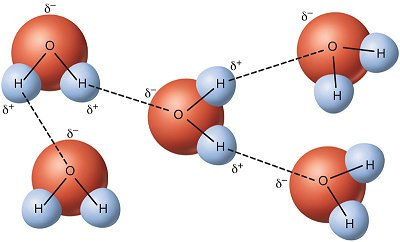
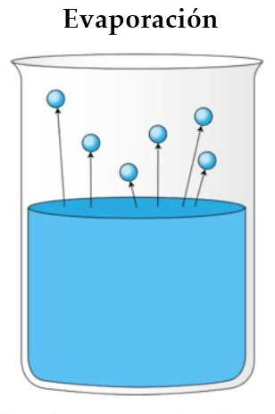
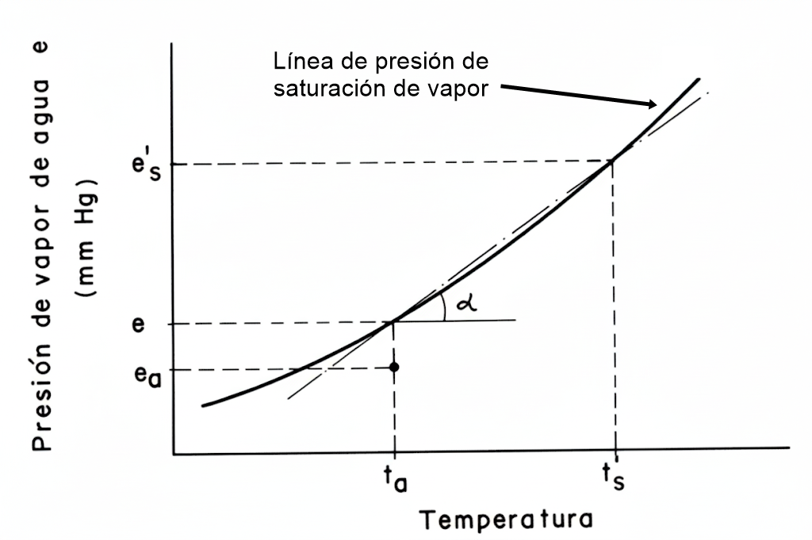

::: {.quote-block}
"La luz puede evaporar el agua sin necesidad de calor. Y, por si esto fuera poco, lo puede hacer de una manera mucho más eficiente."\
— *Yaodong Tu (Ingeniero  mecánico del MIT)*
:::

## Concepto físico de la evaporación

La evaporación es el proceso físico mediante el cual el agua en estado líquido se transforma en vapor de agua e ingresa a la atmósfera. En el ciclo hidrológico, este fenómeno constituye el principal mecanismo de transferencia de agua desde océanos, cuerpos continentales y superficies del suelo hacia la atmósfera, actuando como un enlace entre los componentes terrestre y atmosférico del sistema hidrológico.

Para comprender la evaporación con mayor nivel de detalle, el proceso debe analizarse de forma integrada desde tres perspectivas complementarias: la dinámica molecular, la termodinámica del cambio de fase y el transporte de vapor en la atmósfera cercana a la superficie.

### Dinámica molecular y energía cinética

A escala microscópica, el agua líquida está formada por moléculas unidas entre sí mediante fuerzas intermoleculares, dominadas por los enlaces de hidrógeno. Estas moléculas no están en reposo: se encuentran en movimiento continuo y aleatorio, con una energía cinética media que depende directamente de la temperatura del líquido.

```{r}
#| label: fig-agua
#| fig-cap: "Moléculas de agua.<br><span style='font-size:0.8em;'>Fuente: [@USGS]</span>"
#| fig-align: center
#| out-width: 75%
#| echo: false
#| class: fig-border


```

No todas las moléculas poseen la misma energía. Existe una distribución estadística de velocidades moleculares, de modo que una fracción de las moléculas presenta energías significativamente superiores al promedio. La evaporación ocurre cuando algunas de estas moléculas, ubicadas cerca de la superficie libre, alcanzan una energía cinética suficiente para vencer las fuerzas de cohesión y la tensión superficial, logrando escapar del líquido hacia la fase gaseosa.

```{r}
#| label: fig-evapo2
#| fig-cap: "Moléculas de agua escapando las fuerzas de cohesión y tensión superficial."
#| fig-align: center
#| out-width: 45%
#| echo: false
#| class: fig-border


```

De manera simultánea, moléculas de vapor de agua presentes en el aire colisionan con la superficie líquida y pueden reincorporarse al agua, proceso conocido como condensación. En consecuencia, desde el punto de vista hidrológico, la evaporación observable corresponde a una evaporación neta, definida como la diferencia entre la tasa de moléculas que abandonan la superficie líquida y la tasa de moléculas que retornan desde la atmósfera.

Este carácter bidireccional del proceso es clave para entender que la evaporación no es un fenómeno instantáneo ni unilateral, sino un equilibrio dinámico controlado por las condiciones energéticas y atmosféricas.

## Papel de la energía y del calor latente

Desde una perspectiva termodinámica, la evaporación es un proceso altamente demandante de energía. La cantidad de energía necesaria para que una unidad de masa de agua cambie de fase sin variar su temperatura se denomina calor latente de vaporización, usualmente representado como $\lambda$.

Esta energía se emplea exclusivamente en romper los enlaces intermoleculares del líquido, sin producir un aumento de temperatura. En unidades del Sistema Internacional, el calor latente de vaporización del agua puede aproximarse mediante la relación empírica:

$$\lambda = 2.501 - 0.002361 \cdot T_s$$

Donde:

- $\lambda$ se expresa en MJ/kg.

- $T_s$ es la temperatura de la superficie del agua en grados Celsius. 

Para temperaturas habituales en la superficie terrestre, este valor es cercano a 2.5 MJ/kg, lo que equivale a aproximadamente 580–600 cal/g.

Un aspecto fundamental del proceso es el enfriamiento evaporativo. Dado que las moléculas que escapan son las más energéticas, la energía cinética media del líquido remanente disminuye, provocando una reducción de la temperatura de la superficie. Este efecto es observable tanto en cuerpos de agua naturales como en suelos húmedos y superficies vegetadas.

En condiciones naturales, la fuente primaria de energía que sustenta la evaporación es la radiación solar, complementada en menor medida por el intercambio de calor sensible[^CS] con el aire y el suelo.

[^CS]: El calor sensible es la forma de energía térmica asociada a variaciones en la temperatura de una sustancia, sin que ocurra un cambio de fase. En términos físicos, corresponde a la energía que modifica la energía cinética media de las moléculas, produciendo un aumento o disminución observable de la temperatura del sistema.
<br>
Desde un punto de vista cuantitativo, el intercambio de calor sensible se expresa como:
<br>
$$Q = m \, c \, \Delta T$$
<br>
donde $Q$ es el calor intercambiado, $m$ la masa del sistema, $c$ el calor específico y $\Delta T$ el cambio de temperatura.
<br>
En hidrología y balance energético superficial, el calor sensible representa el flujo de energía transferido entre la superficie (agua, suelo o vegetación) y la atmósfera mediante conducción y convección, impulsado por gradientes de temperatura. A diferencia del calor latente, el calor sensible **no participa en cambios de estado del agua**, pero controla de manera directa la temperatura del aire y de las superficies, influyendo en procesos como la estabilidad atmosférica, la evaporación potencial y la dinámica de la capa límite.

### Presión de vapor y gradiente atmosférico

A escala macroscópica, la evaporación está gobernada por el gradiente de presión de vapor entre la superficie evaporante y la atmósfera suprayacente. Para cada temperatura existe una presión de vapor de saturación, denotada como $e_s$, que representa la presión ejercida por el vapor de agua cuando el aire se encuentra en equilibrio con una superficie líquida.

La presión de vapor de saturación aumenta de forma no lineal con la temperatura, lo que explica por qué el aire cálido puede contener cantidades significativamente mayores de vapor de agua que el aire frío. La presión de vapor real del aire, $e_a$, depende del contenido efectivo de humedad atmosférica.

La tasa de evaporación es proporcional a la diferencia entre estas dos presiones, de acuerdo con la Ley de Dalton:

$$E = k \cdot (e_s - e_a)$$

Donde:

- $E$ es el flujo evaporativo.

- $k$ es un coeficiente que incorpora efectos aerodinámicos, principalmente asociados a la velocidad del viento y a la rugosidad de la superficie.

Este gradiente define tres situaciones físicas claras:

- Si $e_s > e_a$, ocurre evaporación neta.

- Si $e_s = e_a$, el sistema se encuentra en equilibrio dinámico y la evaporación neta es nula.

- Si $e_a > e_s$, se produce condensación. 

### Factores meteorológicos que controlan la evaporación

La tasa de evaporación en condiciones naturales está controlada por la interacción de varios factores meteorológicos, entre los cuales destacan cuatro como dominantes:

A. <u>Radiación solar</u>: Es la principal fuente de energía disponible para suministrar el calor latente necesario para el cambio de fase.

B. <u>Temperatura del aire y de la superficie</u>: Controla tanto la energía cinética molecular como el valor de la presión de vapor de saturación.

C. <u>Humedad atmosférica</u>: Determina la presión de vapor real del aire. Un aire seco implica un mayor déficit de presión de vapor $(e_s - e_a)$ y, por tanto, una mayor capacidad evaporativa.

D. <u>Viento</u>: Favorece la remoción del aire saturado inmediatamente sobre la superficie evaporante, reemplazándolo por aire más seco. Este proceso de difusión turbulenta mantiene el gradiente de presión de vapor y permite que la evaporación continúe de manera eficiente.

Estos factores no actúan de forma independiente; su interacción define el régimen evaporativo de una superficie en una escala temporal que puede variar desde minutos hasta estaciones completas.

**Caso especial: sublimación**

Aunque la evaporación se refiere estrictamente al paso de agua líquida a vapor, en regiones frías o de alta montaña puede presentarse la sublimación, proceso mediante el cual el agua pasa directamente del estado sólido al gaseoso sin atravesar la fase líquida.

La sublimación requiere una mayor cantidad de energía, ya que involucra simultáneamente el calor latente de fusión y el calor latente de vaporización. A una temperatura de 0 °C, el calor latente de sublimación del agua es del orden de 677 cal/g. Este proceso es particularmente relevante en zonas nivales y glaciares, donde contribuye de manera significativa a la pérdida de masa sólida.

## Fundamentos físicos y mecanismos de transferencia de energía y masa

Para que la evaporación ocurra de manera efectiva, deben cumplirse simultáneamente tres condiciones básicas:  

1. La disponibilidad de una fuente de energía.

2. La presencia de agua en estado líquido o sólido susceptible de cambio de fase.

3. La existencia de un gradiente de humedad en la atmósfera que permita el transporte del vapor generado.  

Desde el punto de vista hidrológico, la evaporación representa un proceso de pérdida, ya que reduce el volumen de agua disponible para la generación de escorrentía, recarga de acuíferos y almacenamiento superficial (actúa como una salida dentro de la ecuación de la conservación de la masa).

### Evaporación desde superficies de agua  

La evaporación desde superficies de agua libre, como lagos, ríos, embalses y océanos, constituye el caso más directo y conceptualmente más simple del proceso, debido a que el suministro de agua no es un factor limitante. En estos sistemas, la tasa de evaporación está controlada principalmente por las condiciones atmosféricas y el balance energético en la interfase agua–aire.  

**Mecanismo cinético** 

A escala molecular, las moléculas de agua se encuentran en movimiento continuo y aleatorio, con una energía cinética media proporcional a la temperatura del líquido. Al mismo tiempo, moléculas de vapor presentes en el aire impactan la superficie líquida y retornan al estado líquido, proceso conocido como condensación. 

**Influencia del almacenamiento de calor** 

En cuerpos de agua profundos, la evaporación está fuertemente influenciada por la capacidad de almacenamiento térmico del sistema. Durante períodos de alta radiación solar, una fracción significativa de la energía disponible se emplea en calentar capas profundas del agua, reduciendo temporalmente la energía destinada a la evaporación. Este calor almacenado se libera gradualmente durante estaciones más frías, permitiendo que la evaporación continúe a tasas relativamente altas incluso cuando la temperatura del aire disminuye. Este efecto explica por qué grandes embalses y lagos presentan máximos de evaporación retardados con respecto al máximo de radiación solar anual.

**Factores limitantes adicionales**

Además de la radiación solar, la salinidad del agua constituye un factor limitante importante. El aumento de la concentración salina reduce la presión de vapor de la superficie, disminuyendo la tasa de evaporación. Como regla práctica, un incremento del 1% en la salinidad puede reducir la evaporación en aproximadamente un 1%, efecto relevante en lagunas costeras y cuerpos de agua salobre.

### Evaporación desde suelos húmedos  

La evaporación desde suelos húmedos es un proceso más complejo que la evaporación desde superficies de agua libre, ya que el suministro de agua está controlado por las propiedades hidráulicas del suelo y por el contenido de humedad. Este proceso se desarrolla generalmente en dos etapas bien diferenciadas.  

- **Etapa 1: evaporación limitada por la energía** 

Cuando el suelo se encuentra saturado o muy próximo a la saturación, como ocurre inmediatamente después de un evento de lluvia o riego, la superficie del suelo se comporta de manera similar a una lámina de agua libre. En esta etapa, la tasa de evaporación está controlada principalmente por la energía disponible, y puede alcanzar valores comparables a los de una superficie acuática bajo condiciones atmosféricas similares.

- **Etapa 2: evaporación limitada por el suelo** 

A medida que el contenido de humedad superficial disminuye, el transporte de agua desde capas más profundas hacia la superficie, dominado por fuerzas capilares, no logra satisfacer la demanda atmosférica. La conductividad hidráulica del suelo se reduce de forma no lineal, la evaporación se desplaza hacia el interior del perfil y la tasa global disminuye progresivamente. La textura del suelo desempeña un papel crucial: los suelos finos, como las arcillas, mantienen la continuidad del agua en sus poros durante más tiempo que los suelos arenosos, permitiendo tasas de evaporación más sostenidas.

## Métodos de estimación de la evaporación  

Debido a la dificultad de medir directamente la evaporación en superficies naturales extensas, la hidrología emplea diversos métodos indirectos, que pueden agruparse en métodos instrumentales, empíricos y energéticos.

### Tanque evaporímetro

El método instrumental más difundido es el tanque evaporímetro, siendo el Tanque Clase A el estándar internacional. Este consiste en un recipiente circular de hierro galvanizado, de 121.9 cm de diámetro y 25.4 cm de profundidad, instalado sobre una plataforma elevada. Dicho tanque se muestra en la @fig-Evaporation_Pan.

La evaporación se determina midiendo diariamente el descenso del nivel del agua, corregido por la precipitación registrada en un pluviómetro cercano. Debido a su reducido volumen y a la absorción de calor por las paredes metálicas, el tanque suele sobreestimar la evaporación real de cuerpos de agua naturales. Para corregir este efecto se introduce el coeficiente del tanque $K_p$, mediante la relación  

$$
E_L = K_p \cdot E_{pan}
$$  

donde $E_L$ es la evaporación del lago o embalse y $E_{pan}$ la evaporación medida en el tanque. El valor de $K_p$ suele oscilar entre 0.60 y 0.85, adoptándose frecuentemente un valor promedio de 0.70 para estimaciones anuales.

### Métodos empíricos  

Los métodos empíricos se basan en relaciones estadísticas obtenidas a partir de observaciones experimentales y utilizan variables meteorológicas de fácil medición.  

**Ecuación de Dalton**

La formulación aerodinámica clásica se fundamenta en la Ley de Dalton, que establece que la evaporación $E$ es proporcional al déficit de presión de vapor entre la superficie y el aire:  

$$
E = k \cdot (e_s - e_a)
$$  

donde $e_s$ es la presión de vapor de saturación a la temperatura de la superficie y $e_a$ es la presión de vapor real del aire. El coeficiente $k$ depende de la turbulencia atmosférica, principalmente asociada a la velocidad del viento.  

Una extensión de este enfoque es la fórmula de Meyer, que incorpora explícitamente el efecto del viento $V_w$:  

$$
E_m = C (e_s - e_a)\left[1 + \frac{16.09}{V_w}\right]
$$  

donde $C$ es un coeficiente empírico dependiente del tamaño y exposición del cuerpo de agua.  

**Ecuación de Meyer**

Meyer refinó el planteamiento de Dalton para adaptarlo a observaciones mensuales en cuerpos de agua, integrando de forma explícita la velocidad del viento como un factor de transporte que remueve el aire saturado sobre la superficie y lo reemplaza por aire más seco.

La ecuación se expresa de la siguiente manera:

$$
E_m = C \left( e_s - e_a \right)\left[ 1 + \frac{16.09}{V_w} \right]
$$

Donde los componentes son:

• $E_m$: Evaporación mensual calculada en centímetros (cm).  
• $e_s$: Presión de vapor de saturación media mensual, medida en pulgadas de mercurio (pulg. Hg), calculada a la temperatura del agua.  
• $e_a$: Presión de vapor media mensual real en el aire (pulg. Hg), determinada usualmente a partir de la temperatura y la humedad relativa.  
• $V_w$: Velocidad media mensual del viento, medida a una altura de referencia de 10 metros sobre la superficie, expresada en kilómetros por hora (km/h).  
• $C$: Coeficiente empírico de Meyer, que ajusta la fórmula según el tamaño del cuerpo de agua.

<u>El Coeficiente Empírico ($C$)</u>

La precisión de este método depende significativamente de la selección del valor de $C$, el cual varía según la escala del sistema evaporante:

• $C = 38$: Para depósitos pequeños de agua y tanques evaporímetros.  
• $C = 28$: Para grandes depósitos, como lagos y embalses de extensión considerable.

Esta distinción es crucial porque la eficiencia del viento y el gradiente de humedad cambian a medida que el aire se desplaza sobre una superficie de agua más extensa (efecto de borde).

Para utilizar esta ecuación en un proyecto hidrológico, es necesario contar con registros climáticos mensuales de temperatura y humedad relativa para deducir las presiones de vapor ($e_a$ y $e_s$). Además, si la velocidad del viento se mide a una altura distinta a los 10 metros, debe realizarse un ajuste previo mediante perfiles logarítmicos de velocidad.

::: {.callout-note title="Ejemplo"}

Supóngase que se desea estimar la evaporación mensual de un embalse de gran tamaño durante un mes de verano, utilizando la ecuación de Meyer. Se dispone de los siguientes promedios mensuales:

• Temperatura del agua: $25\,^{\circ}\mathrm{C}$ (por lo que $e_s \approx 0.949\ \mathrm{pulg.\ Hg}$).  
• Humedad relativa: $60\%$.  
• Temperatura del aire: $25\,^{\circ}\mathrm{C}$.  
• Velocidad del viento a $10\ \mathrm{m}$: $V_w = 15\ \mathrm{km/h}$.  

Además, para un embalse grande se adopta el coeficiente empírico $C = 28$.

La ecuación de Meyer se expresa como:

$$
E_m = C\,(e_s - e_a)\left[1+\frac{16.09}{V_w}\right]
$$

donde $E_m$ es la evaporación mensual en $\mathrm{cm/mes}$, $e_s$ y $e_a$ son presiones de vapor en $\mathrm{pulg.\ Hg}$, $V_w$ es la velocidad del viento en $\mathrm{km/h}$, y $C$ es adimensional.

Paso 1. Cálculo de la presión de vapor real del aire, $e_a$  
Dado que la humedad relativa se define como $\mathrm{HR} = e_a/e_s$, se tiene:

$$
e_a = e_s \cdot \mathrm{HR} = 0.949 \times 0.60 = 0.569\ \mathrm{pulg.\ Hg}
$$

Paso 2. Cálculo del déficit de presión de vapor, $(e_s - e_a)$

$$
e_s - e_a = 0.949 - 0.569 = 0.380\ \mathrm{pulg.\ Hg}
$$

Paso 3. Cálculo del factor aerodinámico (efecto del viento)

$$
1+\frac{16.09}{V_w} = 1+\frac{16.09}{15} = 1 + 1.0727 = 2.0727
$$

Paso 4. Sustitución en la ecuación de Meyer

$$
E_m = 28 \times 0.380 \times 2.0727
$$

Primero, el producto $28 \times 0.380$:

$$
28 \times 0.380 = 10.64
$$

Luego:

$$
E_m = 10.64 \times 2.0727 = 22.05\ \mathrm{cm/mes}
$$

Resultado  
La lámina de agua evaporada estimada para ese mes es aproximadamente: 

$$
E_m \approx 22.05\ \mathrm{cm/mes}
$$


::: 


**Método de Penman**

El Método de Penman, propuesto originalmente en 1948, constituye uno de los hitos más relevantes en el desarrollo de la hidrología moderna para la estimación de la evaporación. Antes de su formulación, los métodos disponibles obligaban a los hidrólogos a optar entre enfoques puramente aerodinámicos, basados en el transporte de masa de vapor de agua, o enfoques energéticos, fundamentados en el balance de radiación. La contribución fundamental de Penman fue integrar ambos enfoques en una sola expresión física coherente, conocida como ecuación de combinación.

La principal ventaja técnica del método de Penman radica en que permite estimar la evaporación desde superficies de agua libre o superficies saturadas utilizando únicamente variables meteorológicas de medición estándar, tales como radiación solar, temperatura del aire, humedad relativa y velocidad del viento. De este modo, se elimina la necesidad de conocer la temperatura real de la superficie del agua, variable que históricamente ha sido difícil de medir de forma continua y representativa en condiciones de campo.

**Fundamentos físicos del método**

El proceso de evaporación requiere la concurrencia simultánea de dos condiciones físicas esenciales, que el método de Penman integra de forma explícita:

1. Suministro de energía (límite radiativo).  
   Para que el agua pueda cambiar de fase de líquido a vapor, es necesario aportar energía en forma de calor latente de vaporización. Esta energía proviene, en condiciones naturales, principalmente de la radiación neta disponible en la superficie.

2. Mecanismo de transporte (límite aerodinámico).  
   La evaporación solo puede continuar si el vapor de agua generado es removido de la superficie. Este transporte depende del gradiente de presión de vapor entre la superficie y el aire circundante, así como del movimiento del aire inducido por el viento.

La evaporación real es, por tanto, el resultado del acoplamiento entre la disponibilidad energética y la eficiencia del transporte atmosférico.

**Ecuación general de Penman**

La forma general de la ecuación de Penman para la evaporación desde una superficie de agua abierta se expresa como una combinación lineal ponderada de los términos radiativo y aerodinámico:

$$
E = \frac{\Delta}{\Delta + \gamma} R_n + \frac{\gamma}{\Delta + \gamma} E_a
$$

donde:

- $E$ es la tasa de evaporación, comúnmente expresada en mm/día.  
- $\Delta$ es la pendiente de la curva de presión de vapor de saturación respecto a la temperatura del aire, y representa el componente termodinámico del proceso.  
- $R_n$ es la radiación neta en la superficie, expresada en unidades equivalentes de lámina de agua.  
- $\gamma$ es la constante psicrométrica, dependiente de la presión atmosférica y del calor latente de vaporización.  
- $E_a$ es el poder evaporante del aire, asociado al transporte aerodinámico.

Los coeficientes $\frac{\Delta}{\Delta+\gamma}$ y $\frac{\gamma}{\Delta+\gamma}$ actúan como factores de ponderación que determinan la importancia relativa de cada término. A temperaturas elevadas, el término radiativo domina el proceso; en condiciones de fuerte viento o bajo contenido energético, el término aerodinámico adquiere mayor relevancia.

**Determinación del término aerodinámico**

El poder evaporante del aire se expresa como:

$$
E_a = f(u)\,(e_s - e_a)
$$

donde:

- $(e_s - e_a)$ es el déficit de presión de vapor, definido como la diferencia entre la presión de vapor de saturación a la temperatura del aire y la presión de vapor real del aire.  
- $f(u)$ es una función empírica de la velocidad del viento.

Una formulación clásica propuesta por Penman para $f(u)$ es:

$$
f(u) = 0.35\,(0.5 + 0.54\,u_2)
$$

donde $u_2$ es la velocidad media del viento medida a 2 m sobre la superficie, expresada en m/s.

Este término representa la eficiencia con la que el viento remueve el aire húmedo de la capa límite superficial y lo reemplaza por aire más seco, manteniendo activo el gradiente de presión de vapor.

**Parámetros termodinámicos fundamentales**

La pendiente de la curva de presión de vapor de saturación se calcula como:

$$
\Delta = \frac{4098\,e_s}{(237.3 + T)^2}
$$

$$
e_s =33.8639 \left[ (0.00738T + 0.8072)^8 -0.000019 \left| 1.8T+48 \right| +0.001316\right ]
$$

donde $T$ es la temperatura media del aire en grados Celsius y $e_s$ es la presión de vapor de saturación correspondiente.

```{r}
#| label: fig-vapor2
#| fig-cap: "Curva de presión de saturación de vapor.<br><span style='font-size:0.8em;'>Fuente: [@SerranoPacheco_IC0808_Hidrologia]</span>"
#| fig-align: center
#| out-width: 85%
#| echo: false
#| class: fig-border


```

La constante psicrométrica se define como:

$$
\gamma = 0.0016286\,\frac{P}{\lambda}
$$

donde $P$ es la presión atmosférica en kPa y $\lambda$ es el calor latente de vaporización del agua, que puede aproximarse por:

$$
\lambda = 2.501 - 0.002361\,T
$$

con $\lambda$ expresada en MJ/kg.

**Balance de radiación neta**

La radiación neta $R_n$ incorpora la diferencia tanto la radiación de onda corta como la radiación de onda larga, y puede expresarse de forma general como:

$$
R_n = (1 - \alpha)\left(0.25 + 0.5\frac{n}{N}\right)S_0 - \left(0.9\frac{n}{N} + 0.1\right)\left(0.34 - 0.14\sqrt{e_a}\right)\sigma(273.15 + T)^4
$$

donde $\alpha$ es el albedo de la superficie, $n$ es el número de horas de brillo solar, $N$ la duración máxima del día, $S_0$ la radiación extraterrestre diaria, $e_a$ la presión de vapor real del aire y $\sigma$ la constante de Stefan–Boltzmann.

El termino:

$$
(1 - \alpha)\left(0.25 + 0.5\frac{n}{N}\right)S_0
$$

Hace referencia a la radiación de onda corta. Mientras que el término:

$$
\left(0.9\frac{n}{N} + 0.1\right)\left(0.34 - 0.14\sqrt{e_a}\right)\sigma(273.15 + T)^4
$$

Hace referencia a la radiación de onla larga.

Este término representa la energía efectivamente disponible para el proceso de evaporación una vez consideradas las pérdidas radiativas hacia la atmósfera.

Para aplicar el método de Penman de forma sistemática, se recomienda seguir los siguientes pasos:

1. Cálculo de los parámetros termodinámicos $\Delta$ y $\gamma$ a partir de la temperatura del aire y la presión atmosférica local.  
2. Evaluación de la radiación neta $R_n$, considerando radiación de onda corta y larga. En escalas diarias, el flujo de calor hacia el suelo puede despreciarse.  
3. Cálculo del término aerodinámico $E_a$ a partir del déficit de presión de vapor y la velocidad del viento.  
4. Integración final en la ecuación de combinación para obtener la tasa de evaporación.

Este enfoque proporciona una estimación físicamente consistente y robusta, y constituye la base conceptual de métodos modernos ampliamente utilizados, como el método de Penman–Monteith recomendado por la FAO como estándar internacional para el cálculo de la evapotranspiración de referencia.


### Métodos energéticos  

Los métodos energéticos se basan en el Principio de Conservación de la Energía, considerando la superficie evaporante como un sistema de control. La ecuación general del balance de energía se expresa como  

$$
R_n - G - \lambda ET - H = 0
$$  

donde $R_n$ es la radiación neta, $G$ el flujo de calor hacia el suelo o el agua, $\lambda ET$ el flujo de calor latente asociado a la evaporación y $H$ el flujo de calor sensible hacia la atmósfera.  

El calor latente de vaporización $\lambda$ representa la energía requerida para transformar agua líquida en vapor sin cambio de temperatura. A $20^\circ$C, su valor es aproximadamente $2.45\ \text{MJ kg}^{-1}$, equivalente a la energía necesaria para evaporar una lámina de $1\ \text{mm}$ de agua sobre $1\ \text{m}^2$.  

La relación de Bowen $\beta$ se define como la razón entre el calor sensible y el calor latente  

$$
\beta = \frac{H}{LE}
$$  

y permite cerrar el balance energético cuando no es posible medir ambos flujos de forma independiente.  


