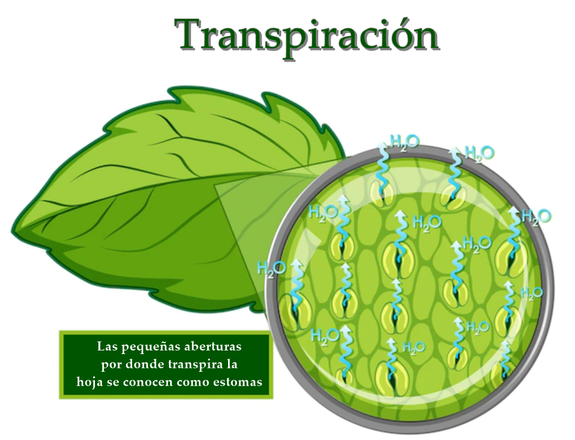

::: {.quote-block}
"La ecuación de Penman-Monteith no es solo una fórmula académica; es una herramienta operativa que permite a los agricultores de todo el mundo determinar cuánta agua necesitan realmente sus cultivos, optimizando el riego en un planeta con recursos hídricos limitados."\
— *John Monteith (Meteorólogo y climatólogo británico, codesarrollador de la ecuación de Penman-Monteith)*
:::

En el estudio de la hidrología, se denomina evapotranspiración (ET) al proceso conjunto que describe el retorno del agua a la atmósfera en forma de vapor, integrando tanto la vaporización directa desde superficies líquidas o el suelo como la pérdida a través del metabolismo de las plantas. Este fenómeno representa el componente principal del ciclo hidrológico para la transferencia de agua de la tierra a la atmósfera. Se estima que en regiones tropicales cerca de dos tercios de la precipitación anual se evapotranspiran, mientras que en zonas áridas este valor puede superar el 90%.

## Definición y naturaleza del proceso

La evapotranspiración no es una variable climatológica única, sino la combinación de dos procesos físicos y biológicos diferenciados que ocurren de forma simultánea en la naturaleza:

1. **Evaporación**  
   Es el proceso físico por el cual el agua en estado líquido o sólido (nieve y hielo) se transforma en estado gaseoso debido al aumento de energía cinética de sus moléculas. En hidrología, se considera la evaporación desde diversas fuentes:  
   - <u>Superficies de agua abierta</u>: como lagos, ríos, embalses y océanos, donde el suministro de agua es prácticamente ilimitado.  
   - <u>Suelos húmedos</u>: agua que se evapora desde la matriz del suelo tras una precipitación o riego.  
   - <u>Agua interceptada</u>: lluvia que queda retenida sobre el follaje de la vegetación, edificios o calles, y que se evapora antes de alcanzar el suelo.  
   - <u>Sublimación</u>: el paso directo de nieve o hielo a vapor, esencial en regiones de alta montaña o glaciares.  

2. **Transpiración**  
   Es el fenómeno biológico mediante el cual las plantas pierden agua a la atmósfera a través de sus tejidos vivos, principalmente por las aberturas de las hojas denominadas estomas. El agua es absorbida por las raíces desde el suelo, transportada por el xilema hasta las hojas y finalmente vaporizada en los espacios intercelulares para difundirse hacia el aire exterior. Solo una fracción minúscula del agua absorbida (alrededor del 1%) es retenida por la planta para la formación de tejidos y nutrición; el resto se transpira.   
   
```{r}
#| label: fig-estomas
#| fig-cap: "Diagrama de estomas y transpiración de las hojas.<br><span style='font-size:0.8em;'>Fuente: [GeekforGeeks.org, 2026]</span>"
#| fig-align: center
#| out-width: 85%
#| echo: false
#| class: fig-border


```


**Componentes y partición de la evapotranspiración**

En una cuenca hidrográfica o un campo de cultivo, la proporción de agua que se pierde por cada uno de estos procesos varía dinámicamente según el estado de cobertura del suelo. Esta relación se conoce como partición de la ET:

- <u>Fase de siembra o inicio</u>: cuando el cultivo es pequeño y el suelo está descubierto, casi el 100% de la ET ocurre en forma de evaporación directa del suelo.

- <u>Fase de pleno desarrollo</u>: a medida que la vegetación crece y sombrea el terreno, la radiación solar disponible en la superficie del suelo disminuye, reduciendo la evaporación. En condiciones de cobertura vegetal completa (dosel cerrado), más del 90% de la ET total puede ser atribuida a la transpiración.  


**Factores que gobiernan la evapotranspiración**

Para que ocurra la ET, se requieren tres condiciones fundamentales que actúan como límites físicos:

1. <u>Suministro de energía (límite radiativo)</u>  
   El cambio de fase de líquido a vapor requiere el consumo de calor latente de vaporización (aproximadamente $2.45\ \text{MJ/kg}$ a $20^\circ\text{C}$). La radiación solar neta $R_n$ es la fuente primaria de esta energía.

2. <u>Mecanismo de transporte (límite aerodinámico)</u>  
   Se requiere que el aire circundante sea capaz de absorber y transportar el vapor de agua lejos de la superficie evaporante. Esto depende del gradiente de presión de vapor (déficit de saturación) y de la velocidad del viento, que sustituye el aire saturado por aire más seco mediante difusión turbulenta.

3. <u>Disponibilidad de agua (límite hidrológico)</u>  
   En superficies saturadas, la ET ocurre a su tasa máxima; sin embargo, a medida que el suelo se seca, la resistencia al movimiento del agua hacia las raíces o la superficie aumenta, limitando la tasa real de transferencia.

**Conceptos fundamentales para el análisis**

Dentro de la hidrología, se distinguen tres niveles de evapotranspiración para propósitos de diseño y balance hídrico:

- <u>Evapotranspiración potencial (ETP)</u>  
  Es la máxima pérdida de agua que ocurriría si la superficie estuviera completamente cubierta de vegetación y el suministro de humedad en el suelo fuera ilimitado. Representa la cantidad de humedad que puede recibir la atmósfera bajo ciertas condiciones climáticas.

- <u>Evapotranspiración de referencia (ETo)</u>  
  Para estandarizar los cálculos, se define como la ET de un cultivo hipotético de pasto de 12 cm de altura, activamente creciendo, bien regado y con características fijas de albedo (0.23) y resistencia superficial. El método estándar para su cálculo es la ecuación de Penman–Monteith de la FAO.

- <u>Evapotranspiración real o actual (ETR)</u>  
  Es la cantidad que efectivamente se evapotranspira dadas las condiciones actuales de humedad del suelo y desarrollo vegetal. Siempre se cumple que $\text{ETR} \le \text{ETP}$.

## Dinámica y diferenciación entre la evapotranspiración potencial y real

En la hidrología aplicada y del manejo de los recursos hídricos, la distinción entre la Evapotranspiración Potencial (ETP) y la Evapotranspiración Real (ETR) es un concepto central para cuantificar el balance hídrico de una cuenca, un sistema agrícola o un proyecto de ingeniería hidráulica. 
Comprender esta diferenciación permite interpretar correctamente la interacción entre clima, suelo, vegetación y disponibilidad hídrica, y evita errores comunes en estimaciones de demanda de agua, diseño de riego o análisis de sequías.

1. **Conceptos fundamentales**

  - Evapotranspiración Potencial (ETP)  
  La evapotranspiración potencial se define como la máxima cantidad de agua que podría perder una superficie terrestre si el suministro de agua en el suelo fuera ilimitado y nunca representara una restricción para la vegetación. La ETP expresa exclusivamente la demanda atmosférica de vapor de agua, determinada por las condiciones meteorológicas dominantes: radiación solar, temperatura del aire, humedad relativa y viento.  

  Desde el punto de vista físico, la ETP representa cuánto vapor de agua sería capaz de absorber el aire si el agua estuviera siempre disponible en la superficie.

  Para estandarizar este concepto y evitar ambigüedades asociadas a distintos tipos de vegetación, se introduce la Evapotranspiración de Referencia (ETo), definida como la evapotranspiración de un cultivo hipotético de pasto de 12 cm de altura, creciendo activamente, bien regado y con propiedades aerodinámicas y ópticas constantes. La ETo depende únicamente del clima y constituye la base para la mayoría de los cálculos hidrológicos y agrícolas modernos.

  - Evapotranspiración Real (ETR)  
  La evapotranspiración real corresponde a la cantidad de agua que efectivamente se transfiere a la atmósfera bajo las condiciones reales del sistema. A diferencia de la ETP, la ETR está condicionada por la disponibilidad de agua en el suelo, la profundidad efectiva de las raíces, el estado fisiológico de la vegetación y las propiedades hidráulicas del suelo.

  En sistemas donde el suelo está seco o parcialmente saturado, la atmósfera puede demandar más agua de la que el sistema puede suministrar, por lo que la ETR resulta inferior a la ETP. Por esta razón, la ETR es la variable relevante para balances hídricos, evaluación de estrés hídrico y análisis de sequías.

2. **Relación física entre ETR y ETP**

La relación conceptual entre la evapotranspiración real (ETR) y la evapotranspiración potencial (ETP) puede formalizarse matemáticamente mediante una definición por tramos, en función de la precipitación ($P$) y de la disponibilidad de humedad en el suelo. Esta formulación resume el control hidrológico que ejerce el almacenamiento de agua sobre la respuesta evaporativa del sistema.


$$
\mathrm{ETR} =
\begin{cases}
\mathrm{ETP}, &
\begin{aligned}
&\text{si } P \ge \mathrm{ETP},\\
&\text{ (considerando interceptación y humedad suficiente del suelo)}
\end{aligned} \\[0.6em]
\mathrm{ETP}, &
\begin{aligned}
&\text{si } P < \mathrm{ETP},\\
&\text{pero existe humedad almacenada suficiente}
\end{aligned} \\[0.6em]
< \mathrm{ETP}, &
\begin{aligned}
&\text{si } P < \mathrm{ETP},\\
&\text{y no existe humedad suficiente en el suelo}
\end{aligned}
\end{cases}
$$


Esta relación resume el principio físico de que la evapotranspiración real nunca puede superar la demanda atmosférica máxima. Solo en condiciones ideales (suelo a capacidad de campo, cobertura vegetal completa y ausencia de limitaciones hidráulicas) se cumple que $\text{ETR} = \text{ETP}$.

El comportamiento relativo entre ETR y ETP puede ilustrarse mediante ejemplos contrastantes. En un ambiente desértico, la ETP puede alcanzar valores elevados, por ejemplo $6\ \text{mm/día}$, debido a la alta radiación y baja humedad relativa. Sin embargo, la ETR será cercana a cero si no existe agua disponible en el suelo. En contraste, en un cultivo bien irrigado, la ETR puede igualar a la ETP durante gran parte del ciclo de crecimiento.

Este comportamiento está controlado por tres límites físicos principales:

1. <u>Límite hidrológico</u> 
   Determinado por la disponibilidad de agua en el suelo y su capacidad de ser transportada hacia la superficie o la zona radicular. A medida que el contenido de humedad disminuye, aumenta la resistencia hidráulica y se reduce la ETR.

2. <u>Límite radiativo</u> 
   Asociado a la energía disponible para el cambio de fase del agua. La radiación solar neta controla la cantidad máxima de evapotranspiración posible en un periodo dado.

3. <u>Límite advectivo o aerodinámico</u>  
   Relacionado con la capacidad de la atmósfera para remover el vapor de agua generado en la superficie. Depende del déficit de presión de vapor y de la velocidad del viento.

## Métodos de estimación de la evapotranspiración potencial (ETP)

¿Por qué nos esforzamos en calcular un valor "potencial" (que asume condiciones ideales) en lugar de medir directamente la evapotranspiración "real" que ocurre en el campo?

Aunque es el valor que realmente interesa para el balance hídrico de una cuenca es la ETR, su determinación directa presenta obstáculos técnicos y económicos significativos:

1. <u>Complejidad de medición</u>: Determinar la ETR requiere instrumentos sofisticados como los lisímetros de pesaje de precisión (que miden cambios en el peso del suelo), sistemas de covarianza de remolinos (eddy correlation) o el uso de la relación de Bowen. Estos equipos son costosos, difíciles de mantener y operan a escalas puntuales que no siempre representan la heterogeneidad de una cuenca.

2. <u>El límite hidrológico</u>: La ETR está condicionada por la disponibilidad de agua en el suelo (el "límite hidrológico"). Dado que el contenido de humedad varía drásticamente en el espacio y el tiempo, y es extremadamente difícil de conocer con precisión a escalas útiles, la ETR se vuelve una variable esquiva.

La ETP depende exclusivamente de parámetros meteorológicos que son fáciles de medir en estaciones estándar: radiación solar, temperatura del aire, humedad atmosférica y velocidad del viento. Al calcular la ETP, el hidrólogo puede caracterizar el "poder evaporante" de una región sin que los datos se vean sesgados por la sequedad específica de un suelo en un momento dado.

Además, a ETP permite comparar el clima de diferentes localidades o épocas del año bajo un estándar común. Por ejemplo, se puede determinar que la demanda atmosférica en una zona árida es mucho mayor que en una húmeda, independientemente de si hay agua en el suelo para satisfacerla. Para mayor precisión, la hidrología moderna utiliza la Evapotranspiración de referencia $(ET_0)$, que utiliza un cultivo hipotético de pasto bien regado con características fijas para eliminar ambigüedades.

Algunos de los métodos más comunes en hidrología para la estimación de la $(ET_0)$ son:

### Método de Thorntwaite

El método desarrollado por C. W. Thornthwaite en 1948 constituye uno de los enfoques empíricos más influyentes y ampliamente utilizados en la hidrología y la climatología para la estimación de la evapotranspiración potencial (ETP). Su importancia histórica y práctica radica en que permite obtener estimaciones razonables de la demanda evaporativa atmosférica utilizando únicamente información de temperatura media mensual y la latitud geográfica del sitio. Esta simplicidad lo convierte en una herramienta fundamental en regiones con escasez de datos meteorológicos, donde no se dispone de registros confiables de radiación neta, humedad relativa o velocidad del viento.

La expresión desarrollada por Throntwaite es:

$$
ET_{0,j} (mm/mes)=16k_a \left( \frac{N}{30}\right ) \left( \frac{10T_j}{I}\right )^\alpha
$$

Donde:

- $ET_{0,j} (mm/mes)$: Es la evapotranspiración potencial mensual para el mes $j$.

- $T_j$: Temperatura media mensual del mes $j$.

- $I$: Índice de calor, dado por la expresión:

$$
I=\sum_{i=1}^{12}i_j, \text{ con } \ i_j=\left( \frac{T_j}{5} \right)^{\alpha}
$$

y con

$$
\alpha=675X10^{-9}\ I^{3}-771X10^{-7}\ I^{2}+179X10^{-4}\ I+0.492
$$

Dentro de la ecuación derivada por Thorntwaite, el término $k_a$ se conoce como el coeficiente radiativo. Este valor junto con la correción por longitud del mes $(N/30)$ se encuentran en la siguiente tabla.

```{r}
#| label: tbl-KA
#| tbl-cap: "Valores de $k_a (N/30)$"
#| echo: false
#| message: false
#| warning: false
library(tidyverse)
library(kableExtra)

factor_latitud <- tribble(
  ~Latitud, ~Ene, ~Feb, ~Mar, ~Abr, ~May, ~Jun, ~Jul, ~Ago, ~Sep, ~Oct, ~Nov, ~Dic,
  "15° N", 0.97, 0.91, 1.03, 1.04, 1.11, 1.08, 1.12, 1.08, 1.02, 1.01, 0.95, 0.97,
  "10° N", 1.00, 0.91, 1.03, 1.03, 1.08, 1.05, 1.08, 1.07, 1.02, 1.02, 0.98, 0.99,
  "5° N",  1.02, 0.93, 1.03, 1.02, 1.06, 1.03, 1.06, 1.05, 1.01, 1.03, 0.99, 1.02,
  "Ecuador",1.04,0.94,1.04,1.01,1.04,1.01,1.04,1.04,1.01,1.04,1.01,1.04,
  "5° S",  1.06, 0.95, 1.04, 1.00, 1.02, 0.99, 1.02, 1.03, 1.00, 1.05, 1.03, 1.06,
  "10° S", 1.08, 0.97, 1.05, 0.99, 1.01, 0.96, 1.00, 1.01, 1.00, 1.06, 1.05, 1.10,
  "15° S", 1.12, 0.98, 1.05, 0.98, 0.98, 0.94, 0.97, 1.00, 1.00, 1.07, 1.07, 1.12
)

factor_latitud %>%
  kbl(
    format   = "html",
    booktabs = TRUE,
    align    = c("c", rep("c", 12))) %>%
  kable_classic(html_font = "Latin Modern Roman") %>%
  kable_styling(
    full_width        = FALSE,
    bootstrap_options = c("striped", "hover", "condensed")
  ) %>%
  row_spec(0, bold = TRUE) 

```


Desde el punto de vista físico, Thornthwaite definió la ETP como la máxima cantidad de agua que podría perder una superficie completamente cubierta de vegetación si el suelo mantuviera un suministro de humedad ilimitado. En este enfoque, la temperatura del aire actúa como un indicador indirecto de la energía solar disponible para impulsar el cambio de fase del agua, bajo el supuesto de que existe una correlación climática estable entre temperatura y radiación incidente a escala mensual.

El cálculo de la evapotranspiración potencial mediante el método de Thornthwaite se realiza de forma secuencial, siguiendo una serie de pasos bien definidos que permiten capturar el régimen térmico anual del sitio y su influencia sobre la demanda evaporativa.

1. **Cálculo del Índice de Calor Mensual ($i$)**

Para cada mes del año se define un índice térmico adimensional basado en la temperatura media mensual $t$ (en °C):

$$
i = \left(\frac{t}{5}\right)^{1.514}
$$

Si la temperatura media mensual es menor o igual a $0\ ^\circ\text{C}$, se adopta $i = 0$, ya que se asume que no existe demanda evaporativa significativa bajo condiciones de congelamiento.

Este índice representa la contribución relativa de cada mes al régimen térmico anual del sitio.

2. **Determinación del Índice de Calor Anual ($I$)**

El índice térmico anual se obtiene como la suma de los doce índices mensuales:

$$
I = \sum_{j=1}^{12} i_j
$$

Este parámetro sintetiza el nivel energético anual del clima y es el principal controlador de la forma funcional del método.

3. **Cálculo del Exponente Térmico ($a$)**

El exponente $a$ ajusta la sensibilidad de la evapotranspiración frente a la temperatura y se calcula mediante una expresión polinómica cúbica propuesta por Thornthwaite:

$$
a = 675 \times 10^{-9} I^3 - 771 \times 10^{-7} I^2 + 1792 \times 10^{-5} I + 0.49239
$$

Este exponente refleja la no linealidad de la respuesta evaporativa ante incrementos térmicos. En climas templados y tropicales, el valor de $a$ suele oscilar aproximadamente entre 1.0 y 2.5.

4. **Estimación de la ETP Mensual sin Corrección**

La evapotranspiración potencial mensual no corregida se calcula para un mes teórico de 30 días y una duración fija de 12 horas diarias de insolación mediante:

$$
ET_{0,j} (mm/mes) = 16 \left(\frac{10 T_j}{I}\right)^a
$$

Este valor representa una evapotranspiración potencial estandarizada, aún no ajustada a las condiciones astronómicas reales del mes y la latitud.

5. **Ajuste por Latitud y Duración del Brillo Solar**

Dado que la duración real del día varía con la latitud y la época del año, es indispensable aplicar un factor de corrección astronómica $f$ para obtener la evapotranspiración potencial mensual corregida:

$$
\text{ETP}_{\text{corregida}} = ET_{0,j} \cdot k_a (N/30)
$$

El factor $k_a (N/30)$ se obtiene de la @tbl-KA.

**Alcances del Método**

Este enfoque es particularmente útil para:
- Estudios de balance hídrico a escala mensual o anual.
- Análisis climatológicos regionales.
- Evaluaciones preliminares en cuencas con información limitada.

No obstante, el método presenta limitaciones importantes:
- No incorpora explícitamente el efecto del viento ni de la humedad relativa.
- Tiende a subestimar la ETP en climas áridos y a sobreestimarla en climas muy húmedos.
- Su aplicación es más confiable en escalas temporales mensuales o mayores.

::: {.callout-note title="Ejemplo"}

Se desea estimar la evapotranspiración potencial del mes de setiembre ($ETP_{\text{sep}}$) mediante el método de Thornthwaite, para una localidad en Costa Rica con latitud $10^\circ\text{N}$. Se dispone de la temperatura media mensual del año (°C). Utilizar el factor astronómico $k_a(N/30)$ correspondiente a $10^\circ\text{N}$ y setiembre.


Se tiene la siguiente información de temperaturas medias mensuales registradas en una estación meteorológica cercana.

```{r}
#| label: tbl-thorn1
#| tbl-cap: "Información de temperaturas medias mensuales."
#| echo: false
#| message: false
#| warning: false
library(tibble)
library(kableExtra)
library(tidyverse)

temperaturas <- tribble(
  ~Mes, ~`T (°C)`,
  "Enero",      21.4,
  "Febrero",    26.3,
  "Marzo",      29.7,
  "Abril",      31.3,
  "Mayo",       29.7,
  "Junio",      28.4,
  "Julio",      27.6,
  "Agosto",     26.5,
  "Setiembre",  27.5,
  "Octubre",    25.3,
  "Noviembre",  26.3,
  "Diciembre",  23.3
)

temperaturas %>%
  kbl(
    format   = "html",
    booktabs = TRUE,
    align    = c("c", "c")) %>%
  kable_classic(html_font = "Latin Modern Roman") %>%
  kable_styling(
    full_width        = FALSE,
    bootstrap_options = c("striped", "hover", "condensed")
  ) %>%
  row_spec(0, bold = TRUE)
```

Se sabe que el factor de corrección astronómica para $10^\circ\text{N}$ y setiembre:

$$
k_a\left(\frac{N}{30}\right)_{\;10^\circ\text{N},\;\text{sep}}=1.02
$$

- Paso 1. Cálculo del índice térmico mensual $i_j$

Para cada mes:
$$
i_j=\left(\frac{T_j}{5}\right)^{1.514}
$$

Se calculan los 12 valores $i_j$ y se suman para obtener el índice anual $I$.

```{r}
#| label: tbl-thorn2
#| tbl-cap: "Valores de índice de calor mensual."
#| echo: false
#| message: false
#| warning: false
library(tidyverse)
library(dplyr)
library(kableExtra)

ij <- temperaturas %>%
  mutate(`i_j = (T/5)^1.514` = (`T (°C)`/5)^1.514)

ij_mostrar <- ij %>%
  mutate(`i_j = (T/5)^1.514` = round(`i_j = (T/5)^1.514`, 3))

ij_mostrar_legible <- ij_mostrar %>%
  rename(
    Mes = Mes,
    `Temperatura media (°C)` = `T (°C)`,
    `Índice térmico mensual i<sub>j</sub>` = `i_j = (T/5)^1.514`
  )

ij_mostrar_legible %>%
  kbl(
    format   = "html",
    booktabs = TRUE,
    align    = c("c", "c", "c"),
    escape   = FALSE
  ) %>%
  kable_classic(html_font = "Latin Modern Roman") %>%
  kable_styling(
    full_width        = FALSE,
    bootstrap_options = c("striped", "hover", "condensed")
  ) %>%
  row_spec(0, bold = TRUE)
```


El índice anual se define como:
$$
I=\sum_{j=1}^{12} i_j
$$

Con los datos de la tabla, se obtiene:

$$
I \approx 154.2619
$$

- Paso 2. Cálculo del exponente térmico $a$

Se calcula:

$$
a=675\times10^{-9}I^3-771\times10^{-7}I^2+1792\times10^{-5}I+0.49239
$$

Con $I=154.2619$:

$$
a=675\times10^{-9}(154.2619)^3-771\times10^{-7}(154.2619)^2+1792\times10^{-5}(154.2619)+0.49239
$$

$$
a \approx 3.8999
$$


- Paso 3. ETP mensual “base” (mes teórico de 30 días y 12 h de luz)

Para setiembre ($T_{\text{sep}}=27.5^\circ\text{C}$), la evapotranspiración potencial mensual **base** (sin corrección astronómica) se denota como $e_{\text{sep}}$:

$$
e_{\text{sep}} = 16\left(\frac{10T_{\text{sep}}}{I}\right)^a
$$

1) Cociente térmico:

$$
\frac{10T_{\text{sep}}}{I}=\frac{10(27.5)}{154.2619}=1.7827
$$

2) Potencia:

$$
\left(\frac{10T_{\text{sep}}}{I}\right)^a=(1.7827)^{3.8999}=9.5316
$$

3) ETP base:

$$
e_{\text{sep}}=16(9.5316)=152.5056\ \text{mm/mes}
$$


- Paso 4. Corrección por latitud y duración del día ($k_a(N/30)$)

La ETP corregida para setiembre se obtiene como:

$$
ETP_{\text{sep}} = e_{\text{sep}}\;k_a\left(\frac{N}{30}\right)
$$

Con $k_a\left(\frac{N}{30}\right)_{10^\circ\text{N},\text{sep}}=1.02$:

$$
ETP_{\text{sep}} = 152.5056(1.02)=155.5557\ \text{mm/mes}
$$


```{r}
#| label: tbl-thorn3
#| tbl-cap: "Resumen de resultados."
#| echo: false
#| message: false
#| warning: false
resumen <- tibble::tribble(
  ~Parámetro, ~Valor,
  "T<sub>sep</sub> (°C)", "27.5",
  "I", "154.2619",
  "a", "3.8999",
  "k<sub>a</sub>(N/30) (10° N, sep)", "1.02",
  "10T<sub>sep</sub>/I", "1.7827",
  "(10T<sub>sep</sub>/I)<sup>a</sup>", "9.5316",
  "e<sub>sep</sub> (mm/mes)", "152.5056",
  "ETP<sub>sep</sub> (mm/mes)", "155.5557"
)

resumen |>
  kableExtra::kbl(
    format   = "html",
    booktabs = TRUE,
    align    = c("c","c"),
    escape   = FALSE) |>
  kableExtra::kable_classic(html_font = "Latin Modern Roman") |>
  kableExtra::kable_styling(
    full_width        = FALSE,
    bootstrap_options = c("striped", "hover", "condensed")
  ) |>
  kableExtra::row_spec(0, bold = TRUE)
```


Bajo las condiciones térmicas dadas y aplicando la corrección astronómica para $10^\circ\text{N}$, la evapotranspiración potencial estimada por Thornthwaite para setiembre es:

$$
ETP_{\text{sep}} \approx 155.6\ \text{mm/mes}
$$

Este valor representa la demanda evaporativa atmosférica mensual suponiendo ausencia de limitaciones de humedad en el suelo. 
::: 

### Método de Turc

El método desarrollado por L. Turc es uno de los enfoques empíricos más robustos y ampliamente utilizados en la hidrología para cuantificar la evapotranspiración real (ETR) media anual de una cuenca. A diferencia de otros métodos que estiman la demanda máxima de la atmósfera (evapotranspiración potencial), Turc formuló una expresión que considera tanto la energía disponible como el suministro de agua. Su validez científica emana de un exhaustivo análisis estadístico de datos recolectados en 254 cuencas hidrográficas distribuidas por todo el mundo, lo que le otorga una aplicabilidad global en diversos escenarios climáticos.

**Fundamentos físicos del método**

La fórmula de Turc se basa en la interacción entre la precipitación ($P$) como fuente de agua y la temperatura ($T$) como un indicador indirecto de la energía solar disponible para el cambio de fase. En hidrología, este método es fundamental para calcular el déficit de escorrentía, ya que en periodos anuales la evapotranspiración real es aproximadamente igual a la diferencia entre la precipitación y el caudal de salida de la cuenca ($\text{ETR} \approx P - Q$).

**Formulación matemática**

La ecuación general de Turc para determinar la evapotranspiración media anual ($\bar{E}$ o ETR) se define como:

$$
\bar{E} = \frac{\bar{P}}{\sqrt{0.9 + \dfrac{\bar{P}^2}{L^2}}}
$$

Donde los términos se definen de la siguiente manera:

• $\bar{E}$: Evapotranspiración real media anual, expresada en milímetros por año (mm/año).  
• $\bar{P}$: Precipitación media anual sobre la cuenca (mm/año).  
• $L$: Índice de capacidad térmica o “poder evaporante” del clima, que depende de la temperatura.

El valor de $L$ se calcula mediante la siguiente expresión térmica:

$$
L = 300 + 25t + 0.05t^3
$$

Donde $t$ representa la temperatura media anual del aire en grados Celsius (°C). 

> (Nota: Aunque algunas variantes utilizan $t^2$, el exponente cúbico es la forma estándar reportada en la mayoría de las fuentes académicas de referencia.

**Condición límite de aplicación**

Para garantizar la coherencia física en zonas extremadamente secas, el método establece un límite: si la precipitación es muy baja en relación con el índice térmico, se asume que prácticamente toda el agua que cae se evapotranspira.

Si se cumple que:

$$
\frac{\bar{P}^2}{L^2} \le 0.1
$$

Entonces, el cálculo se simplifica a:

$$
\bar{E} = \bar{P}
$$

::: {.callout-note title="Ejemplo"}

Considere una cuenca con los siguientes datos meteorológicos promedios anuales:

- Precipitación anual ($\bar{P}$): $1200\ \text{mm}$
- Temperatura media anual ($t$): $20\ ^\circ\text{C}$

- Paso 1: Cálculo del índice térmico $L$

Se utiliza la expresión:

$$
L = 300 + 25t + 0.05t^3
$$

Sustituyendo $t=20$:

$$
L = 300 + 25(20) + 0.05(20)^3
$$

Cálculos intermedios:

$$
25(20) = 500
$$

$$
(20)^3 = 8000
$$

$$
0.05(8000) = 400
$$

Por tanto:

$$
L = 300 + 500 + 400 = 1200
$$

- Paso 2: Verificación de la condición límite

Se evalúa el cociente:

$$
\frac{L^2}{\bar{P}^2} = \frac{1200^2}{1200^2} = 1
$$

Como $1 > 0.1$, se aplica la fórmula general de Turc.

- Paso 3: Cálculo de la evapotranspiración real media anual $\bar{E}$ (ETR)

La forma operativa de la ecuación se escribe como:

$$
\bar{E} = \frac{\bar{P}}{\sqrt{0.9 + \left(\frac{L^2}{\bar{P}^2}\right)}}
$$

Sustituyendo los valores:

$$
\bar{E} = \frac{1200}{\sqrt{0.9 + 1}}
$$

Suma dentro de la raíz:

$$
0.9 + 1 = 1.9
$$

Raíz cuadrada:

$$
\sqrt{1.9} \approx 1.3784
$$

Cálculo final:

$$
\bar{E} = \frac{1200}{1.3784} \approx 870.57\ \text{mm/año}
$$

- Interpretación

En este escenario, de los $1200\ \text{mm/año}$ de precipitación:

- Evapotranspiración real media anual: $\bar{E} \approx 870.6\ \text{mm/año}$

El excedente anual aproximado disponible para escorrentía superficial y subterránea es:

$$
\bar{P} - \bar{E} = 1200 - 870.57 = 329.43\ \text{mm/año}
$$

Por tanto, el excedente es aproximadamente $329.4\ \text{mm/año}$.

::: 


### Método de Hargreaves

El método de **Hargreaves–Samani** (frecuentemente denominado simplemente método de Hargreaves) es uno de los enfoques empíricos más utilizados en hidrología para la estimación de la evapotranspiración de potencial** ($ETP$). Fue propuesto originalmente por Hargreaves y Samani en 1982 y refinado posteriormente en 1985, con el objetivo de proporcionar una alternativa confiable en contextos donde la disponibilidad de información meteorológica es limitada.

El método de Hargreaves se apoya fundamentalmente en temperaturas del aire y en la radiación extraterrestre, lo que lo convierte en una herramienta especialmente valiosa en regiones con redes de monitoreo climático poco densas o incompletas.

**Fundamento físico del método**

El principio central del método de Hargreaves–Samani es que la amplitud térmica diaria, definida como la diferencia entre la temperatura máxima y mínima del aire $(T_{\max}-T_{\min})$, actúa como un indicador indirecto de dos procesos atmosféricos clave:

a.  **Radiación solar incidente:** En condiciones de cielo despejado, la radiación solar diurna es elevada y la pérdida radiativa nocturna es significativa, lo que genera amplitudes térmicas grandes. Por el contrario, la nubosidad reduce la radiación entrante durante el día y limita el enfriamiento nocturno, disminuyendo el rango térmico diario.

b. **Contenido de humedad del aire:** Atmósferas más húmedas tienden a amortiguar las variaciones térmicas diarias, mientras que atmósferas secas presentan contrastes térmicos más marcados.

Bajo esta lógica, el rango térmico diario funciona como una variable *proxy*^[Una variable proxy (o representante) es una medida indirecta y fácilmente observable que se utiliza para inferir el valor de otra variable de interés que no puede medirse directamente, no está disponible o es inobservable. Funciona mediante una fuerte correlación con la variable objetivo] de la radiación solar efectiva y del estado higrométrico del aire, permitiendo estimar la demanda evaporativa atmosférica sin medir directamente dichas variables.

El método incorpora además la radiación extraterrestre ($R_a$), que depende únicamente de la latitud y de la época del año. Este término representa la energía solar disponible en el límite superior de la atmósfera y actúa como un modulador astronómico del proceso evaporativo.

**Formulación matemática**

La expresión estándar del método de Hargreaves–Samani para estimar la evapotranspiración de referencia diaria es:

$$
ET_o = 0.0023 \,(T_{\text{med}} + 17.78)\, R_a \, \sqrt{T_{\max} - T_{\min}}
$$

donde:

- $ET_o$: evapotranspiración potencial (mm/día).
- $T_{\text{med}}$: temperatura media diaria del aire (°C).
- $T_{\max}$: temperatura máxima diaria del aire (°C).
- $T_{\min}$: temperatura mínima diaria del aire (°C).
- $R_a$: radiación solar extraterrestre expresada como lámina equivalente de agua evaporada (mm/día).
- $0.0023$ y $17.78$: constantes empíricas obtenidas por ajuste estadístico global.

Desde el punto de vista físico, el término $(T_{\text{med}} + 17.78)$ representa la influencia de la energía térmica promedio, mientras que $(T_{\max} - T_{\min})^{0.5}$ captura el efecto combinado de radiación y humedad atmosférica.

**Determinación de la radiación extraterrestre $R_a$**

La radiación extraterrestre $R_a$ es la cantidad de energía solar que incidiría sobre una superficie horizontal si no existiera atmósfera. Su valor depende exclusivamente de la **latitud** y del **día del año**.

En la práctica, $R_a$ puede obtenerse de:

- Tablas estandarizadas por mes y latitud (FAO-56).

```{r}
#| label: tbl-ra-allen
#| tbl-cap: "Tabla de Radiación solar extraterrestre en mm/día (Allen et al., 1998) (Original en MJ·m$^{-2}$·día$^{-1}$ ; 1 mm/día = 2,45 MJ·m$^{-2}$·día$^{-1}$)"
#| echo: false
#| message: false
#| warning: false

library(tidyverse)
library(kableExtra)


# ------------------------------------------------------------
# FAO-56 (Allen et al., 1998): Radiación extraterrestre Ra
# Ra (MJ m^-2 día^-1) -> mm/día equivalente: mm = 0.408 * Ra
# Promedio diario mensual aproximado usando el día medio del mes (J)
# ------------------------------------------------------------

Gsc <- 0.0820 # MJ m^-2 min^-1
J_mid <- c(15, 45, 74, 105, 135, 166, 196, 227, 258, 288, 319, 349)
meses <- c("Ene","Feb","Mar","Abr","May","Jun","Jul","Ago","Sep","Oct","Nov","Dic")

ra_mm_dia <- function(lat_deg, J){
  phi <- lat_deg * pi/180
  dr  <- 1 + 0.033 * cos(2*pi/365 * J)
  delta <- 0.409 * sin(2*pi/365 * J - 1.39)
  ws <- acos(pmax(pmin(-tan(phi) * tan(delta), 1), -1))
  Ra_MJ <- (24*60/pi) * Gsc * dr * (ws*sin(phi)*sin(delta) + cos(phi)*cos(delta)*sin(ws))
  Ra_mm <- 0.408 * Ra_MJ
  Ra_mm
}

latitudes <- seq(70, 0, by = -2)

hn <- map_dfc(J_mid, ~ ra_mm_dia(latitudes, .x)) |> set_names(meses)
hs <- map_dfc(J_mid, ~ ra_mm_dia(-latitudes, .x)) |> set_names(meses)

tabla_ra <- tibble(Latitud = latitudes) |>
  bind_cols(hn) |>
  bind_cols(hs)

tabla_ra_fmt <- tabla_ra |>
  mutate(
    Latitud = as.integer(Latitud)
  ) |>
  mutate(across(-Latitud, ~ round(.x, 1)))

# ------------------------------------------------------------
# Tabla estilo "igual a la referencia": encabezados agrupados
# ------------------------------------------------------------

tabla_ra_fmt |>
  kbl(
    format   = "html",
    booktabs = TRUE,
    align    = c("c", rep("c", 24)),
    col.names = c("Latitud", meses, meses)
  ) |>
  add_header_above(
    c(" " = 1, "HEMISFERIO NORTE" = 12, "HEMISFERIO SUR" = 12),
    bold = TRUE
  ) |>
  kable_classic(html_font = "Latin Modern Roman") |>
  kable_styling(
    full_width = TRUE,
    bootstrap_options = c("condensed")
  ) |>
  row_spec(0, bold = TRUE) |>
  column_spec(1, width = "4.2em") |>
  column_spec(13, border_right = "2px solid #000000") |>
  column_spec(14, border_left  = "2px solid #000000")  |>
  scroll_box(width = "700px", height = "500px")


```

Valores de $R_a$ (promedio diario mensual) calculados con FAO-56 (Allen et al., 1998). Conversión: $1\ \text{mm/día}\approx 2.45\ \text{MJ}\ \text{m}^{-2}\ \text{día}^{-1}$. La tabla está en mm/día, equivalente a:

$$
1\ \text{mm/día}\approx 2.45\ \text{MJ}\ \text{m}^{-2}\ \text{día}^{-1}.
$$

Los valores corresponden a $R_a$ mensual promedio diario, según FAO-56 / Allen et al. (1998).

- Expresiones astronómicas que consideran la constante solar, la declinación solar y el ángulo horario al ocaso.

Cuando $R_a$ se calcula inicialmente en unidades energéticas (MJ/m$^2$/día), se transforma a unidades hidrológicas mediante el factor:

$$
1\ \text{MJ/m}^2/\text{día} \approx 0.408\ \text{mm/día}
$$

Esta conversión se basa en el calor latente de vaporización del agua.

::: {.callout-note title="Ejemplo"}

Se desea estimar la evapotranspiración potencial diaria ($ETP$) mediante el método de Hargreaves–Samani para una localidad en Costa Rica ubicada a $10^\circ\text{N}$, para un día representativo del mes de julio. Se dispone de los siguientes datos diarios:

- $T_{\text{med}}=24.2\,^\circ\text{C}$
- $T_{\max}=29.8\,^\circ\text{C}$
- $T_{\min}=18.3\,^\circ\text{C}$

Además, de la tabla FAO-56 (Allen et al., 1998) para $10^\circ\text{N}$ y **julio** se toma:

- $R_a = 15.1\ \text{mm/día}$

Estimar $ETP$ en $\text{mm/día}$.

La ecuación de Hargreaves–Samani es:

$$
ETP = 0.0023\,(T_{\text{med}}+17.78)\,R_a\,\sqrt{T_{\max}-T_{\min}}
$$

donde $R_a$ se expresa en $\text{mm/día}$.

- Paso 1. Amplitud térmica diaria

$$
\Delta T = T_{\max}-T_{\min} = 29.8-18.3 = 11.5\ ^\circ\text{C}
$$

$$
\sqrt{\Delta T}=\sqrt{11.5}\approx 3.391
$$

$$
T_{\text{med}}+17.78 = 24.2+17.78 = 41.98
$$

$$
ETP = 0.0023\,(41.98)\,(15.1)\,(3.391)\approx 4.95
$$


$$
ETP \approx 4.95\ \text{mm/día}
$$

Bajo las condiciones térmicas indicadas y usando $R_a$ tabulado FAO-56 para $10^\circ\text{N}$ en julio, la evapotranspiración de referencia diaria estimada por Hargreaves–Samani es aproximadamente $ET_o\approx 5.0\ \text{mm/día}$. Este valor representa la demanda evaporativa atmosférica diaria del cultivo de referencia, y constituye una estimación práctica cuando no se dispone de radiación medida, humedad relativa o viento.

Debido a que la estimación de $ETP$ por el método de Hargreaves–Samani diaria (mm/día), para hacer una estimación promedio mensual en este caso de mes de julio, se multiplica el valor obtenido de evapotranspiración por el número de días en el mes a analizar.

$$
ETP_{\text{julio}}= 4.95 \cdot31 \text{ días}\approx 153.45 \text{ mm/mes}
$$

::: 


### Método de Penman-Monteith

El método de Penman–Monteith es actualmente reconocido como el estándar internacional para la estimación de la evapotranspiración potencial (ETP). Este enfoque representa la culminación de un desarrollo teórico iniciado con la ecuación original de Penman (1948), que integró el balance de energía y el transporte de masa, y perfeccionado posteriormente por Monteith (1965) mediante la incorporación explícita de resistencias al flujo de vapor.

A diferencia de los métodos empíricos basados en correlaciones climáticas, el método de Penman–Monteith se apoya en principios físicos bien definidos, lo que le confiere validez general en una amplia gama de condiciones climáticas, desde regiones áridas hasta ambientes tropicales húmedos, sin requerir calibraciones locales extensivas.

**Fundamentos físicos: el enfoque de combinación**

Ya se ha mencionado anteriormente sobre los requerimientos fundamentales para que pueda darse la evapotranspiración (energíay transporte de masa). La contribución conceptual clave de Monteith fue introducir resistencias al flujo de vapor, que actúan como reguladores del proceso:

- La **resistencia aerodinámica** ($r_a$), asociada al movimiento del aire sobre la superficie.

- La **resistencia superficial** ($r_s$), que representa la oposición combinada de los estomas de la vegetación y de la superficie del suelo al escape del vapor.

Estas resistencias explican por qué superficies con igual clima pueden presentar tasas de evapotranspiración diferentes.

**Superficie de referencia y estandarización FAO**

Para garantizar comparabilidad entre regiones y estudios, la FAO definió una superficie de referencia estándar, caracterizada por:

- Cultivo de pasto verde de 0.12 m de altura.

- Crecimiento activo y cobertura completa del suelo.

- Suministro de agua no limitante.

- Albedo fijo de 0.23.

- Resistencia superficial constante de 70 s m$^{-1}$.

La evapotranspiración calculada para esta superficie se denomina **evapotranspiración de referencia** ($ET_o$), y sirve como base para estimar la evapotranspiración real mediante coeficientes de cultivo y de estrés hídrico.

**Ecuación FAO Penman–Monteith**

La expresión diaria estandarizada para el cálculo de $ET_o$ (en mm/día) es:

$$
ET_o =
\frac{
0.408\,\Delta\,(R_n - G)
+
\gamma \frac{900}{T + 273}\,u_2\,(e_s - e_a)
}{
\Delta + \gamma\,(1 + 0.34\,u_2)
}
$$
Donde:

- $ET_o$: Evapotranspiración de referencia [mm día$^{-1}$].  
- $R_n$: Radiación neta en la superficie [MJ m$^{-2}$ día$^{-1}$].  
- $G$: Flujo de calor del suelo [MJ m$^{-2}$ día$^{-1}$].  
- $T$: Temperatura media diaria del aire a 2 m [°C].  
- $u_2$: Velocidad media diaria del viento a 2 m [m s$^{-1}$].  
- $e_s - e_a$: Déficit de presión de vapor [kPa].  
- $\Delta$: Pendiente de la curva de presión de vapor de saturación [kPa °C$^{-1}$].  
- $\gamma$: Constante psicrométrica [kPa °C$^{-1}$].  
- $0.408$: Factor de conversión de energía a evaporación equivalente, derivado del calor latente de vaporización del agua.

La ecuación puede interpretarse como la suma ponderada de dos contribuciones:

- <u>Término radiativo</u>: domina en climas cálidos y soleados, donde la energía disponible controla la evapotranspiración.

- <u>Término aerodinámico</u>: cobra mayor importancia en condiciones de viento fuerte y aire seco, donde la atmósfera tiene gran capacidad de transporte de vapor.

Los pesos relativos de ambos términos están regulados por $\Delta$ y $\gamma$, lo que permite que el modelo se adapte físicamente a distintos regímenes climáticos.

**Consideraciones prácticas de aplicación**

- Para escalas diarias, el flujo de calor del suelo puede asumirse como $G \approx 0$.

- La presión de saturación $e_s$ debe calcularse como el promedio entre los valores obtenidos a $T_{\max}$ y $T_{\min}$, evitando errores por la no linealidad de la curva de saturación.

- La constante psicrométrica $\gamma$ debe ajustarse según la altitud del sitio, ya que depende de la presión atmosférica.

