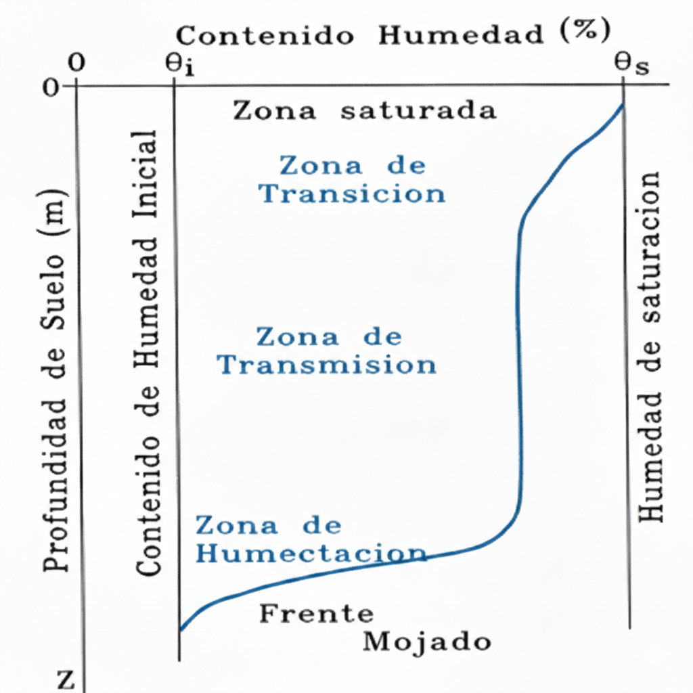
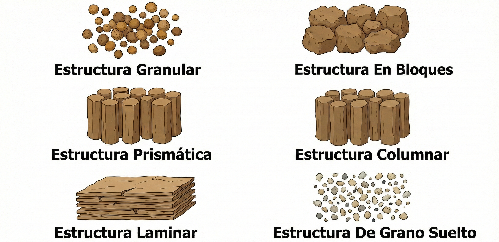
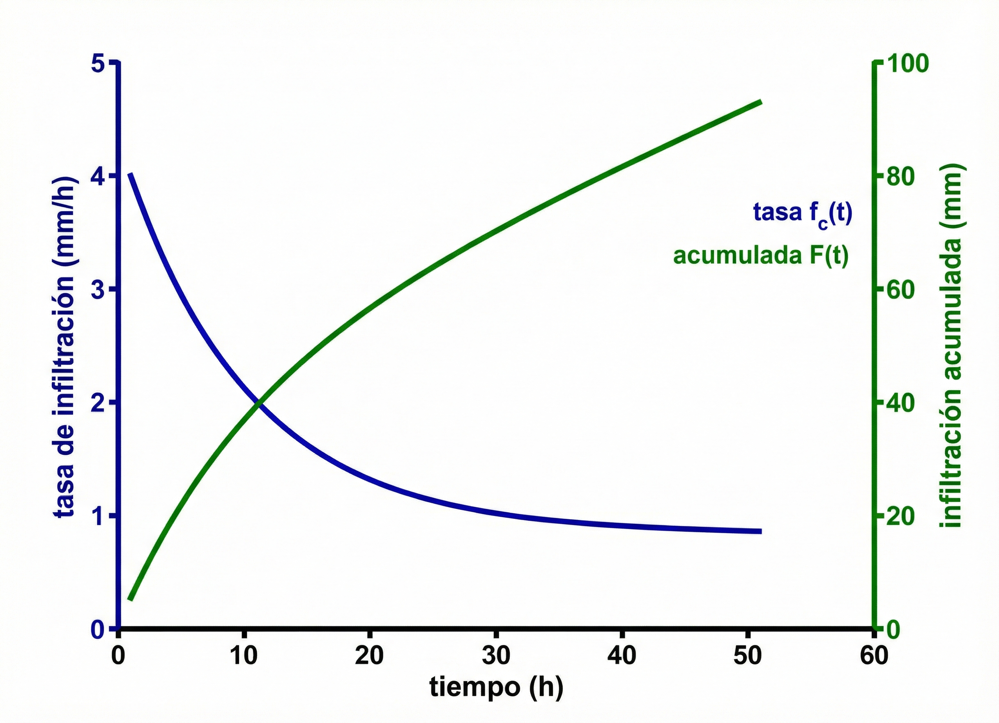
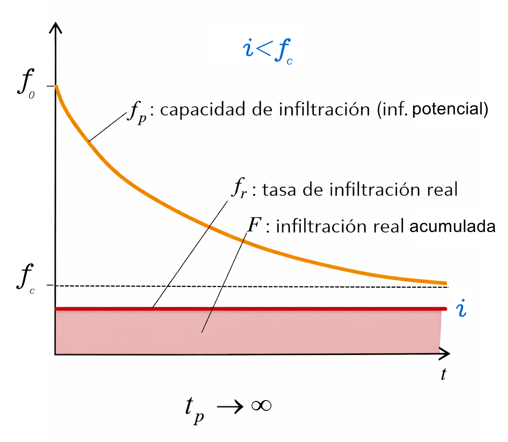
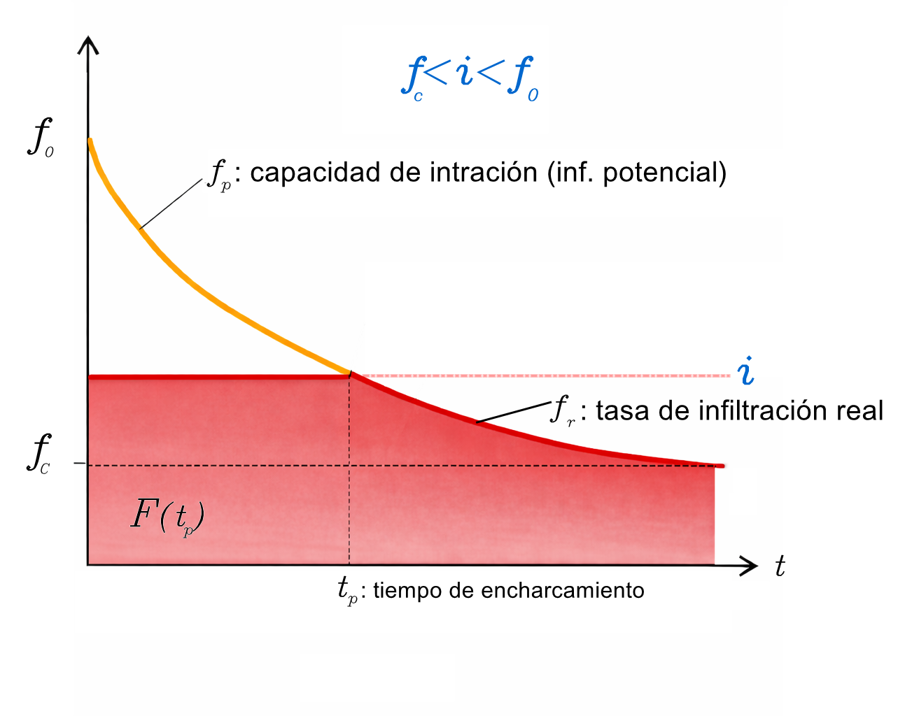
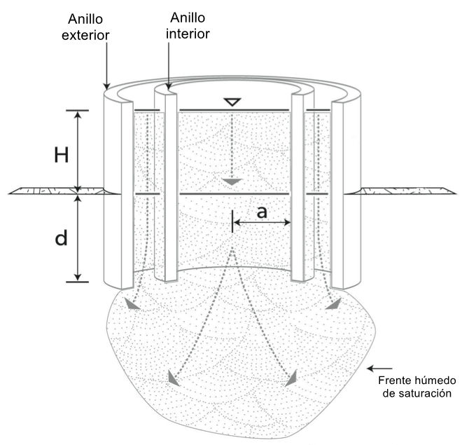
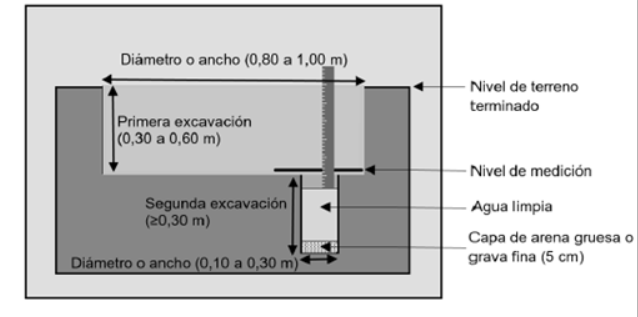
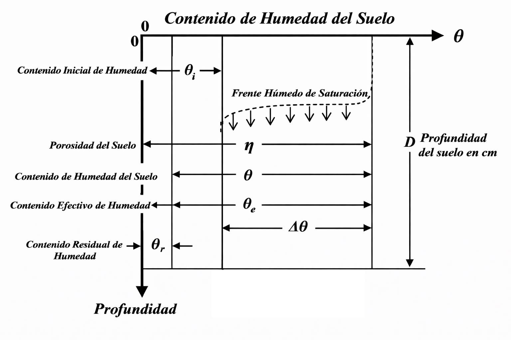

::: {.quote-block}
"La infiltración es el proceso que gobierna el destino del agua en el sistema suelo-planta-atmósfera; sin su comprensión, cualquier modelo hidrológico es incompleto."\
— *John R. Philip (Hidrólogo australiano, pionero en física de suelos)*
:::

## Concepto de infiltración

La infiltración es el proceso físico fundamental mediante el cual el agua, proveniente de la precipitación, el riego o el deshielo, penetra desde la superficie del terreno hacia el interior del suelo. Dentro del ciclo hidrológico, este proceso cumple una función reguladora esencial, ya que controla la partición inicial de la lluvia entre la escorrentía superficial, responsable de crecidas, erosión y transporte de sedimentos, y el almacenamiento subsuperficial, que alimenta la humedad del suelo, la evapotranspiración y la recarga de los acuíferos.

Desde el punto de vista hidrológico e ingenieril, la infiltración actúa como un mecanismo de amortiguamiento natural frente a los eventos de lluvia. Su magnitud determina la rapidez y la intensidad de la respuesta hidrológica de una cuenca, influyendo directamente en los caudales pico, los tiempos de concentración y la ocurrencia de inundaciones.

Es fundamental distinguir la infiltración de la percolación. 

- La infiltración ocurre exclusivamente en la interfaz aire–suelo, es decir, en el ingreso inicial del agua al suelo. 

- La percolación corresponde al movimiento vertical posterior del agua a través del perfil del suelo, una vez que esta ya ha infiltrado, desplazándose por la zona no saturada hasta alcanzar la zona saturada o nivel freático. Aunque ambos procesos están íntimamente relacionados, responden a escalas temporales y mecanismos físicos distintos.

**Dinámica del proceso y capacidad de infiltración**

Cuando el agua alcanza la superficie de un suelo inicialmente seco, la infiltración ocurre a tasas elevadas. Este comportamiento inicial se explica por la acción conjunta de dos fuerzas físicas principales:

- **Gravedad**, que impulsa el movimiento descendente del agua.

- **Capilaridad o succión**, originada por la atracción entre el agua y la matriz sólida del suelo, especialmente intensa cuando el contenido de humedad es bajo.

A medida que el evento de lluvia progresa, los poros del suelo se van llenando y el contenido de humedad aumenta. Este proceso reduce progresivamente las fuerzas capilares, ya que disminuye el contraste entre el suelo seco y el agua infiltrada. En consecuencia, la gravedad pasa a ser el mecanismo dominante del flujo y la tasa de infiltración decrece con el tiempo.

Finalmente, la infiltración tiende a estabilizarse en un valor aproximadamente constante, denominado tasa de infiltración básica o capacidad de infiltración final, que en condiciones ideales se aproxima a la conductividad hidráulica saturada del suelo, $K_s$. Este valor representa el límite físico superior de transmisión de agua en un suelo completamente saturado.

En el análisis hidrológico se distinguen dos conceptos operativos fundamentales:

- **Capacidad de infiltración** ($f_p$): tasa máxima a la cual un suelo puede absorber agua bajo condiciones específicas de humedad, estructura y uso del suelo.

- **Tasa de infiltración real** ($f$): cantidad efectiva de agua que penetra en el suelo durante un evento.

La relación entre la intensidad de lluvia ($i$) y la capacidad de infiltración controla el proceso:

- Si $i \leq f_p$, toda la precipitación se infiltra y $f = i$.

- Si $i > f_p$, el suelo no puede absorber toda el agua disponible; la infiltración ocurre a su tasa máxima ($f = f_p$) y el exceso de agua genera almacenamiento superficial o escorrentía.

Este principio constituye la base conceptual de los modelos clásicos de infiltración y de generación de escorrentía.

**Perfil de humedad durante la infiltración**

Durante un evento de infiltración continua, el agua no se distribuye de manera uniforme dentro del suelo. En su lugar, se desarrolla un perfil de humedad característico que puede idealizarse mediante cuatro zonas bien definidas:

1. **Zona de saturación superficial**  
   Capa delgada inmediatamente bajo la superficie, donde todos los poros se encuentran llenos de agua. Esta zona se desarrolla rápidamente cuando la intensidad de lluvia es alta o la permeabilidad del suelo es baja.

2. **Zona de transición**  
   Región intermedia en la que el contenido de humedad decrece de forma pronunciada con la profundidad, reflejando la redistribución progresiva del agua infiltrada.

3. **Zona de transmisión**  
   Zona de humedad aproximadamente uniforme y cercana a la saturación, que se ensancha a medida que el agua avanza hacia capas más profundas. En esta región el flujo es predominantemente gravitacional.

4. **Frente mojado**  
   Límite relativamente abrupto entre el suelo húmedo superior y el suelo seco subyacente. En este frente se concentran los mayores gradientes de succión y se controla la velocidad de avance del agua dentro del perfil.

La conceptualización del frente húmedo de saturación es particularmente relevante para el desarrollo de modelos analíticos de infiltración, ya que permite representar de forma simplificada, pero físicamente coherente, la propagación del agua en el suelo.

```{r}
#| label: fig-infiltracion
#| fig-cap: "Diagrama de infiltración en el suelo."
#| fig-align: center
#| out-width: 85%
#| echo: false
#| class: fig-border


```

La infiltración constituye el vínculo físico entre la precipitación, el suelo y los sistemas subterráneos. Su comportamiento condiciona la humedad antecedente del suelo, la aparición de suelos saturados, la recarga de acuíferos y la respuesta hidrológica frente a eventos extremos. Por esta razón, una comprensión rigurosa del proceso de infiltración es indispensable para el análisis hidrológico, el diseño de obras de drenaje, la gestión del recurso hídrico y la evaluación del riesgo asociado a inundaciones.

### Flujo de agua a través del suelo

La infiltración y los procesos de redistribución del agua en medios no saturados se describen mediante la ley de Darcy, la cual establece que el flujo de agua es proporcional al gradiente de energía hidráulica existente en el medio poroso.

En una dimensión, la ley de Darcy puede expresarse como:

$$
q_x = -K_h\left(\frac{dz}{dx} + \frac{d\psi}{dx}\right)
$$

donde:

- $q_x$ es el flujo de agua a través del medio, con dimensiones $[L/T]$.

- $K_h$ es la conductividad hidráulica del medio, con dimensiones $[L/T]$.

- $z$ es la elevación geométrica medida desde un eje de referencia, con dimensiones $[L]$.

- $\psi$ es la carga de presión, definida como $\psi = p/\gamma_w$.

- $p$ es la presión del agua, con dimensiones $[F/L^2]$.

- $\gamma_w$ es el peso específico del agua, con dimensiones $[F/L^3]$.

Para que ocurra flujo en el medio poroso debe existir un gradiente espacial de energía hidráulica. Dicho gradiente puede descomponerse en dos componentes: el gradiente de energía potencial gravitacional, representado por $dz/dx$, y el gradiente de energía potencial de presión, representado por $d\psi/dx$.

En medios no saturados, tanto la carga de presión como la conductividad hidráulica dependen del contenido de humedad del suelo, $\theta$. En este caso, la conductividad hidráulica deja de ser constante y se expresa como una función $K_h(\theta)$.

Si se considera únicamente flujo vertical, la ecuación de Darcy puede simplificarse y escribirse de la siguiente forma:

$$
q_z = -K_h(\theta)\left(1 + \frac{d\psi(\theta)}{dz}\right)
$$

Esta formulación pone de manifiesto que el movimiento del agua en la zona no saturada está controlado simultáneamente por la gravedad y por los gradientes de succión matricial, los cuales varían dinámicamente con el contenido de humedad del suelo.

## Influencia del suelo, cobertura y uso del suelo

La infiltración no es una propiedad fija ni uniforme del terreno, sino el resultado de la interacción entre las características físicas del suelo, el tipo de cobertura presente en la superficie y el uso que el ser humano hace del territorio. Estos tres factores controlan de manera directa la velocidad a la cual el agua puede ingresar al suelo, la cantidad total que logra infiltrarse durante un evento de lluvia y, en última instancia, la generación de escorrentía superficial y la recarga hídrica subsuperficial.

Comprender esta influencia es esencial para la hidrología aplicada, ya que permite explicar diferencias marcadas en la respuesta hidrológica entre cuencas aparentemente similares y fundamenta decisiones de manejo del territorio, diseño hidráulico y mitigación de riesgos.

### Influencia de las propiedades del suelo

El suelo es un medio poroso cuya estructura interna controla el movimiento del agua. La infiltración depende principalmente de la textura, la estructura, la porosidad y la conductividad hidráulica del suelo.

**Textura del suelo** 

La textura describe la proporción relativa de arena, limo y arcilla. Su influencia es determinante:

- Suelos arenosos presentan macroporos grandes y bien conectados, lo que permite tasas de infiltración elevadas y respuestas rápidas.

- Suelos arcillosos poseen microporos dominantes, alta capacidad de retención de agua y bajas tasas de infiltración, especialmente cuando están compactados.

- Suelos francos muestran un comportamiento intermedio y suelen ofrecer un balance favorable entre infiltración y almacenamiento.

En el siguiente cuadro, se detallan las clases texturales del suelo según su contenido porcentual de arena, limo y arcilla.

```{r}
#| label: tbl-KA
#| tbl-cap: "Clases texturales de suelos, según el USDA."
#| echo: false
#| message: false
#| warning: false


library(tibble)
library(kableExtra)

textura_suelos <- tribble(
  ~`Nombres vulgares de los suelos (textura general)`, ~Arenoso, ~Limoso, ~Arcilloso, ~`Clase textural`,
  "Suelos arenosos (textura gruesa)",                 "86–100", "0–14",   "0–10",   "Arenoso",
  "",                                                 "70–86",  "0–30",   "0–15",   "Franco arenoso",
  "Suelos francos (textura moderadamente gruesa)",    "50–70",  "0–50",   "0–20",   "Franco arenoso",
  "",                                                 "23–52",  "28–50",  "7–27",   "Franco",
  "Suelos francos (textura mediana)",                 "20–50",  "74–88",  "0–27",   "Franco limoso",
  "",                                                 "0–20",   "88–100", "0–12",   "Limoso",
  "Suelos francos (textura moderadamente fina)",      "20–45",  "15–52",  "27–40",  "Franco arcilloso",
  "",                                                 "45–80",  "0–28",   "20–35",  "Franco arenoso arcilloso",
  "",                                                 "0–20",   "40–73",  "27–40",  "Franco limoso arcilloso",
  "Suelos arcillosos (textura fina)",                 "45–65",  "0–20",   "35–55",  "Arcilloso arenoso",
  "",                                                 "0–20",   "40–60",  "40–60",  "Arcilloso limoso",
  "",                                                 "0–45",   "0–40",   "40–100", "Arcilloso"
)

suppressPackageStartupMessages({
  library(tidyverse)
  library(kableExtra)
})

textura_suelos <- tribble(
  ~`Textura general del suelo`, ~Arenoso, ~Limoso, ~Arcilloso, ~`Clase textural`,
  "Suelos arenosos (textura gruesa)",                 "86–100", "0–14",   "0–10",   "Arenoso",
  "Suelos arenosos (textura gruesa)",                 "70–86",  "0–30",   "0–15",   "Franco arenoso",
  "Suelos francos (textura moderadamente gruesa)",    "50–70",  "0–50",   "0–20",   "Franco arenoso",
  "Suelos francos (textura moderadamente gruesa)",    "23–52",  "28–50",  "7–27",   "Franco",
  "Suelos francos (textura mediana)",                 "20–50",  "74–88",  "0–27",   "Franco limoso",
  "Suelos francos (textura mediana)",                 "0–20",   "88–100", "0–12",   "Limoso",
  "Suelos francos (textura moderadamente fina)",      "20–45",  "15–52",  "27–40",  "Franco arcilloso",
  "Suelos francos (textura moderadamente fina)",      "45–80",  "0–28",   "20–35",  "Franco arenoso arcilloso",
  "Suelos francos (textura moderadamente fina)",      "0–20",   "40–73",  "27–40",  "Franco limoso arcilloso",
  "Suelos arcillosos (textura fina)",                 "45–65",  "0–20",   "35–55",  "Arcilloso arenoso",
  "Suelos arcillosos (textura fina)",                 "0–20",   "40–60",  "40–60",  "Arcilloso limoso",
  "Suelos arcillosos (textura fina)",                 "0–45",   "0–40",   "40–100", "Arcilloso"
)

textura_suelos |>
  kbl(
    format   = "html",
    booktabs = TRUE,
    align    = c("c","c","c","c","c"),
    escape   = FALSE
  ) |>
  kable_classic(html_font = "Latin Modern Roman") |>
  kable_styling(
    full_width        = TRUE,
    bootstrap_options = c("striped", "hover", "condensed")
  ) |>
  row_spec(0, bold = TRUE) |>
  column_spec(1, width = "22em") |>
  column_spec(5, width = "16em") |>
  collapse_rows(columns = 1, valign = "middle")
```

Dicha información se puede extraer de la siguiente gráfica.

```{r}
#| label: fig-usda
#| fig-cap: "Gráfica de textura.<br><span style='font-size:0.8em;'>Fuente: [@USDA]</span><br><span style='font-size:0.8em;'>Modificado por: (Matarrita, 2026)</span>"
#| fig-align: center
#| out-width: 100%
#| echo: false
#| class: fig-border


```

**Estructura del suelo**  
La estructura se refiere a la forma en que las partículas se agrupan en agregados. Suelos bien estructurados, con agregados estables, presentan redes de macroporos que facilitan la infiltración. Por el contrario, la degradación estructural por compactación, sellado superficial o dispersión de arcillas reduce drásticamente la capacidad de infiltración.

```{r}
#| label: fig-estru
#| fig-cap: "Estructuras del suelo."
#| fig-align: center
#| out-width: 100%
#| echo: false
#| class: fig-border


```

**Porosidad y continuidad de poros**  
No solo importa la cantidad de poros, sino su conectividad. Macroporos continuos, como grietas, bioporos creados por raíces o actividad biológica, y canales preferenciales, permiten flujos rápidos que incrementan la infiltración efectiva, especialmente durante eventos intensos.

**Conductividad hidráulica**  
La conductividad hidráulica saturada $K_s$ representa el límite teórico superior de la infiltración cuando el suelo está completamente saturado. Suelos con mayor $K_s$ permiten mayores tasas de infiltración básica, mientras que suelos de baja $K_s$ alcanzan rápidamente condiciones limitantes.


### Influencia de la cobertura superficial

La cobertura del suelo actúa como un regulador directo entre la precipitación y la superficie edáfica. Su efecto se manifiesta tanto antes como durante el proceso de infiltración.

**Cobertura vegetal**  

La vegetación influye positivamente en la infiltración mediante varios mecanismos:

- Intercepta parte de la lluvia, reduciendo la energía cinética de las gotas y evitando la desagregación de la superficie del suelo.

- Favorece la formación de macroporos a través del crecimiento radicular.

- Aumenta la estabilidad estructural del suelo mediante la incorporación de materia orgánica.

- Reduce la compactación superficial por impacto directo de la lluvia.

**Residuos vegetales y mantillo**  

Capas de hojarasca, rastrojo o mantillo actúan como una esponja temporal que almacena agua y la libera lentamente hacia el suelo, aumentando el tiempo disponible para la infiltración y reduciendo el escurrimiento superficial inmediato.

**Suelo desnudo**

La ausencia de cobertura favorece el sellado o acorazamiento superficial, especialmente en suelos finos, donde las partículas dispersadas obstruyen los poros. Este proceso reduce drásticamente la infiltración inicial y aumenta la generación de escorrentía aun en lluvias de baja intensidad.


### Influencia del uso del suelo

El uso del suelo integra las acciones humanas que modifican tanto el suelo como su cobertura. Su impacto sobre la infiltración es profundo y, en muchos casos, irreversible a corto plazo.

**Uso agrícola**  

- Prácticas de labranza intensiva pueden destruir la estructura del suelo y reducir la infiltración.

- Sistemas conservacionistas, como la labranza mínima o la agricultura de conservación, tienden a mantener o incrementar la capacidad de infiltración.

- El tránsito de maquinaria pesada induce compactación, disminuyendo la porosidad efectiva.

**Uso urbano**  

La urbanización representa el caso extremo de reducción de infiltración:

- Superficies impermeables como pavimento y techos anulan prácticamente la infiltración.

- Incluso áreas verdes urbanas pueden presentar suelos altamente compactados con infiltración limitada.

- La reducción de infiltración incrementa picos de escorrentía y riesgo de inundaciones.

**Uso forestal y natural**  

Bosques y ecosistemas naturales suelen exhibir las mayores tasas de infiltración debido a suelos bien estructurados, alta materia orgánica y abundancia de macroporos. Estos sistemas cumplen un rol clave en la regulación hidrológica y la recarga de acuíferos.

### Interacción entre suelo, cobertura y uso

Estos tres factores no actúan de forma aislada. La infiltración observada en un sitio es el resultado de su interacción dinámica:

- Un suelo de alta permeabilidad puede presentar baja infiltración si está compactado o desprovisto de cobertura.

- Un suelo de textura fina puede infiltrar cantidades significativas de agua si posee buena estructura y cobertura vegetal.

- Cambios en el uso del suelo pueden alterar rápidamente la respuesta hidrológica de una cuenca, aun cuando la textura edáfica permanezca constante.

## Modelos clásicos de infiltración

Los modelos clásicos de infiltración son formulaciones matemáticas que permiten estimar esta tasa de transferencia y, por consiguiente, determinar el exceso de precipitación que se transformará en escorrentía superficial.

Dentro del estudio de los suelos, estos modelos se clasifican generalmente en tres categorías principales según su fundamentación:

a. <u>Empíricos</u>: Basados en la observación y el ajuste de datos experimentales, como la ecuación de Horton o Kostiakov.

b. <u>Aproximados (con base física)</u>: Utilizan simplificaciones de las leyes que rigen el movimiento del agua en medios porosos, siendo el modelo de Green-Ampt el más destacado.

c. <u>Físicos</u>: Basados en la resolución de ecuaciones diferenciales complejas del flujo no saturado, como la ecuación de Richards.

La selección de un modelo específico depende de la disponibilidad de parámetros del suelo, las condiciones de humedad antecedente y el nivel de precisión requerido para el diseño de obras hidráulicas.

### Modelo de Horton

El método de Horton, propuesto originalmente entre 1933 y 1939, constituye uno de los enfoques empíricos más robustos y ampliamente utilizados en la ingeniería de aguas pluviales para describir y predecir la evolución temporal de la capacidad de infiltración del suelo durante un evento de lluvia. Su importancia radica en que captura, de manera simple y operativa, el comportamiento observado en numerosos ensayos de campo, especialmente en cuencas pequeñas y superficies urbanas o agrícolas.

**Concepto físico y observación empírica**

A partir de observaciones experimentales, Horton identificó que, cuando un suelo es sometido a una lluvia de intensidad aproximadamente constante y superior a su capacidad de absorción, la tasa de infiltración no permanece constante en el tiempo. Por el contrario, esta tasa decrece de forma progresiva y puede describirse adecuadamente mediante una función exponencial.

Al inicio del evento, si el suelo se encuentra seco o poco húmedo, la capacidad de infiltración es elevada. Esta condición se explica por la acción combinada de la gravedad y, principalmente, de la fuerte succión capilar ejercida por los poros no saturados del suelo. La presencia de aire en los poros genera gradientes de potencial que favorecen el ingreso rápido del agua.

A medida que la lluvia continúa, el contenido de humedad del suelo aumenta, los poros se llenan de agua y la succión capilar disminuye. Como consecuencia, la tasa de infiltración decrece hasta estabilizarse alrededor de un valor mínimo aproximadamente constante. Desde el punto de vista físico, este valor final se asocia a la conductividad hidráulica saturada del suelo o a un valor cercano a ella, modificado por la estructura superficial y la cobertura vegetal.

**Formulación matemática del modelo**

La capacidad de infiltración del suelo en cualquier instante de tiempo $t$ se describe mediante la ecuación de Horton:

$$
f(t) = f_c + \left(f_0 - f_c\right)e^{-kt}
$$

donde:

- $f(t)$ es la capacidad de infiltración en el tiempo $t$, expresada usualmente en mm/h.
- $f_0$ es la capacidad de infiltración inicial, correspondiente a $t = 0$ y asociada a un suelo seco.
- $f_c$ es la capacidad de infiltración final o de equilibrio, alcanzada tras un humedecimiento prolongado.
- $k$ es la constante de decaimiento, dependiente de las características físicas del suelo y de la cobertura superficial, con dimensiones de tiempo inverso.
- $e$ es la base de los logaritmos naturales.

La ecuación anterior representa una curva exponencial decreciente que parte de $f_0$ y tiende asintóticamente a $f_c$ conforme el tiempo aumenta.

Para fines de balance hídrico resulta necesario estimar la infiltración acumulada $F(t)$ durante un intervalo de tiempo. Esta se obtiene integrando la expresión anterior desde $t = 0$ hasta un tiempo $t$:

$$
\int_{t=0}^{t}f(t)dt=F(t) = f_c\,t + \frac{f_0 - f_c}{k}\left(1 - e^{-kt}\right)
$$

```{r}
#| label: fig-horton1
#| fig-cap: "Infiltración acumulada respecto a infiltración real."
#| fig-align: center
#| out-width: 85%
#| echo: false
#| class: fig-border


```

La magnitud $F(t)$ representa el volumen total de agua infiltrada por unidad de área hasta el tiempo $t$ y constituye una variable fundamental para la estimación de escorrentía superficial.

**Parámetros típicos según tipo de suelo y cobertura**

La precisión del método de Horton depende directamente de la correcta selección de los parámetros $f_0$, $f_c$ y $k$. Estos parámetros reflejan la textura del suelo, el grado de compactación, el estado de la superficie y la presencia o ausencia de cobertura vegetal.

En general, los suelos con cobertura vegetal densa presentan mayores valores de $f_0$ y $f_c$ que los suelos desnudos. Esto se debe a la protección frente al sellado superficial causado por el impacto de las gotas de lluvia y a la mejora de la estructura del suelo asociada al desarrollo de raíces.

A continuación se presentan valores típicos de referencia utilizados en la práctica ingenieril:

```{r}
library(kableExtra)

datos_horton <- data.frame(
  `Tipo de suelo y cobertura` = c(
    "Agrícola normal (desnudo)",
    "Agrícola normal (cubierto)",
    "Turba",
    "Areno-arcilloso (desnudo)",
    "Areno-arcilloso (cubierto)"
  ),
  `f0 (mm/h)` = c(280, 900, 325, 210, 670),
  `fc (mm/h)` = c("6–220", "20–290", "2–20", "2–25", "10–30"),
  `k (min^-1)` = c(1.6, 0.8, 1.8, 2.0, 1.4)
, check.names = F)

datos_horton |>
  kbl(
    format   = "html",
    booktabs = TRUE,
    align    = c("c","c","c","c"),
    escape   = TRUE) |>
  kable_classic(html_font = "Latin Modern Roman") |>
  kable_styling(
    full_width        = TRUE,
    bootstrap_options = c("striped", "hover", "condensed")
  ) |>
  row_spec(0, bold = TRUE) |>
  column_spec(1, width = "22em") |>
  column_spec(4, width = "14em")%>%
  footnote(
    general       = "Fuente: (American Society of Civil Engineers 1996).",
    general_title = "",
    footnote_as_chunk = TRUE,
    escape = FALSE
  )
```


Los valores mostrados deben interpretarse como órdenes de magnitud. Para aplicaciones de diseño hidrológico se recomienda calibrar los parámetros a partir de datos locales o eventos observados.

**Condiciones de aplicabilidad y relación con la intensidad de la lluvia**

Un error común consiste en aplicar la ecuación de Horton sin considerar explícitamente la intensidad de la lluvia. El modelo describe la capacidad máxima de infiltración del suelo $f(t)$, no necesariamente la infiltración real.

Sea $i(t)$ la intensidad de la lluvia:

- Si $i(t) < f(t)$, el suelo es capaz de infiltrar toda la precipitación incidente. En este caso, la infiltración real es igual a la intensidad de la lluvia, es decir, $f = i(t)$, y no se produce escorrentía superficial.

```{r}
#| label: fig-horton2
#| fig-cap: "Intensidad menor a la tasa de infiltración."
#| fig-align: center
#| out-width: 85%
#| echo: false
#| class: fig-border


```


::: {.callout-note title="Ejemplo de $i<f_c$"}

Considere un suelo con los siguientes parámetros de infiltración de Horton: $f_0 = 18\ \text{cm/hr}$, $f_c = 1\ \text{cm/hr}$, $k = 1.2\ \text{1/hr}$. 

Estime las curvas de infiltración potencial (capacidad), infiltración real e infiltración acumulada (volumen de infiltración) durante un período de 2 horas, considerando una condición de encharcamiento desde el inicio y un suministro de agua ilimitado. Realice el cálculo en intervalos de 10 minutos.

Sea $t$ el tiempo en horas. La ecuación de Horton para la capacidad de infiltración es:

$f_p(t) = f_c + (f_0 - f_c) e^{(-kt)}$

Con los datos: $f_0 = 18$, $f_c = 1$, $k = 1.2$:

$f_p(t) = 1 + 17 e^{-1.2t}$

Como el intervalo es de 10 min: $\Delta t = 10/60 = 1/6$ hr, y $t_i = i\Delta t$ para $i=0,1,\dots,12$.

Ejemplo de cáculo para $t=10$ min $=1/6$ hr:

$$
f_p(1/6) = 1 + 17 e^{(-1.2\cdot 1/6)} = 1 + 17e^{-0.2} \approx 1 + 17(0.8187) \approx 14.92\ \text{cm/hr}
$$

Ejemplo de cálculo para $t=20$ min $=2/6$ hr:

$$
\begin{aligned}
f_p(2/6) 
&= 1 + 17e^{\left(-1.2\cdot \frac{2}{6}\right)} \\
&= 1 + 17e^{-0.4} \\
&\approx 1 + 17(0.6703) \\
&\approx 12.40\ \text{cm/hr}
\end{aligned}
$$

Ejemplo de cálculo para $t=30$ min $=3/6$ hr $=0.5$ hr:

$$
\begin{aligned}
f_p(3/6) 
&= 1 + 17e^{\left(-1.2\cdot \frac{3}{6}\right)} \\
&= 1 + 17e^{-0.6} \\
&\approx 1 + 17(0.5488) \\
&\approx 10.33\ \text{cm/hr}
\end{aligned}
$$


```{r}
#| label: fig-hort44
#| fig-cap: "Gráfica infiltración real vs potencial."
#| fig-align: center
#| out-width: 100%
#| echo: false
#| class: fig-border

library(tidyverse)
library(dplyr)
library(tidyr)
library(ggplot2)

f0 <- 18
fc <- 1
k  <- 1.2

dt_min <- 10
dt_hr  <- dt_min/60

t_min <- seq(0, 120, by = dt_min)
t_hr  <- t_min/60

fp <- fc + (f0 - fc) * exp(-k * t_hr)
freal <- fp

F <- numeric(length(t_hr))
F[1] <- 0
for (i in 2:length(t_hr)) {
  F[i] <- F[i-1] + ((freal[i-1] + freal[i]) / 2) * dt_hr
}

datos_horton <- tibble(
  `t (min)` = t_min,
  `f<sub>p</sub> (cm/hr)` = round(fp, 2),
  `f<sub>real</sub> (cm/hr)` = round(freal, 2),
  `F (cm)` = round(F, 2)
)

datos_plot <- datos_horton |>
  dplyr::rename(
    t_min = `t (min)`,
    fp    = `f<sub>p</sub> (cm/hr)`,
    freal = `f<sub>real</sub> (cm/hr)`
  ) |>
  tidyr::pivot_longer(
    cols      = c(fp, freal),
    names_to  = "serie",
    values_to = "f_cm_hr"
  )

ggplot(datos_plot, aes(x = t_min, y = f_cm_hr, color = serie)) +
  geom_line(linewidth = 1.3, lineend = "round") +
  geom_point(size = 2.2) +

  geom_hline(
    data = tibble(serie = "fc"),
    aes(yintercept = 1, color = serie),
    linewidth = 1,
    linetype = "dashed"
  ) +

  scale_color_manual(
    values = c(
      "fp"    = "#E69F00",
      "freal" = "#0072B2",
      "fc"    = "red"
    ),
    breaks = c("fp", "freal", "fc"),
    labels = c(
      expression(f[p]*" (cm/hr)"),
      expression(f[real]*" (cm/hr)"),
      expression(f[c]*" (cm/hr)")
    )
  ) +

  scale_x_continuous(
    breaks = seq(0, 120, by = 10),
    minor_breaks = seq(0, 120, by = 5),
    expand = expansion(mult = c(0.01, 0.02))
  ) +
  scale_y_continuous(
    breaks = seq(0, 20, by = 2),
    expand = expansion(mult = c(0.13, 0.13))
  ) +

  labs(
    x = expression(t~"(min)"),
    y = expression(f~"(cm/hr)"),
    color = NULL
  ) +

  theme(
    panel.grid.minor = element_line(linewidth = 0.35, linetype = "dashed"),
    panel.grid.major = element_line(linewidth = 0.55),
    legend.position  = "right",
    legend.background = element_rect(
      fill = "white",
      color = "black",
      linewidth = 0.4
    ),
    legend.key = element_rect(fill = "white"),
    legend.text = element_text(size = 12),
    axis.title  = element_text(face = "bold"),
    axis.text   = element_text(color = "black")
  )

```


**Infiltración acumulada (volumen infiltrado)**

Bajo condición de encharcamiento desde el inicio y suministro ilimitado, se cumple:

$f_{\text{real}}(t)=f_p(t)$

por lo que la infiltración acumulada se obtiene integrando analíticamente la ecuación de Horton:

$f_p(t)=f_c+(f_0-f_c)\exp(-kt)$

La infiltración acumulada queda definida como:

$$
\int_{t=0}^{t}f(t)dt=F(t) = f_c\,t + \left(  \frac{f_0-f_c}{k} \right)\left( 1-e^{-kt} \right)
$$

Con $f_0=18\ \text{cm/hr}$, $f_c=1\ \text{cm/hr}$ y $k=1.2\ \text{1/hr}$:

$$
F(t)= t + \frac{17}{1.2}\left(1-e^{-1.2t}\right)
$$

donde $t$ se expresa en horas y $F(t)$ en centímetros.

- Ejemplo de cálculo para $t=10$ min $=1/6$ hr

$$
\begin{aligned}
F(1/6)
&= \frac{1}{6} + \frac{17}{1.2}\left(1-e^{-1.2\cdot\tfrac{1}{6}}\right) \\
&= 0.1667 + 14.17\left(1-e^{-0.2}\right) \\
&\approx 0.1667 + 14.17(0.1813) \\
&\approx 2.74\ \text{cm}
\end{aligned}
$$

- Ejemplo de cálculo para $t=20$ min $=2/6$ hr

$$
\begin{aligned}
F(2/6)
&= \frac{2}{6} + \frac{17}{1.2}\left(1-e^{-0.4}\right) \\
&\approx 0.3333 + 14.17(0.3297) \\
&\approx 5.02\ \text{cm}
\end{aligned}
$$

- Ejemplo de cálculo para $t=30$ min $=3/6$ hr $=0.5$ hr

$$
\begin{aligned}
F(0.5)
&= 0.5 + \frac{17}{1.2}\left(1-e^{-0.6}\right) \\
&\approx 0.5 + 14.17(0.4512) \\
&\approx 6.91\ \text{cm}
\end{aligned}
$$

```{r}
#| label: fig-hort45
#| fig-cap: "Gráfica infiltración real acumulada."
#| fig-align: center
#| out-width: 100%
#| echo: false
#| class: fig-border

library(tidyverse)
library(dplyr)
library(tidyr)
library(ggplot2)

f0 <- 18
fc <- 1
k  <- 1.2

dt_min <- 10
dt_hr  <- dt_min/60

t_min <- seq(0, 120, by = dt_min)
t_hr  <- t_min/60

fp <- fc + (f0 - fc) * exp(-k * t_hr)
freal <- fp

F <- numeric(length(t_hr))
F[1] <- 0
for (i in 2:length(t_hr)) {
  F[i] <- F[i-1] + ((freal[i-1] + freal[i]) / 2) * dt_hr
}

datos_horton <- tibble(
  `t (min)` = t_min,
  `f<sub>p</sub> (cm/hr)` = round(fp, 2),
  `f<sub>real</sub> (cm/hr)` = round(freal, 2),
  `F (cm)` = round(F, 2)
)

datos_F <- datos_horton |>
  dplyr::rename(
    t_min = `t (min)`,
    F_cm  = `F (cm)`
  )

ggplot(datos_F, aes(x = t_min, y = F_cm)) +
  geom_line(
    color = "#CDAD00",
    linewidth = 1.4,
    lineend = "round"
  ) +
  geom_point(
    color = "#68228B",
    size = 2.3
  ) +
  scale_x_continuous(
    breaks = seq(0, 120, by = 10),
    minor_breaks = seq(0, 120, by = 5),
    expand = expansion(mult = c(0.01, 0.02))
  ) +
  scale_y_continuous(
    breaks = seq(0, 15, by = 1),
    expand = expansion(mult = c(0.05, 0.01))
  ) +
  labs(
    x = expression(t~"(min)"),
    y = expression(F~"(cm)")
  ) +
  theme(
    panel.grid.minor = element_line(
      linewidth = 0.35,
      linetype = "dashed"
    ),
    panel.grid.major = element_line(
      linewidth = 0.55
    ),
    axis.title = element_text(face = "bold"),
    axis.text  = element_text(color = "black")
  )
```

En la siguiente tabla se muestra el resumen de resultados.

```{r}
#| label: tbl-hort1
#| tbl-cap: "Resumen de resultados"
#| echo: false
#| message: false
#| warning: false
library(dplyr)
library(knitr)
library(kableExtra)

f0 <- 18
fc <- 1
k  <- 1.2

dt_min <- 10
dt_hr  <- dt_min/60

t_min <- seq(0, 120, by = dt_min)
t_hr  <- t_min/60

fp <- fc + (f0 - fc) * exp(-k * t_hr)
freal <- fp

F <- numeric(length(t_hr))
F[1] <- 0
for (i in 2:length(t_hr)) {
  F[i] <- F[i-1] + ((freal[i-1] + freal[i]) / 2) * dt_hr
}

datos_horton <- tibble(
  `t (min)` = t_min,
  `f<sub>p</sub> (cm/hr)` = round(fp, 2),
  `f<sub>real</sub> (cm/hr)` = round(freal, 2),
  `F (cm)` = round(F, 2)
)

datos_horton |>
  kbl(
    format   = "html",
    booktabs = TRUE,
    align    = c("c","c","c","c"),
    escape   = FALSE
  ) |>
  kable_classic(html_font = "Latin Modern Roman") |>
  kable_styling(
    full_width        = TRUE,
    bootstrap_options = c("striped", "hover", "condensed")
  ) |>
  row_spec(0, bold = TRUE) |>
  column_spec(1, width = "10em") |>
  column_spec(2, width = "14em") |>
  column_spec(3, width = "16em") |>
  column_spec(4, width = "10em") |>
  collapse_rows(columns = 1, valign = "middle")
```

::: 

- Si $i(t) \geq f(t)$, la lluvia supera la capacidad del suelo. La infiltración real queda limitada por $f(t)$ y el exceso de precipitación se transforma en escorrentía directa.
  El instante en el cual la intensidad de la lluvia iguala por primera vez a la capacidad de infiltración se denomina tiempo de encharcamiento $t_p$. A partir de este momento se inicia la acumulación de agua en superficie y la generación de escorrentía.

```{r}
#| label: fig-horton3
#| fig-cap: "Intensidad mayor a la tasa de infiltración."
#| fig-align: center
#| out-width: 85%
#| echo: false
#| class: fig-border


```

El instante en el cual la intensidad de la lluvia iguala por primera vez a la capacidad de infiltración se denomina tiempo de encharcamiento $t_p$. A partir de este momento se inicia la acumulación de agua en superficie y la generación de escorrentía.


::: {.callout-note title="Ejemplo de $f_c<i<f_0$"}

Considere un suelo con los siguientes parámetros de infiltración de Horton: $f_0 = 18\ \text{cm/hr}$, $f_c = 1\ \text{cm/hr}$, $k = 1.2\ \text{1/hr}$. 

Estime las curvas de infiltración potencial (capacidad), infiltración real e infiltración acumulada (volumen de infiltración) durante un período de 2 horas, considerando una lluvia de intensidad constante igual a $60\ \text{mm/hr}$ que se prolonga por 2 horas. Realice el cálculo en intervalos de 10 minutos.

Sea $t$ el tiempo en horas. La ecuación de Horton para la capacidad de infiltración es:

$f_p(t) = f_c + (f_0 - f_c)e^{-kt}$

Con los datos: $f_0 = 18$, $f_c = 1$, $k = 1.2$:

$f_p(t) = 1 + 17e^{-1.2t}$

La intensidad de lluvia es constante:

$i = 60\ \text{mm/hr} = 6\ \text{cm/hr}$

Con suministro limitado por la lluvia, la infiltración real se define como:

$f_{\text{real}}(t)=\min\{i,\ f_p(t)\}$

Como el intervalo es de 10 min: $\Delta t = 10/60 = 1/6$ hr, y $t_i = i\Delta t$ para $i=0,1,\dots,12$.

- Ejemplo de cálculo para $t=10$ min $=1/6$ hr:

$$
f_p(1/6) = 1 + 17e^{-1.2\cdot 1/6} = 1 + 17e^{-0.2} \approx 1 + 17(0.8187) \approx 14.92\ \text{cm/hr}
$$

Como $i=6<f_p(1/6)$:

$f_{\text{real}}(10)=i=6.00\ \text{cm/hr}$

- Ejemplo de cálculo para $t=20$ min $=2/6$ hr:

$$
\begin{aligned}
f_p(2/6) 
&= 1 + 17e^{\left(-1.2\cdot \frac{2}{6}\right)} \\
&= 1 + 17e^{-0.4} \\
&\approx 1 + 17(0.6703) \\
&\approx 12.40\ \text{cm/hr}
\end{aligned}
$$

Como $i=6<f_p(2/6)$:

$f_{\text{real}}(20)=i=6.00\ \text{cm/hr}$

- Ejemplo de cálculo para $t=30$ min $=3/6$ hr $=0.5$ hr:

$$
\begin{aligned}
f_p(3/6) 
&= 1 + 17e^{\left(-1.2\cdot \frac{3}{6}\right)} \\
&= 1 + 17e^{-0.6} \\
&\approx 1 + 17(0.5488) \\
&\approx 10.33\ \text{cm/hr}
\end{aligned}
$$

Como $i=6<f_p(3/6)$:

$f_{\text{real}}(30)=i=6.00\ \text{cm/hr}$

Tiempo de encharcamiento $t_p$ (cuando $f_p(t_p)=i$)

Se resuelve:

$f_c+(f_0-f_c)e^{-kt_p}=i$

$e^{-kt_p}=\dfrac{i-f_c}{f_0-f_c}$

$$
t_p=-\frac{1}{k}\ln\!\left(\frac{i-f_c}{f_0-f_c}\right)
$$

Con $i=6$, $f_0=18$, $f_c=1$, $k=1.2$:

$$
t_p=-\frac{1}{1.2}\ln\!\left(\frac{6-1}{18-1}\right)\approx 1.02\ \text{hr}\approx 61.2\ \text{min}
$$

```{r}
#| label: fig-hort64
#| fig-cap: "Gráfica infiltración real vs potencial (lluvia constante)."
#| fig-align: center
#| out-width: 100%
#| echo: false
#| class: fig-border

library(tidyverse)
library(dplyr)
library(tidyr)
library(ggplot2)

f0 <- 18
fc <- 1
k  <- 1.2
i_cm_hr <- 6

dt_min <- 10
dt_hr  <- dt_min/60

t_min <- seq(0, 120, by = dt_min)
t_hr  <- t_min/60

fp <- fc + (f0 - fc) * exp(-k * t_hr)
freal <- pmin(i_cm_hr, fp)

F <- numeric(length(t_hr))
F[1] <- 0
for (j in 2:length(t_hr)) {
  F[j] <- F[j-1] + ((freal[j-1] + freal[j]) / 2) * dt_hr
}

datos_horton <- tibble(
  `t (min)` = t_min,
  `f<sub>p</sub> (cm/hr)` = round(fp, 2),
  `f<sub>real</sub> (cm/hr)` = round(freal, 2),
  `F (cm)` = round(F, 2)
)

datos_plot <- datos_horton |>
  dplyr::rename(
    t_min = `t (min)`,
    fp    = `f<sub>p</sub> (cm/hr)`,
    freal = `f<sub>real</sub> (cm/hr)`
  ) |>
  tidyr::pivot_longer(
    cols      = c(fp, freal),
    names_to  = "serie",
    values_to = "f_cm_hr"
  )

ggplot(datos_plot, aes(x = t_min, y = f_cm_hr, color = serie)) +
  geom_line(linewidth = 1.3, lineend = "round") +
  geom_point(size = 2.2) +
  geom_hline(
    data = tibble(serie = "fc"),
    aes(yintercept = 1, color = serie),
    linewidth = 1,
    linetype = "dashed"
  ) +
  scale_color_manual(
    values = c(
      "fp"    = "#E69F00",
      "freal" = "#0072B2",
      "fc"    = "red"
    ),
    breaks = c("fp", "freal", "fc"),
    labels = c(
      expression(f[p]*" (cm/hr)"),
      expression(f[real]*" (cm/hr)"),
      expression(f[c]*" (cm/hr)")
    )
  ) +
  scale_x_continuous(
    breaks = seq(0, 120, by = 10),
    minor_breaks = seq(0, 120, by = 5),
    expand = expansion(mult = c(0.01, 0.02))
  ) +
  scale_y_continuous(
    breaks = seq(0, 20, by = 2),
    expand = expansion(mult = c(0.13, 0.13))
  ) +
  labs(
    x = expression(t~"(min)"),
    y = expression(f~"(cm/hr)"),
    color = NULL
  ) +
  theme(
    panel.grid.minor = element_line(linewidth = 0.35, linetype = "dashed"),
    panel.grid.major = element_line(linewidth = 0.55),
    legend.position  = "right",
    legend.background = element_rect(
      fill = "white",
      color = "black",
      linewidth = 0.4
    ),
    legend.key = element_rect(fill = "white"),
    legend.text = element_text(size = 12),
    axis.title  = element_text(face = "bold"),
    axis.text   = element_text(color = "black")
  )
```

**Infiltración acumulada (volumen infiltrado)**

La infiltración acumulada se define como:

$F(t)=\int_0^t f_{\text{real}}(\tau),d\tau$

En este caso la función $f_{\text{real}}$ es por tramos:

$f_{\text{real}}(t)=i,\ \ \text{si } i<f_p(t)$

$f_{\text{real}}(t)=f_p(t),\ \ \text{si } i>f_p(t)$

donde el cambio ocurre en $t=t_p$ tal que $f_p(t_p)=i$.

Para construir la tabla en intervalos de 10 min, se evalúa $F(t)$ usando la descomposición por tramos en el punto de cruce $t_p$ (cuando $f_p(t_p)=i$):

$$
F(t)=\int_0^t f_{\text{real}}(\tau)\,d\tau
=\int_0^{t_p} i\,d\tau+\int_{t_p}^{t} f_p(\tau)\,d\tau
$$

Como $f_p(t)=f_c+(f_0-f_c)e^{-kt}$, se obtiene:

$$
\begin{aligned}
F(t)
&= i\,t_p+\int_{t_p}^{t}\left[f_c+(f_0-f_c)e^{-k\tau}\right]\,d\tau\\
&= i\,t_p+f_c(t-t_p)+\frac{f_0-f_c}{k}\left(e^{-kt_p}-e^{-kt}\right)
\end{aligned}
$$

con

$$
t_p=-\frac{1}{k}\ln\!\left(\frac{i-f_c}{f_0-f_c}\right) =-\frac{1}{1.2}\ln\!\left(\frac{6-1}{18-1}\right)\approx 1.02\ \text{hr}\approx 61.2\ \text{min}
$$


Por tanto, para cualquier $t\ge t_p$:

$$
F(t)=6\,t_p+1(t-t_p)+\frac{17}{1.2}\left(\frac{5}{17}-e^{-1.2t}\right)
$$


- Para $t\le 60$ min ($t<t_p$): $f_{\text{real}}(t)=i$ y $F(t)=i\,t$

- Para $t\ge 70$ min ($t>t_p$): se usa la expresión $F(t)=6\,t_p+1(t-t_p)+\frac{17}{1.2}\left(\frac{5}{17}-e^{-1.2t}\right)$.


- Ejemplo de cálculo para el intervalo 0 a 10 min, $t=10$ min $=1/6$ hr:

Como $t<t_p$:

$$
F(10)=i\,t=6\cdot\frac{1}{6}=1.00\ \text{cm}
$$


- Ejemplo de cálculo para el intervalo 10 a 20 min, $t=20$ min $=2/6$ hr:

Como $t<t_p$:

$$
F(20)=i\,t=6\cdot\frac{2}{6}=2.00\ \text{cm}
$$


- Ejemplo de cálculo para el intervalo 60 a 70 min, calcular $F(70)$ con la fórmula por tramos:

Se toma $t=70$ min $=70/60$ hr $=1.1667$ hr, y $t>t_p$, por tanto:

$$
\begin{aligned}
F(70)
&= i\,t_p+f_c(t-t_p)+\frac{f_0-f_c}{k}\left(e^{-kt_p}-e^{-kt}\right)\\
&= 6(1.02)+1(1.1667-1.02)+\frac{17}{1.2}\left(\frac{5}{17}-e^{-1.2(1.1667)}\right)
\end{aligned}
$$

Con $e^{-1.2(1.1667)}=e^{-1.4}\approx 0.2466$:

$$
\begin{aligned}
F(70)
&\approx 6.12 + 0.1467 + 14.17(0.2941-0.2466)\\
&\approx 6.12 + 0.1467 + 14.17(0.0475)\\
&\approx 6.93\ \text{cm}
\end{aligned}
$$

- Ejemplo de cálculo para el intervalo 70 a 80 min, calcular $F(80)$ con la fórmula por tramos:

Se toma $t=80$ min $=80/60$ hr $=1.3333$ hr, y $t>t_p$:

$$
\begin{aligned}
F(80)
&= 6(1.02)+1(1.3333-1.02)+\frac{17}{1.2}\left(\frac{5}{17}-e^{-1.2(1.3333)}\right)
\end{aligned}
$$

Con $e^{-1.2(1.3333)}=e^{-1.6}\approx 0.2019$:

$$
\begin{aligned}
F(80)
&\approx 6.12 + 0.3133 + 14.17(0.2941-0.2019)\\
&\approx 6.12 + 0.3133 + 14.17(0.0922)\\
&\approx 7.73\ \text{cm}
\end{aligned}
$$

De esta forma, a partir de $t>t_p$ el cálculo de $F(t)$ se realiza integrando la función por tramos (lluvia constante hasta $t_p$ y Horton después de $t_p$), coherente con el cambio de régimen observado en la tabla.

```{r}
#| label: fig-hort65
#| fig-cap: "Gráfica infiltración real acumulada (lluvia constante)."
#| fig-align: center
#| out-width: 100%
#| echo: false
#| class: fig-border

library(tidyverse)
library(dplyr)
library(tidyr)
library(ggplot2)

f0 <- 18
fc <- 1
k  <- 1.2
i_cm_hr <- 6

dt_min <- 10
dt_hr  <- dt_min/60

t_min <- seq(0, 120, by = dt_min)
t_hr  <- t_min/60

fp <- fc + (f0 - fc) * exp(-k * t_hr)
freal <- pmin(i_cm_hr, fp)

F <- numeric(length(t_hr))
F[1] <- 0
for (j in 2:length(t_hr)) {
  F[j] <- F[j-1] + ((freal[j-1] + freal[j]) / 2) * dt_hr
}

datos_horton <- tibble(
  `t (min)` = t_min,
  `f<sub>p</sub> (cm/hr)` = round(fp, 2),
  `f<sub>real</sub> (cm/hr)` = round(freal, 2),
  `F (cm)` = round(F, 2)
)

datos_F <- datos_horton |>
  dplyr::rename(
    t_min = `t (min)`,
    F_cm  = `F (cm)`
  )

ggplot(datos_F, aes(x = t_min, y = F_cm)) +
  geom_line(
    color = "#D55E00",
    linewidth = 1.4,
    lineend = "round"
  ) +
  geom_point(
    color = "#D55E00",
    size = 2.3
  ) +
  scale_x_continuous(
    breaks = seq(0, 120, by = 10),
    minor_breaks = seq(0, 120, by = 5),
    expand = expansion(mult = c(0.01, 0.02))
  ) +
  scale_y_continuous(
    breaks = seq(0, 10, by = 1),
    expand = expansion(mult = c(0.05, 0.01))
  ) +
  labs(
    x = expression(t~"(min)"),
    y = expression(F~"(cm)")
  ) +
  theme(
    panel.grid.minor = element_line(
      linewidth = 0.35,
      linetype = "dashed"
    ),
    panel.grid.major = element_line(
      linewidth = 0.55
    ),
    axis.title = element_text(face = "bold"),
    axis.text  = element_text(color = "black")
  )
```

```{r}
#| label: tbl-hort12
#| tbl-cap: "Resumen de resultados (lluvia constante)."
#| echo: false
#| message: false
#| warning: false

library(dplyr)
library(knitr)
library(kableExtra)

f0 <- 18
fc <- 1
k  <- 1.2
i_cm_hr <- 6

dt_min <- 10
dt_hr  <- dt_min/60

t_min <- seq(0, 120, by = dt_min)
t_hr  <- t_min/60

fp <- fc + (f0 - fc) * exp(-k * t_hr)
freal <- pmin(i_cm_hr, fp)

F <- numeric(length(t_hr))
F[1] <- 0
for (j in 2:length(t_hr)) {
  F[j] <- F[j-1] + ((freal[j-1] + freal[j]) / 2) * dt_hr
}

datos_horton <- tibble(
  `t (min)` = t_min,
  `f<sub>p</sub> (cm/hr)` = round(fp, 2),
  `f<sub>real</sub> (cm/hr)` = round(freal, 2),
  `F (cm)` = round(F, 2)
)

datos_horton |>
  kbl(
    format   = "html",
    booktabs = TRUE,
    align    = c("c","c","c","c"),
    escape   = FALSE
  ) |>
  kable_classic(html_font = "Latin Modern Roman") |>
  kable_styling(
    full_width        = TRUE,
    bootstrap_options = c("striped", "hover", "condensed")
  ) |>
  row_spec(0, bold = TRUE) |>
  column_spec(1, width = "10em") |>
  column_spec(2, width = "14em") |>
  column_spec(3, width = "16em") |>
  column_spec(4, width = "10em") |>
  collapse_rows(columns = 1, valign = "middle")
```


::: 

**Interpretación de la curva de Horton**

La curva de Horton puede interpretarse como una envolvente superior que limita la infiltración real durante un evento de lluvia. Su forma permite identificar conceptualmente tres etapas:

1. Etapa inicial, dominada por altas tasas de infiltración asociadas a suelos secos.

2. Etapa de transición, caracterizada por un descenso rápido de la infiltración debido al llenado progresivo de los poros.

3. Etapa cuasi estacionaria, en la cual la infiltración se aproxima a un valor constante cercano a $f_c$.

Esta interpretación resulta fundamental para comprender la generación de escorrentía y el comportamiento hidrológico de superficies naturales y urbanizadas.

**Limitaciones críticas del modelo**

A pesar de su amplia aceptación y uso, el método de Horton presenta limitaciones que deben ser consideradas cuidadosamente en aplicaciones de diseño:

1. <u>Dependencia exclusiva del tiempo</u>: 

  El modelo asume que la capacidad de infiltración decrece únicamente en función del tiempo transcurrido desde el inicio de la lluvia, independientemente de si el suelo está recibiendo agua de forma continua o no.

2. <u>Ausencia de recuperación</u>: 
  La formulación clásica no contempla la recuperación de la capacidad de infiltración durante periodos secos o de lluvia débil, lo que puede conducir a una sobreestimación de la escorrentía en tormentas intermitentes.

3. <u>Sensibilidad a intensidades variables</u>: 
  El modelo no se adapta adecuadamente a hietogramas con variaciones abruptas de intensidad que caen por debajo de la capacidad de infiltración, ya que la curva continúa decreciendo como si la superficie permaneciera saturada.

### Obtención de los parámetros del modelo de Horton a partir de ensayos de infiltración en campo

El modelo de Horton describe empíricamente la disminución temporal de la capacidad de infiltración del suelo durante un evento de humedecimiento continuo. No siempre es factible pagar ensayos a laboratorios de suelos certificados para estimar estos parámetros, por lo que es común que el hidrólogo recurra a ensayos de campo para estimar los parámetros de infiltración necesarios para aplicar el modelo de Horton.

La correcta estimación de sus parámetros requiere ensayos de infiltración cuidadosamente ejecutados y un tratamiento sistemático de los datos observados. En Costa Rica, estos ensayos se encuentran normados en el **Anexo 3: Procedimiento para las pruebas de infiltración y para el diseño del sistema de drenajes**, incluido en el *Reglamento para la Disposición al Subsuelo de Aguas Residuales Ordinarias Tratadas* [@CostaRica_Reglamento_Infiltracion_2015]

El objetivo de esta sección es describir, de manera detallada y operativa, el proceso completo que permite pasar desde la medición directa del descenso del nivel de agua en campo hasta la obtención de los parámetros $f_0$, $f_c$ y $k$ del modelo de Horton.

Es importante señalar que, si bien el enfoque de este capítulo se centra en el análisis de la infiltración como un proceso fundamental del ciclo hidrológico aplicado al diseño, análisis y modelación hidrológica, los procedimientos para la estimación de sus parámetros trascienden este ámbito. Dichos métodos se emplean también de forma sistemática en otras áreas de la ingeniería y las ciencias ambientales, tales como el diseño y dimensionamiento de sistemas de tratamiento y disposición de aguas residuales (por ejemplo, tanques sépticos y campos de infiltración), la planificación y manejo agrícola, los estudios de impacto y fragilidad ambiental, así como en el análisis de propiedades hidráulicas del suelo dentro de la mecánica de suelos. En este sentido, la correcta caracterización de la infiltración constituye una herramienta transversal para la evaluación del comportamiento del suelo frente al movimiento del agua en múltiples aplicaciones técnicas y científicas.

**Fundamento físico del ensayo de infiltración**

Los ensayos de infiltración buscan reproducir, de forma controlada, un proceso de encharcamiento superficial sostenido, de manera que el flujo vertical hacia el suelo esté gobernado por la capacidad de infiltración del medio. Bajo estas condiciones, la tasa de infiltración disminuye progresivamente conforme se reduce la succión capilar y el suelo se aproxima a un estado cercano a la saturación superficial.

**Métodos de ensayo en campo**

- <u>Infiltrómetro de doble anillo</u>

El infiltrómetro de doble anillo es el método más utilizado para ensayos de infiltración destinados a caracterizar el suelo para aplicaciones hidrológicas. Consta de dos anillos concéntricos hincados en el suelo:

El **anillo interno**, donde se mide la infiltración.

El **anillo externo**, que actúa como zona de guarda para minimizar el flujo lateral.

```{r}
#| label: fig-doble_anillo
#| fig-cap: "Infiltrómetro de doble anillo.<br><span style='font-size:0.8em;'>Fuente: [environmentalbiophysics.org, 2026]</span>"
#| fig-align: center
#| out-width: 100%
#| echo: false
#| class: fig-border


```

El principio del método consiste en mantener una lámina de agua aproximadamente constante en ambos anillos y medir el descenso del nivel de agua en el anillo interno a intervalos regulares de tiempo. El uso del anillo externo permite que el flujo en el anillo interno sea predominantemente vertical, aproximando el supuesto teórico del modelo de Horton.

- <u>Ensayo por excavación (“gaveta”)</u>

El reglamento nacional para la disposición al subsuelo establece una alternativa basada en excavaciones escalonadas, coloquialmente conocida como una "*gaveta*". El procedimiento general es el siguiente:

1. Se realiza una excavación principal de forma cilíndrica o rectangular, con una profundidad aproximada entre 0.30 y 0.60 m y un diámetro o ancho entre 0.80 y 1.00 m.

2. En el fondo de esta excavación se realiza una excavación secundaria, más pequeña, con un diámetro entre 0.10 y 0.30 m y una profundidad adicional mínima de 0.30 m.

3. En el fondo de la excavación menor se coloca una capa de arena gruesa o grava fina de aproximadamente 5 cm de espesor.

4. El hueco menor se llena completamente con agua limpia y se mantiene saturado durante al menos 24 horas, con el fin de asegurar la saturación inicial del suelo.

Este procedimiento busca reproducir condiciones de infiltración representativas del sistema de drenaje que se desea diseñar.

```{r}
#| label: fig-gaveta
#| fig-cap: "Prueba de infiltración por medio de excavación.<br><span style='font-size:0.8em;'>Fuente: [@CostaRica_Reglamento_Infiltracion_2015]</span>"
#| fig-align: center
#| out-width: 100%
#| echo: false
#| class: fig-border


```

**Lectura de niveles y toma de datos**

Una vez concluido el periodo de saturación inicial en cualquiera de ambos métodos, se procede a la medición de la infiltración propiamente dicha:

1. Se define un punto de referencia fijo en la pared de la excavación menor o del anillo interior.

2. Se ajusta el nivel inicial del agua.

3. Se deja transcurrir un intervalo de tiempo predefinido, usualmente de 30 minutos.

4. Se mide el nivel final del agua y se registra la diferencia de alturas.

Este procedimiento se repite de manera sistemática durante un periodo total de aproximadamente 4 horas, obteniendo una serie temporal de descensos del nivel de agua.

Para cada intervalo $i$, se registra:

- el tiempo inicial y final,
- la lectura inicial $L_i$,
- la lectura final $L_f$,
- la diferencia $\Delta F_i = L_i - L_f$.

```{r}
#| label: tbl-DCH
#| tbl-cap: "Cuadro para toma de datos de campo para la prueba de infiltración"
#| echo: false
#| message: false
#| warning: false
library(tibble)
library(kableExtra)

tabla_infiltracion <- tibble(
  `Intervalo de medición` = 1:8,
  `Hora inicial` = rep("", 8),
  `Hora final`   = rep("", 8),
  `Lectura inicial (Li)` = rep("", 8),
  `Lectura final (Lf)`   = rep("", 8),
  `Diferencia (Lf − Li)` = rep("", 8)
)

tabla_infiltracion |>
  kbl(
    format   = "html",
    booktabs = TRUE,
    align    = c("c","c","c","c","c","c"),
    escape   = FALSE) |>
  kable_classic(html_font = "Latin Modern Roman") |>
  kable_styling(
    full_width        = TRUE,
    bootstrap_options = c("striped", "hover", "condensed")
  ) |>
  row_spec(0, bold = TRUE) |>
  column_spec(1, width = "12em") |>
  column_spec(2:3, width = "10em") |>
  column_spec(4:6, width = "14em")
```


**Conversión de lecturas a infiltración experimental**

La diferencia de niveles $\Delta F_i$ representa la profundidad de agua infiltrada durante el intervalo de tiempo $\Delta t_i$. A partir de esta información se obtienen dos magnitudes fundamentales:

1. <u>Infiltración acumulada experimental</u>:

$$
F_{\text{exp}}(t_j) = \sum_{i=1}^{j} \Delta F_i
$$

2. <u>Tasa media de infiltración experimental en cada intervalo</u>:

$$
f_{\text{exp},i} = \frac{\Delta F_i}{\Delta t_i}
$$

Estas tasas medias constituyen la base para el ajuste del modelo de Horton.

**Estimación preliminar de la capacidad final $f_c$**

El parámetro $f_c$ se asocia a la tasa de infiltración cuando el suelo ha alcanzado un estado cuasi-estacionario. En la práctica, se estima como el promedio de las tasas de infiltración observadas en los últimos intervalos de medición, o el valor mínimo estable hacia el final del ensayo.

<u>Este paso es crítico, ya que un valor inadecuado de $f_c$ afecta directamente la estimación de $f_0$ y $k$.</u>

**Linealización del modelo de Horton**

Partiendo de la expresión del modelo:

$$
f_p(t) = f_c + (f_0 - f_c)\,e^{-k t}
$$

y asumiendo que, durante el ensayo, la infiltración real coincide con la capacidad del suelo, se obtiene:

$$
f_r(t) - f_c = (f_0 - f_c)\,e^{-k t}
$$

Aplicando logaritmo natural:

$$
\ln(f_r - f_c) = \ln(f_0 - f_c) - k\,t
$$

Esta ecuación tiene la forma de una recta:

$$
y = b + m x
$$

con:

- $y = \ln(f_r - f_c)$,
- $x = t$,
- $b = \ln(f_0 - f_c)$,
- $m = -k$.

**Ajuste por regresión lineal**

El procedimiento práctico es el siguiente:

1. Se calcula $f_r - f_c$ para cada intervalo.

2. Se descartan los primeros puntos si presentan alta dispersión inicial.

3. Se calcula el logaritmo natural de $f_r - f_c$.

4. Se ajusta una regresión lineal simple entre $\ln(f_r - f_c)$ y $t$.

De la regresión se obtienen directamente:

$$
k = -m
$$

$$
f_0 = f_c + e^{b}
$$

**Verificación del ajuste**

Con los parámetros estimados, se reconstruyen:

a. la curva de capacidad de infiltración $f_p(t)$.

b. la infiltración acumulada teórica $F(t)$.

Estas se comparan con los valores experimentales para evaluar errores relativos en $f$,  errores relativos en $F$, coherencia física de los parámetros.

Un ajuste adecuado se caracteriza por errores pequeños, sin tendencias sistemáticas y con un valor de $f_c$ consistente con la textura del suelo y la experiencia de campo.

::: {.callout-note title="Ejemplo"}

Usted es el hidrólogo a cargo de ejecutar una prueba de infiltración mediante un método de campo (infiltrómetro de doble anillo o excavación tipo “gaveta”). Con el objetivo de calibrar el modelo de Horton para su posterior uso en diseño y modelación hidrológica, se realizó la prueba bajo encharcamiento sostenido y se registró el descenso del nivel de agua en el elemento de medición (anillo interno o excavación menor). A partir de dicha prueba, se recolectaron los siguientes datos.


```{r}
#| label: tbl-DCH2
#| tbl-cap: "Datos de campo (descenso de nivel en centímetros)"
#| echo: false
#| message: false
#| warning: false
#| 
library(tibble)
library(kableExtra)
library(tibble)
library(dplyr)
library(kableExtra)

tabla_infiltracion <- tibble(
  `Intervalo de medición` = 1:10,
  `Hora inicial` = c("08:00","08:15","08:30","08:45","09:00","09:15","09:30","09:45","10:00","10:15"),
  `Hora final`   = c("08:15","08:30","08:45","09:00","09:15","09:30","09:45","10:00","10:15","10:30"),
  `Lectura inicial (Li)` = c(30.0, 26.1, 23.1, 20.8, 19.1, 17.7, 16.6, 15.7, 15.0, 14.4),
  `Lectura final (Lf)`   = c(26.1, 23.1, 20.8, 19.1, 17.7, 16.6, 15.7, 15.0, 14.4, 13.9),
  `Diferencia (Li − Lf)` = c( 3.9,  3.0,  2.3,  1.7,  1.4,  1.1,  0.9,  0.7,  0.6,  0.5)
)

tabla_infiltracion |>
  kbl(
    format   = "html",
    booktabs = TRUE,
    align    = c("c","c","c","c","c","c"),
    escape   = FALSE) |>
  kable_classic(html_font = "Latin Modern Roman") |>
  kable_styling(
    full_width        = TRUE,
    bootstrap_options = c("striped", "hover", "condensed")
  ) |>
  row_spec(0, bold = TRUE) |>
  column_spec(1, width = "12em") |>
  column_spec(2:3, width = "9em") |>
  column_spec(4:6, width = "14em")
```


En cada intervalo $i$ se dispone de la profundidad infiltrada $\Delta F_i$ (cm), obtenida como el descenso del nivel:

$$
\Delta F_i = L_i - L_f
$$

El intervalo de medición es $\Delta t = 15\ \text{min} = 0.25\ \text{h}$. La tasa media de infiltración experimental en el intervalo $i$ se calcula como:

$$
f_{\text{exp},i} = \frac{\Delta F_i}{\Delta t}
$$

Como $\Delta t = 0.25\ \text{h}$, se obtiene directamente:

$$
f_{\text{exp},i} = \frac{\Delta F_i}{0.25}
\quad\Rightarrow\quad
f_{\text{exp},i}\ (\text{cm/h}) = 4\times \Delta F_i\ (\text{cm})
$$

> Es importante adecuar cada $\Delta t$, según el intervalo de medición que se tenga en la prueba.

Ejemplos de cálculo:

- Intervalo 1: $\Delta F_1 = 3.9\ \text{cm}\ \Rightarrow\ f_{\text{exp},1} = 4(3.9)=15.6\ \text{cm/h}$
- Intervalo 10: $\Delta F_{10} = 0.5\ \text{cm}\ \Rightarrow\ f_{\text{exp},10} = 4(0.5)=2.0\ \text{cm/h}$

La infiltración acumulada experimental hasta el final del intervalo $j$ es:

$$
F_{\text{exp}}(t_j) = \sum_{i=1}^{j} \Delta F_i
$$

- **Estimación preliminar de $f_c$**

Se adopta $f_c$ como el promedio de las últimas tasas cuando el proceso se aproxima al régimen cuasi-estacionario. Con los tres últimos intervalos:

$$
f_c \approx \frac{f_{\text{exp},8}+f_{\text{exp},9}+f_{\text{exp},10}}{3}
= \frac{2.8+2.4+2.0}{3} = 2.4\ \text{cm/h}
$$

- **Linealización del modelo de Horton para estimar $k$ y $f_0$**

El modelo de Horton se expresa como:

$$
f(t) = f_c + (f_0 - f_c)e^{-kt}
$$

Reordenando:

$$
f(t)-f_c = (f_0-f_c)e^{-kt}
$$

Aplicando logaritmo natural:

$$
\ln\!\big(f(t)-f_c\big) = \ln(f_0-f_c) - kt
$$

Definiendo:

$$
y = \ln\!\big(f-f_c\big),\quad x=t,\quad b=\ln(f_0-f_c),\quad m=-k
$$

se obtiene el modelo lineal:

$$
y = b + mx
$$

Para representar cada intervalo se usa el tiempo medio:

$$
t_i^\text{*} = \frac{t_{i,\text{ini}} + t_{i,\text{fin}}}{2}
$$

Con intervalos de 15 min, los tiempos medios (min) son:

$$
t^\text{*} = 7.5,\ 22.5,\ 37.5,\ 52.5,\ 67.5,\ 82.5,\ 97.5,\ 112.5,\ 127.5,\ 142.5
$$

Se calcula $y_i = \ln(f_{\text{exp},i}-f_c)$. Para evitar valores no definidos, se usan los puntos con $f_{\text{exp},i}>f_c$; en este caso se emplean los primeros 8 intervalos.

Valores de $y$ (con $f_c=2.4$):

$$
y_i = \ln(f_{\text{exp},i}-2.4)
$$

- **Estimación de la recta por mínimos cuadrados**

Con $n=8$ observaciones $(x_i,y_i)$, la pendiente e intercepto se obtienen mediante:

> **Nota:** aunque durante el ensayo se registraron $10$ intervalos de observación, no todos los datos se utilizan para la estimación de los parámetros del modelo de Horton. En la etapa de ajuste lineal se consideran únicamente aquellos intervalos en los que la tasa de infiltración experimental satisface claramente $f_r > f_c$ y el proceso de decaimiento exponencial es dominante. Los últimos intervalos, en los que $f_r$ se aproxima a $f_c$, no aportan información relevante sobre la pendiente $k$ y pueden generar inestabilidad numérica al evaluar el término $\ln(f_r - f_c)$. Por esta razón, en el ajuste se emplean únicamente $n=8$ observaciones, correspondientes a los intervalos físicamente representativos del proceso transitorio de infiltración.

$$
m=\frac{n\sum x_iy_i - (\sum x_i)(\sum y_i)}{n\sum x_i^2 - (\sum x_i)^2},
\qquad
b=\frac{\sum y_i - m\sum x_i}{n}
$$

Para este conjunto de datos (intervalos 1 a 8) se tiene:

$$
\sum x_i = 480.0,\quad
\sum y_i = 9.3628,\quad
\sum x_i^2 = 38250.0,\quad
\sum x_iy_i = 270.3011
$$

Sustituyendo:

$$
m=\frac{8(270.3011)-(480.0)(9.3628)}{8(38250.0)-(480.0)^2}
=-0.03084\ \text{min}^{-1}
$$

$$
b=\frac{9.3628-(-0.03084)(480.0)}{8}=3.02095
$$

Por lo tanto:

$$
k=-m=0.03084\ \text{min}^{-1}
$$

y:

$$
f_0 = f_c + e^{b}
= 2.4 + e^{3.02095}
= 2.4 + 20.51
= 22.91\ \text{cm/h}
$$

- **Resultados del ajuste**

Parámetros estimados:

- $f_c = 2.4\ \text{cm/h}$
- $k = 0.03084\ \text{min}^{-1}$
- $f_0 = 22.91\ \text{cm/h}$

Modelo calibrado:

$$
f(t) = 2.4 + (22.91 - 2.4)e^{-0.03084\,t}
\quad\text{con}\quad t\ \text{en minutos}
$$

```{r}
#| label: tbl-DCH3
#| tbl-cap: "Resumen de resultados."
#| echo: false
#| message: false
#| warning: false
library(tibble)
library(dplyr)
library(kableExtra)

datos <- tibble(
  intervalo = 1:10,
  t_ini_min = seq(0, 135, by = 15),
  t_fin_min = seq(15, 150, by = 15),
  t_mid_min = seq(7.5, 142.5, by = 15),
  Li_cm = c(30.0, 26.1, 23.1, 20.8, 19.1, 17.7, 16.6, 15.7, 15.0, 14.4),
  Lf_cm = c(26.1, 23.1, 20.8, 19.1, 17.7, 16.6, 15.7, 15.0, 14.4, 13.9),
  dF_cm = c(3.9, 3.0, 2.3, 1.7, 1.4, 1.1, 0.9, 0.7, 0.6, 0.5)
) |>
  mutate(
    dt_h = 0.25,
    f_exp_cm_h = dF_cm / dt_h,
    F_exp_cm = cumsum(dF_cm)
  )

fc <- 2.4
k  <- 0.03084
f0 <- 22.91

datos <- datos |>
  mutate(
    f_horton_cm_h = fc + (f0 - fc) * exp(-k * t_mid_min),
    error_f_pct = 100 * (f_horton_cm_h - f_exp_cm_h) / f_exp_cm_h,
    F_horton_cm = (fc/60) * t_fin_min + ((f0 - fc)/(60*k)) * (1 - exp(-k * t_fin_min)),
    error_F_pct = 100 * (F_horton_cm - F_exp_cm) / F_exp_cm
  )

tabla_resumen <- datos |>
  transmute(
    `Intervalo` = intervalo,
    `t_ini (min)` = t_ini_min,
    `t_fin (min)` = t_fin_min,
    `t* (min)` = t_mid_min,
    `ΔF (cm)` = dF_cm,
    `F_exp (cm)` = round(F_exp_cm, 1),
    `f_exp (cm/h)` = round(f_exp_cm_h, 1),
    `f_Horton (cm/h)` = round(f_horton_cm_h, 2),
    `Error f (%)` = round(error_f_pct, 1),
    `F_Horton (cm)` = round(F_horton_cm, 2),
    `Error F (%)` = round(error_F_pct, 1)
  )

tabla_resumen |>
  kbl(
    format   = "html",
    booktabs = TRUE,
    align    = rep("c", ncol(tabla_resumen)),
    escape   = FALSE) |>
  kable_classic(html_font = "Latin Modern Roman") |>
  kable_styling(
    full_width        = TRUE,
    bootstrap_options = c("striped", "hover", "condensed")
  ) |>
  row_spec(0, bold = TRUE) |>
  column_spec(1, width = "8em")
```


```{r}
#| label: fig-DCH45
#| fig-cap: "Tasa de infiltración respecto al tiempo."
#| fig-align: center
#| out-width: 100%
#| echo: false
#| class: fig-border

library(ggplot2)
library(dplyr)
library(tidyr)

tt <- tibble(
  t_min = seq(0, 150, by = 1)
) |>
  mutate(
    f_horton_cm_h = fc + (f0 - fc) * exp(-k * t_min),
    F_horton_cm   = (fc/60) * t_min + ((f0 - fc)/(60*k)) * (1 - exp(-k * t_min))
  )

# Re-escalar F para dibujarlo sobre el eje izquierdo (escala de f)
f_max <- max(c(datos$f_exp_cm_h, tt$f_horton_cm_h), na.rm = TRUE)
F_max <- max(c(datos$F_exp_cm, tt$F_horton_cm), na.rm = TRUE)
scale_F_to_f <- f_max / F_max

ggplot() +
  # f (experimental y Horton) en eje izquierdo
  geom_line(
    data = tt,
    aes(x = t_min, y = f_horton_cm_h, color = "f Horton", linetype = "f Horton"),
    linewidth = 0.8
  ) +
  geom_point(
    data = datos,
    aes(x = t_mid_min, y = f_exp_cm_h, color = "f exp", shape = "f exp"),
    size = 2.2,
    stroke = 0.9
  ) +
  # F (experimental y Horton) re-escalado al eje izquierdo
  geom_line(
    data = tt,
    aes(x = t_min, y = F_horton_cm * scale_F_to_f, color = "F Horton", linetype = "F Horton"),
    linewidth = 0.8
  ) +
  geom_point(
    data = datos,
    aes(x = t_fin_min, y = F_exp_cm * scale_F_to_f, color = "F exp", shape = "F exp"),
    size = 2.2,
    stroke = 0.9
  ) +
  scale_y_continuous(
    name = "Tasa de infiltración, f (cm/h)",
    sec.axis = sec_axis(~ . / scale_F_to_f, name = "Infiltración acumulada, F (cm)")
  ) +
  scale_color_manual(
    name = NULL,
    values = c(
      "f exp" = "#1f77b4",
      "f Horton" = "#1f77b4",
      "F exp" = "#d62728",
      "F Horton" = "#d62728"
    )
  ) +
  scale_linetype_manual(
    name = NULL,
    values = c(
      "f Horton" = "solid",
      "F Horton" = "solid"
    ),
    breaks = c("f Horton", "F Horton")
  ) +
  scale_shape_manual(
    name = NULL,
    values = c(
      "f exp" = 1,
      "F exp" = 0
    ),
    breaks = c("f exp", "F exp")
  ) +
  guides(
    color = guide_legend(override.aes = list(linetype = c("blank", "solid", "blank", "solid"))),
    linetype = "none",
    shape = guide_legend(override.aes = list(linetype = "blank"))
  ) +
  labs(
    x = "Tiempo, t (min)"
  ) +
  theme(
    axis.title = element_text(face = "bold"),
    legend.position = "right",
    legend.text = element_text(size = 10),
    axis.title.y.right = element_text(face = "bold")
  )
```


::: 


### Modelo de Green-Ampt

El modelo de Green y Ampt propuesto en 1911, representa uno de los enfoques más realistas y físicamente consistentes para la estimación de la infiltración en hidrología aplicada. A diferencia de métodos empíricos como el de Horton, que describen el comportamiento observado mediante ajustes matemáticos, el modelo de Green–Ampt se fundamenta directamente en principios físicos, en particular en la ley de Darcy. Esta base teórica sólida explica por qué el modelo se ha convertido en un estándar dentro de modelos hidrológicos de simulación continua y de eventos, como el SWMM de la Agencia de Protección Ambiental (EPA) de los Estados Unidos.

Su principal fortaleza radica en que vincula explícitamente la infiltración con propiedades medibles del suelo, como la conductividad hidráulica, la porosidad y la succión capilar, lo que permite una interpretación física clara del proceso.

**Concepto físico: el flujo de pistón**

El modelo de Green–Ampt idealiza el proceso de infiltración mediante el concepto de flujo de pistón. Se asume un suelo profundo, homogéneo e inicialmente no saturado, con un contenido de humedad uniforme $\theta_i$. Bajo estas condiciones, el agua de lluvia o de encharcamiento superficial penetra en el suelo desplazando el aire de los poros y formando un frente húmedo de saturación bien definido.

Este frente húmedo de saturación separa dos regiones claramente diferenciadas:

- Una zona superior completamente saturada, con contenido de humedad $\theta_s$.
- Una zona inferior no afectada, que conserva el contenido de humedad inicial $\theta_i$.

Desde el punto de vista físico, el modelo se apoya en los siguientes supuestos fundamentales:

1. El frente húmedo de saturación es abrupto y se desplaza verticalmente a través del perfil del suelo.
2. Los contenidos de humedad volumétricos $\theta_s$ y $\theta_i$ permanecen constantes por encima y por debajo del frente mientras este avanza.
3. La succión capilar en el frente húmedo de saturación $\psi$ es constante en el tiempo y uniforme en el espacio.
4. El flujo de agua en la zona saturada obedece la ley de Darcy.

```{r}
#| label: fig-GA1
#| fig-cap: "Esquema de infiltración de Green-Ampt.<br><span style='font-size:0.8em;'>Fuente: (Eli and Lamont, 2005)</span>"
#| fig-align: center
#| out-width: 100%
#| echo: false
#| class: fig-border


```

Aunque estos supuestos simplifican la realidad, permiten una representación física clara y operacional del proceso de infiltración.

**Variables fundamentales y formulación matemática**

La tasa de infiltración $f(t)$ en el modelo de Green–Ampt se determina por la capacidad del suelo para transmitir agua bajo la acción combinada de la gravedad y de la succión capilar ejercida en el frente húmedo de saturación.

La expresión de la tasa de infiltración se escribe como:

$$
f(t) = K\left(1 + \frac{\psi \Delta \theta}{F(t)}\right)
$$

donde:

- $K$ es la conductividad hidráulica efectiva del suelo saturado.
- $\psi$ es el potencial de succión capilar en el frente húmedo de saturación.
- $\Delta \theta$ es el déficit de humedad, definido como $\Delta \theta = \theta_s - \theta_i$.
- $F(t)$ es la infiltración acumulada hasta el tiempo $t$, expresada como profundidad de agua infiltrada.

Esta ecuación muestra que al inicio del proceso, cuando $F(t)$ es pequeño, la succión capilar domina y la tasa de infiltración es elevada. Conforme aumenta $F(t)$, la influencia relativa de la succión disminuye y la infiltración tiende asintóticamente a $K.$

Integrando la expresión anterior bajo la hipótesis de superficie encharcada, se obtiene la forma implícita del modelo:

$$
Kt = F(t) - \psi \Delta \theta \ln\left(1 + \frac{F(t)}{\psi \Delta \theta}\right)
$$

Esta ecuación es implícita respecto a $F(t)$, lo que implica que su resolución requiere métodos numéricos iterativos, como el método de Newton–Raphson o esquemas de aproximación sucesiva.

**Proceso de encharcamiento bajo lluvia**

En condiciones reales, la intensidad de la lluvia no siempre es suficiente para saturar la superficie del suelo desde el inicio del evento. Mein y Larson adaptaron el modelo de Green–Ampt para considerar explícitamente este comportamiento transitorio.

Se distinguen tres etapas:

- Antes del encharcamiento ($t < t_p$): la tasa de infiltración es igual a la intensidad de la lluvia, $f = i$, y no se genera escorrentía superficial.
- Tiempo de encharcamiento ($t = t_p$): corresponde al instante en el cual la intensidad de la lluvia iguala la capacidad de infiltración del suelo. La infiltración acumulada en este punto se estima como:

$$
F_p = \frac{\psi \Delta \theta \, K}{i - K}
$$

- Después del encharcamiento ($t > t_p$): la superficie permanece encharcada, la infiltración queda gobernada por el modelo de Green–Ampt y el exceso de precipitación se transforma en escorrentía superficial.

Esta formulación permite acoplar de manera coherente el modelo con hietogramas reales de lluvia.

**Estimación de parámetros a partir de la textura del suelo**

Para aplicaciones prácticas, los parámetros del modelo pueden estimarse a partir de la textura del suelo según la clasificación del USDA. A continuación se presentan valores típicos de referencia:

```{r}
#| label: tbl-GA1
#| tbl-cap: "Parámetros típicos del modelo de Green–Ampt según textura del suelo (clasificación USDA)."
#| echo: false
#| message: false
#| warning: false

library(kableExtra)

tabla_usda_green_ampt <- data.frame(
  `Textura del suelo (USDA)` = c(
    "Arcilla",
    "Arcilla limosa",
    "Arcilla arenosa",
    "Franco arcilloso",
    "Franco arcillo-limoso",
    "Franco arcillo-arenoso",
    "Franco limoso",
    "Franco",
    "Franco arenoso",
    "Arena franca",
    "Arena"
  ),
  `Succión en el frente húmedo ψ (mm)` = c(
    316.3,
    292.2,
    239.0,
    208.8,
    273.0,
    218.5,
    166.8,
    88.9,
    110.1,
    61.3,
    49.5
  ),
  `Conductividad hidráulica saturada K (mm/h)` = c(
    0.3,
    0.5,
    0.6,
    1.0,
    1.0,
    1.5,
    3.4,
    7.6,
    10.9,
    29.9,
    117.8
  ),
  `Porosidad total φ (fracción)` = c(
    0.385,
    0.423,
    0.321,
    0.309,
    0.432,
    0.330,
    0.486,
    0.434,
    0.412,
    0.401,
    0.417
  ),
  check.names = FALSE
)

tabla_usda_green_ampt |>
  kbl(
    format   = "html",
    booktabs = TRUE,
    align    = c("c","c","c","c"),
    escape   = FALSE
  ) |>
  kable_classic(html_font = "Latin Modern Roman") |>
  kable_styling(
    full_width        = TRUE,
    bootstrap_options = c("striped", "hover", "condensed")
  ) |>
  row_spec(0, bold = TRUE) |>
  column_spec(1, width = "22em") |>
  column_spec(2, width = "22em") |>
  column_spec(3, width = "26em") |>
  column_spec(4, width = "20em")
```


Estos valores deben considerarse como aproximaciones iniciales. Para estudios de diseño o modelación detallada se recomienda calibrar los parámetros con datos locales o ensayos de campo.

**Consideraciones avanzadas: suelos estratificados**

En perfiles de suelo estratificados, el frente húmedo de saturación puede atravesar capas con propiedades hidráulicas diferentes. En estos casos, la conductividad hidráulica efectiva $K$ que controla la infiltración se estima mediante la media armónica de las conductividades de las capas saturadas:

$$
K_{\text{eq}} = \left(\sum_{j=1}^{n} \frac{d_j}{K_j}\right)^{-1}
$$

donde $d_j$ y $K_j$ representan el espesor y la conductividad hidráulica de la capa $j$, respectivamente.

Este enfoque reconoce que la capa menos permeable domina el flujo, lo que resulta fundamental para una correcta estimación de la infiltración y de la generación de escorrentía en suelos reales.

**Alcance, ventajas y limitaciones**

El modelo de Green–Ampt ofrece una representación físicamente consistente del proceso de infiltración, con parámetros interpretables y medibles. Su principal ventaja frente a modelos empíricos es su capacidad para responder coherentemente a cambios en las propiedades del suelo y en las condiciones de lluvia.

No obstante, sus supuestos de homogeneidad, frente húmedo de saturación abrupto y succión constante limitan su aplicación en suelos altamente heterogéneos o en condiciones de humedad muy variables. Aun así, cuando se aplica con criterio ingenieril, el modelo de Green–Ampt constituye una de las herramientas más potentes para el análisis hidrológico de eventos de lluvia y la simulación de escorrentía superficial.

::: {.callout-note title="Ejemplo de $i<f_c$"}

Considere un suelo con los siguientes parámetros del modelo de Green–Ampt (forma equivalente implícita en $F$):

$K = 3\ \text{cm/hr}$, $\Psi = 20\ \text{cm}$, $\Delta\theta = 0.30$.

Estime la infiltración acumulada $F(t)$, la capacidad de infiltración $f_p(t)$ y la infiltración real $f_{\text{real}}(t)$ durante un período de $2$ horas, considerando **encharcamiento desde el inicio** y **suministro ilimitado de agua**. Realice el cálculo en intervalos de $10$ minutos.


La capacidad de infiltración, de acuerdo con el modelo de Green–Ampt, se obtiene como:

$$
f_p(t)=K\left(\frac{\Psi\Delta\theta+F(t)}{F(t)}\right)
$$

Con los parámetros del problema:

$\Psi\Delta\theta = 20(0.30)=6\ \text{cm}$ y $K=3\ \text{cm/hr}$,

por lo que:

$$
f_p(t)=3\left(\frac{6+F(t)}{F(t)}\right)
$$

Bajo la condición de encharcamiento desde el inicio y suministro ilimitado de agua, la infiltración real no está limitada por la intensidad de lluvia, por lo que:

$$
f_{\text{real}}(t)=f_p(t)
$$

**Resolución numérica de la infiltración acumulada (Newton–Raphson)**

La infiltración acumulada $F(t)$ está definida implícitamente por la ecuación de Green–Ampt:

$$
F(t)=K\,t+\Psi\Delta\theta\ln\!\left(1+\frac{F(t)}{\Psi\Delta\theta}\right)
$$

Dado que $F(t)$ aparece tanto fuera como dentro del logaritmo, **no es posible despejarla en forma explícita**, por lo que se requiere un método numérico.

Se define la función:

$$
g(F)=F-Kt-\Psi\Delta\theta\ln\!\left(1+\frac{F}{\Psi\Delta\theta}\right)
$$

tal que la solución de $F(t)$ satisface:

$$
g(F)=0
$$

La derivada de $g(F)$ respecto a $F$ es:

$$
\begin{aligned}
g'(F)
&=1-\frac{\Psi\Delta\theta}{\Psi\Delta\theta+F} \\
&=\frac{F}{\Psi\Delta\theta+F}
\end{aligned}
$$

El esquema iterativo de Newton–Raphson queda definido como:

$$
F^{(m+1)}=F^{(m)}-\frac{g(F^{(m)})}{g'(F^{(m)})}
$$

- Esimación para $t=10$ min

Para $t=10$ min $=1/6$ hr, la ecuación implícita toma la forma:

$$
F=3\left(\frac{1}{6}\right)+6\ln\!\left(1+\frac{F}{6}\right)
\quad\Longleftrightarrow\quad
F=0.5+6\ln\!\left(1+\frac{F}{6}\right)
$$

Se plantea entonces la función:

$$
g(F)=F-0.5-6\ln\!\left(1+\frac{F}{6}\right)
$$

---

**Elección del valor inicial**

Como primera aproximación se adopta:

$$
F^{(0)}=K\,t=3\left(\frac{1}{6}\right)=0.5\ \text{cm}
$$

Esta se considera una elección razonable, ya que para tiempos pequeños el término logarítmico es reducido y la infiltración se aproxima a $F\approx Kt$.

**Proceso iterativo**

1) Iteración 0 → 1

$$
g(0.5)=0.5-0.5-6\ln(1.08333)\approx -0.4802
$$

$$
g'(0.5)=\frac{0.5}{6.5}\approx 0.07692
$$

$$
F^{(1)}=0.5-\frac{-0.4802}{0.07692}\approx 6.7426\ \text{cm}
$$

---

2) **Iteración 1 → 2**

$$
g(6.7426)\approx 6.2426-6(0.7530)\approx 1.7246
$$

$$
g'(6.7426)=\frac{6.7426}{12.7426}\approx 0.5292
$$

$$
F^{(2)}\approx 6.7426-\frac{1.7246}{0.5292}\approx 3.484\ \text{cm}
$$

---

3) **Iteración 2 → 3**

$$
g(3.484)\approx 2.984-2.746\approx 0.238
$$

$$
g'(3.484)\approx 0.3674
$$

$$
F^{(3)}\approx 3.484-\frac{0.238}{0.3674}\approx 2.836\ \text{cm}
$$

---

4) **Iteración 3 → 4**

$$
g(2.836)\approx 0.013,\qquad g'(2.836)\approx 0.3210
$$

$$
F^{(4)}\approx 2.836-\frac{0.013}{0.3210}\approx 2.796\ \text{cm}
$$

La solución converge a:

$$
F(10)\approx 2.79\ \text{cm}
$$

---

**Cálculo de la capacidad de infiltración**

Finalmente, se evalúa la capacidad de infiltración en $t=10$ min:

$$
\begin{aligned}
f_p(10)
&=3\left(\frac{6+2.79}{2.79}\right)\\
&\approx 3(3.15)\\
&\approx 9.44\ \text{cm/hr}
\end{aligned}
$$

Dado que existe encharcamiento desde el inicio y el suministro de agua es ilimitado:

$$
f_{\text{real}}(10)=f_p(10)
$$

- Estimación para $t=20$ min

Para $t=20$ min $=2/6$ hr $=1/3$ hr, la ecuación implícita toma la forma:

$$
F=3\left(\frac{1}{3}\right)+6\ln\!\left(1+\frac{F}{6}\right)
\quad\Longleftrightarrow\quad
F=1+6\ln\!\left(1+\frac{F}{6}\right)
$$

Se plantea entonces la función:

$$
g(F)=F-1-6\ln\!\left(1+\frac{F}{6}\right)
$$


**Elección del valor inicial**

Como primera aproximación se adopta:

$$
F^{(0)}=K\,t=3\left(\frac{1}{3}\right)=1.0\ \text{cm}
$$

Esta se considera una elección razonable, ya que para tiempos pequeños el término logarítmico es reducido y la infiltración se aproxima a $F\approx Kt$.

---

**Proceso iterativo**

1) Iteración 0 → 1

Con $F^{(0)}=1.0$:

$$
g(1)=1-1-6\ln\!\left(1+\frac{1}{6}\right)
=-6\ln(1.16667)\approx -6(0.15415)\approx -0.9249
$$

$$
g'(1)=\frac{1}{6+1}=\frac{1}{7}\approx 0.14286
$$

Entonces:

$$
F^{(1)}=1-\frac{-0.9249}{0.14286}
\approx 1+6.4743\approx 7.4743\ \text{cm}
$$

---

2) Iteración 1 → 2

Con $F^{(1)}\approx 7.4743$:

$$
g(7.4743)=7.4743-1-6\ln\!\left(1+\frac{7.4743}{6}\right)
$$

$$
1+\frac{7.4743}{6}=2.2457,\quad \ln(2.2457)\approx 0.8090
$$

$$
g(7.4743)\approx 6.4743-6(0.8090)=6.4743-4.854\approx 1.6203
$$

$$
g'(7.4743)=\frac{7.4743}{6+7.4743}=\frac{7.4743}{13.4743}\approx 0.5546
$$

$$
F^{(2)}\approx 7.4743-\frac{1.6203}{0.5546}
\approx 7.4743-2.921\approx 4.553\ \text{cm}
$$

---

3) Iteración 2 → 3

Con $F^{(2)}\approx 4.553$:

$$
1+\frac{4.553}{6}=1.7588,\quad \ln(1.7588)\approx 0.5646
$$

$$
g(4.553)\approx 4.553-1-6(0.5646)
=3.553-3.3876\approx 0.1654
$$

$$
g'(4.553)=\frac{4.553}{6+4.553}=\frac{4.553}{10.553}\approx 0.4315
$$

$$
F^{(3)}\approx 4.553-\frac{0.1654}{0.4315}
\approx 4.553-0.383\approx 4.170\ \text{cm}
$$

---

4) Iteración 3 → 4 (afinación)

Con $F^{(3)}\approx 4.170$:

$$
1+\frac{4.170}{6}=1.6950,\quad \ln(1.6950)\approx 0.5277
$$

$$
g(4.170)\approx 4.170-1-6(0.5277)
=3.170-3.1662\approx 0.0038
$$

$$
g'(4.170)=\frac{4.170}{6+4.170}=\frac{4.170}{10.170}\approx 0.4100
$$

$$
F^{(4)}\approx 4.170-\frac{0.0038}{0.4100}
\approx 4.170-0.009\approx 4.161\ \text{cm}
$$

La solución converge a:

$$
F(20)\approx 4.16\ \text{cm}
$$

---

**Cálculo de la capacidad de infiltración**

Finalmente, se evalúa la capacidad de infiltración en $t=20$ min:

$$
\begin{aligned}
f_p(20)
&=3\left(\frac{6+4.16}{4.16}\right)\\
&=3\left(\frac{10.16}{4.16}\right)\\
&\approx 3(2.44)\\
&\approx 7.33\ \text{cm/hr}
\end{aligned}
$$

Dado que existe encharcamiento desde el inicio y el suministro de agua es ilimitado:

$$
f_{\text{real}}(20)=f_p(20)
$$

```{r}
#| label: tbl-GA2
#| tbl-cap: "Resumen de resultados."
#| echo: false
#| message: false
#| warning: false
library(tidyverse)
library(dplyr)
library(knitr)
library(kableExtra)

K  <- 3
Psi <- 20
dtheta <- 0.30
A <- Psi * dtheta

dt_min <- 10
t_min <- seq(0, 120, by = dt_min)
t_hr  <- t_min/60

g_fun <- function(F, t) {
  F - K*t - A*log(1 + F/A)
}

gp_fun <- function(F) {
  F/(A + F)
}

newton_F <- function(t, tol = 1e-10, maxit = 200) {
  if (t == 0) return(0)

  F <- max(K*t, 1e-8)

  for (m in 1:maxit) {
    g  <- g_fun(F, t)
    gp <- gp_fun(F)

    F_new <- F - g/gp

    if (!is.finite(F_new) || F_new <= 0) {
      F_new <- max(F/2, 1e-8)
    }

    if (abs(F_new - F) < tol) {
      return(F_new)
    }

    F <- F_new
  }

  F
}

F <- vapply(t_hr, newton_F, numeric(1))

fp <- rep(NA_real_, length(t_hr))
fp[t_hr > 0] <- K * ((A + F[t_hr > 0]) / F[t_hr > 0])

freal <- fp

tabla_ga <- tibble(
  `t (min)` = t_min,
  `F (cm)` = ifelse(t_min == 0, 0, round(F, 2)),
  `f<sub>p</sub> (cm/hr)` = ifelse(t_min == 0, "--", sprintf("%.2f", round(fp, 2))),
  `f<sub>real</sub> (cm/hr)` = ifelse(t_min == 0, "--", sprintf("%.2f", round(freal, 2)))
)

tabla_ga |>
  kbl(
    format   = "html",
    booktabs = TRUE,
    align    = c("c","c","c","c"),
    escape   = FALSE
  ) |>
  kable_classic(html_font = "Latin Modern Roman") |>
  kable_styling(
    full_width        = TRUE,
    bootstrap_options = c("striped", "hover", "condensed")
  ) |>
  row_spec(0, bold = TRUE) |>
  column_spec(1, width = "10em") |>
  column_spec(2, width = "10em") |>
  column_spec(3, width = "14em") |>
  column_spec(4, width = "14em") |>
  collapse_rows(columns = 1, valign = "middle")
```

Se procede a estimar la curva de infiltración real vs potencial.

```{r}
#| label: fig-GA
#| fig-cap: "Gráfica infiltración real vs potencial."
#| fig-align: center
#| out-width: 100%
#| echo: false
#| class: fig-border

library(tidyverse)
library(dplyr)
library(tidyr)
library(ggplot2)


datos_plot <- tabla_ga |>
  dplyr::filter(`t (min)` > 0) |>
  dplyr::transmute(
    t_min = `t (min)`,
    fp    = as.numeric(`f<sub>p</sub> (cm/hr)`),
    freal = as.numeric(`f<sub>real</sub> (cm/hr)`)
  ) |>
  tidyr::pivot_longer(
    cols      = c(fp, freal),
    names_to  = "serie",
    values_to = "f_cm_hr"
  )

ggplot(datos_plot, aes(x = t_min, y = f_cm_hr, color = serie)) +
  geom_line(linewidth = 1.3, lineend = "round") +
  geom_point(size = 2.2) +
  scale_color_manual(
    values = c("fp" = "#E69F00", "freal" = "#0072B2"),
    breaks = c("fp", "freal"),
    labels = c(
      expression(f[p]*" (cm/hr)"),
      expression(f[real]*" (cm/hr)")
    )
  ) +
  scale_x_continuous(
    breaks = seq(0, 120, by = 10),
    minor_breaks = seq(0, 120, by = 5),
    expand = expansion(mult = c(0.01, 0.02))
  ) +
  scale_y_continuous(
    breaks = seq(0, 12, by = 1),
    expand = expansion(mult = c(0.13, 0.13))
  ) +
  labs(
    x = expression(t~"(min)"),
    y = expression(f~"(cm/hr)"),
    color = NULL
  ) +
  theme(
    panel.grid.minor = element_line(linewidth = 0.35, linetype = "dashed"),
    panel.grid.major = element_line(linewidth = 0.55),
    legend.position  = "right",
    legend.background = element_rect(
      fill = "white",
      color = "black",
      linewidth = 0.4
    ),
    legend.key = element_rect(fill = "white"),
    legend.text = element_text(size = 12),
    axis.title  = element_text(face = "bold"),
    axis.text   = element_text(color = "black")
  )

```

Finalmente, se estima la curva de infiltración acumulada.

```{r}
#| label: fig-GA445
#| fig-cap: "Gráfica infiltración real acumulada."
#| fig-align: center
#| out-width: 100%
#| echo: false
#| class: fig-border

library(tidyverse)
library(dplyr)
library(tidyr)
library(ggplot2)

datos_F <- tabla_ga |>
  dplyr::transmute(
    t_min = `t (min)`,
    F_cm  = as.numeric(`F (cm)`)
  )

ggplot(datos_F, aes(x = t_min, y = F_cm)) +
  geom_line(
    color = "#CDAD00",
    linewidth = 1.4,
    lineend = "round"
  ) +
  geom_point(
    color = "#68228B",
    size = 2.3
  ) +
  scale_x_continuous(
    breaks = seq(0, 120, by = 10),
    minor_breaks = seq(0, 120, by = 5),
    expand = expansion(mult = c(0.01, 0.02))
  ) +
  scale_y_continuous(
    breaks = seq(0, 15, by = 1),
    expand = expansion(mult = c(0.05, 0.01))
  ) +
  labs(
    x = expression(t~"(min)"),
    y = expression(F~"(cm)")
  ) +
  theme(
    panel.grid.minor = element_line(
      linewidth = 0.35,
      linetype = "dashed"
    ),
    panel.grid.major = element_line(
      linewidth = 0.55
    ),
    axis.title = element_text(face = "bold"),
    axis.text  = element_text(color = "black")
  )
```


::: 


::: {.callout-note title="Ejemplo de $f_c<i<f_0$"}

Considere un suelo con los siguientes parámetros del modelo de Green–Ampt:

$K = 3\ \text{cm/hr}$, $\Psi = 20\ \text{cm}$, $\Delta\theta = 0.30$,

y una lluvia de intensidad constante: $i=60\ \text{mm/hr}=6\ \text{cm/hr}$, durante un período de $2$ horas. Realice el cálculo en intervalos de $10$ minutos.

Se estiman la infiltración acumulada $F(t)$, la capacidad de infiltración $f_p(t)$ y la infiltración real $f_{\text{real}}(t)$, considerando que inicialmente no hay encharcamiento y que el encharcamiento ocurre cuando $i=f_p$.


La capacidad de infiltración (Green–Ampt) se obtiene como:

$$
f_p(t)=K\left(\frac{\Psi\Delta\theta+F(t)}{F(t)}\right)
=3\left(\frac{6+F(t)}{F(t)}\right)
$$

La infiltración real queda definida por la limitación de suministro:

$$
f_{\text{real}}(t)=\min\{i,\ f_p(t)\}
$$

**Estimación del tiempo de encharcamiento $t_p$**

El encharcamiento inicia cuando $i=f_p$ y, antes de encharcamiento, se cumple $F(t)=i\,t$.

Entonces:

$$
i=K\left(\frac{\Psi\Delta\theta+F_p}{F_p}\right)
\quad\Longleftrightarrow\quad
F_p=\frac{K\,\Psi\Delta\theta}{i-K}
$$

donde $F_p=F(t_p)=i\,t_p$. Por tanto:

$$
t_p=\frac{F_p}{i}=\frac{K\,\Psi\Delta\theta}{i(i-K)}
$$

Con $K=3$, $\Psi\Delta\theta=6$ e $i=6$:

$$
t_p=\frac{3\cdot 6}{6(6-3)}=\frac{18}{18}=1\ \text{hr}=60\ \text{min}
$$

Cálculo de $F(t)$ por tramos

1) Tramo sin encharcamiento ($t\le t_p$)

$$
F(t)=i\,t
$$

2) Tramo con encharcamiento ($t\ge t_p$)

A partir de $t_p$, la infiltración queda controlada por Green–Ampt. La relación tiempo–infiltración (con continuidad en $t_p$) se expresa como:

$$
t-t_p=\frac{F-F_p}{K}-\frac{\Psi\Delta\theta}{K}\ln\!\left(\frac{\Psi\Delta\theta+F}{\Psi\Delta\theta+F_p}\right)
$$

Equivalentemente, para resolver $F$ en cada $t>t_p$ se plantea la raíz:

$$
h(F)=\frac{F-F_p}{K}-\frac{\Psi\Delta\theta}{K}\ln\!\left(\frac{\Psi\Delta\theta+F}{\Psi\Delta\theta+F_p}\right)-(t-t_p)=0
$$

con derivada:

$$
h'(F)=\frac{1}{K}-\frac{\Psi\Delta\theta}{K(\Psi\Delta\theta+F)}=\frac{F}{K(\Psi\Delta\theta+F)}
$$

Newton–Raphson:

$$
F^{(m+1)}=F^{(m)}-\frac{h(F^{(m)})}{h'(F^{(m)})}
$$

Arranque práctico:

$$
F^{(0)}=F_p+K(t-t_p)
$$


- Ejemplo de cálculo para $t=10$ min

Como $10<60$, no hay encharcamiento:

$t=10$ min $=1/6$ hr,

$$
F(10)=i\,t=6\left(\frac{1}{6}\right)=1.00\ \text{cm}
$$

$$
f_p(10)=3\left(\frac{6+1}{1}\right)=21.00\ \text{cm/hr}
$$

$$
f_{\text{real}}(10)=\min\{6,21\}=6.00\ \text{cm/hr}
$$


- Ejemplo de cálculo para $t=70$ min (caso con encharcamiento)

Como $70 \text{ min}> t_p =60\text{ min}$, hay encharcamiento.

$t=70$ min $=7/6$ hr, $t_p=1$ hr, $t-t_p=1/6$ hr,

$F_p=i\,t_p=6(1)=6\ \text{cm}$.

Se resuelve $h(F)=0$:

$$
h(F)=\frac{F-6}{3}-\frac{6}{3}\ln\!\left(\frac{6+F}{6+6}\right)-\frac{1}{6}
$$

con

$$
h'(F)=\frac{F}{3(6+F)}
$$

Usando $F^{(0)}=6+3(1/6)=6.5$ y Newton–Raphson, se obtiene:

$$
F(70)\approx 6.96\ \text{cm}
$$

Luego:

$$
f_p(70)=3\left(\frac{6+6.96}{6.96}\right)\approx 5.58\ \text{cm/hr}
$$

y como $f_p(70)<i$:

$$
f_{\text{real}}(70)=f_p(70)\approx 5.58\ \text{cm/hr}
$$


```{r}
#| label: tbl-GA3
#| tbl-cap: "Resumen de resultados."
#| echo: false
#| message: false
#| warning: false
library(tidyverse)
library(dplyr)
library(knitr)
library(kableExtra)
library(tidyverse)
library(dplyr)
library(knitr)
library(kableExtra)

K  <- 3
Psi <- 20
dtheta <- 0.30
A <- Psi * dtheta

i_mm_hr <- 60
i <- i_mm_hr/10

dt_min <- 10
t_min <- seq(0, 120, by = dt_min)
t_hr  <- t_min/60

tp_hr  <- (K * A) / (i * (i - K))
tp_min <- tp_hr * 60

Fp <- i * tp_hr

h_fun <- function(F, t) {
  (F - Fp)/K - (A/K) * log((A + F)/(A + Fp)) - (t - tp_hr)
}

hp_fun <- function(F) {
  F/(K * (A + F))
}

newton_postpond <- function(t, tol = 1e-10, maxit = 200) {
  if (t <= tp_hr) return(i * t)

  F <- max(Fp + K*(t - tp_hr), 1e-8)

  for (m in 1:maxit) {
    h  <- h_fun(F, t)
    hp <- hp_fun(F)

    F_new <- F - h/hp

    if (!is.finite(F_new) || F_new <= 0) {
      F_new <- max(F/2, 1e-8)
    }

    if (abs(F_new - F) < tol) return(F_new)

    F <- F_new
  }

  F
}

F <- vapply(t_hr, newton_postpond, numeric(1))

fp <- rep(NA_real_, length(t_hr))
fp[t_hr > 0] <- K * ((A + F[t_hr > 0]) / F[t_hr > 0])

freal <- rep(NA_real_, length(t_hr))
freal[t_hr > 0] <- pmin(i, fp[t_hr > 0])

tabla_ga_i <- tibble(
  `t (min)` = t_min,
  `F (cm)` = ifelse(t_min == 0, 0, round(F, 2)),
  `f<sub>p</sub> (cm/hr)` = ifelse(t_min == 0, "--", sprintf("%.2f", round(fp, 2))),
  `f<sub>real</sub> (cm/hr)` = ifelse(t_min == 0, "--", sprintf("%.2f", round(freal, 2)))
)

tabla_ga_i |>
  kbl(
    format   = "html",
    booktabs = TRUE,
    align    = c("c","c","c","c"),
    escape   = FALSE
  ) |>
  kable_classic(html_font = "Latin Modern Roman") |>
  kable_styling(
    full_width        = TRUE,
    bootstrap_options = c("striped", "hover", "condensed")
  ) |>
  row_spec(0, bold = TRUE) |>
  column_spec(1, width = "10em") |>
  column_spec(2, width = "10em") |>
  column_spec(3, width = "14em") |>
  column_spec(4, width = "14em") |>
  collapse_rows(columns = 1, valign = "middle")

```


Se procede a estimar la curva de infiltración real vs potencial.

```{r}
#| label: fig-GA446
#| fig-cap: "Gráfica de infiltración real vs potencial."
#| fig-align: center
#| out-width: 100%
#| echo: false
#| class: fig-border
library(tidyverse)
library(dplyr)
library(tidyr)
library(ggplot2)

datos_plot <- tabla_ga_i |>
  dplyr::filter(`t (min)` > 0) |>
  dplyr::transmute(
    t_min = `t (min)`,
    fp    = as.numeric(`f<sub>p</sub> (cm/hr)`),
    freal = as.numeric(`f<sub>real</sub> (cm/hr)`)
  ) |>
  tidyr::pivot_longer(
    cols      = c(fp, freal),
    names_to  = "serie",
    values_to = "f_cm_hr"
  )

ggplot(datos_plot, aes(x = t_min, y = f_cm_hr, color = serie)) +
  geom_line(linewidth = 1.3, lineend = "round") +
  geom_point(size = 2.2) +
  geom_hline(
    data = tibble(serie = "i"),
    aes(yintercept = i, color = serie),
    linewidth = 1,
    linetype = "dashed"
  ) +
  scale_color_manual(
    values = c(
      "fp"    = "#E69F00",
      "freal" = "#0072B2",
      "i"     = "red"
    ),
    breaks = c("fp", "freal", "i"),
    labels = c(
      expression(f[p]*" (cm/hr)"),
      expression(f[real]*" (cm/hr)"),
      expression(i*" (cm/hr)")
    )
  ) +
  scale_x_continuous(
    breaks = seq(0, 120, by = 10),
    minor_breaks = seq(0, 120, by = 5),
    expand = expansion(mult = c(0.01, 0.02))
  ) +
  scale_y_continuous(
    breaks = seq(0, 22, by = 2),
    expand = expansion(mult = c(0.10, 0.10))
  ) +
  labs(
    x = expression(t~"(min)"),
    y = expression(f~"(cm/hr)"),
    color = NULL
  ) +
  theme(
    panel.grid.minor = element_line(linewidth = 0.35, linetype = "dashed"),
    panel.grid.major = element_line(linewidth = 0.55),
    legend.position  = "right",
    legend.background = element_rect(
      fill = "white",
      color = "black",
      linewidth = 0.4
    ),
    legend.key  = element_rect(fill = "white"),
    legend.text = element_text(size = 12),
    axis.title  = element_text(face = "bold"),
    axis.text   = element_text(color = "black")
  )
```

Finalmente, se estima la curva de infiltración acumulada.

```{r}
#| label: fig-GA448
#| fig-cap: "Gráfica infiltración real acumulada."
#| fig-align: center
#| out-width: 100%
#| echo: false
#| class: fig-border
library(tidyverse)
library(dplyr)
library(ggplot2)

datos_F <- tabla_ga_i |>
  dplyr::transmute(
    t_min = `t (min)`,
    F_cm  = as.numeric(`F (cm)`)
  )

ggplot(datos_F, aes(x = t_min, y = F_cm)) +
  geom_line(
    color = "#CDAD00",
    linewidth = 1.4,
    lineend = "round"
  ) +
  geom_point(
    color = "#68228B",
    size = 2.3
  ) +
  scale_x_continuous(
    breaks = seq(0, 120, by = 10),
    minor_breaks = seq(0, 120, by = 5),
    expand = expansion(mult = c(0.01, 0.02))
  ) +
  scale_y_continuous(
    breaks = seq(0, 12, by = 1),
    expand = expansion(mult = c(0.05, 0.02))
  ) +
  labs(
    x = expression(t~"(min)"),
    y = expression(F~"(cm)")
  ) +
  theme(
    panel.grid.minor = element_line(linewidth = 0.35, linetype = "dashed"),
    panel.grid.major = element_line(linewidth = 0.55),
    axis.title = element_text(face = "bold"),
    axis.text  = element_text(color = "black")
  )
```


::: 


## Papel de la infiltración en los procesos hidrológicos fundamentales

La infiltración constituye uno de los procesos centrales del ciclo hidrológico terrestre, ya que controla la partición inicial de la precipitación entre escorrentía superficial, almacenamiento en el suelo y recarga subterránea. Su comportamiento condiciona de manera directa la respuesta hidrológica de una cuenca, tanto en eventos ordinarios como en eventos extremos. Comprender su relación con la humedad antecedente, la saturación del suelo, la recarga y los eventos extremos resulta esencial para el análisis y el diseño hidrológico.

### Relación entre infiltración y humedad antecedente

La humedad antecedente del suelo describe el estado hídrico previo a un evento de precipitación y constituye uno de los factores más influyentes sobre la infiltración. Desde un punto de vista físico, la capacidad del suelo para infiltrar agua depende de la diferencia entre su contenido de humedad actual y su contenido a saturación.

Cuando el suelo presenta baja humedad antecedente, la infiltración inicial es elevada debido a la presencia de poros parcialmente vacíos y a una fuerte succión capilar. En estas condiciones, una fracción significativa de la precipitación se almacena temporalmente en el perfil del suelo, reduciendo la generación de escorrentía superficial.

En contraste, cuando la humedad antecedente es alta, el déficit de humedad disponible es pequeño y la capacidad de infiltración se reduce de forma considerable. El suelo alcanza rápidamente condiciones cercanas a la saturación superficial, lo que incrementa la probabilidad de encharcamiento y de generación de escorrentía directa, incluso bajo lluvias de intensidad moderada.

Desde el punto de vista hidrológico, la humedad antecedente actúa como una variable de memoria del sistema suelo–cuenca, integrando el efecto de eventos de precipitación previos, evapotranspiración y drenaje interno.

### Infiltración y condiciones de saturación

La saturación del suelo representa un estado límite en el cual los poros se encuentran completamente llenos de agua y la infiltración queda restringida por la conductividad hidráulica saturada. Bajo estas condiciones, la infiltración no puede incrementarse aunque aumente la intensidad de la lluvia.

Es importante distinguir entre saturación superficial y saturación del perfil. En muchos casos, la superficie del suelo puede saturarse rápidamente mientras capas más profundas aún presentan capacidad de almacenamiento. No obstante, desde el punto de vista de la generación de escorrentía, la saturación superficial es el factor determinante.

La saturación juega un papel clave en la transición entre infiltración controlada por la succión capilar y infiltración controlada exclusivamente por la conductividad hidráulica. Este cambio de régimen explica la aparición de escorrentía por exceso de lluvia y, en cuencas con niveles freáticos someros, la escorrentía por saturación.

### Infiltración, almacenamiento en el suelo y recarga subterránea

La infiltración constituye el mecanismo primario mediante el cual el agua superficial accede al sistema subterráneo. Una fracción del agua infiltrada se almacena temporalmente en la zona no saturada del suelo, donde puede ser posteriormente devuelta a la atmósfera mediante evapotranspiración.

Otra fracción percola hacia capas más profundas y contribuye a la recarga de acuíferos. Este proceso es fundamental para el mantenimiento de caudales base en ríos, la sostenibilidad de fuentes de agua subterránea y la regulación hidrológica a escala estacional y anual.

Desde una perspectiva de balance hídrico, la infiltración actúa como un regulador natural que desacopla temporalmente la precipitación de la escorrentía, redistribuyendo el agua en el tiempo. Cuencas con altas tasas de infiltración y recarga tienden a presentar respuestas hidrológicas más amortiguadas, con picos de caudal menores y mayor persistencia de caudales en periodos secos.

### Rol de la infiltración en eventos extremos

En eventos extremos de precipitación, el comportamiento de la infiltración adquiere un papel crítico en la magnitud y rapidez de la respuesta hidrológica. Durante lluvias intensas, la capacidad de infiltración puede verse rápidamente superada, especialmente si el suelo presenta alta humedad antecedente o condiciones de compactación.

En estos casos, la infiltración actúa como un umbral dinámico que define el inicio de la escorrentía superficial. Pequeñas variaciones en la humedad inicial, la estructura del suelo o la cobertura vegetal pueden producir diferencias sustanciales en los volúmenes de escorrentía generados.

En contextos urbanos o de uso intensivo del suelo, la reducción de la infiltración debido a superficies impermeables incrementa de manera significativa la severidad de los eventos extremos, aumentando los picos de caudal y reduciendo los tiempos de concentración.

Desde el punto de vista del diseño hidrológico y de la gestión del riesgo, la infiltración constituye un proceso clave para la mitigación de inundaciones. Prácticas como la conservación de suelos, la restauración de coberturas vegetales y la implementación de sistemas de drenaje urbano sostenible buscan, precisamente, maximizar la infiltración efectiva y restablecer parte de la función reguladora natural del suelo.

