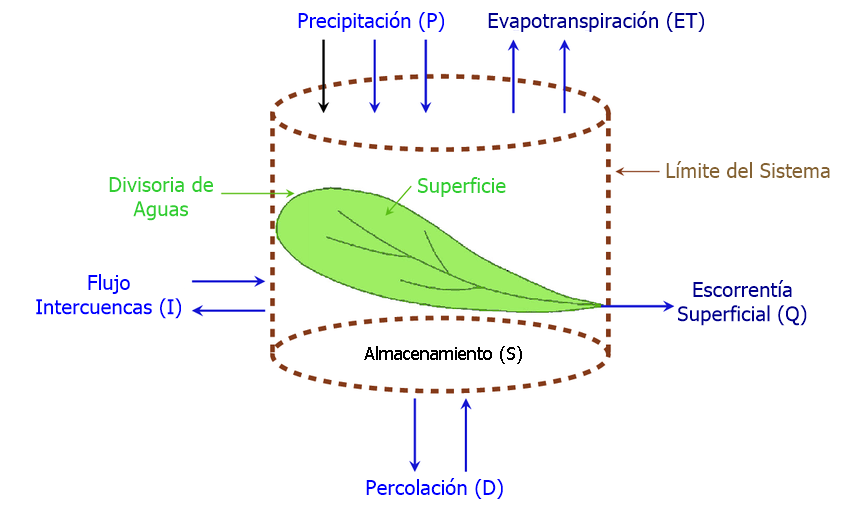
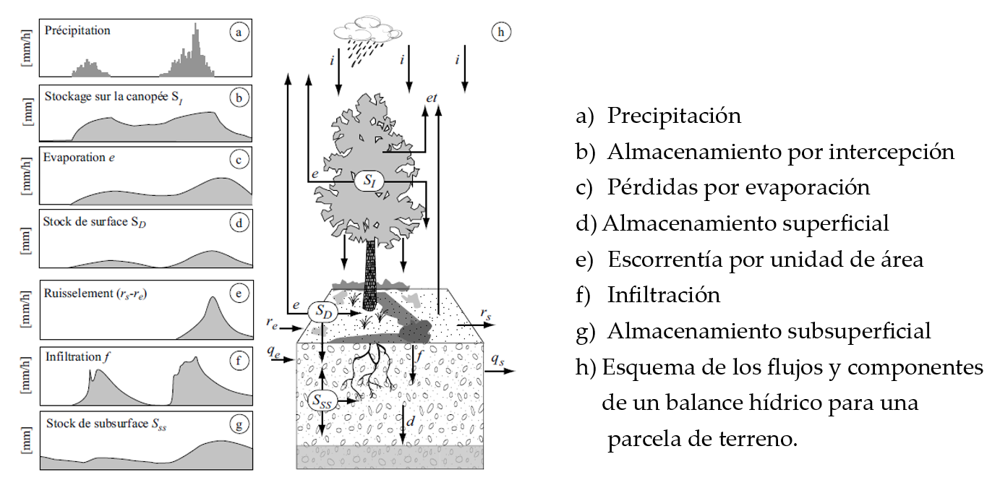

::: {.quote-block}
"Nada se crea, nada se pierde, todo se transforma."\
— *Antoine Lavoisier (químico francés, formulador de la ley de conservación de la masa)*
:::

El balance hídrico constituye la aplicación directa de la ley de conservación de la masa a una unidad hidrológica definida, como una cuenca hidrográfica, un embalse o un acuífero. 

Este concepto es fundamental en la hidrología, ya que permite realizar una contabilidad sistemática de las entradas, salidas y variaciones en el almacenamiento de agua dentro de límites espaciales y temporales claramente establecidos. En este sentido, <span class="firebrick"><strong>el balance hídrico representa la base teórica sobre la cual se sustentan la mayoría de los modelos hidrológicos y los estudios de disponibilidad, gestión y planificación del recurso hídrico</strong></span>.


## Conservación de la masa aplicada al ciclo hidrológico

La conservación de la masa constituye el principio físico más fundamental y operativo del análisis hidrológico, y representa el pilar sobre el cual se apoyan prácticamente todos los problemas aplicados en esta disciplina. En el contexto del ciclo hidrológico, este principio se materializa mediante la ecuación de continuidad, la cual permite realizar una contabilidad cuantitativa del agua, conocida también como **balance hídrico** dentro de un sistema definido explícitamente en el espacio y en el tiempo.

Desde un punto de vista hidrológico, el balance hídrico no es únicamente una relación matemática, sino una herramienta conceptual que permite interpretar, comparar y predecir la respuesta de un sistema frente a variaciones climáticas, cambios en el uso del suelo o intervenciones antrópicas.

## El concepto de sistema y volumen de control

Para aplicar las leyes físicas al movimiento y almacenamiento del agua es necesario definir un sistema hidrológico. Un sistema se concibe como un volumen espacial delimitado por una frontera (real o imaginaria) que puede recibir entradas, experimentar procesos internos y producir salidas. En hidrología, dicha frontera suele coincidir con los límites topográficos de una cuenca hidrográfica, aunque también puede definirse a nivel de un acuífero, un embalse, una parcela de suelo o incluso el sistema terrestre completo.

```{r}
#| label: fig-cuenca
#| fig-cap: "Entradas y salidad aplicadas a un sistema hidrológico.<br><span style='font-size:0.8em;'>Fuente: [@MasísCampos2020_BurioQuebradaSeca]</span><br><span style='font-size:0.8em;'>Modificado por (Matarrita,2025)"
#| fig-align: center
#| out-width: 100%
#| echo: false
#| class: fig-border



```

La formulación matemática del balance hídrico se apoya en la transición desde una descripción lagrangiana del flujo (seguimiento de partículas individuales de agua) hacia una descripción euleriana (observación del flujo a través de un espacio fijo). Esta transición se formaliza mediante el *Teorema de Transporte de Reynolds*, el cual establece que la tasa de cambio temporal de una propiedad extensiva[^PE] dentro de un sistema es igual a la suma de la tasa de cambio de dicha propiedad almacenada en un volumen de control y el flujo neto de la propiedad a través de su superficie.

[^PE]:Una propiedad extensiva es aquella que depende directamente de la cantidad de materia o del tamaño del sistema. Esto significa que su valor aumenta o disminuye proporcionalmente al número de partículas o a la masa presente. Por ejemplo, la masa, el volumen y la energía interna son propiedades extensivas porque si se divide un sistema en dos partes, cada parte tendrá una fracción de la propiedad, y al sumarlas se recupera el valor total. En términos matemáticos, si un sistema se compone de varias partes $i$ la propiedad extensiva $x$ se expresa como:
<br>
$$
X=\sum{X_i}
$$
<br>
Así, las propiedades extensivas son aditivas y reflejan la magnitud global del sistema, a diferencia de las propiedades intensivas (como la temperatura o la presión), que no dependen de la cantidad de materia.

## La ecuación de continuidad integral y su desagregación en cuencas hidrográficas

Al aplicar el principio de conservación de la masa al Teorema de Transporte de Reynolds, y considerando que en los procesos hidrológicos convencionales la masa de agua no se crea ni se destruye, se obtiene la ecuación de continuidad integral para un fluido de densidad constante:

$$
\frac{dS}{dt} = I(t) - O(t)
$$

donde:

- $S$ representa el almacenamiento total de agua dentro del volumen de control,
- $\frac{dS}{dt}$ es la tasa de cambio del almacenamiento en el tiempo,
- $I(t)$ corresponde a la tasa total de entradas de agua al sistema,
- $O(t)$ corresponde a la tasa total de salidas de agua del sistema.

Esta expresión establece que cualquier incremento o disminución del almacenamiento interno del sistema es consecuencia directa de un desbalance entre las entradas y las salidas de agua.

En condiciones de **régimen permanente** o **flujo estacionario**, el almacenamiento no varía con el tiempo, por lo que:

$$
\frac{dS}{dt} = 0
\quad\Rightarrow\quad
I(t) = O(t)
$$

lo cual implica que el sistema transmite el agua sin acumularla ni liberarla netamente. Esto se cumple en análisis de balance hídrico de largo plazo ($t\ge 30$ años).

## Aplicación de la ecuación de continuidad a una cuenca hidrográfica

Cuando el volumen de control corresponde a una cuenca hidrográfica, la ecuación de continuidad puede desagregarse para identificar explícitamente los principales procesos hidrológicos superficiales y subsuperficiales.

### Balance hídrico superficial

Para una cuenca que no presenta importación ni exportación lateral de caudales hacia cuencas vecinas (trasvase), el balance hídrico superficial puede expresarse como:

$$
\Delta S_S = \Delta S_D + \Delta S_I = P - I - E - R
$$

donde:

- $\Delta S_S$ es el cambio en el almacenamiento superficial total.
- $\Delta S_D$ corresponde al almacenamiento en depresiones superficiales.
- $\Delta S_I$ es el almacenamiento por intercepción.
- $P$ es la precipitación.
- $I$ es la infiltración hacia el suelo.
- $E$ es la evaporación directa.
- $R$ es la escorrentía superficial.

Esta ecuación describe la partición inicial de la precipitación una vez que alcanza la superficie terrestre.

### Balance hídrico subsuperficial

De forma complementaria, el balance hídrico subsuperficial se expresa como:

$$
\Delta S_{SS} = I - ET - D
$$

donde:

- $\Delta S_{SS}$ es el cambio en el almacenamiento subsuperficial (zona no saturada y acuíferos).
- $ET$ es la evapotranspiración.
- $D$ es la percolación profunda hacia acuíferos o estratos más profundos.

Este balance gobierna la dinámica del agua infiltrada y su interacción con la vegetación y el sistema subterráneo.

## Simplificaciones habituales del balance hídrico en cuencas

Para una cuenca completa y un intervalo de tiempo $\Delta T$, es común adoptar ciertas simplificaciones, especialmente cuando se trabaja a escalas espaciales grandes o temporales prolongadas.

A. **Suposición de almacenamiento superficial nulo**

Si se asume que el almacenamiento superficial total es despreciable al final del periodo de análisis:

$$
\Delta S_S \approx 0
\quad\Rightarrow\quad
P - I - E - R = 0
$$

B. **Suposición de cambio nulo en el almacenamiento subterráneo**

Si además se considera que el cambio neto en el almacenamiento de acuíferos es aproximadamente cero:

$$
D \approx 0
\quad\Rightarrow\quad
\Delta S_{SS} + ET = I
$$

combinando ambas expresiones se obtiene:

$$
\frac{\Delta S_{SS}}{\Delta T} = P - E - ET - R
$$

Finalmente, si $\Delta T$ corresponde a un **ciclo hidrológico completo** (por ejemplo, un año hidrológico) y se cumple que:

$$
\Delta S_{SS} \approx 0
$$

entonces el balance se reduce a la forma clásica:

$$
R = P - E - ET
$$

Estas simplificaciones introducen errores que <u>tienden a disminuir conforme aumenta el tamaño de la cuenca y el periodo de análisis</u>. En cuencas pequeñas, en estudios de eventos individuales o en sistemas con lagos, humedales o embalses significativos, los términos de almacenamiento no pueden despreciarse y deben ser considerados explícitamente.


## Consideraciones de escala espacial y temporal

La aplicación e interpretación del balance hídrico dependen fuertemente de la escala de análisis:

- Escala espacial: el balance puede formularse a nivel de una parcela, una cuenca, una región, un continente o el sistema global. En el balance hídrico mundial, el sistema se considera esencialmente cerrado, ya que la masa total de agua de la hidrosfera permanece prácticamente constante.

```{r}
#| label: fig-bh2
#| fig-cap: "Balance hídrico a nivel de parcela.<br><span style='font-size:0.8em;'>Fuente: (Hingray, Picouet & Musy, 2015).</span><br><span style='font-size:0.8em;'>Tomado de: [@Bob2025]</span>"
#| fig-align: center
#| out-width: 100%
#| echo: false
#| class: fig-border



```

- Escala temporal: para intervalos cortos (eventos de lluvia, tormentas), el término de almacenamiento es crítico y domina la respuesta hidrológica. En cambio, para periodos largos (años hidrológicos o décadas), el cambio neto de almacenamiento suele ser pequeño en comparación con los volúmenes acumulados de precipitación y evapotranspiración.

  Bajo esta última condición, el balance hídrico anual de una cuenca puede aproximarse como:
$$
P \approx Q + ET
$$
<br>
  lo cual constituye una simplificación ampliamente utilizada en estudios regionales y de planificación de recursos hídricos.


