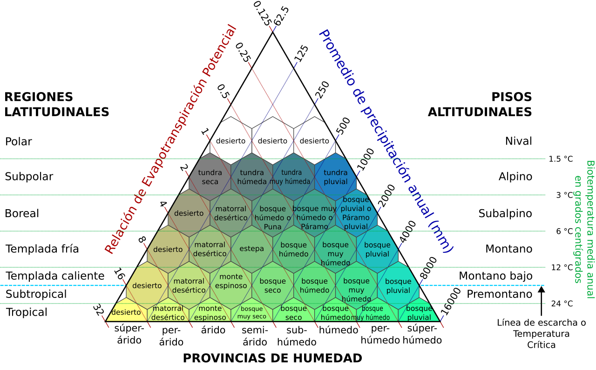
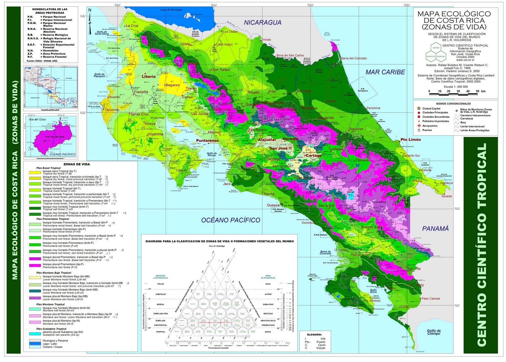
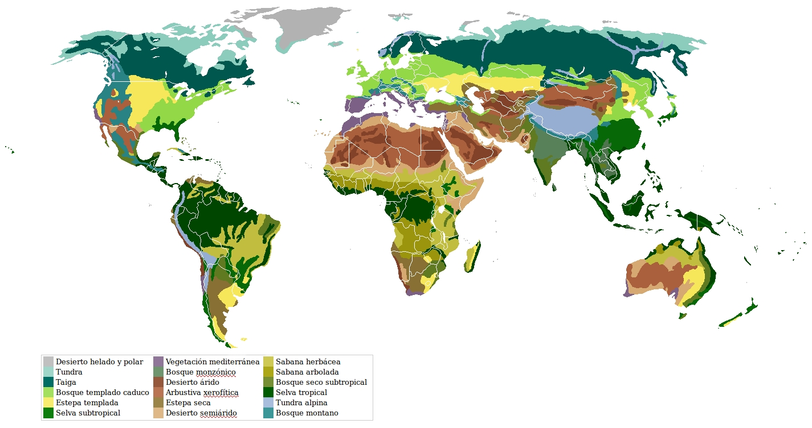
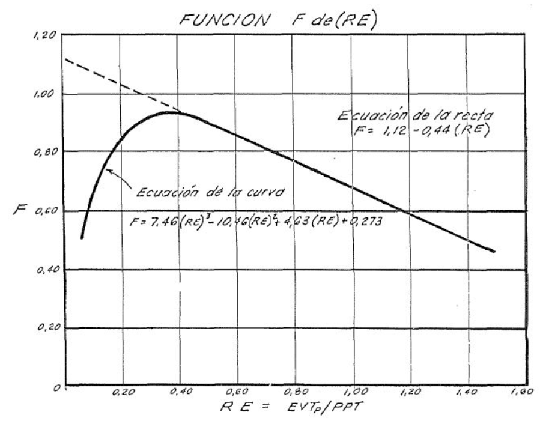
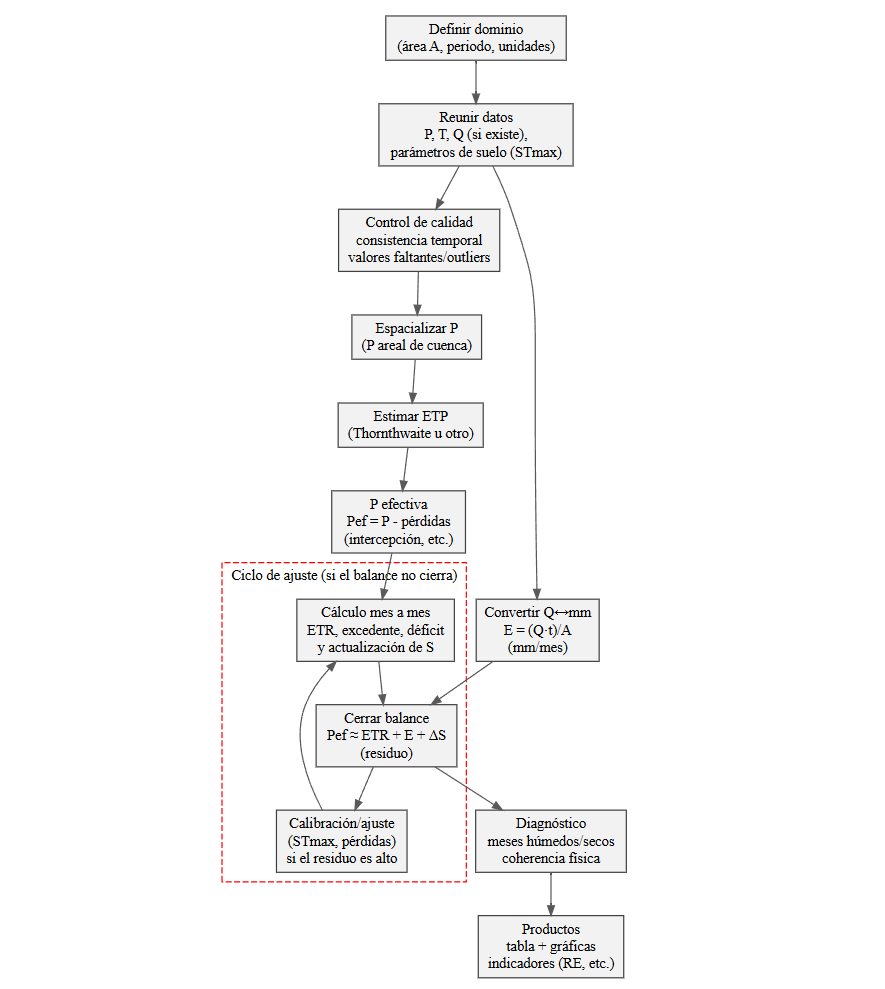

::: {.quote-block}
"La hidrología trata esencialmente de contabilizar el agua en el tiempo y en el espacio."\
— *R. Allan Freez, hidrólogo físico.*
:::

El balance hídrico a nivel de cuenca constituye el marco fundamental para el análisis cuantitativo del funcionamiento hidrológico de un territorio, al permitir describir de manera integrada la relación entre las entradas de agua (principalmente la precipitación), las salidas (escorrentía superficial, evapotranspiración y flujos subterráneos) y los cambios en el almacenamiento (suelo, acuíferos, cuerpos de agua y nieve, cuando aplica). Basado en el principio de conservación de la masa, el balance hídrico proporciona una herramienta conceptual y operativa para evaluar la disponibilidad de recursos hídricos, interpretar la respuesta hidrológica ante eventos climáticos extremos y analizar los efectos del uso del suelo y del cambio climático. A escala de cuenca, este enfoque permite cerrar la contabilidad del agua en el espacio y en el tiempo, sirviendo como base para la modelación hidrológica, la planificación y gestión del recurso hídrico, y el diseño de infraestructuras hidráulicas con criterios de sostenibilidad y consistencia física.

## Balance de masa como herramienta de diagnóstico y planificación

Más allá de ser una entidad contable, el balance hídrico es una herramienta diagnóstica que permite evaluar la coherencia física de los flujos de agua y una herramienta de planificación que apoya la toma de decisiones en contextos de disponibilidad limitada, variabilidad climática y presión antrópica.

Desde el punto de vista físico, el balance de masa se fundamenta en el principio de conservación, según el cual toda variación del almacenamiento hídrico dentro de una cuenca debe explicarse exclusivamente por la diferencia entre las entradas y las salidas de agua. Expresado de forma general para un volumen de control hidrológico, el balance puede escribirse como:

$$
P - ETR - R - D = \Delta S
$$

donde $P$ es la precipitación areal, $ETR$ la evapotranspiración real, $R$ la escorrentía superficial, $D$ las pérdidas profundas (si existen) y $\Delta S$ la variación del almacenamiento total (suelo, acuíferos someros, nieve, embalses).

### El balance como herramienta de diagnóstico hidrológico

En el análisis hidrológico aplicado, el balance de masa permite diagnosticar el comportamiento interno de la cuenca, aun cuando no se disponga de mediciones directas de todos los procesos. A partir de información climática básica y supuestos físicamente razonables, el balance actúa como un *control de consistencia, en el cual cualquier discrepancia significativa indica problemas en los datos, en los supuestos o en la conceptualización del sistema.

Por ejemplo, en balances anuales de cuencas no reguladas, suele asumirse que:

$$
\Delta S \approx 0
$$

bajo la hipótesis de que los almacenamientos iniciales y finales son estadísticamente similares. En este contexto, el balance se reduce a:

$$
R \approx P - ETR
$$

Esta relación permite inferir la escorrentía media anual sin necesidad de registros de caudal, lo cual es particularmente útil en cuencas no instrumentadas. Si los valores obtenidos resultan físicamente inconsistentes (por ejemplo, $ETR > P$ de forma sostenida), el balance revela errores en la estimación de la evapotranspiración, en la precipitación ponderada por área o incluso en la delimitación de la cuenca.

Asimismo, el balance mensual o estacional permite identificar periodos de déficit hídrico y periodos de excedencia, asociados a la dinámica de almacenamiento del suelo. Es por esto que el balance no solo cuantifica flujos, sino que **explica procesos**.

### El balance como herramienta de planificación hídrica

Desde una perspectiva de gestión, el balance de masa es una herramienta clave para la planificación hídrica sostenible. Permite responder, de forma cuantitativa, preguntas fundamentales como:

- ¿Cuánta agua genera una cuenca en promedio?

- ¿Cuál es la fracción de la precipitación que se pierde por evapotranspiración?

- ¿Cómo varía la disponibilidad hídrica entre estaciones secas y húmedas?

- ¿Qué magnitud de cambio puede esperarse ante modificaciones climáticas o de uso del suelo?

En planificación, el balance se utiliza para evaluar escenarios, comparando balances bajo distintas condiciones de precipitación, cobertura vegetal o demanda atmosférica. Por ejemplo, un aumento en la evapotranspiración potencial, asociado a un incremento de temperatura, se traduce directamente en una reducción de la escorrentía disponible, lo cual puede cuantificarse mediante el balance sin necesidad de modelos hidrológicos complejos.

De igual forma, el balance hídrico es una herramienta central en:

a. Evaluación de disponibilidad para abastecimiento humano y agrícola.  
b. Dimensionamiento preliminar de infraestructura hidráulica.  
c. Análisis de vulnerabilidad frente a sequías.  
d. Estudios de impacto por cambio de uso del suelo.

En todos estos casos, el balance actúa como un primer nivel de análisis, robusto desde el punto de vista físico y transparente desde el punto de vista metodológico.

### Ventajas del enfoque de balance de masa

El balance de masa del agua constituye una herramienta central en la hidrología aplicada, no solo como una identidad contable basada en el principio de conservación, sino como un instrumento técnico para el diagnóstico del funcionamiento interno de una cuenca y para la planificación de sus recursos hídricos. A partir de la relación entre precipitación, evapotranspiración real, escorrentía y variación del almacenamiento, el balance permite evaluar la coherencia física de los flujos hidrológicos, identificar inconsistencias en los datos o en los supuestos adoptados y comprender cómo interactúan el clima, el suelo y la cobertura vegetal en la generación de escorrentía. 

En escalas temporales suficientemente largas, donde suele asumirse que la variación neta del almacenamiento es despreciable, el balance se convierte en una herramienta poderosa para estimar la disponibilidad hídrica media y analizar la respuesta de cuencas instrumentadas y no instrumentadas. Desde el punto de vista de la planificación, el balance de masa permite explorar escenarios de cambio climático, variaciones en el uso del suelo o incrementos en la demanda atmosférica, cuantificando de forma directa sus efectos sobre la escorrentía y la disponibilidad de agua. 

## Evapotranspiración real en balances

La evapotranspiración real, denotada como $ETR$, representa la pérdida efectiva de agua hacia la atmósfera desde una cuenca, integrando la evaporación desde superficies húmedas (suelo, agua libre, intercepción) y la transpiración de la vegetación. En un balance hídrico a escala de cuenca, la $ETR$ suele ser el término más influyente y, a la vez, el más difícil de medir directamente. Por esta razón, el análisis técnico del balance hídrico requiere comprender con precisión la diferencia entre evapotranspiración potencial ($ETP$) y evapotranspiración real ($ETR$), así como los mecanismos físicos que limitan o permiten que ambas coincidan.


### De $ETP$ a $ETR$: restricciones físicas

La evapotranspiración potencial $ETP$ cuantifica la **demanda atmosférica** de agua: es la tasa máxima a la cual la atmósfera podría extraer vapor si la superficie estuviera en condiciones ideales de suministro hídrico (suelo saturado o vegetación con agua ilimitada). Por tanto, $ETP$ está controlada principalmente por variables meteorológicas como radiación, temperatura, viento y humedad relativa, y no por la cantidad real de agua disponible en el suelo.

En contraste, la evapotranspiración real $ETR$ expresa lo que **realmente ocurre** bajo condiciones naturales, donde el suministro hídrico suele ser limitado. La relación fundamental que guía el balance es:

$$
0 \le ETR \le ETP
$$

La razón por la cual $ETR$ puede ser menor que $ETP$ se explica mediante restricciones físicas asociadas a la disponibilidad de agua en la cuenca, principalmente:

- <u>Humedad del suelo en la zona radicular</u>  
  Si el almacenamiento disponible en el suelo disminuye, las plantas reducen transpiración por cierre estomático y la evaporación del suelo se limita por difusión de vapor.

- <u>Capacidad de almacenamiento y recarga</u>  
  Un suelo con baja capacidad de almacenamiento útil agota rápidamente el agua disponible durante periodos secos, reduciendo $ETR$ aunque la atmósfera mantenga alta demanda.

- <u>Intercepción y humedad superficial</u>  
  Tras una lluvia, parte de la evaporación ocurre desde agua interceptada o superficie húmeda, lo que puede aumentar $ETR$ temporalmente. Sin embargo, al secarse, el sistema retorna al control por el suelo.

- <u>Estado de la vegetación</u>  
  La cobertura vegetal y su fenología alteran la conductancia superficial y, por tanto, la fracción de $ETP$ que puede materializarse como $ETR$.

Desde el punto de vista operativo, existen dos enfoques principales para cuantificar $ETR$ en balances:

```{r}
#| label: tbl-BH1
#| tbl-cap: "Enfoques prinicipales para la estimacion de $ETR$."
#| echo: false
#| message: false
#| warning: false

library(kableExtra)

tabla_etr <- data.frame(
  `Tipo de ETR` = c(
    "ETR medida",
    "ETR estimada"
  ),
  `Descripción técnica` = c(
    "Se obtiene mediante técnicas instrumentales (torres de covarianza de remolinos, lisímetros, balance de energía, productos satelitales calibrados). Estas aproximaciones pueden ser muy precisas, pero son costosas, requieren calibración y rara vez están disponibles para cuencas completas.",
    "Se calcula a partir de ETP, precipitación y restricciones de almacenamiento, utilizando modelos conceptuales o funciones empíricas. Este enfoque es el más común en balances hídricos de cuenca debido a su robustez operativa y a la menor necesidad de datos."
  ),
  check.names = FALSE
)

tabla_etr |>
  kbl(
    format   = "html",
    booktabs = TRUE,
    align    = c("c", "c"),
    escape   = FALSE
  ) |>
  kable_classic(html_font = "Latin Modern Roman") |>
  kable_styling(
    full_width        = TRUE,
    bootstrap_options = c("striped", "hover", "condensed")
  ) |>
  row_spec(0, bold = TRUE,
           extra_css = "text-align: center; vertical-align: middle;") |>
  row_spec(1:nrow(tabla_etr),
           extra_css = "text-align: center; vertical-align: middle;") |>
  column_spec(1, width = "18em",
              extra_css = "text-align: center; vertical-align: middle;") |>
  column_spec(2, width = "45em",
              extra_css = "text-align: center; vertical-align: middle;")
```


En práctica, se usa $ETR$ medida cuando existe disponibilidad confiable de mediciones representativas de cuenca y se requiere alta precisión (calibración de modelos o estudios avanzados). En la mayoría de estudios aplicados de cuencas, se utiliza $ETR$ estimada para cerrar el balance con consistencia física.

## Zonas de vida y evapotranspiración real en cuencas

El enfoque de balance hídrico adquiere una profundidad conceptual y operativa notable cuando se integra con marcos bioclimáticos, particularmente con el sistema de zonas de vida desarrollado por [@Holdridge1967] a mediados del siglo XX. Esta integración permite trascender una visión puramente contable del balance de masa del agua y avanzar hacia una interpretación funcional del clima, la vegetación y la disponibilidad hídrica efectiva a escala de cuenca. En este contexto, la evapotranspiración real (ETR) deja de ser un término residual del balance y pasa a constituirse en una variable diagnóstica central del comportamiento hidrológico del sistema.

Holdridge propuso una clasificación climática global basada en relaciones funcionales entre la precipitación media anual, la evapotranspiración potencial y la biotemperatura media anual. Las denominadas zonas de vida se conciben como asociaciones vegetales que reflejan un equilibrio dinámico entre el clima y los procesos ecohidrológicos dominantes, incorporando de manera implícita tanto las condiciones térmicas como la disponibilidad de agua. A diferencia de otras clasificaciones climáticas, el sistema de Holdridge introduce explícitamente la razón de evapotranspiración potencial como variable de control, lo que establece un puente directo con el análisis hidrológico de cuencas.

```{r}
#| label: fig-ZV
#| fig-cap: "Diagrama de zonas de vida de Holdrige.<br><span style='font-size:0.8em;'>Fuente: [@Holdridge1967]."
#| fig-align: center
#| out-width: 100%
#| echo: false
#| class: fig-border



```

A partir de esta investigación, se ha definido para Costa Rica un mapa de zonas de vida.

```{r}
#| label: fig-MECR
#| fig-cap: "Mapa de zonas de vida de Costa Rica.<br><span style='font-size:0.8em;'>Fuente: [@Holdridge1967]."
#| fig-align: center
#| out-width: 100%
#| echo: false
#| class: fig-border



```

> **Nota**: La información de las zonas de vida está disponible en repositorio como el Atlas de Costa Rica del TEC, el Servicio Nacional de Información Topográfica (SNIT), así como artículos de investigación o estudios hidrológicos publicados por instituciones públicas.

Además se han definido modelos de zonas de vida a escala global. 

```{r}
#| label: fig-MZVG
#| fig-cap: "Mapa de zonas de vida a escala global.<br><span style='font-size:0.8em;'>Fuente: [@Holdridge1967]."
#| fig-align: center
#| out-width: 100%
#| echo: false
#| class: fig-border



```

La biotemperatura media anual, $T_b$, representa la temperatura efectiva para el crecimiento vegetal y se define como la temperatura media anual ajustada para excluir valores fuera del rango fisiológicamente activo de las plantas. Esta variable sintetiza el control térmico sobre los procesos evaporativos y biológicos, y permite relacionar de forma empírica la evapotranspiración potencial con el régimen climático mediante la expresión:

$$
ETP = 58.93\,T_b
$$

donde $ETP$ se expresa en milímetros por año y $T_b$ en grados Celsius. Esta relación, ampliamente utilizada en estudios bioclimáticos e hidrológicos en regiones tropicales, proporciona una estimación consistente de la demanda atmosférica a partir de información térmica básica.

La conexión clave entre clima y balance de cuenca se establece mediante la razón climática de evapotranspiración potencial:

$$
RE = \frac{ETP}{P}
$$

donde $P$ corresponde a la precipitación media anual areal de la cuenca. Esta razón adimensional resume el grado relativo de demanda atmosférica respecto al suministro hídrico y permite clasificar el comportamiento hidrológico promedio de una cuenca. Valores bajos de $RE$ indican climas húmedos, con precipitación excedente respecto a la demanda evaporativa, mientras que valores altos reflejan climas secos, donde la demanda potencial supera sistemáticamente a la oferta hídrica.

La interpretación hidrológica de $RE$ es directa. 

- Cuando $RE<1$, la precipitación es suficiente para satisfacer la demanda atmosférica potencial y la evapotranspiración real tiende a aproximarse a la evapotranspiración potencial. En este régimen, los excedentes hídricos favorecen la recarga del almacenamiento del suelo y la generación de escorrentía. 

- Cuando $RE\approx 1$, la cuenca opera cerca de un equilibrio hidrológico, y pequeñas variaciones en precipitación o almacenamiento del suelo pueden producir cambios significativos en la partición entre evapotranspiración y escorrentía. 

- Cuando $RE>1$, la cuenca se encuentra bajo un régimen deficitario, en el cual la evapotranspiración real queda limitada por la disponibilidad de agua y resulta sistemáticamente menor que la evapotranspiración potencial.

No obstante, la razón $RE$ por sí sola no permite cuantificar la evapotranspiración real. Para ello se introduce la función de reducción:

$$
F = \frac{ETR}{ETP}
$$

de modo que la evapotranspiración real puede expresarse como:

$$
ETR = F(RE)\,ETP
$$

```{r}
#| label: fig-RS
#| fig-cap: "Función F(Re).<br><span style='font-size:0.8em;'>Fuente: [@RodriguezSaborio1983]."
#| fig-align: center
#| out-width: 100%
#| echo: false
#| class: fig-border



```

Esta formulación presenta ventajas operativas fundamentales en balances hídricos de cuenca. En primer lugar, transforma la estimación de $ETR$ en la determinación de una fracción adimensional acotada entre cero y uno. En segundo lugar, permite el uso de relaciones empíricas calibradas regionalmente. Finalmente, es coherente con balances anuales y estacionales en los que no se modela explícitamente la dinámica del almacenamiento del suelo.

Desde un punto de vista físico, cualquier función $F(RE)$ debe cumplir condiciones mínimas de consistencia: 

1. $0 \le F \le 1$, $F \to 1$.

2. En regímenes muy húmedos ($RE \to 0$).

3. $F$ decreciente en regímenes secos ($RE$ creciente), reflejando la limitación progresiva de la evapotranspiración por disponibilidad de agua.

Sobre esta base conceptual, Rodríguez y Saborío, a inicios de la década de 1980, desarrollaron una adaptación operativa del enfoque de Holdridge para condiciones tropicales de Costa Rica, orientada específicamente a balances hídricos anuales en cuencas con información limitada. Su trabajo consistió en reinterpretar funcionalmente los diagramas originales de zonas de vida y ajustar expresiones empíricas por tramos para la función $F(RE)$, basadas en análisis regionales y validaciones hidrológicas. Estas expresiones permiten describir de forma continua la transición entre regímenes húmedos y secos:

$$
F =
\begin{cases}
1.12 - 0.44\,RE, & \text{si } 0.45 < RE < 1.50 \\
7.4617\,RE^3 - 10.4552\,RE^2 + 4.6285\,RE + 0.2727, & \text{si } 0.0625 < RE < 0.45
\end{cases}
$$

La interpretación física de estas relaciones es consistente con el marco conceptual del balance hídrico. En climas muy húmedos, caracterizados por valores bajos de $RE$, la evapotranspiración real se aproxima a la evapotranspiración potencial, ya que la disponibilidad hídrica no constituye una limitante. A medida que aumenta la aridez climática, la fracción $F$ disminuye y una proporción creciente de la demanda atmosférica no puede ser satisfecha, lo que se traduce en una reducción sistemática de la evapotranspiración real.

Al integrar esta formulación con la ecuación básica del balance hídrico de cuenca, y considerando periodos suficientemente largos para asumir $\Delta S \to 0$, se obtiene una expresión operacional de gran utilidad práctica:

$$
R = P - ETR = P - F(RE)\,ETP
$$

y, sustituyendo la relación empírica entre $ETP$ y la biotemperatura:

$$
R = P - F(RE)\,58.93\,T_b
$$

Esta expresión permite cerrar el balance hídrico anual de una cuenca utilizando únicamente precipitación media anual y temperatura media anual, incorporando de manera implícita el control climático y biológico sobre la producción de escorrentía superficial. 

Su aplicación resulta particularmente valiosa en cuencas no instrumentadas o con series hidrométricas incompletas, donde la estimación directa de la evapotranspiración real no es posible. No obstante, su uso debe restringirse a escalas temporales largas y a contextos donde las variables climáticas utilizadas sean representativas del comportamiento promedio del sistema, reconociendo que no sustituye modelos hidrológicos detallados cuando se requiere análisis a escala mensual o diaria.


## Balance hídrico mensual (modelo simplificado)

El balance hídrico mensual constituye una de las herramientas más utilizadas en hidrología aplicada cuando se requiere evaluar, de manera operativa y consistente, la disponibilidad de agua en una cuenca a lo largo del año hidrológico. Su fortaleza radica en que permite capturar la estacionalidad climática dominante, integrando de forma explícita la precipitación, la demanda atmosférica y la capacidad de almacenamiento del suelo, sin recurrir a modelos hidrológicos de alta complejidad.

Desde el punto de vista conceptual, el balance hídrico mensual se apoya en la ecuación general de conservación de masa aplicada a un volumen de control que corresponde a la cuenca:

$$
P = ETR + R + \Delta S
$$

donde $P$ es la precipitación media mensual, $ETR$ la evapotranspiración real mensual, $R$ la escorrentía total (superficial y subterránea integrada) y $\Delta S$ la variación mensual del almacenamiento de agua en el suelo. A diferencia del balance anual, en el balance mensual el término $\Delta S$ no puede despreciarse, ya que el suelo actúa como un reservorio dinámico que amortigua los excesos y déficits hídricos entre meses consecutivos.

**Estructura de cálculo mes a mes**

El procedimiento de cálculo se organiza de manera secuencial, avanzando mes a mes y utilizando el estado del sistema al final de un mes como condición inicial del siguiente. El elemento central de esta estructura es el almacenamiento de humedad del suelo, $S$, limitado por una capacidad máxima $ST_{\max}$, que representa el volumen máximo de agua que puede ser retenido en la zona radicular.

Para cada mes $i$, el balance se construye siguiendo los pasos conceptuales:

1. Se conoce la precipitación mensual $P_i$ y la evapotranspiración potencial $ETP_i$, estimada previamente mediante un método climático (por ejemplo Thornthwaite, Hargreaves, etc.).
2. Se evalúa la disponibilidad hídrica del suelo al inicio del mes, $S_{i-1}$.
3. Se determina la evapotranspiración real $ETR_i$, limitada por:
   - La demanda atmosférica ($ETP_i$).
   - La cantidad de agua disponible en el sistema ($P_i + S_{i-1}$).
4. Se actualiza el almacenamiento del suelo:
$$
S_i = \min\left(ST_{\max},\, S_{i-1} + P_i - ETR_i\right)
$$
5. Si $S_{i-1} + P_i - ETR_i > ST_{\max}$, el excedente se asigna a escorrentía:
$$
R_i = S_{i-1} + P_i - ETR_i - ST_{\max}
$$
6. Si $S_{i-1} + P_i < ETP_i$, ocurre un déficit hídrico y:
$$
ETR_i = S_{i-1} + P_i,\quad S_i = 0
$$

Este esquema permite representar explícitamente los períodos húmedos (recarga y excedentes) y secos (agotamiento del almacenamiento), reproduciendo el comportamiento hidrológico estacional típico de muchas cuencas.

**Balance entre entradas, uso y salidas**

En el balance mensual, la precipitación constituye la única entrada externa al sistema, mientras que la evapotranspiración real representa el principal uso consuntivo del agua dentro de la cuenca. La escorrentía, por su parte, es el mecanismo mediante el cual los excedentes hídricos se transfieren fuera del sistema de control.

Una forma de interpretar el balance mensual es considerar al suelo como un “regulador” que prioriza la satisfacción de la demanda evaporativa hasta donde la disponibilidad lo permite. En meses húmedos, el suelo se recarga y, una vez saturado, el exceso se transforma en escorrentía. En meses secos, el suelo libera agua almacenada para sostener la evapotranspiración, reduciendo progresivamente $S$ hasta alcanzar condiciones de déficit.

Este comportamiento explica por qué, aun con precipitaciones anuales similares, cuencas con distinta distribución intraanual de $P$ pueden presentar respuestas hidrológicas muy diferentes.

**Flujo de trabajo para estimaciones operativas**

Desde una perspectiva práctica, el balance hídrico mensual se implementa siguiendo un flujo de trabajo estandarizado, particularmente útil en estudios de planificación hídrica, evaluación de disponibilidad y análisis preliminares en cuencas con información limitada:

- Definir el período de análisis y el año hidrológico.
- Estimar $P_i$ promedio pornderada para cada mes.
- Calcular $ETP_i$ mediante un método climático consistente.
- Estimar o asumir $ST_{\max}$ a partir de información edáfica y de uso del suelo.
- Inicializar el almacenamiento del suelo ($S_0$), usualmente como $ST_{\max}$ o mediante condiciones promedio.
- Aplicar el balance mes a mes de forma secuencial.
- Analizar los resultados en términos de:
  - Meses con excedente ($R_i > 0$).
  - Meses con déficit ($ETR_i < ETP_i$).
  - Evolución estacional del almacenamiento.
  
  
```{r eval=FALSE}
#| label: fig-bh-flujo-trabajo-vertical
#| fig-cap: "Flujo de trabajo operativo para un balance hídrico mensual."
#| fig-align: center
#| out-width: 80%
#| echo: false
#| message: false
#| warning: false
#| class: fig-border

if (!requireNamespace("DiagrammeR", quietly = TRUE)) {
  install.packages("DiagrammeR")
}

library(DiagrammeR)

grViz("
digraph flujo_BH_mensual {

  graph [layout = dot, rankdir = TB, bgcolor = 'white', fontsize = 12]
  node  [shape = box, style = filled, fontname = Palatino_Linotype, fontsize = 12,
         color = gray25, fillcolor = gray95]
  edge  [color = gray35, arrowsize = 0.8]

  n1  [label = 'Definir dominio\\n(área A, periodo, unidades)']
  n2  [label = 'Reunir datos\\nP, T, Q (si existe),\\nparámetros de suelo (STmax)']
  n3  [label = 'Control de calidad\\nconsistencia temporal\\nvalores faltantes/outliers']
  n4  [label = 'Espacializar P\\n(P areal de cuenca)']
  n5  [label = 'Estimar ETP\\n(Thornthwaite u otro)']
  n6  [label = 'P efectiva\\nPef = P - pérdidas\\n(intercepción, etc.)']
  n7  [label = 'Cálculo mes a mes\\nETR, excedente, déficit\\ny actualización de S']
  n8  [label = 'Convertir Q↔mm\\nE = (Q·t)/A\\n(mm/mes)']
  n9  [label = 'Cerrar balance\\nPef ≈ ETR + E + ΔS\\n(residuo)']
  n10 [label = 'Diagnóstico\\nmeses húmedos/secos\\ncoherencia física']
  n11 [label = 'Productos\\ntabla + gráficas\\nindicadores (RE, etc.)']
  n12 [label = 'Calibración/ajuste\\n(STmax, pérdidas)\\nsi el residuo es alto']

  n1 -> n2 -> n3 -> n4 -> n5 -> n6 -> n7 -> n9 -> n10 -> n11
  n2 -> n8 -> n9

  subgraph cluster_iter {
    style = dashed
    color = red
    label = 'Ciclo de ajuste (si el balance no cierra)'
    fontname = Palatino_Linotype
    fontsize = 12
    n9 -> n12 -> n7
  }
}
")
```

```{r}
#| label: fig-diagrama
#| fig-cap: "Diagrama de flujo para estimación de balance hídrico."
#| fig-align: center
#| out-width: 100%
#| echo: false
#| class: fig-border



```


La siguiente tabla resume la estructura típica de un balance hídrico mensual simplificado, utilizada como base para implementaciones computacionales y hojas de cálculo operativas.


```{r}
#| label: tbl-BHM
#| tbl-cap: "Estructura de balance hídrico mensual."
#| echo: false
#| message: false
#| warning: false

library(knitr)
library(kableExtra)

tabla_esquema <- data.frame(
  Mes = c("Ene", "Feb", "Mar", "..."),
  P_mm = c("P₁", "P₂", "P₃", "..."),
  ETP_mm = c("ETP₁", "ETP₂", "ETP₃", "..."),
  ETR_mm = c("ETR₁", "ETR₂", "ETR₃", "..."),
  S_fin_mm = c("S₁", "S₂", "S₃", "..."),
  R_mm = c("R₁", "R₂", "R₃", "...")
)

tabla_esquema |>
  kbl(
    format = "html",
    booktabs = TRUE,
    align = "c",
    escape = FALSE) |>
  kable_classic(full_width = TRUE)
```

En términos gráficos, resulta especialmente informativo representar en un mismo eje temporal la precipitación, la evapotranspiración real, la escorrentía y la evolución del almacenamiento del suelo. Este tipo de visualización permite identificar con claridad los períodos de recarga, agotamiento y excedente, y constituye una herramienta clave para la interpretación hidrológica y la toma de decisiones.

```{r}
#| label: fig-bh-mensual
#| fig-cap: "Balance hídrico mensual: precipitación efectiva (barras) y series de ETR, escorrentía equivalente y almacenamiento del suelo (líneas)."
#| fig-align: center
#| out-width: 100%
#| echo: false
#| message: false
#| warning: false
#| class: fig-border

library(tidyverse)
library(ggplot2)

datos_bh <- tibble(
  mes = factor(
    c("Ene","Feb","Mar","Abr","May","Jun","Jul","Ago","Sep","Oct","Nov","Dic"),
    levels = c("Ene","Feb","Mar","Abr","May","Jun","Jul","Ago","Sep","Oct","Nov","Dic")
  ),
  P_mm = c(20.10, 52.90, 98.10, 294.10, 419.30, 391.00, 450.60, 315.20, 432.20, 468.10, 225.10, 95.10),
  Perd_10pct = c(2.01, 5.29, 9.81, 29.41, 41.93, 39.10, 45.06, 31.52, 43.22, 46.81, 22.51, 9.51),
  P_ef_mm = c(18.09, 47.61, 88.29, 264.69, 377.37, 351.90, 405.54, 283.68, 388.98, 421.29, 202.59, 85.59),
  ETP_mm = c(135.50, 130.00, 145.80, 127.00, 118.68, 106.25, 107.84, 109.81, 110.06, 116.88, 115.39, 123.71),
  ETR_mm = c(18.09, 47.61, 88.29, 127.00, 118.68, 106.25, 107.84, 109.81, 110.06, 116.88, 115.39, 85.59),
  E_mm = c(5.81, 142.33, 79.04, 107.67, 185.10, 247.10, 268.27, 179.10, 280.01, 307.80, 131.13, 7.63),
  S_mm = c(94.19, 0.00, 0.00, 30.02, 103.61, 102.16, 131.60, 126.36, 125.27, 121.88, 77.95, 70.31)
)

datos_long <- datos_bh |>
  select(mes, ETR_mm, E_mm, S_mm) |>
  pivot_longer(
    cols = c(ETR_mm, E_mm, S_mm),
    names_to = "serie",
    values_to = "valor"
  ) |>
  mutate(
    serie = factor(
      serie,
      levels = c("ETR_mm","E_mm","S_mm"),
      labels = c("ETR (mm/mes)","Escorrentía eq. (mm/mes)","Almacenamiento S (mm)")
    )
  )

ggplot() +
  geom_col(
    data = datos_bh,
    aes(x = mes, y = P_ef_mm),
    fill = "#87CEFF",
    alpha = 0.55,
    width = 0.75
  ) +
  geom_line(
    data = datos_long,
    aes(x = mes, y = valor, group = serie, color = serie),
    linewidth = 1.15,
    lineend = "round"
  ) +
  geom_point(
    data = datos_long,
    aes(x = mes, y = valor, color = serie),
    size = 2.1
  ) +
  scale_color_manual(
    values = c(
      "ETR (mm/mes)" = "#104E8B",
      "Escorrentía eq. (mm/mes)" = "#D55E00",
      "Almacenamiento S (mm)" = "#009E73"
    )
  ) +
  scale_y_continuous(
    breaks = seq(0, 500, by = 50),
    expand = expansion(mult = c(0.03, 0.08))
  ) +
  labs(
    x = "Mes",
    y = "mm/mes",
    color = NULL
  ) +
  theme(
    panel.grid.minor = element_line(linewidth = 0.35, linetype = "dashed"),
    panel.grid.major = element_line(linewidth = 0.55),
    legend.position  = "right",
    legend.background = element_rect(
      fill = "white",
      color = "black",
      linewidth = 0.4
    ),
    legend.key = element_rect(fill = "white"),
    legend.text = element_text(size = 11),
    axis.title  = element_text(face = "bold"),
    axis.text   = element_text(color = "black")
  )
```


::: {.callout-note title="Ejemplo"}

Para un proyecto de aprovechamiento de recurso hídrico en un río, se cuenta con la información de precipitación media mensual $P$ y temperatura media mensual $T$ representativa de la cuenca del río para un periodo de registro de 50 años. Con los datos mostrados, se requiere determinar la disponibilidad del recurso para cada mes, en $\text{m}^3/\text{s}$, sabiendo que el área de la cuenca es $A=20\ \text{km}^2$. De acuerdo con estudios previos realizados en la cuenca, se considera que las pérdidas por infiltración e intercepción corresponden a un $15\%$ de la precipitación promedio mensual. Adicionalmente, se ha estimado un almacenamiento inicial $S_0=20\ \text{mm}$ para la cuenca (inicio del año con almacenamiento positivo). Para la determinación de la evapotranspiración utilice el método de **Thornthwaite** y suponga una cuenca de Costa Rica (latitud $10^\circ$N).

Con esta información:

a) determine la variación mes a mes del almacenamiento $S$ en la cuenca;

b) estime la **capacidad máxima de almacenamiento** $S_{\max}$ en la cuenca.

A continuación se presentan los valores de precipitación (mm), temperatura ($°C$) y caudal de escorrentía superficial (l/s), promedios multianuales registrados y para la cuenca de análisis.

```{r}
#| label: tbl-BHE1
#| tbl-cap: "Datos climatológicos registrados para la cuenca."
#| echo: false
#| message: false
#| warning: false

library(kableExtra)

tabla_mensual <- data.frame(
  Mes = c(
    "Enero","Febrero","Marzo","Abril","Mayo","Junio",
    "Julio","Agosto","Setiembre","Octubre","Noviembre","Diciembre"
  ),
  `T (°C)` = c(
    26.4, 26.8, 26.9, 25.9, 25.1, 24.5,
    24.4, 24.6, 24.9, 25.2, 25.4, 25.7
  ),
  `P (mm)` = c(
    20.1, 52.9, 98.1, 294.1, 419.3, 391.0,
    450.6, 315.2, 432.2, 468.1, 225.1, 95.1
  ),
  `Q (l/s)` = c(
    21.7, 140.0, 295.1, 415.4, 691.1, 953.3,
    1001.6, 668.7, 1080.3, 1149.2, 505.9, 28.5
  ),
  check.names = FALSE
)

tabla_mensual |>
  kbl(
    format   = "html",
    booktabs = TRUE,
    align    = c("c","c","c","c"),
    escape   = FALSE
  ) |>
  kable_classic(html_font = "Latin Modern Roman") |>
  kable_styling(
    full_width        = TRUE,
    bootstrap_options = c("striped", "hover", "condensed")
  ) |>
  row_spec(
    0,
    bold = TRUE,
    extra_css = "text-align: center; vertical-align: middle;"
  ) |>
  row_spec(
    1:nrow(tabla_mensual),
    extra_css = "text-align: center; vertical-align: middle;"
  ) |>
  column_spec(1, width = "14em") |>
  column_spec(2, width = "10em") |>
  column_spec(3, width = "10em") |>
  column_spec(4, width = "10em")
```

A partir de esta información, se procede a estimar los valores de los parámetros del modelo de Thornthwaite para $ETP_i$.

1) Índice de calor mensual $i_i$

Para cada mes:

$i_i=\left(\dfrac{T_i}{5}\right)^{1.514}$

**Ejemplo (Enero):** $T_{Ene}=26.4^\circ\text{C}$

$i_{Ene}=\left(\dfrac{26.4}{5}\right)^{1.514}=\left(5.28\right)^{1.514}\approx 12.420$

**Ejemplo (Febrero):** $T_{Feb}=26.8^\circ\text{C}$

$i_{Feb}=\left(\dfrac{26.8}{5}\right)^{1.514}=\left(5.36\right)^{1.514}\approx 12.700$

2) Índice de calor anual $I$

Se suma el índice mensual de los 12 meses:

$I=\sum_{i=1}^{12} i_i$

Para estos datos:

$I \approx 141.316$

3) Exponente $\alpha$

Se calcula con la expresión empírica:

$\alpha = 6.75\times 10^{-7}I^3-7.71\times 10^{-5}I^2+1.792\times 10^{-2}I+0.492$

Sustituyendo $I\approx 141.316$:

$\alpha \approx 3.387$

4) Factor mensual $k_i$ para $10^\circ$N

Para latitud $10^\circ$N se adopta el vector mensual (tabla estándar de Thornthwaite):

$k=\{1.00,\ 0.91,\ 1.03,\ 1.03,\ 1.08,\ 1.08,\ 1.08,\ 1.07,\ 1.02,\ 1.02,\ 0.98,\ 0.99\}$

correspondiente a $\{\text{Ene},\text{Feb},\ldots,\text{Dic}\}$.

5) Cálculo de $ET_{0,i}$ (se presentan los primeros dos meses como ejemplo de cálculo)

**Enero:** $T=26.4^\circ\text{C}$, $k=1.00$

$$
ET_{0,Ene}=16(1.00)\left(\dfrac{10(26.4)}{141.316}\right)^{3.390}
=16\left(\dfrac{264}{141.316}\right)^{3.390}
\approx 132.84\ \text{mm/mes}
$$

**Febrero:** $T=26.8^\circ\text{C}$, $k=0.91$

$$
ET_{0,Feb}=16(0.91)\left(\dfrac{10(26.8)}{141.316}\right)^{3.390}
\approx 127.20\ \text{mm/mes}
$$

```{r}
#| label: tbl-BHe1
#| tbl-cap: "Estimación de ET0 por el método de Thornthwaite."
#| echo: false
#| message: false
#| warning: false
### Tabla resumen (Thornthwaite): $i_i$, $I$, $\alpha$ y $ET_{0,i}$

library(tibble)
library(dplyr)
library(kableExtra)

meses <- c("Ene","Feb","Mar","Abr","May","Jun","Jul","Ago","Set","Oct","Nov","Dic")

tabla_mensual <- tibble(
  Mes = meses,
  T_C = c(26.4, 26.8, 26.9, 25.9, 25.1, 24.5, 24.4, 24.6, 24.9, 25.2, 25.4, 25.7),
  P_mm = c(20.1, 52.9, 98.1, 294.1, 419.3, 391.0, 450.6, 315.2, 432.2, 468.1, 225.1, 95.1),
  Q_ls = c(21.7, 140.0, 295.1, 415.4, 691.1, 953.3, 1001.6, 668.7, 1080.3, 1149.2, 505.9, 28.5)
)

k_10N <- c(1.00, 0.91, 1.03, 1.03, 1.08, 1.08, 1.08, 1.07, 1.02, 1.02, 0.98, 0.99)

thorn <- tabla_mensual |>
  mutate(
    k_10N = k_10N,
    i = (T_C/5)^1.514
  )

I_anual <- sum(thorn$i)

alpha <- 6.75e-7*I_anual^3 - 7.71e-5*I_anual^2 + 1.792e-2*I_anual + 0.492

thorn <- thorn |>
  mutate(
    ET0_mm = 16 * k_10N * ((10*T_C)/I_anual)^alpha
  )

tabla_thorn <- thorn |>
  transmute(
    Mes = Mes,
    `Temperatura media (°C)` = round(T_C, 1),
    `Índice térmico mensual i` = round(i, 2),
    `Factor de corrección k (10° N)` = round(k_10N, 2),
    `Evapotranspiración potencial ET₀ (mm/mes)` = round(ET0_mm, 2)
  )

tabla_thorn |>
  kbl(
    format   = "html",
    booktabs = TRUE,
    align    = rep("c", ncol(tabla_thorn)),
    escape   = FALSE
  ) |>
  kable_classic(html_font = "Latin Modern Roman") |>
  kable_styling(
    full_width        = TRUE,
    bootstrap_options = c("striped","hover","condensed")
  ) |>
  row_spec(0, bold = TRUE)
```


**Resultados globales del método (para el conjunto mensual):**

$I \approx 141.316$

$\alpha \approx 3.390$

Con estos valores, la tabla anterior contiene $ET_{0,i}$ listo para usarse en el balance hídrico mensual.

De acuerdo con el enunciado, las pérdidas por infiltración e intercepción se modelan como una fracción fija de la precipitación mensual:

$L_i = 0.15\,P_i$

donde:

- $P_i$ es la precipitación media mensual (mm/mes),
- $L_i$ son las pérdidas mensuales por infiltración e intercepción (mm/mes),
- $0.15$ corresponde al $15\%$ indicado en el problema.

La precipitación efectiva (agua disponible para satisfacer evapotranspiración y/o almacenamiento antes de generar excedente) se define como:

$P_{\text{ef},i}=P_i-L_i=P_i(1-0.15)=0.85\,P_i$

Ejemplo de cálculo (se presentan los primeros dos meses como ejemplo de cálculo)

**Enero**

Dato: $P_{Ene}=20.1\ \text{mm/mes}$

Pérdidas:

$L_{Ene}=0.15(20.1)=3.015\ \text{mm/mes}$

Precipitación efectiva:

$P_{\text{ef},Ene}=20.1-3.015=17.085\ \text{mm/mes}\approx 17.1\ \text{mm/mes}$


**Febrero**

Dato: $P_{Feb}=52.9\ \text{mm/mes}$

Pérdidas:

$L_{Feb}=0.15(52.9)=7.935\ \text{mm/mes}$

Precipitación efectiva:

$P_{\text{ef},Feb}=52.9-7.935=44.965\ \text{mm/mes}\approx 45.0\ \text{mm/mes}$

```{r}
#| label: tbl-BHe2
#| tbl-cap: "Estimación de pérdidas por infiltración e intercepción."
#| echo: false
#| message: false
#| warning: false
library(tibble)
library(dplyr)
library(kableExtra)

meses <- c("Ene","Feb","Mar","Abr","May","Jun","Jul","Ago","Sep","Oct","Nov","Dic")

P_mm <- c(20.1, 52.9, 98.1, 294.1, 419.3, 391.0, 450.6, 315.2, 432.2, 468.1, 225.1, 95.1)

perdidas_frac <- 0.15

tabla_perdidas <- tibble(
  Mes = meses,
  `P (mm/mes)` = P_mm,
  `Pérdidas = 15% de P (mm)` = round(perdidas_frac * P_mm, 3),
  `P efectiva (mm)` = round((1 - perdidas_frac) * P_mm, 1)
)

tabla_perdidas |>
  kbl(
    format   = "html",
    booktabs = TRUE,
    align    = rep("c", ncol(tabla_perdidas)),
    escape   = FALSE
  ) |>
  kable_classic(html_font = "Latin Modern Roman") |>
  kable_styling(
    full_width        = TRUE,
    bootstrap_options = c("striped","hover","condensed")
  ) |>
  row_spec(0, bold = TRUE) |>
  column_spec(1, width = "8em") |>
  column_spec(2:4, width = "14em")
```

>**Nota (ETP vs ETR).** La evapotranspiración estimada con Thornthwaite corresponde a la evapotranspiración potencial ($ETP$), es decir, la demanda atmosférica bajo condiciones ideales de disponibilidad de agua. La evapotranspiración real ($ETR$) es la que efectivamente ocurre y queda limitada por el agua disponible en la cuenca durante el mes. En forma operativa, si se define el agua disponible mensual como $P_i=S_{i-1}+P_{\text{ef},i}$, entonces:

$ETR_i=\min\!\big(ETP_i,\ W_i\big)$

En consecuencia:

- si $P_i\ge ETP_i$, hay agua suficiente y $ETR_i=ETP_i$;
- si $P_i<ETP_i$, no hay agua suficiente y $ETR_i=P_i$ (se evapotranspira todo lo disponible y no queda almacenamiento).

Contiuando con el cálculo de ejemplo para enero y febrero:

Se usan los datos del ejercicio: $A=20\ \text{km}^2$, pérdidas $=15\%$ de $P$, y almacenamiento inicial $S_0=100\ \text{mm}$.

- Lluvia efectiva, agua disponible, evapotranspiración real y escorrentía

Para cada mes $i$ se utiliza:

- **Lluvia efectiva** (pérdidas por infiltración e intercepción del $15\%$):
$P_{\text{ef},i}=0.85\,P_i$

- **Agua disponible antes de evapotranspirar**:
$W_i=S_{i-1}+P_{\text{ef},i}$

- **Evapotranspiración real** (limitada por el agua disponible):
$ETR_i=\min(ETP_i,\ W_i)$

- **Almacenamiento al final del mes** (en esta etapa no se impone $S_{\max}$):
$S_i=W_i-ETR_i$

- **Escorrentía observada como lámina mensual** (conversión desde el caudal medio mensual):

$$
R_i\ (\text{mm/mes})
=
\left(\frac{Q_i\ (\text{m}^3/\text{s})}{A\ (\text{m}^2)}\right)\,
\left(d_i\cdot 24\cdot 3600\right)\,
(1000)
$$

donde $A=20\ \text{km}^2=20\times 10^6\ \text{m}^2$ y $d_i$ es el número de días del mes.

---

**Enero**

Datos:
$P_{Ene}=20.10\ \text{mm}$,
$ETP_{Ene}=132.84\ \text{mm}$,
$Q_{Ene}=21.7\ \text{l/s}=0.0217\ \text{m}^3/\text{s}$,
$d_{Ene}=31$,
$S_0=20\ \text{mm}$.

1) Lluvia efectiva:
$P_{\text{ef},Ene}=0.85(20.10)=17.085\ \text{mm}\approx 17.09\ \text{mm}$

2) Evapotranspiración real:
Como $P_{\text{ef},Ene}<ETP_{Ene}$, entonces
$ETR_{Ene}=W_{Ene}=17.09\ \text{mm}$

3) Almacenamiento final:
$S_{Ene}=W_{Ene}-ETR_{Ene}=17.09-17.09=0.00\ \text{mm}$

4) Escorrentía como lámina mensual (enero):

$$
R_{Ene}
= \left( \frac{Q_{ \text{ene}}[m^3/s]}{A_{\text{cuenca}}[m^2]} \right)\cdot \text{segundos en el mes i} \cdot 1000=
\left(\frac{0.0217}{20\times 10^6}\right)\,
(31\cdot 24\cdot 3600)\,
1000
$$

Cálculo numérico:

$\dfrac{0.0217}{20\times 10^6}=1.085\times 10^{-9}\ \text{s}^{-1}$

$31\cdot 24\cdot 3600=2{,}678{,}400\ \text{s}$

$R_{Ene}=1.085\times 10^{-9}\,(2{,}678{,}400)\,1000=2.91\ \text{mm/mes}$

---

**Febrero**

Datos:
$P_{Feb}=52.90\ \text{mm}$,
$ETP_{Feb}=127.20\ \text{mm}$,
$Q_{Feb}=140.0\ \text{l/s}=0.1400\ \text{m}^3/\text{s}$,
$d_{Feb}=28$,
$S_{Ene}=0.00\ \text{mm}$.

1) Lluvia efectiva:
$P_{\text{ef},Feb}=0.85(52.90)=44.965\ \text{mm}\approx 44.97\ \text{mm}$

2) Agua disponible:
$W_{Feb}=S_{Ene}+P_{\text{ef},Feb}=0.00+44.97=44.97\ \text{mm}$

3) Evapotranspiración real:
Como $W_{Feb}<ETP_{Feb}$, entonces
$ETR_{Feb}=W_{Feb}=44.97\ \text{mm}$

4) Almacenamiento final:
$S_{Feb}=W_{Feb}-ETR_{Feb}=44.97-44.97=0.00\ \text{mm}$

5) Escorrentía como lámina mensual (febrero):

$$
R_{Feb}
=
\left(\frac{0.1400}{20\times 10^6}\right)\,
(28\cdot 24\cdot 3600)\,
1000
$$

Cálculo numérico:

$\dfrac{0.1400}{20\times 10^6}=7.0\times 10^{-9}\ \text{s}^{-1}$

$28\cdot 24\cdot 3600=2{,}419{,}200\ \text{s}$

$R_{Feb}=7.0\times 10^{-9}\,(2{,}419{,}200)\,1000=16.93\ \text{mm/mes}$

---

**Verificación rápida con la tabla objetivo (enero–febrero)**

- $P_{\text{ef},Ene}\approx 17.09\ \text{mm}$, $ETR_{Ene}=37.09\ \text{mm}$, $S_{Ene}=0.00\ \text{mm}$, $R_{Ene}\approx 2.91\ \text{mm/mes}$.

- $P_{\text{ef},Feb}\approx 44.97\ \text{mm}$, $ETR_{Feb}=44.97\ \text{mm}$, $S_{Feb}=0.00\ \text{mm}$, $R_{Feb}\approx 16.93\ \text{mm/mes}$.


**Lectura hidrológica inmediata (enero–febrero)**

- En ambos meses $ETP_i$ excede el agua disponible $W_i$, por lo que $ETR_i$ queda **limitada por disponibilidad** y el almacenamiento termina en $S_i=0$.

- La escorrentía observada (como $R_i$) se cuantifica de forma independiente a partir de $Q_i$ y se expresa en mm/mes para ser comparable con $P$, $ETP$ y $S$.

```{r}
#| label: tbl-BHe3
#| tbl-cap: "Balance hídrico mensual, con $S_{\text{inicial}}=20$ mm."
#| echo: false
#| message: false
#| warning: false
#| results: asis
library(tibble)
library(kableExtra)

tabla_bh2 <- tibble(
  Variable = c(
    "P (mm/mes)",
    "Pérdidas = 15% de P",
    "P efectiva (mm)",
    "ETP",
    "ETR",
    "R = Q (m³/s)",
    "R = Q/A",
    "S_mes",
    "S (mm)"
  ),
  Ene = c(20.10, 3.02, 17.09, 132.84, 17.09, 0.02, 2.91,  -2.91,  17.09),
  Feb = c(52.90, 7.94, 44.97, 127.20, 44.97, 0.14, 16.93, -16.93,  0.16),
  Mar = c(98.10, 14.72, 83.39, 145.80, 83.39, 0.30, 39.52, -39.52,  0.00),
  Abr = c(294.10, 44.12, 249.99, 128.25, 128.25, 0.42, 55.63, 66.11, 66.11),
  May = c(419.30, 62.90, 356.41, 120.92, 120.92, 0.69, 92.55, 142.94, 209.04),
  Jun = c(391.00, 58.65, 332.35, 111.40, 111.40, 0.95, 127.67, 93.28, 302.33),
  Jul = c(450.60, 67.59, 383.01, 109.87, 109.87, 1.00, 134.13, 139.01, 441.33),
  Ago = c(315.20, 47.28, 267.92, 111.90, 111.90, 0.67, 89.55, 66.46, 507.79),
  Sep = c(432.20, 64.83, 367.37, 111.15, 111.15, 1.08, 144.67, 111.55, 619.34),
  Oct = c(468.10, 70.22, 397.89, 115.75, 115.75, 1.15, 153.90, 128.24, 747.58),
  Nov = c(225.10, 33.77, 191.34, 114.23, 114.23, 0.51, 67.75, 9.36, 756.94),
  Dic = c(95.10, 14.27, 80.84, 120.07, 80.84, 0.03, 3.82, -3.82, 753.12)
)

kbl(
  tabla_bh2,
  format   = "html",
  booktabs = TRUE,
  escape   = FALSE,
  align    = c("c", rep("c", 12))
) %>%
  add_header_above(c(" " = 1, "Mes" = 12), align = "c") %>%
  kable_classic(html_font = "Latin Modern Roman") %>%
  kable_styling(full_width = TRUE) %>%
  row_spec(
    0,
    bold = TRUE,
    extra_css = "text-align:center; vertical-align:middle;"
  ) %>%
  row_spec(
    1:nrow(tabla_bh2),
    extra_css = "text-align:center; vertical-align:middle;"
  ) %>%
  row_spec(
    nrow(tabla_bh2),
    bold = TRUE,
    background = "#cfe6b8",
    extra_css = "text-align:center; vertical-align:middle;"
  ) %>%
  column_spec(1, width = "18em") %>%
  column_spec(2:13, width = "7em")
```


Variación mensual del almacenamiento:

```{r}
#| label: fig-bh-smes
#| fig-cap: "Variación mensual del cambio de almacenamiento del suelo ($S_{mes}$)."
#| fig-align: center
#| out-width: 90%
#| echo: false
#| message: false
#| warning: false

tabla_bh2 <- tibble(
  Variable = c(
    "P (mm/mes)",
    "Pérdidas = 15% de P",
    "P efectiva (mm)",
    "ETP",
    "ETR",
    "R = Q (m³/s)",
    "R = Q/A",
    "S_mes",
    "S (mm)"
  ),
  Ene = c(20.10, 3.02, 17.09, 132.84, 17.09, 0.02, 2.91,  -2.91,  17.09),
  Feb = c(52.90, 7.94, 44.97, 127.20, 44.97, 0.14, 16.93, -16.93,  0.16),
  Mar = c(98.10, 14.72, 83.39, 145.80, 83.39, 0.30, 39.52, -39.52,  0.00),
  Abr = c(294.10, 44.12, 249.99, 128.25, 128.25, 0.42, 55.63, 66.11, 66.11),
  May = c(419.30, 62.90, 356.41, 120.92, 120.92, 0.69, 92.55, 142.94, 209.04),
  Jun = c(391.00, 58.65, 332.35, 111.40, 111.40, 0.95, 127.67, 93.28, 302.33),
  Jul = c(450.60, 67.59, 383.01, 109.87, 109.87, 1.00, 134.13, 139.01, 441.33),
  Ago = c(315.20, 47.28, 267.92, 111.90, 111.90, 0.67, 89.55, 66.46, 507.79),
  Sep = c(432.20, 64.83, 367.37, 111.15, 111.15, 1.08, 144.67, 111.55, 619.34),
  Oct = c(468.10, 70.22, 397.89, 115.75, 115.75, 1.15, 153.90, 128.24, 747.58),
  Nov = c(225.10, 33.77, 191.34, 114.23, 114.23, 0.51, 67.75, 9.36, 756.94),
  Dic = c(95.10, 14.27, 80.84, 120.07, 80.84, 0.03, 3.82, -3.82, 753.12)
)

library(tidyverse)

datos_smes <- tabla_bh2 |>
  filter(Variable == "S_mes") |>
  pivot_longer(
    cols = -Variable,
    names_to = "Mes",
    values_to = "S_mes"
  ) |>
  mutate(
    Mes = factor(
      Mes,
      levels = c("Ene","Feb","Mar","Abr","May","Jun","Jul","Ago","Sep","Oct","Nov","Dic")
    )
  )

ggplot(datos_smes, aes(x = Mes, y = S_mes)) +
  geom_hline(
    yintercept = 0,
    linewidth = 0.8,
    linetype = "dashed",
    color = "gray40"
  ) +
  geom_col(
    fill = "#74a9cf",
    color = "gray30",
    width = 0.75
  ) +
  scale_y_continuous(
    name = expression(S[mes]~"(mm)"),
    expand = expansion(mult = c(0.1, 0.1))
  ) +
  scale_x_discrete(name = "Mes") +
  theme(
    panel.grid.major.x = element_blank(),
    panel.grid.minor = element_blank(),
    axis.title = element_text(face = "bold"),
    axis.text  = element_text(color = "black")
  )
```


Finalmente se muestra la variación combinada de las variables del balance hídrico.

```{r}
#| label: fig-bh-combinada
#| fig-cap: "Balance hídrico mensual: precipitación efectiva (barras) y series de ETR, R=Q/A y almacenamiento S (líneas)."
#| fig-align: center
#| out-width: 100%
#| echo: false
#| message: false
#| warning: false
#| class: fig-border

library(tidyverse)
library(ggplot2)

niv_meses <- c("Ene","Feb","Mar","Abr","May","Jun","Jul","Ago","Sep","Oct","Nov","Dic")

# 1) Pasar tabla_bh2 (formato ancho por mes) a un data frame "wide" por variable
datos_wide <- tabla_bh2 |>
  filter(Variable %in% c("P efectiva (mm)", "ETR", "R = Q/A", "S (mm)")) |>
  pivot_longer(cols = -Variable, names_to = "mes", values_to = "valor") |>
  mutate(mes = factor(mes, levels = niv_meses)) |>
  pivot_wider(names_from = Variable, values_from = valor) |>
  transmute(
    mes,
    P_ef_mm = `P efectiva (mm)`,
    ETR_mm  = ETR,
    R_mm    = `R = Q/A`,   # <-- escorrentía eq. (mm/mes) TAL CUAL la tabla
    S_mm    = `S (mm)`
  )

# 2) Verificación rápida (para que se vea que R_mm coincide con la tabla)
# print(datos_wide |> select(mes, R_mm))

# 3) Para evitar la "distorsión visual" por mezclar flujos mensuales (mm/mes) con almacenamiento acumulado (mm),
#    se recomienda separar en dos paneles (facetas): (i) flujos; (ii) almacenamiento.
datos_flujos_long <- datos_wide |>
  select(mes, P_ef_mm, ETR_mm, R_mm) |>
  pivot_longer(
    cols = c(P_ef_mm, ETR_mm, R_mm),
    names_to = "serie",
    values_to = "valor"
  ) |>
  mutate(
    serie = recode(
      serie,
      "P_ef_mm" = "P efectiva (mm/mes)",
      "ETR_mm"  = "ETR (mm/mes)",
      "R_mm"    = "Escorrentía eq. (mm/mes)"
    ),
    tipo = "Flujos (mm/mes)"
  )

datos_S_long <- datos_wide |>
  select(mes, S_mm) |>
  transmute(
    mes,
    serie = "Almacenamiento S (mm)",
    valor = S_mm,
    tipo  = "Almacenamiento (mm)"
  )

datos_long <- bind_rows(datos_flujos_long, datos_S_long) |>
  mutate(
    tipo = factor(tipo, levels = c("Flujos (mm/mes)", "Almacenamiento (mm)")),
    serie = factor(
      serie,
      levels = c(
        "P efectiva (mm/mes)",
        "ETR (mm/mes)",
        "Escorrentía eq. (mm/mes)",
        "Almacenamiento S (mm)"
      )
    )
  )

# 4) Gráfico recomendado (claro y físicamente coherente):
#    - Panel 1: barras P efectiva + líneas ETR y Escorrentía eq.
#    - Panel 2: línea del almacenamiento S (escala propia)
ggplot() +
  geom_col(
    data = datos_long |> filter(tipo == "Flujos (mm/mes)", serie == "P efectiva (mm/mes)"),
    aes(x = mes, y = valor),
    fill = "#87CEFF",
    alpha = 0.55,
    width = 0.75
  ) +
  geom_line(
    data = datos_long |> filter(serie %in% c("ETR (mm/mes)", "Escorrentía eq. (mm/mes)", "Almacenamiento S (mm)")),
    aes(x = mes, y = valor, color = serie, group = serie),
    linewidth = 1.15,
    lineend = "round"
  ) +
  geom_point(
    data = datos_long |> filter(serie %in% c("ETR (mm/mes)", "Escorrentía eq. (mm/mes)", "Almacenamiento S (mm)")),
    aes(x = mes, y = valor, color = serie),
    size = 2.2
  ) +
  facet_grid(tipo ~ ., scales = "free_y", switch = "y") +
  scale_color_manual(
    values = c(
      "ETR (mm/mes)" = "#104E8B",
      "Escorrentía eq. (mm/mes)" = "#D55E00",
      "Almacenamiento S (mm)" = "#009E73"
    ),
    breaks = c("ETR (mm/mes)", "Escorrentía eq. (mm/mes)", "Almacenamiento S (mm)")
  ) +
  scale_y_continuous(
    expand = expansion(mult = c(0.03, 0.08))
  ) +
  labs(
    x = "Mes",
    y = NULL,
    color = NULL
  ) +
  theme(
    panel.grid.minor = element_line(linewidth = 0.35, linetype = "dashed"),
    panel.grid.major = element_line(linewidth = 0.55),
    legend.position  = "right",
    legend.background = element_rect(
      fill = "white",
      color = "black",
      linewidth = 0.4
    ),
    legend.key = element_rect(fill = "white"),
    legend.text = element_text(size = 11),
    axis.title  = element_text(face = "bold"),
    axis.text   = element_text(color = "black"),
    strip.text.y.left = element_text(face = "bold"),
    strip.placement = "outside"
  )
```

::: 


---

<div style="font-size: 0.8em;">

**Nota Histórica**

```{r}
#| label: fig-foto
#| fig-cap: "Leslie R. Holdridge (1907-1999)."
#| fig-align: center
#| out-width: 30%
#| echo: false
#| class: fig-border


```

Leslie R. Holdridge (1907–1999) fue un botánico, ecólogo y climatólogo estadounidense cuyo trabajo influyó decisivamente en la comprensión de los bosques y los climas del planeta, especialmente en regiones tropicales.

Nació el 27 de septiembre de 1907 en Ledyard, Connecticut (Estados Unidos), y cursó estudios de silvicultura en la Universidad de Maine. Posteriormente obtuvo los grados de maestría y doctorado en ecología en la Universidad de Michigan.

**Aportes principales**

<u>Sistema de zonas de vida de Holdridge</u>  
Su contribución más reconocida fue el desarrollo del sistema de clasificación de zonas de vida, un esquema bioclimático que relaciona variables climáticas fundamentales como la temperatura, la precipitación y la evapotranspiración potencial para clasificar y comprender los tipos de vegetación y ecosistemas a escala global. Este sistema ha permitido la elaboración de mapas ecológicos en numerosos países y se utiliza ampliamente como referencia en estudios de biodiversidad, ordenamiento territorial y evaluaciones de impacto y proyecciones asociadas al cambio climático.

<u>Trabajo en Costa Rica y América Latina</u>   
A partir de finales de la década de 1940, Holdridge residió y trabajó extensamente en Costa Rica y otros países de Centroamérica y el Caribe. Durante este período dirigió el Departamento de Recursos Naturales del Instituto Interamericano de Cooperación para la Agricultura (IICA) y, junto con otros investigadores, fundó el Centro Científico Tropical (CCT) en San José. Su labor científica en la región no solo aportó conocimiento teórico, sino que también impulsó de manera significativa la conservación y gestión sostenible de los recursos naturales.

**Logros y legado** 

Entre sus principales obras destaca *Life Zone Ecology*, publicación que consolidó formalmente su sistema de clasificación y su enfoque integrador de la ecología. El sistema de zonas de vida de Holdridge ha sido aplicado en múltiples regiones del mundo y continúa siendo una herramienta fundamental para estudios ecológicos, planificación ambiental y análisis de la respuesta de los ecosistemas frente a la variabilidad y el cambio climático, en particular en zonas tropicales.

Además de su aporte central a la ecología bioclimática, Holdridge incursionó en temas interdisciplinarios, explorando áreas como la física de la luz y la estructura de átomos y moléculas, sobre las cuales publicó trabajos menos difundidos.

Leslie R. Holdridge falleció el 19 de junio de 1999 en Easton, Maryland, dejando un legado duradero en la ecología bioclimática y en las ciencias ambientales a escala global.

</div>
 
---

