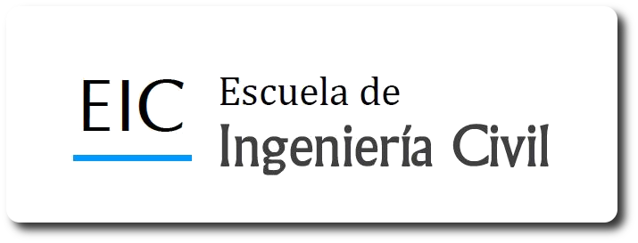
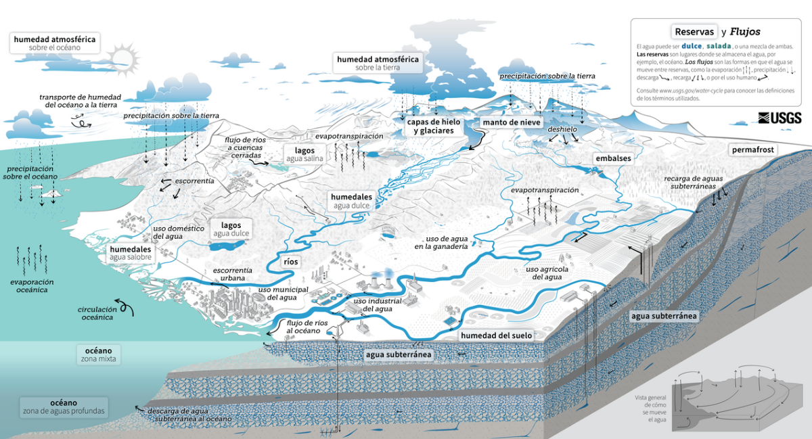

--- 
numbered: false      # ← ESTA ES LA CLAVE PARA QUITAR LA NUMERACIÓN DEL TÍTULO DE PORTADA
format:
  html:
    number-sections: false
  pdf:
    number-sections: false
--- 

# Hidrología Aplicada a la Ingeniería Civil {.unnumbered}

::: {.custom-cover} 

 
  
  

 

<h1 class="cover-title"> 
 Hidrología IC-0808 
</h1> 

<h2 class="cover-subtitle"> 
 Fundamentos, análisis estadístico y aplicaciones 
</h2> 

 
 Ing. Edwin Matarrita Segura 

 

 
 Escuela de Ingeniería Civil – Universidad de Costa Rica 

 

 
 

 

:::